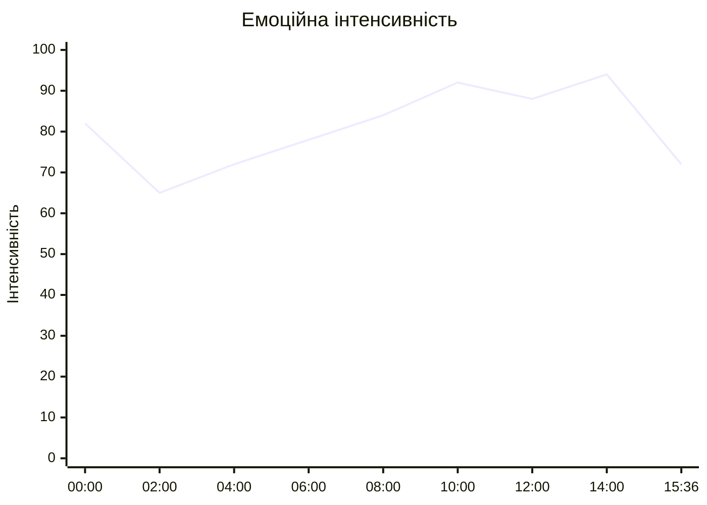
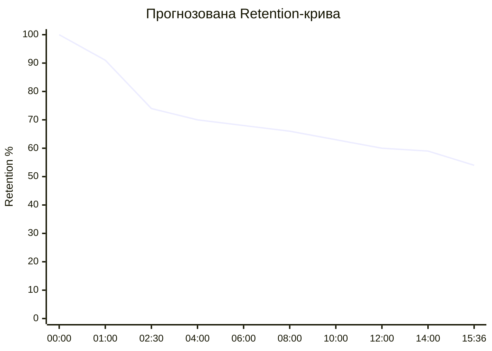
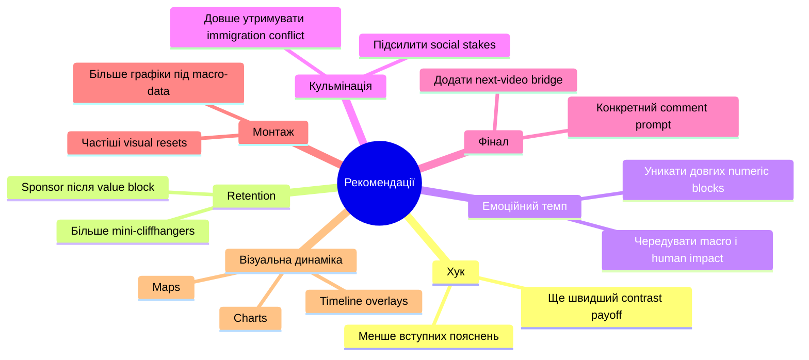

```mermaid
flowchart LR
A["00:00–00:45<br>Хук<br>London як супербагатий мегаполіс vs занепад UK"] -->
B["00:45–02:00<br>Експозиція<br>Стагнація доходів, housing crisis, productivity gap"] -->
C["02:00–03:35<br>Перша ескалація<br>Ground News інтеграція + framing про недооцінену кризу"] -->
D["03:35–06:10<br>Переломний момент<br>2008 financial crisis та austerity"] -->
E["06:10–08:40<br>Наростання напруги<br>Brexit + investment decline + COVID debt"] -->
F["08:40–11:20<br>Кульмінаційна ескалація<br>Ukraine war, energy crisis, debt explosion"] -->
G["11:20–13:50<br>Розв’язка<br>Workforce collapse, immigration tensions, riots"] -->
H["13:50–15:36<br>Фінальний висновок<br>UK як 'third-world economy attached to London'"]
```

```mermaid
flowchart LR
A["00:00<br>London = світовий економічний центр<br>Функція: shock hook"] -->
B["00:35<br>Без London UK різко біднішає<br>Функція: контраст і загроза"] -->
C["01:10<br>Housing / productivity / income crisis<br>Функція: постановка проблеми"] -->
D["02:00<br>Ground News sponsor transition<br>Функція: монетизація через контекст"] -->
E["03:45<br>2008 financial crisis + austerity<br>Функція: root cause"] -->
F["05:30<br>Lost decade та stagnating income<br>Функція: поглиблення stakes"] -->
G["06:50<br>Brexit reduces investment<br>Функція: друга хвиля кризи"] -->
H["08:00<br>COVID borrowing explosion<br>Функція: escalation"] -->
I["09:15<br>Ukraine war + energy shock<br>Функція: peak pressure"] -->
J["11:00<br>Debt servicing explodes<br>Функція: systemic collapse framing"] -->
K["12:20<br>Workforce inactivity + immigration tensions<br>Функція: соціальний конфлікт"] -->
L["14:20<br>UK attached to wealthy London<br>Функція: фінальний payoff"]
```

# Аналіз довгоформатного YouTube-відео

## 1. Сюжетна дуга (Narrative Arc)

%%{init: {'theme':'base', 'themeVariables': {
'primaryColor':'#f3f4f6',
'primaryTextColor':'#111827',
'primaryBorderColor':'#2563eb',
'lineColor':'#2563eb',
'secondaryColor':'#ffffff',
'tertiaryColor':'#f3f4f6',
'background':'#f3f4f6'
}}}%%

---

## 2. Ключові Story Beats

%%{init: {'theme':'base', 'themeVariables': {
'primaryColor':'#f3f4f6',
'primaryTextColor':'#111827',
'primaryBorderColor':'#2563eb',
'lineColor':'#2563eb',
'secondaryColor':'#ffffff',
'tertiaryColor':'#f3f4f6',
'background':'#f3f4f6'
}}}%%

---

## 3. Емоційний темп

%%{init: {'theme':'base', 'themeVariables': {
'primaryColor':'#f3f4f6',
'primaryTextColor':'#111827',
'primaryBorderColor':'#2563eb',
'lineColor':'#2563eb',
'secondaryColor':'#ffffff',
'tertiaryColor':'#f3f4f6',
'background':'#f3f4f6'
}}}%%

### Пояснення
- 00:00–00:45 — дуже сильний старт через контраст London vs UK.
- 02:00–03:30 — коротке емоційне просідання через sponsor segment.
- 08:00–14:00 — постійне наростання stakes: debt, energy crisis, workforce collapse, riots.
- 14:00–15:00 — найсильніший emotional payoff через тезу про “third-world economy attached to London”.

---

## 4. Утримання аудиторії

Retention-дані не були надані, тому нижче побудована прогнозована retention-структура на основі pacing, escalation та структури сценарію.

%%{init: {'theme':'base', 'themeVariables': {
'primaryColor':'#f3f4f6',
'primaryTextColor':'#111827',
'primaryBorderColor':'#2563eb',
'lineColor':'#2563eb',
'secondaryColor':'#ffffff',
'tertiaryColor':'#f3f4f6',
'background':'#f3f4f6'
}}}%%

### Пояснення retention-структури
- 00:00–01:00 — сильне утримання через aggressive contrast hook.
- 02:00–03:30 — ймовірний dip через sponsor integration.
- 06:00–12:00 — стабільне утримання через causal escalation.
- 12:00–15:00 — retention стабілізується через immigration conflict та фінальний payoff.

---

## 5. Піки retention

| Таймкод | Подія | Чому це може утримувати увагу | Сила піку 1–10 |
|---|---|---|---:|
| 00:00–00:45 | London vs Mississippi comparison | Шоковий контраст одразу створює curiosity gap | 9 |
| 03:45–05:00 | 2008 crisis + austerity explanation | Глядач отримує root cause всієї історії | 8 |
| 06:50–07:40 | Brexit investment collapse | Політична тема викликає дискусію | 8 |
| 09:00–10:30 | Ukraine war + energy crisis | Високі stakes і знайомий глобальний контекст | 9 |
| 11:00–12:00 | Debt servicing explodes | Великі цифри та framing “economy breaking” | 8 |
| 12:20–14:00 | Immigration tensions + riots | Найсильніший social conflict segment | 10 |
| 14:20–15:00 | “Third-world economy attached to London” | Потужний фінальний payoff | 9 |

---

## 6. Провали retention

| Таймкод | Проблема | Ймовірна причина спаду | Що покращити |
|---|---|---|---|
| 02:00–03:30 | Sponsor integration | Реклама до основного deep-dive | Перенести sponsor після першого value block |
| 05:20–06:20 | Productivity explanation | Теоретичний блок менш емоційний | Додати більше візуальних comparisons |
| 07:40–08:20 | COVID borrowing details | Багато цифр підряд | Розбавити графікою / analogies |
| 10:30–11:10 | Debt servicing discussion | Macro-economics fatigue risk | Додати sharper real-life examples |
| 14:50–15:36 | Generic CTA ending | Напруга вже завершилась | Додати next-video bridge |

---

## 7. Оцінка сегментів

| Сегмент | Таймкод | Функція | Емоційна інтенсивність | Ризик втрати уваги | Оцінка 1–10 | Що покращити |
|---|---|---|---:|---|---:|---|
| Хук | 00:00–00:45 | Shock contrast | 90 | Низький | 9 | Залишити коротким і агресивним |
| Проблема UK economy | 00:45–02:00 | Context setup | 76 | Середній | 8 | Додати ще більше visual comparisons |
| Sponsor block | 02:00–03:30 | Monetization | 58 | Високий | 5 | Пізніше розміщення |
| 2008 crisis | 03:30–05:30 | Root cause | 82 | Низький | 9 | Підсилити архівними visuals |
| Productivity / lost decade | 05:30–06:50 | Analytical depth | 70 | Середній | 7 | Більше real-world прикладів |
| Brexit escalation | 06:50–08:00 | Political conflict | 84 | Низький | 8 | Додати stronger transition |
| COVID + debt | 08:00–09:10 | Escalation | 85 | Середній | 8 | Скоротити частину цифр |
| Ukraine war impact | 09:10–11:00 | High stakes | 92 | Низький | 9 | Дуже сильний сегмент |
| Workforce collapse | 11:00–12:20 | Structural crisis | 86 | Середній | 8 | Додати personal examples |
| Immigration tensions | 12:20–14:00 | Social conflict climax | 96 | Низький | 10 | Найсильніший debate block |
| Final payoff + CTA | 14:00–15:36 | Resolution | 74 | Середній | 7 | Додати stronger final bridge |

---

## 8. Практичні рекомендації

%%{init: {'theme':'base', 'themeVariables': {
'primaryColor':'#f3f4f6',
'primaryTextColor':'#111827',
'primaryBorderColor':'#2563eb',
'lineColor':'#2563eb',
'secondaryColor':'#ffffff',
'tertiaryColor':'#f3f4f6',
'background':'#f3f4f6'
}}}%%

---

## 9. Підсумкова оцінка

| Показник | Оцінка 1–10 | Коментар |
|---|---:|---|
| Сюжетна дуга | 9 | Сильна causal escalation від London contrast до systemic collapse payoff |
| Story Beats | 9 | Кожен major beat просуває stakes або conflict |
| Емоційний темп | 8 | Є короткий dip на sponsor segment |
| Retention Structure | 8 | Дуже сильний hook і climax, але sponsor placement ризикований |
| Загальна оцінка | 8.7 | Відео працює через controversy + escalation + macro stakes |
