# Статистичний аналіз відеозвітів

## 1. Короткий executive summary

| Пункт | Висновок |
|---|---|
| Скільки відео проаналізовано | 1 |
| Скільки форматів відео | 1 (`LONG_10_20_MIN`) |
| Найсильніше відео за overall score | Video 1 — 4.1 / 5 |
| Найсильніше відео за ER Public % | Video 1 — 2.861% |
| Найсильніше відео за views per day | Video 1 — 7,096.34 |
| Найсильніша повторювана механіка | `INSUFFICIENT_DATA` для повторюваності; у єдиному звіті найсильніші механіки: `STRONG_TOPIC_DEMAND`, `CONTROVERSY_OR_DEBATE`, `STRONG_STORY_STRUCTURE` |
| Найчастіша слабкість | `INSUFFICIENT_DATA` для частотності; у єдиному звіті головні слабкості: `COMMENTS_SHOW_CONFUSION`, `COMMENTS_SHOW_TOPIC_GAP`, `NO_COMMENT_PROMPT`, `NO_NEXT_VIDEO_BRIDGE` |
| Головна стратегічна можливість | Масштабувати формат “контрастний hook + causal cascade + debate topic”, але додати pinned sources / correction comment, конкретний comment prompt і next-video bridge |
| Рівень впевненості | LOW |

---

## 2. Якість і повнота даних

| Поле | Кількість відео з даними | Кількість N/A | Коментар |
|---|---:|---:|---|
| views | 1 | 0 | Є raw views: 4,271,994 |
| likes | 1 | 0 | Є raw likes: 101,342 |
| comments_count | 1 | 0 | Є raw comments: 20,881 |
| views_per_day | 1 | 0 | Є normalized metric: 7,096.34 |
| er_public_percent | 1 | 0 | Є normalized metric: 2.861% |
| views_per_1k_subs | 1 | 0 | Є: 2,321.74 |
| hook_score | 1 | 0 | Є: 4 |
| cta_score | 1 | 0 | Є: 3 |
| ad_integration_score | 1 | 0 | Є: 4 |
| audio_score | 0 | 1 | `AUDIO_NOT_PROVIDED` |
| comment_resonance_score | 1 | 0 | Використано score `comment_trigger = 5` зі звіту як proxy для comment resonance |
| overall_video_score | 1 | 0 | Є: 4.1 / 5, excluding audio |

### Обмеження аналізу

- Є лише 1 відео, тому всі висновки позначаються як `LOW_CONFIDENCE`.
- Кореляції, кластери та статистичні залежності не будуються: `INSUFFICIENT_DATA`.
- Немає порівняння між відео, тому всі bar/scatter-графіки є описовими.
- Audio graphs skipped: `AUDIO_NOT_PROVIDED`.
- Ad load %, first ad position % і точна ad duration = `N/A` / `NO_TIMECODES`.

---

## 3. Підготовлена таблиця для графіків

| Video | Format | Views | Views/day | Like Rate % | Comment Rate % | ER Public % | Views/1k subs | Hook | CTA | Ad | Audio | Comment Resonance | Overall |
|---|---|---:|---:|---:|---:|---:|---:|---:|---:|---:|---|---:|---:|
| Video 1 | LONG_10_20_MIN | 4,271,994 | 7,096.34 | 2.3722 | 0.4888 | 2.8610 | 2,321.74 | 4 | 3 | 4 | AUDIO_NOT_PROVIDED | 5 | 4.1 |

| Label | Full title | URL |
|---|---|---|
| Video 1 | How the UK is becoming a ‘third-world’ economy | https://www.youtube.com/watch?v=OTWDzMjgsEY |

---

## 4. Рекомендовані графіки

| # | Назва графіка | Тип графіка | Поля | Для чого потрібен | Пріоритет |
|---:|---|---|---|---|---|
| 1 | Overall score by video | Mermaid bar chart | overall_video_score | Побачити загальний score єдиного відео | HIGH |
| 2 | Views per day by video | Mermaid bar chart | views_per_day | Оцінити швидкість набору переглядів з урахуванням віку | HIGH |
| 3 | ER Public % by video | Mermaid bar chart | er_public_percent | Оцінити публічне залучення | HIGH |
| 4 | ER Public % vs Views/day | Table / scatter not meaningful | er_public_percent, views_per_day | Баланс reach і engagement | HIGH, але `INSUFFICIENT_DATA` |
| 5 | Hook score by video | Mermaid bar chart | hook_score | Оцінити силу hook | HIGH |
| 6 | CTA score by video | Mermaid bar chart | cta_score | Оцінити якість CTA | HIGH |
| 7 | Score breakdown heatmap | Markdown heatmap table | scores | Побачити сильні/слабкі сторони | HIGH |
| 8 | Sentiment distribution | Skipped | sentiment_percent fields | Немає процентів sentiment у звіті | MEDIUM / `INSUFFICIENT_DATA` |
| 9 | CTA features heatmap | Markdown matrix | CTA feature booleans | Побачити використані CTA | HIGH |
| 10 | Ad load % by video | Skipped | ad_load_percent | Немає ad_load_percent | MEDIUM / `INSUFFICIENT_DATA` |

---

## 5. Графіки продуктивності

## 5.1. Views by video

- Назва графіка: Views by video
- Яке питання він відповідає: який raw reach має відео?
- Які поля використовуються: `video_label`, `views`
- Тип графіка: Mermaid bar chart
- Що видно з графіка: Video 1 має 4,271,994 views.
- Практичний висновок: raw reach високий у межах одного відео, але без когорти не можна робити порівняльний висновок.

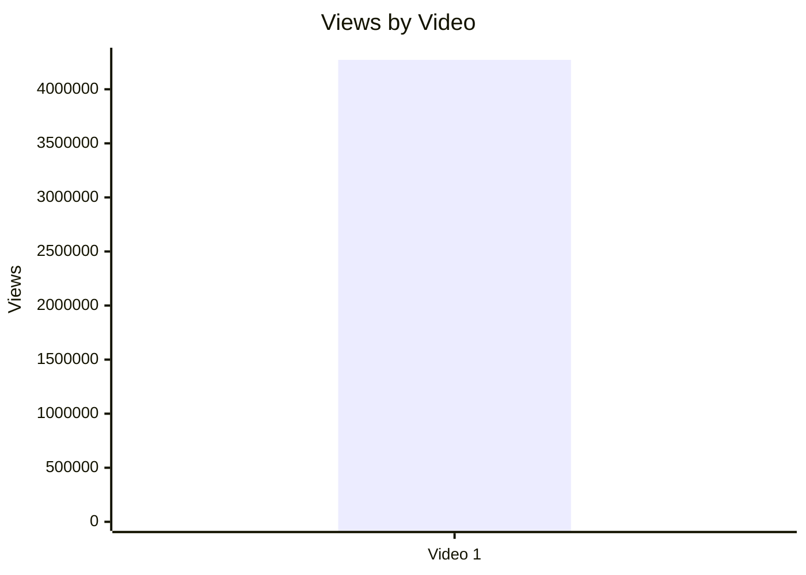

## 5.2. Views per day by video

- Назва графіка: Views per day by video
- Яке питання він відповідає: яка normalized швидкість набору переглядів?
- Які поля використовуються: `video_label`, `views_per_day`
- Тип графіка: Mermaid bar chart
- Що видно з графіка: Video 1 має 7,096.34 views/day.
- Практичний висновок: це кращий показник за raw views для майбутнього порівняння з іншими відео.

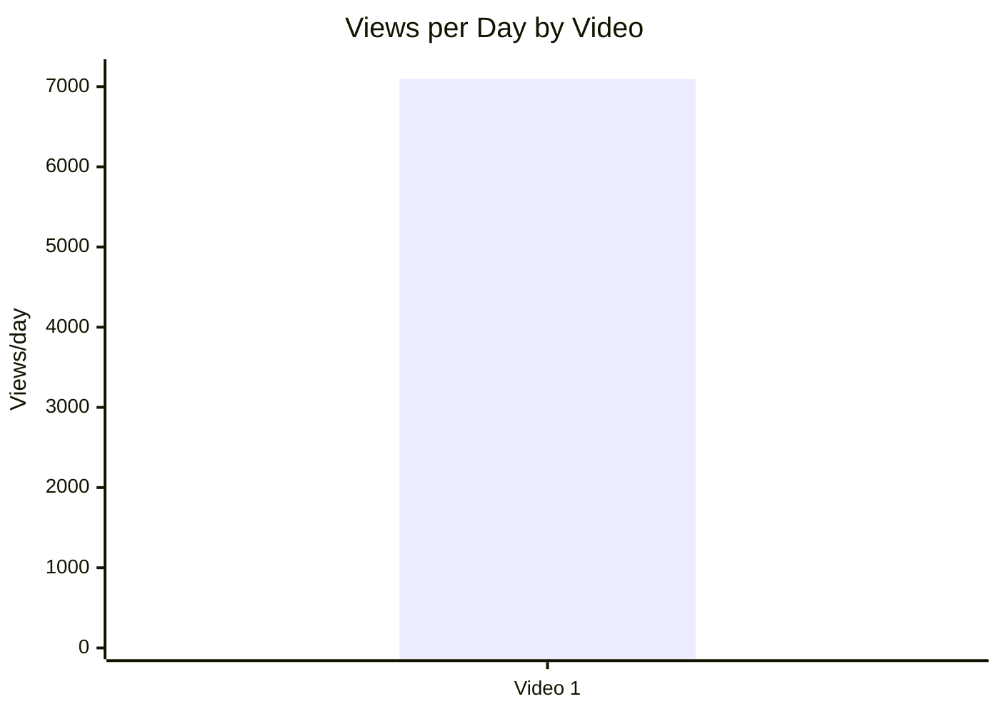

## 5.3. Views per 1k subscribers

- Назва графіка: Views per 1k subscribers
- Яке питання він відповідає: наскільки відео конвертує розмір каналу в перегляди?
- Які поля використовуються: `video_label`, `views_per_1k_subs`
- Тип графіка: Mermaid bar chart
- Що видно з графіка: Video 1 має 2,321.74 views per 1k subscribers.
- Практичний висновок: показник можна порівнювати з майбутніми відео того ж формату.

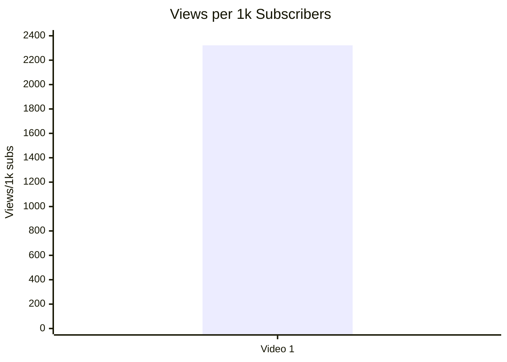

## 5.4. Performance quadrant

- Назва графіка: Performance quadrant
- Яке питання він відповідає: чи відео одночасно має охоплення і залучення?
- Які поля використовуються: `views_per_day`, `er_public_percent`
- Тип графіка: scatter / quadrant
- Що видно з графіка: `INSUFFICIENT_DATA` для quadrant, бо є тільки 1 точка.
- Практичний висновок: збережи ці поля для наступних відео; quadrant стане корисним з 5+ comparable videos.

| Video | Views/day | ER Public % | Quadrant |
|---|---:|---:|---|
| Video 1 | 7,096.34 | 2.8610 | NOT_COMPARABLE без інших відео |

---

## 6. Графіки залучення

## 6.1. ER Public % by video

- Назва графіка: ER Public % by video
- Яке питання він відповідає: який public engagement rate має відео?
- Які поля використовуються: `video_label`, `er_public_percent`
- Тип графіка: Mermaid bar chart
- Що видно з графіка: Video 1 має ER Public 2.861%.
- Практичний висновок: цей показник треба використовувати як базову точку для майбутніх відео.

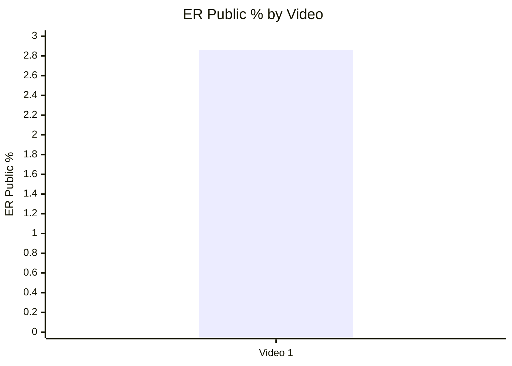

## 6.2. Like Rate % vs Comment Rate %

- Назва графіка: Like Rate % vs Comment Rate %
- Яке питання він відповідає: чи залучення більше “лайкове” чи “дискусійне”?
- Які поля використовуються: `like_rate_percent`, `comment_rate_percent`
- Тип графіка: scatter plot
- Що видно з графіка: `INSUFFICIENT_DATA` для scatter trend; є 1 точка: Like Rate 2.3722%, Comment Rate 0.4888%.
- Практичний висновок: у майбутній таблиці цей графік покаже, які теми провокують дискусію, а які лише approval.

| Video | Like Rate % | Comment Rate % | Interpretation |
|---|---:|---:|---|
| Video 1 | 2.3722 | 0.4888 | Публічне залучення є і через likes, і через коментарі; без benchmark не оцінюється як high/low |

## 6.3. Comments per 1k views

- Назва графіка: Comments per 1k views
- Яке питання він відповідає: наскільки відео провокує коментарі на 1,000 views?
- Які поля використовуються: `video_label`, `comments_per_1k_views`
- Тип графіка: Mermaid bar chart
- Що видно з графіка: Video 1 має 4.8879 comments / 1k views.
- Практичний висновок: метрика корисна для порівняння debate potential у майбутніх відео.

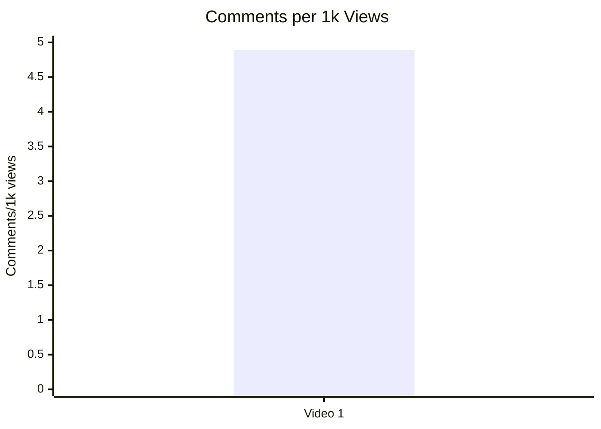

---

## 7. Графіки структури та hook

## 7.1. Hook score by video

- Назва графіка: Hook score by video
- Яке питання він відповідає: наскільки сильний hook?
- Які поля використовуються: `video_label`, `hook_score`
- Тип графіка: Mermaid bar chart
- Що видно з графіка: Video 1 має hook score 4 / 5.
- Практичний висновок: hook є сильною стороною, але потребує перевірки на більшій вибірці.

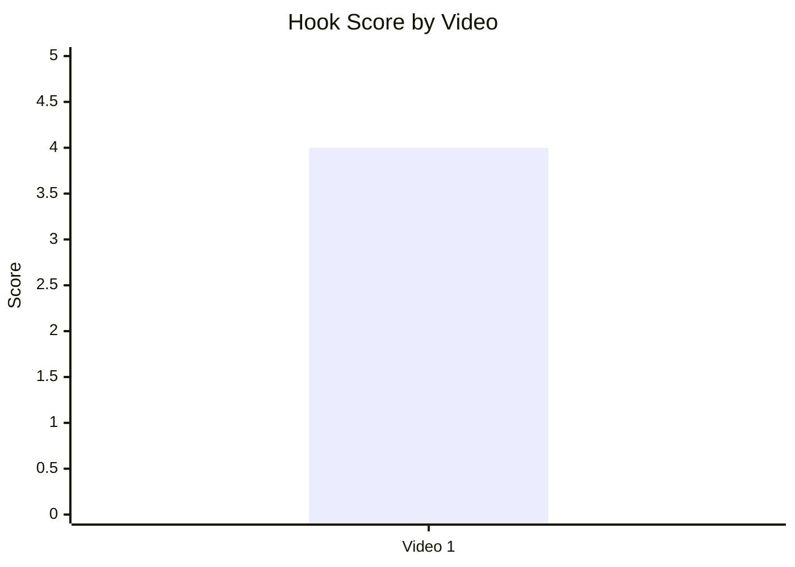

## 7.2. Hook type distribution

- Назва графіка: Hook type distribution
- Яке питання він відповідає: який тип hook використано?
- Які поля використовуються: `hook_primary_type`
- Тип графіка: Mermaid pie chart
- Що видно з графіка: 100% доступної вибірки має primary hook type `SHOCK`.
- Практичний висновок: не можна казати, що `SHOCK` працює краще за інші типи, бо є тільки 1 відео.

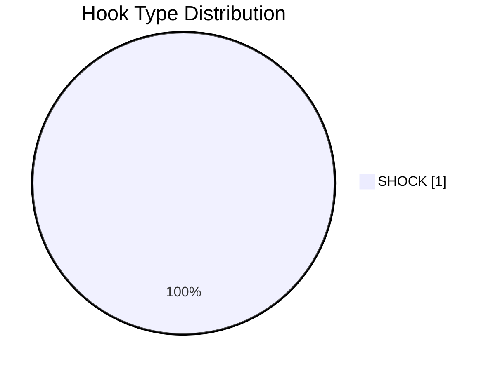

## 7.3. Time to first value vs Overall Score

- Назва графіка: Time to first value vs Overall Score
- Яке питання він відповідає: чи швидша перша цінність пов’язана з вищим результатом?
- Які поля використовуються: `time_to_first_value_seconds`, `overall_video_score`
- Тип графіка: scatter plot
- Що видно з графіка: `INSUFFICIENT_DATA`, бо `time_to_first_value_seconds = N/A / NO_TIMECODES`.
- Практичний висновок: у наступних `YT_VIDEO_ANALYSIS_V1` звітах треба нормалізувати `time_to_first_value_seconds`.

---

## 8. Графіки CTA

## 8.1. CTA score by video

- Назва графіка: CTA score by video
- Яке питання він відповідає: наскільки якісний CTA?
- Які поля використовуються: `video_label`, `cta_score`
- Тип графіка: Mermaid bar chart
- Що видно з графіка: Video 1 має CTA score 3 / 5.
- Практичний висновок: CTA є середньою зоною для покращення.

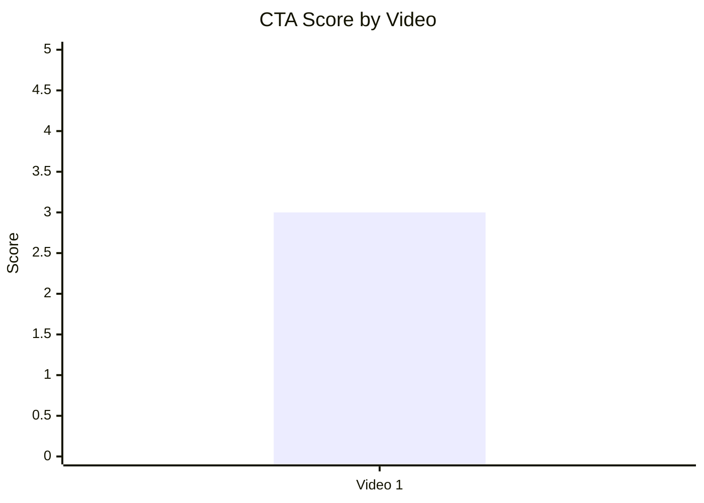

## 8.2. CTA count vs ER Public %

- Назва графіка: CTA count vs ER Public %
- Яке питання він відповідає: чи більше CTA пов’язано з кращим engagement?
- Які поля використовуються: `cta_count`, `er_public_percent`
- Тип графіка: scatter plot
- Що видно з графіка: `INSUFFICIENT_DATA` для trend; у звіті є 7 CTA rows / passive CTA entries.
- Практичний висновок: не можна робити висновок про CTA overload на основі одного відео.

| Video | CTA count | ER Public % | Interpretation |
|---|---:|---:|---|
| Video 1 | 7 | 2.8610 | NOT_COMPARABLE; CTA score 3 показує, що якість важливіша за кількість |

## 8.3. CTA features heatmap

- Назва графіка: CTA features heatmap
- Яке питання він відповідає: які CTA features присутні?
- Які поля використовуються: `has_comment_prompt`, `has_subscribe_cta`, `has_like_cta`, `has_bell_cta`, `has_next_video_bridge`
- Тип графіка: matrix / heatmap table
- Що видно з графіка: є comment/subscribe/like CTA, немає bell і next-video bridge.
- Практичний висновок: найближчий тест — додати конкретний comment prompt і next-video bridge.

| Video | Comment prompt | Subscribe | Like | Bell | Next video bridge |
|---|---|---|---|---|---|
| Video 1 | ✅ | ✅ | ✅ | ❌ | ❌ |

---

## 9. Графіки реклами / інтеграцій

Є рекламна інтеграція Ground News, але точні `ad_load_percent`, `first_ad_relative_position_percent`, `total_ad_duration_seconds` = `N/A` / `NO_TIMECODES`.

## 9.1. Ad load % by video

- Назва графіка: Ad load % by video
- Яке питання він відповідає: яке рекламне навантаження?
- Які поля використовуються: `ad_load_percent`
- Тип графіка: bar chart
- Що видно з графіка: `INSUFFICIENT_DATA`.
- Практичний висновок: потрібні timestamped ad boundaries.

| Video | Ad detected | Ad count | Ad load % |
|---|---|---:|---|
| Video 1 | YES | 1 main sponsor read + passive pinned/description/self-promo links | N/A |

## 9.2. First ad position %

- Назва графіка: First ad position %
- Яке питання він відповідає: чи реклама стоїть занадто рано?
- Які поля використовуються: `first_ad_relative_position_percent`
- Тип графіка: bar chart / scatter
- Що видно з графіка: `INSUFFICIENT_DATA`.
- Практичний висновок: у звіті є якісний висновок, що sponsor стоїть після hook/context, але до основного deep-dive; точний % недоступний.

| Video | First ad relative position % | Qualitative position |
|---|---:|---|
| Video 1 | N/A | Після opening problem setup, до основного causal analysis |

## 9.3. Ad integration score vs ER Public %

- Назва графіка: Ad integration score vs ER Public %
- Яке питання він відповідає: чи якість інтеграції пов’язана з реакцією аудиторії?
- Які поля використовуються: `ad_integration_score`, `er_public_percent`
- Тип графіка: scatter plot
- Що видно з графіка: `INSUFFICIENT_DATA` для relationship; одна точка: Ad score 4, ER 2.861%.
- Практичний висновок: Ground News integration виглядає тематично нативною, але statistical link не доведений.

| Video | Ad integration score | ER Public % |
|---|---:|---:|
| Video 1 | 4 | 2.8610 |

---

## 10. Графіки аудіо

Audio graphs skipped: `AUDIO_NOT_PROVIDED`.

## 10.1. Audio score by video

- Назва графіка: Audio score by video
- Яке питання він відповідає: яка якість аудіо?
- Які поля використовуються: `audio_score`
- Тип графіка: bar chart
- Що видно з графіка: `INSUFFICIENT_DATA`.
- Практичний висновок: для майбутніх звітів треба додати audio inspection або аудіо-нотатки.

## 10.2. Audio score vs Overall Score

- Назва графіка: Audio score vs Overall Score
- Яке питання він відповідає: чи якість аудіо пов’язана з загальним score?
- Які поля використовуються: `audio_score`, `overall_video_score`
- Тип графіка: scatter plot
- Що видно з графіка: `INSUFFICIENT_DATA`.
- Практичний висновок: не робити висновків про аудіо.

---

## 11. Графіки коментарів

## 11.1. Sentiment distribution

- Назва графіка: Sentiment distribution
- Яке питання він відповідає: як розподіляється реакція аудиторії?
- Які поля використовуються: `positive_percent`, `negative_percent`, `mixed_percent`, `neutral_percent`, `question_percent`, `request_percent`
- Тип графіка: stacked bar chart
- Що видно з графіка: `INSUFFICIENT_DATA`, бо у звіті є якісні sentiment clusters, але немає відсотків.
- Практичний висновок: для майбутньої статистики треба додати кількісну розмітку comments sentiment.

| Video | Positive % | Negative % | Mixed % | Neutral % | Question % | Request % |
|---|---:|---:|---:|---:|---:|---:|
| Video 1 | N/A | N/A | N/A | N/A | N/A | N/A |

## 11.2. Comment resonance score by video

- Назва графіка: Comment resonance score by video
- Яке питання він відповідає: наскільки сильно відео провокує коментарі?
- Які поля використовуються: `comment_resonance_score`
- Тип графіка: Mermaid bar chart
- Що видно з графіка: Video 1 має comment resonance proxy 5 / 5.
- Практичний висновок: debate-driven теми є перспективними, але потребують moderation/accuracy shield.

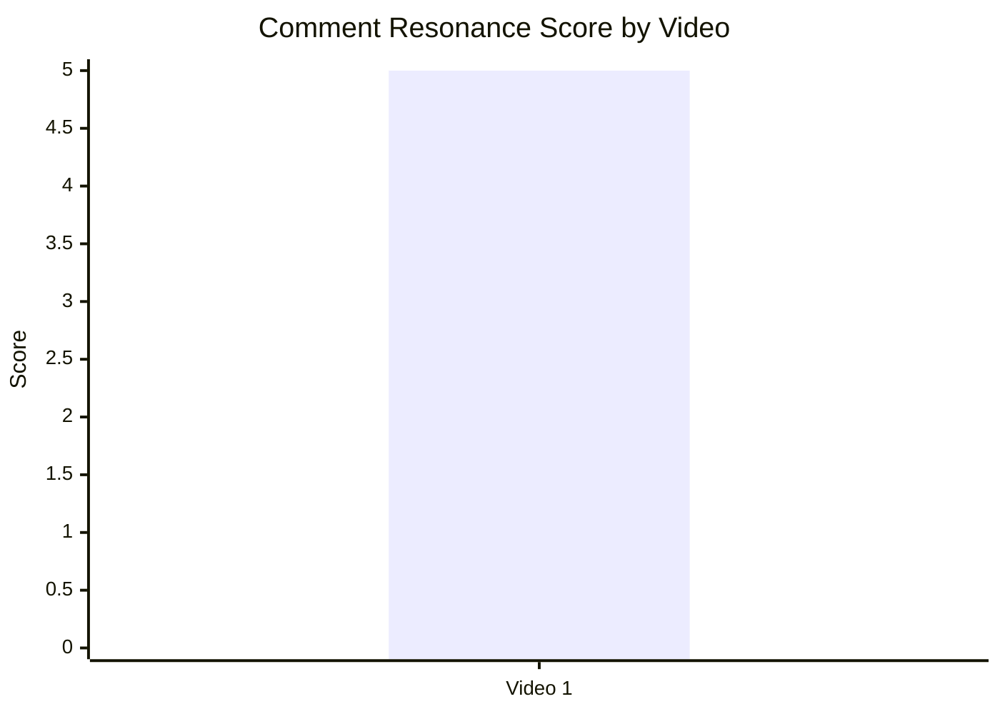

## 11.3. Top comment clusters

- Назва графіка: Top comment clusters
- Яке питання він відповідає: які теми найсильніше повторюються в коментарях?
- Які поля використовуються: qualitative cluster strength зі звіту
- Тип графіка: horizontal bar chart / table
- Що видно з графіка: найбільші clusters мають strength `HIGH`, але точних count/percent немає.
- Практичний висновок: теми immigration, accuracy/framing objections, empire/colonial karma і London-vs-UK треба врахувати в наступних сценаріях.

| Cluster | Strength | Sentiment / topic | Practical use |
|---|---|---|---|
| Immigration as main cause | HIGH | NEGATIVE / MIXED | Зробити окремий data-first follow-up |
| Accuracy / framing objections | HIGH | NEGATIVE | Додати sources / correction pinned comment |
| Empire / colonial karma | HIGH | JOKE_MEME / NEGATIVE | Враховувати identity-trigger у title/hook |
| Brexit / EU as cause | MEDIUM | MIXED / NEGATIVE | Можлива окрема серія |
| London vs rest of UK | MEDIUM | MIXED | Сильний follow-up angle |
| Praise for content quality | MEDIUM | POSITIVE | Зберігати explainer style |
| Requests for sources / more depth | MEDIUM | REQUEST | Додати source doc / bibliography |
| Sponsor / ad reaction | LOW | NEUTRAL / MIXED | Реклама не є головним friction point |
| Audio / production complaints | LOW | N/A | Немає доказів audio issue |

---

## 12. Графіки score-системи

## 12.1. Overall score by video

- Назва графіка: Overall score by video
- Яке питання він відповідає: який загальний score відео?
- Які поля використовуються: `overall_video_score`
- Тип графіка: Mermaid bar chart
- Що видно з графіка: Video 1 має 4.1 / 5.
- Практичний висновок: відео сильне за загальною оцінкою, але це не порівняльний висновок.

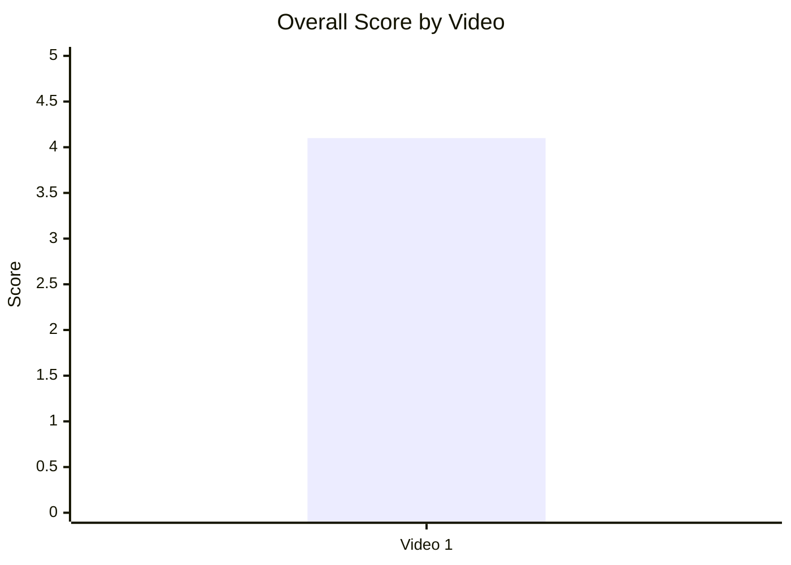

## 12.2. Score breakdown heatmap

- Назва графіка: Score breakdown heatmap
- Яке питання він відповідає: які сильні й слабкі сторони відео?
- Які поля використовуються: `hook_score`, `structure_score`, `value_density_score`, `audio_score`, `cta_score`, `ad_integration_score`, `comment_resonance_score`, `replicability_score`, `overall_video_score`
- Тип графіка: heatmap table
- Що видно з графіка: найсильніші блоки — structure і comments; слабша зона — CTA; audio unavailable.
- Практичний висновок: покращення CTA / next-video bridge є найочевиднішим оптимізаційним кроком.

| Video | Hook | Structure | Value Density | Audio | CTA | Ad | Comments | Replicability | Overall |
|---|---:|---:|---:|---|---:|---:|---:|---|---:|
| Video 1 | 4 | 5 | 4 | AUDIO_NOT_PROVIDED | 3 | 4 | 5 | N/A | 4.1 |

## 12.3. Strengths vs weaknesses count

- Назва графіка: Strengths vs weaknesses count
- Яке питання він відповідає: скільки success mechanics і missed opportunities зафіксовано?
- Які поля використовуються: `detected_mechanics`, `main_issues`
- Тип графіка: Mermaid bar chart
- Що видно з графіка: 5 success mechanics і 4 main issues.
- Практичний висновок: сильна концепція вже працює; оптимізація має бути не в темі, а в trust/CTA/session bridge.

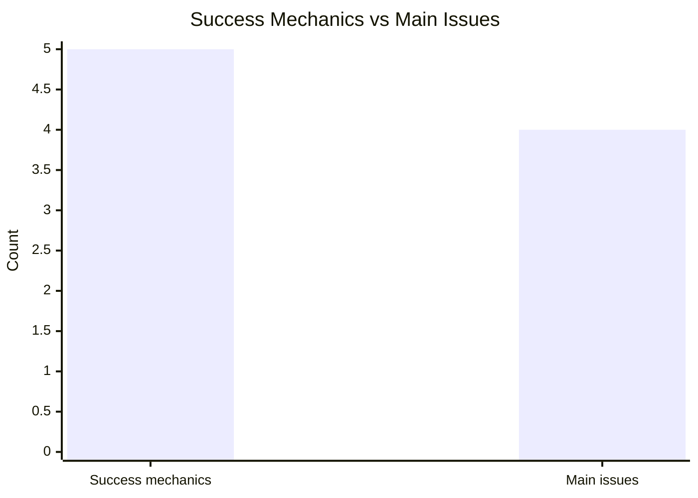

---

## 13. Кореляції та патерни

Correlation analysis skipped: fewer than 5 comparable videos.

| Pair | Correlation / Pattern | Strength | Interpretation | Confidence |
|---|---:|---|---|---|
| hook_score → overall_video_score | INSufficient data | N/A | Є тільки 1 відео, тому зв’язок не оцінюється. | LOW |
| value_density_score → er_public_percent | INSufficient data | N/A | Є тільки 1 відео. | LOW |
| cta_score → comment_rate_percent | INSufficient data | N/A | Є тільки 1 відео. | LOW |
| comment_resonance_score → er_public_percent | INSufficient data | N/A | Є тільки 1 відео. | LOW |
| views_per_day → er_public_percent | INSufficient data | N/A | Є тільки 1 відео. | LOW |
| ad_load_percent → er_public_percent | INSufficient data | N/A | `ad_load_percent = N/A`. | LOW |
| time_to_first_value_seconds → overall_video_score | INSufficient data | N/A | `time_to_first_value_seconds = N/A / NO_TIMECODES`. | LOW |

---

## 14. Висновки для контент-стратегії

| Спостереження | Дані / графік | Що це означає | Що робити |
|---|---|---|---|
| Контрастний shock hook є сильною стороною | Hook score 4; hook type `SHOCK` | Відкриття “London wealth vs UK decline” добре пакує абстрактну економіку | Тестувати shock/contrast hooks у схожих темах |
| Debate topic створює сильний comment resonance | Comment resonance proxy 5; 20,881 comments | Тема провокує дискусію й опозиційні коментарі | Додавати конкретні comment prompts, щоб направляти дискусію |
| CTA — зона покращення | CTA score 3; no next-video bridge | Є базові CTA, але вони не максимізують session depth | Додати end-screen bridge і specific comment prompt |
| Trust / accuracy shield потрібен для polarizing тем | Main issues: `COMMENTS_SHOW_CONFUSION`, `COMMENTS_SHOW_TOPIC_GAP` | Спірні claims генерують engagement, але можуть бити по довірі | Pin sources, definitions, corrections |
| Sponsor integration тематично доречна | Ad integration score 4 | Реклама не виглядає головним friction point | Зберігати native sponsor fit, але тестувати placement після першого value block |
| Audio не можна оцінити | `AUDIO_NOT_PROVIDED` | Немає підстав робити audio conclusions | Додати audio notes у наступні звіти |

---

## 15. Що тестувати далі

| Тест | Гіпотеза | На яких даних базується | Як виміряти | Пріоритет |
|---|---|---|---|---|
| Конкретний comment prompt | Specific prompt збільшить якість і керованість коментарів | CTA score 3; high comment resonance; weakness `NO_COMMENT_PROMPT` | Comment rate %, comments per 1k views, частка релевантних коментарів | HIGH |
| Next-video bridge | End-screen bridge підвищить session depth | Weakness `NO_NEXT_VIDEO_BRIDGE` | End screen CTR, next video views, session watch time (`OWNER_ONLY`) | HIGH |
| Pinned source / correction comment | Source shield зменшить confusion backlash | Main issue `COMMENTS_SHOW_CONFUSION`; accuracy cluster HIGH | Частка factual dispute comments, sentiment, pinned comment replies | HIGH |
| Sponsor placement після першого value block | Пізніша реклама зменшить disruption risk | Ad timing qualitative note; exact ad load N/A | Retention before/after ad (`OWNER_ONLY`), sponsor CTR | MEDIUM |
| Shock title vs precise title | Менш спірна назва може зменшити semantic backlash | Hook strong, але “third-world” викликав objections | CTR (`OWNER_ONLY`), comment sentiment, dislike/like signals (`OWNER_ONLY`) | MEDIUM |
| Серія London-vs-UK | Follow-up може повторити сильний discussion anchor | Cluster “London vs rest of UK” MEDIUM; success mechanics strong | Views/day, ER Public %, comments per 1k views | HIGH |
| Immigration economics follow-up | Окрема data-first тема може забрати найбільший topic gap | Cluster “Immigration as main cause” HIGH | Views/day, comment rate, sentiment split, source trust comments | HIGH |

---

## 16. Дані для експорту в таблицю / CSV

| video_label | title | format_group | views | views_per_day | like_rate_percent | comment_rate_percent | er_public_percent | views_per_1k_subs | hook_type | hook_score | cta_count | cta_score | ad_load_percent | ad_integration_score | audio_score | comment_resonance_score | overall_video_score | top_success_mechanic | top_missed_opportunity |
|---|---|---|---:|---:|---:|---:|---:|---:|---|---:|---:|---:|---:|---:|---|---:|---:|---|---|
| Video 1 | How the UK is becoming a ‘third-world’ economy | LONG_10_20_MIN | 4271994 | 7096.34 | 2.3722 | 0.4888 | 2.8610 | 2321.74 | SHOCK | 4 | 7 | 3 | N/A | 4 | AUDIO_NOT_PROVIDED | 5 | 4.1 | STRONG_TOPIC_DEMAND | COMMENTS_SHOW_CONFUSION |

```csv
video_label,title,format_group,views,views_per_day,like_rate_percent,comment_rate_percent,er_public_percent,views_per_1k_subs,hook_type,hook_score,cta_count,cta_score,ad_load_percent,ad_integration_score,audio_score,comment_resonance_score,overall_video_score,top_success_mechanic,top_missed_opportunity
Video 1,"How the UK is becoming a ‘third-world’ economy",LONG_10_20_MIN,4271994,7096.34,2.3722,0.4888,2.8610,2321.74,SHOCK,4,7,3,N/A,4,AUDIO_NOT_PROVIDED,5,4.1,STRONG_TOPIC_DEMAND,COMMENTS_SHOW_CONFUSION
```
