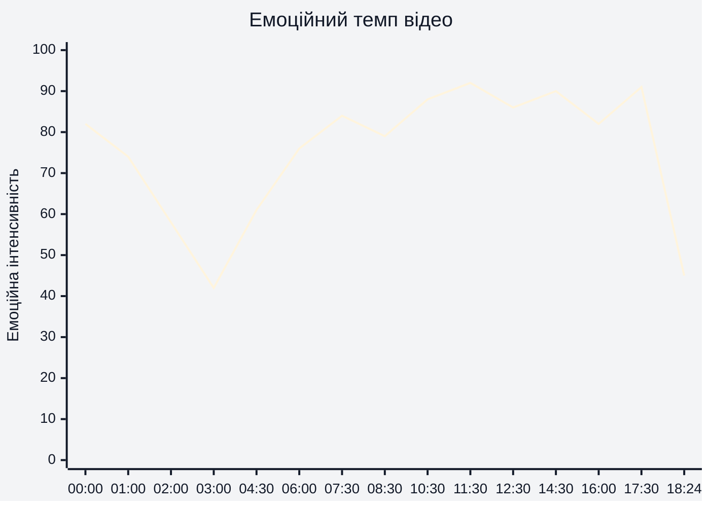
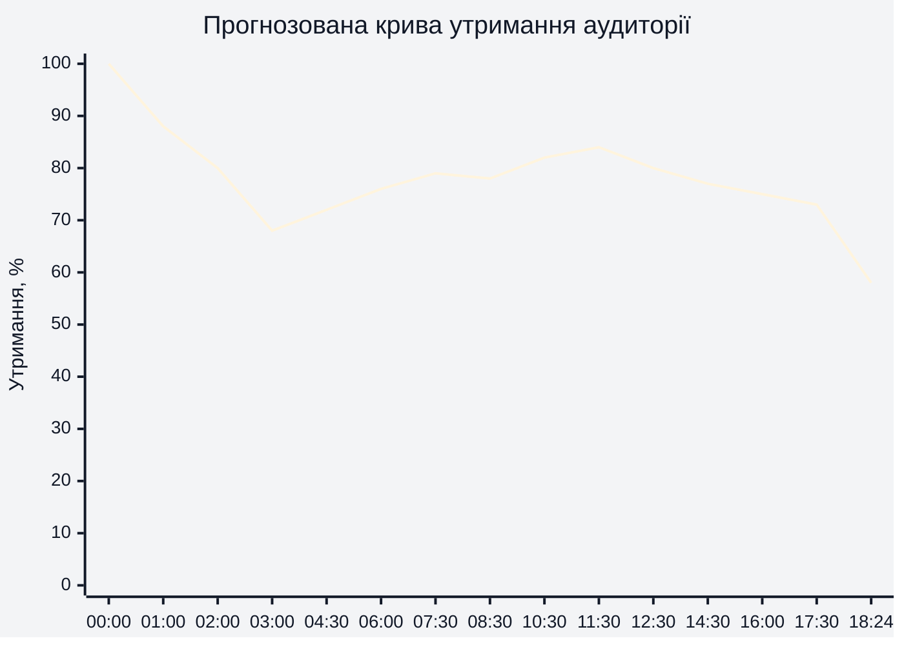
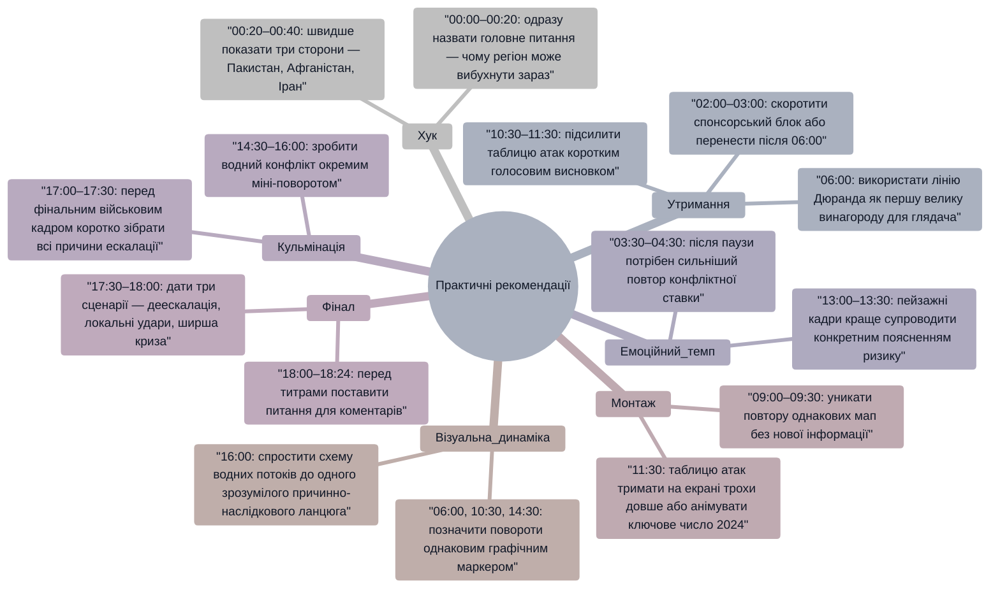

# Аналіз довгоформатного YouTube-відео

**Відео:** `Pakistan, Afghanistan, and Iran heading to war.mp4`  
**Тривалість:** 18:24  
**Тема:** геополітичний розбір напруження між Пакистаном, Афганістаном та Іраном.  
**Цільова аудиторія:** глядачі довгоформатних політичних, військово-аналітичних і геополітичних YouTube-розборів.  
**Дані утримання:** реальні retention-дані не надано, тому нижче використано прогнозовану retention-структуру на основі візуального темпу, монтажу, сюжетних поворотів і потенційних точок втрати уваги.

---

## 1. Сюжетна дуга (Narrative Arc)

```mermaid
%%{init: {'theme':'base', 'themeVariables': {
'primaryColor':'#f3f4f6',
'primaryTextColor':'#111827',
'primaryBorderColor':'#2563eb',
'lineColor':'#2563eb',
'secondaryColor':'#ffffff',
'tertiaryColor':'#f3f4f6',
'background':'#f3f4f6'
}}}%%
flowchart LR
    A["00:00–00:40<br/>Хук<br/>Відкриття через людський кадр і карту прикордоння: глядач одразу потрапляє в кризу"] -->
    B["00:40–03:20<br/>Експозиція<br/>Пояснення, що конфлікт не локальний: з’являються Іран, Пакистан, Афганістан, Карачі та медійний контекст"] -->
    C["03:20–06:30<br/>Перша ескалація<br/>Мапи Афганістану й лінії Дюранда переводять історію з новинної події в історичну проблему кордонів"] -->
    D["06:30–08:30<br/>Переломний момент<br/>Показ бойових іконок, вертольотів і прикордонних груп створює відчуття, що напруга вже перейшла у силову фазу"] -->
    E["08:30–12:30<br/>Наростання напруги<br/>Карта заповнюється акторами, з’являються Baloch Liberation Army, Jaish al-Adl і статистика атак за 2024 рік"] -->
    F["12:30–15:00<br/>Кульмінація<br/>Конфлікт розширюється: Іран, Пакистан, Афганістан, вода, договори й старі війни з’єднуються в одну систему ризиків"] -->
    G["15:00–17:30<br/>Розв’язка<br/>Відео пояснює, що проблема не лише у бойовиках, а у кордонах, воді, етнічних групах та інфраструктурі"] -->
    H["17:30–18:24<br/>Фінальний висновок<br/>Військові кадри й фінальна мапа підсумовують головний меседж: регіональна ескалація можлива через кілька паралельних тригерів"]
```

**Висновок:** сюжетна дуга працює як геополітична воронка: від конкретної тривоги на старті `00:00–00:40` відео переходить до багаторівневої системи причин `12:30–17:30`, а фінал `17:30–18:24` закріплює відчуття загрози через військові кадри та підсумкову карту.

---

## 2. Ключові Story Beats

```mermaid
%%{init: {'theme':'base', 'themeVariables': {
'primaryColor':'#f3f4f6',
'primaryTextColor':'#111827',
'primaryBorderColor':'#2563eb',
'lineColor':'#2563eb',
'secondaryColor':'#ffffff',
'tertiaryColor':'#f3f4f6',
'background':'#f3f4f6'
}}}%%
flowchart LR
    B1["00:00<br/>Людський кадр на вулиці<br/>Функція: миттєво заземлити кризу"] -->
    B2["00:30<br/>Перший прикордонний маркер Koh-e-Sabz<br/>Функція: задати географію конфлікту"] -->
    B3["01:00<br/>Карачі та іранський напрям<br/>Функція: показати, що ризик виходить за межі одного кордону"] -->
    B4["02:00–03:00<br/>Медійний і спонсорський блок<br/>Функція: пауза перед головним історичним поясненням"] -->
    B5["04:00–05:30<br/>Повернення до широкої карти регіону<br/>Функція: розширити масштаб до Афганістану й Пакистану"] -->
    B6["06:00<br/>Лінія Дюранда та числові маркери<br/>Функція: пояснити історичний корінь напруги"] -->
    B7["07:30–08:30<br/>Іконки бойових груп на кордоні<br/>Функція: перевести історію з географії у безпекову загрозу"] -->
    B8["10:30–11:30<br/>Baloch Liberation Army, Jaish al-Adl і таблиця атак<br/>Функція: дати доказову опору ескалації"] -->
    B9["12:30–13:30<br/>Мапа з багатьма акторами та гірськими проходами<br/>Функція: показати складність контролю території"] -->
    B10["14:30–16:00<br/>Водний договір і схема потоків<br/>Функція: додати другий конфліктний шар — ресурси"] -->
    B11["17:00–17:30<br/>Фінальна насичена карта й військовий кадр<br/>Функція: підвести до висновку про багатофакторну ескалацію"] -->
    B12["18:00–18:24<br/>Титри<br/>Функція: завершити після кульмінаційного блоку"]
```

**Висновок:** найсильніші сюжетні точки припадають на `06:00`, `10:30–11:30` і `14:30–16:00`, бо в ці моменти відео додає нові причинні шари: кордон, бойові організації, статистику атак і воду як окремий тригер конфлікту.

---

## 3. Емоційний темп

**Висновок:** емоційна інтенсивність стартує високо на `00:00–01:00`, просідає під час пояснювально-спонсорського блоку `02:00–03:00`, потім поступово зростає через лінію Дюранда `06:00`, бойові групи `07:30–10:30`, статистику атак `11:30` і ресурсний конфлікт `14:30–16:00`. Найвища напруга прогнозовано виникає на `11:30` та `17:30`, коли цифри й військові образи стискають аргументи в загрозу реальної ескалації.

---

## 4. Утримання аудиторії

**Висновок:** оскільки реальні retention-дані не надано, крива є прогнозованою. Найімовірніше падіння відбувається на `02:00–03:00`, де з’являється медійно-спонсорський блок, а часткове відновлення можливе на `06:00`, `10:30–11:30` і `14:30`, бо там відео вводить нові зрозумілі ставки: історичний кордон, бойові організації, статистику атак і водний конфлікт.

---

## 5. Піки утримання (retention)

| Таймкод | Подія | Чому це може утримувати увагу | Сила піку 1–10 |
|---|---|---|---:|
| `00:00–00:40` | Людський кадр і швидкий перехід до карти прикордоння | Старт одразу дає відчуття кризи, а не сухого вступу | 8 |
| `01:00–01:30` | Карачі, іранський напрям і військові кадри | Поєднання карти та силових образів швидко піднімає ставки | 7 |
| `06:00–06:30` | Лінія Дюранда з числовими маркерами | Глядач отримує пояснення, чому конфлікт має історичну глибину | 8 |
| `07:30–08:30` | Іконки озброєних груп, вертольоти й прикордонні точки | Візуально зрозумілий перехід від теорії до загрози | 8 |
| `10:30–11:30` | Baloch Liberation Army, Jaish al-Adl і таблиця зростання атак | Назви акторів і цифри створюють доказовий імпульс | 9 |
| `12:30–13:30` | Карта з багатьма акторами й гірським рельєфом | Глядач бачить складність поля бою та контролю територій | 8 |
| `14:30–16:00` | Водний договір і схема потоків | Новий ресурсний вимір оновлює інтерес після військово-прикордонного блоку | 9 |
| `17:00–17:30` | Фінальна насичена карта й військовий кадр | Працює як візуальна кульмінація: усі ризики збираються в одну картину | 8 |

---

## 6. Провали утримання (retention)

| Таймкод | Проблема | Ймовірна причина спаду | Що покращити |
|---|---|---|---|
| `02:00–03:00` | Медійно-спонсорський блок перериває основну інтригу | Глядач ще не отримав достатньо сюжетної винагороди, але вже бачить паузу в конфлікті | Скоротити блок або перенести після сильнішого повороту `06:00` |
| `03:30–04:00` | Перехідні архітектурні кадри без чіткої нової ставки | Після спонсорського блоку потрібен швидший повтор хука | Додати текстовий місток: “чому це веде до війни саме зараз” |
| `09:00–09:30` | Повторне використання мапи лінії Дюранда | Після кількох подібних карт може виникнути відчуття повтору | Додати контрастний приклад конкретної атаки або короткий людський кейс |
| `13:00–13:30` | Пейзажний гірський кадр може сповільнити темп | Візуально красиво, але інформаційна щільність нижча | Накласти підпис із конкретною функцією гірського коридору |
| `16:00–16:30` | Схема води може бути складною без швидкого підсумку | Ризик когнітивного перевантаження після договору `14:30` | Дати одну просту фразу-висновок: хто що втрачає і чому це небезпечно |
| `18:00–18:24` | Титри після військового кадру | Частина аудиторії піде одразу після кульмінації `17:30` | Перед титрами додати короткий фінальний тезовий екран або питання для коментарів |

---

## 7. Оцінка сегментів

| Сегмент | Таймкод | Функція | Емоційна інтенсивність | Ризик втрати уваги | Оцінка 1–10 | Що покращити |
|---|---|---|---:|---|---:|---|
| Хук | `00:00–00:40` | Ввести кризу через людський кадр і кордон | 82 | Низький | 8 | Додати чіткішу тезу “чому війна можлива зараз” у перші 20 секунд |
| Географічне заземлення | `00:40–01:30` | Показати Іран, Пакистан, Карачі та прикордонні точки | 74 | Низький | 8 | Швидше підписати головні сторони конфлікту |
| Медіа/спонсорська пауза | `02:00–03:00` | Дати джерельний або рекламний контекст | 42 | Високий | 5 | Скоротити або вплести в сюжет через “як медіа подають цю кризу” |
| Повернення до регіону | `03:30–05:30` | Розширити масштаб до Афганістану й Пакистану | 61 | Середній | 7 | Після паузи сильніше повторити центральну загрозу |
| Лінія Дюранда | `05:30–06:30` | Пояснити історичний корінь конфлікту | 76 | Низький | 9 | Залишити як ключовий пояснювальний вузол |
| Прикордонна ескалація | `07:30–08:30` | Показати, що напруга має силову форму | 84 | Низький | 8 | Додати короткий підсумок: “хто діє проти кого” |
| Бойові актори | `09:30–11:30` | Ввести Baloch Liberation Army, Jaish al-Adl і статистику атак | 92 | Низький | 9 | Чітко відокремити групи, їхні цілі й території дії |
| Територіальна складність | `12:00–13:30` | Показати мережу коридорів, акторів і важкодоступного рельєфу | 86 | Середній | 8 | Менше повторювати іконки без нового пояснення |
| Водний конфлікт | `14:00–16:00` | Додати ресурсну причину напруги | 90 | Середній | 9 | Візуально спростити логіку договору та потоків води |
| Фінальна ескалація | `16:00–17:30` | Зібрати всі тригери в один прогноз ризику | 91 | Низький | 8 | Додати один фінальний екран із трьома сценаріями розвитку |
| Завершення | `17:30–18:24` | Закрити відео військовим образом і титрами | 45 | Високий | 6 | Перед титрами дати сильніший фінальний висновок або CTA |

---

## 8. Практичні рекомендації

**Висновок:** найбільший потенціал покращення має зона `02:00–04:00`, бо вона йде занадто рано після хука. Найсильніші опорні точки для утримання — `06:00`, `10:30–11:30` і `14:30–16:00`; їх варто підсилювати як великі “повороти” історії.

---

## 9. Підсумкова оцінка

| Показник | Оцінка 1–10 | Коментар |
|---|---:|---|
| Сюжетна дуга | 8 | Відео добре рухається від хука `00:00` до системного пояснення `14:30–17:30`, але ранній блок `02:00–03:00` послаблює інерцію. |
| Story Beats | 8 | Ключові точки `06:00`, `10:30–11:30` і `14:30–16:00` мають чітку функцію, хоча деякі карти `09:00–09:30` повторюють уже знайомий мотив. |
| Емоційний темп | 8 | Темп сильний у військово-картографічних блоках `07:30–12:30`, а найкраще працює, коли до візуалу додаються цифри `11:30`. |
| Структура утримання (Retention Structure) | 7 | Прогнозована крива має ранній спад `02:00–03:00`, але відновлюється завдяки новим інформаційним шарам `06:00`, `10:30` і `14:30`. |
| Загальна оцінка | 8 | Сильний геополітичний розбір із якісною візуальною картою конфлікту; головне покращення — раніше дати сюжетну винагороду та скоротити першу паузу. |

---

## Короткий фінальний висновок

Відео має сильну довгоформатну структуру: старт `00:00–01:30` створює відчуття негайної кризи, середина `06:00–12:30` пояснює історичні й військові причини, а блок `14:30–17:30` додає ресурсний вимір, який робить конфлікт ширшим за звичайне прикордонне протистояння. Найбільша слабкість — ранній спад уваги `02:00–03:00`; найкращі точки для утримання — `06:00`, `10:30–11:30`, `14:30–16:00` і `17:30`.
