# Статистичний аналіз відеозвітів

## 1. Короткий executive summary

| Пункт | Висновок |
|---|---|
| Скільки відео проаналізовано | 1 |
| Скільки форматів відео | 1: `LONG_10_20_MIN` |
| Найсильніше відео за overall score | Video 1 — `3.90/5` |
| Найсильніше відео за ER Public % | Video 1 — `2.36%` |
| Найсильніше відео за views per day | Video 1 — `3512.65` |
| Найсильніша повторювана механіка | `INSUFFICIENT_DATA` для повторюваності: є лише 1 відео. У цьому відео головні механіки: `STRONG_TOPIC_DEMAND`, `CLEAR_HOOK`, `HIGH_VALUE_DENSITY`. |
| Найчастіша слабкість | `INSUFFICIENT_DATA` для частоти. У цьому відео головні missed opportunities: `NO_NEXT_VIDEO_BRIDGE`, `COMMENTS_SHOW_CONFUSION`, `AD_TOO_EARLY`. |
| Головна стратегічна можливість | Масштабувати формат “current crisis → historical root → actor map → resource layer → theory payoff”, але тестувати пізнішу рекламу, конкретний comment prompt і next-video bridge. |
| Рівень впевненості | LOW — лише 1 відео, `PARTIAL_DATA`, `NO_TIMECODES`, конфлікт метрик між файлами, comment classification `LOW_CONFIDENCE`. |

## 2. Якість і повнота даних

| Поле | Кількість відео з даними | Кількість N/A | Коментар |
|---|---:|---:|---|
| views | 1 | 0 | Є публічні views: 1 879 269. |
| likes | 1 | 0 | Є публічні likes: 38 577. |
| comments_count | 1 | 0 | Є публічні comments: 5 692. |
| views_per_day | 1 | 0 | Є розрахунок: 3512.65. |
| er_public_percent | 1 | 0 | Є розрахунок: 2.36%. |
| views_per_1k_subs | 1 | 0 | Є розрахунок: 1021.34. |
| hook_score | 1 | 0 | Є score 1–5. |
| cta_score | 1 | 0 | Є score 1–5. |
| ad_integration_score | 1 | 0 | Є score 1–5, бо реклама виявлена. |
| audio_score | 1 | 0 | Є score 1–5. |
| comment_resonance_score | 1 | 0 | Є score 1–5. |
| overall_video_score | 1 | 0 | Є weighted score: 3.90. |

### Обмеження аналізу

- `LOW_CONFIDENCE`: доступний лише один `YT_VIDEO_ANALYSIS_V1` звіт, тому всі графіки є описовими, а не порівняльно-статистичними.
- `Correlation analysis skipped`: менше ніж 5 comparable videos.
- `NO_TIMECODES`: time-to-first-value і ad timing мають низьку точність.
- `PARTIAL_DATA`: у вихідному аналізі зафіксований конфлікт метрик між файлами, тому використано значення з Comparable Summary JSON.
- `NOT_COMPARABLE`: Shorts, live або інші long-form когорти не надані.

## 3. Підготовлена таблиця для графіків

| Video | Format | Views | Views/day | Like Rate % | Comment Rate % | ER Public % | Views/1k subs | Hook | CTA | Ad | Audio | Comment Resonance | Overall |
|---|---|---:|---:|---:|---:|---:|---:|---:|---:|---:|---:|---:|---:|
| Video 1 | LONG_10_20_MIN | 1879269 | 3512.65 | 2.05 | 0.30 | 2.36 | 1021.34 | 4 | 3 | 4 | 4 | 4 | 3.90 |

| Label | Full title | URL |
|---|---|---|
| Video 1 | Pakistan, Afghanistan, and Iran heading to war? | https://www.youtube.com/watch?v=nVNBmK7a1y8 |

## 4. Рекомендовані графіки

| # | Назва графіка | Тип графіка | Поля | Для чого потрібен | Пріоритет |
|---:|---|---|---|---|---|
| 1 | Overall score by video | Mermaid bar chart | `overall_video_score` | Побачити загальну силу відео | HIGH |
| 2 | Views per day by video | Mermaid bar chart | `views_per_day` | Оцінити швидкість набору переглядів | HIGH |
| 3 | ER Public % by video | Mermaid bar chart | `er_public_percent` | Оцінити публічне залучення | HIGH |
| 4 | Performance quadrant | Table / scatter description | `views_per_day`, `er_public_percent` | Баланс охоплення і реакції | HIGH |
| 5 | Hook score by video | Mermaid bar chart | `hook_score` | Оцінити hook | HIGH |
| 6 | CTA score by video | Mermaid bar chart | `cta_score` | Оцінити CTA | HIGH |
| 7 | CTA features heatmap | Matrix table | CTA feature booleans | Побачити відсутні CTA-елементи | HIGH |
| 8 | Ad load % by video | Mermaid bar chart | `ad_load_percent` | Оцінити рекламне навантаження | HIGH |
| 9 | Audio score by video | Mermaid bar chart | `audio_score` | Оцінити аудіо | MEDIUM |
| 10 | Sentiment distribution | Mermaid pie / table | comment sentiment % | Побачити реакцію аудиторії | HIGH |
| 11 | Score breakdown heatmap | Matrix table | score fields | Побачити сильні/слабкі сторони | HIGH |

## 5. Графіки продуктивності

## 5.1. Views by video

- Назва графіка: Views by video
- Яке питання він відповідає: яке відео має найбільший raw reach?
- Які поля використовуються: `video_label`, `views`
- Тип графіка: Mermaid bar chart
- Що видно з графіка: є лише один bar, тому outlier analysis неможливий.
- Практичний висновок: raw reach високий у межах одного кейсу, але без когорти не можна сказати, чи це outlier.

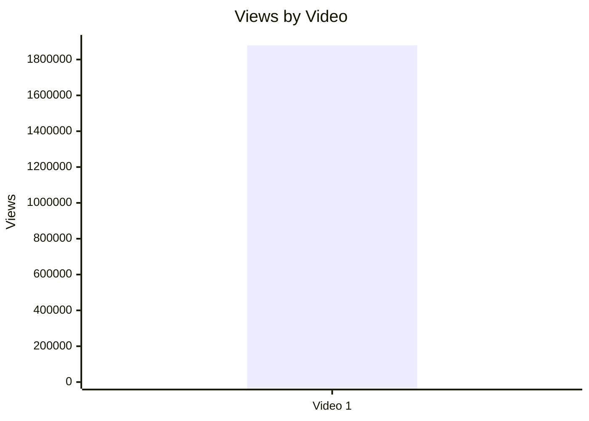

## 5.2. Views per day by video

- Назва графіка: Views per day by video
- Яке питання він відповідає: яка normalized швидкість переглядів?
- Які поля використовуються: `video_label`, `views_per_day`
- Тип графіка: Mermaid bar chart
- Що видно з графіка: Video 1 має 3512.65 views/day.
- Практичний висновок: це краща метрика для майбутнього порівняння, ніж raw views, але зараз `INSUFFICIENT_DATA` для ranking.

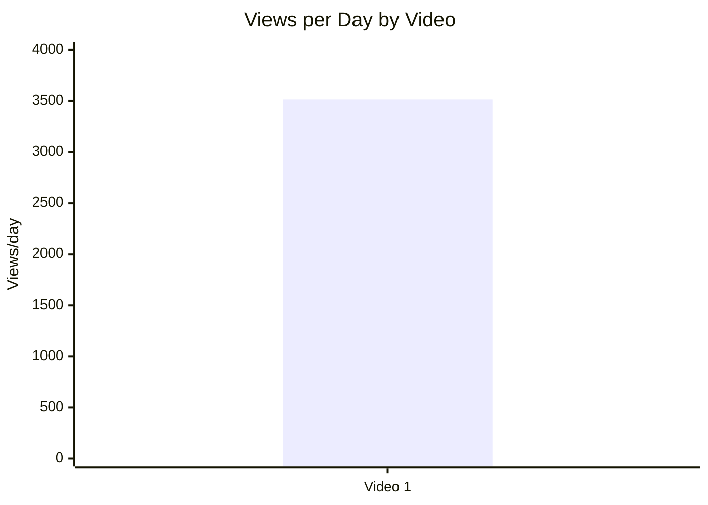

## 5.3. Views per 1k subscribers

- Назва графіка: Views per 1k subscribers
- Яке питання він відповідає: як відео конвертує розмір каналу в перегляди?
- Які поля використовуються: `video_label`, `views_per_1k_subs`
- Тип графіка: Mermaid bar chart
- Що видно з графіка: Video 1 має 1021.34 views per 1k subs.
- Практичний висновок: метрика готова для порівняння з іншими відео цього ж формату.

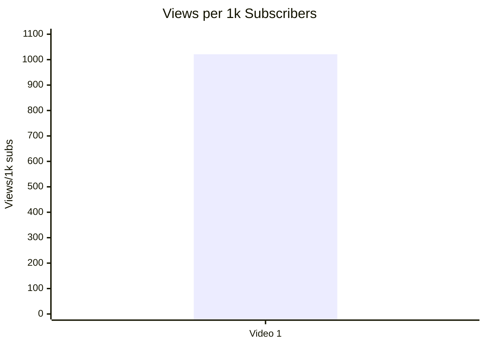

## 5.4. Performance quadrant

- Назва графіка: Performance quadrant
- Яке питання він відповідає: чи поєднує відео охоплення і залучення?
- Які поля використовуються: `views_per_day`, `er_public_percent`
- Тип графіка: scatter plot; для одного відео подано координати.
- Що видно з графіка: Video 1 = (3512.65 views/day; 2.36% ER).
- Практичний висновок: quadrant classification `INSUFFICIENT_DATA`, бо немає median/threshold у когорті.

| Video | X: views_per_day | Y: er_public_percent | Quadrant |
|---|---:|---:|---|
| Video 1 | 3512.65 | 2.36% | `INSUFFICIENT_DATA`: немає порівняльних thresholds |

## 6. Графіки залучення

## 6.1. ER Public % by video

- Назва графіка: ER Public % by video
- Яке питання він відповідає: який рівень публічного залучення?
- Які поля використовуються: `video_label`, `er_public_percent`
- Тип графіка: Mermaid bar chart
- Що видно з графіка: ER Public % = 2.36%.
- Практичний висновок: метрика корисна для майбутнього порівняння в межах `LONG_10_20_MIN`.

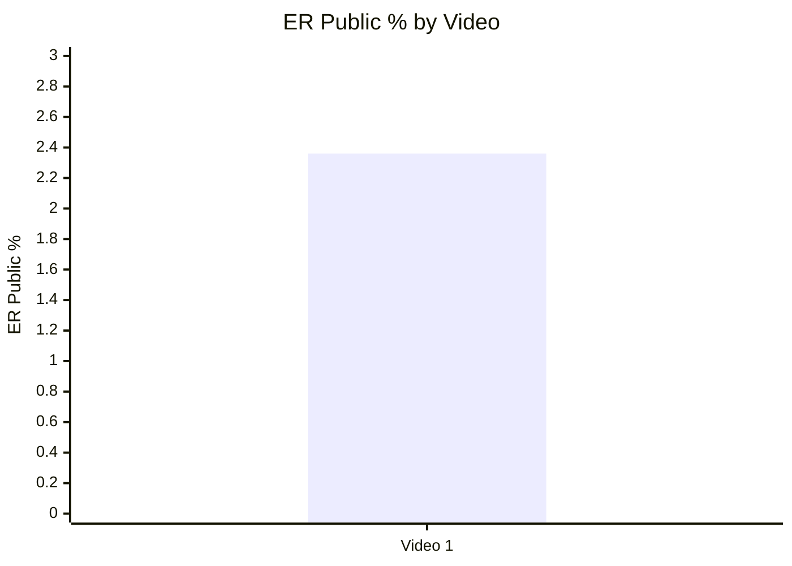

## 6.2. Like Rate % vs Comment Rate %

- Назва графіка: Like Rate % vs Comment Rate %
- Яке питання він відповідає: відео більше збирає likes чи comments?
- Які поля використовуються: `like_rate_percent`, `comment_rate_percent`
- Тип графіка: scatter plot; для одного відео подано координати.
- Що видно з графіка: Like Rate = 2.05%, Comment Rate = 0.30%.
- Практичний висновок: `INSUFFICIENT_DATA` для quadrant висновку; але comment activity додатково підтверджена 5 692 коментарями.

| Video | Like Rate % | Comment Rate % | Interpretation |
|---|---:|---:|---|
| Video 1 | 2.05% | 0.30% | Описово: likes значно більші за comments; без benchmark не оцінюється як “добре/погано”. |

## 6.3. Comments per 1k views

- Назва графіка: Comments per 1k views
- Яке питання він відповідає: скільки коментарів припадає на 1 000 переглядів?
- Які поля використовуються: `comments_per_1k_views`
- Тип графіка: Mermaid bar chart
- Що видно з графіка: 3.03 comments per 1k views.
- Практичний висновок: коментарі є важливою частиною success mechanics, але оцінити відносну силу можна тільки після додавання інших відео.

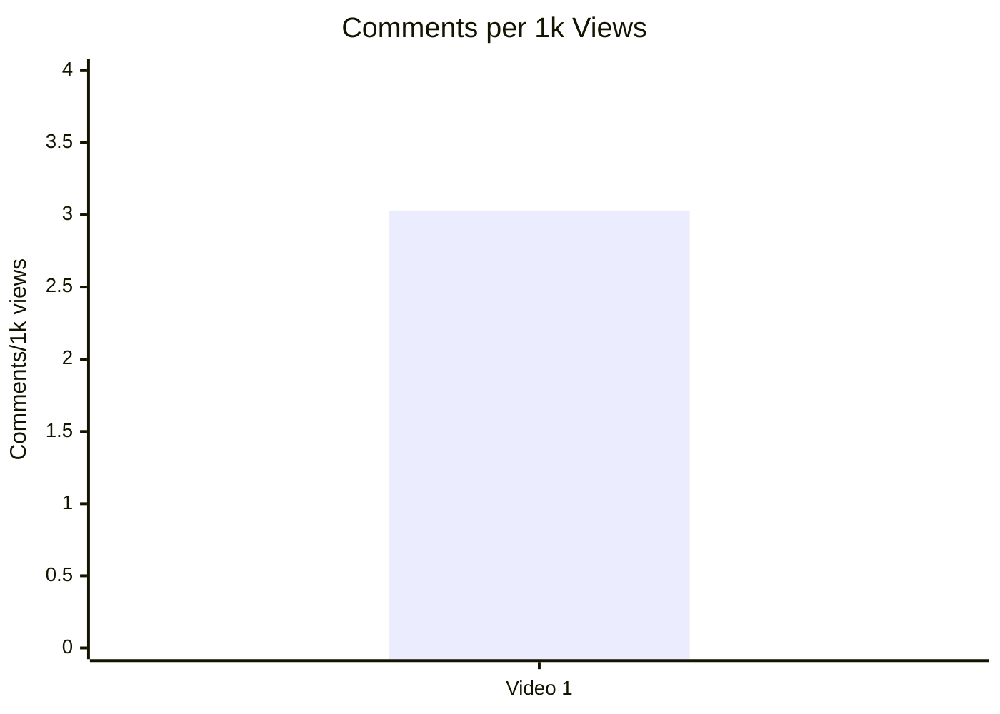

## 7. Графіки структури та hook

## 7.1. Hook score by video

- Назва графіка: Hook score by video
- Яке питання він відповідає: наскільки сильний hook?
- Які поля використовуються: `hook_score`
- Тип графіка: Mermaid bar chart
- Що видно з графіка: Hook score = 4/5.
- Практичний висновок: hook є однією з сильних сторін цього кейсу; для статистичного підтвердження потрібні інші відео.


## 7.2. Hook type distribution

- Назва графіка: Hook type distribution
- Яке питання він відповідає: який hook type використано?
- Які поля використовуються: `hook_primary_type`
- Тип графіка: Mermaid pie chart
- Що видно з графіка: є один hook type — `CONFLICT`.
- Практичний висновок: `CONFLICT` варто додати до майбутньої матриці тестів, але його не можна назвати статистично найкращим на вибірці з 1 відео.

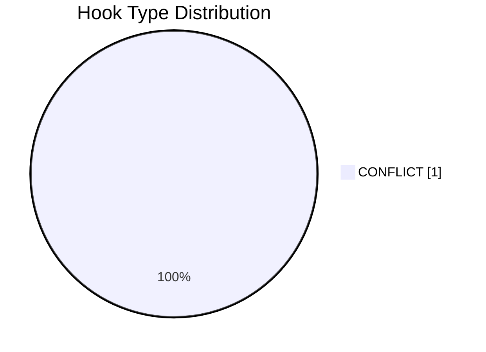

## 7.3. Time to first value vs Overall Score

- Назва графіка: Time to first value vs Overall Score
- Яке питання він відповідає: чи швидша перша цінність пов’язана з overall score?
- Які поля використовуються: `time_to_first_value`, `overall_video_score`
- Тип графіка: scatter plot
- Що видно з графіка: `time_to_first_value = ~00:20-00:40 / NO_TIMECODES / LOW_CONFIDENCE`.
- Практичний висновок: `INSUFFICIENT_DATA`, бо таймкод не можна надійно перетворити в секунди через `NO_TIMECODES / LOW_CONFIDENCE`.

| Video | time_to_first_value | overall_video_score | Status |
|---|---|---:|---|
| Video 1 | ~00:20-00:40 / NO_TIMECODES / LOW_CONFIDENCE | 3.90 | `INSUFFICIENT_DATA` для scatter |

## 8. Графіки CTA

## 8.1. CTA score by video

- Назва графіка: CTA score by video
- Яке питання він відповідає: наскільки сильна CTA-система?
- Які поля використовуються: `cta_score`
- Тип графіка: Mermaid bar chart
- Що видно з графіка: CTA score = 3/5.
- Практичний висновок: CTA — слабша зона порівняно з hook/structure/audio/ad/comments, бо немає next-video bridge і comment prompt generic.

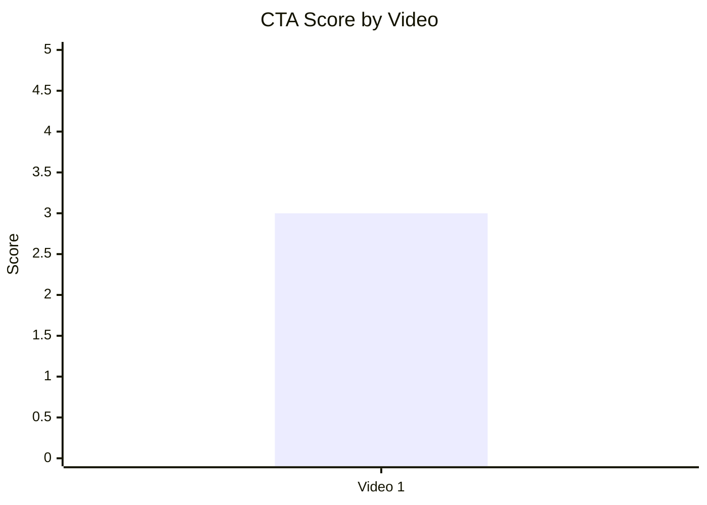

## 8.2. CTA count vs ER Public %

- Назва графіка: CTA count vs ER Public %
- Яке питання він відповідає: чи більше CTA пов’язано з ER?
- Які поля використовуються: `cta_count`, `er_public_percent`
- Тип графіка: scatter plot; для одного відео подано координати.
- Що видно з графіка: CTA count = 6, ER Public = 2.36%.
- Практичний висновок: `INSUFFICIENT_DATA` для зв’язку; є ризик CTA overload у description, але verbal outro не перевантажений.

| Video | CTA count | ER Public % | CTA overload status |
|---|---:|---:|---|
| Video 1 | 6 | 2.36% | PARTLY: багато description links; verbal outro нормальний |

## 8.3. CTA features heatmap

- Назва графіка: CTA features heatmap
- Яке питання він відповідає: які CTA-елементи присутні або відсутні?
- Які поля використовуються: `has_comment_prompt`, `has_subscribe_cta`, `has_like_cta`, `has_bell_cta`, `has_next_video_bridge`
- Тип графіка: matrix / heatmap table
- Що видно з графіка: є comment і like CTA; немає bell і next-video bridge.
- Практичний висновок: головний CTA-тест — конкретний comment prompt + end screen / next-video bridge.

| Video | Comment prompt | Subscribe | Like | Bell | Next video bridge |
|---|---|---|---|---|---|
| Video 1 | ✅ | ✅ sponsor / ❌ channel | ✅ | ❌ | ❌ |

## 9. Графіки реклами / інтеграцій

Реклама / інтеграції виявлені, тому розділ будується.

## 9.1. Ad load % by video

- Назва графіка: Ad load % by video
- Яке питання він відповідає: яке рекламне навантаження?
- Які поля використовуються: `ad_load_percent`
- Тип графіка: Mermaid bar chart
- Що видно з графіка: ad load = 7.24%.
- Практичний висновок: sponsor read не домінує за тривалістю, але missed opportunity — `AD_TOO_EARLY`.

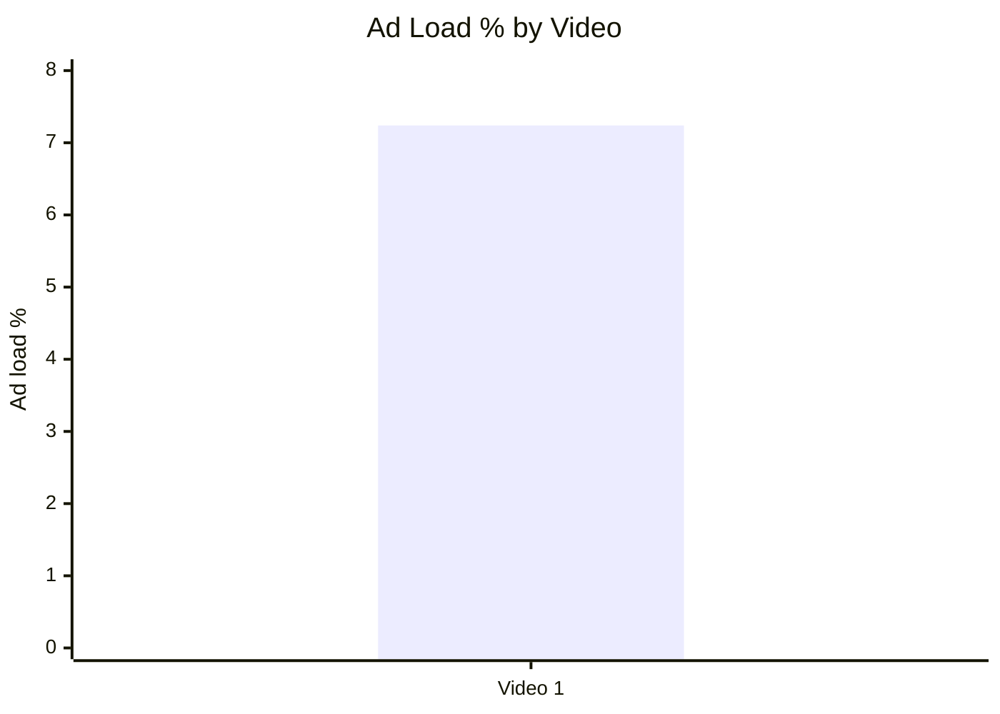

## 9.2. First ad position %

- Назва графіка: First ad position %
- Яке питання він відповідає: наскільки рано з’являється перша реклама?
- Які поля використовуються: `first_ad_relative_position_percent`
- Тип графіка: Mermaid bar chart
- Що видно з графіка: перша in-video реклама приблизно на 12.2% відео.
- Практичний висновок: реклама стоїть після hook, але до повного першого value block; варто тестувати перенесення після 4–5 хвилини.

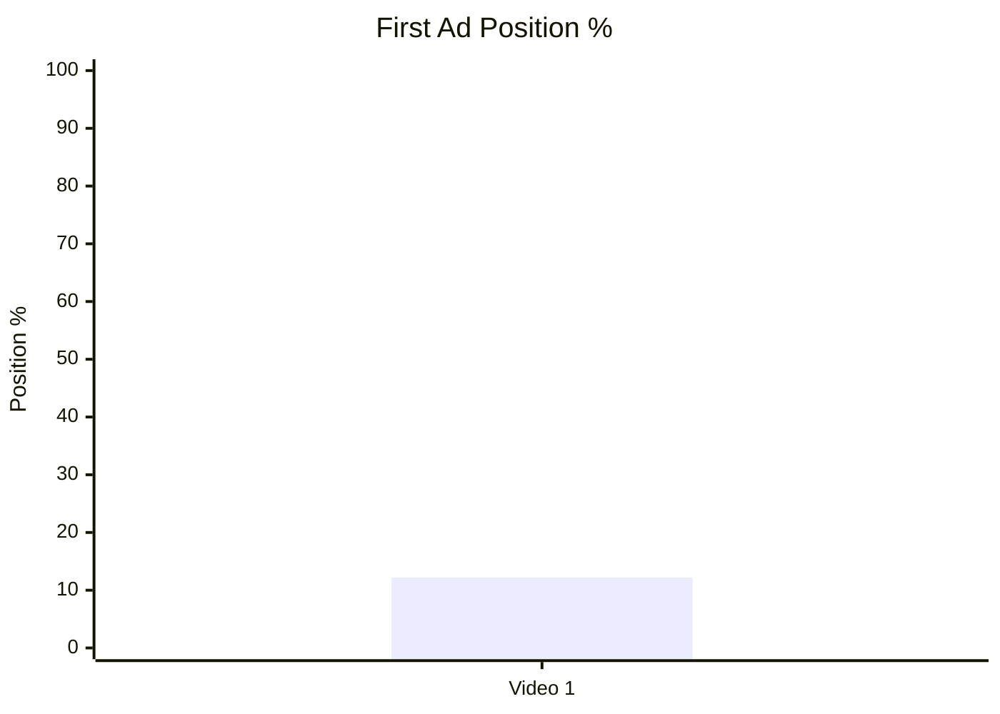

## 9.3. Ad integration score vs ER Public %

- Назва графіка: Ad integration score vs ER Public %
- Яке питання він відповідає: чи якість інтеграції пов’язана з реакцією аудиторії?
- Які поля використовуються: `ad_integration_score`, `er_public_percent`
- Тип графіка: scatter plot; для одного відео подано координати.
- Що видно з графіка: Ad score = 4/5, ER = 2.36%.
- Практичний висновок: `INSUFFICIENT_DATA` для зв’язку; у коментарях є змішана реакція на Ground News.

| Video | Ad integration score | ER Public % | Status |
|---|---:|---:|---|
| Video 1 | 4 | 2.36% | `INSUFFICIENT_DATA` для correlation |

## 10. Графіки аудіо

Audio score доступний, тому розділ будується.

## 10.1. Audio score by video

- Назва графіка: Audio score by video
- Яке питання він відповідає: наскільки сильна аудіо-якість?
- Які поля використовуються: `audio_score`
- Тип графіка: Mermaid bar chart
- Що видно з графіка: Audio score = 4/5.
- Практичний висновок: аудіо не є головним обмеженням цього відео.

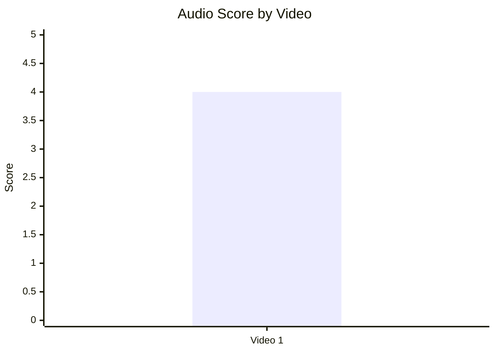

## 10.2. Audio score vs Overall Score

- Назва графіка: Audio score vs Overall Score
- Яке питання він відповідає: чи краща якість аудіо пов’язана з overall score?
- Які поля використовуються: `audio_score`, `overall_video_score`
- Тип графіка: scatter plot; для одного відео подано координати.
- Що видно з графіка: Audio = 4/5, Overall = 3.90/5.
- Практичний висновок: `INSUFFICIENT_DATA` для зв’язку; аудіо має підтримувальну, а не головну роль у цьому кейсі.

| Video | Audio score | Overall score | Status |
|---|---:|---:|---|
| Video 1 | 4 | 3.90 | `INSUFFICIENT_DATA` для correlation |

## 11. Графіки коментарів

## 11.1. Sentiment distribution

- Назва графіка: Sentiment distribution
- Яке питання він відповідає: яка структура реакції аудиторії?
- Які поля використовуються: `positive_percent`, `negative_percent`, `mixed_percent`, `neutral_percent`, `question_percent`, `request_percent`
- Тип графіка: Mermaid pie chart + table
- Що видно з графіка: найбільші частки — `NEUTRAL` 40.07%, `MIXED` 35.06%, `QUESTION` 16.61%.
- Практичний висновок: відео більше запускає обговорення/питання, ніж чисту похвалу; потрібні FAQ, glossary і конкретні comment prompts.

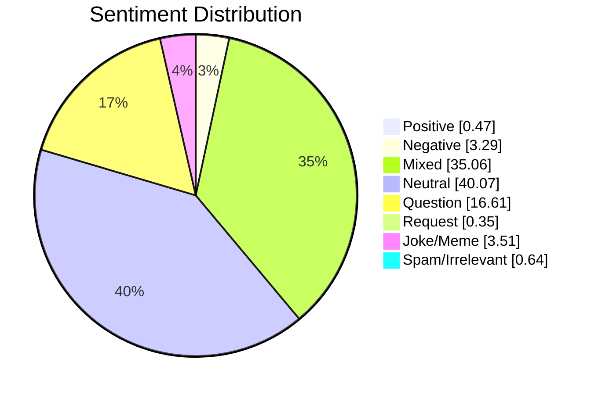

| Sentiment | Count | Percent |
|---|---:|---:|
| POSITIVE | 24 | 0.47% |
| NEGATIVE | 169 | 3.29% |
| MIXED | 1800 | 35.06% |
| NEUTRAL | 2057 | 40.07% |
| QUESTION | 853 | 16.61% |
| REQUEST | 18 | 0.35% |
| JOKE_MEME | 180 | 3.51% |
| SPAM_IRRELEVANT | 33 | 0.64% |

## 11.2. Comment resonance score by video

- Назва графіка: Comment resonance score by video
- Яке питання він відповідає: наскільки сильна реакція в коментарях?
- Які поля використовуються: `comment_resonance_score`
- Тип графіка: Mermaid bar chart
- Що видно з графіка: Comment resonance = 4/5.
- Практичний висновок: коментарі — сильний engagement asset, але токсичність і accuracy disputes треба краще направляти.

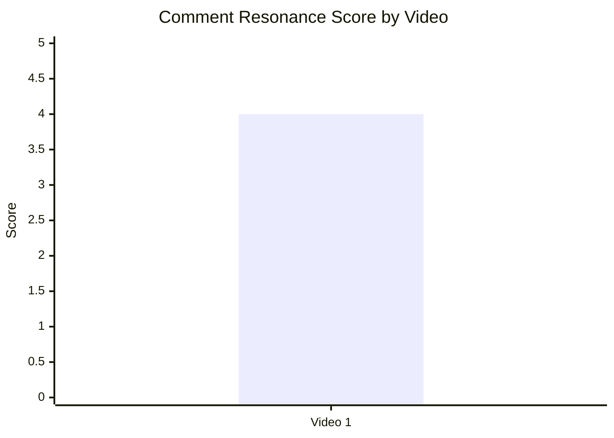

## 11.3. Top comment clusters

- Назва графіка: Top comment clusters
- Яке питання він відповідає: що найчастіше обговорюють?
- Які поля використовуються: cluster name, count, percent
- Тип графіка: horizontal bar chart / table
- Що видно з графіка: найбільший cluster — geopolitical debate / identity conflict.
- Практичний висновок: найсильніший comment trigger — конфлікт ідентичностей, але треба зменшувати confusion через pinned FAQ і source notes.

| Cluster | Count | Percent | Practical meaning |
|---|---:|---:|---|
| Geopolitical debate / identity conflict | 1772 | 34.51% | Основний двигун коментарів; високий debate potential. |
| Questions / clarification | 853 | 16.61% | Потрібні FAQ, glossary, source notes. |
| Accuracy / map / terminology criticism | 136 | 2.65% | Потрібна перевірка карт/термінів перед публікацією. |
| Sponsor reaction | 33 | 0.64% | Sponsor brand поляризує частину аудиторії. |
| Timely rewatch / aged well | 28 | 0.55% | Є evergreen + future-validation effect. |
| Praise for explanation | 24 | 0.47% | Похвала є, але не домінує над дебатами. |

## 12. Графіки score-системи

## 12.1. Overall score by video

- Назва графіка: Overall score by video
- Яке питання він відповідає: яке відео найсильніше за загальним балом?
- Які поля використовуються: `overall_video_score`
- Тип графіка: Mermaid bar chart
- Що видно з графіка: Overall = 3.90/5.
- Практичний висновок: це strong single-case baseline для майбутніх порівнянь.

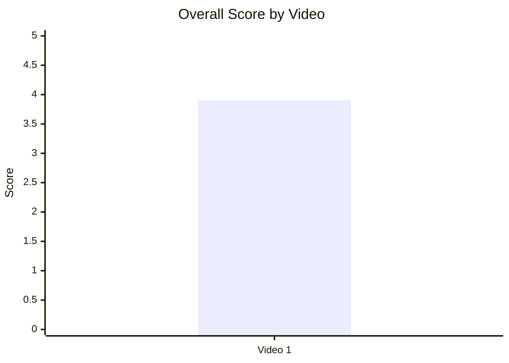

## 12.2. Score breakdown heatmap

- Назва графіка: Score breakdown heatmap
- Яке питання він відповідає: де сильні й слабкі сторони відео?
- Які поля використовуються: score fields 1–5
- Тип графіка: heatmap / matrix table
- Що видно з графіка: найнижчий score — CTA = 3; більшість інших score = 4.
- Практичний висновок: перші тести мають бути CTA/session-extension, а не audio або core structure.

| Video | Hook | Structure | Value Density | Audio | CTA | Ad | Comments | Replicability | Overall |
|---|---:|---:|---:|---:|---:|---:|---:|---:|---:|
| Video 1 | 4 | 4 | 4 | 4 | 3 | 4 | 4 | 4 | 3.90 |

## 12.3. Strengths vs weaknesses count

- Назва графіка: Strengths vs weaknesses count
- Яке питання він відповідає: скільки зафіксовано success mechanics і missed opportunities?
- Які поля використовуються: кількість success mechanics, кількість missed opportunities
- Тип графіка: Mermaid bar chart
- Що видно з графіка: 5 success mechanics і 5 missed opportunities.
- Практичний висновок: відео має сильну core-механіку, але є чіткі optimization points.

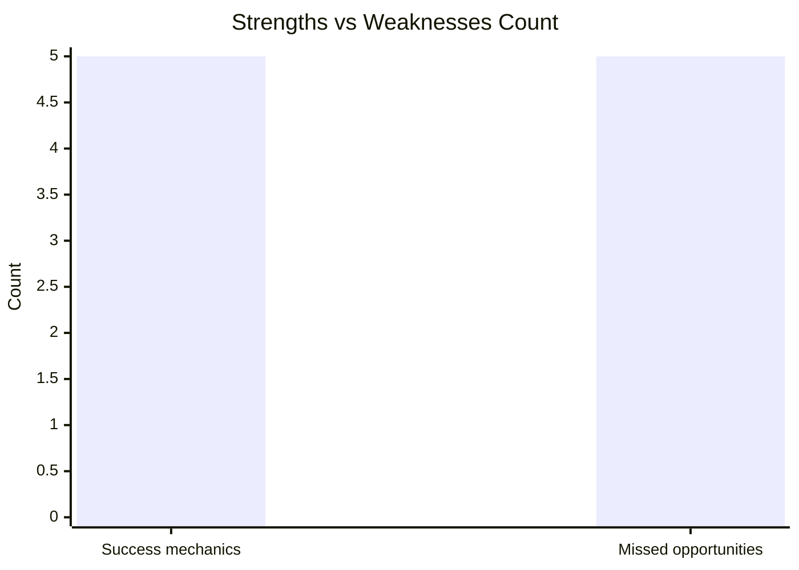

## 13. Кореляції та патерни

Correlation analysis skipped: fewer than 5 comparable videos.

| Pair | Correlation / Pattern | Strength | Interpretation | Confidence |
|---|---:|---|---|---|
| hook_score → overall_video_score | `INSUFFICIENT_DATA` | N/A | Є лише 1 відео; можна описати сильний hook, але не correlation. | LOW |
| value_density_score → er_public_percent | `INSUFFICIENT_DATA` | N/A | Є лише 1 відео; pattern не підтверджується статистично. | LOW |
| cta_score → comment_rate_percent | `INSUFFICIENT_DATA` | N/A | CTA score 3 і comment rate 0.30%, але зв’язок не можна оцінити. | LOW |
| comment_resonance_score → er_public_percent | `INSUFFICIENT_DATA` | N/A | Коментарі активні, але без інших відео немає порівняння. | LOW |
| views_per_day → er_public_percent | `INSUFFICIENT_DATA` | N/A | Немає cohort median або thresholds. | LOW |
| ad_load_percent → er_public_percent | `INSUFFICIENT_DATA` | N/A | Реклама є, але її вплив не можна виміряти на одному відео. | LOW |
| time_to_first_value_seconds → overall_video_score | `INSUFFICIENT_DATA` | N/A | `NO_TIMECODES`, немає seconds field. | LOW |

## 14. Висновки для контент-стратегії

| Спостереження | Дані / графік | Що це означає | Що робити |
|---|---|---|---|
| `CONFLICT` hook працює як сильний single-case baseline | Hook score 4/5; hook type `CONFLICT`; views/day 3512.65 | Відео швидко продає stakes: три держави, бойовики, кордони, ризик війни. | Тестувати conflict-map opening у наступних long-form geopolitical videos. |
| Основна слабкість — CTA/session extension | CTA score 3/5; next-video bridge ❌ | Відео збирає увагу, але не веде її в наступний перегляд. | Додати verbal next-video bridge + end screen + pinned comment з пов’язаним відео. |
| Реклама не надмірна за load, але рання | Ad load 7.24%; first ad position ~12.2%; issue `AD_TOO_EARLY` | Sponsor read стоїть до головного value block. | Тестувати full sponsor read після першого завершеного value block. |
| Коментарі дають сильний debate signal | Comment resonance 4/5; debate cluster 34.51%; questions 16.61% | Тема провокує discussion, але частина реакції хаотична/токсична. | Додати конкретне питання в outro і pinned FAQ/glossary. |
| Accuracy disputes — реальна operational issue | Accuracy/map/terminology cluster 2.65%; `COMMENTS_SHOW_CONFUSION` | Навіть невелика частка corrections може зміщувати фокус дискусії. | Перед публікацією робити map/terminology review і on-screen source notes. |
| Audio не є головним bottleneck | Audio score 4/5 | Оптимізація аудіо менш пріоритетна за CTA і sponsor timing. | Не витрачати перші тести на аудіо, окрім точкових покращень дикції/темпу. |

## 15. Що тестувати далі

| Тест | Гіпотеза | На яких даних базується | Як виміряти | Пріоритет |
|---|---|---|---|---|
| Conflict-map opening | Якщо почати з 3 акторів + 3 інцидентів + головного питання, early retention буде сильнішим. | Hook score 4/5; success mechanics `CLEAR_HOOK`, `STRONG_TOPIC_DEMAND`. | Compare early retention 0:00–0:30 між відео цього формату. | HIGH |
| Full sponsor read після першого value block | Пізніша реклама зменшить disruption і негатив у коментарях. | `AD_TOO_EARLY`, ad load 7.24%, sponsor reaction cluster 0.64%. | Retention dip around sponsor segment; sponsor-negative comments %. | HIGH |
| Конкретний comment prompt | Конкретне питання зменшить хаотичні суперечки й збільшить релевантні коментарі. | CTA score 3/5; generic “leave a comment”; debate 34.51%; questions 16.61%. | Comment relevance %, question/answer cluster %, comment rate %. | HIGH |
| Pinned FAQ / correction comment | FAQ зменшить repeated confusion і accuracy disputes. | `COMMENTS_SHOW_CONFUSION`, accuracy cluster 2.65%, questions 16.61%. | Частка correction comments після pinned FAQ; likes/replies на FAQ. | HIGH |
| Next-video bridge | Перехід на пов’язане відео збільшить session time. | `NO_NEXT_VIDEO_BRIDGE`; CTA heatmap: next-video bridge ❌. | End screen CTR, next video clicks, session duration. | HIGH |
| Серія “single battle space” | Повторення формули може створити evergreen crisis library. | Success mechanics: `HIGH_VALUE_DENSITY`, `EVERGREEN_VALUE`, “aged well” cluster 0.55%. | Views/day через 30/90/180 днів; returning comments after news events. | MEDIUM |

## 16. Дані для експорту в таблицю / CSV

| video_label | title | format_group | views | views_per_day | like_rate_percent | comment_rate_percent | er_public_percent | views_per_1k_subs | hook_type | hook_score | cta_count | cta_score | ad_load_percent | ad_integration_score | audio_score | comment_resonance_score | overall_video_score | top_success_mechanic | top_missed_opportunity |
|---|---|---|---:|---:|---:|---:|---:|---:|---|---:|---:|---:|---:|---:|---:|---:|---:|---|---|
| Video 1 | Pakistan, Afghanistan, and Iran heading to war? | LONG_10_20_MIN | 1879269 | 3512.65 | 2.05 | 0.30 | 2.36 | 1021.34 | CONFLICT | 4 | 6 | 3 | 7.24 | 4 | 4 | 4 | 3.90 | STRONG_TOPIC_DEMAND | NO_NEXT_VIDEO_BRIDGE |

```csv
video_label,title,format_group,views,views_per_day,like_rate_percent,comment_rate_percent,er_public_percent,views_per_1k_subs,hook_type,hook_score,cta_count,cta_score,ad_load_percent,ad_integration_score,audio_score,comment_resonance_score,overall_video_score,top_success_mechanic,top_missed_opportunity
Video 1,"Pakistan, Afghanistan, and Iran heading to war?",LONG_10_20_MIN,1879269,3512.65,2.05,0.30,2.36,1021.34,CONFLICT,4,6,3,7.24,4,4,4,3.90,STRONG_TOPIC_DEMAND,NO_NEXT_VIDEO_BRIDGE
```
