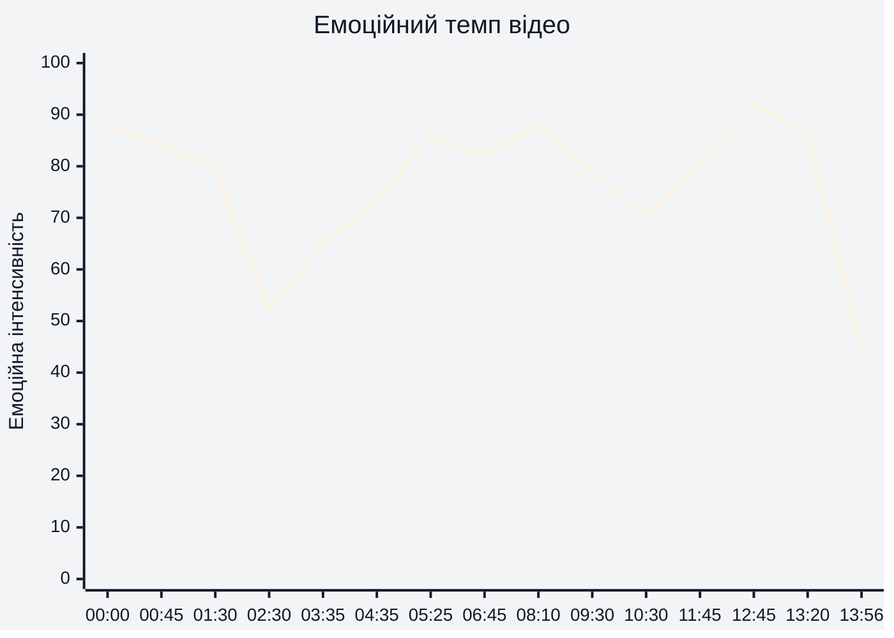
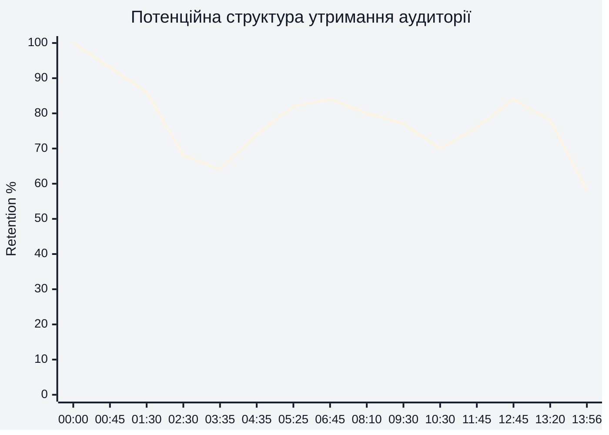
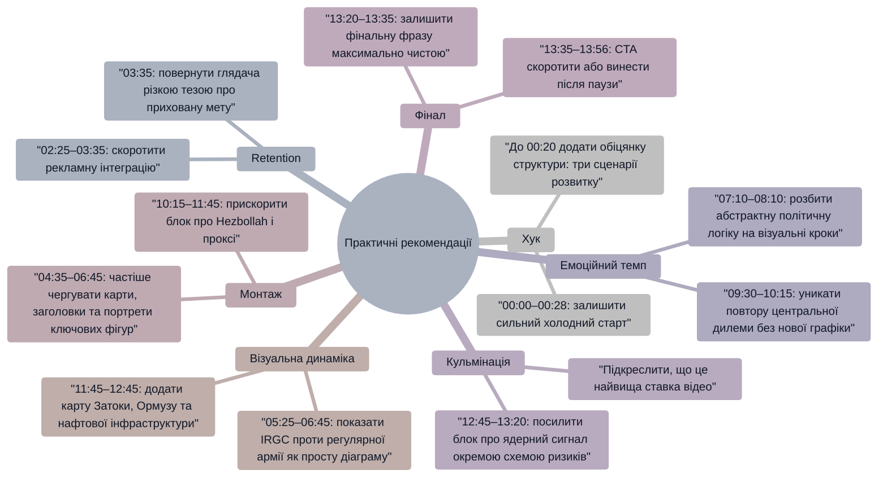

# Аналіз довгоформатного YouTube-відео

## 1. Сюжетна дуга (Narrative Arc)

```mermaid
%%{init: {'theme':'base', 'themeVariables': {
'primaryColor':'#f3f4f6',
'primaryTextColor':'#111827',
'primaryBorderColor':'#2563eb',
'lineColor':'#2563eb',
'secondaryColor':'#ffffff',
'tertiaryColor':'#f3f4f6',
'background':'#f3f4f6'
}}}%%
flowchart LR
    A["00:00–00:28<br/>Хук<br/>Холодна війна між Ізраїлем та Іраном раптово стає відкритою війною"] -->
    B["00:28–01:45<br/>Експозиція<br/>Пояснення перших ударів, цілей в Ірані та масштабу атаки"] -->
    C["01:45–03:35<br/>Перша ескалація<br/>Іран відповідає дронами й ракетами; США публічно дистанціюються"] -->
    D["03:35–05:25<br/>Переломний момент<br/>Автор переходить від новинного викладу до питання: чи є мета лише ядерна програма"] -->
    E["05:25–08:10<br/>Наростання напруги<br/>Розбір сценарію зміни режиму, IRGC, внутрішнього розколу та політичного тиску на Нетаньягу"] -->
    F["08:10–11:45<br/>Кульмінація<br/>Дилема: стримування проти ескалації, виснаження ППО, роль проксі та ризик втягування США"] -->
    G["11:45–13:20<br/>Розв’язка<br/>Найризикованіші варіанти відповіді Ірану: удари по Затоці, Ормузька протока, ядерний сигнал"] -->
    H["13:20–13:56<br/>Фінальний висновок<br/>Чим довше тривають удари, тим менше вікно для деескалації"]
```

Відео побудоване як аналітична ескалаційна спіраль: від шокового повідомлення в 00:00–00:28 до дедалі ширшого набору сценаріїв у 08:10–13:20. Найсильніша частина дуги — перехід у 05:25–08:10, де конфлікт перестає виглядати як окремий обмін ударами й подається як боротьба за політичне виживання обох сторін.

## 2. Ключові Story Beats

```mermaid
%%{init: {'theme':'base', 'themeVariables': {
'primaryColor':'#f3f4f6',
'primaryTextColor':'#111827',
'primaryBorderColor':'#2563eb',
'lineColor':'#2563eb',
'secondaryColor':'#ffffff',
'tertiaryColor':'#f3f4f6',
'background':'#f3f4f6'
}}}%%
flowchart LR
    A["00:00<br/>Війна почалась<br/>Функція: миттєвий хук"] -->
    B["00:28<br/>Перелік ударів по Ірану<br/>Функція: масштабування загрози"] -->
    C["01:05<br/>Ізраїль діє майже безперешкодно<br/>Функція: показ переваги однієї сторони"] -->
    D["01:45<br/>Іранська відповідь дронами й ракетами<br/>Функція: запуск взаємної ескалації"] -->
    E["02:25<br/>США не втручаються напряму<br/>Функція: додати дипломатичну невизначеність"] -->
    F["03:35<br/>Перехід від новин до стратегії<br/>Функція: зміна жанру з репортажу на аналіз"] -->
    G["04:35<br/>Без США Ізраїль не може повністю знищити ядерну програму<br/>Функція: обмеження військової перемоги"] -->
    H["05:25<br/>Версія про зміну режиму<br/>Функція: головний аналітичний поворот"] -->
    I["07:10<br/>Іран теж може тиснути на політичну систему Ізраїлю<br/>Функція: симетрія стратегій"] -->
    J["08:10<br/>Стримування проти ескалації<br/>Функція: центральна дилема відео"] -->
    K["10:15<br/>Проксі слабші або політично обмежені<br/>Функція: пояснити, чому сценарій відрізняється від минулих конфліктів"] -->
    L["12:45<br/>Ядерний тест або вихід з договору<br/>Функція: максимальна ставка перед фіналом"]
```

Найважливіший story beat — 05:25, де тема зміщується від ударів по ядерній програмі до припущення про зміну режиму. Це робить середину відео не просто поясненням подій, а гіпотезою про приховану стратегічну мету.

## 3. Емоційний темп

Емоційна інтенсивність різко стартує в 00:00–01:30 через формулювання про перехід до відкритої війни, вибухи, удари по ядерних і військових об’єктах. Найнижча точка — 02:30–03:35, де рекламний інтегрований блок тимчасово знижує драматургічну напругу. Пік припадає на 12:45–13:20, коли відео переходить до сценарію ядерного тесту, виходу з договору про нерозповсюдження та звуження вікна деескалації.

## 4. Утримання аудиторії

Реальні retention-дані або скріншот YouTube Studio не надані. Нижче — потенційна retention-структура, побудована за сценарною логікою, темпом монтажу, місцями інтеграції реклами та силою інформаційних поворотів.

Потенційно найсильніше утримання має бути в 00:00–01:30 завдяки високій новинній напрузі, а також у 05:25–08:10 через аналітичний поворот про зміну режиму. Найризикованіша зона — 02:30–03:35, бо рекламна інтеграція перериває основну сюжетну дугу до того, як глядач отримує повну відповідь на питання “що буде далі?”.

## 5. Піки retention

| Таймкод | Подія | Чому це може утримувати увагу | Сила піку 1–10 |
|---|---|---|---|
| 00:00–00:28 | Формулювання “холодна війна стала гарячою” | Миттєво піднімає ставки й обіцяє пояснення великого перелому | 9 |
| 00:28–01:20 | Перелік ударів по Тегерану, Натанзу, Араку, Парчину та інших об’єктах | Велика кількість конкретних цілей створює відчуття масштабу й терміновості | 8 |
| 01:20–01:45 | Ізраїльські літаки й операції Mossad подаються як майже безперешкодні | Дає сильний контраст сил і провокує питання, як Іран відповість | 8 |
| 01:45–02:25 | Іран запускає дрони та балістичні ракети, Тель-Авів зазнає ударів | Відбувається перехід від односторонньої атаки до двосторонньої війни | 9 |
| 04:35–05:25 | Теза, що без США Ізраїль не зможе повністю знищити ядерну програму | Руйнує просту логіку “удар = перемога” й вводить стратегічну невизначеність | 8 |
| 05:25–06:45 | Припущення про глибшу мету — зміну режиму через удар по IRGC | Це головний сюжетний поворот, який переосмислює всю попередню інформацію | 9 |
| 08:10–09:30 | Дилема Ірану: слабка відповідь не стримує, сильна може втягнути США | Чіткий конфлікт вибору створює напругу без потреби в нових фактах | 8 |
| 12:45–13:20 | Сценарій ядерного тесту або ядерного сигналу | Найвища ставка відео; глядач отримує “максимальний ризик” перед фіналом | 10 |

## 6. Провали retention

| Таймкод | Проблема | Ймовірна причина спаду | Що покращити |
|---|---|---|---|
| 02:30–03:35 | Рекламна інтеграція знижує драматичну напругу | Глядач уже залучений воєнною темою, але основна відповідь “що далі?” відкладається | Скоротити інтеграцію або вставити перед нею мікрообіцянку: “за хвилину — чому це може бути спробою зміни режиму” |
| 03:35–04:15 | Повернення до теми після реклами потребує повторного входу | Перехід із рекламного блоку до аналізу не має різкого нового гачка | Почати блок із сильнішої тези: “Найважливіше: ціллю може бути не лише ядерна програма” |
| 07:10–08:10 | Пояснення політичної стратегії Ірану стає абстрактним | Менше візуального руху й більше концептуальної політичної логіки | Додати коротку візуальну схему: “ракети → суспільний тиск → вотум недовіри” |
| 09:30–10:30 | Повторюється ідея “sustainment versus escalation” | Центральна дилема важлива, але повторюється близько до попереднього пояснення | Перетворити повтор на порівняльну таблицю або таймер виснаження ППО |
| 10:30–11:15 | Блок про Hezbollah може відчуватися як відгалуження | Після високих ставок США/Іран/Ізраїль перехід до Лівану трохи розширює фокус | Чіткіше пояснити на вході: “Чому стара модель війни через проксі зараз не працює” |
| 13:35–13:56 | Заклик до лайку й коментаря після сильного фінального висновку | Після фрази про непередбачувані наслідки емоційна дуга фактично завершена | Завершити CTA швидше або винести його на екран після фінального рядка без довгого голосового пояснення |

## 7. Оцінка сегментів

| Сегмент | Таймкод | Функція | Емоційна інтенсивність | Ризик втрати уваги | Оцінка 1–10 | Що покращити |
|---|---|---|---|---|---|---|
| Хук і новинний шок | 00:00–00:28 | Захопити увагу й заявити масштаб події | 88/100 | Низький | 9 | Додати ще чіткішу обіцянку: “ось три сценарії, які це запускає” |
| Масштаб першої атаки | 00:28–01:20 | Показати кількість цілей і стратегічний розмах | 84/100 | Низький | 8 | Візуально групувати цілі за типами: ядерні, військові, командні |
| Іранська відповідь | 01:20–02:25 | Перевести подію в режим взаємної війни | 82/100 | Низький | 9 | Підкреслити різницю між дронами, балістичними ракетами та перехопленнями |
| Рекламний блок | 02:25–03:35 | Монетизація та пояснення джерел | 52/100 | Високий | 5 | Скоротити або прив’язати до головного питання відео через тизер |
| Повернення до стратегічного аналізу | 03:35–04:35 | Пояснити, що атака може мати наступні хвилі | 65/100 | Середній | 7 | Почати з сильнішого контрасту: “перший удар був лише підготовкою поля” |
| Обмеження ізраїльської стратегії | 04:35–05:25 | Показати, чому без США результат неповний | 73/100 | Середній | 8 | Додати просту шкалу: “затримати на 1–2 роки” проти “знищити повністю” |
| Гіпотеза про зміну режиму | 05:25–06:45 | Головний аналітичний поворот | 86/100 | Низький | 9 | Візуально протиставити IRGC і регулярну армію Ірану |
| Іранська політична відповідь | 06:45–08:10 | Показати симетричну мету Ірану — тиск на уряд Ізраїлю | 82/100 | Середній | 8 | Додати міні-сценарій: “удари → паніка → тиск → голосування” |
| Стримування проти ескалації | 08:10–09:30 | Центральна дилема наступних тижнів | 88/100 | Низький | 9 | Показати розгалуження рішень через карту ризиків |
| Виснаження ППО та ракет | 09:30–10:15 | Дати матеріальну логіку війни на виснаження | 79/100 | Середній | 8 | Показати графіку запасів перехоплювачів і балістичних ракет |
| Hezbollah і проксі | 10:15–11:45 | Пояснити, чому стара мережа стримування Ірану ослаблена | 72/100 | Середній | 7 | Стиснути блок і швидше перейти до ризиків для США та Затоки |
| Удари по США, Затоці та Ормузу | 11:45–12:45 | Розширити конфлікт до регіонального й енергетичного виміру | 81/100 | Низький | 8 | Додати карту маршрутів нафти й точок тиску |
| Ядерна опція | 12:45–13:20 | Максимальна ставка та кульмінаційний ризик | 92/100 | Низький | 10 | Розділити “ядерний тест” і “не-кінетичний ядерний сигнал” на два чіткі сценарії |
| Фінальний висновок і CTA | 13:20–13:56 | Закрити тезу про втрату контролю над ескалацією | 45/100 | Середній | 7 | Завершити відео на сильній фразі про “precision outcomes”, а CTA зробити коротшим |

## 8. Практичні рекомендації

## 9. Підсумкова оцінка

| Показник | Оцінка 1–10 | Коментар |
|---|---:|---|
| Сюжетна дуга | 8 | У 00:00–01:45 дуже сильний старт, у 05:25–08:10 є виразний аналітичний поворот, а 12:45–13:20 дає кульмінацію з максимальною ставкою. Основна слабкість — просідання через рекламний блок у 02:25–03:35. |
| Story Beats | 9 | Відео має чіткі сюжетні точки: атака, відповідь, роль США, обмеження ізраїльської стратегії, зміна режиму, проксі, Затока, ядерний сценарій. Найсильніші beats — 05:25 і 12:45. |
| Емоційний темп | 8 | Темп добре наростає від 03:35 до 13:20, але 02:25–03:35 створює помітний емоційний розрив, а 09:30–10:30 частково повторює попередню дилему. |
| Retention Structure | 7 | Потенційне утримання сильне в хук-секції 00:00–01:30 і в аналітичному повороті 05:25–08:10, але рекламна інтеграція до завершення основної відповіді створює найбільший ризик втрати аудиторії. |
| Загальна оцінка | 8 | Це сильне аналітичне відео з чіткою ескалаційною логікою, високими ставками та добрим фінальним узагальненням. Для кращого retention варто скоротити рекламу, додати більше схем у середині та зробити фінал різкішим. |
