# Статистичний аналіз відеозвітів

## 1. Короткий executive summary

| Пункт | Висновок |
|---|---|
| Скільки відео проаналізовано | 1 |
| Скільки форматів відео | 1: `LONG_10_20_MIN` |
| Найсильніше відео за overall score | Video 1 — `4.05/5` |
| Найсильніше відео за ER Public % | Video 1 — `2.9156%` |
| Найсильніше відео за views per day | Video 1 — `9673.74` |
| Найсильніша повторювана механіка | `INSUFFICIENT_DATA`: є лише одне відео, повторюваність між відео не перевіряється. У межах одного звіту найсильніші механіки: `TIMELY_TOPIC`, `CLEAR_HOOK`, `HIGH_VALUE_DENSITY`. |
| Найчастіша слабкість | `INSUFFICIENT_DATA`: немає вибірки для частотності між відео. У межах одного відео головна слабкість: `COMMENTS_SHOW_TOPIC_GAP` / 1,409 clarification questions. |
| Головна стратегічна можливість | Масштабувати rapid-response geopolitical explainers із сильним першим hook, scenario-tree структурою, конкретним comment prompt і next-video bridge. |
| Рівень впевненості | `LOW_CONFIDENCE`: один звіт, частина даних `PARTIAL_DATA`, retention/CTR/watch time/traffic sources відсутні або `OWNER_ONLY`. |

## 2. Якість і повнота даних

| Поле | Кількість відео з даними | Кількість N/A | Коментар |
|---|---:|---:|---|
| views | 1 | 0 | Є raw views: `3,269,724`. |
| likes | 1 | 0 | Є likes: `85,733`. |
| comments_count | 1 | 0 | Є public comments: `9,598`. |
| views_per_day | 1 | 0 | Є derived metric: `9,673.74`. |
| er_public_percent | 1 | 0 | Є derived metric: `2.9156%`. |
| views_per_1k_subs | 1 | 0 | Є: `1,777.02`, subscribers = `1,840,000`. |
| hook_score | 1 | 0 | Є: `5/5`. |
| cta_score | 1 | 0 | Є: `3/5`. |
| ad_integration_score | 1 | 0 | Є: `4/5`. |
| audio_score | 1 | 0 | Є: `4/5`. |
| comment_resonance_score | 1 | 0 | Є: `4/5`. |
| overall_video_score | 1 | 0 | Є: `4.05/5`. |

### Обмеження аналізу

- `LOW_CONFIDENCE`: вибірка містить лише 1 відео, тому неможливо робити порівняння, кластеризацію або кореляції.
- `PARTIAL_DATA`: comment dataset неповний: parsed comments = `8,973`, relevant comments = `8,846`, public comments total = `9,598`.
- `OWNER_ONLY`: CTR, impressions, retention, watch time, average view duration, subscribers gained і traffic sources не використовуються.
- `NO_TIMECODES`: точні таймкоди transcript не доступні, тому time-to-first-value не можна статистично порівнювати.
- Усі графіки нижче є описовими для одного відео, а не статистичним бенчмарком.

## 3. Підготовлена таблиця для графіків

| Video | Format | Views | Likes | Comments | Views/day | Like Rate % | Comment Rate % | ER Public % | Views/1k subs | Hook | CTA | Ad | Audio | Comment Resonance | Overall |
|---|---|---:|---:|---:|---:|---:|---:|---:|---:|---:|---:|---:|---:|---:|---:|
| Video 1 | LONG_10_20_MIN | 3,269,724 | 85,733 | 9,598 | 9,674 | 2.62 | 0.29 | 2.92 | 1,777 | 5 | 5 | 5 | 5 | 5 | 5 |

| Label | Full title | URL |
|---|---|---|
| Video 1 | The Israel-Iran War just changed everything | https://www.youtube.com/watch?v=rgCrnyf5JEI |

## 4. Рекомендовані графіки

| # | Назва графіка | Тип графіка | Поля | Для чого потрібен | Пріоритет |
|---:|---|---|---|---|---|
| 1 | Overall score by video | Mermaid bar chart | `overall_video_score` | Побачити загальну силу відео | HIGH |
| 2 | Views per day by video | Mermaid bar chart | `views_per_day` | Оцінити швидкість набору переглядів із нормалізацією за віком | HIGH |
| 3 | ER Public % by video | Mermaid bar chart | `er_public_percent` | Оцінити public engagement | HIGH |
| 4 | ER Public % vs Views/day | Table / quadrant note | `er_public_percent`, `views_per_day` | Баланс охоплення і залучення | HIGH |
| 5 | Hook score by video | Mermaid bar chart | `hook_score` | Оцінити силу hook | HIGH |
| 6 | CTA score by video | Mermaid bar chart | `cta_score` | Оцінити якість CTA | HIGH |
| 7 | Score breakdown heatmap | Markdown heatmap table | Score fields | Побачити сильні/слабкі сторони | HIGH |
| 8 | Sentiment distribution | Mermaid bar chart + table | comment sentiment counts | Побачити реакцію аудиторії | HIGH |
| 9 | CTA features heatmap | Markdown matrix | CTA feature booleans | Побачити використані CTA | HIGH |
| 10 | Ad load % by video | Mermaid bar chart | `ad_load_percent` | Оцінити рекламне навантаження | HIGH |

## 5. Графіки продуктивності

### 5.1. Views by video

- Назва графіка: Views by video
- Яке питання він відповідає: яке відео має найбільший raw reach?
- Які поля використовуються: `video_label`, `views`
- Тип графіка: Mermaid bar chart
- Що видно з графіка: є лише одне відео з `3,269,724` переглядами.
- Практичний висновок: raw reach високий у межах одного кейсу, але без порівняльної когорти не можна робити benchmark-висновок.

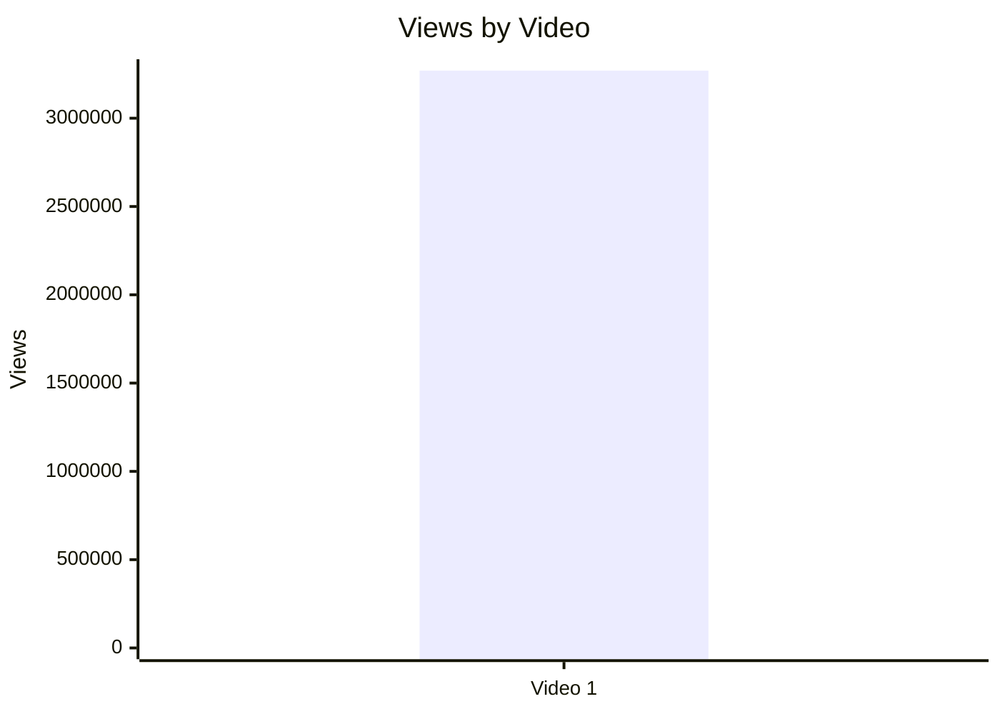
```mermaid
xychart-beta
    title "Views by Video"
    x-axis ["Video 1"]
    y-axis "Views" 0 --> 3269724
    bar [3269724]
```

### 5.2. Views per day by video

- Назва графіка: Views per day by video
- Яке питання він відповідає: яка нормалізована швидкість набору переглядів?
- Які поля використовуються: `video_label`, `views_per_day`
- Тип графіка: Mermaid bar chart
- Що видно з графіка: Video 1 має `9,673.74` views/day.
- Практичний висновок: для майбутніх порівнянь саме `views_per_day`, а не raw views, має бути головною метрикою performance.

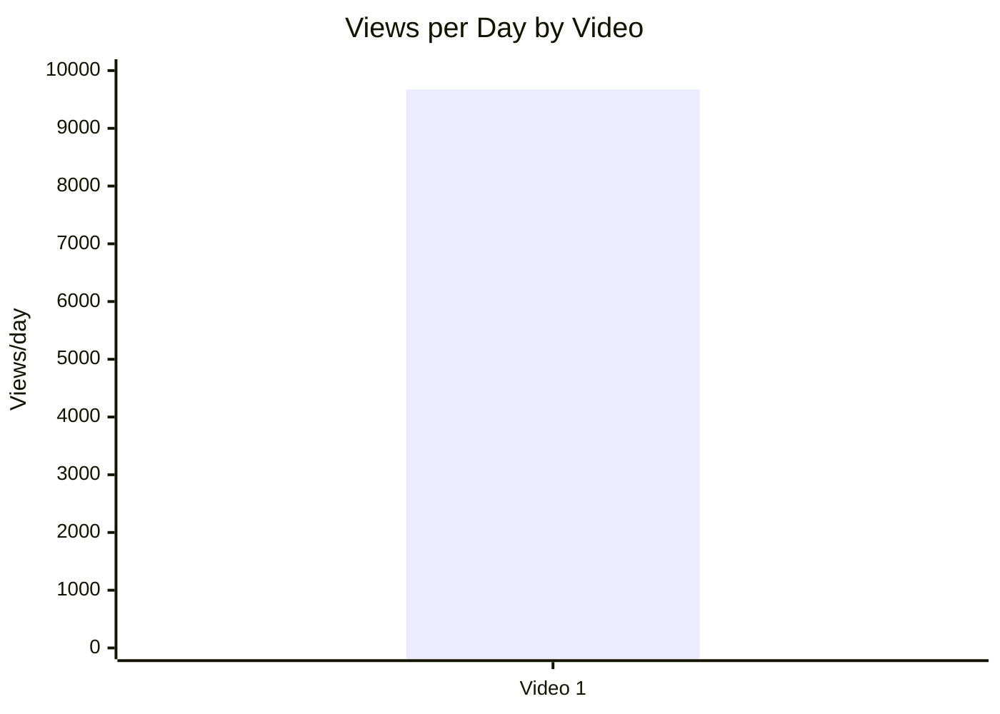
```mermaid
xychart-beta
    title "Views per Day by Video"
    x-axis ["Video 1"]
    y-axis "Views/day" 0 --> 10000
    bar [9673.74]
```

### 5.3. Views per 1k subscribers

- Назва графіка: Views per 1k subscribers
- Яке питання він відповідає: наскільки добре відео конвертує розмір каналу в перегляди?
- Які поля використовуються: `video_label`, `views_per_1k_subs`
- Тип графіка: Mermaid bar chart
- Що видно з графіка: Video 1 має `1,777.02` views per 1k subscribers.
- Практичний висновок: метрика доступна і готова для порівняння з наступними відео цієї ж когорти.

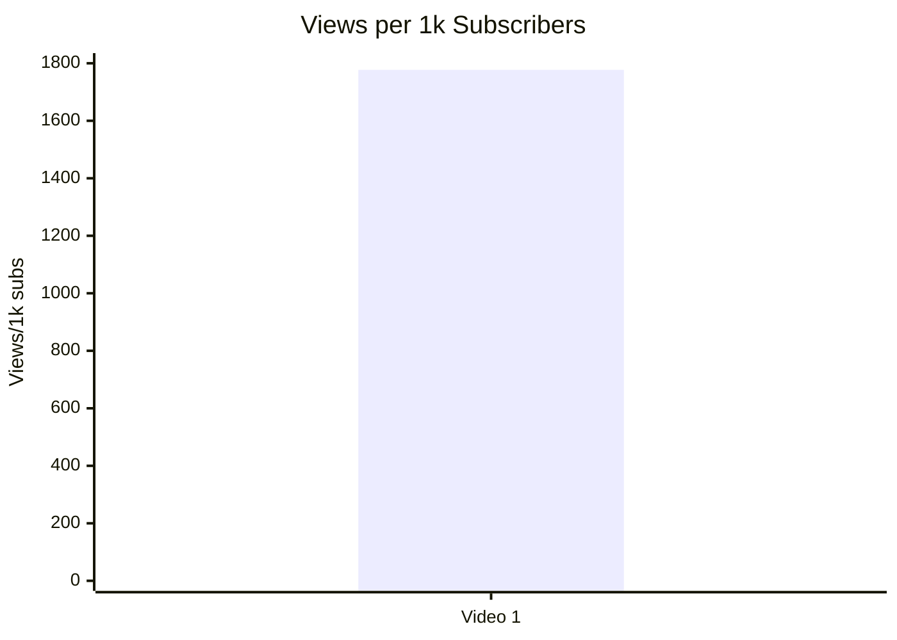
```mermaid
xychart-beta
    title "Views per 1k Subscribers"
    x-axis ["Video 1"]
    y-axis "Views/1k subs" 0 --> 1800
    bar [1777.02]
```

### 5.4. Performance quadrant

- Назва графіка: Performance quadrant
- Яке питання він відповідає: чи є баланс між охопленням і залученням?
- Які поля використовуються: `views_per_day`, `er_public_percent`
- Тип графіка: scatter / quadrant
- Що видно з графіка: `INSUFFICIENT_DATA` для quadrant benchmark, бо є лише один datapoint і немає cohort median.
- Практичний висновок: точку можна додати в майбутній scatter plot після накопичення мінімум 5 порівнюваних відео.

| Video | Views/day | ER Public % | Quadrant |
|---|---:|---:|---|
| Video 1 | 9,673.74 | 2.9156 | `NOT_COMPARABLE`: немає median/benchmark для осей high/low |

## 6. Графіки залучення

### 6.1. ER Public % by video

- Назва графіка: ER Public % by video
- Яке питання він відповідає: який рівень public engagement?
- Які поля використовуються: `video_label`, `er_public_percent`
- Тип графіка: Mermaid bar chart
- Що видно з графіка: Video 1 має `2.9156%` ER Public.
- Практичний висновок: engagement можна порівнювати з наступними відео, але не називати “добрим/поганим” без benchmark.

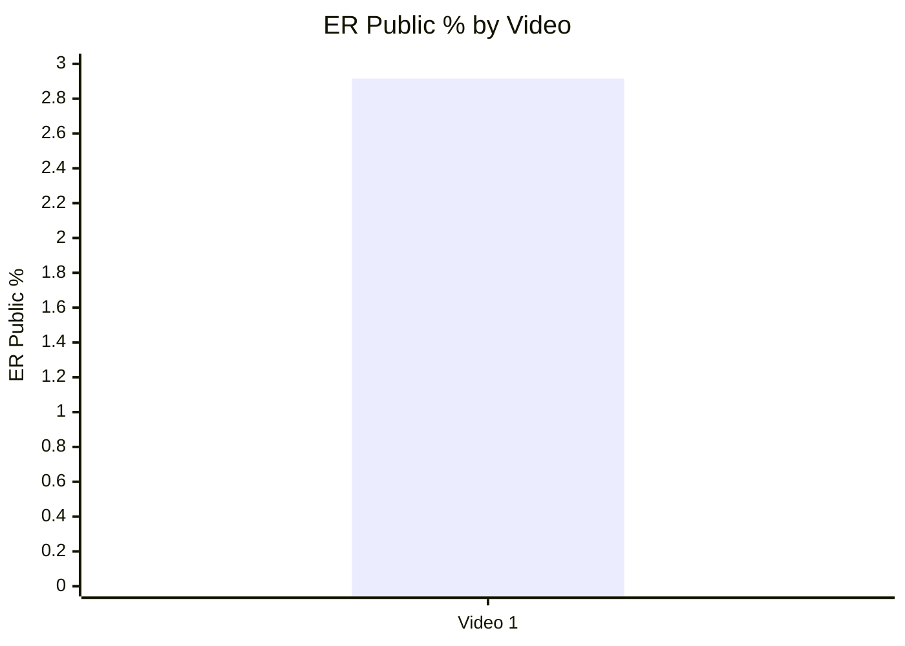
```mermaid
xychart-beta
    title "ER Public % by Video"
    x-axis ["Video 1"]
    y-axis "ER Public %" 0 --> 3
    bar [2.9156]
```

### 6.2. Like Rate % vs Comment Rate %

- Назва графіка: Like Rate % vs Comment Rate %
- Яке питання він відповідає: чи відео більше подобається, чи провокує дискусію?
- Які поля використовуються: `like_rate_percent`, `comment_rate_percent`
- Тип графіка: scatter plot
- Що видно з графіка: одна точка: like rate `2.6220%`, comment rate `0.2935%`.
- Практичний висновок: без інших відео неможливо визначити quadrant; надалі варто порівнювати з відео тієї ж довжини та тематики.

| Video | Like Rate % | Comment Rate % | Interpretation |
|---|---:|---:|---|
| Video 1 | 2.6220 | 0.2935 | `NOT_COMPARABLE`: немає cohort baseline для high/low |

### 6.3. Comments per 1k views

- Назва графіка: Comments per 1k views
- Яке питання він відповідає: наскільки сильно відео провокує реакцію?
- Які поля використовуються: `comments_per_1k_views`
- Тип графіка: Mermaid bar chart
- Що видно з графіка: Video 1 має `2.9354` comments per 1k views.
- Практичний висновок: тема викликала значний discussion volume у межах одного кейсу, але причинність не доведена.

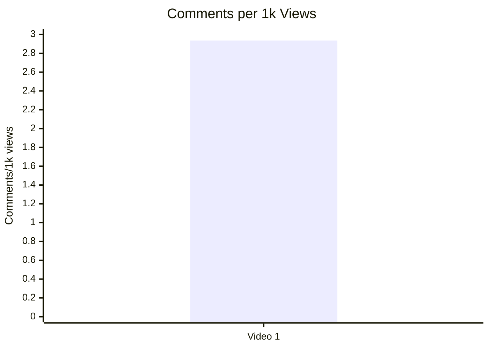
```mermaid
xychart-beta
    title "Comments per 1k Views"
    x-axis ["Video 1"]
    y-axis "Comments/1k views" 0 --> 3
    bar [2.9354]
```

## 7. Графіки структури та hook

### 7.1. Hook score by video

- Назва графіка: Hook score by video
- Яке питання він відповідає: наскільки сильний hook?
- Які поля використовуються: `hook_score`
- Тип графіка: Mermaid bar chart
- Що видно з графіка: Video 1 має максимальний hook score `5/5`.
- Практичний висновок: hook — головний елемент для повторення в наступних rapid-response explainer відео.

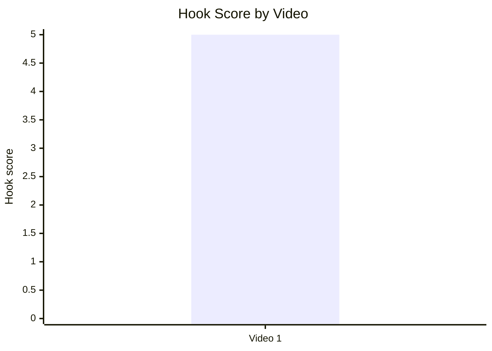
```mermaid
xychart-beta
    title "Hook Score by Video"
    x-axis ["Video 1"]
    y-axis "Hook score" 0 --> 5
    bar [5]
```

### 7.2. Hook type distribution

- Назва графіка: Hook type distribution
- Яке питання він відповідає: який primary hook type використано?
- Які поля використовуються: `hook_primary_type`
- Тип графіка: Mermaid pie chart
- Що видно з графіка: 100% поточної вибірки — `SHOCK`.
- Практичний висновок: `SHOCK` зафіксований як сильний hook для цього кейсу, але не можна казати, що він статистично кращий за інші типи.

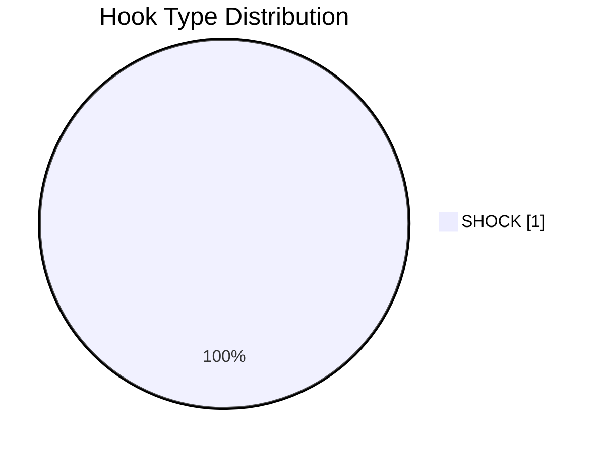
```mermaid
pie showData
    title Hook Type Distribution
    "SHOCK" : 1
```

### 7.3. Time to first value vs Overall Score

- Назва графіка: Time to first value vs Overall Score
- Яке питання він відповідає: чи швидша перша цінність пов’язана з вищим результатом?
- Які поля використовуються: `time_to_first_value_seconds`, `overall_video_score`
- Тип графіка: scatter plot
- Що видно з графіка: `INSUFFICIENT_DATA`, бо time-to-first-value позначено як `≈00:10-00:20 / NO_TIMECODES`.
- Практичний висновок: для наступних звітів потрібно витягувати точний `time_to_first_value_seconds`.

| Video | Time to first value | Overall score | Status |
|---|---|---:|---|
| Video 1 | ≈00:10–00:20 / `NO_TIMECODES` | 4.05 | `INSUFFICIENT_DATA` для точного scatter |

## 8. Графіки CTA

### 8.1. CTA score by video

- Назва графіка: CTA score by video
- Яке питання він відповідає: наскільки ефективно CTA вбудовані у відео?
- Які поля використовуються: `cta_score`
- Тип графіка: Mermaid bar chart
- Що видно з графіка: CTA score = `3/5`, нижче hook/audio/ad/comments.
- Практичний висновок: CTA — зона оптимізації: потрібен конкретний comment prompt і next-video bridge.

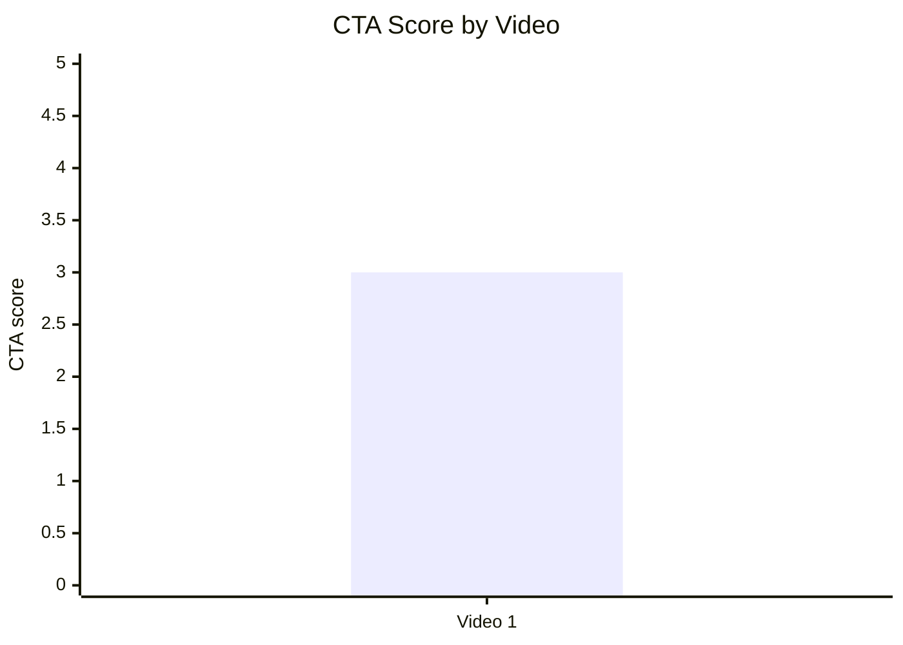
```mermaid
xychart-beta
    title "CTA Score by Video"
    x-axis ["Video 1"]
    y-axis "CTA score" 0 --> 5
    bar [3]
```

### 8.2. CTA count vs ER Public %

- Назва графіка: CTA count vs ER Public %
- Яке питання він відповідає: чи більше CTA пов’язано з кращим залученням?
- Які поля використовуються: `cta_count`, `er_public_percent`
- Тип графіка: scatter plot
- Що видно з графіка: одна точка: `cta_count = 6`, `ER Public = 2.9156%`.
- Практичний висновок: causality/зв’язок не оцінюється; для наступних відео треба відстежувати не лише кількість CTA, а й конкретність prompt.

| Video | CTA count | ER Public % | Interpretation |
|---|---:|---:|---|
| Video 1 | 6 | 2.9156 | `NOT_COMPARABLE`: одна точка, зв’язок не оцінюється |

### 8.3. CTA features heatmap

- Назва графіка: CTA features heatmap
- Яке питання він відповідає: які CTA-функції реально присутні?
- Які поля використовуються: `has_comment_prompt`, `has_subscribe_cta`, `has_like_cta`, `has_bell_cta`, `has_next_video_bridge`
- Тип графіка: matrix / heatmap table
- Що видно з графіка: є comment/like/share/sponsor CTA, немає bell і next-video bridge; subscribe CTA не є чистим YouTube-subscribe CTA.
- Практичний висновок: найшвидший тест — конкретний comment prompt + end-screen / watch-next bridge.

| Video | Comment prompt | Subscribe | Like | Bell | Next video bridge |
|---|---|---|---|---|---|
| Video 1 | ✅ Generic comment CTA | ⚠️ Sponsor subscribe / no clear YouTube verbal subscribe | ✅ | ❌ | ❌ |

## 9. Графіки реклами / інтеграцій

### 9.1. Ad load % by video

- Назва графіка: Ad load % by video
- Яке питання він відповідає: яке рекламне навантаження?
- Які поля використовуються: `ad_load_percent`
- Тип графіка: Mermaid bar chart
- Що видно з графіка: in-video sponsor read ≈ `7.65%` runtime.
- Практичний висновок: ad load помірний для long-form, але sponsor-first pinned comment і sponsor pushback створюють ризик сприйняття bias.

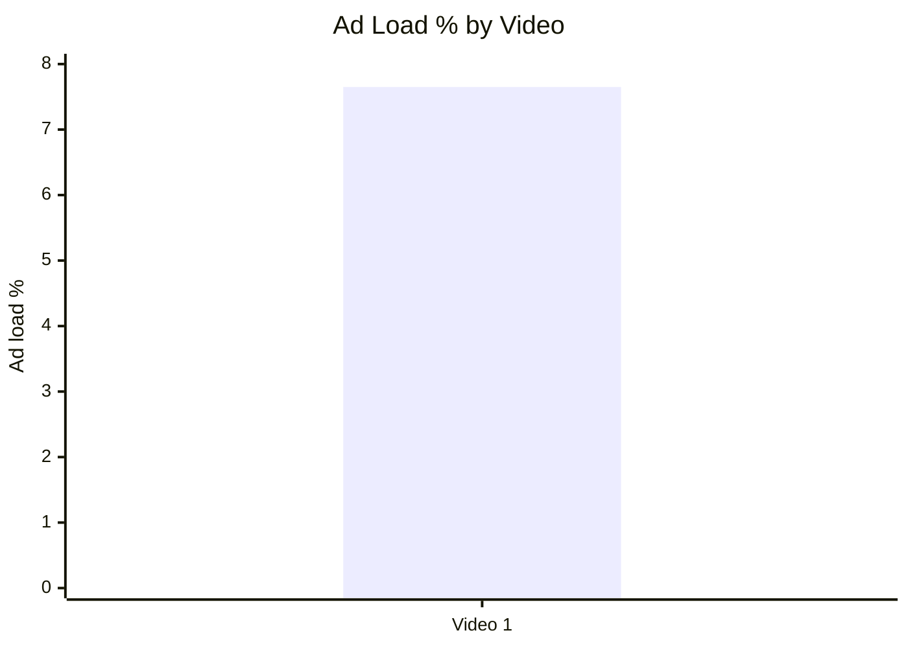
```mermaid
xychart-beta
    title "Ad Load % by Video"
    x-axis ["Video 1"]
    y-axis "Ad load %" 0 --> 8
    bar [7.65]
```

### 9.2. First ad position %

- Назва графіка: First ad position %
- Яке питання він відповідає: чи реклама стоїть занадто рано?
- Які поля використовуються: `first_ad_relative_position_percent`
- Тип графіка: Mermaid bar chart
- Що видно з графіка: перша in-video реклама стартує приблизно на `20.3%` тривалості.
- Практичний висновок: реклама не pre-hook, але йде до глибшого analytical payoff; варто тестувати placement після першого повного value block.

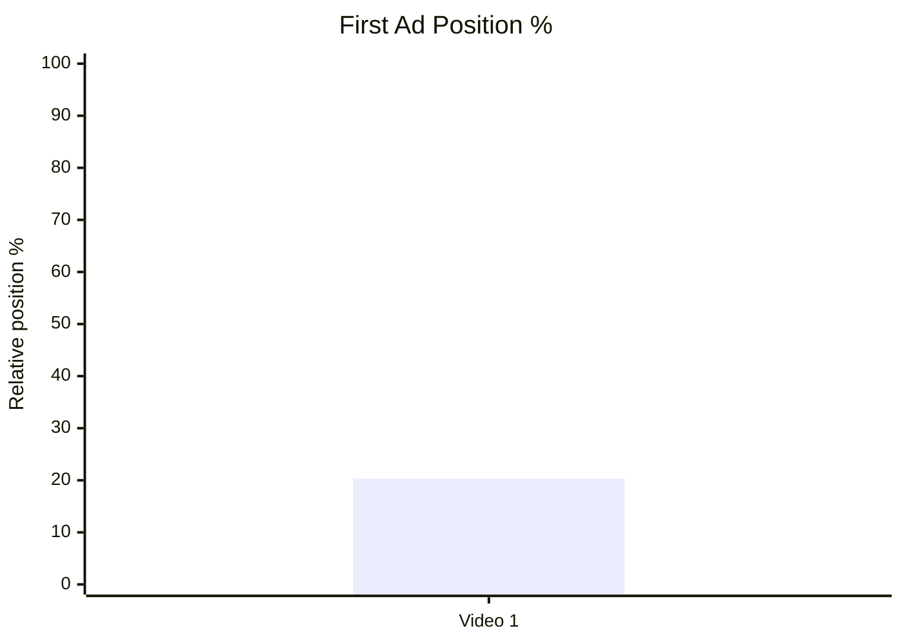
```mermaid
xychart-beta
    title "First Ad Position %"
    x-axis ["Video 1"]
    y-axis "Relative position %" 0 --> 100
    bar [20.3]
```

### 9.3. Ad integration score vs ER Public %

- Назва графіка: Ad integration score vs ER Public %
- Яке питання він відповідає: чи якість інтеграції пов’язана з реакцією аудиторії?
- Які поля використовуються: `ad_integration_score`, `er_public_percent`
- Тип графіка: scatter plot
- Що видно з графіка: одна точка: ad integration score `4`, ER Public `2.9156%`.
- Практичний висновок: зв’язок не оцінюється; у майбутніх відео варто порівняти sponsor placement, ad_load і sponsor criticism cluster.

| Video | Ad integration score | ER Public % | Status |
|---|---:|---:|---|
| Video 1 | 4 | 2.9156 | `NOT_COMPARABLE`: одна точка |

## 10. Графіки аудіо

### 10.1. Audio score by video

- Назва графіка: Audio score by video
- Яке питання він відповідає: чи аудіо підтримує перегляд?
- Які поля використовуються: `audio_score`
- Тип графіка: Mermaid bar chart
- Що видно з графіка: audio score = `4/5`.
- Практичний висновок: аудіо не є головною проблемою, але сирена/тривожний SFX має окремий friction risk.

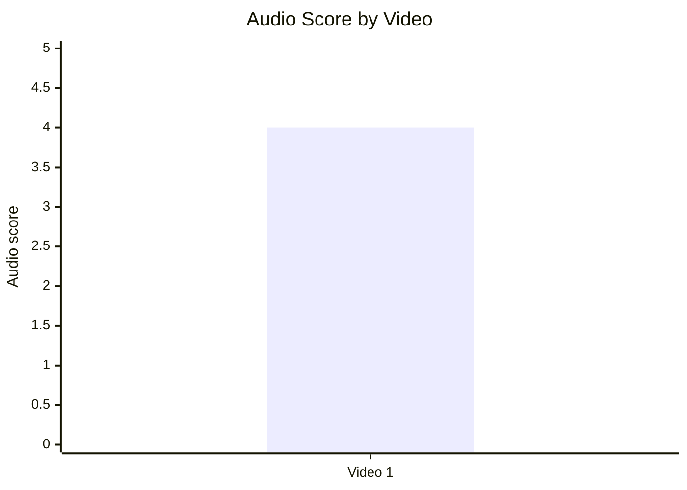
```mermaid
xychart-beta
    title "Audio Score by Video"
    x-axis ["Video 1"]
    y-axis "Audio score" 0 --> 5
    bar [4]
```

### 10.2. Audio score vs Overall Score

- Назва графіка: Audio score vs Overall Score
- Яке питання він відповідає: чи краща якість аудіо пов’язана з higher overall?
- Які поля використовуються: `audio_score`, `overall_video_score`
- Тип графіка: scatter plot
- Що видно з графіка: одна точка: audio `4`, overall `4.05`.
- Практичний висновок: зв’язок не оцінюється; майбутні звіти повинні зберігати audio score для порівняння.

| Video | Audio score | Overall score | Status |
|---|---:|---:|---|
| Video 1 | 4 | 4.05 | `NOT_COMPARABLE`: одна точка |

## 11. Графіки коментарів

### 11.1. Sentiment distribution

- Назва графіка: Sentiment distribution
- Яке питання він відповідає: яка структура реакції аудиторії?
- Які поля використовуються: `positive_percent`, `negative_percent`, `mixed_percent`, `neutral_percent`, `question_percent`, `request_percent`, `joke_meme_percent`
- Тип графіка: Mermaid bar chart + table
- Що видно з графіка: найбільший кластер — neutral/general debate `61.0%`; questions `15.9%`; negative `11.3%`; jokes/memes `7.2%`; positive `4.5%`.
- Практичний висновок: коментарі рухає не лише praise, а debate + questions; це сильний сигнал для follow-up Q&A.

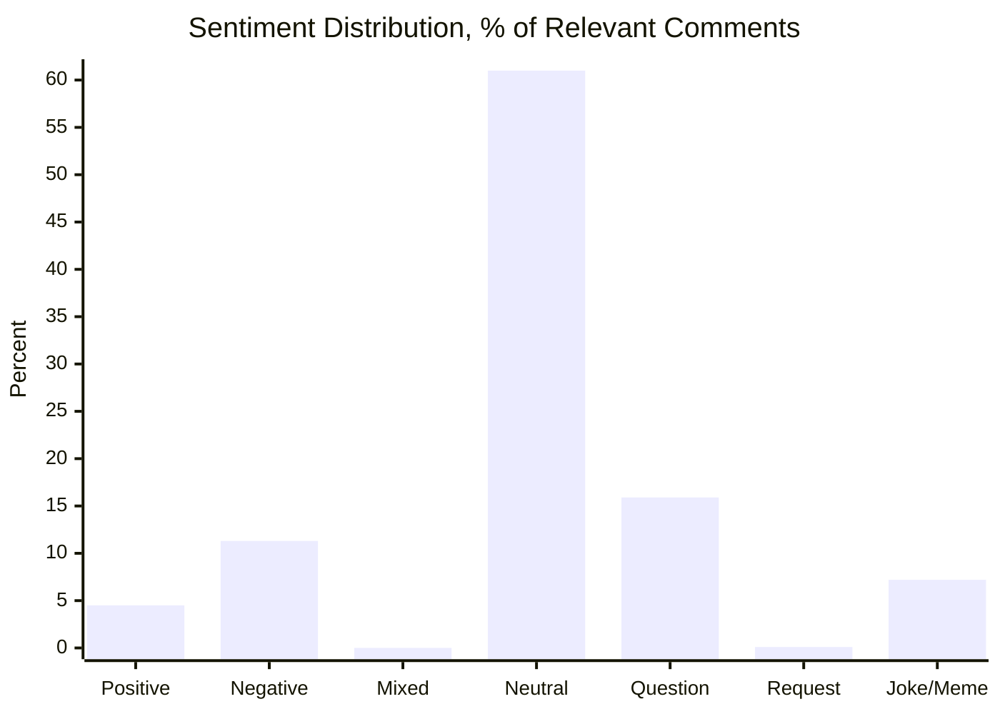
```mermaid
xychart-beta
    title "Sentiment Distribution, % of Relevant Comments"
    x-axis ["Positive", "Negative", "Mixed", "Neutral", "Question", "Request", "Joke/Meme"]
    y-axis "Percent" 0 --> 61
    bar [4.5, 11.3, 0.0, 61.0, 15.9, 0.1, 7.2]
```

| Sentiment | Count | Percent |
|---|---:|---:|
| POSITIVE | 400 | 4.5 |
| NEGATIVE | 998 | 11.3 |
| MIXED | 1 | 0.0 |
| NEUTRAL | 5,394 | 61.0 |
| QUESTION | 1,409 | 15.9 |
| REQUEST | 8 | 0.1 |
| JOKE_MEME | 636 | 7.2 |
| SPAM / IRRELEVANT | 127 | N/A |

### 11.2. Comment resonance score by video

- Назва графіка: Comment resonance score by video
- Яке питання він відповідає: наскільки сильна реакція в коментарях?
- Які поля використовуються: `comment_resonance_score`
- Тип графіка: Mermaid bar chart
- Що видно з графіка: comment resonance score = `4/5`.
- Практичний висновок: коментарний потенціал високий у цьому кейсі; next step — перетворити questions/debate у продовження серії.

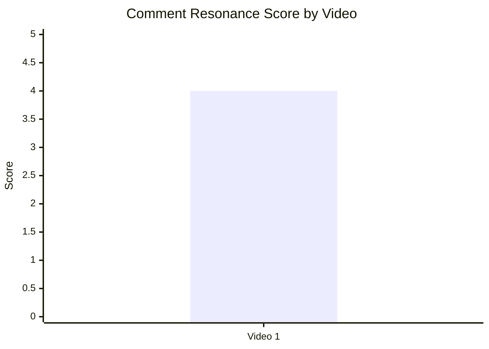
```mermaid
xychart-beta
    title "Comment Resonance Score by Video"
    x-axis ["Video 1"]
    y-axis "Score" 0 --> 5
    bar [4]
```

### 11.3. Top comment clusters

- Назва графіка: Top comment clusters
- Яке питання він відповідає: що найчастіше обговорювали?
- Які поля використовуються: `cluster_name`, `% of relevant comments`
- Тип графіка: Mermaid bar chart
- Що видно з графіка: найбільший кластер — geopolitical debate `64.2%`, далі questions `15.9%`.
- Практичний висновок: найцінніші follow-up теми: coup risk, US role, nuclear deterrence, Gulf states, Iraq airspace, framing/legality.

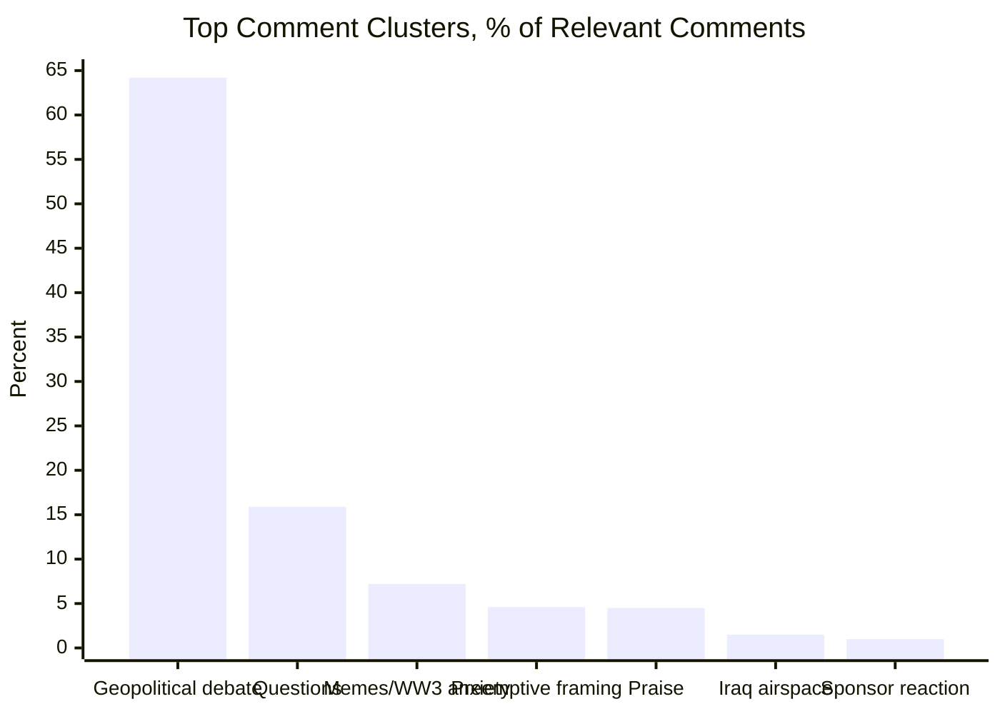
```mermaid
xychart-beta
    title "Top Comment Clusters, % of Relevant Comments"
    x-axis ["Geopolitical debate", "Questions", "Memes/WW3 anxiety", "Preemptive framing", "Praise", "Iraq airspace", "Sponsor reaction"]
    y-axis "Percent" 0 --> 65
    bar [64.2, 15.9, 7.2, 4.6, 4.5, 1.5, 1.0]
```

| Cluster | % of relevant comments | Practical meaning |
|---|---:|---|
| General geopolitical debate | 64.2 | Debate is the main comment driver. |
| Clarifying geopolitical questions | 15.9 | Strong follow-up Q&A opportunity. |
| Memes / world-war anxiety | 7.2 | Emotional stakes create shareable reactions. |
| Dispute over “preemptive strike” framing | 4.6 | Main reputational/framing risk. |
| Praise for explanation / analysis | 4.5 | Core audience values structured explanation. |
| Iraq/airspace discussion | 1.5 | Potential dedicated follow-up angle. |
| Sponsor / Ground News reaction | 1.0 | Ad friction exists but is not dominant. |

## 12. Графіки score-системи

### 12.1. Overall score by video

- Назва графіка: Overall score by video
- Яке питання він відповідає: яка загальна оцінка відео?
- Які поля використовуються: `overall_video_score`
- Тип графіка: Mermaid bar chart
- Що видно з графіка: Video 1 overall = `4.05/5`.
- Практичний висновок: кейс сильний у межах власного scorecard, але не має peer benchmark.

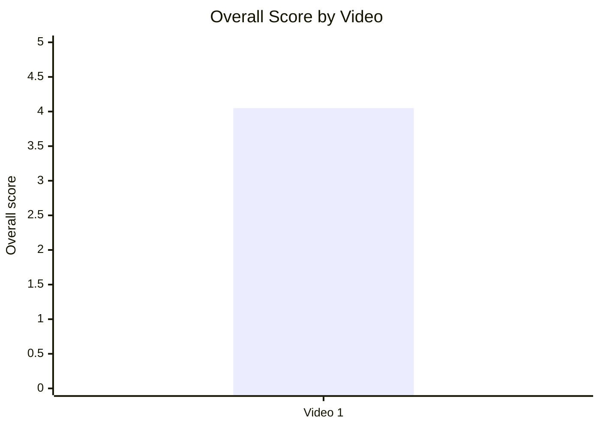
```mermaid
xychart-beta
    title "Overall Score by Video"
    x-axis ["Video 1"]
    y-axis "Overall score" 0 --> 5
    bar [4.05]
```

### 12.2. Score breakdown heatmap

- Назва графіка: Score breakdown heatmap
- Яке питання він відповідає: які компоненти сильні/слабкі?
- Які поля використовуються: `hook_score`, `structure_score`, `value_density_score`, `audio_score`, `cta_score`, `ad_integration_score`, `comment_resonance_score`, `replicability_score`, `overall_video_score`
- Тип графіка: Markdown heatmap table
- Що видно з графіка: найсильніший елемент — hook `5`; найнижчий score — CTA `3`.
- Практичний висновок: не потрібно ламати core format; треба оптимізувати CTA та next-session flow.

| Video | Hook | Structure | Value Density | Audio | CTA | Ad | Comments | Replicability | Overall |
|---|---:|---:|---:|---:|---:|---:|---:|---:|---:|
| Video 1 | 🟩 5 | 🟨 4 | 🟨 4 | 🟨 4 | 🟧 3 | 🟨 4 | 🟨 4 | 🟨 4 | 🟨 4.05 |

Legend: 🟩 = 4.5–5, 🟨 = 3.5–4.49, 🟧 = 2.5–3.49, 🟥 = <2.5.

### 12.3. Strengths vs weaknesses count

- Назва графіка: Strengths vs weaknesses count
- Яке питання він відповідає: скільки success mechanics і missed opportunities зафіксовано?
- Які поля використовуються: кількість success mechanics, кількість missed opportunities
- Тип графіка: Mermaid bar chart
- Що видно з графіка: 5 success mechanics, 5 missed opportunities.
- Практичний висновок: відео сильне, але має чіткий optimization backlog, особливо comments/questions, CTA і next-video bridge.

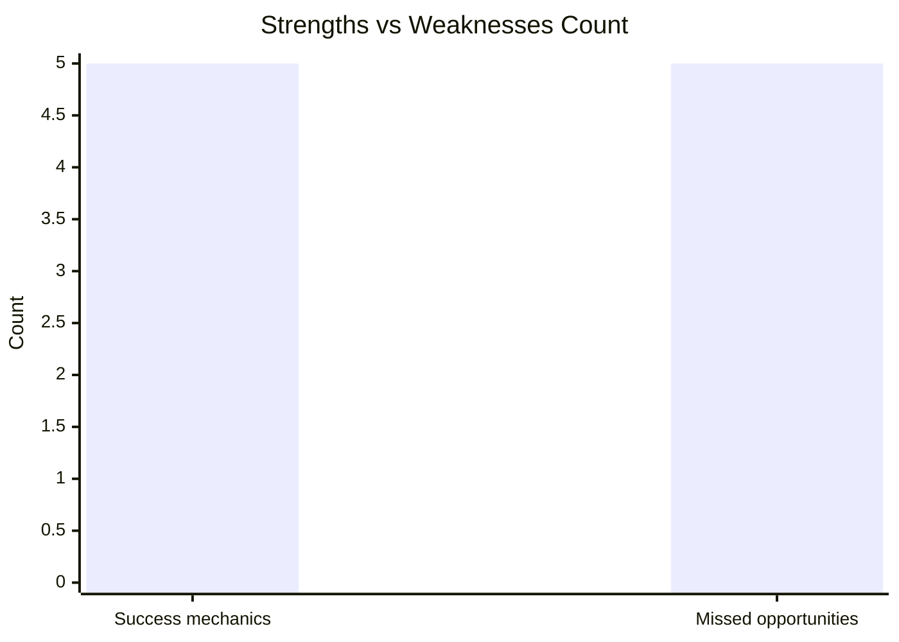
```mermaid
xychart-beta
    title "Strengths vs Weaknesses Count"
    x-axis ["Success mechanics", "Missed opportunities"]
    y-axis "Count" 0 --> 5
    bar [5, 5]
```

| Type | Count | Items |
|---|---:|---|
| Success mechanics | 5 | `TIMELY_TOPIC`, `CLEAR_HOOK`, `HIGH_VALUE_DENSITY`, `CONTROVERSY_OR_DEBATE`, `NATIVE_AD_INTEGRATION` |
| Missed opportunities | 5 | `COMMENTS_SHOW_TOPIC_GAP`, `COMMENTS_SHOW_CONFUSION`, `COMMENTS_SHOW_AD_FATIGUE`, `AUDIO_DISTRACTION`, `NO_NEXT_VIDEO_BRIDGE` |

## 13. Кореляції та патерни

Correlation analysis skipped: fewer than 5 comparable videos.

| Pair | Correlation / Pattern | Strength | Interpretation | Confidence |
|---|---:|---|---|---|
| hook_score → overall_video_score | `INSUFFICIENT_DATA` | N/A | Є лише 1 відео; зв’язок не обчислюється. | LOW |
| value_density_score → er_public_percent | `INSUFFICIENT_DATA` | N/A | Є лише 1 відео; зв’язок не обчислюється. | LOW |
| cta_score → comment_rate_percent | `INSUFFICIENT_DATA` | N/A | Є лише 1 відео; зв’язок не обчислюється. | LOW |
| comment_resonance_score → er_public_percent | `INSUFFICIENT_DATA` | N/A | Є лише 1 відео; зв’язок не обчислюється. | LOW |
| views_per_day → er_public_percent | `INSUFFICIENT_DATA` | N/A | Є лише 1 відео; performance quadrant не має median/benchmark. | LOW |
| ad_load_percent → er_public_percent | `INSUFFICIENT_DATA` | N/A | Є лише 1 відео; вплив реклами не можна оцінити. | LOW |
| time_to_first_value_seconds → overall_video_score | `INSUFFICIENT_DATA` | N/A | Немає точного timecode; `NO_TIMECODES`. | LOW |

## 14. Висновки для контент-стратегії

| Спостереження | Дані / графік | Що це означає | Що робити |
|---|---|---|---|
| Hook є найсильнішим компонентом кейсу. | Hook score `5/5`; hook type `SHOCK`; overall `4.05/5`. | Rapid, high-stakes opening добре підходить для crisis explainers. | Повторювати формат “one-line stakes + concrete facts” у перші 5–10 секунд. |
| CTA — найслабший score-блок. | CTA score `3/5`; no next-video bridge; comment CTA generic. | Відео має сильну реакцію, але не повністю конвертує її у наступну дію. | Додати конкретне питання для коментарів і end-screen/watch-next bridge. |
| Коментарі в основному є debate/questions, а не simple praise. | Top clusters: geopolitical debate `64.2%`, questions `15.9%`, praise `4.5%`. | Тема генерує дискусію й потребу в поясненні. | Після таких відео робити follow-up Q&A або “top 5 disputed points explained”. |
| Рекламна інтеграція нативна, але має friction. | Ad load `7.65%`; first ad `20.3%`; sponsor reaction `1.0%`; ad score `4/5`. | Sponsor fit сильний, але sponsor-first pinned comment може посилювати підозру bias. | Тестувати pinned comment: спочатку дискусійне питання, потім sponsor link. |
| Аудіо загалом не заважає, але SFX може шкодити частині аудиторії. | Audio score `4/5`; audio/siren complaints = 21 parsed comments. | Проблема не масова, але дуже конкретна й легко виправляється. | Додати warning або знизити гучність сирени/тривожних SFX. |
| Відео не можна статистично порівняти без когорти. | 1 video, 1 format, no correlations. | Усі висновки описові, не причинні. | Накопичити мінімум 5 звітів `LONG_10_20_MIN` для correlation/pattern analysis. |

## 15. Що тестувати далі

| Тест | Гіпотеза | На яких даних базується | Як виміряти | Пріоритет |
|---|---|---|---|---|
| Specific comment prompt після payoff | Конкретне питання збільшить якість і частку релевантних коментарів. | 1,409 question comments; generic “please leave a comment”. | Comment rate %, comments per 1k views, share of question/answer comments. | HIGH |
| End-screen / next-video bridge | Watch-next bridge підвищить session continuation. | `NO_NEXT_VIDEO_BRIDGE`; сильний topic-gap у comments. | End screen CTR, views to next video, session starts. | HIGH |
| Follow-up Q&A за 24–72 години | Питання з comments можна конвертувати в друге відео. | Clarification cluster `15.9%`; issues: coup risk, US role, nuclear deterrence. | Views/day follow-up, comment overlap, returning viewers. | HIGH |
| Caveat / uncertainty block | Зменшить негатив через disputed framing і підвищить trust. | “Preemptive strike” dispute cluster `4.6%`; accuracy/update disputes. | Negative comment share, like rate, retention around caveat block. | HIGH |
| Sponsor pinned comment після discussion hook | Знизить sponsor fatigue без втрати sponsor visibility. | Sponsor reaction `1.0%`; pinned comment sponsor-first. | Sponsor complaint share, pinned comment replies, sponsor clicks if available. | MEDIUM |
| Перенесення sponsor read після першого full value block | Менший disruption risk при збереженні native fit. | First ad ≈20.3%; ad score `4`, disruption risk `3`. | Retention around ad segment, sponsor CTR, ER Public %. | MEDIUM |
| SFX warning / lower siren volume | Знизить audio discomfort. | 21 audio/siren/mic complaint comments. | Audio complaint count, retention dips near SFX, qualitative comments. | MEDIUM |
| Series format: “crisis → scenario tree → next update” | Повторить success mechanics without relying only on one viral moment. | Success mechanics: `TIMELY_TOPIC`, `CLEAR_HOOK`, `HIGH_VALUE_DENSITY`. | Views/day, returning viewers, comments per 1k views across 5+ videos. | HIGH |

## 16. Дані для експорту в таблицю / CSV

| video_label | title | format_group | views | views_per_day | like_rate_percent | comment_rate_percent | er_public_percent | views_per_1k_subs | hook_type | hook_score | cta_count | cta_score | ad_load_percent | ad_integration_score | audio_score | comment_resonance_score | overall_video_score | top_success_mechanic | top_missed_opportunity |
|---|---|---|---:|---:|---:|---:|---:|---:|---|---:|---:|---:|---:|---:|---:|---:|---:|---|---|
| Video 1 | The Israel-Iran War just changed everything | LONG_10_20_MIN | 3269724 | 9673.74 | 2.6220 | 0.2935 | 2.9156 | 1777.02 | SHOCK | 5 | 6 | 3 | 7.65 | 4 | 4 | 4 | 4.05 | TIMELY_TOPIC | COMMENTS_SHOW_TOPIC_GAP |