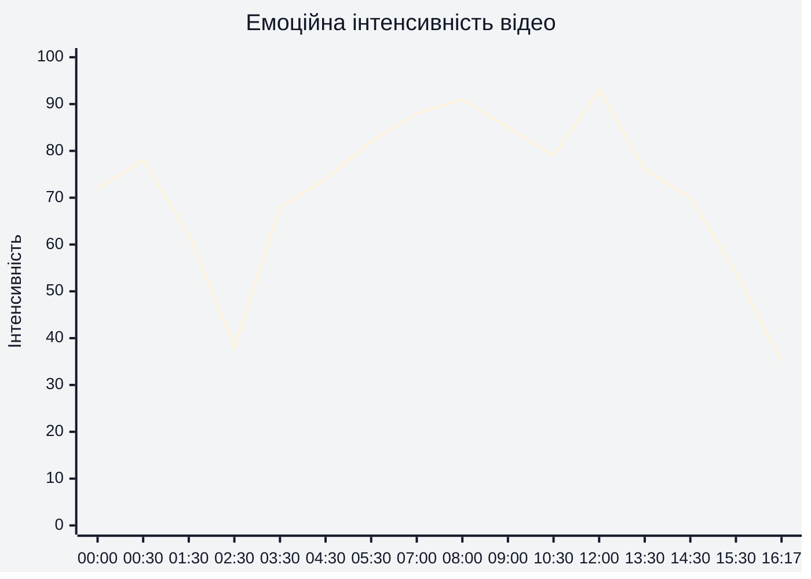
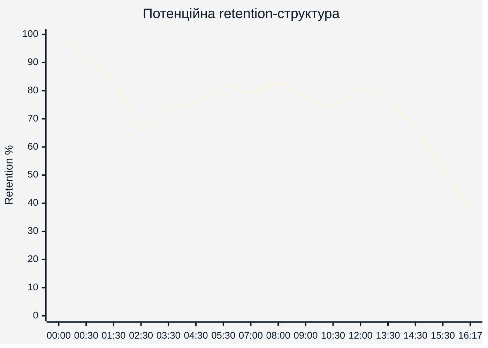
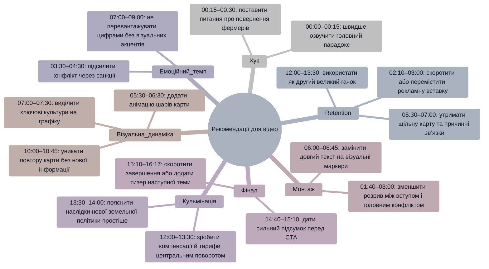

# Аналіз довгоформатного YouTube-відео

**Відео:** `Why Zimbabwe wants its ‘white farmers’ back.mp4`  
**Тема:** чому уряд Зімбабве знову намагається повернути або компенсувати білих фермерів після земельної реформи, економічного колапсу та втрати аграрної продуктивності.  
**Тривалість:** 16:17  
**Цільова аудиторія:** глядачі геополітичних, економічних та історичних YouTube-есе, які очікують причинно-наслідкове пояснення з картами, графіками, архівними матеріалами та сучасним політичним контекстом.

> **Примітка щодо retention:** реальні retention-дані або скріншот YouTube Studio не були надані. Тому в розділі 4 використано **потенційну retention-структуру**, побудовану за монтажною логікою, змінами темпу, візуальними переходами, щільністю інформації та наявними сюжетними поворотами.

## 1. Сюжетна дуга (Narrative Arc)

```mermaid
%%{init: {'theme':'base', 'themeVariables': {
'primaryColor':'#f3f4f6',
'primaryTextColor':'#111827',
'primaryBorderColor':'#2563eb',
'lineColor':'#2563eb',
'secondaryColor':'#ffffff',
'tertiaryColor':'#f3f4f6',
'background':'#f3f4f6'
}}}%%
flowchart LR
    A["Хук<br/>00:00–00:30<br/>Карта Зімбабве та графік боргу одразу задають кризове питання: чому країна з аграрним потенціалом опинилась у борговій пастці?"] -->
    B["Експозиція<br/>00:30–01:40<br/>Показано економічний контекст: борг, аграрні ландшафти, візуальне нагадування про роль землі в історії країни."] -->
    C["Перша ескалація<br/>01:40–03:30<br/>Відео переходить від загальної кризи до зовнішнього тиску, санкцій і юридичних претензій навколо експропріації ферм."] -->
    D["Переломний момент<br/>03:30–05:30<br/>Історична рамка: Родезія, незалежність, колоніальна нерівність у землеволодінні та політичний вибух земельної реформи."] -->
    E["Наростання напруги<br/>05:30–08:30<br/>Карта власності, статті про аграрний потенціал і графіки виробництва показують, як політичне рішення перетворюється на економічний спад."] -->
    F["Кульмінація<br/>08:30–12:30<br/>Гіперінфляція, мультивалютна система, портрети політичної еліти та матеріал про Дональда Трампа піднімають ставку до міжнародного рівня."] -->
    G["Розв’язка<br/>12:30–14:40<br/>Сучасні кадри фермерства, стаття про нову земельну політику та повтор графіка боргу показують спробу відновити довіру через компенсації й прагматичний розворот."] -->
    H["Фінальний висновок<br/>14:40–16:17<br/>Повернення до карти Зімбабве, заклик до підписки та титри закривають аргумент: проблема землі стала проблемою державної довіри, кредиту й продовольчої безпеки."]
```

## 2. Ключові Story Beats

## 3. Емоційний темп

Емоційний пік формується не одним моментом, а каскадом: **05:30–07:00** карта землеволодіння та графік виробництва створюють доказовий тиск; **08:00–09:00** політична відповідальність і гіперінфляція піднімають драму; **12:00–13:30** зовнішньополітичний поворот із тарифами, компенсаціями та новою політикою дає найвищу інтенсивність, бо показує, що стара земельна криза досі визначає сучасні рішення.

## 4. Утримання аудиторії

Оскільки реальні retention-дані не надані, ця крива є прогнозом. Найбільший ризик втрати уваги припадає на **02:00–03:00**, де візуально з’являється відступ із офісною сценою та вебінтерфейсом, схожий на рекламну або спонсорську вставку. Найкраща потенційна зона утримання — **05:30–09:00**, де історичний конфлікт, карта землеволодіння, графік виробництва, Мугабе та гіперінфляція формують щільну причинно-наслідкову послідовність.

## 5. Піки retention

| Таймкод | Подія | Чому це може утримувати увагу | Сила піку 1–10 |
|---|---|---|---|
| 00:00–00:30 | Карта Зімбабве та графік державного боргу | Відео одразу ставить велику кризову рамку: країна, борг, економічний провал. Це швидко відповідає на питання “чому це важливо?”. | 8 |
| 03:30–04:30 | Санкції, юридичні претензії та архівні кадри | З’являється конфлікт не лише всередині країни, а й між Зімбабве та зовнішнім світом. | 7 |
| 05:30–06:30 | Карта розподілу землі між білими зімбабвійцями, чорними зімбабвійцями, національними парками і містами | Складна тема стає візуально простою: глядач бачить, чому земля була політично вибуховою. | 9 |
| 07:00–07:30 | Графік виробництва 2000–2011 | Доказовий момент: наслідки земельної політики показані через спад аграрних показників. | 8 |
| 08:00–09:00 | Мугабе, політична еліта та мультивалютна система | Персоналізація кризи плюс символ гіперінфляції утримують увагу через сильний причинний зв’язок. | 9 |
| 12:00–13:30 | Матеріал про Трампа, тарифи, виплати білим фермерам і нову земельну політику | Сюжет отримує сучасний геополітичний поворот: минуле починає прямо впливати на нинішні переговори та зовнішню політику. | 10 |
| 15:00–15:30 | Повернення до карти та CTA | Добре працює як завершення, бо візуально повертає до стартової географічної рамки. | 6 |

## 6. Провали retention

| Таймкод | Проблема | Ймовірна причина спаду | Що покращити |
|---|---|---|---|
| 01:40–02:10 | Після стартового пояснення темп знижується на переході до кадру з людиною в офісі | Емоційна ставка вже задана, але сюжет ще не перейшов до головного конфлікту землі та фермерів. | Додати короткий “open loop” у стилі: “але рішення, яке мало виправити історичну несправедливість, зруйнувало основу економіки”. |
| 02:10–03:00 | Вставка з вебінтерфейсом/дашбордом виглядає як рекламний блок | Для глядача, який прийшов за геополітичним поясненням, це може сприйматися як переривання історії. | Скоротити вставку або прив’язати її до теми через один речення-мостик перед і після блоку. |
| 06:00–06:45 | Великий текстовий екран про аграрний потенціал | На екрані багато тексту; частина аудиторії може не встигати читати або втратити емоційний темп. | Замінити частину тексту на 2–3 візуальні маркери: “тютюн”, “зерно”, “експорт”, “зайнятість”. |
| 10:00–10:45 | Повтор карти без нового різкого візуального повороту | Карта вже була використана багато разів, тому повтор може відчуватися як статичний блок. | Додати накладання “до/після” або анімований шар із конкретною зміною: кількість ферм, компенсації, падіння виробництва. |
| 14:30–16:17 | Фінальна частина, CTA і титри | Після основного висновку мотивація дивитися далі різко падає. | Перед CTA дати коротку фінальну тезу з несподіваним наслідком або питанням для наступного відео. |

## 7. Оцінка сегментів

| Сегмент | Таймкод | Функція | Емоційна інтенсивність | Ризик втрати уваги | Оцінка 1–10 | Що покращити |
|---|---|---|---|---|---:|---|
| Хук і постановка проблеми | 00:00–00:30 | Відкрити кризу через карту та борг | Висока | Низький | 8 | Додати ще чіткіше питання в перші 10 секунд: “чому уряд повертає тих, кого колись вигнав?”. |
| Економічна рамка | 00:30–01:40 | Пояснити масштаб фінансової та аграрної проблеми | Середньо-висока | Середній | 7 | Швидше перейти до землі як центральної причини, щоб не розмити фокус. |
| Рекламний/перехідний блок | 01:40–03:00 | Тимчасово відвести увагу від головного сюжету | Низька | Високий | 4 | Скоротити, винести після сильнішого історичного повороту або зробити інтеграцію менш помітною. |
| Санкції та юридичний контекст | 03:00–04:30 | Показати, що земельна реформа стала міжнародною проблемою | Середньо-висока | Середній | 7 | Додати одну візуальну причинну стрілку: “експропріація → санкції → борг/ізоляція”. |
| Історична експозиція | 04:30–05:30 | Пояснити Родезію, незалежність і нерівність у землеволодінні | Висока | Низький | 8 | Підсилити людський вимір через коротку конкретну історію фермера або родини. |
| Земельна карта та аграрний потенціал | 05:30–07:00 | Перетворити складний конфлікт на зрозумілу візуальну модель | Дуже висока | Низький | 9 | Залишити більше часу на карту, але менше на суцільні текстові екрани. |
| Падіння виробництва | 07:00–08:00 | Дати доказ економічної ціни реформи | Дуже висока | Низький | 9 | Підписати 1–2 найважливіші культури прямо на графіку для швидшого сприйняття. |
| Політична відповідальність і гіперінфляція | 08:00–09:30 | Зв’язати політику Мугабе з валютним і продовольчим колапсом | Дуже висока | Низький | 9 | Використати короткий порівняльний кадр “до/після” для аграрного сектору. |
| Пошук сучасного виходу | 09:30–11:30 | Показати, чому уряд змінює позицію щодо фермерів | Середньо-висока | Середній | 7 | Чіткіше позначити, хто саме повертається: колишні власники, інвестори, орендарі чи експерти. |
| Геополітичний поворот | 11:30–13:30 | Пов’язати компенсації, тарифи й зовнішню легітимність | Дуже висока | Низький | 10 | Дати одну коротку шкалу часу компенсацій, щоб складна політика стала простішою. |
| Нова земельна політика | 13:30–14:40 | Показати спробу інституційної розв’язки | Середня | Середній | 7 | Додати контраст: що саме нова політика виправляє порівняно з реформою 2000-х. |
| Фінал і CTA | 14:40–16:17 | Підсумувати тезу та завершити відео | Низько-середня | Високий | 6 | Перед закликом до підписки додати сильну фінальну фразу з таймкодом 15:00 про те, що земля стала валютою довіри. |

## 8. Практичні рекомендації

## 9. Підсумкова оцінка

| Показник | Оцінка 1–10 | Коментар |
|---|---:|---|
| Сюжетна дуга | 8 | На **00:00–16:17** відео має зрозумілу дугу від боргу й карти до історичної причини, економічного провалу та сучасного прагматичного розвороту. Найсильніші переходи — **05:30–07:30** і **12:00–13:30**. |
| Story Beats | 8 | Ключові точки добре розставлені: **00:30** борг, **05:30** земля, **07:00** виробництво, **09:00** валюта, **12:00** зовнішня політика. Слабше місце — **02:10–03:00**, де сюжетний beat переривається. |
| Емоційний темп | 8 | Темп наростає хвилями: перший пік на **05:30–07:00**, другий на **08:00–09:00**, найсильніший на **12:00–13:30**. Падіння помітне на **02:10–03:00** і після **14:40**. |
| Retention Structure | 7 | Потенційна retention-структура сильна в доказових і конфліктних частинах, але має ризикові провали на **02:10–03:00**, **06:00–06:45** та **14:40–16:17**. Реальні retention-дані не були надані. |
| Загальна оцінка | 8 | Відео має сильну тему, чіткий геополітичний конфлікт і переконливу візуальну аргументацію. Найбільший потенціал покращення — скорочення рекламного розриву, зменшення текстових екранів і сильніший фінальний висновок на **15:00–15:20**. |
