# Статистичний аналіз відеозвітів

## 1. Короткий executive summary

| Пункт | Висновок |
|---|---|
| Скільки відео проаналізовано | 1 |
| Скільки форматів відео | 1 (`LONG_10_20_MIN`) |
| Найсильніше відео за overall score | Video 1 — 3.85/5 |
| Найсильніше відео за ER Public % | Video 1 — 3.49% |
| Найсильніше відео за views per day | Video 1 — 5 967.37 views/day |
| Найсильніша повторювана механіка | `INSUFFICIENT_DATA` для повторюваності; у єдиному відео головна механіка — `CLEAR_HOOK` + `CONTROVERSY_OR_DEBATE` |
| Найчастіша слабкість | `INSUFFICIENT_DATA` для частотності; у єдиному відео головна слабкість — рання й довга рекламна інтеграція (`AD_TOO_EARLY`, `AD_TOO_LONG`) |
| Головна стратегічна можливість | Тестувати формат “символ кризи → причинно-наслідковий контекст → актуальна політична ставка”, але з кращим ad placement і source transparency |
| Рівень впевненості | LOW — доступний лише 1 звіт, тому дозволена тільки описова статистика без кореляцій |

## 2. Якість і повнота даних

| Поле | Кількість відео з даними | Кількість N/A | Коментар |
|---|---:|---:|---|
| views | 1 | 0 | Є public metric: 2 106 480 |
| likes | 1 | 0 | Є public metric: 54 948 |
| comments_count | 1 | 0 | Є public metric: 18 470 |
| views_per_day | 1 | 0 | Є derived metric: 5 967.37 |
| er_public_percent | 1 | 0 | Є derived metric: 3.49% |
| views_per_1k_subs | 1 | 0 | Є derived metric: 1 144.83 |
| hook_score | 1 | 0 | 4/5 |
| cta_score | 1 | 0 | 3/5 |
| ad_integration_score | 1 | 0 | 2/5 |
| audio_score | 1 | 0 | 4/5 |
| comment_resonance_score | 1 | 0 | 5/5 |
| overall_video_score | 1 | 0 | 3.85/5 |

### Обмеження аналізу

- Доступний лише 1 `YT_VIDEO_ANALYSIS_V1` звіт, тому всі висновки — описові й мають `LOW_CONFIDENCE`.
- Кореляції не будуються: потрібно мінімум 5 порівнюваних відео.
- `NO_TIMECODES`: точні таймкоди структури й реклами в базовому звіті позначені як приблизні.
- `PARTIAL_DATA`: CTR, impressions, retention, watch time, traffic sources і subscribers gained не використовуються.
- Графіки нижче подані як Mermaid / Markdown-візуалізації, бо вибірка з 1 відео не дає повноцінного статистичного порівняння.

## 3. Підготовлена таблиця для графіків

| Video | Format | Views | Views/day | Like Rate % | Comment Rate % | ER Public % | Views/1k subs | Hook | CTA | Ad | Audio | Comment Resonance | Overall |
|---|---|---:|---:|---:|---:|---:|---:|---:|---:|---:|---:|---:|---:|
| Video 1 | LONG_10_20_MIN | 2 106 480 | 5 967.37 | 2.61 | 0.88 | 3.49 | 1 144.83 | 4 | 3 | 2 | 4 | 5 | 3.85 |

| Label | Full title | URL |
|---|---|---|
| Video 1 | Why Zimbabwe wants its ‘white farmers’ back | https://www.youtube.com/watch?v=vFKjpNNjNGw |

## 4. Рекомендовані графіки

| # | Назва графіка | Тип графіка | Поля | Для чого потрібен | Пріоритет |
|---:|---|---|---|---|---|
| 1 | Overall score by video | Mermaid bar chart | `overall_video_score` | Побачити загальну оцінку відео | HIGH |
| 2 | Views per day by video | Mermaid bar chart | `views_per_day` | Оцінити швидкість набору переглядів з урахуванням віку | HIGH |
| 3 | ER Public % by video | Mermaid bar chart | `er_public_percent` | Оцінити public engagement | HIGH |
| 4 | Score breakdown heatmap | Markdown heatmap table | score fields | Побачити сильні й слабкі сторони | HIGH |
| 5 | CTA features heatmap | Markdown matrix | CTA booleans | Побачити набір CTA | HIGH |
| 6 | Sentiment distribution | Mermaid pie / table | sentiment percents | Зрозуміти реакцію аудиторії | HIGH |
| 7 | Ad load % by video | Mermaid bar chart | `ad_load_percent` | Оцінити рекламне навантаження | HIGH |
| 8 | Performance quadrant | Таблиця / scatter data | `views_per_day`, `er_public_percent` | Показати позицію відео за reach + engagement | MEDIUM |

## 5. Графіки продуктивності

## 5.1. Views by video

- Назва графіка: Views by video
- Яке питання він відповідає: яке відео має найбільший raw reach?
- Які поля використовуються: `video_label`, `views`
- Тип графіка: Mermaid bar chart
- Що видно з графіка: Video 1 має 2 106 480 переглядів.
- Практичний висновок: raw views показують масштаб, але без інших відео та без normalized comparison це не статистичний benchmark.

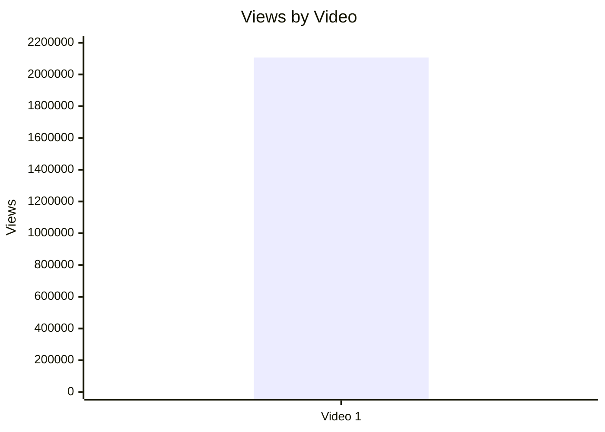

| Video | Views | Коментар |
|---|---:|---|
| Video 1 | 2 106 480 | Єдиний доступний звіт; outlier-статус узято з базового аналізу, але міжвідео-порівняння неможливе. |

## 5.2. Views per day by video

- Назва графіка: Views per day by video
- Яке питання він відповідає: яка швидкість набору переглядів з урахуванням віку відео?
- Які поля використовуються: `video_label`, `views_per_day`
- Тип графіка: Mermaid bar chart
- Що видно з графіка: Video 1 має 5 967.37 views/day.
- Практичний висновок: це краща база для майбутнього порівняння з іншими long-form відео, ніж raw views.

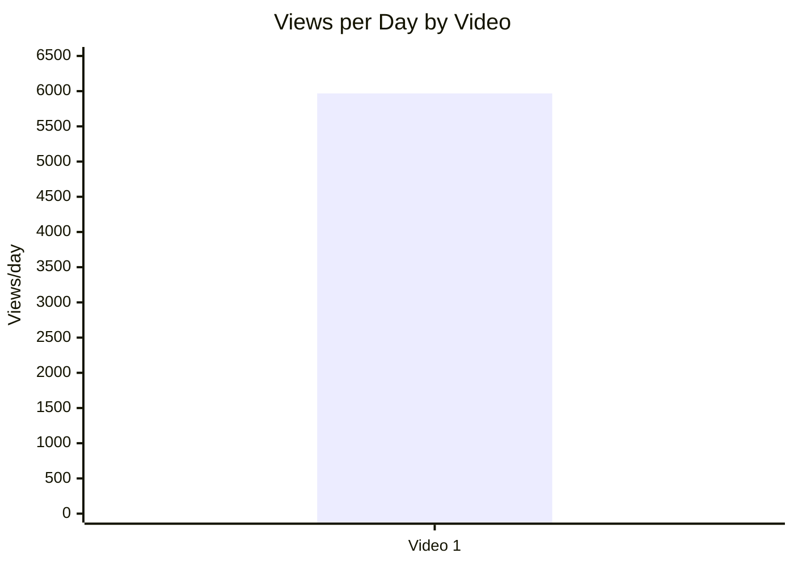

## 5.3. Views per 1k subscribers

- Назва графіка: Views per 1k subscribers
- Яке питання він відповідає: наскільки відео конвертує розмір каналу в перегляди?
- Які поля використовуються: `video_label`, `views_per_1k_subs`
- Тип графіка: Mermaid bar chart
- Що видно з графіка: Video 1 має 1 144.83 views per 1k subscribers.
- Практичний висновок: відео вийшло за межі “1 перегляд на 1 підписника” у public-normalized вимірі, але без когорти це не можна назвати статистичним патерном.

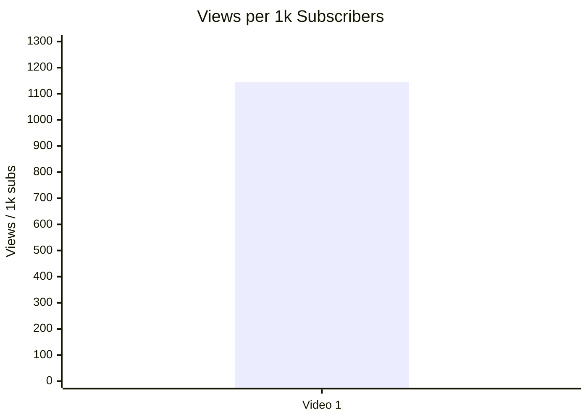

## 5.4. Performance quadrant

- Назва графіка: Performance quadrant
- Яке питання він відповідає: чи поєднує відео охоплення й engagement?
- Які поля використовуються: `views_per_day`, `er_public_percent`
- Тип графіка: scatter plot concept / data table
- Що видно з графіка: є лише одна точка, тому quadrant thresholds неможливо визначити на основі вибірки.
- Практичний висновок: додайте мінімум 4–5 comparable long-form відео, щоб визначити “high/low” пороги.

| Video | Views/day | ER Public % | Quadrant |
|---|---:|---:|---|
| Video 1 | 5 967.37 | 3.49 | `INSUFFICIENT_DATA` для quadrant classification |

## 6. Графіки залучення

## 6.1. ER Public % by video

- Назва графіка: ER Public % by video
- Яке питання він відповідає: яке public engagement має відео?
- Які поля використовуються: `video_label`, `er_public_percent`
- Тип графіка: Mermaid bar chart
- Що видно з графіка: Video 1 має ER Public 3.49%.
- Практичний висновок: показник можна використовувати як baseline для наступних відео, але не як доказ “високого/низького” без когорти.

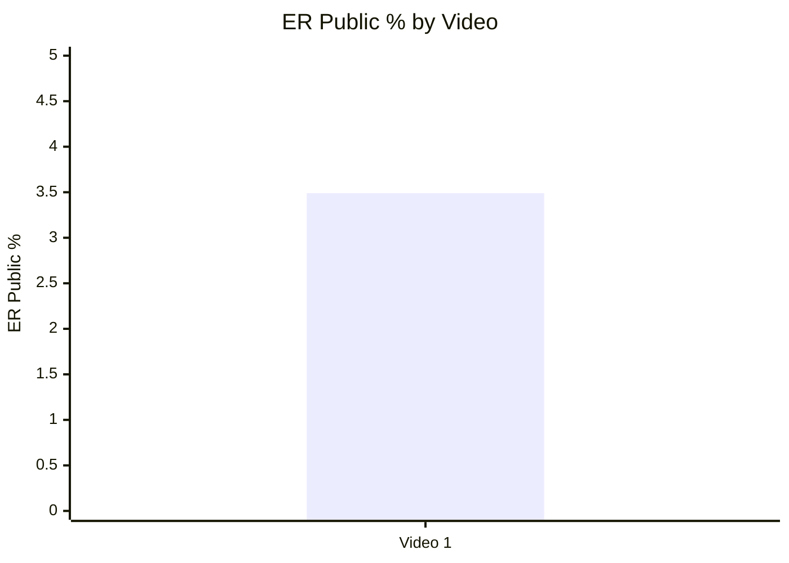

## 6.2. Like Rate % vs Comment Rate %

- Назва графіка: Like Rate % vs Comment Rate %
- Яке питання він відповідає: відео більше подобається чи більше провокує дискусію?
- Які поля використовуються: `like_rate_percent`, `comment_rate_percent`
- Тип графіка: scatter plot concept / data table
- Що видно з графіка: Video 1 має 2.61% like rate і 0.88% comment rate.
- Практичний висновок: comment activity сильна в абсолюті, але без порівняльної когорти не можна визначити quadrant.

| Video | Like Rate % | Comment Rate % | Interpretation |
|---|---:|---:|---|
| Video 1 | 2.61 | 0.88 | Описово: відео має помітний коментарний драйвер; статистична класифікація `INSUFFICIENT_DATA`. |

## 6.3. Comments per 1k views

- Назва графіка: Comments per 1k views
- Яке питання він відповідає: наскільки відео провокує реакцію на 1 000 переглядів?
- Які поля використовуються: `video_label`, `comments_per_1k_views`
- Тип графіка: Mermaid bar chart
- Що видно з графіка: 8.77 comments per 1k views.
- Практичний висновок: це ключовий baseline для майбутніх тем із controversy/debate механікою.

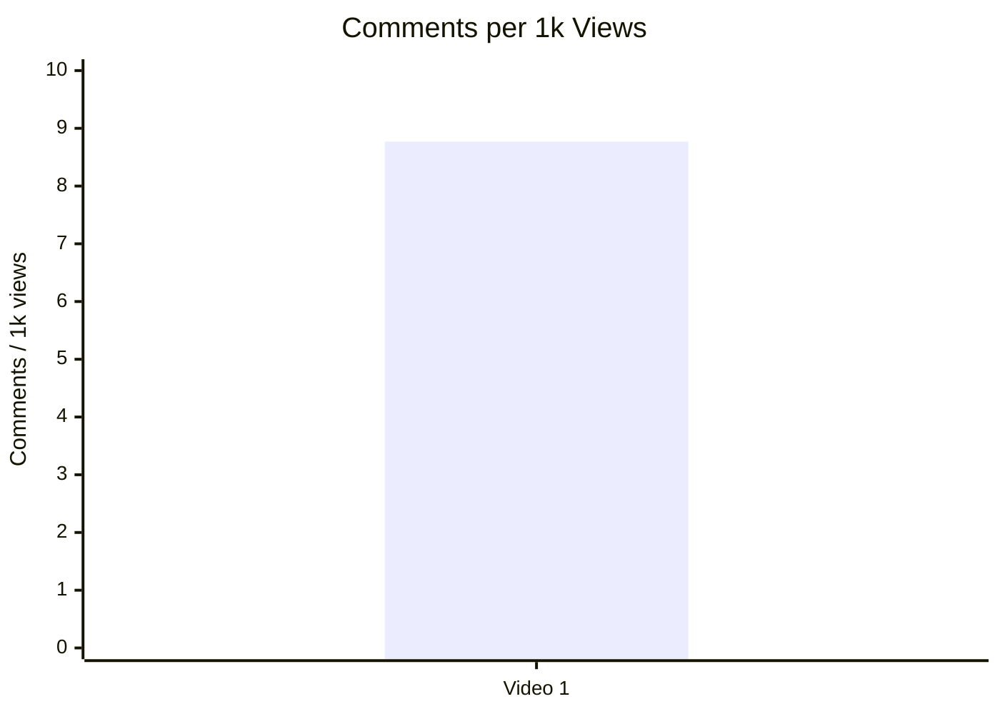

## 7. Графіки структури та hook

## 7.1. Hook score by video

- Назва графіка: Hook score by video
- Яке питання він відповідає: наскільки сильний hook?
- Які поля використовуються: `video_label`, `hook_score`
- Тип графіка: Mermaid bar chart
- Що видно з графіка: Hook score = 4/5.
- Практичний висновок: “shock object” hook варто тестувати повторно, але з більшою вибіркою.


## 7.2. Hook type distribution

- Назва графіка: Hook type distribution
- Яке питання він відповідає: які hook types використовуються?
- Які поля використовуються: `hook_primary_type`
- Тип графіка: Mermaid pie chart
- Що видно з графіка: доступний один primary hook type — `SHOCK`.
- Практичний висновок: `SHOCK` є робочою гіпотезою для майбутніх тестів, але не повторюваним патерном.

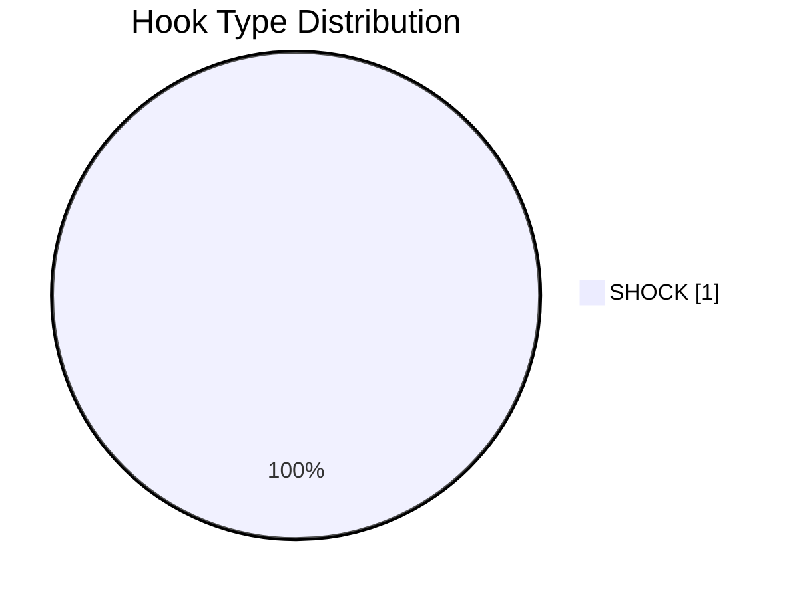

## 7.3. Time to first value vs Overall Score

- Назва графіка: Time to first value vs Overall Score
- Яке питання він відповідає: чи швидша перша цінність пов’язана з вищим результатом?
- Які поля використовуються: `time_to_first_value_seconds`, `overall_video_score`
- Тип графіка: scatter plot
- Що видно з графіка: `time_to_first_value` є приблизним (`approx_00:00-00:20_NO_TIMECODES`), тому точне X-значення не використовується.
- Практичний висновок: графік неможливо побудувати точно; для майбутніх звітів потрібні точні таймкоди.

| Video | time_to_first_value | time_to_first_value_seconds | Overall |
|---|---|---:|---:|
| Video 1 | approx_00:00-00:20_NO_TIMECODES | `INSUFFICIENT_DATA` | 3.85 |

## 8. Графіки CTA

## 8.1. CTA score by video

- Назва графіка: CTA score by video
- Яке питання він відповідає: наскільки сильна CTA-система відео?
- Які поля використовуються: `video_label`, `cta_score`
- Тип графіка: Mermaid bar chart
- Що видно з графіка: CTA score = 3/5.
- Практичний висновок: CTA є, але generic; варто тестувати конкретний comment prompt і next-video bridge.

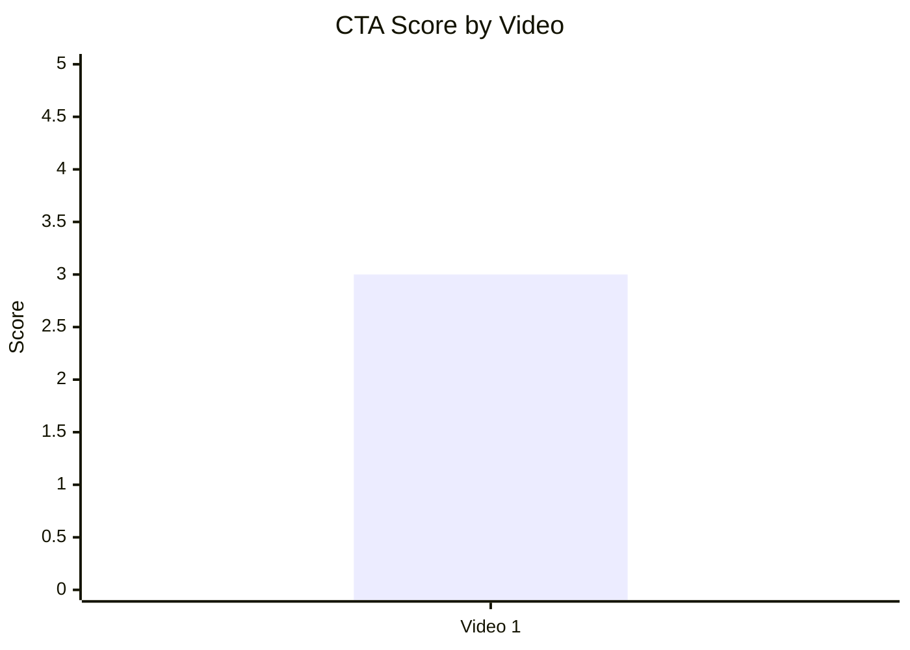

## 8.2. CTA count vs ER Public %

- Назва графіка: CTA count vs ER Public %
- Яке питання він відповідає: чи більше CTA пов’язано з кращим engagement?
- Які поля використовуються: `cta_count`, `er_public_percent`
- Тип графіка: scatter plot concept / data table
- Що видно з графіка: Video 1 має 6 CTA і ER Public 3.49%.
- Практичний висновок: зв’язок не оцінюється, бо є лише одна точка; ризик CTA overload не підтверджено статистично.

| Video | CTA count | ER Public % | Pattern |
|---|---:|---:|---|
| Video 1 | 6 | 3.49 | `INSUFFICIENT_DATA` для зв’язку CTA count → ER |

## 8.3. CTA features heatmap

- Назва графіка: CTA features heatmap
- Яке питання він відповідає: які CTA присутні / відсутні?
- Які поля використовуються: `has_comment_prompt`, `has_subscribe_cta`, `has_like_cta`, `has_bell_cta`, `has_next_video_bridge`
- Тип графіка: Markdown heatmap matrix
- Що видно з графіка: є comment prompt і like CTA; немає subscribe, bell і next-video bridge.
- Практичний висновок: головний CTA-тест — конкретизувати comment prompt і додати watch-next bridge.

| Video | Comment prompt | Subscribe | Like | Bell | Next video bridge |
|---|---|---|---|---|---|
| Video 1 | ✅ | ❌ | ✅ | `N/A` | ❌ |

## 9. Графіки реклами / інтеграцій

Реклама є: 1 sponsor integration, `ad_detected = true`.

## 9.1. Ad load % by video

- Назва графіка: Ad load % by video
- Яке питання він відповідає: яку частку відео займає реклама?
- Які поля використовуються: `video_label`, `ad_load_percent`
- Тип графіка: Mermaid bar chart
- Що видно з графіка: ad load = 10.34%.
- Практичний висновок: рекламне навантаження помітне; варто тестувати коротшу інтеграцію або пізніше розміщення.

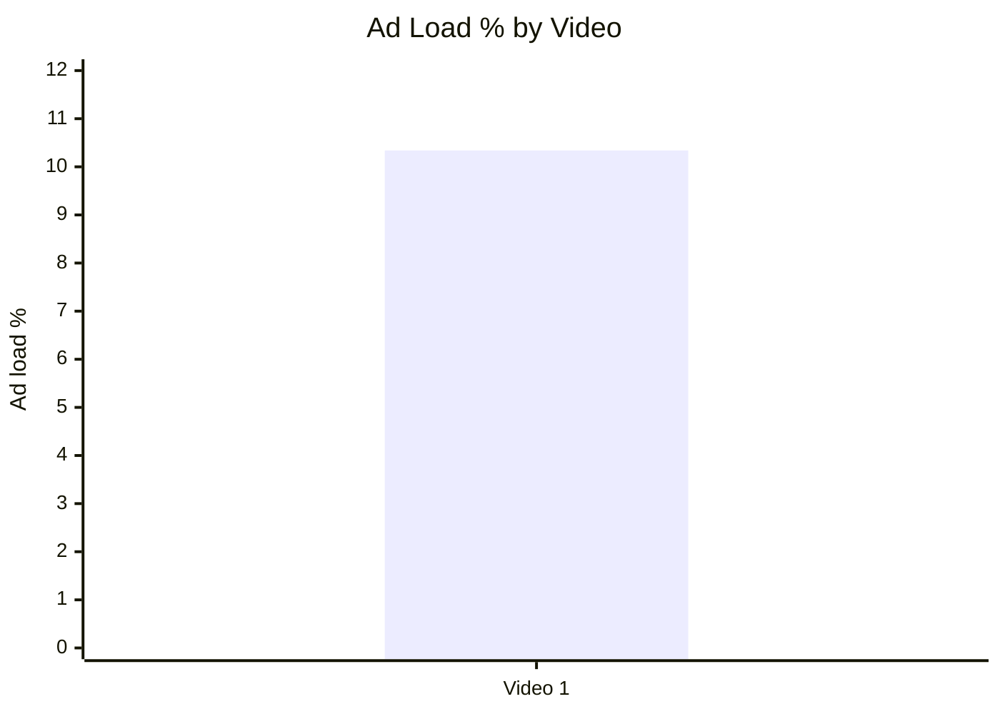

## 9.2. First ad position %

- Назва графіка: First ad position %
- Яке питання він відповідає: наскільки рано з’являється реклама?
- Які поля використовуються: `first_ad_relative_position_percent`
- Тип графіка: Mermaid bar chart
- Що видно з графіка: перша реклама починається приблизно на 8.6% тривалості відео.
- Практичний висновок: інтеграція стоїть рано; тест — перенос після першого повного value block.

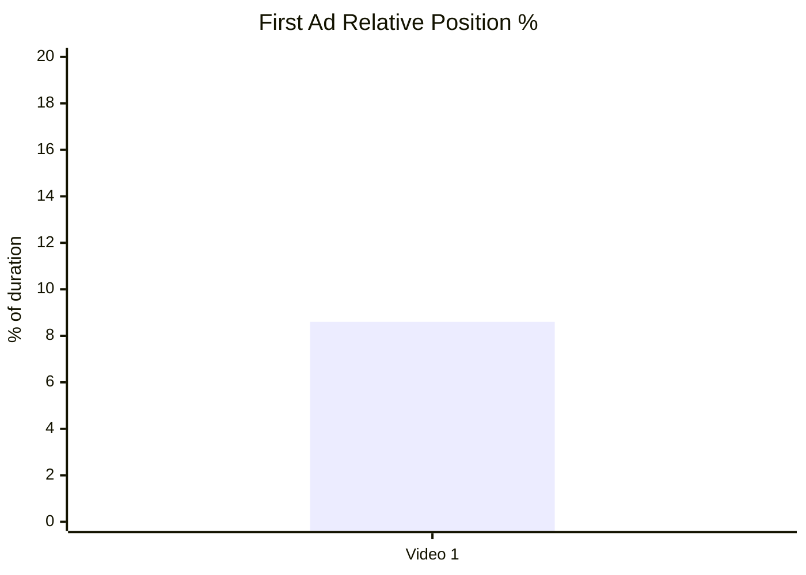

## 9.3. Ad integration score vs ER Public %

- Назва графіка: Ad integration score vs ER Public %
- Яке питання він відповідає: чи якість інтеграції пов’язана з engagement?
- Які поля використовуються: `ad_integration_score`, `er_public_percent`
- Тип графіка: scatter plot concept / data table
- Що видно з графіка: ad integration score = 2/5, ER Public = 3.49%.
- Практичний висновок: зв’язок не оцінюється через 1 відео; однак низький ad score — очевидна зона оптимізації.

| Video | Ad integration score | ER Public % | Interpretation |
|---|---:|---:|---|
| Video 1 | 2 | 3.49 | `INSUFFICIENT_DATA` для залежності; ad integration є слабкою точкою за score. |

## 10. Графіки аудіо

Аудіо-оцінки доступні: `audio_available = true`, `audio_score = 4`.

## 10.1. Audio score by video

- Назва графіка: Audio score by video
- Яке питання він відповідає: яка якість аудіо за score?
- Які поля використовуються: `audio_score`
- Тип графіка: Mermaid bar chart
- Що видно з графіка: audio score = 4/5.
- Практичний висновок: аудіо не є головною проблемою; основний фокус оптимізації — CTA/ad/source transparency.

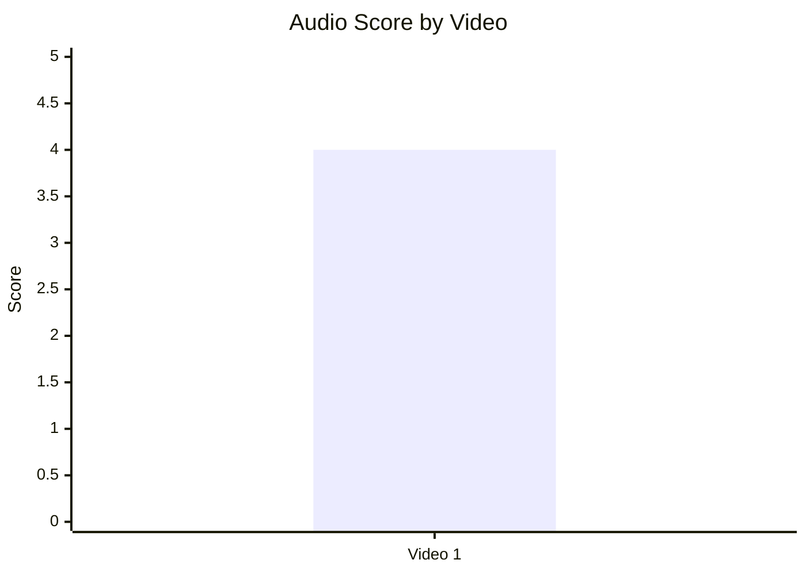

## 10.2. Audio score vs Overall Score

- Назва графіка: Audio score vs Overall Score
- Яке питання він відповідає: чи краща якість аудіо пов’язана з overall score?
- Які поля використовуються: `audio_score`, `overall_video_score`
- Тип графіка: scatter plot concept / data table
- Що видно з графіка: одна точка — audio 4, overall 3.85.
- Практичний висновок: залежність не оцінюється; для цього потрібно мінімум 5 відео.

| Video | Audio score | Overall score | Pattern |
|---|---:|---:|---|
| Video 1 | 4 | 3.85 | `INSUFFICIENT_DATA` для зв’язку audio → overall |

## 11. Графіки коментарів

## 11.1. Sentiment distribution

- Назва графіка: Sentiment distribution
- Яке питання він відповідає: якою була реакція аудиторії?
- Які поля використовуються: `positive_percent`, `negative_percent`, `mixed_percent`, `neutral_percent`, `question_percent`, `request_percent`, `joke_meme_percent`
- Тип графіка: Mermaid pie chart + table
- Що видно з графіка: реакція домінує через negative/debate/neutral/question, позитивна частка мала.
- Практичний висновок: тема створює коментарі через конфлікт і поляризацію; потрібна модерація та source transparency.

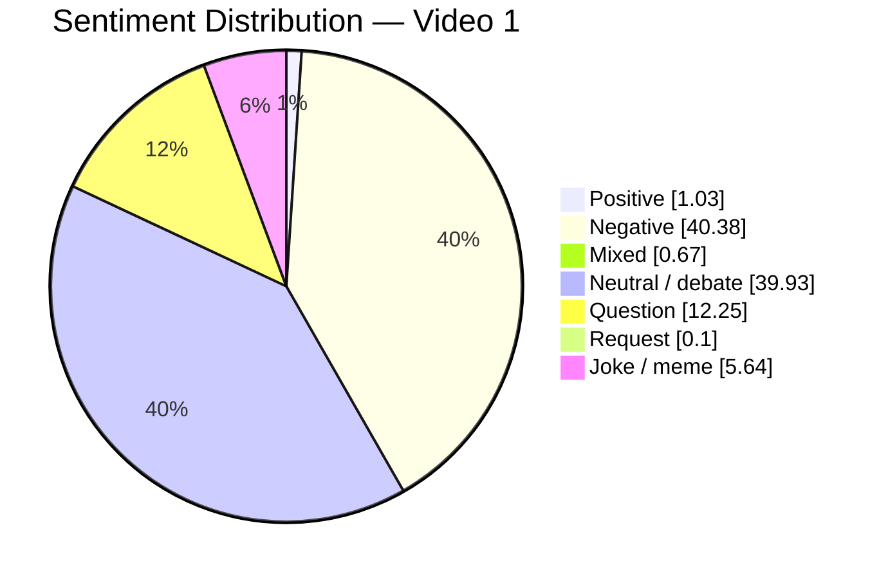

| Sentiment | Count | Percent |
|---|---:|---:|
| POSITIVE | 173 | 1.03% |
| NEGATIVE | 6 795 | 40.38% |
| MIXED | 113 | 0.67% |
| NEUTRAL | 6 718 | 39.93% |
| QUESTION | 2 062 | 12.25% |
| REQUEST | 16 | 0.10% |
| JOKE_MEME | 949 | 5.64% |

## 11.2. Comment resonance score by video

- Назва графіка: Comment resonance score by video
- Яке питання він відповідає: наскільки сильно відео спровокувало коментарі?
- Які поля використовуються: `comment_resonance_score`
- Тип графіка: Mermaid bar chart
- Що видно з графіка: comment resonance score = 5/5.
- Практичний висновок: коментарний потенціал — найсильніший score елемент відео.

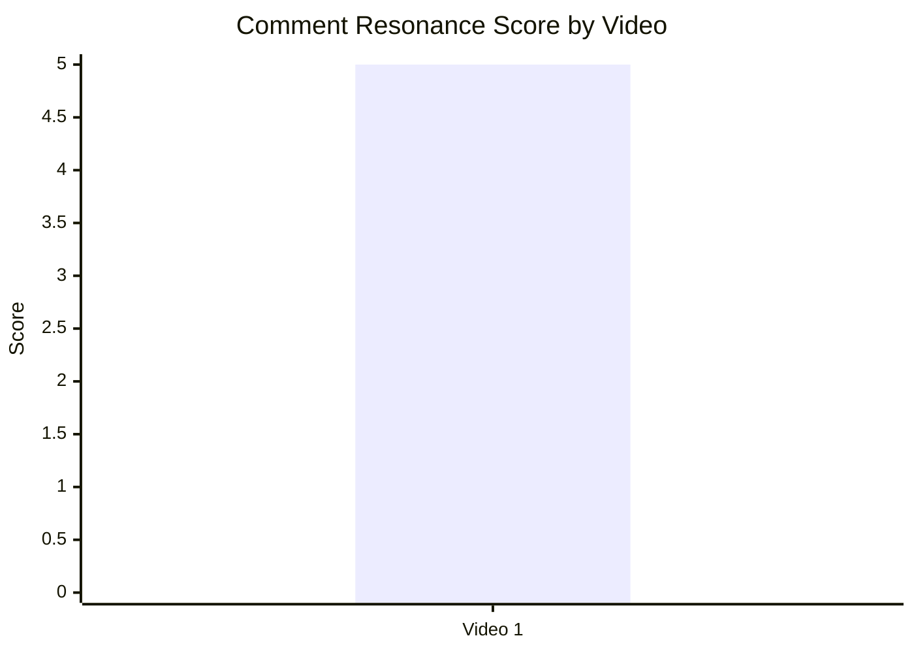

## 11.3. Top comment clusters

- Назва графіка: Top comment clusters
- Яке питання він відповідає: які типи реакцій найчастіші?
- Які поля використовуються: cluster name, percent
- Тип графіка: table / horizontal bar equivalent
- Що видно з графіка: найбільші кластери — general debate і disagreement.
- Практичний висновок: майбутні відео на цю тему мають включати сильну фактологічну рамку, бо debate/criticism є головним джерелом реакцій.

| Cluster | Percent | Bar |
|---|---:|---|
| General Zimbabwe/Rhodesia/farmers debate | 39.93% | ████████████████████ |
| Strong disagreement / moral judgment / anti-return reactions | 38.01% | ███████████████████ |
| Clarification / rhetorical questions | 12.25% | ██████ |
| Humor / meme reactions | 5.64% | ███ |
| Accuracy / framing criticism | 2.22% | █ |
| Praise / constructive appreciation | 1.03% | ▌ |
| Personal stories / lived experience | 0.67% | ▌ |
| Ad complaints | 0.12% | ▏ |
| Topic requests | 0.10% | ▏ |
| Audio / music complaints | 0.03% | ▏ |

## 12. Графіки score-системи

## 12.1. Overall score by video

- Назва графіка: Overall score by video
- Яке питання він відповідає: яка загальна оцінка відео?
- Які поля використовуються: `overall_video_score`
- Тип графіка: Mermaid bar chart
- Що видно з графіка: overall score = 3.85/5.
- Практичний висновок: сильна база, але реклама й CTA знижують середній score.

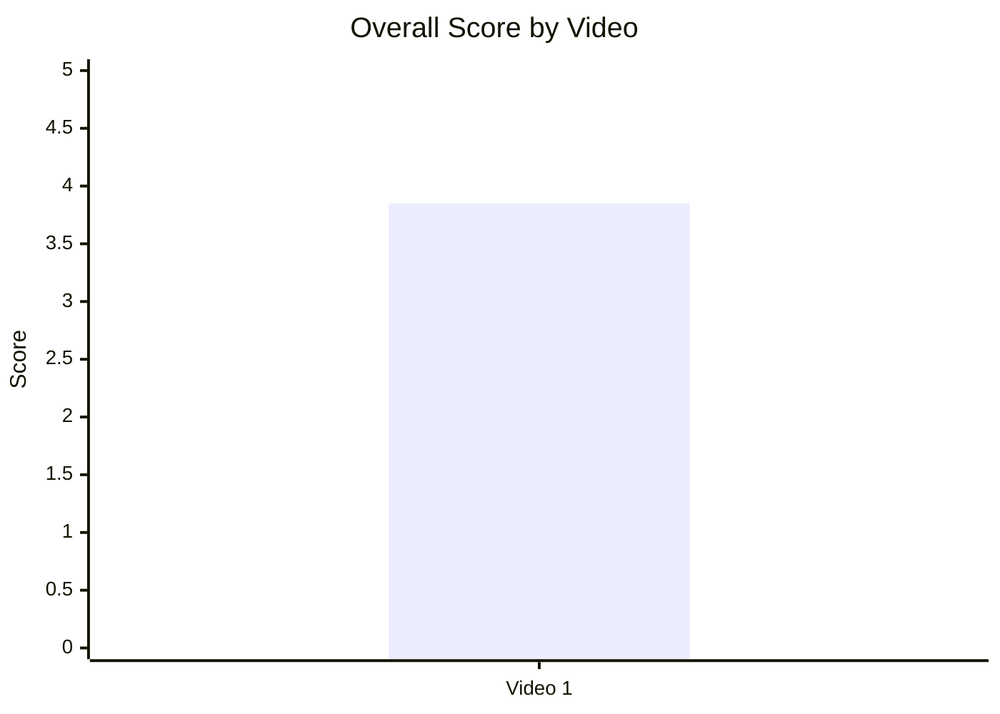

## 12.2. Score breakdown heatmap

- Назва графіка: Score breakdown heatmap
- Яке питання він відповідає: де сильні й слабкі місця відео?
- Які поля використовуються: `hook_score`, `structure_score`, `value_density_score`, `audio_score`, `cta_score`, `ad_integration_score`, `comment_resonance_score`, `replicability_score`, `overall_video_score`
- Тип графіка: Markdown heatmap table
- Що видно з графіка: найсильніше — comments 5/5; найслабше — ad integration 2/5.
- Практичний висновок: масштабувати hook/story/comment mechanics; оптимізувати рекламу й CTA.

| Video | Hook | Structure | Value Density | Audio | CTA | Ad | Comments | Replicability | Overall |
|---|---:|---:|---:|---:|---:|---:|---:|---:|---:|
| Video 1 | 4 | 4 | 4 | 4 | 3 | 2 | 5 | 4 | 3.85 |

| Score | Heatmap meaning |
|---:|---|
| 5 | Very strong |
| 4 | Strong |
| 3 | Adequate / improvable |
| 2 | Weak |
| 1 | Very weak |

## 12.3. Strengths vs weaknesses count

- Назва графіка: Strengths vs weaknesses count
- Яке питання він відповідає: скільки success mechanics і missed opportunities зафіксовано?
- Які поля використовуються: `top_success_mechanic_*`, `top_missed_opportunity_*`
- Тип графіка: Mermaid bar chart
- Що видно з графіка: у Comparable Summary JSON є 3 top success mechanics і 3 top missed opportunities.
- Практичний висновок: потенціал сильний, але є конкретні production/monetization fixes.

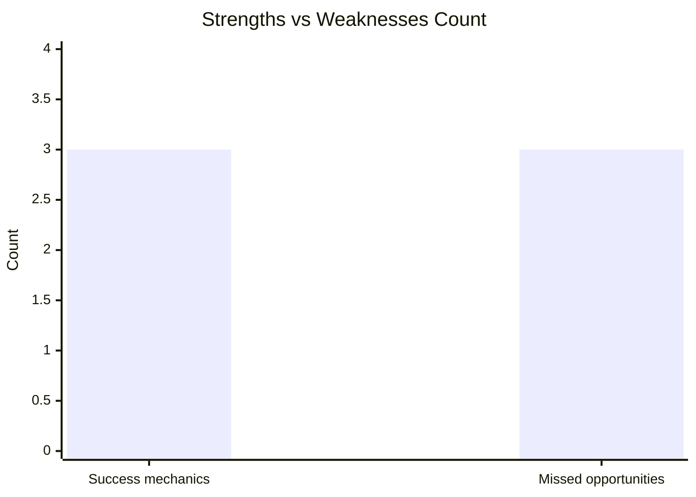

| Type | Count | Items |
|---|---:|---|
| Success mechanics | 3 | `CLEAR_HOOK`, `CONTROVERSY_OR_DEBATE`, `STRONG_STORY_STRUCTURE` |
| Missed opportunities | 3 | `AD_TOO_EARLY`, `AD_TOO_LONG`, `COMMENTS_SHOW_TOPIC_GAP` |

## 13. Кореляції та патерни

Correlation analysis skipped: fewer than 5 comparable videos.

| Pair | Correlation / Pattern | Strength | Interpretation | Confidence |
|---|---:|---|---|---|
| hook_score → overall_video_score | `INSUFFICIENT_DATA` | N/A | 1 відео не дозволяє оцінити зв’язок. | LOW |
| value_density_score → er_public_percent | `INSUFFICIENT_DATA` | N/A | 1 відео не дозволяє оцінити зв’язок. | LOW |
| cta_score → comment_rate_percent | `INSUFFICIENT_DATA` | N/A | 1 відео не дозволяє оцінити зв’язок. | LOW |
| comment_resonance_score → er_public_percent | `INSUFFICIENT_DATA` | N/A | 1 відео не дозволяє оцінити зв’язок. | LOW |
| views_per_day → er_public_percent | `INSUFFICIENT_DATA` | N/A | 1 відео не дозволяє оцінити reach/engagement balance. | LOW |
| ad_load_percent → er_public_percent | `INSUFFICIENT_DATA` | N/A | 1 відео не дозволяє оцінити вплив ad load. | LOW |
| time_to_first_value_seconds → overall_video_score | `INSUFFICIENT_DATA` | N/A | Немає точного time_to_first_value_seconds. | LOW |

## 14. Висновки для контент-стратегії

| Спостереження | Дані / графік | Що це означає | Що робити |
|---|---|---|---|
| Hook через матеріальний символ кризи має сильний потенціал | Hook score 4/5; primary hook `SHOCK`; score chart 7.1 | Такий старт швидко пояснює stakes і тему. | Для наступних відео шукати “один предмет / цифру / документ”, який втілює конфлікт. |
| Comment resonance — головний актив відео | Comment resonance 5/5; 18 470 comments; 8.77 comments/1k views | Тема й framing запускають дискусію. | Додавати конкретний comment prompt, щоб підвищити якість дискусії, а не лише її обсяг. |
| Реклама — головна score-слабкість | Ad integration score 2/5; ad load 10.34%; first ad position 8.6% | Інтеграція може переривати curiosity до основного value block. | Тестувати sponsor read після першого payoff або скорочення до 45–60 секунд. |
| CTA є, але не максимізує session depth | CTA score 3/5; no subscribe CTA; no next-video bridge | Відео генерує реакцію, але слабше веде до наступної дії. | Додати end screen bridge на пов’язану тему та конкретне питання в pinned comment. |
| Accuracy / framing criticism є помітним ризиком | 373 коментарі accuracy/framing criticism; top missed opportunity `COMMENTS_SHOW_TOPIC_GAP` | Для спірних геополітичних тем trust risk може шкодити каналу. | Додавати source list, correction/pinned comment, on-screen citations для ключових тверджень. |
| Аудіо не є головним bottleneck | Audio score 4/5; лише 5 audio/music complaints | Технічна якість не обмежує результат у цьому звіті. | Не витрачати основний optimization budget на аудіо, поки CTA/ad/source fixes не протестовані. |

## 15. Що тестувати далі

| Тест | Гіпотеза | На яких даних базується | Як виміряти | Пріоритет |
|---|---|---|---|---|
| Sponsor після першого value block | Пізніша реклама зменшить disruption без втрати sponsor value. | Ad score 2/5; ad starts ≈8.6%; `AD_TOO_EARLY`. | Compare retention before/after ad, ER Public %, comments about ads, sponsor CTR якщо доступно. | HIGH |
| Скорочена sponsor integration | 45–60 секунд можуть зменшити ad fatigue. | Ad load 10.34%; `AD_TOO_LONG`; ad complaints cluster. | Watch retention around ad segment, ad complaint count per 1k comments. | HIGH |
| Конкретний comment prompt | Конкретне питання переведе debate у якісніші коментарі. | CTA score 3/5; has_comment_prompt true, but has_specific_comment_prompt false. | Comment rate %, частка question/constructive comments, toxicity/moderation load. | HIGH |
| Pinned source / correction comment | Source transparency знизить accuracy/framing criticism. | 373 accuracy/framing criticism comments; `COMMENTS_SHOW_TOPIC_GAP`. | Частка criticism_accuracy у коментарях, like ratio pinned comment, sentiment shift. | HIGH |
| End screen bridge на sequel | Відео з високим interest може краще вести в наступний перегляд. | no next-video bridge; topic requests exist; high comment resonance. | End screen CTR, session duration, views on follow-up. | MEDIUM |
| Повторити `SHOCK` hook через інший crisis artifact | Shock hook може бути переносимим на інші geopolitical/economic collapse теми. | Hook score 4/5; success mechanic `CLEAR_HOOK`. | First 30 sec retention, views/day, hook score у наступних звітах. | HIGH |
| Серія “economic collapse & recovery” | Формат може масштабуватися на South Africa / land crisis / sanctions теми. | `CONTROVERSY_OR_DEBATE`, high comments, topic requests. | Views/day, ER Public %, comment resonance, toxicity/moderation load. | MEDIUM |

## 16. Дані для експорту в таблицю / CSV

| video_label | title | format_group | views | views_per_day | like_rate_percent | comment_rate_percent | er_public_percent | views_per_1k_subs | hook_type | hook_score | cta_count | cta_score | ad_load_percent | ad_integration_score | audio_score | comment_resonance_score | overall_video_score | top_success_mechanic | top_missed_opportunity |
|---|---|---|---:|---:|---:|---:|---:|---:|---|---:|---:|---:|---:|---:|---:|---:|---:|---|---|
| Video 1 | Why Zimbabwe wants its ‘white farmers’ back | LONG_10_20_MIN | 2106480 | 5967.37 | 2.61 | 0.88 | 3.49 | 1144.83 | SHOCK | 4 | 6 | 3 | 10.34 | 2 | 4 | 5 | 3.85 | CLEAR_HOOK | AD_TOO_EARLY |

```csv
video_label,title,format_group,views,views_per_day,like_rate_percent,comment_rate_percent,er_public_percent,views_per_1k_subs,hook_type,hook_score,cta_count,cta_score,ad_load_percent,ad_integration_score,audio_score,comment_resonance_score,overall_video_score,top_success_mechanic,top_missed_opportunity
Video 1,"Why Zimbabwe wants its ‘white farmers’ back",LONG_10_20_MIN,2106480,5967.37,2.61,0.88,3.49,1144.83,SHOCK,4,6,3,10.34,2,4,5,3.85,CLEAR_HOOK,AD_TOO_EARLY
```
