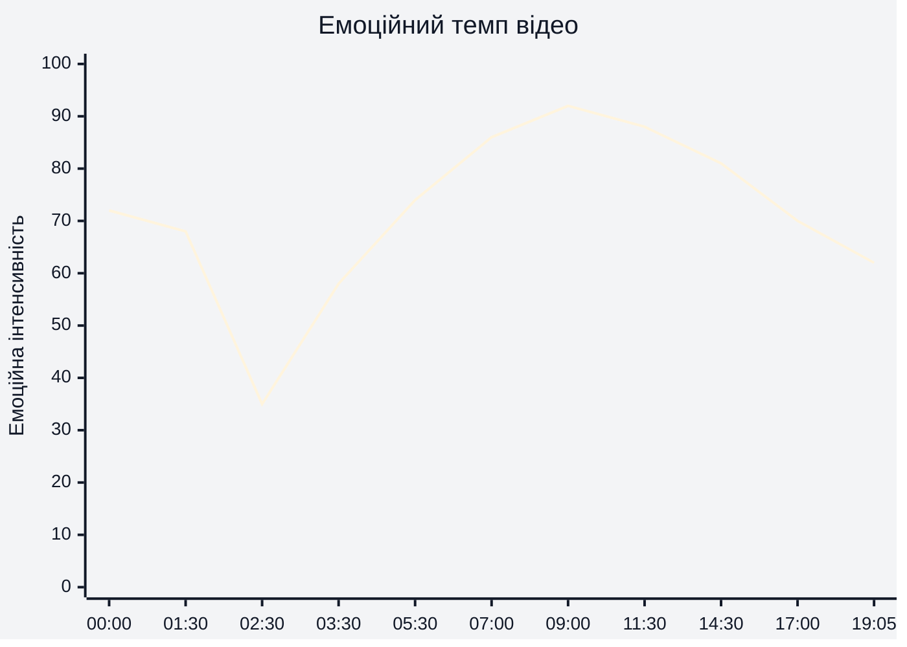
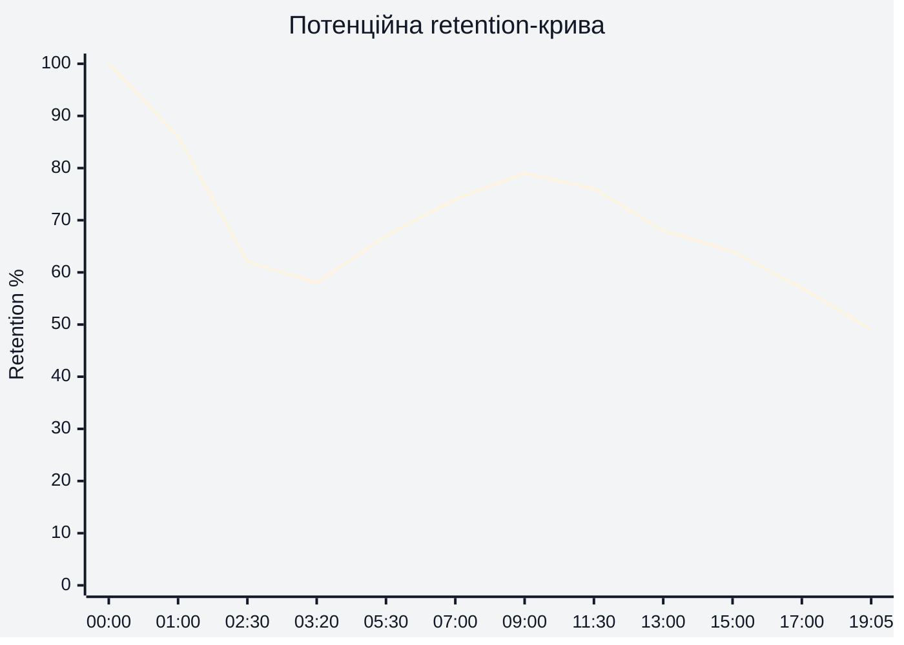
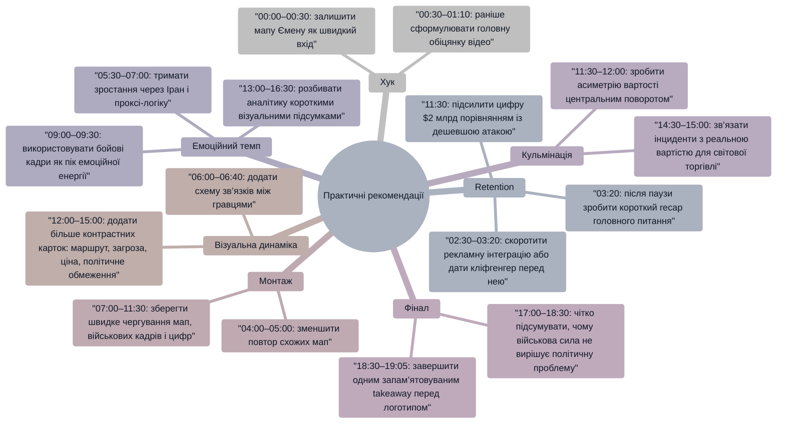

# Аналіз довгоформатного YouTube-відео

> **Відео:** `Why the US Navy can’t stop Houthi rebels(1).mp4`  
> **Тривалість:** 19:05  
> **Тема:** Чому ВМС США не можуть повністю зупинити атаки хуситів у Червоному морі  
> **Джерело аналізу:** відеоряд завантаженого MP4. Окремий транскрипт із таймкодами та реальні retention-дані не були надані, тому retention-крива нижче є **потенційною retention-структурою**, побудованою за монтажем, візуальними змінами, темпом ескалації та сюжетними переходами.

---

## 1. Сюжетна дуга (Narrative Arc)

```mermaid
%%{init: {'theme':'base', 'themeVariables': {
'primaryColor':'#f3f4f6',
'primaryTextColor':'#111827',
'primaryBorderColor':'#2563eb',
'lineColor':'#2563eb',
'secondaryColor':'#ffffff',
'tertiaryColor':'#f3f4f6',
'background':'#f3f4f6'
}}}%%
flowchart LR
    A["00:00–01:10<br/>Хук<br/>Мапа Ємену й Червоного моря одразу ставить конфлікт у географічний контекст"] -->
    B["01:10–02:30<br/>Експозиція<br/>Пояснюється масштаб морської загрози через кораблі, глобус і торгові маршрути"] -->
    C["02:30–03:20<br/>Пауза / інтеграція<br/>Рекламний або освітній блок знижує напругу після сильного вступу"] -->
    D["03:20–05:40<br/>Перша ескалація<br/>Повернення до хуситів, мап Ємену та зон контролю; конфлікт стає конкретнішим"] -->
    E["05:40–07:10<br/>Переломний момент<br/>У фокус входить Іран, проксі-мережі та регіональна логіка протистояння"] -->
    F["07:10–11:40<br/>Наростання напруги<br/>Зони ураження, бойові кадри, ракети, катери й військова відповідь США піднімають ставки"] -->
    G["11:40–15:10<br/>Кульмінація<br/>Показано асиметрію: дорогі американські кораблі й дешевші атаки, торгові маршрути під тиском"] -->
    H["15:10–19:05<br/>Розв’язка та фінальний висновок<br/>Вашингтон, Ізраїль, Перська затока й фінальна мапа показують, що проблема ширша за одну операцію"]
```

**Висновок:** відео має чітку геополітичну дугу: від простого запитання в районі Ємену на **00:00–01:10** до ширшого висновку про регіональну асиметрію та обмеження військової сили на **15:10–19:05**.

---

## 2. Ключові Story Beats

```mermaid
%%{init: {'theme':'base', 'themeVariables': {
'primaryColor':'#f3f4f6',
'primaryTextColor':'#111827',
'primaryBorderColor':'#2563eb',
'lineColor':'#2563eb',
'secondaryColor':'#ffffff',
'tertiaryColor':'#f3f4f6',
'background':'#f3f4f6'
}}}%%
flowchart LR
    A["00:00<br/>Ємен на мапі<br/>Функція: миттєвий географічний хук"] -->
    B["00:30<br/>Образ ВМС США<br/>Функція: вводить головного силового гравця"] -->
    C["01:30<br/>Кораблі в морі<br/>Функція: масштабує проблему до військово-морського рівня"] -->
    D["02:00<br/>Глобус<br/>Функція: переводить локальну кризу в глобальний контекст"] -->
    E["02:30–03:20<br/>Рекламна інтеграція<br/>Функція: пауза, але ризик втрати уваги"] -->
    F["03:30<br/>Персоналізація хуситського руху<br/>Функція: дає обличчя конфлікту"] -->
    G["05:30<br/>Іранський слід<br/>Функція: розкриває глибшу мережу підтримки та мотивів"] -->
    H["07:00<br/>Кола загрози на мапі<br/>Функція: візуалізує досяжність атак і піднімає ставки"] -->
    I["09:00<br/>Кадри атаки / ракети / катера<br/>Функція: демонструє реальну небезпеку, а не лише теорію"] -->
    J["11:30<br/>Вартість $2 млрд<br/>Функція: показує асиметрію ціни між обороною й атакою"] -->
    K["14:30–15:00<br/>Маршрути та інциденти<br/>Функція: підтверджує системність загрози для судноплавства"] -->
    L["17:00–19:05<br/>Вашингтон, Ізраїль і фінальна мапа<br/>Функція: виводить локальний сюжет у стратегічний висновок"]
```

**Висновок:** найсильніші story beats припадають на **07:00**, **09:00**, **11:30** і **14:30–15:00**, бо саме там відео переходить від пояснення до конкретних доказів масштабу, вартості й стратегічних наслідків.

---

## 3. Емоційний темп

**Пояснення за таймкодами:**

- **00:00–01:30** — сильний старт завдяки мапі Ємену, згадці ВМС США й морському масштабу; інтенсивність висока, бо питання одразу конфліктне.
- **02:30–03:20** — найнижча емоційна точка через рекламний/освітній блок; напруга сюжету тимчасово зупиняється.
- **05:30–07:00** — інтенсивність різко зростає через появу іранського контексту, проксі-логіки та зон загрози на мапі.
- **09:00–11:30** — пік емоційної динаміки: бойові кадри, ракети, катери, авіація й вартість американських кораблів роблять проблему відчутною.
- **17:00–19:05** — інтенсивність знижується, бо відео переходить від бойової драматургії до стратегічного підсумку.

---

## 4. Утримання аудиторії

**Тип кривої:** потенційна retention-структура, оскільки реальні YouTube Studio retention-дані не були надані.

**Пояснення за таймкодами:**

- **00:00–01:00** — очікувано високе утримання: мапа, конфлікт і велике питання відео створюють швидкий контекст.
- **02:30–03:20** — потенційний спад через рекламну інтеграцію; глядачі, які прийшли за геополітичним поясненням, можуть вийти.
- **07:00–11:30** — потенційне відновлення retention через візуальні докази: радіуси загрози, бойові кадри, ракети, катери та порівняння вартості.
- **13:00–17:00** — поступове зниження, бо відео стає більш аналітичним: Вашингтон, стратегічні маршрути та наслідки потребують більше концентрації.
- **17:00–19:05** — природне падіння наприкінці, але фінальні мапи Ізраїлю, Перської затоки та логотип на **18:30–19:05** утримують аудиторію, яка хоче повний висновок.

---

## 5. Піки retention

| Таймкод | Подія | Чому це може утримувати увагу | Сила піку 1–10 |
|---|---|---|---:|
| 00:00–00:30 | Мапа Ємену та Червоного моря | Глядач одразу розуміє місце конфлікту й отримує чітке запитання відео | 8 |
| 01:30–02:00 | Кораблі в морі та глобальний масштаб | Візуальний перехід від мапи до реальної військово-морської сили підсилює значення теми | 7 |
| 03:30–04:30 | Повернення до хуситів і мапи після паузи | Відео знову входить у головний сюжет після рекламного просідання | 6 |
| 05:30–07:00 | Іранський контекст і зони загрози | З’являється глибша причина, чому локальний актор може створювати глобальну проблему | 9 |
| 09:00–09:30 | Кадри ракети, вибуху та катера | Конфлікт стає не абстрактним, а фізично небезпечним і видовищним | 10 |
| 11:30–12:00 | Плашка з вартістю корабля `$2 billion` | Сильний контраст вартості оборони й атак створює зрозумілу асиметрію | 9 |
| 14:30–15:00 | Мапа судноплавства та інцидентів | Глядач бачить, що проблема системна й напряму пов’язана з торговими маршрутами | 8 |
| 17:00–18:00 | Білий дім, Ізраїль і регіональна рамка | Фінальний стратегічний контекст допомагає зрозуміти, чому простого військового рішення немає | 7 |

---

## 6. Провали retention

| Таймкод | Проблема | Ймовірна причина спаду | Що покращити |
|---|---|---|---|
| 02:30–03:20 | Різкий перехід у рекламну/освітню інтеграцію | Основний конфлікт переривається до того, як глядач отримав достатню відповідь на головне питання | Скоротити блок або вставити перед ним міні-кліфгенгер: “але головна причина не у флоті, а в економіці асиметрії” |
| 04:00–05:00 | Кілька схожих мап Ємену поспіль | Візуальна інформація повторюється, темп може здаватися статичним | Додати більше зміни масштабу: мапа → корабель → маршрут → конкретний інцидент |
| 06:00–06:40 | Аналітична частина про мережі й підтримку | Якщо пояснення довге, глядач може втратити нитку без швидкого візуального підсумку | Вставити коротку схему “Іран → хусити → Червоне море → світова торгівля” |
| 12:30–13:30 | Перехід від військової асиметрії до політичного контексту | Після сильного піку з `$2 billion` імовірний спад через менш видовищні кадри | Після цифри одразу дати приклад: “одна дешева ракета змушує реагувати корабель за мільярди” |
| 15:30–16:30 | Вашингтон і повтор мап регіону | Темп стає пояснювальним, а не конфліктним | Додати проміжний stakes-card: “що США можуть зробити / що не можуть зробити” |
| 18:00–18:30 | Фінальний географічний перехід перед логотипом | Частина глядачів уже отримала головну відповідь і може не чекати фінальний кадр | Сформулювати фінальний висновок раніше, а останні 20–30 секунд зробити як чіткий takeaway |

---

## 7. Оцінка сегментів

| Сегмент | Таймкод | Функція | Емоційна інтенсивність | Ризик втрати уваги | Оцінка 1–10 | Що покращити |
|---|---|---|---:|---|---:|---|
| Вступний хук | 00:00–01:10 | Поставити проблему через мапу Ємену, Червоне море та ВМС США | 72 | Низький | 8 | Додати ще чіткіший verbal/visual promise: “чому суперфлот не вирішує дешеву асиметричну загрозу” |
| Масштабування проблеми | 01:10–02:30 | Показати кораблі, глобус і значення морських маршрутів | 68 | Середній | 7 | Швидше підвести до конкретного “чому не можуть зупинити” |
| Рекламна інтеграція | 02:30–03:20 | Монетизаційна пауза / зовнішній блок | 35 | Високий | 4 | Скоротити або вбудувати інтеграцію після першої сильної відповіді, а не до неї |
| Повернення до хуситів | 03:20–05:30 | Розкрити акторів, територію й локальну основу конфлікту | 58 | Середній | 7 | Додати короткий recap після реклами на **03:20** |
| Іранський контекст | 05:30–07:10 | Пояснити регіональні зв’язки, підтримку та ширший конфлікт | 74 | Середній | 8 | Більше графічних стрілок між гравцями, щоб не перевантажувати аналітикою |
| Зони загрози | 07:10–08:30 | Візуалізувати, чому Червоне море є вразливим | 86 | Низький | 9 | Зробити цей блок ключовим “моментом прозріння” із короткою формулою проблеми |
| Бойові приклади | 08:30–10:30 | Показати практичні наслідки: вертольоти, ракети, катери, кораблі | 92 | Низький | 10 | Зберегти швидкий монтаж і додати більше конкретних підписів подій |
| Асиметрія вартості | 10:30–12:30 | Пояснити, чому дорогий флот не гарантує дешеву перемогу | 88 | Низький | 9 | Показати порівняння вартості атаки й перехоплення в одному кадрі |
| Політична рамка США | 12:30–15:30 | Перейти до Вашингтона, маршрутів і стратегічних обмежень | 70 | Середній | 7 | Чергувати політичні кадри з конкретними наслідками для судноплавства |
| Фінальна стратегічна розв’язка | 15:30–19:05 | Пояснити, чому проблема залишається регіональною й довготривалою | 62 | Середній | 8 | Завершити одним сильним підсумковим реченням до логотипу на **18:30–19:05** |

---

## 8. Практичні рекомендації

---

## 9. Підсумкова оцінка

| Показник | Оцінка 1–10 | Коментар |
|---|---:|---|
| Сюжетна дуга | 8 | Дуга зрозуміла: **00:00** задає конфлікт, **07:00–11:30** піднімає ставки, **15:10–19:05** дає стратегічне пояснення. Найслабше місце — пауза на **02:30–03:20**. |
| Story Beats | 8 | Сильні beats на **05:30**, **07:00**, **09:00**, **11:30** і **14:30–15:00** добре ведуть глядача від локальної теми до глобальної асиметрії. |
| Емоційний темп | 7 | Темп сильний у бойових і візуальних блоках **07:00–11:30**, але просідає в рекламній інтеграції **02:30–03:20** та аналітичних переходах **13:00–16:30**. |
| Retention Structure | 7 | Потенційна retention-крива має природний спад, але відео добре відновлює увагу через зони загрози **07:00**, бойові кадри **09:00** і вартість корабля **11:30**. |
| Загальна оцінка | 8 | Відео має сильну тему, зрозумілу географічну візуалізацію й переконливу асиметричну кульмінацію. Головне покращення — скоротити або краще підготувати паузу **02:30–03:20** і зробити фінальний takeaway на **18:00–19:05** гострішим. |
