# Статистичний аналіз відеозвітів

## 1. Короткий executive summary

| Пункт | Висновок |
|---|---|
| Скільки відео проаналізовано | 1 |
| Скільки форматів відео | 1: `LONG_10_20_MIN` |
| Найсильніше відео за overall score | Video 1 — `Why the US Navy can’t stop Houthi rebels`: 4/5 |
| Найсильніше відео за ER Public % | Video 1 — 2.59% |
| Найсильніше відео за views per day | Video 1 — 2 762.84 |
| Найсильніша повторювана механіка | `INSUFFICIENT_DATA` для повторюваності між відео; в одному відео найсильніший механізм: high-contrast conflict “US Navy vs Houthis” + cost asymmetry |
| Найчастіша слабкість | `INSUFFICIENT_DATA` для повторюваності між відео; в одному відео головна слабкість: рання sponsor integration із trust backlash |
| Головна стратегічна можливість | Зробити sequel/update і протестувати перенесення реклами після першого payoff + конкретний comment prompt |
| Рівень впевненості | LOW: є лише 1 порівнюваний звіт, тому дозволена тільки описова статистика без кореляцій |

## 2. Якість і повнота даних

| Поле | Кількість відео з даними | Кількість N/A | Коментар |
|---|---:|---:|---|
| views | 1 | 0 | Є public metric: 1 693 623 |
| likes | 1 | 0 | Є public metric: 36 171 |
| comments_count | 1 | 0 | Є public metric: 7 638 |
| views_per_day | 1 | 0 | Є derived metric: 2 762.84 |
| er_public_percent | 1 | 0 | Є derived metric: 2.59% |
| views_per_1k_subs | 1 | 0 | Є derived metric: 920.45 |
| hook_score | 1 | 0 | 4/5 |
| cta_score | 1 | 0 | 2/5 |
| ad_integration_score | 1 | 0 | 2/5 |
| audio_score | 1 | 0 | 4/5 |
| comment_resonance_score | 1 | 0 | 5/5 |
| overall_video_score | 1 | 0 | 4/5 |

### Обмеження аналізу

- Проаналізовано лише 1 відео, тому статистичні кореляції, кластери між відео та висновки про повторюваність позначені як `INSUFFICIENT_DATA`.
- Усі стратегічні висновки мають рівень `LOW_CONFIDENCE`, бо немає мінімум 5 порівнюваних відео.
- Дані взято тільки з прикріпленого звіту `YT_VIDEO_ANALYSIS_V1`; відео не переаналізовувалося з нуля.
- Вихідний аналіз має `PARTIAL_DATA`, `NO_TIMECODES`, `OWNER_ONLY_CTR`, `OWNER_ONLY_IMPRESSIONS`, `OWNER_ONLY_RETENTION`, `OWNER_ONLY_WATCH_TIME`, `OWNER_ONLY_TRAFFIC_SOURCES`.
- Sentiment distribution у відсотках не надано; доступні тільки comment clusters із size signals.

## 3. Підготовлена таблиця для графіків

| Video | Format | Views | Views/day | Like Rate % | Comment Rate % | ER Public % | Views/1k subs | Hook | CTA | Ad | Audio | Comment Resonance | Overall |
|---|---|---:|---:|---:|---:|---:|---:|---:|---:|---:|---:|---:|---:|
| Video 1 | LONG_10_20_MIN | 1 693 623 | 2 762.84 | 2.14 | 0.45 | 2.59 | 920.45 | 4 | 2 | 2 | 4 | 5 | 4 |

| Label | Full title | URL |
|---|---|---|
| Video 1 | Why the US Navy can’t stop Houthi rebels | https://www.youtube.com/watch?v=Y_eCu_pW6-4 |

## 4. Рекомендовані графіки

| # | Назва графіка | Тип графіка | Поля | Для чого потрібен | Пріоритет |
|---:|---|---|---|---|---|
| 1 | Overall score by video | Mermaid bar chart | overall_video_score | Побачити загальний рівень відео | HIGH |
| 2 | Views per day by video | Mermaid bar chart | views_per_day | Оцінити швидкість набору переглядів | HIGH |
| 3 | ER Public % by video | Mermaid bar chart | er_public_percent | Оцінити публічне залучення | HIGH |
| 4 | ER Public % vs Views/day | Table / quadrant note | views_per_day, er_public_percent | Побачити баланс reach і engagement | HIGH |
| 5 | Hook score by video | Mermaid bar chart | hook_score | Оцінити якість hook | HIGH |
| 6 | CTA score by video | Mermaid bar chart | cta_score | Оцінити CTA | HIGH |
| 7 | Score breakdown heatmap | Markdown heatmap table | scores 1–5 | Побачити сильні та слабкі сторони | HIGH |
| 8 | Sentiment distribution | Skipped / table substitute | sentiment fields | Немає відсотків sentiment | MEDIUM |
| 9 | CTA features heatmap | Markdown heatmap table | CTA boolean fields | Побачити, які CTA присутні | HIGH |
| 10 | Ad load % by video | Mermaid bar chart | ad_load_percent | Оцінити рекламне навантаження | HIGH |
| 11 | Top comment clusters | Mermaid bar chart | cluster size signals | Побачити теми реакції аудиторії | HIGH |

## 5. Графіки продуктивності

## 5.1. Views by video

- Назва графіка: Views by video
- Яке питання він відповідає: яке відео має найбільший raw reach?
- Які поля використовуються: `video_label`, `views`
- Тип графіка: Mermaid bar chart
- Що видно з графіка: є тільки один datapoint — 1 693 623 views.
- Практичний висновок: raw reach сам по собі не можна порівняти без інших відео; потрібна когорта `LONG_10_20_MIN`.

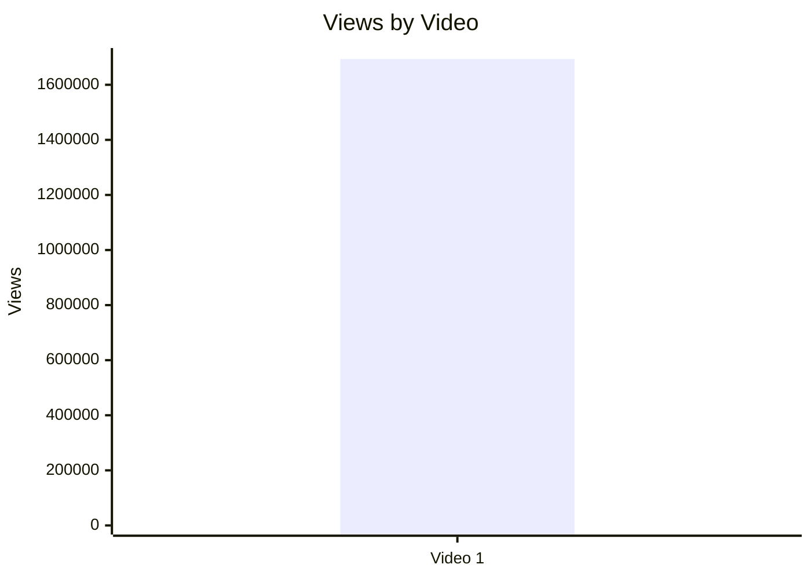

| Video | Views | Outlier status |
|---|---:|---|
| Video 1 | 1 693 623 | `INSUFFICIENT_DATA`: немає median_views когорти |

## 5.2. Views per day by video

- Назва графіка: Views per day by video
- Яке питання він відповідає: яка швидкість набору переглядів із урахуванням віку відео?
- Які поля використовуються: `video_label`, `views_per_day`
- Тип графіка: Mermaid bar chart
- Що видно з графіка: Video 1 має 2 762.84 views/day.
- Практичний висновок: це корисніша метрика за raw views, але без інших відео не показує “вище/нижче норми”.

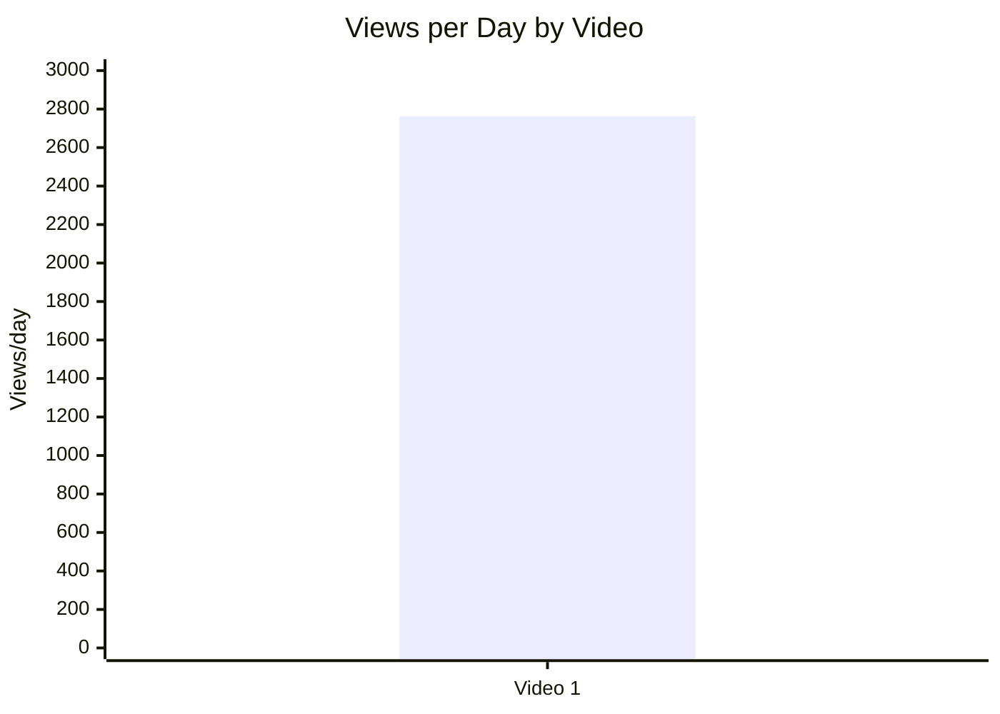

## 5.3. Views per 1k subscribers

- Назва графіка: Views per 1k subscribers
- Яке питання він відповідає: як відео конвертує розмір каналу в перегляди?
- Які поля використовуються: `video_label`, `views_per_1k_subs`
- Тип графіка: Mermaid bar chart
- Що видно з графіка: Video 1 має 920.45 views/1k subs.
- Практичний висновок: відео набрало майже 0.92 перегляду на кожного підписника каналу, але без когорти немає benchmark.

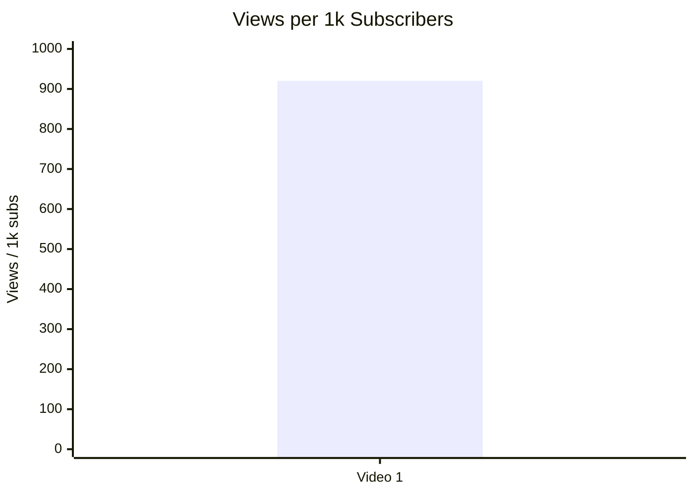

## 5.4. Performance quadrant

- Назва графіка: Performance quadrant
- Яке питання він відповідає: чи поєднує відео reach velocity і engagement?
- Які поля використовуються: `views_per_day`, `er_public_percent`
- Тип графіка: scatter plot / quadrant
- Що видно з графіка: немає порівняльних median thresholds, тому quadrant classification неможлива.
- Практичний висновок: для quadrant chart потрібно мінімум кілька відео в одній когорті.

| Video | Views/day | ER Public % | Quadrant |
|---|---:|---:|---|
| Video 1 | 2 762.84 | 2.59 | `INSUFFICIENT_DATA`: немає cohort thresholds |

## 6. Графіки залучення

## 6.1. ER Public % by video

- Назва графіка: ER Public % by video
- Яке питання він відповідає: яке публічне залучення має відео?
- Які поля використовуються: `video_label`, `er_public_percent`
- Тип графіка: Mermaid bar chart
- Що видно з графіка: ER Public = 2.59%.
- Практичний висновок: ER складається з likes + comments / views; без benchmark не можна називати його високим або низьким.

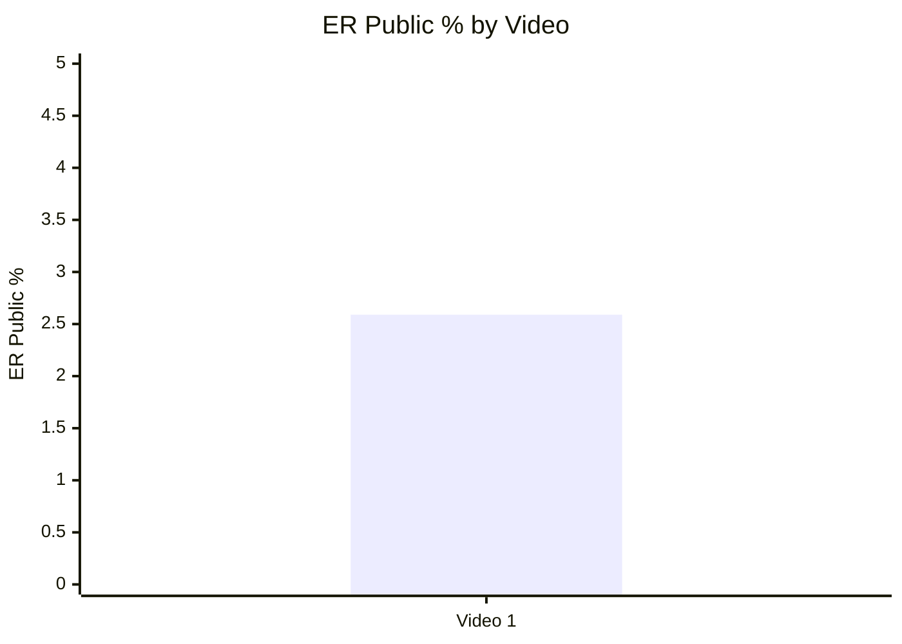

## 6.2. Like Rate % vs Comment Rate %

- Назва графіка: Like Rate % vs Comment Rate %
- Яке питання він відповідає: відео більше отримує likes чи comments?
- Які поля використовуються: `like_rate_percent`, `comment_rate_percent`
- Тип графіка: scatter plot / table substitute
- Що видно з графіка: Like Rate = 2.14%, Comment Rate = 0.45%.
- Практичний висновок: коментарі мають помітну частку в ER, але класифікацію “high/low” без benchmark робити не можна.

| Video | Like Rate % | Comment Rate % | Interpretation |
|---|---:|---:|---|
| Video 1 | 2.14 | 0.45 | `LOW_CONFIDENCE`: engagement driven by both likes and discussion, but no cohort benchmark |

## 6.3. Comments per 1k views

- Назва графіка: Comments per 1k views
- Яке питання він відповідає: наскільки відео провокує реакцію?
- Які поля використовуються: `comments_per_1k_views`
- Тип графіка: Mermaid bar chart
- Що видно з графіка: 4.51 comments per 1k views.
- Практичний висновок: політична/геополітична поляризація і sponsor backlash створили помітний коментарний драйвер.

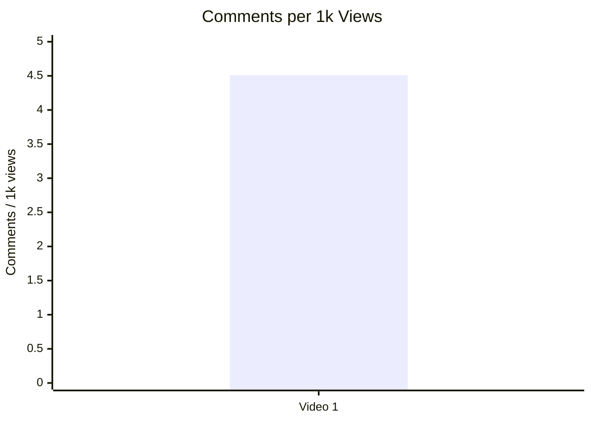

## 7. Графіки структури та hook

## 7.1. Hook score by video

- Назва графіка: Hook score by video
- Яке питання він відповідає: наскільки сильний hook?
- Які поля використовуються: `hook_score`
- Тип графіка: Mermaid bar chart
- Що видно з графіка: Hook score = 4/5.
- Практичний висновок: high-contrast conflict hook є головною сильною стороною цього відео.


## 7.2. Hook type distribution

- Назва графіка: Hook type distribution
- Яке питання він відповідає: які hook types використовуються?
- Які поля використовуються: `hook_primary_type`
- Тип графіка: Mermaid pie chart
- Що видно з графіка: є один hook type — `CONFLICT`.
- Практичний висновок: не можна робити висновок, що `CONFLICT` працює краще за інші типи; можна лише зафіксувати, що в цьому відео він використаний.

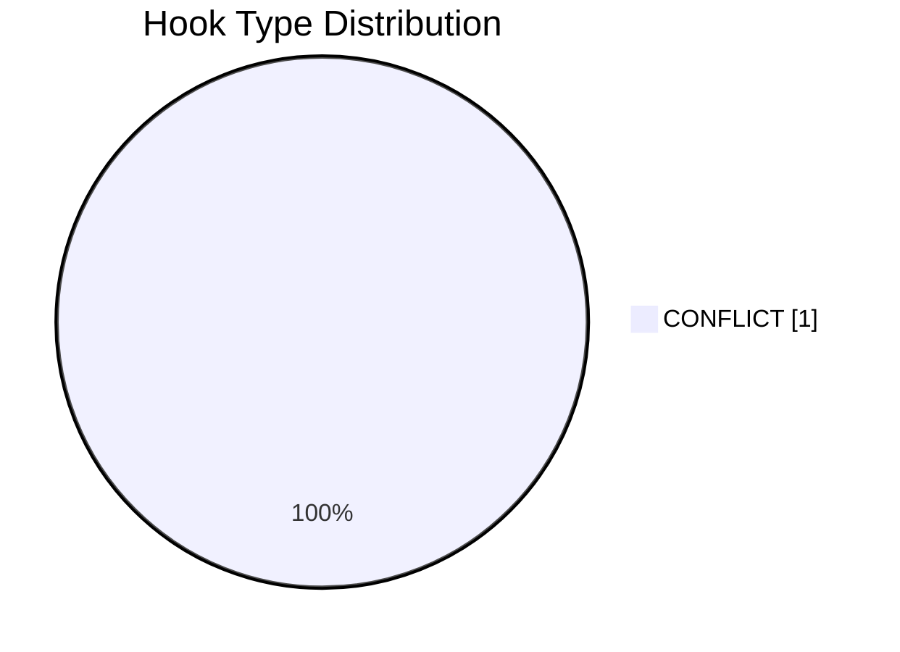

## 7.3. Time to first value vs Overall Score

- Назва графіка: Time to first value vs Overall Score
- Яке питання він відповідає: чи швидша перша цінність пов’язана з вищим результатом?
- Які поля використовуються: `time_to_first_value`, `overall_video_score`
- Тип графіка: scatter plot
- Що видно з графіка: `time_to_first_value` задано як `~00:30-00:55 LOW_CONFIDENCE NO_TIMECODES`, без точного значення в секундах.
- Практичний висновок: графік неможливо побудувати точно; для майбутніх звітів треба зберігати `time_to_first_value_seconds`.

| Video | Time to first value | Time to first value seconds | Overall |
|---|---|---:|---:|
| Video 1 | ~00:30-00:55 LOW_CONFIDENCE NO_TIMECODES | `INSUFFICIENT_DATA` | 4 |

## 8. Графіки CTA

## 8.1. CTA score by video

- Назва графіка: CTA score by video
- Яке питання він відповідає: наскільки якісно побудований CTA?
- Які поля використовуються: `cta_score`
- Тип графіка: Mermaid bar chart
- Що видно з графіка: CTA score = 2/5.
- Практичний висновок: CTA слабкий відносно hook/structure/audio/comment resonance.

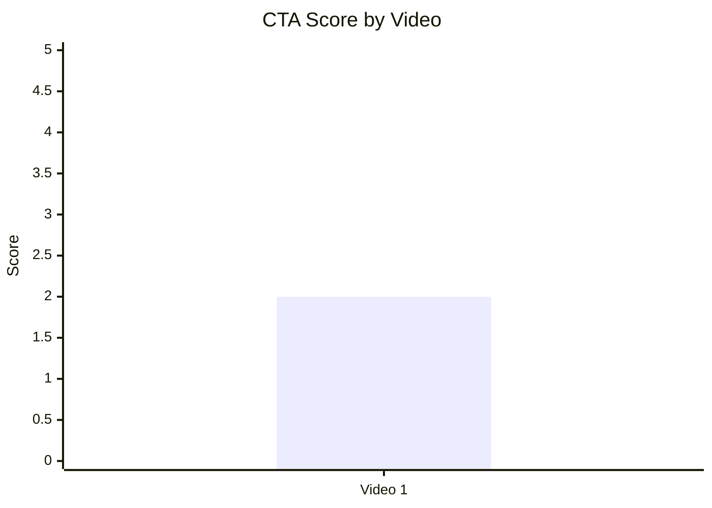

## 8.2. CTA count vs ER Public %

- Назва графіка: CTA count vs ER Public %
- Яке питання він відповідає: чи більше CTA пов’язано з кращим engagement?
- Які поля використовуються: `cta_count`, `er_public_percent`
- Тип графіка: scatter plot / table substitute
- Що видно з графіка: CTA count = 4, ER Public = 2.59%.
- Практичний висновок: зв’язок між CTA count і ER не можна оцінити на одному відео; є risk signal через sponsor/pinned CTA backlash.

| Video | CTA count | ER Public % | CTA overload risk |
|---|---:|---:|---|
| Video 1 | 4 | 2.59 | `LOW_CONFIDENCE`: ризик є через sponsor-heavy CTA і негативні коментарі |

## 8.3. CTA features heatmap

- Назва графіка: CTA features heatmap
- Яке питання він відповідає: які CTA features присутні?
- Які поля використовуються: `has_comment_prompt`, `has_subscribe_cta`, `has_like_cta`, `has_bell_cta`, `has_next_video_bridge`
- Тип графіка: Markdown heatmap / matrix
- Що видно з графіка: немає comment prompt і watch-next bridge; subscribe/like/bell не зафіксовані в JSON.
- Практичний висновок: головний CTA gap — відсутність керованого comment prompt і next-video bridge.

| Video | Comment prompt | Subscribe | Like | Bell | Next video bridge |
|---|---|---|---|---|---|
| Video 1 | ❌ | N/A | N/A | N/A | ❌ |

## 9. Графіки реклами / інтеграцій

Реклама виявлена: `ad_detected = true`.

## 9.1. Ad load % by video

- Назва графіка: Ad load % by video
- Яке питання він відповідає: яке рекламне навантаження має відео?
- Які поля використовуються: `ad_load_percent`
- Тип графіка: Mermaid bar chart
- Що видно з графіка: ad load = 4.98%.
- Практичний висновок: сам відсоток не можна оцінити без benchmark, але якість інтеграції низька через коментарний trust backlash.

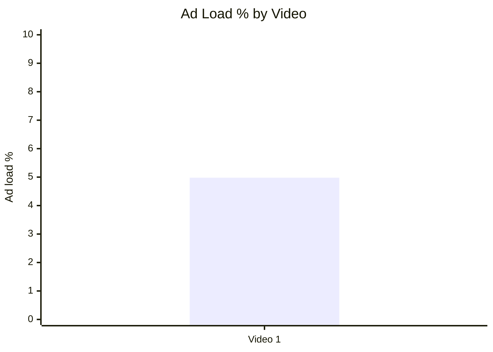

## 9.2. First ad position %

- Назва графіка: First ad position %
- Яке питання він відповідає: чи реклама стоїть занадто рано?
- Які поля використовуються: `first_ad_time`, `first_ad_relative_position_percent`
- Тип графіка: table substitute
- Що видно з графіка: first ad time є приблизним: `~01:08 LOW_CONFIDENCE`; precise relative position не вказано.
- Практичний висновок: реклама, ймовірно, починається рано; потрібна точна розмітка таймкодів у майбутніх звітах.

| Video | First ad time | First ad relative position % | Note |
|---|---|---:|---|
| Video 1 | ~01:08 LOW_CONFIDENCE | `INSUFFICIENT_DATA` | У JSON немає precise percent |

## 9.3. Ad integration score vs ER Public %

- Назва графіка: Ad integration score vs ER Public %
- Яке питання він відповідає: чи якість рекламної інтеграції пов’язана з engagement?
- Які поля використовуються: `ad_integration_score`, `er_public_percent`
- Тип графіка: scatter plot / table substitute
- Що видно з графіка: Ad score = 2/5, ER Public = 2.59%.
- Практичний висновок: кореляцію будувати не можна; але якісний сигнал із comments показує sponsor trust problem.

| Video | Ad integration score | ER Public % | Interpretation |
|---|---:|---:|---|
| Video 1 | 2 | 2.59 | `LOW_CONFIDENCE`: негативний sponsor cluster може шкодити довірі, але статистичний ефект не доведено |

## 10. Графіки аудіо

## 10.1. Audio score by video

- Назва графіка: Audio score by video
- Яке питання він відповідає: наскільки якісне аудіо?
- Які поля використовуються: `audio_score`
- Тип графіка: Mermaid bar chart
- Що видно з графіка: Audio score = 4/5.
- Практичний висновок: аудіо є сильною стороною відносно CTA/ad scores.

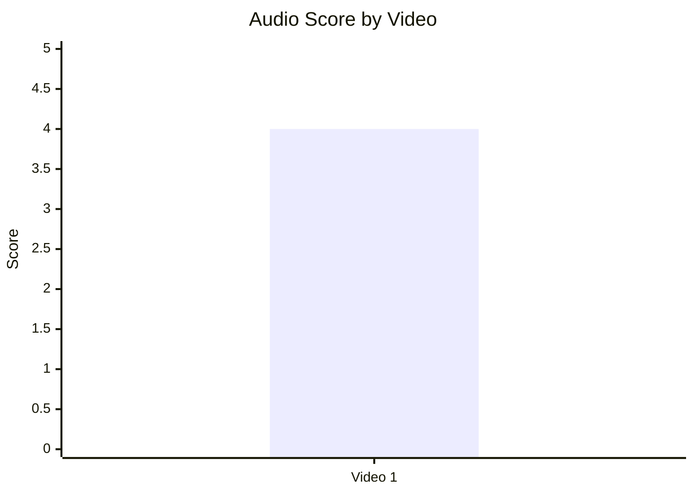

## 10.2. Audio score vs Overall Score

- Назва графіка: Audio score vs Overall Score
- Яке питання він відповідає: чи краща якість аудіо пов’язана з вищим загальним балом?
- Які поля використовуються: `audio_score`, `overall_video_score`
- Тип графіка: scatter plot / table substitute
- Що видно з графіка: Audio = 4, Overall = 4.
- Практичний висновок: зв’язок не можна оцінити на одному відео.

| Video | Audio score | Overall score | Pattern |
|---|---:|---:|---|
| Video 1 | 4 | 4 | `INSUFFICIENT_DATA` для зв’язку |

## 11. Графіки коментарів

## 11.1. Sentiment distribution

- Назва графіка: Sentiment distribution
- Яке питання він відповідає: як розподіляється реакція аудиторії?
- Які поля використовуються: `positive_percent`, `negative_percent`, `mixed_percent`, `neutral_percent`, `question_percent`, `request_percent`
- Тип графіка: stacked bar chart
- Що видно з графіка: у звіті немає sentiment percent.
- Практичний висновок: графік пропущено; для майбутнього потрібно рахувати відсотки sentiment по всьому корпусу.

| Video | Positive % | Negative % | Mixed % | Neutral % | Question % | Request % |
|---|---:|---:|---:|---:|---:|---:|
| Video 1 | N/A | N/A | N/A | N/A | N/A | N/A |

## 11.2. Comment resonance score by video

- Назва графіка: Comment resonance score by video
- Яке питання він відповідає: наскільки сильно відео резонує в коментарях?
- Які поля використовуються: `comment_resonance_score`
- Тип графіка: Mermaid bar chart
- Що видно з графіка: Comment resonance = 5/5.
- Практичний висновок: коментарі — одна з найсильніших зон відео, але частина резонансу конфліктна.

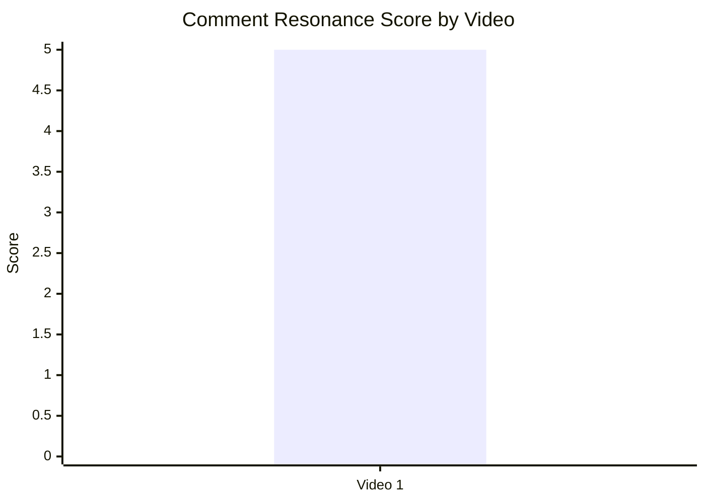

## 11.3. Top comment clusters

- Назва графіка: Top comment clusters
- Яке питання він відповідає: які теми найсильніше рухають коментарі?
- Які поля використовуються: `cluster_name`, `keyword_matched_blocks`
- Тип графіка: Mermaid horizontal substitute via bar chart
- Що видно з графіка: найбільші кластери — criticism of US/Israel/imperialism, pro-Houthi/pro-Yemen framing, military asymmetry/cost logic.
- Практичний висновок: тема працює через політичну поляризацію + зрозумілу cost-asymmetry рамку; sponsor distrust — менший за розміром, але reputationally небезпечний кластер.

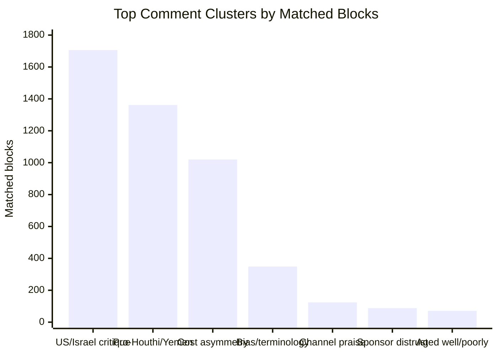

| Cluster | Size signal | Strategic meaning |
|---|---:|---|
| Criticism of US/Israel/imperialism | 1 706 blocks / 16 257 likes | Для аудиторії root cause framing важливий не менше за naval analysis |
| Pro-Houthi / pro-Yemen / resistance framing | 1 362 blocks / 27 671 likes | “David vs Goliath” і resistance identity дуже сильно активують коментарі |
| Military asymmetry / cost logic | 1 020 blocks / 8 458 likes | Центральна success mechanic сценарію резонує |
| Bias / terminology / factual criticism | 349 blocks / 1 950 likes | Є ризик втрати довіри через слова “rebels”, “ragtag”, selective causality |
| Channel praise / trust | 124 blocks / 340 likes | Базова довіра до каналу є |
| Sponsor distrust / scam concerns | 88 blocks / 235 likes | Реклама створює reputational drag |
| “Aged well / aged poorly” debate | 71 blocks / 301 likes | Є довгий хвіст через новинний цикл |

## 12. Графіки score-системи

## 12.1. Overall score by video

- Назва графіка: Overall score by video
- Яке питання він відповідає: яке відео найсильніше загалом?
- Які поля використовуються: `overall_video_score`
- Тип графіка: Mermaid bar chart
- Що видно з графіка: Overall = 4/5.
- Практичний висновок: відео сильне за загальною оцінкою, але порівняння потребує інших відео тієї ж когорти.

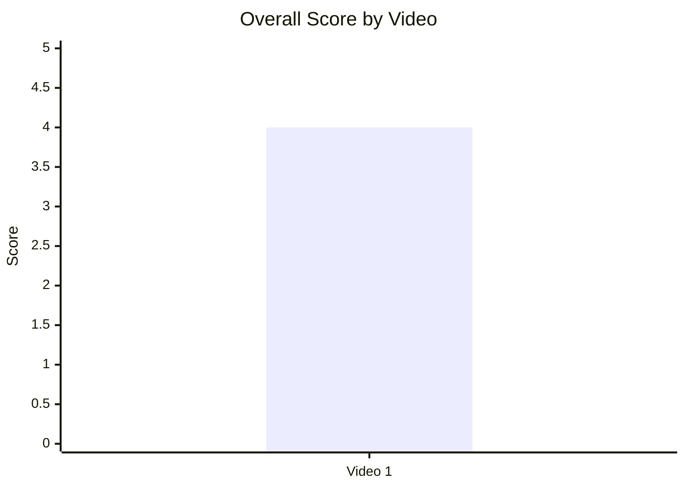

## 12.2. Score breakdown heatmap

- Назва графіка: Score breakdown heatmap
- Яке питання він відповідає: де сильні та слабкі сторони?
- Які поля використовуються: `hook_score`, `structure_score`, `value_density_score`, `audio_score`, `cta_score`, `ad_integration_score`, `comment_resonance_score`, `replicability_score`, `overall_video_score`
- Тип графіка: Markdown heatmap
- Що видно з графіка: сильні сторони — comments, hook, structure, value density, audio; слабкі — CTA та ad integration.
- Практичний висновок: оптимізація має фокусуватися на CTA/ad, а не на core topic/hook.

| Video | Hook | Structure | Value Density | Audio | CTA | Ad | Comments | Replicability | Overall |
|---|---:|---:|---:|---:|---:|---:|---:|---:|---:|
| Video 1 | 🟩 4 | 🟩 4 | 🟩 4 | 🟩 4 | 🟥 2 | 🟥 2 | 🟦 5 | N/A | 🟩 4 |

Legend: 🟦 = 5, 🟩 = 4, 🟨 = 3, 🟥 = 1–2, N/A = даних немає.

## 12.3. Strengths vs weaknesses count

- Назва графіка: Strengths vs weaknesses count
- Яке питання він відповідає: скільки success mechanics і missed opportunities зафіксовано?
- Які поля використовуються: `top_success_mechanic_*`, `top_missed_opportunity_*`
- Тип графіка: Mermaid bar chart
- Що видно з графіка: у JSON є 3 top success mechanics і 3 top missed opportunities.
- Практичний висновок: відео має збалансований список сильних механік і зон для покращення; пріоритет — виправити ad/CTA без втрати conflict framing.

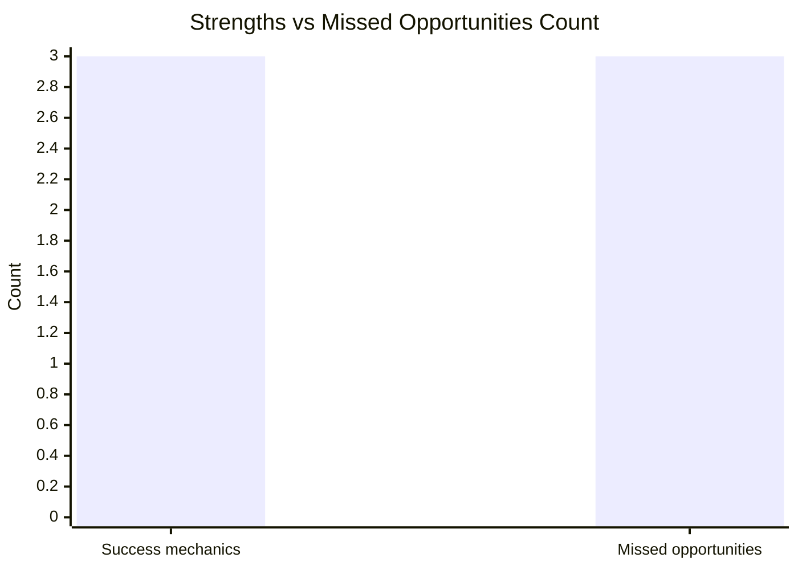

## 13. Кореляції та патерни

Correlation analysis skipped: fewer than 5 comparable videos.

| Pair | Correlation / Pattern | Strength | Interpretation | Confidence |
|---|---:|---|---|---|
| hook_score → overall_video_score | `INSUFFICIENT_DATA` | N/A | Є лише один datapoint: Hook 4, Overall 4 | LOW |
| value_density_score → er_public_percent | `INSUFFICIENT_DATA` | N/A | Є лише один datapoint: Value Density 4, ER 2.59 | LOW |
| cta_score → comment_rate_percent | `INSUFFICIENT_DATA` | N/A | Є лише один datapoint: CTA 2, Comment Rate 0.45 | LOW |
| comment_resonance_score → er_public_percent | `INSUFFICIENT_DATA` | N/A | Є лише один datapoint: Comments 5, ER 2.59 | LOW |
| views_per_day → er_public_percent | `INSUFFICIENT_DATA` | N/A | Є лише один datapoint: 2 762.84 views/day, ER 2.59 | LOW |
| ad_load_percent → er_public_percent | `INSUFFICIENT_DATA` | N/A | Є лише один datapoint: Ad load 4.98, ER 2.59 | LOW |
| time_to_first_value_seconds → overall_video_score | `INSUFFICIENT_DATA` | N/A | Немає точного seconds value | LOW |

Попередні патерни для одного відео, не кореляції:

| Pattern | Дані | Confidence |
|---|---|---|
| Conflict hook + cost asymmetry створюють сильний comment resonance | Hook 4/5, Comment resonance 5/5, top clusters: cost asymmetry 1 020 blocks, pro-Houthi/resistance 1 362 blocks | LOW |
| Рання sponsor integration створює trust backlash | Ad score 2/5, CTA score 2/5, sponsor distrust cluster 88 blocks / 235 likes | LOW |
| Відсутність comment prompt не завадила великій кількості коментарів, але реакція стала некерованою | has_comment_prompt = false, comments = 7 638, dominant clusters polarizing | LOW |

## 14. Висновки для контент-стратегії

| Спостереження | Дані / графік | Що це означає | Що робити |
|---|---|---|---|
| Conflict framing працює як сильний hook у цьому кейсі | Hook type `CONFLICT`, hook score 4/5, overall 4/5 | Назва “суперсила не може зупинити слабшого гравця” дає чітку напругу | Тестувати подібні titles: “Why X can’t stop Y” для геополітики, дронів, choke points |
| Cost asymmetry резонує в коментарях | Cluster “Military asymmetry / cost logic”: 1 020 blocks / 8 458 likes | Аудиторія активно обговорює expensive conventional systems vs cheap drones/missiles | Виносити cost asymmetry у hook, thumbnail або перші 60 секунд |
| Реклама шкодить довірі, якщо sponsor виглядає sketchy | Ad score 2/5, sponsor distrust 88 blocks / 235 likes | Навіть невеликий кластер може бити по бренду каналу | Ретельніше vet sponsor; переносити sponsor після першого payoff; додавати clear disclosure |
| Відсутній керований comment prompt | has_comment_prompt = false | Коментарі є, але вони часто йдуть у політичний conflict і sponsor backlash | Додати питання в кінці: “What is the most effective counter to asymmetric naval warfare?” |
| Немає next-video bridge | has_next_video_bridge = false | Втрачається session continuation | Додавати end-screen bridge на related explainer або sequel/update |
| Термінологія провокує factual/bias backlash | Bias/terminology cluster: 349 blocks / 1 950 likes | “rebels”, “ragtag” можуть підвищити conflict, але знижують trust | Додавати короткий terminology note: “called Houthis/Ansar Allah; control capital; referred to as rebels in some sources” |
| Є потенціал для sequel/update | “Aged well / aged poorly” cluster: 71 blocks / 301 likes | Тема має long-tail через події 2025/2026 | Зробити update: “Did the US actually solve the Houthi problem?” |

## 15. Що тестувати далі

| Тест | Гіпотеза | На яких даних базується | Як виміряти | Пріоритет |
|---|---|---|---|---|
| Перенести sponsor-read після першого payoff | Менше trust backlash і нижчий disruption risk | Ad score 2/5, sponsor distrust cluster 88 blocks | Sponsor-negative comments per 1k comments; retention до/після sponsor segment; ER Public | HIGH |
| Додати конкретний comment prompt | Коментарі стануть менш хаотичними і більш корисними | has_comment_prompt = false; comments 7 638; polarizing clusters | Comment rate %, частка comments із відповідями на prompt | HIGH |
| Зробити sequel/update | Long-tail дискусія дасть новий привід для перегляду | “aged well/poorly” cluster; 2025/2026 коментарі | Views/day перших 30 днів, comments per 1k views, returning viewer share якщо доступно | HIGH |
| Протестувати conflict hook із cost asymmetry в title | Повторить найсильнішу механіку відео | Hook 4/5; cost asymmetry cluster 1 020 blocks | CTR якщо owner data є; views/day; ER Public | HIGH |
| Додати terminology disclaimer | Зменшить bias/factual criticism без втрати теми | Bias/terminology cluster 349 blocks | Частка comments із “rebels / Ansar Allah / bias / propaganda” keywords | MEDIUM |
| Додати chapters | Покращить navigation для 19-хв формату | Chapters N/A; duration 19:06 | Chapter clicks якщо доступно; average view duration якщо owner data є | MEDIUM |
| Додати watch-next bridge | Покращить session path | has_next_video_bridge = false | End-screen CTR якщо owner data є; follow-on views | MEDIUM |
| Порівняти sponsor vs no-sponsor відео | Перевірити, чи ad load/ad trust впливає на ER | Ad score 2/5; ad_load 4.98% | Потрібно мінімум 5 відео з ad_load/ad_score | MEDIUM |

## 16. Дані для експорту в таблицю / CSV

| video_label | title | format_group | views | views_per_day | like_rate_percent | comment_rate_percent | er_public_percent | views_per_1k_subs | hook_type | hook_score | cta_count | cta_score | ad_load_percent | ad_integration_score | audio_score | comment_resonance_score | overall_video_score | top_success_mechanic | top_missed_opportunity |
|---|---|---|---:|---:|---:|---:|---:|---:|---|---:|---:|---:|---:|---:|---:|---:|---:|---|---|
| Video 1 | Why the US Navy can’t stop Houthi rebels | LONG_10_20_MIN | 1693623 | 2762.84 | 2.14 | 0.45 | 2.59 | 920.45 | CONFLICT | 4 | 4 | 2 | 4.98 | 2 | 4 | 5 | 4 | High-contrast title conflict: US Navy vs Houthis | Sponsor-read too early and sponsor trust backlash |

CSV-ready:

```csv
video_label,title,format_group,views,views_per_day,like_rate_percent,comment_rate_percent,er_public_percent,views_per_1k_subs,hook_type,hook_score,cta_count,cta_score,ad_load_percent,ad_integration_score,audio_score,comment_resonance_score,overall_video_score,top_success_mechanic,top_missed_opportunity
Video 1,"Why the US Navy can’t stop Houthi rebels",LONG_10_20_MIN,1693623,2762.84,2.14,0.45,2.59,920.45,CONFLICT,4,4,2,4.98,2,4,5,4,"High-contrast title conflict: US Navy vs Houthis","Sponsor-read too early and sponsor trust backlash"
```
