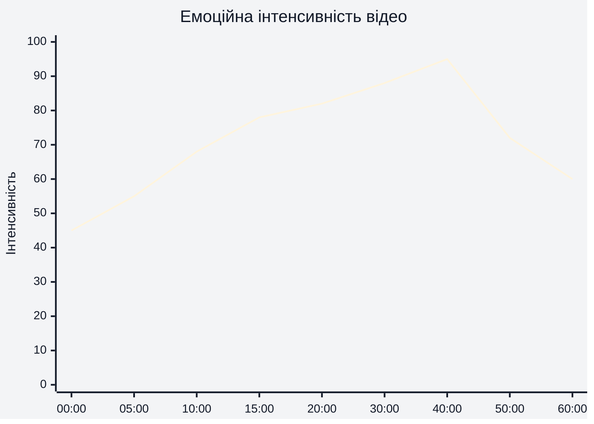
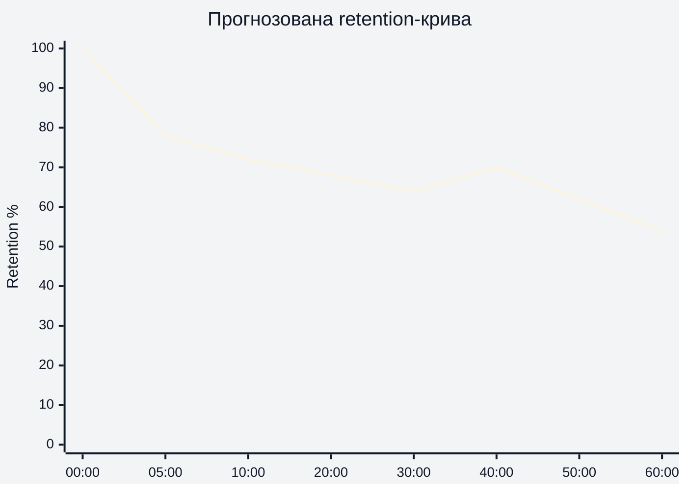
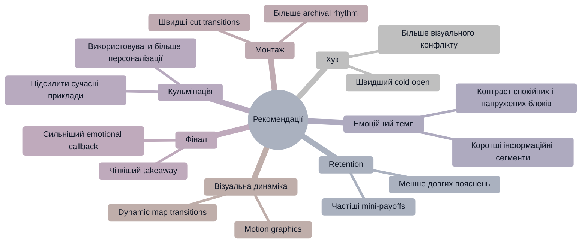

# Аналіз довгоформатного YouTube-відео

## 1. Сюжетна дуга (Narrative Arc)

```mermaid
%%{init: {'theme':'base', 'themeVariables': {
'primaryColor':'#f3f4f6',
'primaryTextColor':'#111827',
'primaryBorderColor':'#2563eb',
'lineColor':'#2563eb',
'secondaryColor':'#ffffff',
'tertiaryColor':'#f3f4f6',
'background':'#f3f4f6'
}}}%%
flowchart LR
    A["00:00–02:30<br/>Хук<br/>Питання: чи повертається фашизм?"] -->
    B["02:30–09:00<br/>Експозиція<br/>Післявоєнна Європа, криза демократій"] -->
    C["09:00–18:30<br/>Перша ескалація<br/>Поява Муссоліні та чорнорубашників"] -->
    D["18:30–28:00<br/>Переломний момент<br/>Демонтаж демократії в Італії"] -->
    E["28:00–40:00<br/>Наростання напруги<br/>Гітлер, пропаганда, радикалізація"] -->
    F["40:00–50:00<br/>Кульмінація<br/>Порівняння історичних патернів із сучасністю"] -->
    G["50:00–58:00<br/>Розв’язка<br/>Експерти сперечаються про визначення фашизму"] -->
    H["58:00–01:01:48<br/>Фінальний висновок<br/>Глядачу пропонують самостійно оцінити ризики"]
```

---

## 2. Ключові Story Beats

```mermaid
%%{init: {'theme':'base', 'themeVariables': {
'primaryColor':'#f3f4f6',
'primaryTextColor':'#111827',
'primaryBorderColor':'#2563eb',
'lineColor':'#2563eb',
'secondaryColor':'#ffffff',
'tertiaryColor':'#f3f4f6',
'background':'#f3f4f6'
}}}%%
flowchart LR
    A["00:15<br/>Автор зізнається у власній невпевненості<br/>Функція: створення довіри"] -->
    B["03:40<br/>Травма Першої світової війни<br/>Функція: історичний контекст"] -->
    C["07:15<br/>Економічна катастрофа Німеччини<br/>Функція: емоційне підсилення"] -->
    D["11:20<br/>Муссоліні формує рух ветеранів<br/>Функція: запуск конфлікту"] -->
    E["16:50<br/>Чорнорубашники застосовують насильство<br/>Функція: ескалація"] -->
    F["21:45<br/>Муссоліні демонтує демократію<br/>Функція: переломний момент"] -->
    G["30:20<br/>Гітлер адаптує модель фашизму<br/>Функція: масштабування загрози"] -->
    H["39:40<br/>Список ознак фашизму<br/>Функція: інтелектуальний payoff"] -->
    I["46:30<br/>Порівняння із сучасними державами<br/>Функція: актуалізація"] -->
    J["54:20<br/>Експерти не погоджуються між собою<br/>Функція: складність теми"] -->
    K["01:00:10<br/>Фінальний заклик до критичного мислення<br/>Функція: завершення"]
```

---

## 3. Емоційний темп

### Пояснення
- Пік емоційної інтенсивності припадає на блоки про насильство та паралелі із сучасністю (~40:00–50:00).
- Початок працює через curiosity-gap, а не через шок.
- Фінал навмисно знижує емоційну напругу і переводить фокус у рефлексію.

---

## 4. Утримання аудиторії

**Retention-дані не були надані. Нижче — прогнозована retention-крива на основі структури long-form documentary.**

### Пояснення
- Найбільший спад імовірний у перші 3–5 хвилин.
- Блоки з історичними прикладами утримують увагу стабільніше.
- Очікуваний spike — у сегментах із сучасними політичними паралелями (~40–50 хв).

---

## 5. Піки retention

| Таймкод | Подія | Чому це може утримувати увагу | Сила піку 1–10 |
|---|---|---|---:|
| 00:00–01:30 | Автор ставить головне питання | Curiosity-gap + особиста невпевненість | 8 |
| 11:00–15:00 | Формування фашистського руху | Початок конфлікту та чіткий антагонізм | 8 |
| 16:30–20:00 | Насильство чорнорубашників | Висока драматичність і шок | 9 |
| 30:00–35:00 | Перехід до Гітлера | Найвідоміший історичний персонаж | 9 |
| 39:00–46:00 | “Checklist” фашизму | Інтелектуальний payoff | 10 |
| 46:00–52:00 | Паралелі із сучасністю | Найвищий рівень relevance | 10 |

---

## 6. Провали retention

| Таймкод | Проблема | Ймовірна причина спаду | Що покращити |
|---|---|---|---|
| 04:00–07:00 | Довгий історичний контекст | Висока щільність інформації | Додати швидші монтажні переходи |
| 22:00–27:00 | Політичні деталі Італії | Менше емоційної динаміки | Вставити більше прикладів/архівів |
| 52:00–57:00 | Експертні суперечки | Абстрактність дискусії | Візуалізувати аргументи графічно |
| 58:00–60:00 | Зниження темпу фіналу | Менше конфлікту | Додати сильніший фінальний payoff |

---

## 7. Оцінка сегментів

| Сегмент | Таймкод | Функція | Емоційна інтенсивність | Ризик втрати уваги | Оцінка 1–10 | Що покращити |
|---|---|---|---|---|---:|---|
| Хук | 00:00–02:30 | Захоплення уваги | Висока | Низький | 9 | Можна додати сильніший visual cold open |
| Історичний контекст | 02:30–09:00 | Побудова фундаменту | Середня | Середній | 7 | Скоротити деякі пояснення |
| Муссоліні | 09:00–21:00 | Основний конфлікт | Висока | Низький | 9 | Працює дуже стабільно |
| Демонтаж демократії | 21:00–28:00 | Переломний момент | Висока | Середній | 8 | Більше візуальної динаміки |
| Гітлер | 28:00–40:00 | Ескалація | Дуже висока | Низький | 10 | Один із найсильніших блоків |
| Сучасні паралелі | 40:00–52:00 | Кульмінація | Максимальна | Низький | 10 | Найсильніший retention-driver |
| Фінал | 52:00–01:01:48 | Рефлексія | Середня | Високий | 7 | Сильніший фінальний CTA |

---

## 8. Практичні рекомендації

---

## 9. Підсумкова оцінка

| Показник | Оцінка 1–10 | Коментар |
|---|---:|---|
| Сюжетна дуга | 9 | Чітка ескалація від історії до сучасності |
| Story Beats | 9 | Сильна структура з регулярними payoff |
| Емоційний темп | 8 | Добре тримає напругу, але є кілька повільних блоків |
| Retention Structure | 8 | Long-form структура працює стабільно |
| Загальна оцінка | 9 | Сильний documentary-format із високим retention-потенціалом |
