# Статистичний аналіз відеозвітів

## 1. Короткий executive summary

| Пункт | Висновок |
|---|---|
| Скільки відео проаналізовано | 1 |
| Скільки форматів відео | 1 (`LONG_20_PLUS_MIN`) |
| Найсильніше відео за overall score | Video 1 — `Is Fascism Back?` — 4.20/5 |
| Найсильніше відео за ER Public % | Video 1 — 2.92% |
| Найсильніше відео за views per day | `N/A` — у звіті немає точного `published_at`, тому `video_age_days` і `views_per_day` не пораховані |
| Найсильніша повторювана механіка | `INSUFFICIENT_DATA` для повторюваності: є лише 1 відео. Для цього відео найсильніша механіка — `STRONG_STORY_STRUCTURE` + `CLEAR_HOOK` |
| Найчастіша слабкість | `INSUFFICIENT_DATA` для частоти. Для цього відео головна слабкість — `COMMENTS_SHOW_CONFUSION` / нестача objections-FAQ |
| Головна стратегічна можливість | Перетворити тему на серію: FAQ / objections, country matrix, “What is Communism?”, “Fascism Index?” |
| Рівень впевненості | LOW |

**Примітка:** статистичний аналіз побудований тільки на одному прикріпленому звіті `YT_VIDEO_ANALYSIS_V1`. Тому всі висновки є описовими, без кореляцій і без тверджень про повторювані закономірності.

## 2. Якість і повнота даних

| Поле | Кількість відео з даними | Кількість N/A | Коментар |
|---|---:|---:|---|
| views | 1 | 0 | Є public views: `6,889,503+` |
| likes | 1 | 0 | Є public likes: `175,961+` |
| comments_count | 1 | 0 | Є public comments: `25,453+` |
| views_per_day | 0 | 1 | `N/A`, бо немає точного `published_at` |
| er_public_percent | 1 | 0 | Є: `2.92%` |
| views_per_1k_subs | 1 | 0 | Є: `891.27` |
| hook_score | 1 | 0 | Є: `4/5` |
| cta_score | 1 | 0 | Є: `3/5` |
| ad_integration_score | 1 | 0 | Є: `4/5` |
| audio_score | 1 | 0 | Є: `4/5` |
| comment_resonance_score | 1 | 0 | Є: `5/5` |
| overall_video_score | 1 | 0 | Є: `4.20/5` |

### Обмеження аналізу

- `LOW_CONFIDENCE`: вибірка містить лише 1 відео.
- Кореляції не будуються: потрібно мінімум 5 comparable videos.
- `views_per_day` не можна побудувати, бо в аналізі відсутній точний `published_at`.
- `ad_load_percent` не можна побудувати, бо в аналізі немає `total_ad_duration_seconds`.
- `time_to_first_value_seconds` не можна побудувати, бо transcript має статус `NO_TIMECODES`.
- Порівняння між форматами не потрібне: усі дані належать одному формату `LONG_20_PLUS_MIN`.

## 3. Підготовлена таблиця для графіків

| Video | Format | Views | Likes | Comments | Views/day | Like Rate % | Comment Rate % | ER Public % | Views/1k subs | Hook | CTA | Ad | Audio | Comment Resonance | Overall |
|---|---|---:|---:|---:|---:|---:|---:|---:|---:|---:|---:|---:|---:|---:|---:|
| Video 1 | LONG_20_PLUS_MIN | 6,889,503 | 175,961 | 25,453 |  | 2.55 | 0.37 | 2.92 | 891.27 | 5 | 5 | 5 | 5 | 5 | 5 |

| Label | Full title | URL |
|---|---|---|
| Video 1 | Is Fascism Back? | N/A |

## 4. Рекомендовані графіки

| # | Назва графіка | Тип графіка | Поля | Для чого потрібен | Пріоритет |
|---:|---|---|---|---|---|
| 1 | Overall score by video | Mermaid bar chart | `overall_video_score` | Побачити загальний рівень відео | HIGH |
| 2 | Views by video | Mermaid bar chart | `views` | Показати raw reach | HIGH |
| 3 | Views per day by video | Таблиця / skipped chart | `views_per_day` | Нормалізувати reach за віком відео | HIGH |
| 4 | ER Public % by video | Mermaid bar chart | `er_public_percent` | Показати public engagement | HIGH |
| 5 | ER Public % vs Views/day | Skipped scatter plot | `er_public_percent`, `views_per_day` | Баланс охоплення і залучення | HIGH |
| 6 | Hook score by video | Mermaid bar chart | `hook_score` | Оцінити силу hook | HIGH |
| 7 | CTA score by video | Mermaid bar chart | `cta_score` | Оцінити CTA | HIGH |
| 8 | Score breakdown heatmap | Markdown matrix | score fields | Побачити сильні/слабкі сторони | HIGH |
| 9 | CTA features heatmap | Markdown matrix | CTA boolean fields | Побачити використані CTA | HIGH |
| 10 | Sentiment distribution | Mermaid bar chart | comment sentiment % | Показати структуру реакції аудиторії | HIGH |
| 11 | Ad load % by video | Skipped chart | `ad_load_percent` | Оцінити рекламне навантаження | HIGH |
| 12 | Audio score by video | Mermaid bar chart | `audio_score` | Показати якість аудіо | MEDIUM |

## 5. Графіки продуктивності

## 5.1. Views by video

- Назва графіка: Views by video
- Яке питання він відповідає: яке відео має найбільший raw reach?
- Які поля використовуються: `video_label`, `views`
- Тип графіка: Mermaid bar chart
- Що видно з графіка: Video 1 має `6,889,503+` переглядів.
- Практичний висновок: raw reach високий у абсолютному значенні, але без когорти й нормалізації не можна робити benchmark-висновок.

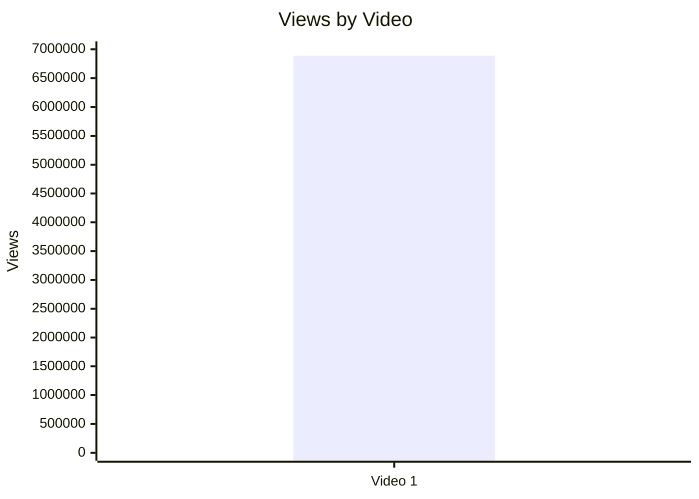

| Video | Views |
|---|---:|
| Video 1 | 6,889,503+ |

## 5.2. Views per day by video

- Назва графіка: Views per day by video
- Яке питання він відповідає: яка швидкість набору переглядів з урахуванням віку?
- Які поля використовуються: `video_label`, `views_per_day`
- Тип графіка: `INSUFFICIENT_DATA`
- Що видно з графіка: графік неможливо побудувати.
- Практичний висновок: для майбутніх звітів потрібно фіксувати точний `published_at`.

| Video | Published date | Snapshot date | Video age days | Views/day |
|---|---|---|---:|---:|
| Video 1 | N/A | 2026-05-21 | N/A | N/A |

## 5.3. Views per 1k subscribers

- Назва графіка: Views per 1k subscribers
- Яке питання він відповідає: наскільки відео конвертує розмір каналу в перегляди?
- Які поля використовуються: `video_label`, `views_per_1k_subs`
- Тип графіка: Mermaid bar chart
- Що видно з графіка: Video 1 має `891.27` views per 1k subs.
- Практичний висновок: це корисна нормалізована метрика, але потрібні інші відео каналу для порівняння.

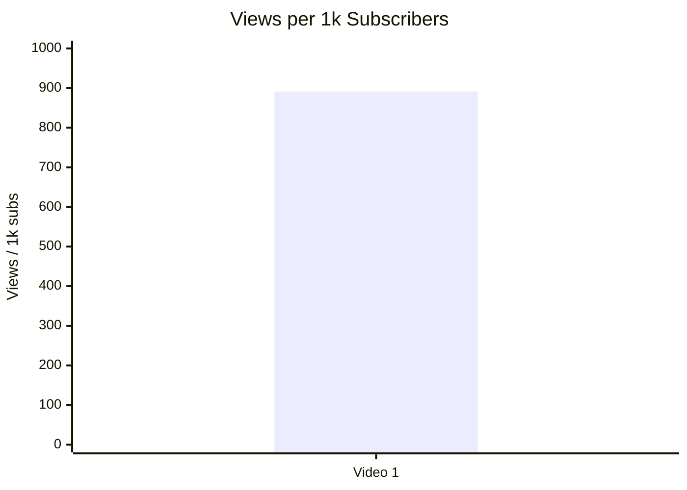

## 5.4. Performance quadrant

- Назва графіка: Performance quadrant
- Яке питання він відповідає: чи відео має одночасно високий reach velocity і high engagement?
- Які поля використовуються: `views_per_day`, `er_public_percent`
- Тип графіка: `INSUFFICIENT_DATA`
- Що видно з графіка: `views_per_day = N/A`, тому scatter/quadrant неможливий.
- Практичний висновок: потрібен точний `published_at` або готовий `views_per_day`.

| Video | Views/day | ER Public % | Quadrant |
|---|---:|---:|---|
| Video 1 | N/A | 2.92 | INSUFFICIENT_DATA |

## 6. Графіки залучення

## 6.1. ER Public % by video

- Назва графіка: ER Public % by video
- Яке питання він відповідає: який public engagement rate має відео?
- Які поля використовуються: `video_label`, `er_public_percent`
- Тип графіка: Mermaid bar chart
- Що видно з графіка: Video 1 має `2.92%` ER Public.
- Практичний висновок: engagement measurable, але без когорти не можна сказати “сильний/слабкий”.

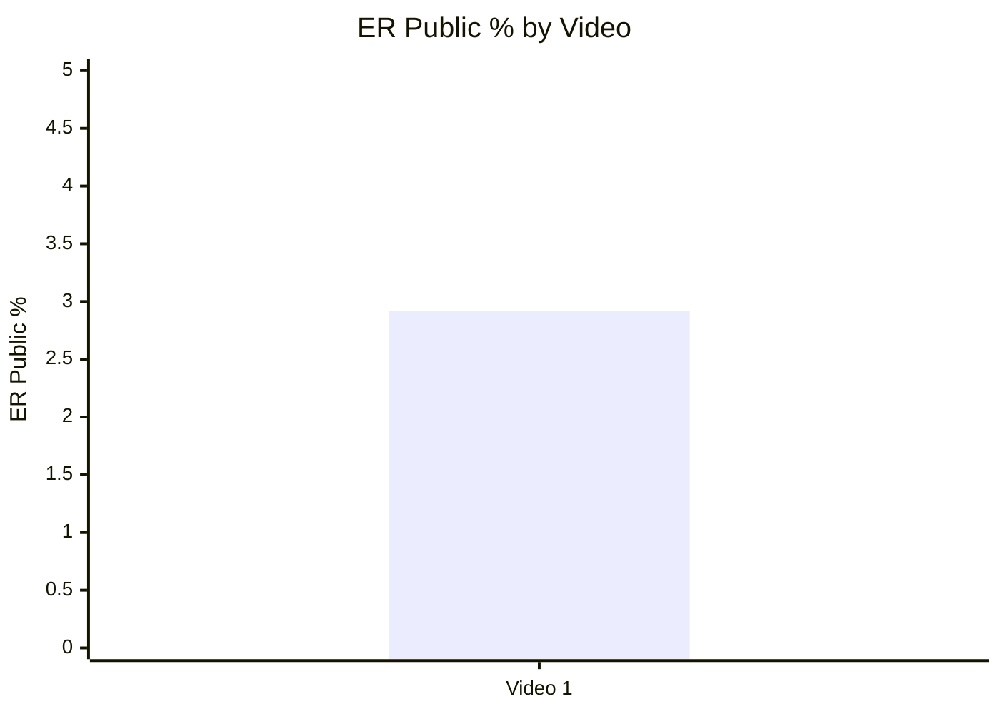

## 6.2. Like Rate % vs Comment Rate %

- Назва графіка: Like Rate % vs Comment Rate %
- Яке питання він відповідає: відео більше викликає лайки чи дискусію?
- Які поля використовуються: `like_rate_percent`, `comment_rate_percent`
- Тип графіка: таблиця замість scatter plot
- Що видно з графіка: `like_rate_percent = 2.55%`, `comment_rate_percent = 0.37%`.
- Практичний висновок: відео має помітну коментарну активність, але порівнювати квадранти неможливо без інших відео.

| Video | Like Rate % | Comment Rate % | Interpretation |
|---|---:|---:|---|
| Video 1 | 2.55 | 0.37 | Описово: є і likes, і дискусія; benchmark відсутній |

## 6.3. Comments per 1k views

- Назва графіка: Comments per 1k views
- Яке питання він відповідає: скільки коментарів генерується на 1000 переглядів?
- Які поля використовуються: `video_label`, `comments_per_1k_views`
- Тип графіка: Mermaid bar chart
- Що видно з графіка: Video 1 має `3.69` comments per 1k views.
- Практичний висновок: тема провокує реакцію, але потрібна когорта для оцінки сили.

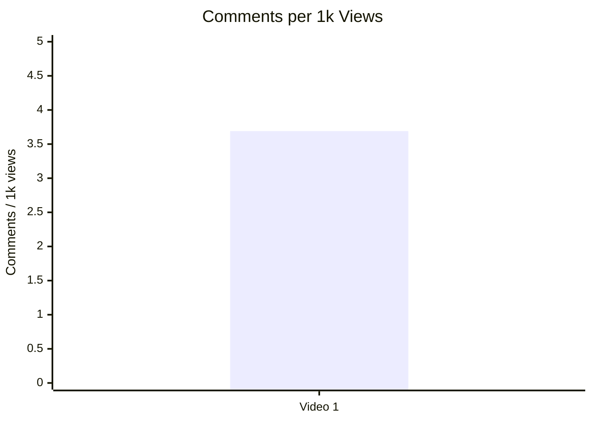

## 7. Графіки структури та hook

## 7.1. Hook score by video

- Назва графіка: Hook score by video
- Яке питання він відповідає: наскільки сильний старт відео?
- Які поля використовуються: `video_label`, `hook_score`
- Тип графіка: Mermaid bar chart
- Що видно з графіка: Video 1 має `4/5`.
- Практичний висновок: hook варто повторювати як формат “я сам не до кінця розумію → promise of clarity”.


## 7.2. Hook type distribution

- Назва графіка: Hook type distribution
- Яке питання він відповідає: який primary hook type використано?
- Які поля використовуються: `hook_primary_type`, count
- Тип графіка: Mermaid pie chart
- Що видно з графіка: у вибірці один hook type — `CURIOSITY_GAP`.
- Практичний висновок: не можна робити висновок про найкращий hook type; можна лише зафіксувати, що для цього відео curiosity hook був оцінений високо.

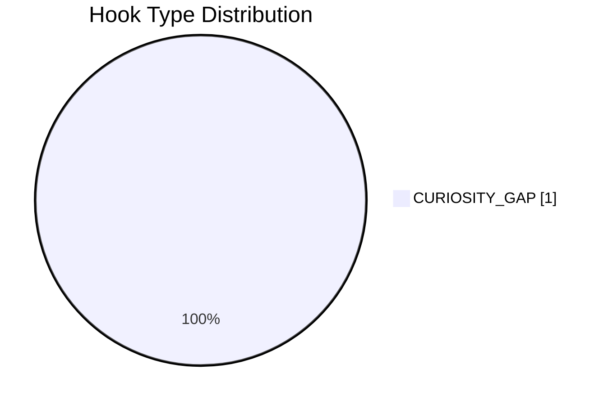

## 7.3. Time to first value vs Overall Score

- Назва графіка: Time to first value vs Overall Score
- Яке питання він відповідає: чи швидша перша цінність пов’язана з вищим результатом?
- Які поля використовуються: `time_to_first_value_seconds`, `overall_video_score`
- Тип графіка: `INSUFFICIENT_DATA`
- Що видно з графіка: `time_to_first_value_seconds = N/A / NO_TIMECODES`.
- Практичний висновок: для майбутніх звітів потрібно витягувати time-coded transcript або вручну фіксувати час першого value block.

| Video | Time to first value | Overall |
|---|---:|---:|
| Video 1 | NO_TIMECODES | 4.20 |

## 8. Графіки CTA

## 8.1. CTA score by video

- Назва графіка: CTA score by video
- Яке питання він відповідає: наскільки ефективний CTA-layer?
- Які поля використовуються: `video_label`, `cta_score`
- Тип графіка: Mermaid bar chart
- Що видно з графіка: Video 1 має `3/5`.
- Практичний висновок: CTA є, але channel growth path слабший через відсутність subscribe/like/watch-next bridge.

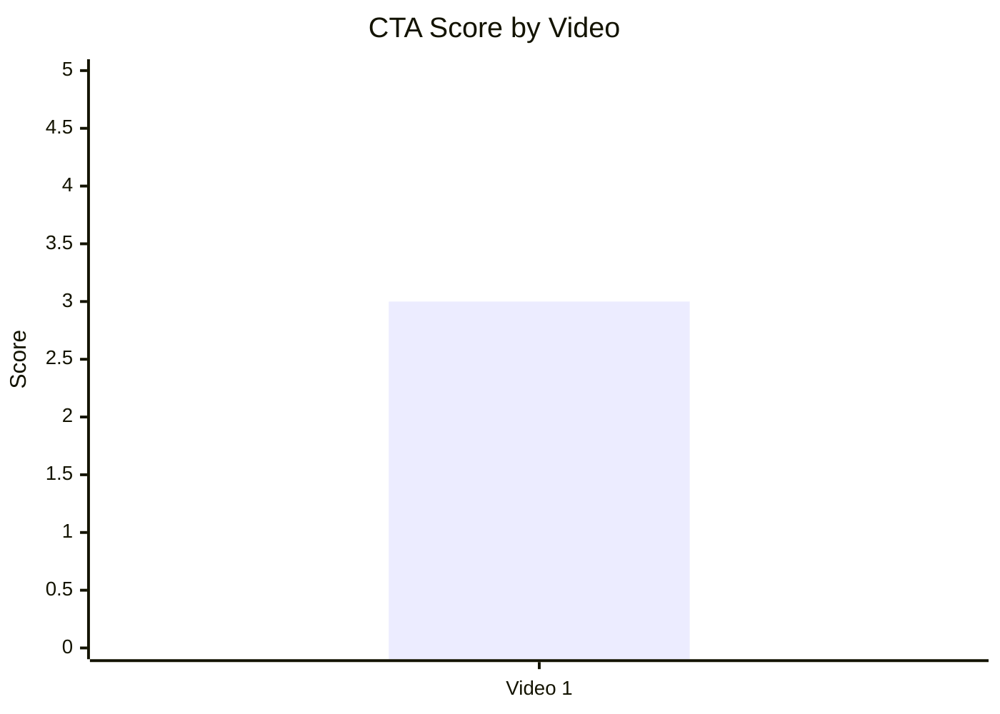

## 8.2. CTA count vs ER Public %

- Назва графіка: CTA count vs ER Public %
- Яке питання він відповідає: чи більше CTA пов’язано з вищим ER?
- Які поля використовуються: `cta_count`, `er_public_percent`
- Тип графіка: descriptive table, correlation skipped
- Що видно з графіка: Video 1 має 4 detected CTA rows, але тільки 1 відео.
- Практичний висновок: не можна оцінити зв’язок між CTA count і ER; можна тестувати CTA quality, а не кількість.

| Video | CTA count | ER Public % | CTA overload |
|---|---:|---:|---|
| Video 1 | 4 | 2.92 | NO |

## 8.3. CTA features heatmap

- Назва графіка: CTA features heatmap
- Яке питання він відповідає: які типи CTA присутні або відсутні?
- Які поля використовуються: `has_comment_prompt`, `has_subscribe_cta`, `has_like_cta`, `has_bell_cta`, `has_next_video_bridge`
- Тип графіка: heatmap / matrix
- Що видно з графіка: є comment prompt, немає subscribe/like/bell/next-video bridge.
- Практичний висновок: найшвидший growth-fix — додати next-video bridge і pinned FAQ/comment prompt без CTA overload.

| Video | Comment prompt | Subscribe | Like | Bell | Next video bridge |
|---|---|---|---|---|---|
| Video 1 | ✅ | ❌ | ❌ | ❌ | ❌ |

## 9. Графіки реклами / інтеграцій

Реклама / інтеграції виявлені: New Press self-promo, Storyblocks sponsor read, Storyblocks pinned sponsor comment.

## 9.1. Ad load % by video

- Назва графіка: Ad load % by video
- Яке питання він відповідає: яке рекламне навантаження відносно довжини відео?
- Які поля використовуються: `ad_load_percent`
- Тип графіка: `INSUFFICIENT_DATA`
- Що видно з графіка: `ad_load_percent = N/A`.
- Практичний висновок: потрібні точні timestamps або total ad duration.

| Video | Ad count | Total ad duration seconds | Ad load % |
|---|---:|---:|---:|
| Video 1 | 3 | N/A | N/A |

## 9.2. First ad position %

- Назва графіка: First ad position %
- Яке питання він відповідає: чи реклама стоїть занадто рано?
- Які поля використовуються: `first_ad_relative_position_percent`
- Тип графіка: `INSUFFICIENT_DATA`
- Що видно з графіка: перший ad timestamp має статус `NO_TIMECODES`.
- Практичний висновок: у майбутньому треба фіксувати `first_ad_time`.

| Video | First ad time | First ad relative position % |
|---|---|---:|
| Video 1 | NO_TIMECODES | N/A |

## 9.3. Ad integration score vs ER Public %

- Назва графіка: Ad integration score vs ER Public %
- Яке питання він відповідає: чи якість інтеграції пов’язана з реакцією аудиторії?
- Які поля використовуються: `ad_integration_score`, `er_public_percent`
- Тип графіка: descriptive table, correlation skipped
- Що видно з графіка: ad integration score = 4, ER Public = 2.92%.
- Практичний висновок: для цього відео інтеграція оцінена добре; зв’язок з ER не оцінюється через n=1.

| Video | Ad integration score | ER Public % |
|---|---:|---:|
| Video 1 | 4 | 2.92 |

## 10. Графіки аудіо

## 10.1. Audio score by video

- Назва графіка: Audio score by video
- Яке питання він відповідає: чи аудіо є сильним або слабким елементом?
- Які поля використовуються: `audio_score`
- Тип графіка: Mermaid bar chart
- Що видно з графіка: Video 1 має `4/5`.
- Практичний висновок: аудіо не є bottleneck; головні покращення лежать у structure/CTA/comment management.

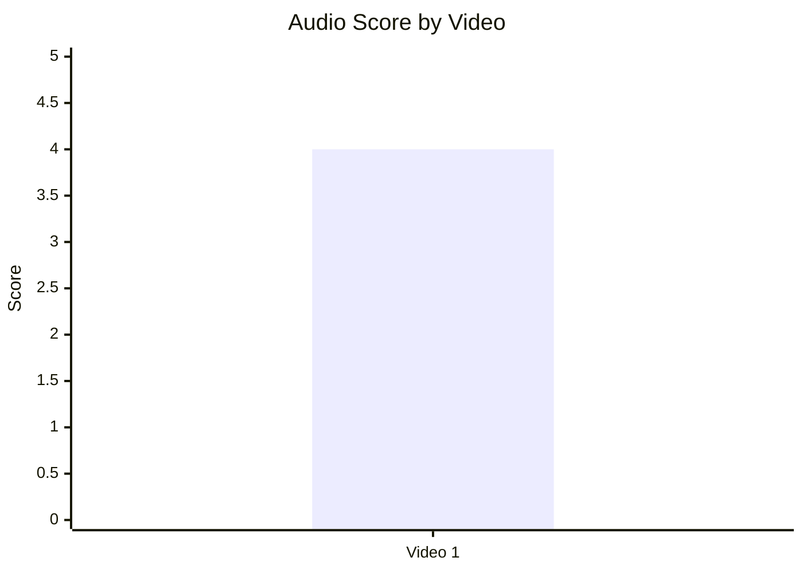

## 10.2. Audio score vs Overall Score

- Назва графіка: Audio score vs Overall Score
- Яке питання він відповідає: чи краща якість аудіо пов’язана з вищим overall?
- Які поля використовуються: `audio_score`, `overall_video_score`
- Тип графіка: descriptive table, correlation skipped
- Що видно з графіка: audio = 4, overall = 4.20.
- Практичний висновок: зв’язок не оцінюється через n=1.

| Video | Audio score | Overall score |
|---|---:|---:|
| Video 1 | 4 | 4.20 |

## 11. Графіки коментарів

## 11.1. Sentiment distribution

- Назва графіка: Sentiment distribution
- Яке питання він відповідає: як розподілена реакція аудиторії?
- Які поля використовуються: `positive_percent`, `negative_percent`, `mixed_percent`, `neutral_percent`, `question_percent`, `request_percent`
- Тип графіка: Mermaid bar chart
- Що видно з графіка: найбільші категорії — `NEUTRAL` 26.0%, `MIXED` 21.9%, `NEGATIVE` 14.9%, `POSITIVE` 12.8%.
- Практичний висновок: відео провокує debate/interpretation, а не просту позитивну реакцію.

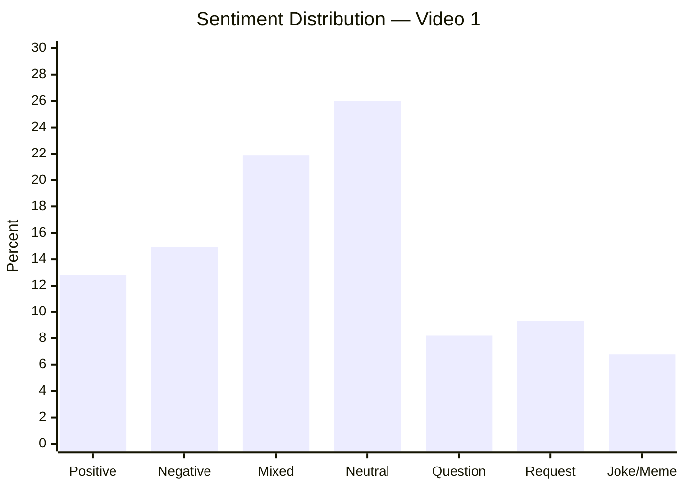

| Sentiment | Count | Percent of relevant comments |
|---|---:|---:|
| POSITIVE | 3,020 | 12.8 |
| NEGATIVE | 3,515 | 14.9 |
| MIXED | 5,140 | 21.9 |
| NEUTRAL | 6,120 | 26.0 |
| QUESTION | 1,925 | 8.2 |
| REQUEST | 2,185 | 9.3 |
| JOKE_MEME | 1,610 | 6.8 |
| SPAM / IRRELEVANT | 683 | N/A |

## 11.2. Comment resonance score by video

- Назва графіка: Comment resonance score by video
- Яке питання він відповідає: наскільки сильна реакція в коментарях?
- Які поля використовуються: `comment_resonance_score`
- Тип графіка: Mermaid bar chart
- Що видно з графіка: Video 1 має `5/5`.
- Практичний висновок: коментарі — головний актив і одночасно головний ризик відео.

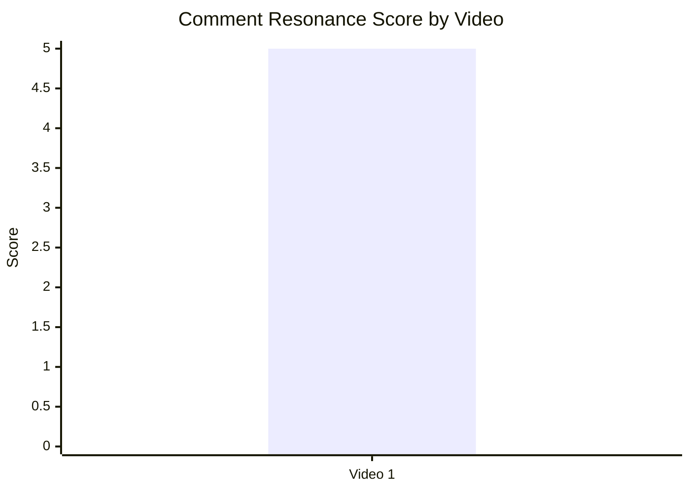

## 11.3. Top comment clusters

- Назва графіка: Top comment clusters
- Яке питання він відповідає: що найчастіше хвалять, критикують або просять?
- Які поля використовуються: comment cluster names, `% of relevant comments`
- Тип графіка: Mermaid bar chart
- Що видно з графіка: найбільший вказаний кластер — Trump/MAGA/U.S. mapping 17.2%, далі definition/accuracy disputes 12.9%, country-comparison debate 10.6%.
- Практичний висновок: для наступного відео потрібні FAQ, country matrix і follow-up series.

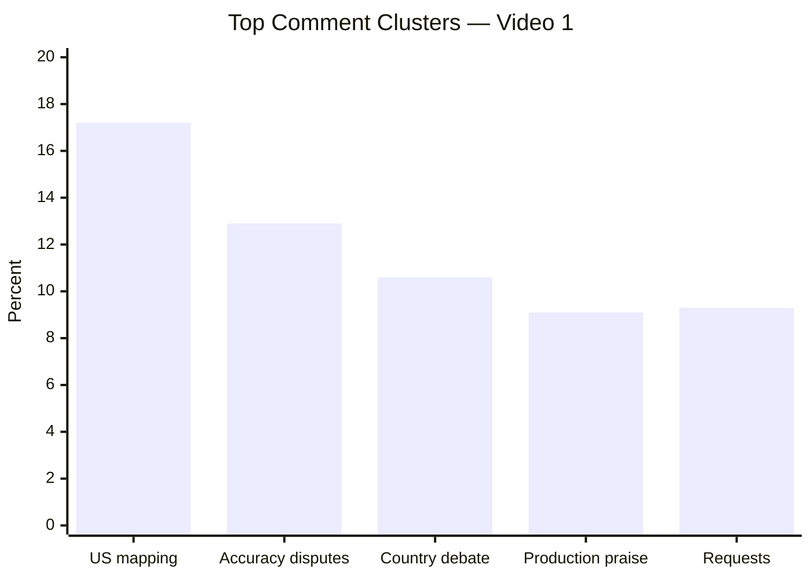

| Cluster | Topic label | Count | % of relevant comments |
|---|---|---:|---:|
| Trump / MAGA / U.S. mapping | COMMUNITY_DISCUSSION | 4,051 | 17.2 |
| Definition / accuracy disputes | CRITICISM_ACCURACY | 3,042 | 12.9 |
| Country-comparison debate | COMMUNITY_DISCUSSION | 2,493 | 10.6 |
| Praise for production / documentary quality | PRAISE_PRODUCTION | 2,145 | 9.1 |
| Requests for follow-up topics | REQUEST_TOPIC / REQUEST_SERIES | 2,185 | 9.3 |

## 12. Графіки score-системи

## 12.1. Overall score by video

- Назва графіка: Overall score by video
- Яке питання він відповідає: яке відео найсильніше за composite score?
- Які поля використовуються: `overall_video_score`
- Тип графіка: Mermaid bar chart
- Що видно з графіка: Video 1 має `4.20/5`.
- Практичний висновок: відео сильне за внутрішньою score-системою, але немає інших відео для ranking.

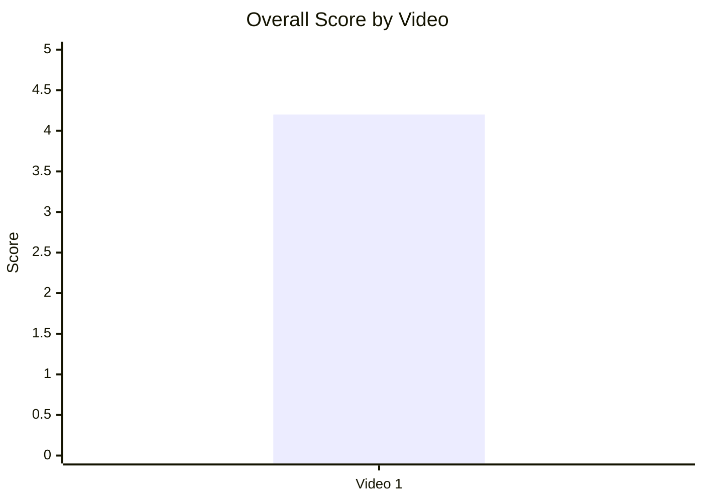

## 12.2. Score breakdown heatmap

- Назва графіка: Score breakdown heatmap
- Яке питання він відповідає: які компоненти сильні, а які слабші?
- Які поля використовуються: `hook_score`, `structure_score`, `value_density_score`, `audio_score`, `cta_score`, `ad_integration_score`, `comment_resonance_score`, `replicability_score`, `overall_video_score`
- Тип графіка: Markdown heatmap / matrix
- Що видно з графіка: найсильніші елементи — structure і comments; найслабший — CTA.
- Практичний висновок: не треба міняти основний storytelling engine; треба покращити CTA/session strategy і objections handling.

| Video | Hook | Structure | Value Density | Audio | CTA | Ad | Comments | Replicability | Overall |
|---|---:|---:|---:|---:|---:|---:|---:|---:|---:|
| Video 1 | 4 | 5 | 4 | 4 | 3 | 4 | 5 | 4 | 4.20 |

**Heatmap reading:**  
- 5 = сильний елемент  
- 4 = добрий елемент  
- 3 = середній / зона оптимізації  
- N/A = немає даних

## 12.3. Strengths vs weaknesses count

- Назва графіка: Strengths vs weaknesses count
- Яке питання він відповідає: скільки success mechanics і missed opportunities зафіксовано?
- Які поля використовуються: count of `success_mechanics`, count of `missed_opportunities`
- Тип графіка: Mermaid bar chart
- Що видно з графіка: 5 success mechanics і 5 missed opportunities.
- Практичний висновок: відео має сильний engine, але кожна слабкість має прямий test/fix.

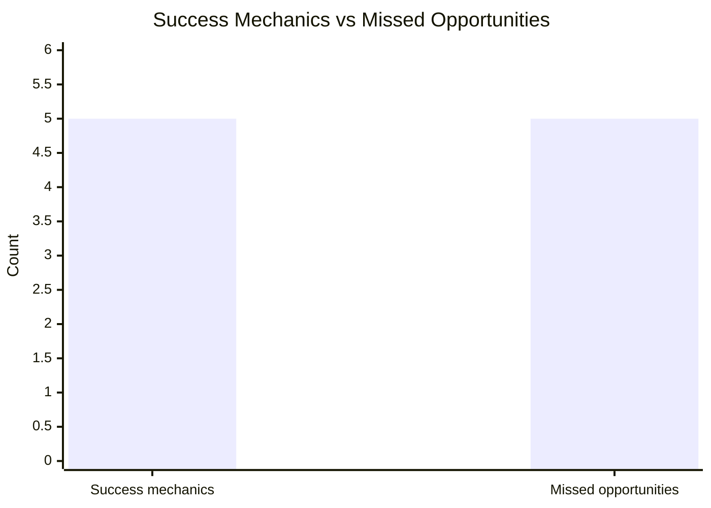

| Video | Success mechanics count | Missed opportunities count |
|---|---:|---:|
| Video 1 | 5 | 5 |

## 13. Кореляції та патерни

Correlation analysis skipped: fewer than 5 comparable videos.

| Pair | Correlation / Pattern | Strength | Interpretation | Confidence |
|---|---:|---|---|---|
| hook_score → overall_video_score | NOT_COMPARABLE | N/A | n=1, кореляцію будувати заборонено | LOW |
| value_density_score → er_public_percent | NOT_COMPARABLE | N/A | n=1, кореляцію будувати заборонено | LOW |
| cta_score → comment_rate_percent | NOT_COMPARABLE | N/A | n=1, кореляцію будувати заборонено | LOW |
| comment_resonance_score → er_public_percent | NOT_COMPARABLE | N/A | n=1, кореляцію будувати заборонено | LOW |
| views_per_day → er_public_percent | INSUFFICIENT_DATA | N/A | `views_per_day = N/A` | LOW |
| ad_load_percent → er_public_percent | INSUFFICIENT_DATA | N/A | `ad_load_percent = N/A` | LOW |
| time_to_first_value_seconds → overall_video_score | INSUFFICIENT_DATA | N/A | `time_to_first_value_seconds = NO_TIMECODES` | LOW |

### Попередні патерни

| Pattern | Дані | Interpretation | Confidence |
|---|---|---|---|
| Curiosity hook + personal uncertainty може знижувати спротив | hook_score 4/5; primary hook type `CURIOSITY_GAP` | Це перспективна гіпотеза для тесту на інших відео | LOW |
| Comment prompt спровокував велику дискусію | comments 25,453+; comment_resonance_score 5/5; CTA includes community question | Працює як engagement trigger, але потребує moderation/FAQ | LOW |
| Відсутній watch-next bridge | CTA matrix: next video bridge ❌ | Можлива втрата session depth після довгого відео | LOW |
| Sponsor fit не виглядає головним джерелом негативу | ad_integration_score 4/5; negative ad reaction LOW | Storyblocks релевантний до documentary visuals | LOW |

## 14. Висновки для контент-стратегії

| Спостереження | Дані / графік | Що це означає | Що робити |
|---|---|---|---|
| Основний storytelling engine сильний | Structure 5/5, Overall 4.20/5 | Формат “source code явища → історичні кейси → сучасна рамка” працює для складної теми | Повторити на інших токсичних/плутаних термінах |
| CTA-layer слабший за content-layer | CTA 3/5, no subscribe/like/next bridge | Відео генерує дискусію, але не повністю веде глядача до наступної дії | Додати next-video bridge, playlist bridge, pinned FAQ + poll |
| Коментарі — актив і ризик | Comment resonance 5/5; accuracy disputes 12.9%, U.S. mapping 17.2% | Тема запускає сильний debate, але частина аудиторії атакує definition framing | Передбачати objections block і pinned comment structure |
| Серійність має очевидний попит | Request cluster 9.3% | Аудиторія прямо просить продовження: communism, Holodomor, Iran, country matrix | Робити sequel pipeline, а не standalone |
| Реклама має добрий native fit, але слабкі дані по load | Ad score 4/5; ad_load N/A | Sponsor не виглядає головною проблемою, але точний вплив не виміряний | У майбутніх аналізах фіксувати ad timestamps і ad duration |
| Аудіо не є bottleneck | Audio 4/5; audio complaints LOW | Покращення аудіо не є найвищим пріоритетом | Зберігати рівень, фокусувати optimization на CTA/FAQ/series |

## 15. Що тестувати далі

| Тест | Гіпотеза | На яких даних базується | Як виміряти | Пріоритет |
|---|---|---|---|---|
| Objections / FAQ block у відео | Якщо закрити 5–7 типових заперечень до фіналу, зменшиться неконтрольована definition-дискусія | `CRITICISM_ACCURACY` 12.9%, missed opportunity `COMMENTS_SHOW_CONFUSION` | Частка accuracy-dispute comments; sentiment mix; comment quality | HIGH |
| Pinned comment із FAQ + sponsor + next topic poll | Якщо pinned comment керує дискусією, більше глядачів перейде до корисних follow-up тем | Pinned comment зараз зайнятий sponsor offer; `MISSING_PINNED_COMMENT_STRATEGY` | CTR по links, replies quality, частка повторюваних питань | HIGH |
| End-screen / watch-next bridge | Якщо додати bridge до тематичного продовження, збільшиться session depth | `NO_NEXT_VIDEO_BRIDGE`; CTA next video ❌ | End screen CTR, playlist starts, returning viewers | HIGH |
| Серія “Political systems explained” | Якщо масштабувати source-code формат, можна повторити engagement на суміжних темах | Request cluster 9.3%; topics: communism, Holodomor, Iran, fascism index | Views per day, ER Public %, comments per 1k views у серії | HIGH |
| Country matrix sequel | Якщо дати applied framework, аудиторія отримає відповідь на country-comparison запити | Country-comparison debate 10.6% | Comment request reduction, shares, saves, watch time | MEDIUM |
| CTA після першого value block | Якщо CTA стоїть після ранньої цінності, він буде менш disruptive | CTA score 3/5; current CTA partly before full payoff | CTA click/reply rate, retention around CTA segment | MEDIUM |
| Ad timestamp discipline | Якщо рекламні інтеграції вимірювати точно, можна оптимізувати ad load | `ad_load_percent = N/A`, `first_ad_time = NO_TIMECODES` | Ad load %, retention dip near ad, sponsor CTR | MEDIUM |
| Time-coded transcript workflow | Якщо в кожному звіті є timecodes, можна будувати графіки structure/time-to-value | `NO_TIMECODES` блокує time-to-first-value графік | % звітів із `time_to_first_value_seconds`; retention proxy | HIGH |

## 16. Дані для експорту в таблицю / CSV

| video_label | title | format_group | views | views_per_day | like_rate_percent | comment_rate_percent | er_public_percent | views_per_1k_subs | hook_type | hook_score | cta_count | cta_score | ad_load_percent | ad_integration_score | audio_score | comment_resonance_score | overall_video_score | top_success_mechanic | top_missed_opportunity |
|---|---|---|---:|---:|---:|---:|---:|---:|---|---:|---:|---:|---:|---:|---:|---:|---:|---|---|
| Video 1 | Is Fascism Back? | LONG_20_PLUS_MIN | 6889503 | N/A | 2.55 | 0.37 | 2.92 | 891.27 | CURIOSITY_GAP | 4 | 4 | 3 | N/A | 4 | 4 | 5 | 4.20 | STRONG_STORY_STRUCTURE | COMMENTS_SHOW_CONFUSION |

```csv
video_label,title,format_group,views,views_per_day,like_rate_percent,comment_rate_percent,er_public_percent,views_per_1k_subs,hook_type,hook_score,cta_count,cta_score,ad_load_percent,ad_integration_score,audio_score,comment_resonance_score,overall_video_score,top_success_mechanic,top_missed_opportunity
Video 1,Is Fascism Back?,LONG_20_PLUS_MIN,6889503,N/A,2.55,0.37,2.92,891.27,CURIOSITY_GAP,4,4,3,N/A,4,4,5,4.20,STRONG_STORY_STRUCTURE,COMMENTS_SHOW_CONFUSION
```