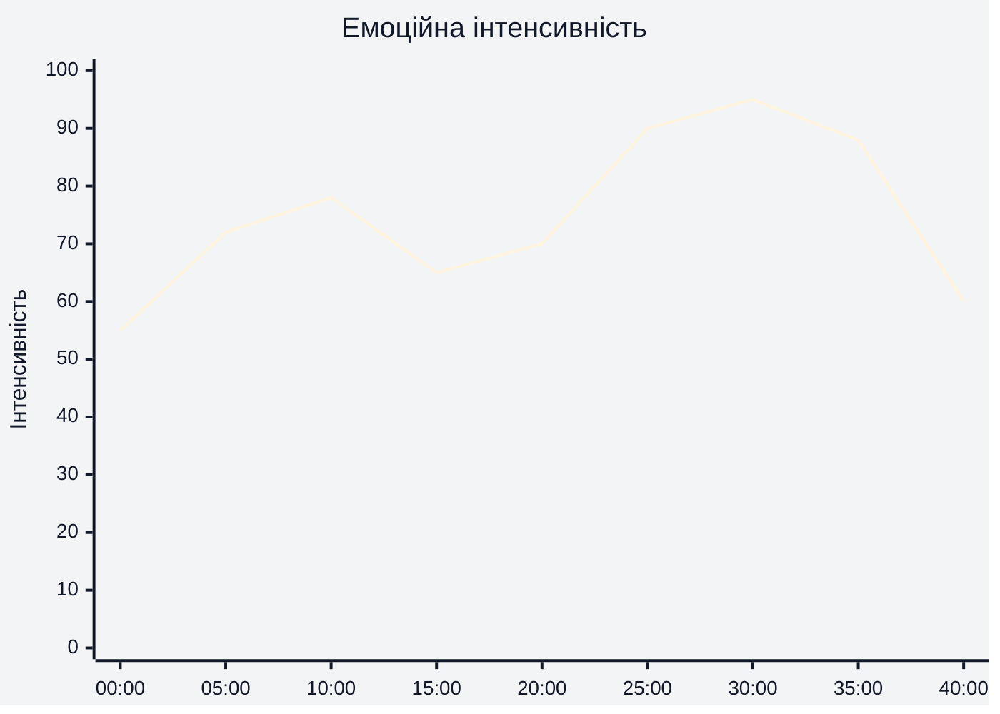
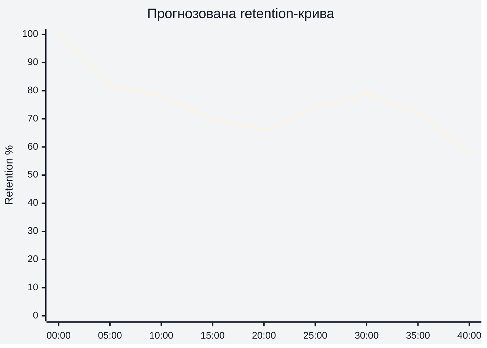
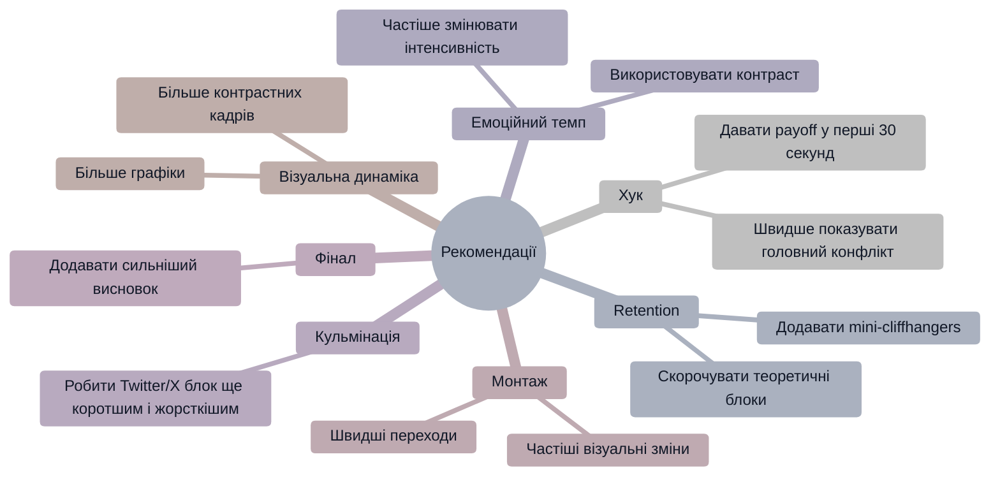

# Аналіз довгоформатного YouTube-відео

## 1. Сюжетна дуга (Narrative Arc)

```mermaid
%%{init: {'theme':'base', 'themeVariables': {
'primaryColor':'#f3f4f6',
'primaryTextColor':'#111827',
'primaryBorderColor':'#2563eb',
'lineColor':'#2563eb',
'secondaryColor':'#ffffff',
'tertiaryColor':'#f3f4f6',
'background':'#f3f4f6'
}}}%%
flowchart LR
A["00:00–01:34<br>Хук<br>Питання: хто такий Ілон Маск і чому він змінився"] -->
B["01:34–04:29<br>Експозиція<br>Дитинство, булінг, перші інтереси"] -->
C["04:29–12:05<br>Перша ескалація<br>Zip2, PayPal, Tesla, SpaceX"] -->
D["12:05–21:23<br>Переломний момент<br>Пояснення стилю управління Маска"] -->
E["21:23–22:48<br>Наростання напруги<br>Поворот до соціальних медіа"] -->
F["22:48–38:07<br>Кульмінація<br>Twitter/X, свобода слова, політичний вплив"] -->
G["38:07–41:10<br>Розв’язка<br>Спроба оцінити вплив Маска"] -->
H["41:10–42:46<br>Фінальний висновок<br>Підсумок і кредити"]
```

---

## 2. Ключові Story Beats

```mermaid
%%{init: {'theme':'base', 'themeVariables': {
'primaryColor':'#f3f4f6',
'primaryTextColor':'#111827',
'primaryBorderColor':'#2563eb',
'lineColor':'#2563eb',
'secondaryColor':'#ffffff',
'tertiaryColor':'#f3f4f6',
'background':'#f3f4f6'
}}}%%
flowchart LR
A["00:15<br>Заявка теми<br>Створення інтриги"] -->
B["02:10<br>Булінг у школі<br>Емоційне співпереживання"] -->
C["03:20<br>Перші ігри та програмування<br>Побудова образу генія"] -->
D["05:45<br>Zip2 і PayPal<br>Перший великий успіх"] -->
E["08:40<br>Tesla та SpaceX<br>Розширення масштабу"] -->
F["14:10<br>Стиль управління Маска<br>Конфліктний образ"] -->
G["18:30<br>Пояснення мотивації<br>Ідеалізм vs контроль"] -->
H["22:48<br>Покупка Twitter/X<br>Головний сюжетний поворот"] -->
I["27:20<br>Свобода слова та алгоритми<br>Пік конфлікту"] -->
J["34:50<br>Політичний вплив<br>Максимальна напруга"] -->
K["38:40<br>Підсумковий аналіз<br>Рефлексія"] -->
L["41:10<br>Фінал і кредити<br>Зниження напруги"]
```

---

## 3. Емоційний темп

### Пояснення
- 00:00–05:00: сильний curiosity hook і персональна історія.
- 08:00–12:00: зростання через масштаб бізнесів.
- 22:48–35:00: найвищий емоційний рівень через Twitter/X і політичний конфлікт.
- Після 38:00 — поступове зниження напруги та рефлексія.

---

## 4. Утримання аудиторії

### Дані retention не були надані. Нижче — прогнозована retention-структура.

### Пояснення
- Найсильніше утримання очікується на початку через сильний хук.
- Середина відео може мати плавне просідання через велику кількість бекграунд-інформації.
- Twitter/X блок імовірно повертає увагу аудиторії.

---

## 5. Піки retention

| Таймкод | Подія | Чому це може утримувати увагу | Сила піку 1–10 |
|---|---|---|---|
| 00:00 | Провокаційний вступ | Одразу створює конфлікт і питання | 9 |
| 05:45 | Продаж Zip2 / PayPal | Високий масштаб успіху | 7 |
| 08:40 | SpaceX та Tesla | Візуально сильний сегмент | 8 |
| 22:48 | Перехід до Twitter/X | Найбільш конфліктна тема | 10 |
| 27:20 | Алгоритми та свобода слова | Поляризуюча тема | 9 |
| 34:50 | Політичний вплив Маска | Високий рівень напруги | 8 |

---

## 6. Провали retention

| Таймкод | Проблема | Ймовірна причина спаду | Що покращити |
|---|---|---|---|
| 12:00–16:00 | Довгі пояснення менеджменту | Менше візуальної динаміки | Додати швидші монтажні переходи |
| 18:00–21:00 | Теоретичні пояснення мотивації | Менше конфлікту | Додати більше конкретних прикладів |
| 39:00–42:00 | Повільне завершення | Напруга вже спала | Сильніший фінальний payoff |

---

## 7. Оцінка сегментів

| Сегмент | Таймкод | Функція | Емоційна інтенсивність | Ризик втрати уваги | Оцінка 1–10 | Що покращити |
|---|---|---|---|---|---|---|
| Хук | 00:00–01:34 | Захоплення уваги | Висока | Низький | 9 | Швидше показати головний конфлікт |
| Дитинство | 01:34–04:29 | Емоційний бекграунд | Середня | Низький | 8 | Додати більше контрасту |
| Rise of Elon | 04:29–12:05 | Побудова масштабу | Висока | Середній | 8 | Скоротити деякі пояснення |
| Стиль управління | 12:05–21:23 | Формування образу | Середня | Високий | 6 | Більше візуальних доказів |
| Pivot | 21:23–22:48 | Підготовка кульмінації | Висока | Низький | 8 | Підсилити cliffhanger |
| Twitter/X | 22:48–38:07 | Основний конфлікт | Дуже висока | Низький | 10 | Тримати швидший темп |
| Висновок | 38:07–42:46 | Рефлексія | Низька | Середній | 7 | Сильніший фінальний меседж |

---

## 8. Практичні рекомендації

---

## 9. Підсумкова оцінка

| Показник | Оцінка 1–10 | Коментар |
|---|---|---|
| Сюжетна дуга | 9 | Чітка ескалація до Twitter/X |
| Story Beats | 9 | Добре розставлені сюжетні точки |
| Емоційний темп | 8 | Сильний конфліктний ритм |
| Retention Structure | 8 | Імовірно сильна середина та кульмінація |
| Загальна оцінка | 8.5 | Сильний long-form documentary storytelling |
