# Статистичний аналіз відеозвітів

## 1. Короткий executive summary

| Пункт | Висновок |
|---|---|
| Скільки відео проаналізовано | 1 |
| Скільки форматів відео | 1: `LONG_20_PLUS_MIN` |
| Найсильніше відео за overall score | Video 1 — `The Problem With Elon Musk`: 4.35 / 5 |
| Найсильніше відео за ER Public % | Video 1 — 2.99% |
| Найсильніше відео за views per day | Video 1 — 12,396.38 views/day |
| Найсильніша повторювана механіка | `INSUFFICIENT_DATA` для повторюваності між відео; в єдиному звіті головна механіка: controversial public figure + biography + ideological pivot + platform/power consequence |
| Найчастіша слабкість | `INSUFFICIENT_DATA` для частоти між відео; в єдиному звіті головна слабкість: perceived bias / недовіра до framing |
| Головна стратегічна можливість | Повторити формат polarizing documentary, але додати counterargument audit, нейтральний comment prompt і next-video bridge |
| Рівень впевненості | `LOW_CONFIDENCE` для статистичних патернів через n=1; `HIGH/MEDIUM` тільки для описових даних із одного звіту |

## 2. Якість і повнота даних

| Поле | Кількість відео з даними | Кількість N/A | Коментар |
|---|---:|---:|---|
| views | 1 | 0 | Public metric із YT_VIDEO_ANALYSIS_V1 |
| likes | 1 | 0 | Public metric |
| comments_count | 1 | 0 | Public metric; parsed comments у звіті: 33,088 vs public count 33,783 |
| views_per_day | 1 | 0 | Derived metric |
| er_public_percent | 1 | 0 | Derived public engagement metric |
| views_per_1k_subs | 1 | 0 | Subscribers provided |
| hook_score | 1 | 0 | Score 1–5 |
| cta_score | 1 | 0 | Score 1–5 |
| ad_integration_score | 1 | 0 | Score 1–5 |
| audio_score | 1 | 0 | Score 1–5, але `PARTIAL_DATA` |
| comment_resonance_score | 1 | 0 | Score 1–5 |
| overall_video_score | 1 | 0 | Weighted score from source report |

### Обмеження аналізу

- Є лише 1 відео, тому кореляції, кластери й повторювані статистичні патерни не будуються.
- Дані owner-only відсутні: CTR, impressions, retention, watch time, average view duration, subscribers gained, traffic sources, revenue, conversion rate.
- `ad_load_percent`, `first_ad_relative_position_percent` і точний `time_to_first_ad` недоступні через відсутність точних ad timecodes.
- Висновки нижче — описова візуалізація одного звіту, не повноцінна статистика когорти.

## 3. Підготовлена таблиця для графіків

| Video | Format | Views | Views/day | Like Rate % | Comment Rate % | ER Public % | Views/1k subs | Hook | CTA | Ad | Audio | Comment Resonance | Overall |
|---|---|---:|---:|---:|---:|---:|---:|---:|---:|---:|---:|---:|---:|
| Video 1 | LONG_20_PLUS_MIN | 8,404,745 | 12,396.38 | 2.59 | 0.4 | 2.99 | 1087.29 | 5 | 3 | 4 | 4 | 5 | 4.35 |

| Label | Full title | URL |
|---|---|---|
| Video 1 | The Problem With Elon Musk | https://www.youtube.com/watch?v=WYQxG4KEzvo |

## 4. Рекомендовані графіки

| # | Назва графіка | Тип графіка | Поля | Для чого потрібен | Пріоритет |
|---:|---|---|---|---|---|
| 1 | Overall score by video | Mermaid bar chart | overall_video_score | Побачити загальний бал відео | HIGH |
| 2 | Views per day by video | Mermaid bar chart | views_per_day | Показати normalized velocity | HIGH |
| 3 | ER Public % by video | Mermaid bar chart | er_public_percent | Показати public engagement | HIGH |
| 4 | ER Public % vs Views/day | Таблиця / quadrant note | er_public_percent, views_per_day | Баланс охоплення і залучення | HIGH |
| 5 | Hook score by video | Mermaid bar chart | hook_score | Оцінити hook | HIGH |
| 6 | CTA score by video | Mermaid bar chart | cta_score | Оцінити CTA | HIGH |
| 7 | Score breakdown heatmap | Markdown heatmap table | all score fields | Побачити сильні/слабкі сторони | HIGH |
| 8 | Sentiment distribution | Mermaid pie chart | comment sentiment % | Показати реакцію аудиторії | HIGH |
| 9 | CTA features heatmap | Markdown matrix | CTA feature booleans | Побачити використані CTA | HIGH |
| 10 | Ad load % by video | Skipped / table | ad_load_percent | Оцінити рекламне навантаження | HIGH, але `INSUFFICIENT_DATA` |

## 5. Графіки продуктивності

## 5.1. Views by video

- Назва графіка: Views by video
- Яке питання він відповідає: яке відео має найбільший raw reach
- Які поля використовуються: `video_label`, `views`
- Тип графіка: Mermaid bar chart
- Що видно з графіка: єдине відео має 8,404,745 views
- Практичний висновок: raw reach високий в абсолюті, але без когорти не можна визначити outlier за правилом median ×3

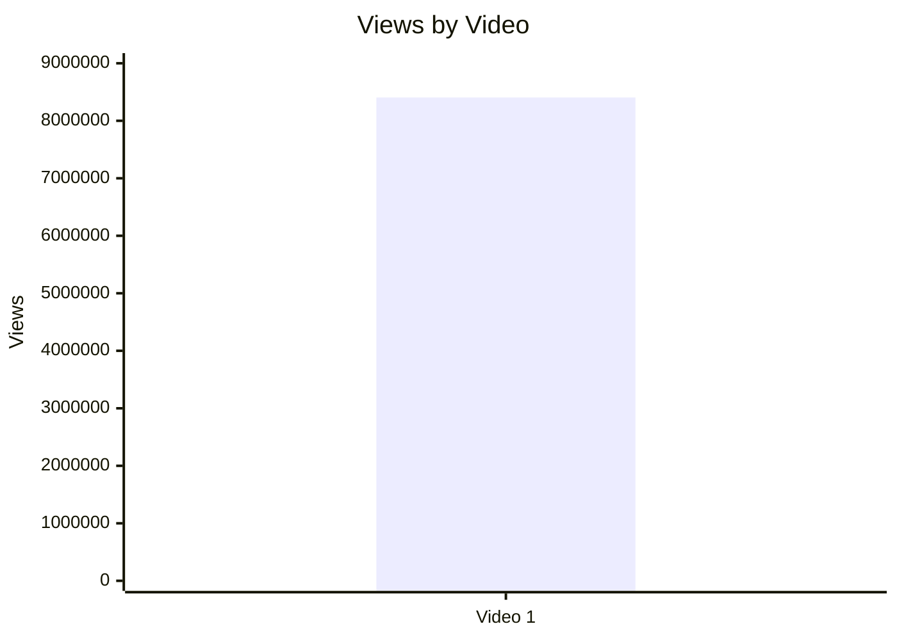

## 5.2. Views per day by video

- Назва графіка: Views per day by video
- Яке питання він відповідає: яка швидкість набору переглядів із урахуванням віку
- Які поля використовуються: `video_label`, `views_per_day`
- Тип графіка: Mermaid bar chart
- Що видно з графіка: Video 1 має 12,396.38 views/day
- Практичний висновок: це кращий performance proxy, ніж raw views; однак без інших відео немає ранжування

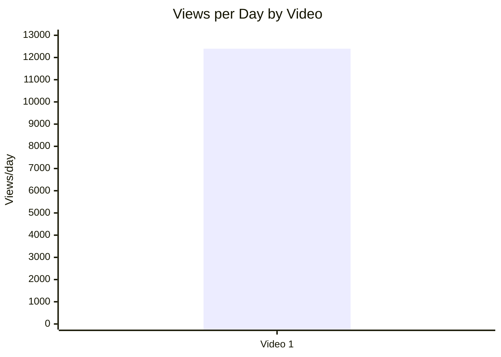

## 5.3. Views per 1k subscribers

- Назва графіка: Views per 1k subscribers
- Яке питання він відповідає: як відео конвертує розмір каналу в перегляди
- Які поля використовуються: `video_label`, `views_per_1k_subs`
- Тип графіка: Mermaid bar chart
- Що видно з графіка: 1,087.29 views per 1k subscribers
- Практичний висновок: відео набрало більше переглядів, ніж subscriber base у перерахунку на 1k subs, але без cohort benchmark це не називається “добре/погано”

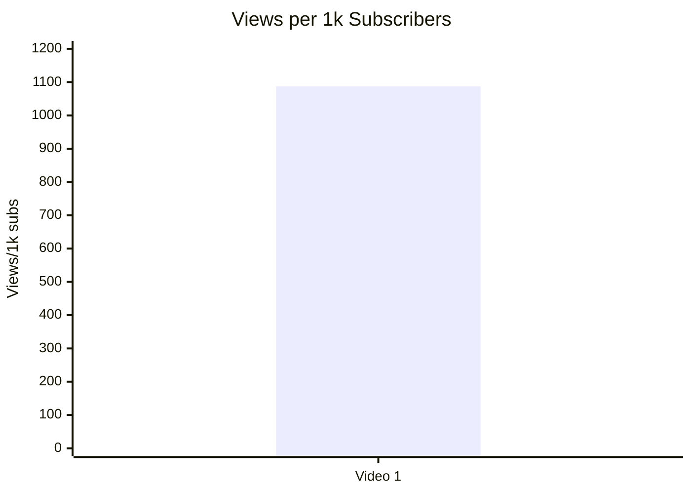

## 5.4. Performance quadrant

- Назва графіка: Performance quadrant
- Яке питання він відповідає: баланс reach velocity та engagement
- Які поля використовуються: `views_per_day`, `er_public_percent`
- Тип графіка: scatter plot у вигляді таблиці, бо n=1
- Що видно з графіка: одна точка: 12,396.38 views/day і 2.99% ER Public
- Практичний висновок: quadrant thresholds неможливо визначити без когорти; `INSUFFICIENT_DATA`

| Video | Views/day | ER Public % | Quadrant |
|---|---:|---:|---|
| Video 1 | 12,396.38 | 2.99 | `INSUFFICIENT_DATA` — немає cohort median/thresholds |

## 6. Графіки залучення

## 6.1. ER Public % by video

- Назва графіка: ER Public % by video
- Яке питання він відповідає: public engagement rate
- Які поля використовуються: `video_label`, `er_public_percent`
- Тип графіка: Mermaid bar chart
- Що видно з графіка: 2.99%
- Практичний висновок: залучення є вимірюваним, але без benchmark не оцінюється як сильне/слабке

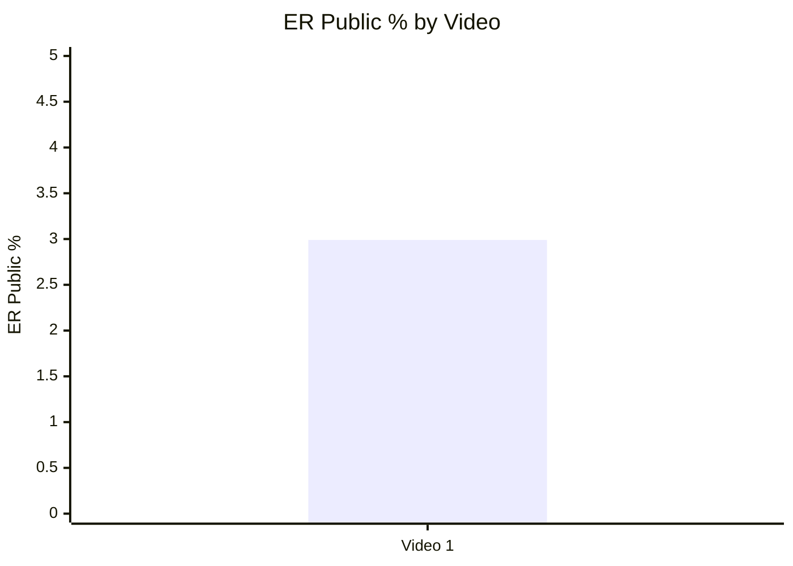

## 6.2. Like Rate % vs Comment Rate %

- Назва графіка: Like Rate % vs Comment Rate %
- Яке питання він відповідає: чи відео більше отримує likes чи провокує comments
- Які поля використовуються: `like_rate_percent`, `comment_rate_percent`
- Тип графіка: scatter/table
- Що видно з графіка: like rate 2.59%, comment rate 0.40%
- Практичний висновок: коментарність значна в абсолюті, але без порівняння з іншими відео не можна визначити quadrant

| Video | Like Rate % | Comment Rate % | Interpretation |
|---|---:|---:|---|
| Video 1 | 2.59 | 0.40 | Описово: likes переважають comments; якісно comments містять сильний debate engine |

## 6.3. Comments per 1k views

- Назва графіка: Comments per 1k views
- Яке питання він відповідає: наскільки відео провокує реакцію на 1k переглядів
- Які поля використовуються: `comments_per_1k_views`
- Тип графіка: Mermaid bar chart
- Що видно з графіка: 4.02 comments per 1k views
- Практичний висновок: у звіті це підтримано великими debate clusters; без когорти — описова метрика

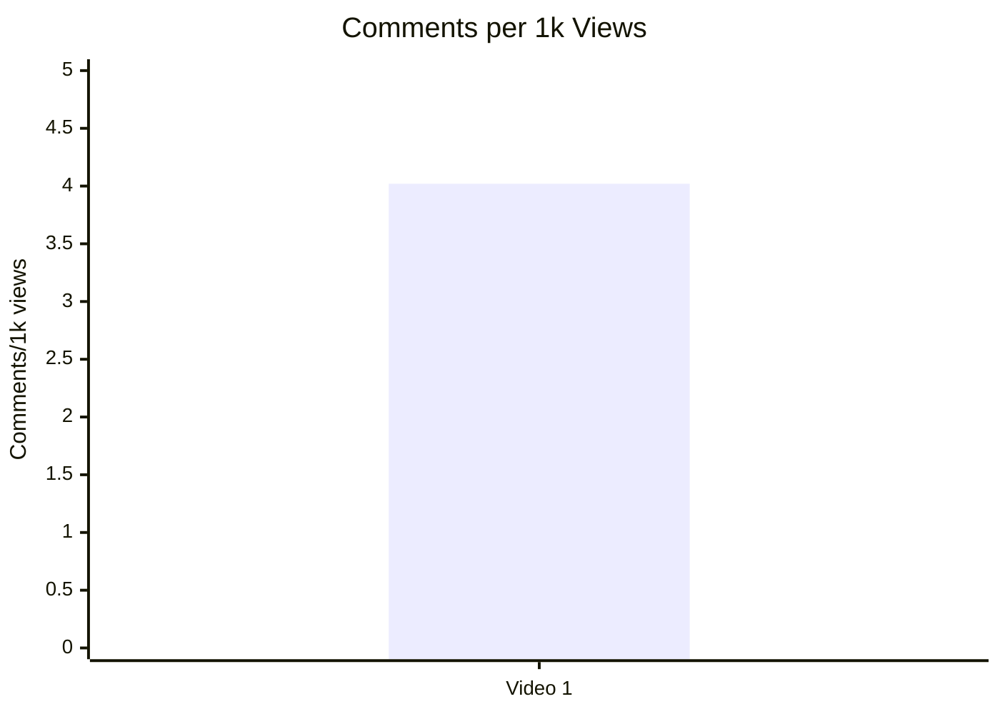

## 7. Графіки структури та hook

## 7.1. Hook score by video

- Назва графіка: Hook score by video
- Яке питання він відповідає: наскільки сильний hook
- Які поля використовуються: `hook_score`
- Тип графіка: Mermaid bar chart
- Що видно з графіка: hook score = 5/5
- Практичний висновок: hook — найсильніша score-зона; масштабувати обережно з доказовістю framing

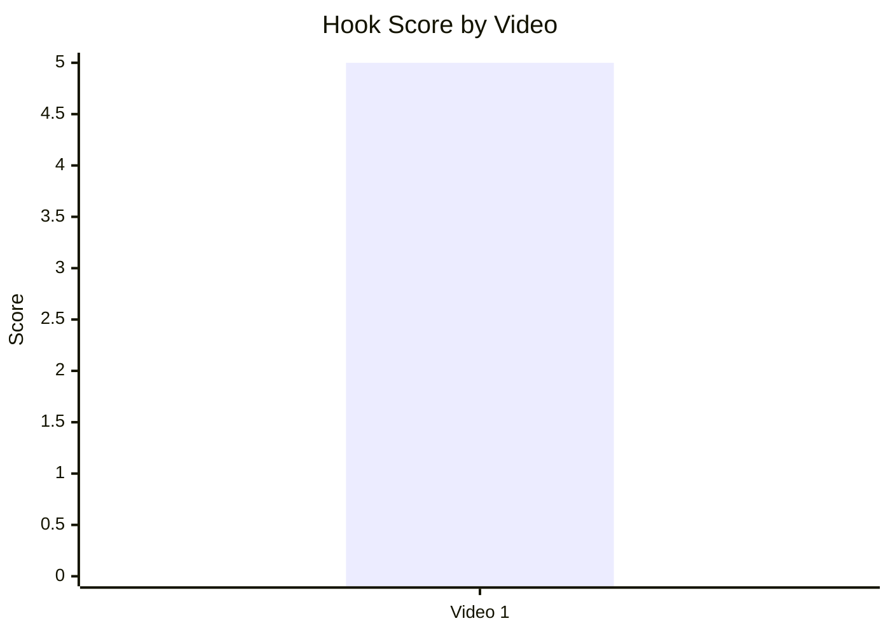

## 7.2. Hook type distribution

- Назва графіка: Hook type distribution
- Яке питання він відповідає: який primary hook використано
- Які поля використовуються: `primary_hook_type`
- Тип графіка: Mermaid pie chart
- Що видно з графіка: 100% доступних кейсів мають `CURIOSITY_GAP`
- Практичний висновок: це не “найкращий hook type”, а лише hook type єдиного відео

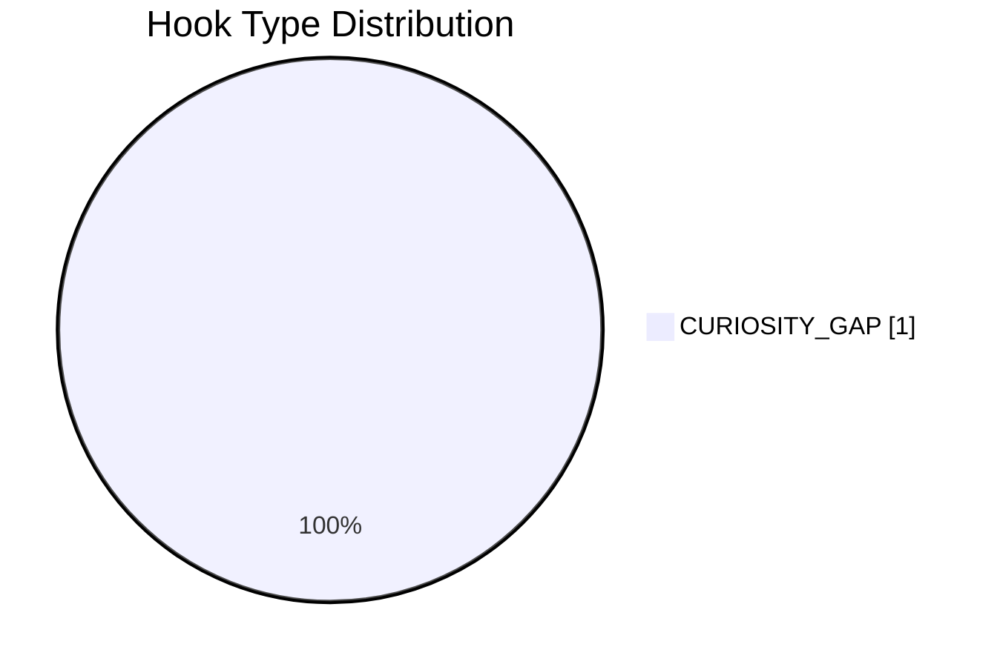

## 7.3. Time to first value vs Overall Score

- Назва графіка: Time to first value vs Overall Score
- Яке питання він відповідає: чи швидша перша цінність пов’язана з вищим результатом
- Які поля використовуються: `time_to_first_value_seconds`, `overall_video_score`
- Тип графіка: skipped
- Що видно з графіка: `time_to_first_value_seconds` відсутній у Comparable Summary JSON
- Практичний висновок: `INSUFFICIENT_DATA`; для майбутніх звітів треба стандартизовано витягувати seconds

| Video | time_to_first_value_seconds | Overall |
|---|---:|---:|
| Video 1 | N/A | 4.35 |

## 8. Графіки CTA

## 8.1. CTA score by video

- Назва графіка: CTA score by video
- Яке питання він відповідає: якість CTA системи
- Які поля використовуються: `cta_score`
- Тип графіка: Mermaid bar chart
- Що видно з графіка: CTA score = 3/5
- Практичний висновок: CTA нижчий за hook/structure/comments; головна можливість — explicit comment prompt і next-video bridge

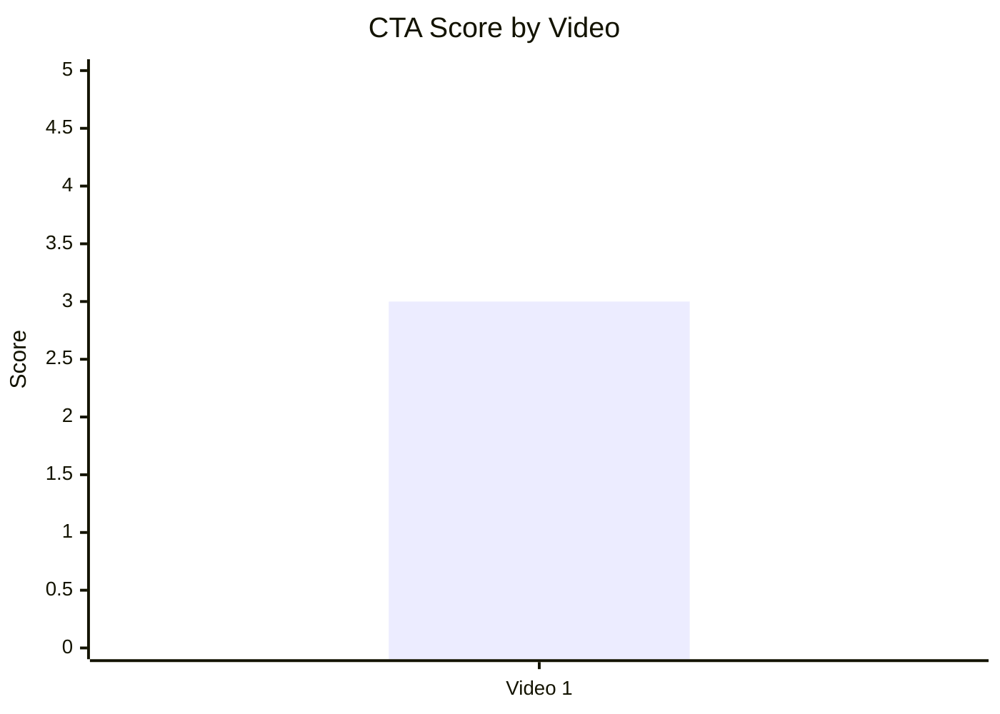

## 8.2. CTA count vs ER Public %

- Назва графіка: CTA count vs ER Public %
- Яке питання він відповідає: чи кількість CTA пов’язана із залученням
- Які поля використовуються: `cta_count`, `er_public_percent`
- Тип графіка: skipped/table
- Що видно з графіка: 6 actionable CTA rows detected у звіті, ER Public = 2.99%
- Практичний висновок: не можна робити pattern/correlation з n=1; є ризик CTA overload у description

| Video | CTA count | ER Public % | CTA overload |
|---|---:|---:|---|
| Video 1 | 6 | 2.99 | YES |

## 8.3. CTA features heatmap

- Назва графіка: CTA features heatmap
- Яке питання він відповідає: які CTA features реально присутні
- Які поля використовуються: `has_comment_prompt`, `has_subscribe_cta`, `has_like_cta`, `has_bell_cta`, `has_next_video_bridge`
- Тип графіка: Markdown matrix
- Що видно з графіка: sponsor/external CTA є, але comment/subscribe/like/bell/next bridge відсутні
- Практичний висновок: найбільший CTA gap — відсутність керованого comment prompt і next-video continuation

| Video | Comment prompt | Subscribe | Like | Bell | Next video bridge |
|---|---|---|---|---|---|
| Video 1 | ❌ | ❌ | ❌ | ❌ | ❌ |

## 9. Графіки реклами / інтеграцій

Є реклама / інтеграції: Ground News sponsor read, pinned comment ad, description sponsor link, self-promo links.

## 9.1. Ad load % by video

- Назва графіка: Ad load % by video
- Яке питання він відповідає: рекламне навантаження
- Які поля використовуються: `ad_load_percent`
- Тип графіка: skipped
- Що видно з графіка: `ad_load_percent = N/A`
- Практичний висновок: графік неможливий без total ad duration seconds

| Video | ad_count | total_ad_duration_seconds | ad_load_percent |
|---|---:|---:|---:|
| Video 1 | 4 | N/A | N/A |

## 9.2. First ad position %

- Назва графіка: First ad position %
- Яке питання він відповідає: чи реклама стоїть занадто рано
- Які поля використовуються: `first_ad_relative_position_percent`
- Тип графіка: skipped
- Що видно з графіка: точний first ad time відсутній
- Практичний висновок: `INSUFFICIENT_DATA`; якісно звіт каже, що sponsor appears після early context, але до головного Twitter payoff

| Video | first_ad_time | first_ad_relative_position_percent | Note |
|---|---|---:|---|
| Video 1 | NO_TIMECODES | N/A | Sponsor після setup, але без exact timecode |

## 9.3. Ad integration score vs ER Public %

- Назва графіка: Ad integration score vs ER Public %
- Яке питання він відповідає: чи якість інтеграції пов’язана з reaction
- Які поля використовуються: `ad_integration_score`, `er_public_percent`
- Тип графіка: table/scatter placeholder
- Що видно з графіка: Ad score 4, ER 2.99%
- Практичний висновок: не робити correlation з n=1; описово sponsor має strong native fit

| Video | Ad integration score | ER Public % |
|---|---:|---:|
| Video 1 | 4 | 2.99 |

## 10. Графіки аудіо

## 10.1. Audio score by video

- Назва графіка: Audio score by video
- Яке питання він відповідає: якість аудіо
- Які поля використовуються: `audio_score`
- Тип графіка: Mermaid bar chart
- Що видно з графіка: audio score = 4/5
- Практичний висновок: аудіо не є основним friction point у звіті; ключовий ризик — content framing, не production

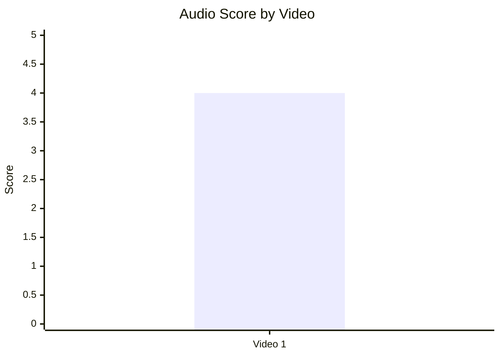

## 10.2. Audio score vs Overall Score

- Назва графіка: Audio score vs Overall Score
- Яке питання він відповідає: чи audio quality пов’язана із загальним балом
- Які поля використовуються: `audio_score`, `overall_video_score`
- Тип графіка: table/scatter placeholder
- Що видно з графіка: audio 4, overall 4.35
- Практичний висновок: `INSUFFICIENT_DATA` для зв’язку; n=1

| Video | Audio score | Overall |
|---|---:|---:|
| Video 1 | 4 | 4.35 |

## 11. Графіки коментарів

## 11.1. Sentiment distribution

- Назва графіка: Sentiment distribution
- Яке питання він відповідає: як розподіляється реакція аудиторії
- Які поля використовуються: positive_percent, negative_percent, mixed_percent, neutral_percent, question_percent, request_percent
- Тип графіка: Mermaid pie chart
- Що видно з графіка: найбільший блок — neutral 54.96%; значні question 14.27%, negative 10.16%, positive 8.95%
- Практичний висновок: відео генерує не лише praise/hate, а великий обсяг нейтральних/питальних реакцій; debate engine сильний

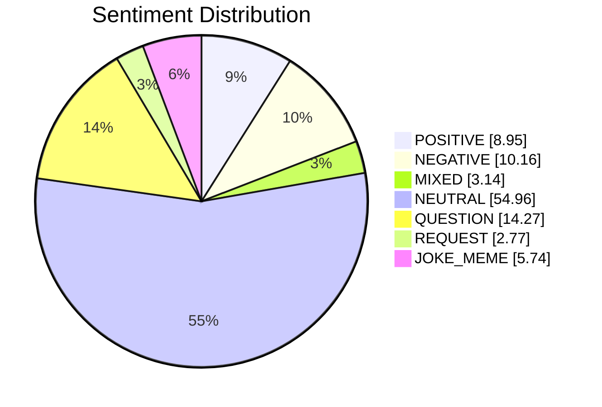

## 11.2. Comment resonance score by video

- Назва графіка: Comment resonance score by video
- Яке питання він відповідає: наскільки коментарі показують resonance/debate
- Які поля використовуються: `comment_resonance_score`
- Тип графіка: Mermaid bar chart
- Що видно з графіка: 5/5
- Практичний висновок: comments — головна сила відео, але вона поляризаційна

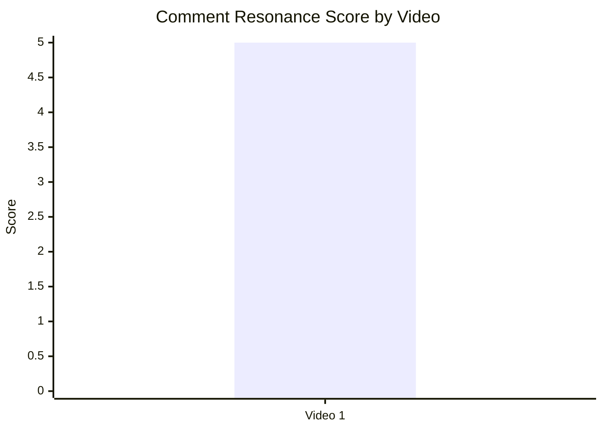

## 11.3. Top comment clusters

- Назва графіка: Top comment clusters
- Яке питання він відповідає: що найчастіше обговорюють або критикують
- Які поля використовуються: cluster name, count, percent
- Тип графіка: Mermaid bar chart + table
- Що видно з графіка: largest clusters — bias objections, free speech debate, accuracy/missing facts
- Практичний висновок: перед масштабуванням формату треба додати counterargument audit і evidence cards

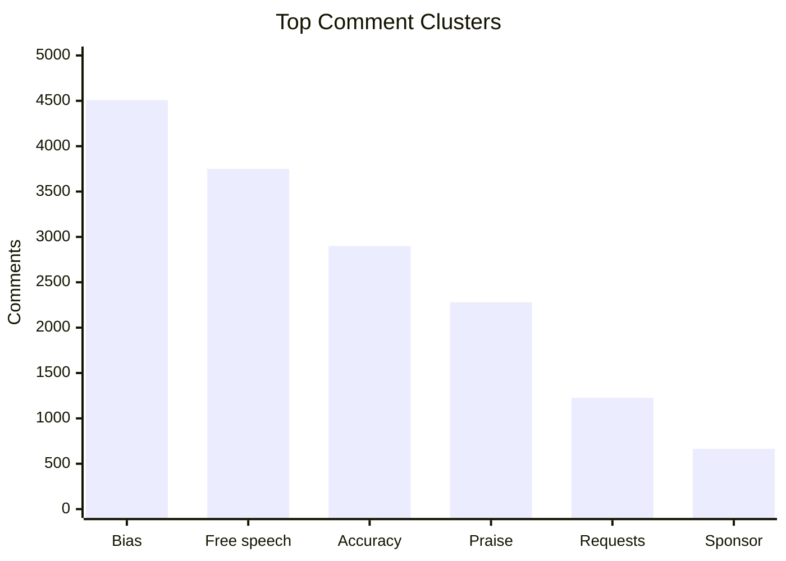

| Cluster | Count | % of relevant comments | Practical meaning |
|---|---:|---:|---|
| Bias / left-liberal framing objections | 4,508 | 13.65 | Найбільший risk cluster для довіри |
| Free speech / Twitter censorship debate | 3,750 | 11.36 | Головний debate engine |
| Accuracy / missing facts / corrections | 2,899 | 8.78 | Потреба в evidence/counterargument блоках |
| Positive evaluation | 2,280 | 6.91 | Є сильна база підтримки |
| Requests / updates / adjacent topics | 1,227 | N/A | Потенціал серійності |
| Sponsor/ad/Ground News mentions | 664 | N/A | Sponsor помітний, але не головний backlash driver |

## 12. Графіки score-системи

## 12.1. Overall score by video

- Назва графіка: Overall score by video
- Яке питання він відповідає: загальна сила відео
- Які поля використовуються: `overall_video_score`
- Тип графіка: Mermaid bar chart
- Що видно з графіка: overall score 4.35/5
- Практичний висновок: strong single-case benchmark; потрібні інші відео для ranking

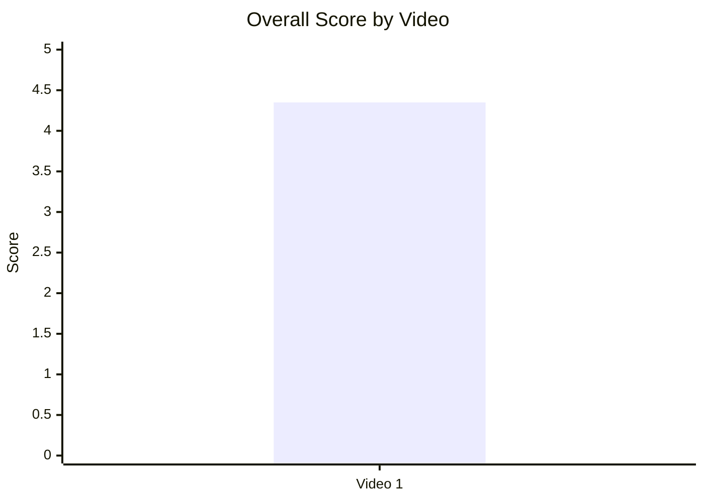

## 12.2. Score breakdown heatmap

- Назва графіка: Score breakdown heatmap
- Яке питання він відповідає: сильні та слабкі score-зони
- Які поля використовуються: hook, structure, value density, audio, CTA, ad, comments, replicability, overall
- Тип графіка: Markdown heatmap
- Що видно з графіка: найнижчий score — CTA 3; найвищі — Hook, Structure, Comments
- Практичний висновок: optimization focus — CTA system, comment prompt, next-video bridge

| Video | Hook | Structure | Value Density | Audio | CTA | Ad | Comments | Replicability | Overall |
|---|---:|---:|---:|---:|---:|---:|---:|---:|---:|
| Video 1 | 🟩 5 | 🟩 5 | 🟨 4 | 🟨 4 | 🟧 3 | 🟨 4 | 🟩 5 | 🟨 4 | 🟩 4.35 |

## 12.3. Strengths vs weaknesses count

- Назва графіка: Strengths vs weaknesses count
- Яке питання він відповідає: скільки success mechanics vs missed opportunities
- Які поля використовуються: number of success mechanics, number of missed opportunities
- Тип графіка: Mermaid bar chart
- Що видно з графіка: у звіті 5 missed opportunities; success mechanics table має 5 видимих mechanics у секції
- Практичний висновок: сильна база для повторення, але fixes мають бути вбудовані в наступний тест

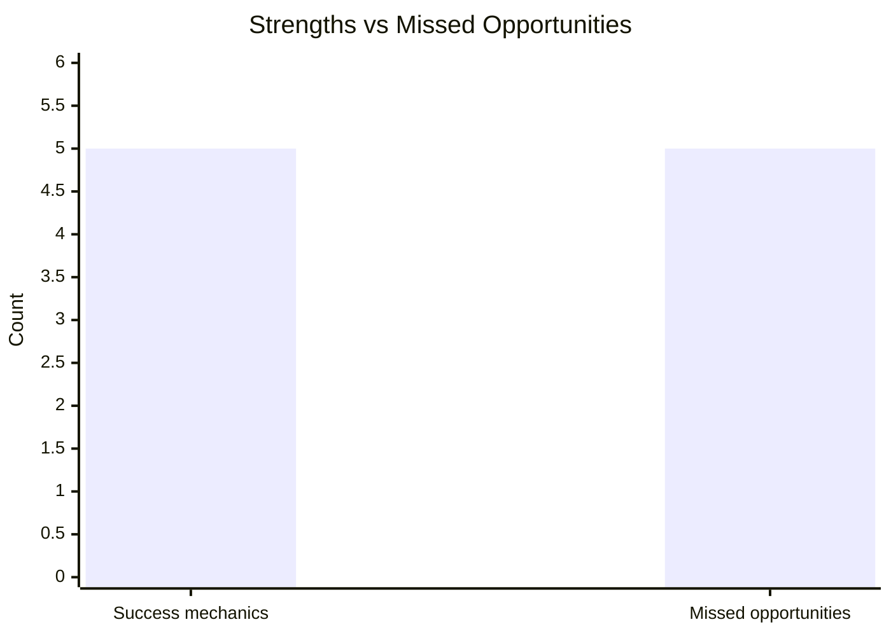

## 13. Кореляції та патерни

Correlation analysis skipped: fewer than 5 comparable videos.

| Pair | Correlation / Pattern | Strength | Interpretation | Confidence |
|---|---:|---|---|---|
| hook_score → overall_video_score | NOT_COMPARABLE | N/A | n=1 | LOW |
| value_density_score → er_public_percent | NOT_COMPARABLE | N/A | n=1 | LOW |
| cta_score → comment_rate_percent | NOT_COMPARABLE | N/A | n=1 | LOW |
| comment_resonance_score → er_public_percent | NOT_COMPARABLE | N/A | n=1 | LOW |
| views_per_day → er_public_percent | NOT_COMPARABLE | N/A | n=1 | LOW |
| ad_load_percent → er_public_percent | INSUFFICIENT_DATA | N/A | ad_load_percent=N/A | LOW |
| time_to_first_value_seconds → overall_video_score | INSUFFICIENT_DATA | N/A | time_to_first_value_seconds=N/A | LOW |

## 14. Висновки для контент-стратегії

| Спостереження | Дані / графік | Що це означає | Що робити |
|---|---|---|---|
| Hook і структура — найсильніші зони | Hook 5/5, Structure 5/5, Overall 4.35 | Documentary arc працює як single-case strength | Повторювати формат: public figure → origin → pivot → power consequence |
| CTA — найслабша score-зона | CTA 3/5, no comment prompt, no next bridge | Відео провокує дискусію, але не керує нею | Додати neutral pinned question і end-screen path |
| Коментарі — сильні, але поляризовані | Comment resonance 5/5; bias cluster 4,508; free speech cluster 3,750 | Engagement частково росте через disagreement | Передбачати backlash і додавати counterargument audit |
| Sponsor fit сильний, але ad load невідомий | Ad score 4/5; ad_load_percent=N/A | Ground News thematic fit знизив disruption risk | Зберігати native sponsor fit; вимірювати точну ad duration у майбутніх звітах |
| Audio не є головним вузьким місцем | Audio 4/5; few audio complaints | Production quality достатня для long-form | Оптимізувати content trust, не audio first |
| Серійність має потенціал | 1,227 request/update/topic comments | Аудиторія просить follow-up і суміжні фігури | Запустити follow-up series із чітким evidence framework |

## 15. Що тестувати далі

| Тест | Гіпотеза | На яких даних базується | Як виміряти | Пріоритет |
|---|---|---|---|---|
| Counterargument audit перед conclusion | Якщо явно розібрати найсильніші контраргументи, perceived bias зменшиться | Bias cluster 4,508; accuracy cluster 2,899 | Negative/bias comments per 1k views; like rate; retention owner-only якщо доступно | HIGH |
| Neutral pinned comment prompt | Керований prompt зменшить хаотичний backlash і підвищить якість дискусії | No comment prompt; comment resonance 5/5 | Comment rate %, частка constructive comments, replies to pinned comment | HIGH |
| End-screen bridge до суміжного відео | Довге відео може краще вести в session continuation | No next-video bridge | End screen CTR, next video views, session duration owner-only | MEDIUM |
| Sponsor timing після першого major payoff | Перенесення реклами може зменшити disruption до центрального Twitter блоку | Sponsor before deepest Twitter payoff; first ad time exact=N/A | Retention dip around ad; ad completion; comments mentioning sponsor | MEDIUM |
| Evidence cards для спірних тез | On-screen source/evidence зменшить “one study / no proof” comments | Accuracy/missing facts cluster 2,899 | Accuracy complaint share; source link clicks; sentiment split | HIGH |
| Follow-up “Musk update / X and politics” | Серійність на тій самій controversy може дати повторний interest | 1,227 request/update comments | Views/day, ER Public %, returning viewers owner-only | HIGH |
| CTA simplification in description | Менше description CTAs може підвищити clarity of next action | CTA overload=YES | Link CTR by priority, pinned comment interactions | MEDIUM |

## 16. Дані для експорту в таблицю / CSV

| video_label | title | format_group | views | views_per_day | like_rate_percent | comment_rate_percent | er_public_percent | views_per_1k_subs | hook_type | hook_score | cta_count | cta_score | ad_load_percent | ad_integration_score | audio_score | comment_resonance_score | overall_video_score | top_success_mechanic | top_missed_opportunity |
|---|---|---|---:|---:|---:|---:|---:|---:|---|---:|---:|---:|---:|---:|---:|---:|---:|---|---|
| Video 1 | The Problem With Elon Musk | LONG_20_PLUS_MIN | 8404745 | 12396.38 | 2.59 | 0.40 | 2.99 | 1087.29 | CURIOSITY_GAP | 5 | 6 | 3 | N/A | 4 | 4 | 5 | 4.35 | Controversial public figure + biography + ideological pivot + platform/power consequence | Perceived bias / missing counterarguments / no explicit comment prompt |
