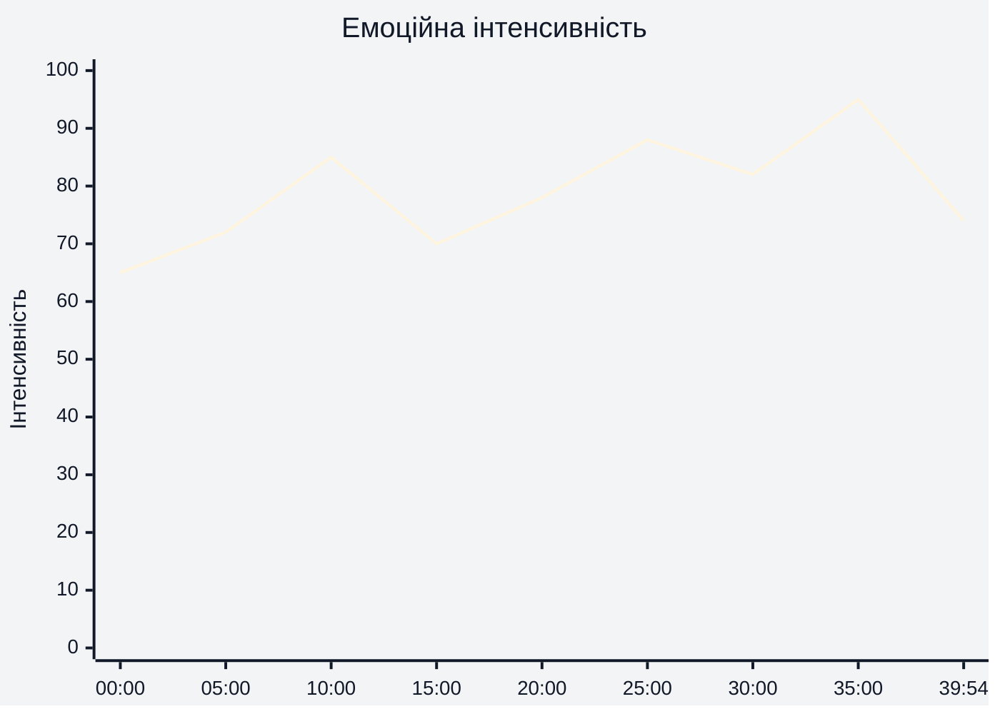
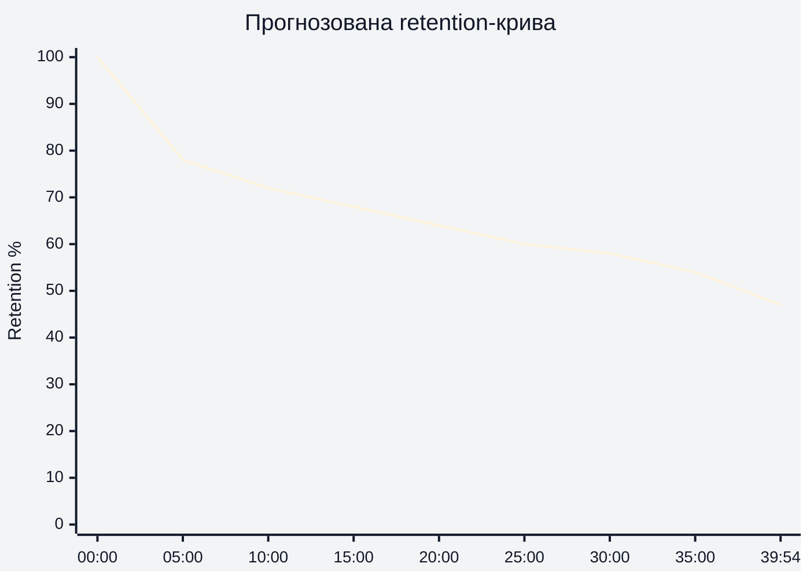
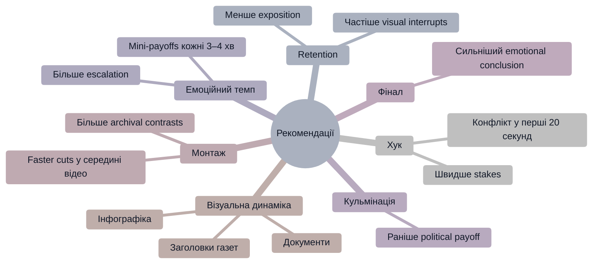

# Аналіз довгоформатного YouTube-відео

## 1. Сюжетна дуга (Narrative Arc)

```mermaid
%%{init: {'theme':'base', 'themeVariables': {
'primaryColor':'#f3f4f6',
'primaryTextColor':'#111827',
'primaryBorderColor':'#2563eb',
'lineColor':'#2563eb',
'secondaryColor':'#ffffff',
'tertiaryColor':'#f3f4f6',
'background':'#f3f4f6'
}}}%%
flowchart LR
A["00:00–00:57<br>Хук<br>Трамп як людина, що все життя «трендить»"] -->
B["00:57–03:19<br>Експозиція<br>Дитинство, батько, культ перемоги"] -->
C["03:19–07:38<br>Перша ескалація<br>Військова академія та формування характеру"] -->
D["07:38–14:20<br>Переломний момент<br>Перші великі конфлікти й DOJ lawsuit"] -->
E["14:20–23:12<br>Наростання напруги<br>Манхеттен, бренд Trump, медійність"] -->
F["23:12–32:50<br>Кульмінація<br>Trump EVERYTHING та культ персонального бренду"] -->
G["32:50–39:00<br>Розв’язка<br>Політика, боротьба за владу, поляризація"] -->
H["39:00–39:54<br>Фінальний висновок<br>Трамп як людина, одержима перемогою"]
```

## 2. Ключові Story Beats

```mermaid
%%{init: {'theme':'base', 'themeVariables': {
'primaryColor':'#f3f4f6',
'primaryTextColor':'#111827',
'primaryBorderColor':'#2563eb',
'lineColor':'#2563eb',
'secondaryColor':'#ffffff',
'tertiaryColor':'#f3f4f6',
'background':'#f3f4f6'
}}}%%
flowchart LR
A["00:12<br>Чому Трамп важливий<br>Хук / інтрига"] -->
B["01:40<br>Вплив батька<br>Формування мотивації"] -->
C["04:50<br>Військова академія<br>Побудова характеру"] -->
D["08:10<br>DOJ lawsuit<br>Перший великий конфлікт"] -->
E["11:00<br>Fight no matter what<br>Ключова риса героя"] -->
F["15:20<br>Манхеттен<br>Початок великої гри"] -->
G["19:40<br>Trump Tower<br>Матеріалізація бренду"] -->
H["24:10<br>Trump EVERYTHING<br>Ескалація его-бренду"] -->
I["29:30<br>Celebrity persona<br>Побудова публічного образу"] -->
J["34:00<br>Політика<br>Перехід у владу"] -->
K["37:10<br>Поляризація країни<br>Максимальна напруга"] -->
L["39:20<br>Фінальний висновок<br>Підсумок історії"]
```

## 3. Емоційний темп

## 4. Утримання аудиторії

Retention-дані не були надані. Нижче — прогнозована retention-структура на основі монтажу, темпу та структури відео.

## 5. Піки retention

| Таймкод | Подія | Чому це може утримувати увагу | Сила піку 1–10 |
|---|---|---|---:|
| 00:00–00:40 | Агресивний хук про популярність Трампа | Одразу створює конфлікт і масштаб теми | 9 |
| 08:00–11:00 | DOJ lawsuit і расова дискримінація | Сильний конфлікт + юридичний ризик | 10 |
| 15:00–19:00 | Вхід у Манхеттен | Візуальна зміна масштабу історії | 8 |
| 23:00–27:00 | Trump EVERYTHING | Висока візуальна щільність і абсурдність бренду | 9 |
| 34:00–37:30 | Політичний перехід | Найвищий stakes escalation | 10 |

## 6. Провали retention

| Таймкод | Проблема | Ймовірна причина спаду | Що покращити |
|---|---|---|---|
| 03:30–05:00 | Затяжний блок про академію | Менше конфлікту, більше бекграунду | Додати швидші cuts та візуальні вставки |
| 19:30–21:30 | Деталі бізнес-проєктів | Інформаційне перевантаження | Скоротити пояснення або вставити stakes |
| 28:00–30:00 | Повторення теми бренду | Повтор одного narrative point | Додати новий конфлікт або POV |
| 38:00–39:00 | Зниження темпу перед фіналом | Менше нової інформації | Підсилити emotional payoff |

## 7. Оцінка сегментів

| Сегмент | Таймкод | Функція | Емоційна інтенсивність | Ризик втрати уваги | Оцінка 1–10 | Що покращити |
|---|---|---|---|---|---:|---|
| Хук | 00:00–00:57 | Захоплення уваги | Висока | Низький | 9 | Сильний already |
| Childhood | 00:57–03:19 | Експозиція героя | Середня | Середній | 7 | Більше tension |
| Military Academy | 03:19–07:38 | Формування характеру | Середньо-висока | Середній | 7 | Скоротити exposition |
| DOJ Lawsuit | 07:38–14:20 | Конфлікт і stakes | Висока | Низький | 10 | Один із найсильніших блоків |
| Manhattan | 14:20–23:12 | Масштабування історії | Висока | Низький | 8 | Більше emotional callbacks |
| Trump EVERYTHING | 23:12–32:50 | Кульмінація бренду | Дуже висока | Низький | 9 | Сильний visual pacing |
| Politics | 32:50–39:00 | Фінальна ескалація | Максимальна | Низький | 10 | Дуже сильний climax |
| Фінал | 39:00–39:54 | Підсумок | Середня | Середній | 7 | Сильніший emotional closure |

## 8. Практичні рекомендації

## 9. Підсумкова оцінка

| Показник | Оцінка 1–10 | Коментар |
|---|---:|---|
| Сюжетна дуга | 9 | Сильна escalation від дитинства до політики |
| Story Beats | 9 | Story beats чітко підтримують narrative progression |
| Емоційний темп | 8 | Добрий pacing, але є кілька exposition dips |
| Retention Structure | 8 | Структура добре підтримує увагу навіть без retention data |
| Загальна оцінка | 9 | Відео має сильний documentary storytelling і escalation |
