# Статистичний аналіз відеозвітів

## 1. Короткий executive summary

| Пункт | Висновок |
|---|---|
| Скільки відео проаналізовано | 1 |
| Скільки форматів відео | 1: `LONG_20_PLUS` |
| Найсильніше відео за overall score | Video 1: `The REAL Story of Donald Trump` — 4.05/5 |
| Найсильніше відео за ER Public % | Video 1: 3.28% |
| Найсильніше відео за views per day | Video 1: 9797 views/day |
| Найсильніша повторювана механіка | `INSUFFICIENT_DATA`: є лише 1 відео; у цьому відео найсильніші механіки — `STRONG_TOPIC_DEMAND`, `STRONG_STORY_STRUCTURE`, `CONTROVERSY_OR_DEBATE` |
| Найчастіша слабкість | `INSUFFICIENT_DATA`: є лише 1 відео; у цьому відео ключова слабкість — `COMMENTS_SHOW_TOPIC_GAP` |
| Головна стратегічна можливість | Серійні long-form biography / “real story” deep dives з явним scope disclaimer, структурою chapters і сильнішим comment prompt |
| Рівень впевненості | LOW: статистична вибірка = 1 відео; дані звіту = `PARTIAL_DATA` |

## 2. Якість і повнота даних

| Поле | Кількість відео з даними | Кількість N/A | Коментар |
|---|---:|---:|---|
| views | 1 | 0 | Є public metric |
| likes | 1 | 0 | Є public metric |
| comments_count | 1 | 0 | Є public metric |
| views_per_day | 1 | 0 | Є derived metric |
| er_public_percent | 1 | 0 | Є derived metric |
| views_per_1k_subs | 1 | 0 | Є derived metric |
| hook_score | 1 | 0 | Є score 1–5 |
| cta_score | 1 | 0 | Є score 1–5 |
| ad_integration_score | 1 | 0 | Є score 1–5 |
| audio_score | 1 | 0 | Є score 1–5 |
| comment_resonance_score | 1 | 0 | Є score 1–5 |
| overall_video_score | 1 | 0 | Є weighted score |

### Обмеження аналізу

- `LOW_CONFIDENCE`: доступний лише один `YT_VIDEO_ANALYSIS_V1` звіт, тому порівняння між відео, outlier-аналіз і кореляції неможливі.
- `PARTIAL_DATA`: у вихідному звіті вказано, що CTR, impressions, retention, watch time, AVD, subscribers gained і traffic sources = `OWNER_ONLY`.
- `NO_TIMECODES`: транскрипт був без точних таймкодів; time-to-first-value і ad timestamps мають `LOW_CONFIDENCE`.
- `PARTIAL_DATA`: файл коментарів містив 21 408 comments проти public comments_count 29 987.

## 3. Підготовлена таблиця для графіків

| Video | Format | Views | Likes | Comments | Views/day | Like Rate % | Comment Rate % | ER Public % | Views/1k subs | Hook | CTA | Ad | Audio | Comment Resonance | Overall |
|---|---|---:|---:|---:|---:|---:|---:|---:|---:|---:|---:|---:|---:|---:|---:|
| Video 1 | LONG_20_PLUS | 5 623 626 | 154 359 | 29 987 | 9797.26 | 2.74 | 0.53 | 3.28 | 729.39 | 5 | 5 | 5 | 5 | 5 | 0 |

| Label | Full title | URL |
|---|---|---|
| Video 1 | The REAL Story of Donald Trump | https://www.youtube.com/watch?v=Cl_JpCSvTpk |

## 4. Рекомендовані графіки

| # | Назва графіка | Тип графіка | Поля | Для чого потрібен | Пріоритет |
|---:|---|---|---|---|---|
| 1 | Overall score by video | Mermaid bar chart | overall_video_score | Побачити загальну силу відео | HIGH |
| 2 | Views per day by video | Mermaid bar chart | views_per_day | Оцінити швидкість набору переглядів | HIGH |
| 3 | ER Public % by video | Mermaid bar chart | er_public_percent | Оцінити публічне залучення | HIGH |
| 4 | ER Public % vs Views/day | Таблиця / scatter spec | er_public_percent, views_per_day | Баланс охоплення і залучення | HIGH |
| 5 | Hook score by video | Mermaid bar chart | hook_score | Оцінити якість hook | HIGH |
| 6 | CTA score by video | Mermaid bar chart | cta_score | Оцінити CTA-систему | HIGH |
| 7 | Score breakdown heatmap | Markdown heatmap table | scores 1–5 | Побачити сильні/слабкі сторони | HIGH |
| 8 | Sentiment distribution | Mermaid pie + таблиця | comment sentiment % | Побачити реакцію аудиторії | HIGH |
| 9 | CTA features heatmap | Markdown matrix | CTA boolean fields | Побачити, які CTA використано | HIGH |
| 10 | Ad load % by video | Mermaid bar chart | ad_load_percent | Оцінити рекламне навантаження | MEDIUM |

## 5. Графіки продуктивності

## 5.1. Views by video

- Назва графіка: Views by video
- Яке питання він відповідає: яке відео має найбільший raw reach.
- Які поля використовуються: `video_label`, `views`.
- Тип графіка: Mermaid bar chart.
- Що видно з графіка: є лише одне відео з 5 623 626 views.
- Практичний висновок: raw reach високий як абсолютне число, але без когорти не можна назвати відео outlier за правилом `views >= 3 × median_views`.

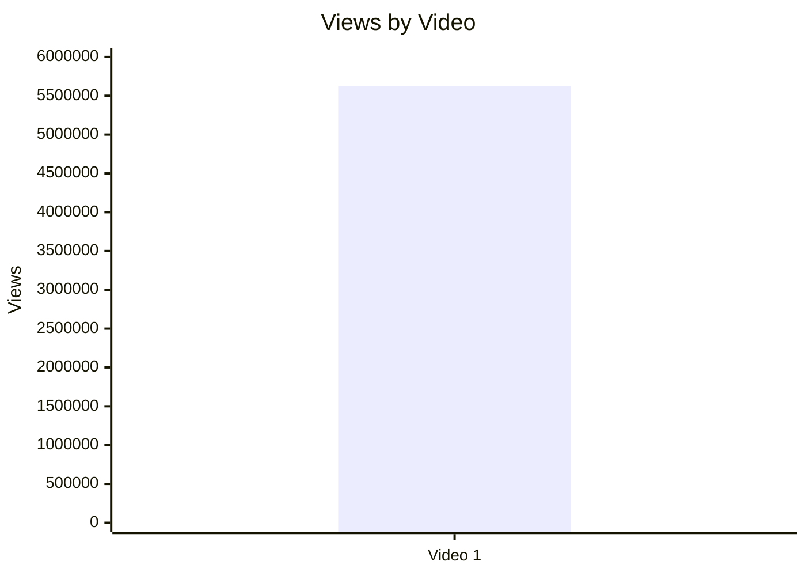
```mermaid
xychart-beta
    title "Views by Video"
    x-axis ["Video 1"]
    y-axis "Views" 0 --> 6000000
    bar [5623626]
```

## 5.2. Views per day by video

- Назва графіка: Views per day by video
- Яке питання він відповідає: яка нормалізована швидкість переглядів із урахуванням віку відео.
- Які поля використовуються: `video_label`, `views_per_day`.
- Тип графіка: Mermaid bar chart.
- Що видно з графіка: Video 1 має приблизно 9797 views/day.
- Практичний висновок: це головніша performance-метрика за raw views, але без інших відео немає порівняльного benchmark.

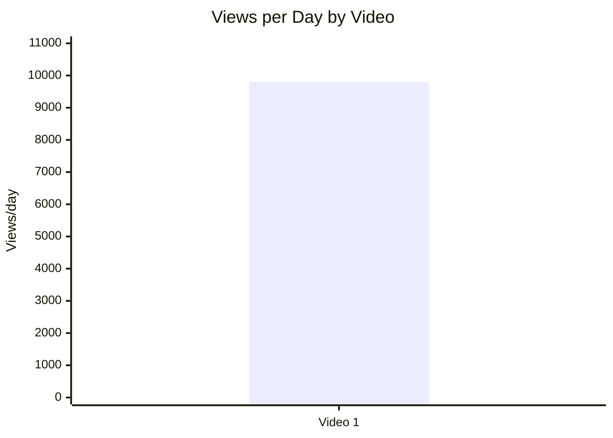
```mermaid
xychart-beta
    title "Views per Day by Video"
    x-axis ["Video 1"]
    y-axis "Views/day" 0 --> 11000
    bar [9797.26]
```

## 5.3. Views per 1k subscribers

- Назва графіка: Views per 1k subscribers
- Яке питання він відповідає: як відео конвертує розмір каналу в перегляди.
- Які поля використовуються: `video_label`, `views_per_1k_subs`.
- Тип графіка: Mermaid bar chart.
- Що видно з графіка: 729.39 views per 1k subs.
- Практичний висновок: показник можна використовувати для майбутнього порівняння з іншими long-form відео цього каналу або ніші.

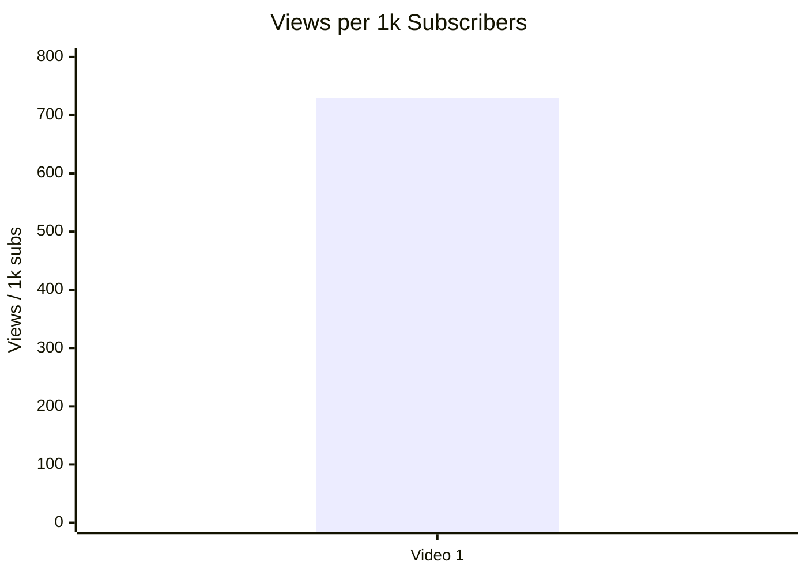
```mermaid
xychart-beta
    title "Views per 1k Subscribers"
    x-axis ["Video 1"]
    y-axis "Views / 1k subs" 0 --> 800
    bar [729.39]
```

## 5.4. Performance quadrant

- Назва графіка: Performance quadrant
- Яке питання він відповідає: чи відео одночасно має охоплення і залучення.
- Які поля використовуються: `views_per_day`, `er_public_percent`.
- Тип графіка: scatter plot spec.
- Що видно з графіка: `INSUFFICIENT_DATA` для квадрантів, бо немає медіан/порогів із когорти.
- Практичний висновок: точку можна додати до майбутньої когорти `LONG_20_PLUS`.

| Video | views_per_day | er_public_percent | Quadrant status |
|---|---:|---:|---|
| Video 1 | 9797.26 | 3.2781 | `INSUFFICIENT_DATA`: немає порогів high/low для когорти |

## 6. Графіки залучення

## 6.1. ER Public % by video

- Назва графіка: ER Public % by video
- Яке питання він відповідає: яке відео має найвище публічне залучення.
- Які поля використовуються: `video_label`, `er_public_percent`.
- Тип графіка: Mermaid bar chart.
- Що видно з графіка: ER Public = 3.28%.
- Практичний висновок: метрика поєднує likes + comments / views; без benchmark не називається “доброю” або “поганою”.

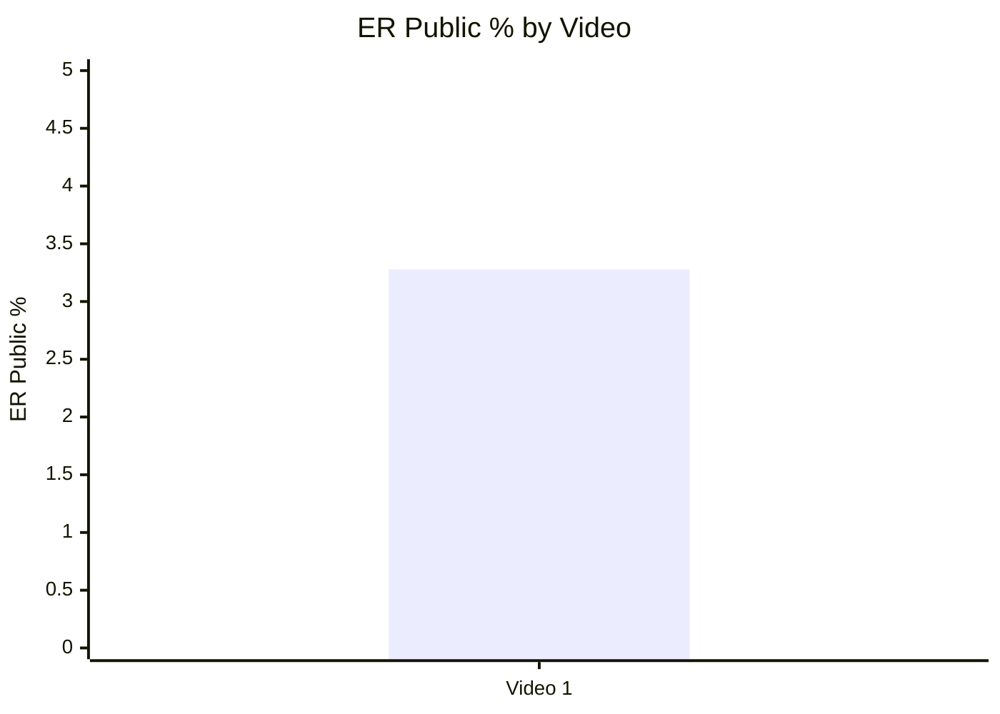
```mermaid
xychart-beta
    title "ER Public % by Video"
    x-axis ["Video 1"]
    y-axis "ER Public %" 0 --> 5
    bar [3.2781]
```

## 6.2. Like Rate % vs Comment Rate %

- Назва графіка: Like Rate % vs Comment Rate %
- Яке питання він відповідає: чи залучення більше “лайкове” чи дискусійне.
- Які поля використовуються: `like_rate_percent`, `comment_rate_percent`.
- Тип графіка: scatter plot spec.
- Що видно з графіка: like_rate = 2.74%, comment_rate = 0.53%.
- Практичний висновок: для майбутньої когорти ця точка покаже, чи політична тема дає непропорційно високий comment rate.

| Video | Like Rate % | Comment Rate % | Interpretation |
|---|---:|---:|---|
| Video 1 | 2.7448 | 0.5332 | Є дані для точки scatter; порівняльний quadrant = `INSUFFICIENT_DATA` |

## 6.3. Comments per 1k views

- Назва графіка: Comments per 1k views
- Яке питання він відповідає: наскільки відео провокує коментарі відносно переглядів.
- Які поля використовуються: `video_label`, `comments_per_1k_views`.
- Тип графіка: Mermaid bar chart.
- Що видно з графіка: 5.33 comments / 1k views.
- Практичний висновок: це корисна базова точка для порівняння future controversial documentary videos.

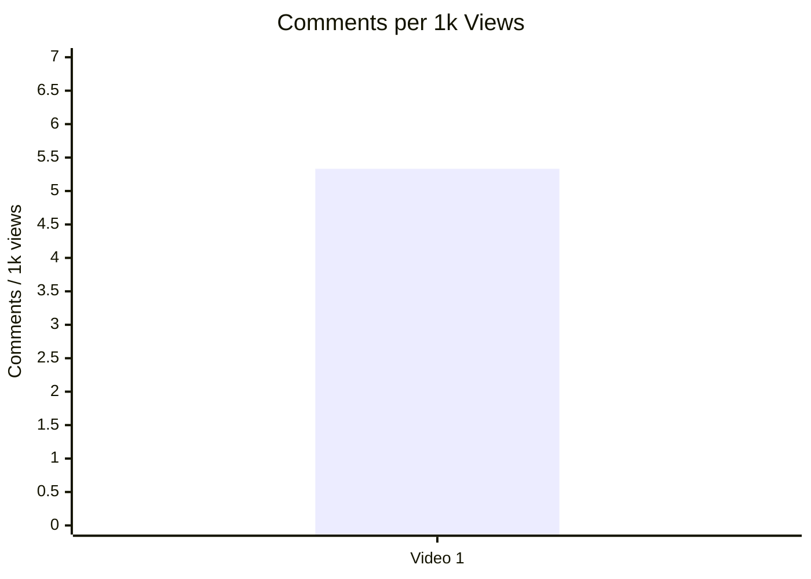
```mermaid
xychart-beta
    title "Comments per 1k Views"
    x-axis ["Video 1"]
    y-axis "Comments / 1k views" 0 --> 7
    bar [5.3323]
```

## 7. Графіки структури та hook

## 7.1. Hook score by video

- Назва графіка: Hook score by video
- Яке питання він відповідає: наскільки сильний hook у відео.
- Які поля використовуються: `video_label`, `hook_score`.
- Тип графіка: Mermaid bar chart.
- Що видно з графіка: hook_score = 4/5.
- Практичний висновок: hook достатньо сильний для повторення як “unknown question about known figure”.

```mermaid
xychart-beta
    title "Hook Score by Video"
    x-axis ["Video 1"]
    y-axis "Hook score" 0 --> 5
    bar [4]
```

## 7.2. Hook type distribution

- Назва графіка: Hook type distribution
- Яке питання він відповідає: які hook types використовуються в наборі відео.
- Які поля використовуються: `hook_primary_type`.
- Тип графіка: Mermaid pie chart.
- Що видно з графіка: у єдиному відео hook type = `CURIOSITY_GAP`.
- Практичний висновок: неможливо сказати, що цей hook type “працює краще”, але його варто тестувати далі в long-form documentary.

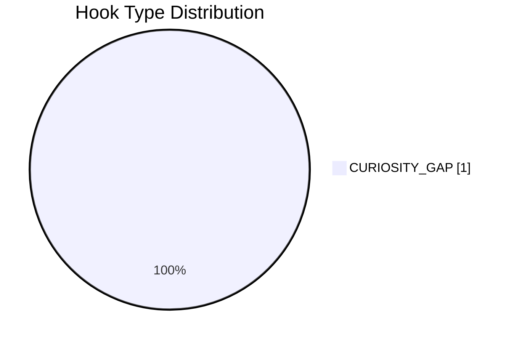
```mermaid
pie showData
    title Hook Type Distribution
    "CURIOSITY_GAP" : 1
```

## 7.3. Time to first value vs Overall Score

- Назва графіка: Time to first value vs Overall Score
- Яке питання він відповідає: чи швидша перша цінність пов’язана з overall score.
- Які поля використовуються: `time_to_first_value_seconds`, `overall_video_score`.
- Тип графіка: scatter plot spec.
- Що видно з графіка: time_to_first_value ≈ 12 sec, але exact timestamp = `NO_TIMECODES`.
- Практичний висновок: як одиночна точка це не патерн; у майбутній когорті треба порівнювати ролики з точними таймкодами.

| Video | time_to_first_value | time_to_first_value_seconds | overall_video_score | Status |
|---|---|---:|---:|---|
| Video 1 | ~00:12 / NO_TIMECODES exact | 12 | 4.05 | `LOW_CONFIDENCE` через `NO_TIMECODES` |

## 8. Графіки CTA

## 8.1. CTA score by video

- Назва графіка: CTA score by video
- Яке питання він відповідає: наскільки якісна CTA-система.
- Які поля використовуються: `video_label`, `cta_score`.
- Тип графіка: Mermaid bar chart.
- Що видно з графіка: cta_score = 3/5.
- Практичний висновок: CTA є, але слабке місце — немає comment/like/subscribe/bell CTA.

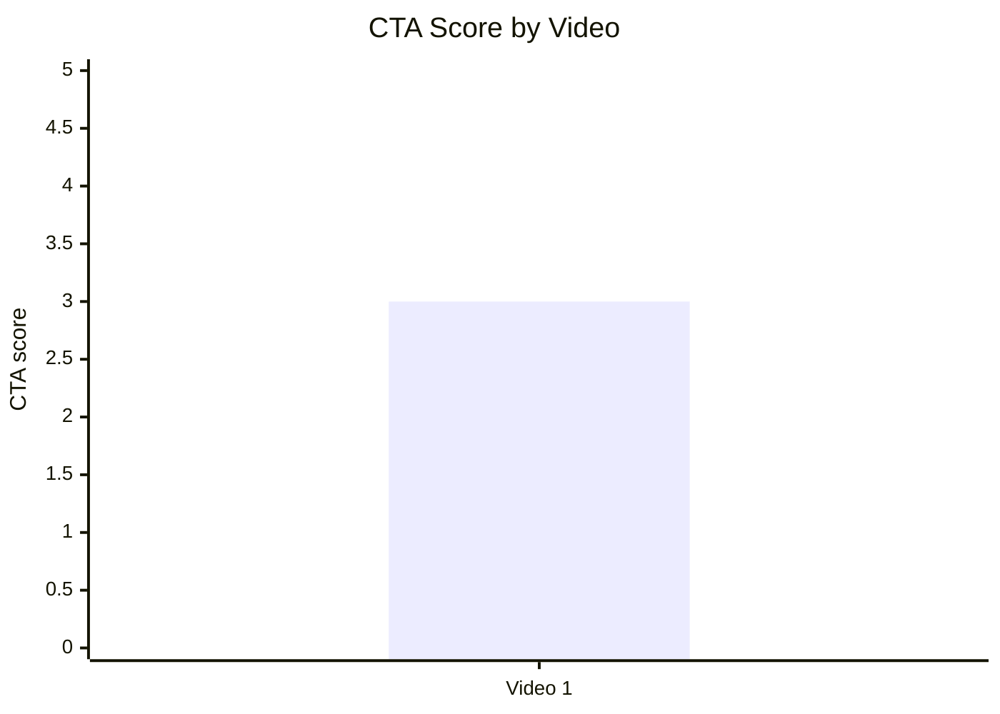
```mermaid
xychart-beta
    title "CTA Score by Video"
    x-axis ["Video 1"]
    y-axis "CTA score" 0 --> 5
    bar [3]
```

## 8.2. CTA count vs ER Public %

- Назва графіка: CTA count vs ER Public %
- Яке питання він відповідає: чи кількість CTA пов’язана з публічним залученням.
- Які поля використовуються: `cta_count`, `er_public_percent`.
- Тип графіка: scatter plot spec.
- Що видно з графіка: cta_count = 8, ER Public = 3.28%.
- Практичний висновок: немає підстав робити висновок про зв’язок; потрібні щонайменше 5 відео.

| Video | cta_count | ER Public % | CTA overload risk |
|---|---:|---:|---|
| Video 1 | 8 | 3.2781 | `PARTIAL_DATA`: description links багато, але in-video comment/like/subscribe CTA немає |

## 8.3. CTA features heatmap

- Назва графіка: CTA features heatmap
- Яке питання він відповідає: які CTA-функції використані.
- Які поля використовуються: `has_comment_prompt`, `has_subscribe_cta`, `has_like_cta`, `has_bell_cta`, `has_next_video_bridge`.
- Тип графіка: matrix / heatmap table.
- Що видно з графіка: є next video bridge, але немає comment/subscribe/like/bell CTA.
- Практичний висновок: головний тест — додати конкретний comment prompt і end screen/card bridge.

| Video | Comment prompt | Subscribe | Like | Bell | Next video bridge |
|---|---|---|---|---|---|
| Video 1 | ❌ | ❌ | ❌ | ❌ | ✅ |

## 9. Графіки реклами / інтеграцій

Рекламні графіки не пропущені, бо у звіті є in-video sponsor read + description/pinned ads.

## 9.1. Ad load % by video

- Назва графіка: Ad load % by video
- Яке питання він відповідає: яка частка відео припадає на рекламу.
- Які поля використовуються: `video_label`, `ad_load_percent`.
- Тип графіка: Mermaid bar chart.
- Що видно з графіка: ad_load ≈ 4.59%, але timestamp/duration = `LOW_CONFIDENCE`.
- Практичний висновок: відносний ad load невеликий для 39:54, але 110 sec sponsor read може відчуватись довгим як окремий блок.

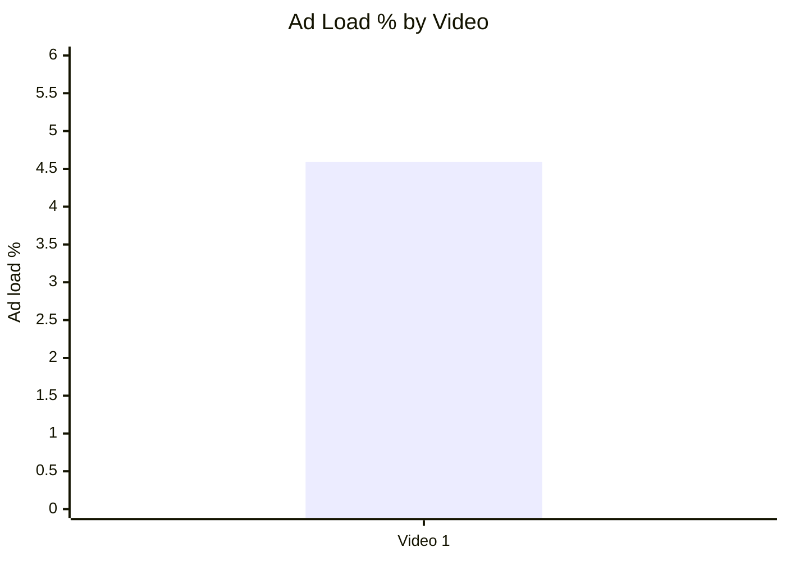
```mermaid
xychart-beta
    title "Ad Load % by Video"
    x-axis ["Video 1"]
    y-axis "Ad load %" 0 --> 6
    bar [4.59]
```

## 9.2. First ad position %

- Назва графіка: First ad position %
- Яке питання він відповідає: наскільки рано з’являється перша реклама.
- Які поля використовуються: `first_ad_relative_position_percent`.
- Тип графіка: Mermaid bar chart.
- Що видно з графіка: перша in-video реклама ≈ 32.58% відео.
- Практичний висновок: реклама стоїть після першої цінності, але до великого midpoint/payoff; можна тестувати пізніше розміщення.

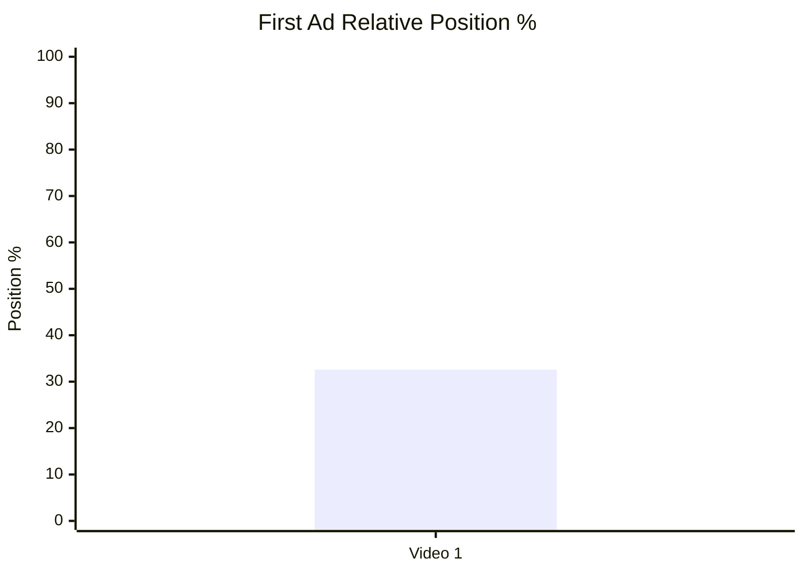
```mermaid
xychart-beta
    title "First Ad Relative Position %"
    x-axis ["Video 1"]
    y-axis "Position %" 0 --> 100
    bar [32.58]
```

## 9.3. Ad integration score vs ER Public %

- Назва графіка: Ad integration score vs ER Public %
- Яке питання він відповідає: чи якість інтеграції пов’язана з реакцією аудиторії.
- Які поля використовуються: `ad_integration_score`, `er_public_percent`.
- Тип графіка: scatter plot spec.
- Що видно з графіка: ad_integration_score = 3, ER Public = 3.28%.
- Практичний висновок: `INSUFFICIENT_DATA` для зв’язку; у цьому відео ad reactions були помітним comment cluster.

| Video | ad_integration_score | ER Public % | ad_load_percent |
|---|---:|---:|---:|
| Video 1 | 3 | 3.2781 | 4.59 |

## 10. Графіки аудіо

## 10.1. Audio score by video

- Назва графіка: Audio score by video
- Яке питання він відповідає: наскільки сильна аудіо-складова.
- Які поля використовуються: `video_label`, `audio_score`.
- Тип графіка: Mermaid bar chart.
- Що видно з графіка: audio_score = 4/5.
- Практичний висновок: аудіо не є слабким місцем у цьому звіті.

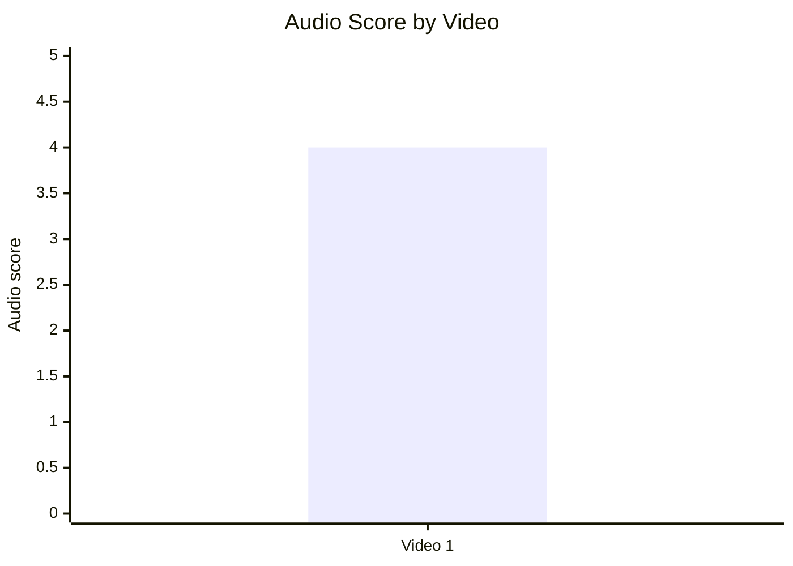
```mermaid
xychart-beta
    title "Audio Score by Video"
    x-axis ["Video 1"]
    y-axis "Audio score" 0 --> 5
    bar [4]
```

## 10.2. Audio score vs Overall Score

- Назва графіка: Audio score vs Overall Score
- Яке питання він відповідає: чи кращий audio score пов’язаний із загальним балом.
- Які поля використовуються: `audio_score`, `overall_video_score`.
- Тип графіка: scatter plot spec.
- Що видно з графіка: audio_score = 4, overall_video_score = 4.05.
- Практичний висновок: `INSUFFICIENT_DATA`; зв’язок можна перевіряти тільки на 5+ відео.

| Video | audio_score | overall_video_score | Status |
|---|---:|---:|---|
| Video 1 | 4 | 4.05 | Single point only |

## 11. Графіки коментарів

## 11.1. Sentiment distribution

- Назва графіка: Sentiment distribution
- Яке питання він відповідає: яка структура реакції аудиторії в коментарях.
- Які поля використовуються: `positive_percent`, `negative_percent`, `mixed_percent`, `neutral_percent`, `question_percent`, `request_percent`, додатково `joke_meme_percent`, `spam_irrelevant_percent`.
- Тип графіка: Mermaid pie chart + table.
- Що видно з графіка: найбільші категорії серед релевантних — neutral 40.95%, negative 32.12%, question 9.47%, request 4.56%.
- Практичний висновок: коментарі сильні як сигнал debate/resonance, але є високий ризик bias/confusion framing.

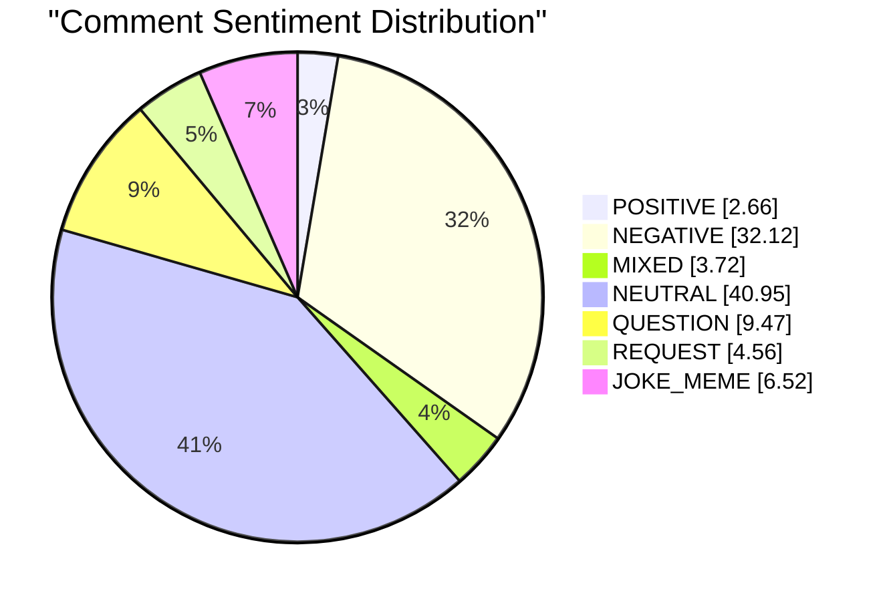
```mermaid
pie showData
    title "Comment Sentiment Distribution"
    "POSITIVE" : 2.66
    "NEGATIVE" : 32.12
    "MIXED" : 3.72
    "NEUTRAL" : 40.95
    "QUESTION" : 9.47
    "REQUEST" : 4.56
    "JOKE_MEME" : 6.52
```

| Sentiment | Count | Percent |
|---|---:|---:|
| POSITIVE | 476 | 2.66% |
| NEGATIVE | 5752 | 32.12% |
| MIXED | 667 | 3.72% |
| NEUTRAL | 7333 | 40.95% |
| QUESTION | 1696 | 9.47% |
| REQUEST | 817 | 4.56% |
| JOKE_MEME | 1168 | 6.52% |
| SPAM_IRRELEVANT | 3499 | 19.54% |

## 11.2. Comment resonance score by video

- Назва графіка: Comment resonance score by video
- Яке питання він відповідає: наскільки сильна реакція коментарів.
- Які поля використовуються: `video_label`, `comment_resonance_score`.
- Тип графіка: Mermaid bar chart.
- Що видно з графіка: comment_resonance_score = 5/5.
- Практичний висновок: коментарі — одна з найсильніших зон відео, але якість дискусії потребує кращого спрямування.

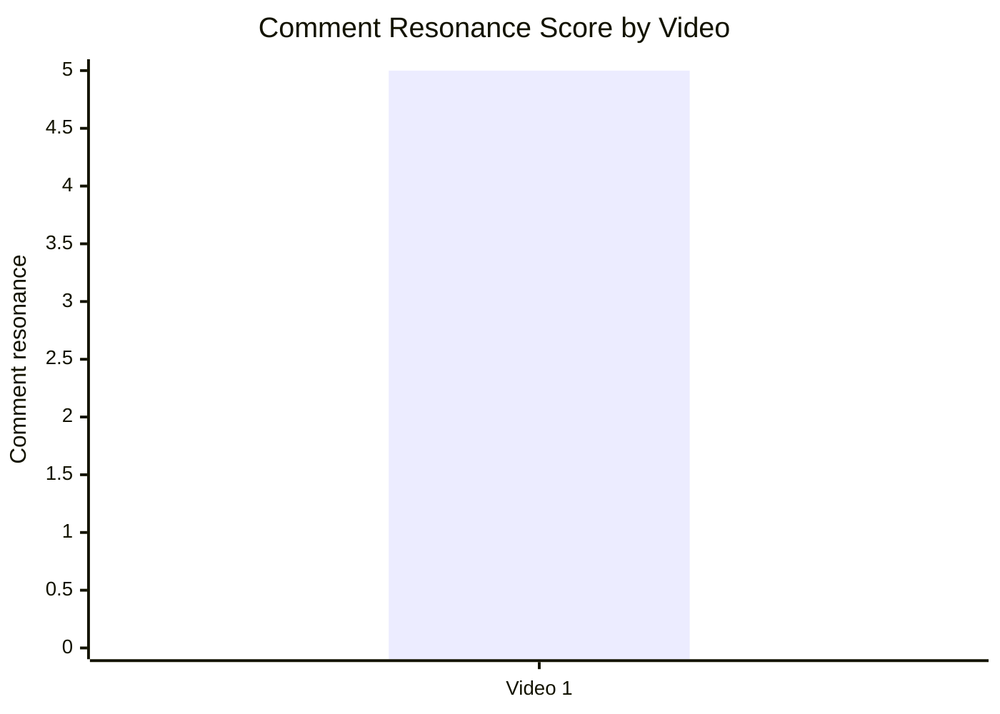
```mermaid
xychart-beta
    title "Comment Resonance Score by Video"
    x-axis ["Video 1"]
    y-axis "Comment resonance" 0 --> 5
    bar [5]
```

## 11.3. Top comment clusters

- Назва графіка: Top comment clusters
- Яке питання він відповідає: що найчастіше хвалять, критикують або просять.
- Які поля використовуються: `cluster name`, `count`, `% of relevant comments`.
- Тип графіка: table + Mermaid bar chart.
- Що видно з графіка: найбільший cluster — bias/accuracy criticism; другий — requests/comparisons.
- Практичний висновок: треба явно керувати scope, джерелами і серійністю, інакше контроверсійна тема генерує хаотичну дискусію.

| Cluster | Topic label | Sentiment | Count | % of relevant comments |
|---|---|---|---:|---:|
| Bias / accuracy criticism | CRITICISM_ACCURACY | NEGATIVE | 3229 | 18.03% |
| Requests: Kamala/Biden/Obama | REQUEST_TOPIC | REQUEST | 2323 | 12.97% |
| Sponsor / ad reactions | SPONSOR_REACTION | MIXED | 2159 | 12.06% |
| Questions / clarifications | QUESTION_CLARIFICATION | QUESTION | 1696 | 9.47% |
| Jokes / memes | COMMUNITY_DISCUSSION | JOKE_MEME | 1168 | 6.52% |
| Pro-Trump pushback | DISAGREEMENT | NEGATIVE | 721 | 4.03% |

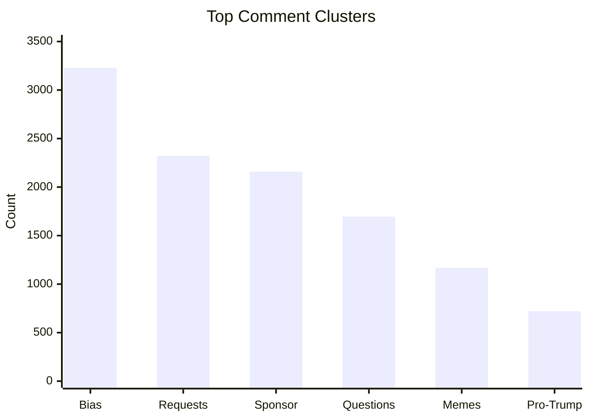
```mermaid
xychart-beta
    title "Top Comment Clusters"
    x-axis ["Bias", "Requests", "Sponsor", "Questions", "Memes", "Pro-Trump"]
    y-axis "Count" 0 --> 3500
    bar [3229, 2323, 2159, 1696, 1168, 721]
```

## 12. Графіки score-системи

## 12.1. Overall score by video

- Назва графіка: Overall score by video
- Яке питання він відповідає: яке відео має найвищий загальний бал.
- Які поля використовуються: `video_label`, `overall_video_score`.
- Тип графіка: Mermaid bar chart.
- Що видно з графіка: overall_video_score = 4.05/5.
- Практичний висновок: відео сильне за внутрішньою score-системою, але це не ranking, бо немає інших відео.

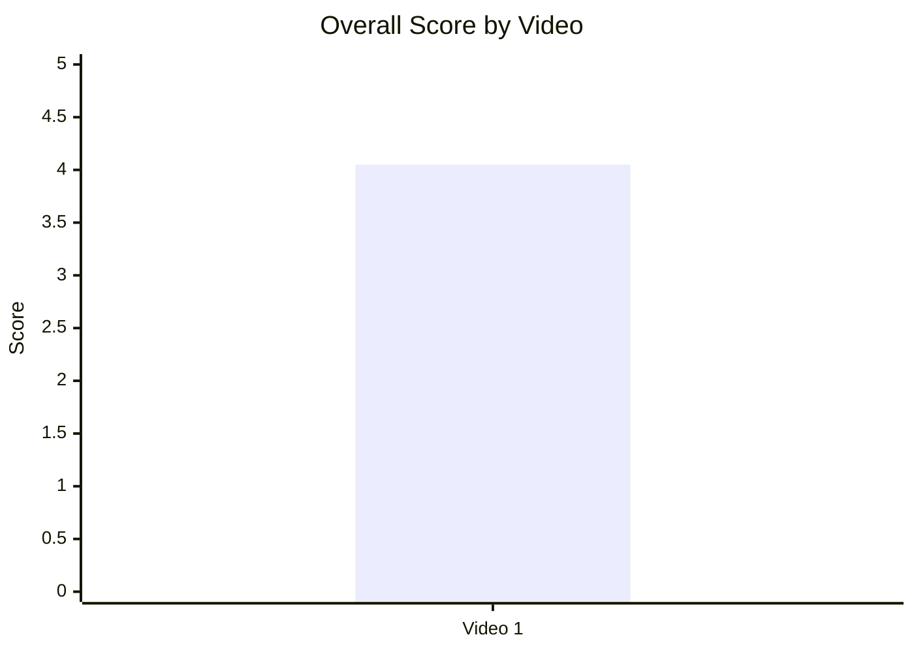
```mermaid
xychart-beta
    title "Overall Score by Video"
    x-axis ["Video 1"]
    y-axis "Score" 0 --> 5
    bar [4.05]
```

## 12.2. Score breakdown heatmap

- Назва графіка: Score breakdown heatmap
- Яке питання він відповідає: які компоненти сильні або слабкі.
- Які поля використовуються: `hook_score`, `structure_score`, `value_density_score`, `audio_score`, `cta_score`, `ad_integration_score`, `comment_resonance_score`, `replicability_score`, `overall_video_score`.
- Тип графіка: heatmap table.
- Що видно з графіка: найсильніші — Structure і Comments; слабші — CTA і Ad.
- Практичний висновок: стратегічно треба не перебудовувати формат, а оптимізувати CTA/ad/pinned comment layer.

| Video | Hook | Structure | Value Density | Audio | CTA | Ad | Comments | Replicability | Overall |
|---|---:|---:|---:|---:|---:|---:|---:|---:|---:|
| Video 1 | 4 | 5 | 4 | 4 | 3 | 3 | 5 | 4 | 4.05 |

## 12.3. Strengths vs weaknesses count

- Назва графіка: Strengths vs weaknesses count
- Яке питання він відповідає: скільки успішних механік і missed opportunities зафіксовано.
- Які поля використовуються: count of success mechanics, count of missed opportunities.
- Тип графіка: Mermaid bar chart.
- Що видно з графіка: 5 success mechanics і 5 missed opportunities.
- Практичний висновок: відео має сильну базову механіку, але багато optimization opportunities пов’язані не з темою, а з framing/CTA/ad execution.

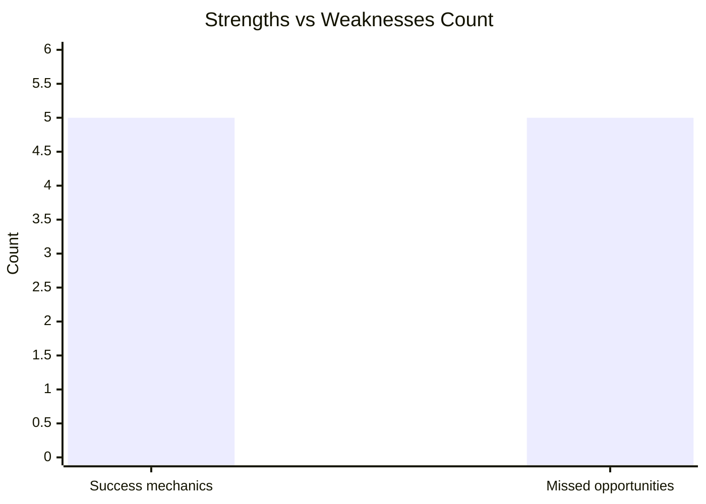
```mermaid
xychart-beta
    title "Strengths vs Weaknesses Count"
    x-axis ["Success mechanics", "Missed opportunities"]
    y-axis "Count" 0 --> 6
    bar [5, 5]
```

## 13. Кореляції та патерни

Correlation analysis skipped: fewer than 5 comparable videos.

| Pair | Correlation / Pattern | Strength | Interpretation | Confidence |
|---|---:|---|---|---|
| hook_score → overall_video_score | `INSUFFICIENT_DATA` | N/A | Є лише 1 відео; не можна рахувати correlation | LOW |
| value_density_score → er_public_percent | `INSUFFICIENT_DATA` | N/A | Є лише 1 відео; не можна рахувати correlation | LOW |
| cta_score → comment_rate_percent | `INSUFFICIENT_DATA` | N/A | Є лише 1 відео; не можна рахувати correlation | LOW |
| comment_resonance_score → er_public_percent | `INSUFFICIENT_DATA` | N/A | Є лише 1 відео; не можна рахувати correlation | LOW |
| views_per_day → er_public_percent | `INSUFFICIENT_DATA` | N/A | Є лише 1 відео; не можна рахувати correlation | LOW |
| ad_load_percent → er_public_percent | `INSUFFICIENT_DATA` | N/A | Є лише 1 відео; не можна рахувати correlation | LOW |
| time_to_first_value_seconds → overall_video_score | `INSUFFICIENT_DATA` | N/A | Є лише 1 відео; exact timestamp також `LOW_CONFIDENCE` | LOW |

## 14. Висновки для контент-стратегії

| Спостереження | Дані / графік | Що це означає | Що робити |
|---|---|---|---|
| Chapter-based long-form structure — сильна зона | Structure score = 5/5; success mechanic `STRONG_STORY_STRUCTURE` | Формат 40-хв deep dive може триматися, якщо є ясні chapters | Повторювати структуру “life stages → beliefs → consequences” |
| Hook працює як curiosity gap | Hook type = `CURIOSITY_GAP`; hook score = 4/5 | Відомий герой + “я не знав справжню історію” створює вхід у тему | Тестувати аналогічні hooks для інших відомих фігур/ринків |
| CTA layer слабший за контент | CTA score = 3/5; no comment/like/subscribe/bell CTA | Коментарів багато органічно, але дискусія не спрямована | Додати конкретний comment prompt і pinned FAQ/sources |
| Реклама помітна, але не домінує за load % | ad_load ≈ 4.59%; ad score = 3/5; sponsor cluster = 2 159 comments | Вплив на retention не доведений, але disruption risk існує | Скоротити sponsor read до 45–60 sec або зробити native tie-in |
| Коментарі показують серійний попит | Requests/comparisons cluster = 2 323 | Аудиторія просить симетричні biography videos | Робити playlist / series bridge / end screen на наступне відео |
| Ризик довіри — найбільший стратегічний ризик | Bias/accuracy criticism = 3 229 comments | Контроверсійні теми вимагають scope і source transparency | На старті заявляти scope; у pinned comment додавати FAQ і джерела |

## 15. Що тестувати далі

| Тест | Гіпотеза | На яких даних базується | Як виміряти | Пріоритет |
|---|---|---|---|---|
| Explicit scope disclaimer у перші 60 sec | Менше confusion і bias criticism | `COMMENTS_SHOW_TOPIC_GAP`, 3 229 bias/accuracy comments, 1 696 questions | Частка comments із topic-gap/bias clusters; retention first 60 sec = `OWNER_ONLY` | HIGH |
| Серійний місток + end screen/card | Більше переходів у наступні biography videos | `has_next_video_bridge = true`, але end screen/card data = N/A | End screen CTR, session starts, next-video traffic = `OWNER_ONLY` | HIGH |
| Comment prompt після payoff | Більше якісних коментарів і менше хаотичного flame | `NO_COMMENT_PROMPT`, comment resonance score = 5 | Comment rate, share of constructive comments, pinned question replies | HIGH |
| Sponsor read 45–60 sec | Нижчий disruption risk без втрати sponsor clarity | ad duration ≈ 110 sec, ad score = 3, sponsor cluster = 2 159 | Retention around ad segment, sponsor clicks = `OWNER_ONLY` | MEDIUM |
| Pinned comment не тільки sponsor | Вища довіра й краща навігація дискусії | pinned comment зараз sponsor-focused; requests/questions high | Reply quality, FAQ-related questions decline, source-link clicks = `OWNER_ONLY` | MEDIUM |
| Повторити `CURIOSITY_GAP` hook на 5+ long-form відео | Перевірити, чи hook type пов’язаний з higher ER/overall | hook score = 4; single video only | Порівняти hook_score, views_per_day, ER на 5+ відео | HIGH |
| Native ad tie-in до теми | Реклама буде менш відчутною як переривання | ad native fit = слабкий у вихідному аналізі | Ad segment retention, negative sponsor comments | MEDIUM |

## 16. Дані для експорту в таблицю / CSV

| video_label | title | format_group | views | views_per_day | like_rate_percent | comment_rate_percent | er_public_percent | views_per_1k_subs | hook_type | hook_score | cta_count | cta_score | ad_load_percent | ad_integration_score | audio_score | comment_resonance_score | overall_video_score | top_success_mechanic | top_missed_opportunity |
|---|---|---|---:|---:|---:|---:|---:|---:|---|---:|---:|---:|---:|---:|---:|---:|---:|---|---|
| Video 1 | The REAL Story of Donald Trump | LONG_20_PLUS | 5623626 | 9797.26 | 2.7448 | 0.5332 | 3.2781 | 729.3938 | CURIOSITY_GAP | 4 | 8 | 3 | 4.59 | 3 | 4 | 5 | 4.05 | STRONG_TOPIC_DEMAND | COMMENTS_SHOW_TOPIC_GAP |