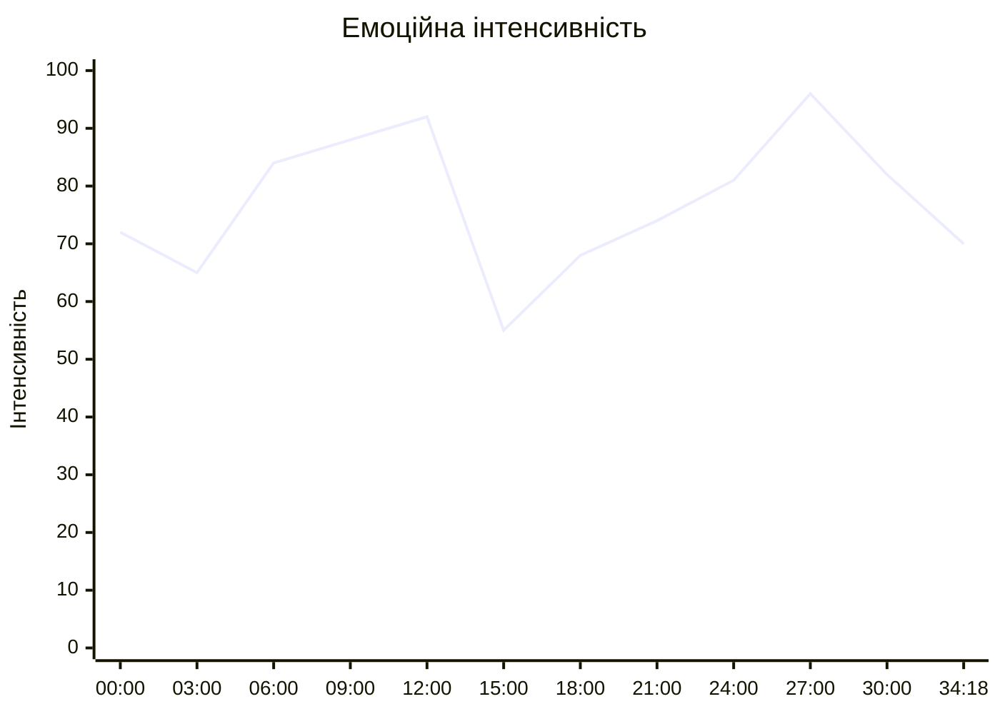
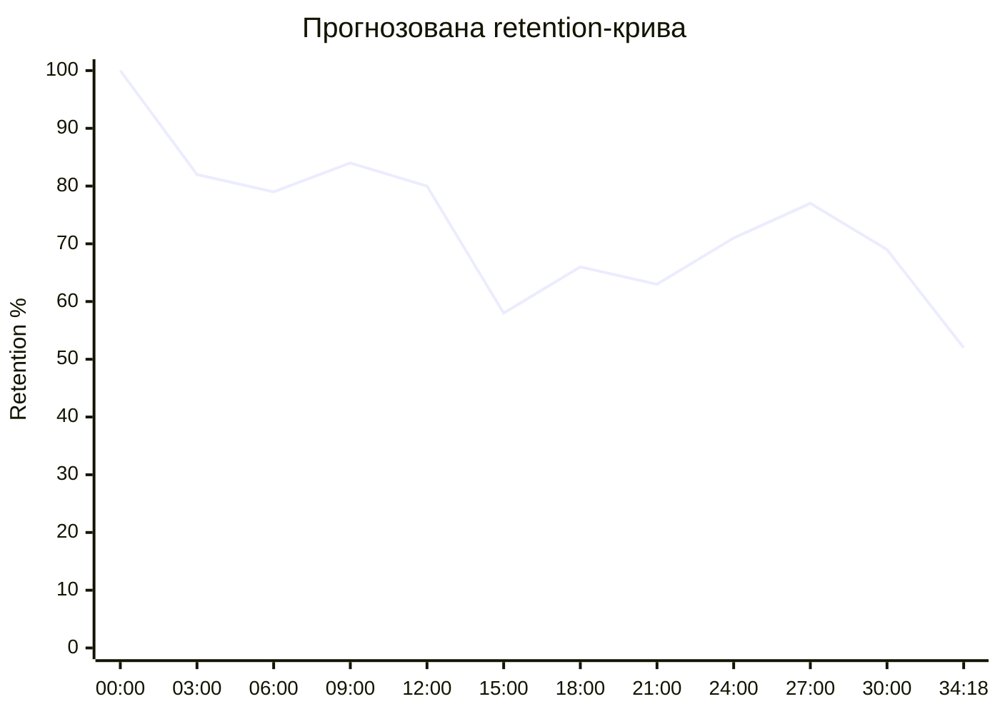
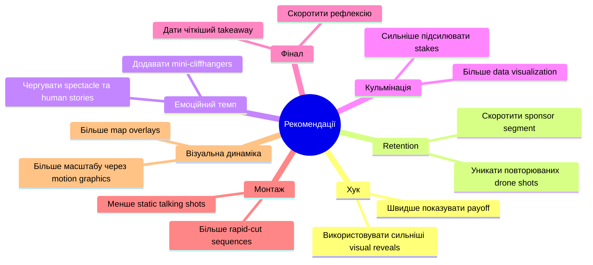

```mermaid
flowchart LR
A["00:00–01:20<br>Хук<br>Питання: навіщо будувати футуристичне місто в пустелі"] --> 
B["01:20–04:00<br>Експозиція<br>Подорож у NEOM і знайомство з бедуїнською культурою"] --> 
C["04:00–08:30<br>Перша ескалація<br>Показ масштабів будівництва та тисяч вантажівок"] --> 
D["08:30–15:30<br>Переломний момент<br>Демонстрація концептів The Line, Oxagon, Trojena"] --> 
E["15:30–23:00<br>Наростання напруги<br>Контраст між бедуїнським життям і мегапроєктом"] --> 
F["23:00–30:00<br>Кульмінація<br>Роздуми про майбутнє Саудівської Аравії після нафти"] --> 
G["30:00–33:00<br>Розв’язка<br>Повернення до теми людського виміру змін"] --> 
H["33:00–34:18<br>Фінальний висновок<br>NEOM як символ конфлікту між минулим і майбутнім"]
```

```mermaid
flowchart LR
A["00:15<br>Вступне питання<br>Створення інтриги"] -->
B["01:40<br>Перші кадри NEOM<br>Візуальний shock factor"] -->
C["03:30<br>Ночівля в пустелі<br>Людський контекст"] -->
D["06:20<br>Будівництво Oxagon<br>Показ масштабу"] -->
E["09:10<br>Розповідь про переселення людей<br>Конфлікт"] -->
F["11:30<br>3D-концепти міст<br>Футуристичний payoff"] -->
G["14:40<br>Реклама Rocket Money<br>Монетизаційна пауза"] -->
H["17:20<br>Бедуїнська сім’я<br>Емоційне уповільнення"] -->
I["22:40<br>Контраст традицій і мегапроєкту<br>Головна тема"] -->
J["27:10<br>The Line у деталях<br>Кульмінаційний масштаб"] -->
K["31:20<br>Філософський висновок<br>Рефлексія"] -->
L["33:45<br>Фінальний кадр пустелі<br>Емоційне завершення"]
```

# Аналіз довгоформатного YouTube-відео

## 1. Сюжетна дуга (Narrative Arc)

%%{init: {'theme':'base', 'themeVariables': {
'primaryColor':'#f3f4f6',
'primaryTextColor':'#111827',
'primaryBorderColor':'#2563eb',
'lineColor':'#2563eb',
'secondaryColor':'#ffffff',
'tertiaryColor':'#f3f4f6',
'background':'#f3f4f6'
}}}%%

---

## 2. Ключові Story Beats

%%{init: {'theme':'base', 'themeVariables': {
'primaryColor':'#f3f4f6',
'primaryTextColor':'#111827',
'primaryBorderColor':'#2563eb',
'lineColor':'#2563eb',
'secondaryColor':'#ffffff',
'tertiaryColor':'#f3f4f6',
'background':'#f3f4f6'
}}}%%

---

## 3. Емоційний темп

%%{init: {'theme':'base', 'themeVariables': {
'primaryColor':'#f3f4f6',
'primaryTextColor':'#111827',
'primaryBorderColor':'#2563eb',
'lineColor':'#2563eb',
'secondaryColor':'#ffffff',
'tertiaryColor':'#f3f4f6',
'background':'#f3f4f6'
}}}%%

### Пояснення
- Найвищий емоційний пік: 27:00 — масштаб The Line.
- Найнижчий темп: 15:00–16:00 — рекламна інтеграція.
- Відео використовує хвилеподібний pacing із чергуванням spectacle та тихих бедуїнських сцен.

---

## 4. Утримання аудиторії

Retention-дані не надані. Нижче — прогнозована retention-структура на основі монтажу, pacing та story transitions.

%%{init: {'theme':'base', 'themeVariables': {
'primaryColor':'#f3f4f6',
'primaryTextColor':'#111827',
'primaryBorderColor':'#2563eb',
'lineColor':'#2563eb',
'secondaryColor':'#ffffff',
'tertiaryColor':'#f3f4f6',
'background':'#f3f4f6'
}}}%%

---

## 5. Піки retention

| Таймкод | Подія | Чому це може утримувати увагу | Сила піку 1–10 |
|---|---|---|---:|
| 00:00–01:20 | Вступне питання про місто в пустелі | Сильний curiosity gap | 9 |
| 05:50 | Перші великі кадри будівництва | Масштаб і spectacle | 8 |
| 11:30 | 3D-візуалізації NEOM | Висока візуальна новизна | 9 |
| 17:20 | Бедуїнська родина | Емоційний human connection | 7 |
| 27:00 | Детальний показ The Line | Кульмінація масштабу | 10 |
| 31:20 | Філософський фінал | Рефлексія та payoff | 7 |

---

## 6. Провали retention

| Таймкод | Проблема | Ймовірна причина спаду | Що покращити |
|---|---|---|---|
| 14:40–16:00 | Довга рекламна інтеграція | Переривання narrative flow | Скоротити sponsor segment |
| 18:30–20:00 | Повільний pacing у таборі | Низька інформаційна щільність | Додати більше conflict hooks |
| 23:30–24:40 | Повторювані кадри пустелі | Візуальна монотонність | Більше графіки або data overlays |
| 32:00–33:00 | Затягнута рефлексія | Після кульмінації темп падає | Швидший фінальний payoff |

---

## 7. Оцінка сегментів

| Сегмент | Таймкод | Функція | Емоційна інтенсивність | Ризик втрати уваги | Оцінка 1–10 | Що покращити |
|---|---|---|---:|---|---:|---|
| Хук | 00:00–01:20 | Створити інтригу | 85 | Низький | 9 | Додати швидший visual payoff |
| Експозиція | 01:20–04:00 | Контекст | 65 | Середній | 7 | Стиснути travel exposition |
| Будівництво NEOM | 04:00–08:30 | Spectacle | 90 | Низький | 9 | Більше data overlays |
| Концепти міст | 08:30–15:30 | Escalation | 92 | Низький | 10 | Менше повторів renders |
| Sponsor segment | 14:40–16:00 | Монетизація | 40 | Високий | 4 | Коротший ad read |
| Бедуїнські сцени | 16:00–23:00 | Emotional grounding | 72 | Середній | 8 | Додати більше conflict framing |
| The Line | 23:00–30:00 | Кульмінація | 98 | Низький | 10 | Сильніше підкреслити stakes |
| Фінал | 30:00–34:18 | Рефлексія | 70 | Середній | 7 | Коротший ending |

---

## 8. Практичні рекомендації

%%{init: {'theme':'base', 'themeVariables': {
'primaryColor':'#f3f4f6',
'primaryTextColor':'#111827',
'primaryBorderColor':'#2563eb',
'lineColor':'#2563eb',
'secondaryColor':'#ffffff',
'tertiaryColor':'#f3f4f6',
'background':'#f3f4f6'
}}}%%

---

## 9. Підсумкова оцінка

| Показник | Оцінка 1–10 | Коментар |
|---|---:|---|
| Сюжетна дуга | 9 | Сильна escalation structure |
| Story Beats | 9 | Майже без провисань до sponsor segment |
| Емоційний темп | 8 | Добрий pacing із кількома dips |
| Retention Structure | 8 | Ймовірно сильне утримання до середини |
| Загальна оцінка | 9 | Високий production value і narrative clarity |
