# Статистичний аналіз відеозвітів

## 1. Короткий executive summary

| Пункт | Висновок |
|---|---|
| Скільки відео проаналізовано | 1 |
| Скільки форматів відео | 1: `LONG_20_PLUS_MIN` |
| Найсильніше відео за overall score | Video 1 — `4.1` |
| Найсильніше відео за ER Public % | Video 1 — `2.7154` |
| Найсильніше відео за views per day | Video 1 — `13559.52` |
| Найсильніша повторювана механіка | `INSUFFICIENT_DATA` — є тільки 1 відео; для цього відео топ-механіка: `STRONG_TOPIC_DEMAND` |
| Найчастіша слабкість | `INSUFFICIENT_DATA` — є тільки 1 відео; для цього відео топ-слабкість: `COMMENTS_SHOW_TOPIC_GAP` |
| Головна стратегічна можливість | Повторювати формат “глобальний мегапроєкт + польові докази + людська історія”, але додати сильніший trust/disclosure layer |
| Рівень впевненості | LOW |

## 2. Якість і повнота даних

| Поле | Кількість відео з даними | Кількість N/A | Коментар |
|---|---:|---:|---|
| views | 1 | 0 | Доступно |
| likes | 1 | 0 | Доступно |
| comments_count | 1 | 0 | Доступно |
| views_per_day | 1 | 0 | Доступно |
| er_public_percent | 1 | 0 | Доступно |
| views_per_1k_subs | 1 | 0 | Доступно |
| hook_score | 1 | 0 | Доступно |
| cta_score | 1 | 0 | Доступно |
| ad_integration_score | 1 | 0 | Доступно |
| audio_score | 1 | 0 | Доступно |
| comment_resonance_score | 1 | 0 | Доступно |
| overall_video_score | 1 | 0 | Доступно |

### Обмеження аналізу

- Є тільки 1 `YT_VIDEO_ANALYSIS_V1` звіт, тому порівняльна статистика, кластери та кореляції мають статус `INSUFFICIENT_DATA`.
- Усі висновки позначені як `LOW_CONFIDENCE`, бо немає мінімум 5 порівнюваних відео.
- `ad_load_percent`, `first_ad_relative_position_percent`, точні retention/CTR/watch time/impressions/traffic sources відсутні або `OWNER_ONLY` / `NO_TIMECODES`.

## 3. Підготовлена таблиця для графіків

| Video | Format | Views | Likes | Comments | Views/day | Like Rate % | Comment Rate % | ER Public % | Views/1k subs | Hook | CTA | Ad | Audio | Comment Resonance | Overall |
|---|---|---:|---:|---:|---:|---:|---:|---:|---:|---:|---:|---:|---:|---:|---:|
| Video 1 | LONG_20_PLUS_MIN | 7,037,392 | 175,919 | 15,172 | 13,559.5 | 2.50 | 0.22 | 2.72 | 910.4 | 0 | 0 | 0 | 0 | 0 | 0 |

| Label | Full title | URL |
|---|---|---|
| Video 1 | Why Saudi Arabia is Building a $1 Trillion City in the Desert | https://www.youtube.com/watch?v=UGzI-ABpy6k |

## 4. Рекомендовані графіки

| # | Назва графіка | Тип графіка | Поля | Для чого потрібен | Пріоритет |
|---:|---|---|---|---|---|
| 1 | Overall score by video | Mermaid bar chart | overall_video_score | Побачити загальну силу відео | HIGH |
| 2 | Views per day by video | Mermaid bar chart | views_per_day | Оцінити швидкість набору переглядів | HIGH |
| 3 | ER Public % by video | Mermaid bar chart | er_public_percent | Оцінити public engagement | HIGH |
| 4 | Score breakdown heatmap | Matrix table | hook, structure, value, audio, CTA, ad, comments, replicability, overall | Побачити сильні/слабкі зони | HIGH |
| 5 | CTA features heatmap | Matrix table | CTA features | Побачити, які CTA присутні | HIGH |
| 6 | Sentiment / comment clusters | Table | comment clusters | Показати реакцію аудиторії | MEDIUM |
| 7 | Correlation charts | Skipped | N/A | Потрібно ≥5 відео | LOW |

## 5. Графіки продуктивності

## 5.1. Views by video

- Назва графіка: Views by video
- Яке питання він відповідає: яке відео має найбільший raw reach.
- Які поля використовуються: `video_label`, `views`.
- Тип графіка: Mermaid bar chart.
- Що видно з графіка: Video 1 має 7,037,392 перегляди.
- Практичний висновок: raw reach високий, але без інших відео не можна визначити outlier у власній когорті.

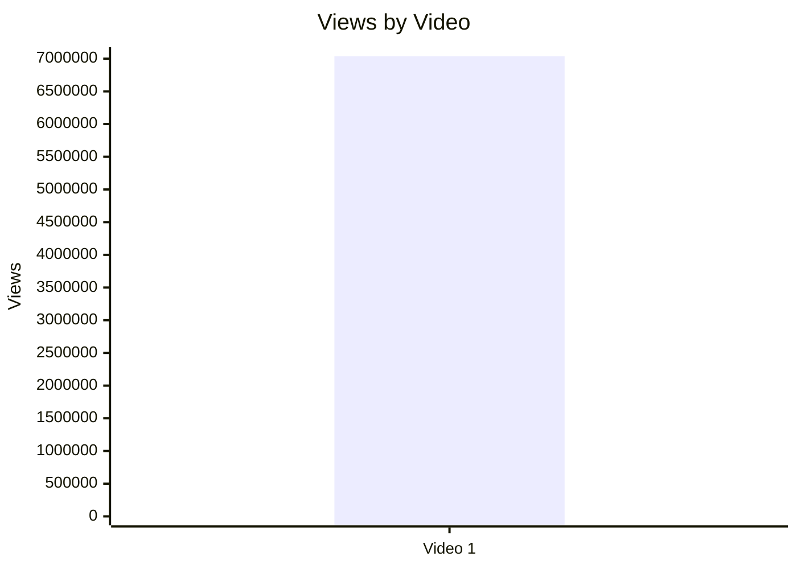

## 5.2. Views per day by video

- Назва графіка: Views per day by video
- Яке питання він відповідає: яка швидкість набору переглядів з урахуванням віку.
- Які поля використовуються: `video_label`, `views_per_day`.
- Тип графіка: Mermaid bar chart.
- Що видно з графіка: Video 1 має 13,559.52 views/day.
- Практичний висновок: метрика придатна для майбутнього порівняння з іншими long-form відео.

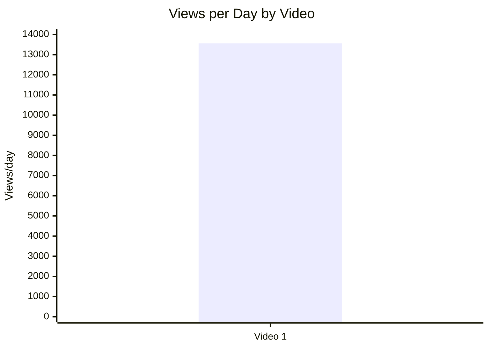

## 5.3. Views per 1k subscribers

- Назва графіка: Views per 1k subscribers
- Яке питання він відповідає: наскільки ефективно відео конвертує розмір каналу в перегляди.
- Які поля використовуються: `video_label`, `views_per_1k_subs`.
- Тип графіка: Mermaid bar chart.
- Що видно з графіка: Video 1 має 910.4 views/1k subs.
- Практичний висновок: це сильна normalized база для порівняння з іншими відео цього каналу або формату.

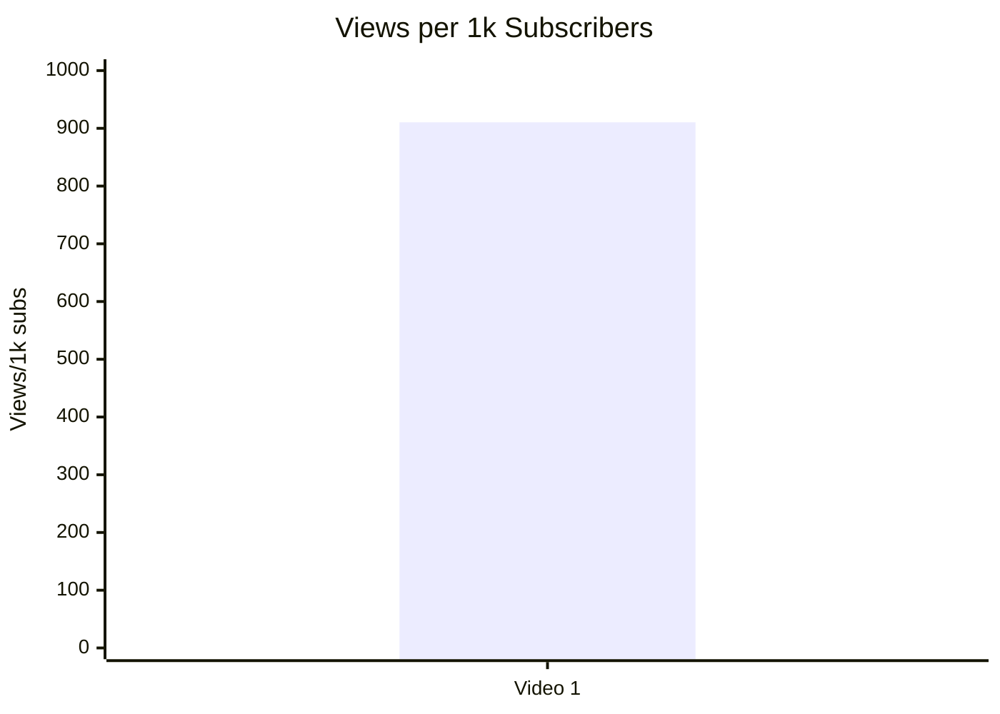

## 5.4. Performance quadrant

- Назва графіка: Performance quadrant
- Яке питання він відповідає: баланс охоплення та залучення.
- Які поля використовуються: `views_per_day`, `er_public_percent`.
- Тип графіка: scatter/quadrant.
- Що видно з графіка: для 1 відео квадранти не мають статистичного сенсу.
- Практичний висновок: `INSUFFICIENT_DATA`; потрібні мінімум 3–5 відео в одній когорті.

| Video | Views/day | ER Public % | Quadrant |
|---|---:|---:|---|
| Video 1 | 13,559.52 | 2.7154 | NOT_COMPARABLE |

## 6. Графіки залучення

## 6.1. ER Public % by video

- Назва графіка: ER Public % by video
- Яке питання він відповідає: яке відео має найвище public engagement.
- Які поля використовуються: `video_label`, `er_public_percent`.
- Тип графіка: Mermaid bar chart.
- Що видно з графіка: Video 1 має 2.7154% ER Public.
- Практичний висновок: показник можна порівнювати в майбутній когорті long-form відео.

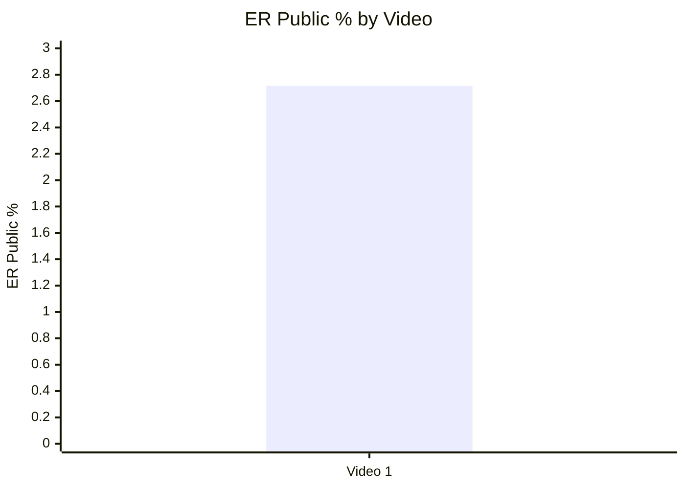

## 6.2. Like Rate % vs Comment Rate %

- Назва графіка: Like Rate % vs Comment Rate %
- Яке питання він відповідає: чи залучення більше через лайки або дискусію.
- Які поля використовуються: `like_rate_percent`, `comment_rate_percent`.
- Тип графіка: scatter plot.
- Що видно з графіка: Video 1 має 2.4998% like rate і 0.2156% comment rate.
- Практичний висновок: відео сильніше збирає лайки, ніж коментарі; висновок `LOW_CONFIDENCE`.

| Video | Like Rate % | Comment Rate % | Interpretation |
|---|---:|---:|---|
| Video 1 | 2.4998 | 0.2156 | Likes dominate; discussion exists but lower than likes |

## 6.3. Comments per 1k views

- Назва графіка: Comments per 1k views
- Яке питання він відповідає: наскільки відео провокує коментарі відносно переглядів.
- Які поля використовуються: `video_label`, `comments_per_1k_views`.
- Тип графіка: Mermaid bar chart.
- Що видно з графіка: Video 1 має 2.1559 comments/1k views.
- Практичний висновок: тема викликає реакцію, але без benchmark не можна назвати показник високим або низьким.

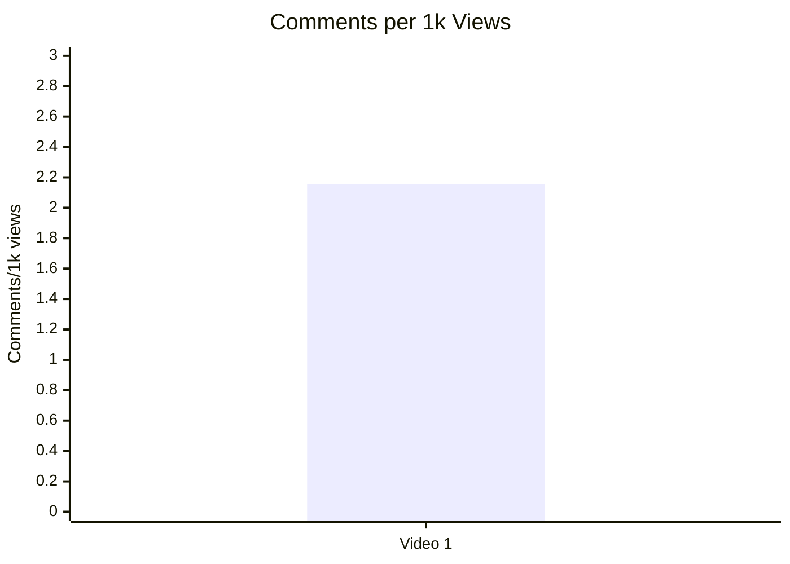

## 7. Графіки структури та hook

## 7.1. Hook score by video

- Назва графіка: Hook score by video
- Яке питання він відповідає: наскільки сильний hook.
- Які поля використовуються: `video_label`, `hook_score`.
- Тип графіка: Mermaid bar chart.
- Що видно з графіка: Hook score = 5/5.
- Практичний висновок: hook є однією з головних сильних зон для повторення.

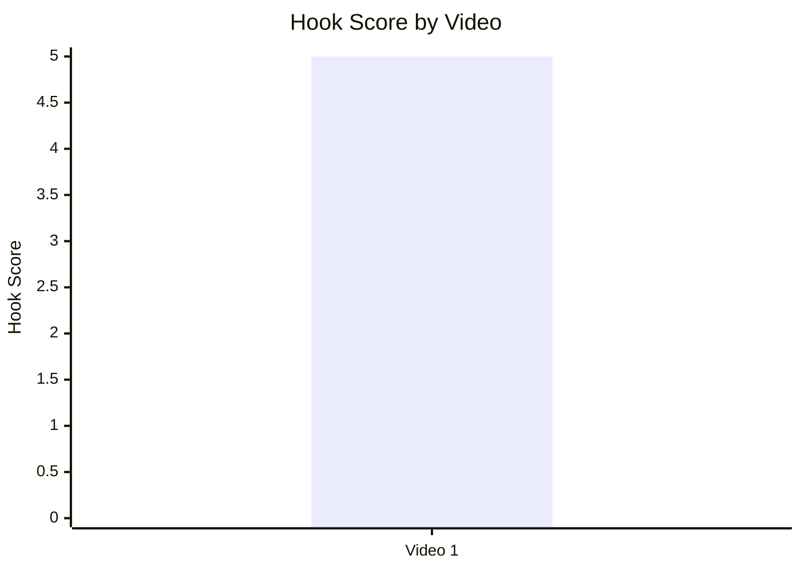

## 7.2. Hook type distribution

- Назва графіка: Hook type distribution
- Яке питання він відповідає: які hook types використовуються.
- Які поля використовуються: `hook_primary_type`, count.
- Тип графіка: Mermaid pie chart.
- Що видно з графіка: є один hook type — `CURIOSITY_GAP`.
- Практичний висновок: `CURIOSITY_GAP` варто тестувати далі, але не можна робити висновок про superiority без більшої вибірки.

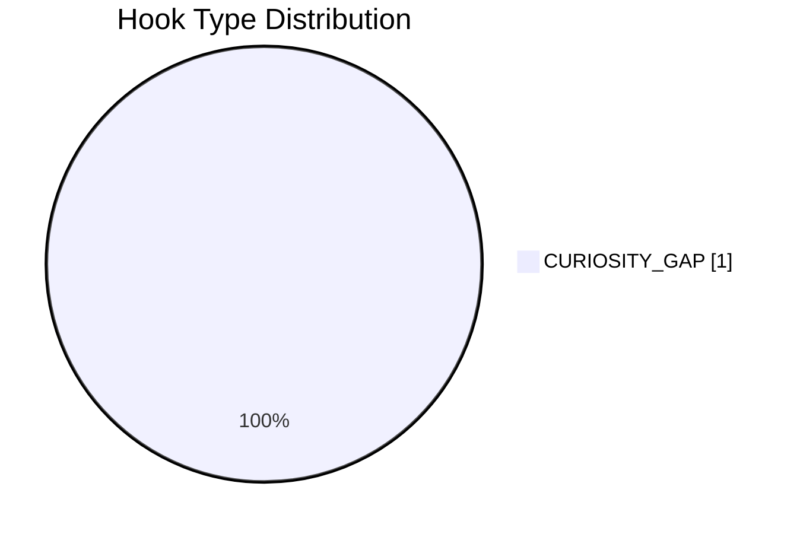

## 7.3. Time to first value vs Overall Score

- Назва графіка: Time to first value vs Overall Score
- Яке питання він відповідає: чи швидша перша цінність пов’язана з вищим результатом.
- Які поля використовуються: `time_to_first_value_seconds`, `overall_video_score`.
- Тип графіка: scatter plot.
- Що видно з графіка: `time_to_first_value` = `00:45-01:30_LOW_CONFIDENCE`, не конвертовано в точні секунди.
- Практичний висновок: `INSUFFICIENT_DATA`; потрібен точний timestamp або ручна нормалізація.

| Video | Time to first value | Overall |
|---|---|---:|
| Video 1 | 00:45-01:30_LOW_CONFIDENCE | 4.1 |

## 8. Графіки CTA

## 8.1. CTA score by video

- Назва графіка: CTA score by video
- Яке питання він відповідає: наскільки якісно інтегровані CTA.
- Які поля використовуються: `video_label`, `cta_score`.
- Тип графіка: Mermaid bar chart.
- Що видно з графіка: CTA score = 3/5.
- Практичний висновок: CTA зона середня; є простір для покращення через comment prompt, pinned comment strategy і сильніший end-screen bridge.

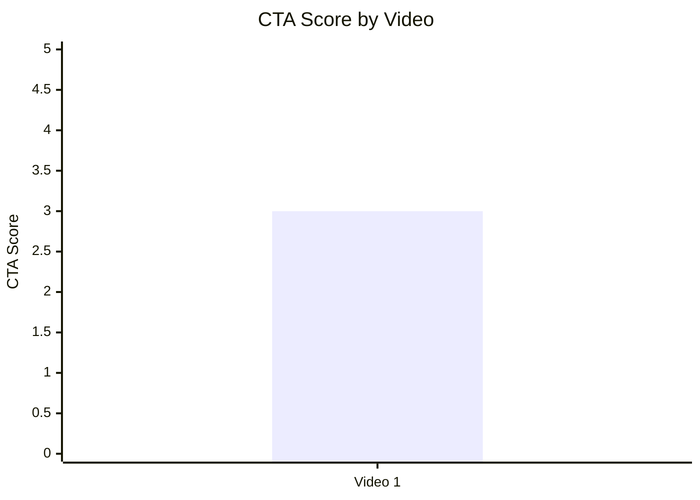

## 8.2. CTA count vs ER Public %

- Назва графіка: CTA count vs ER Public %
- Яке питання він відповідає: чи кількість CTA пов’язана із залученням.
- Які поля використовуються: `cta_count`, `er_public_percent`.
- Тип графіка: scatter plot.
- Що видно з графіка: Video 1 має 4 CTA та 2.7154% ER Public.
- Практичний висновок: `INSUFFICIENT_DATA`; з 1 відео не можна оцінити зв’язок або CTA overload.

| Video | CTA count | ER Public % |
|---|---:|---:|
| Video 1 | 4 | 2.7154 |

## 8.3. CTA features heatmap

- Назва графіка: CTA features heatmap
- Яке питання він відповідає: які CTA features присутні.
- Які поля використовуються: `has_comment_prompt`, `has_subscribe_cta`, `has_like_cta`, `has_bell_cta`, `has_next_video_bridge`.
- Тип графіка: matrix heatmap.
- Що видно з графіка: є next-video bridge; comment prompt відсутній; subscribe/like/bell не підтверджені в JSON.
- Практичний висновок: наступний тест — додати конкретний comment prompt і pinned comment question.

| Video | Comment prompt | Subscribe | Like | Bell | Next video bridge |
|---|---|---|---|---|---|
| Video 1 | ❌ | N/A | N/A | N/A | ✅ |

## 9. Графіки реклами / інтеграцій

Є рекламна інтеграція, але точний `ad_load_percent` не розрахований через `NO_TIMECODES`.

## 9.1. Ad load % by video

- Назва графіка: Ad load % by video
- Яке питання він відповідає: наскільки велике рекламне навантаження.
- Які поля використовуються: `ad_load_percent`.
- Тип графіка: bar chart.
- Що видно з графіка: `NO_TIMECODES`.
- Практичний висновок: графік неможливо побудувати без точних start/end реклами.

| Video | Ad detected | Ad load % |
|---|---|---|
| Video 1 | YES | NO_TIMECODES |

## 9.2. First ad position %

- Назва графіка: First ad position %
- Яке питання він відповідає: чи реклама стоїть занадто рано.
- Які поля використовуються: `first_ad_relative_position_percent`.
- Тип графіка: bar/scatter.
- Що видно з графіка: `NO_TIMECODES`.
- Практичний висновок: графік неможливо побудувати; потрібен точний timestamp першої реклами.

| Video | First ad time | First ad relative position % |
|---|---|---|
| Video 1 | NO_TIMECODES | NO_TIMECODES |

## 9.3. Ad integration score vs ER Public %

- Назва графіка: Ad integration score vs ER Public %
- Яке питання він відповідає: чи якість інтеграції пов’язана з реакцією аудиторії.
- Які поля використовуються: `ad_integration_score`, `er_public_percent`.
- Тип графіка: scatter plot.
- Що видно з графіка: Video 1 має ad integration score 3 і ER Public 2.7154%.
- Практичний висновок: `INSUFFICIENT_DATA`; є сигнал до тесту коротшої/пізнішої реклами, але не кореляція.

| Video | Ad integration score | ER Public % |
|---|---:|---:|
| Video 1 | 3 | 2.7154 |

## 10. Графіки аудіо

## 10.1. Audio score by video

- Назва графіка: Audio score by video
- Яке питання він відповідає: наскільки сильна аудіо-складова.
- Які поля використовуються: `video_label`, `audio_score`.
- Тип графіка: Mermaid bar chart.
- Що видно з графіка: Audio score = 4/5.
- Практичний висновок: аудіо є сильною зоною, але коментарі також містять окремі скарги на sound design/volume.

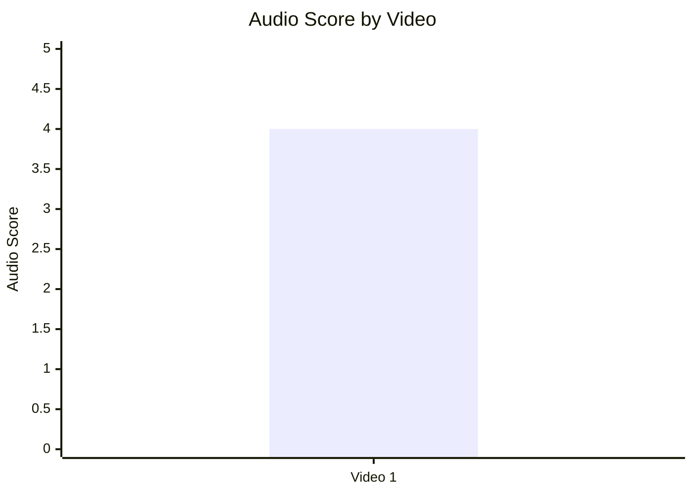

## 10.2. Audio score vs Overall Score

- Назва графіка: Audio score vs Overall Score
- Яке питання він відповідає: чи краща якість аудіо пов’язана з overall score.
- Які поля використовуються: `audio_score`, `overall_video_score`.
- Тип графіка: scatter plot.
- Що видно з графіка: 1 точка: audio 4, overall 4.1.
- Практичний висновок: `INSUFFICIENT_DATA`; зв’язок не оцінюється.

| Video | Audio score | Overall |
|---|---:|---:|
| Video 1 | 4 | 4.1 |

## 11. Графіки коментарів

## 11.1. Sentiment distribution

- Назва графіка: Sentiment distribution
- Яке питання він відповідає: як розподілена реакція аудиторії.
- Які поля використовуються: `positive_percent`, `negative_percent`, `mixed_percent`, `neutral_percent`, `question_percent`, `request_percent`.
- Тип графіка: stacked bar chart.
- Що видно з графіка: точні percent не надані у Comparable JSON.
- Практичний висновок: `INSUFFICIENT_DATA`; замість графіка використовується таблиця кластерів.

| Video | Positive % | Negative % | Mixed % | Neutral % | Question % | Request % |
|---|---:|---:|---:|---:|---:|---:|
| Video 1 | N/A | N/A | N/A | N/A | N/A | N/A |

## 11.2. Comment resonance score by video

- Назва графіка: Comment resonance score by video
- Яке питання він відповідає: наскільки коментарі підтверджують резонанс теми.
- Які поля використовуються: `video_label`, `comment_resonance_score`.
- Тип графіка: Mermaid bar chart.
- Що видно з графіка: Comment resonance score = 4/5.
- Практичний висновок: тема викликає сильну реакцію, але значна частина реакції пов’язана з trust/criticism topics.

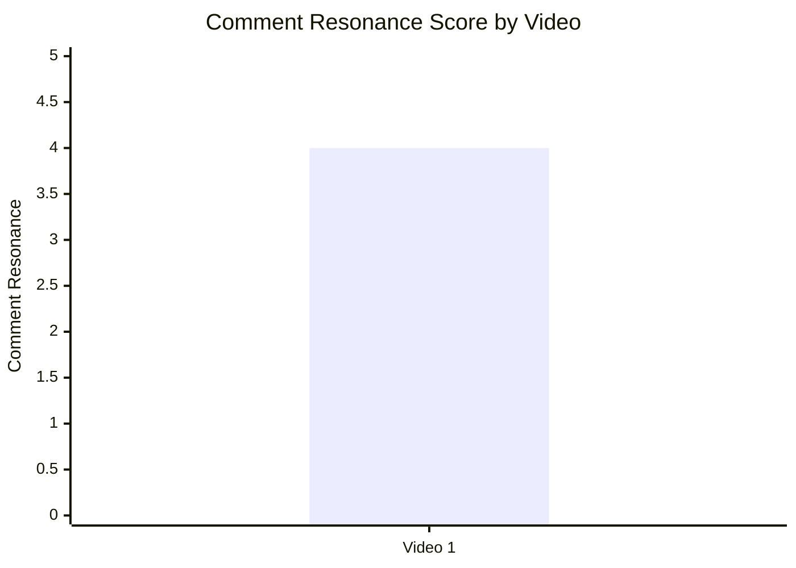

## 11.3. Top comment clusters

- Назва графіка: Top comment clusters
- Яке питання він відповідає: що найчастіше хвалять або критикують.
- Які поля використовуються: comment cluster names з `YT_VIDEO_ANALYSIS_V1`.
- Тип графіка: horizontal bar chart / table.
- Що видно з графіка: точні percent/count для всіх кластерів не структуровані як CSV-ready поля.
- Практичний висновок: для наступних звітів треба експортувати comment clusters у кількісному форматі.

| Cluster | Direction | Practical meaning |
|---|---|---|
| Production / cinematography praise | Positive | Візуальна якість — сильна сторона |
| Bedouin / human story appreciation | Positive | Людський шар підсилює megaproject topic |
| Saudi propaganda / paid video suspicion | Negative | Потрібен сильніший disclosure та sourcing |
| Women / human rights / worker conditions gap | Negative | Потрібен окремий critical layer |
| Ad fatigue / Rocket Money complaints | Negative | Варто тестувати коротшу або пізнішу інтеграцію |
| Requests for updates on NEOM status | Mixed / request | Є потенціал follow-up video |

## 12. Графіки score-системи

## 12.1. Overall score by video

- Назва графіка: Overall score by video
- Яке питання він відповідає: яке відео має найвищий загальний бал.
- Які поля використовуються: `video_label`, `overall_video_score`.
- Тип графіка: Mermaid bar chart.
- Що видно з графіка: Video 1 має 4.1/5.
- Практичний висновок: сильний кандидат для масштабування механіки, але порівняння неможливе.

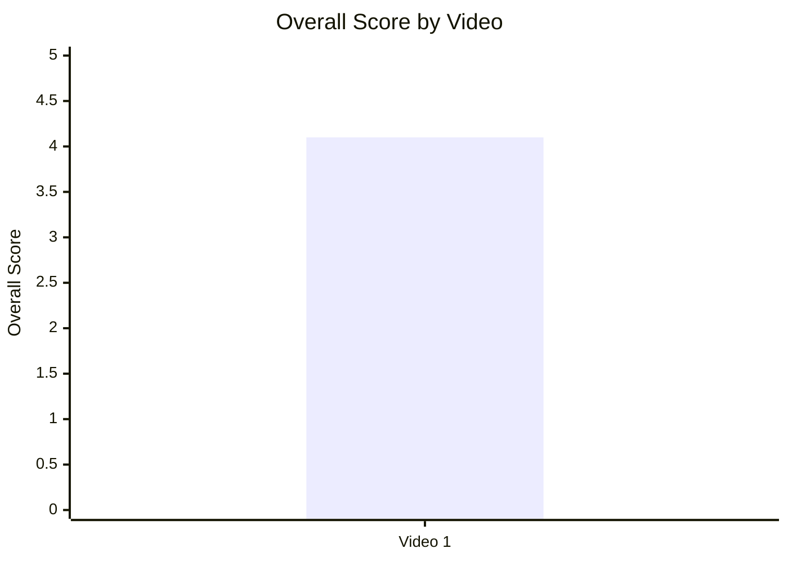

## 12.2. Score breakdown heatmap

- Назва графіка: Score breakdown heatmap
- Яке питання він відповідає: які компоненти сильні/слабкі.
- Які поля використовуються: `hook_score`, `structure_score`, `value_density_score`, `audio_score`, `cta_score`, `ad_integration_score`, `comment_resonance_score`, `replicability_score`, `overall_video_score`.
- Тип графіка: heatmap / matrix.
- Що видно з графіка: Hook і Structure = 5; CTA і Ad = 3.
- Практичний висновок: масштабувати hook/structure, оптимізувати CTA/ad.

| Video | Hook | Structure | Value Density | Audio | CTA | Ad | Comments | Replicability | Overall |
|---|---:|---:|---:|---:|---:|---:|---:|---:|---:|
| Video 1 | 5 | 5 | 4 | 4 | 3 | 3 | 4 | 4 | 4.1 |

## 12.3. Strengths vs weaknesses count

- Назва графіка: Strengths vs weaknesses count
- Яке питання він відповідає: чи переважають success mechanics або missed opportunities.
- Які поля використовуються: кількість top success mechanics і top missed opportunities.
- Тип графіка: stacked bar/table.
- Що видно з графіка: у JSON є 3 top success mechanics і 3 top missed opportunities.
- Практичний висновок: відео сильне, але має чіткі trust/ad/coverage gaps.

| Video | Success mechanics count | Missed opportunities count |
|---|---:|---:|
| Video 1 | 3 | 3 |

## 13. Кореляції та патерни

Correlation analysis skipped: fewer than 5 comparable videos.

| Pair | Correlation / Pattern | Strength | Interpretation | Confidence |
|---|---:|---|---|---|
| hook_score → overall_video_score | INSufficient sample | N/A | Потрібно ≥5 відео | LOW |
| value_density_score → er_public_percent | INSufficient sample | N/A | Потрібно ≥5 відео | LOW |
| cta_score → comment_rate_percent | INSufficient sample | N/A | Потрібно ≥5 відео | LOW |
| comment_resonance_score → er_public_percent | INSufficient sample | N/A | Потрібно ≥5 відео | LOW |
| views_per_day → er_public_percent | INSufficient sample | N/A | Потрібно ≥5 відео | LOW |
| ad_load_percent → er_public_percent | NO_TIMECODES | N/A | Немає ad_load_percent | LOW |
| time_to_first_value_seconds → overall_video_score | LOW_CONFIDENCE timestamp | N/A | Немає точних секунд | LOW |

## 14. Висновки для контент-стратегії

| Спостереження | Дані / графік | Що це означає | Що робити |
|---|---|---|---|
| Hook і структура — найсильніші компоненти | Score breakdown: Hook 5, Structure 5 | Відео добре продає curiosity і тримає narrative flow | Повторювати `CURIOSITY_GAP + field journey + payoff` |
| CTA середній | CTA score 3; comment prompt ❌ | Є простір для росту коментарів | Додати конкретний comment prompt після value block |
| Реклама є, але точний ad load невідомий | Ad detected YES; ad score 3; ad_load `NO_TIMECODES` | Рекламний блок може створювати friction | У наступних аналізах фіксувати exact ad start/end |
| Коментарі мають trust backlash | Comment clusters: paid/propaganda, human rights, women, worker conditions | Тема чутлива, аудиторія хоче disclosure і критичний баланс | Додавати sourcing/disclosure block і pinned clarification |
| Аудіо сильне, але не без ризику | Audio 4; окремі скарги на volume/sound design | Sound design додає cinematic value, але може перевантажувати | Тестувати менш агресивний mix у довгих документальних відео |
| Follow-up має потенціал | Коментарі про cancelled/scaled back/dead | Тема продовжує змінюватися після публікації | Зробити update video / pinned update |

## 15. Що тестувати далі

| Тест | Гіпотеза | На яких даних базується | Як виміряти | Пріоритет |
|---|---|---|---|---|
| Додати pinned comment із питанням | Конкретний prompt підвищить comment_rate | `has_comment_prompt = false`, CTA score 3 | comment_rate_percent, comments_per_1k_views | HIGH |
| Додати transparency/disclosure block | Зменшить trust backlash | Комент-кластери про paid/propaganda/government access | Частка негативних trust-коментарів | HIGH |
| Перенести або скоротити sponsor read | Зменшить ad fatigue | Ad score 3, коментарі про довгу рекламу | retention proxy, negative ad comments, ER | MEDIUM |
| Робити follow-up/update | Поверне аудиторію через зміну статусу NEOM | Коментарі про cancelled/scaled back/dead | views/day у перші 30 днів, CTR, comments | HIGH |
| Повторити field megaproject format | Boots-on-the-ground + human story дає strong concept | Overall 4.1, hook 5, structure 5 | views_per_day, ER Public %, comment resonance | HIGH |
| Нормалізувати аудіо/музику | Менше скарг на volume/sound design | Audio 4, але є негативні audio comments | audio complaints per 1k comments | MEDIUM |

## 16. Дані для експорту в таблицю / CSV

| video_label | title | format_group | views | views_per_day | like_rate_percent | comment_rate_percent | er_public_percent | views_per_1k_subs | hook_type | hook_score | cta_count | cta_score | ad_load_percent | ad_integration_score | audio_score | comment_resonance_score | overall_video_score | top_success_mechanic | top_missed_opportunity |
|---|---|---|---:|---:|---:|---:|---:|---:|---|---:|---:|---:|---:|---:|---:|---:|---:|---|---|
| Video 1 | Why Saudi Arabia is Building a $1 Trillion City in the Desert | LONG_20_PLUS_MIN | 7037392 | 13559.52 | 2.4998 | 0.2156 | 2.7154 | 910.4 | CURIOSITY_GAP | 5 | 4 | 3 | NO_TIMECODES | 3 | 4 | 4 | 4.1 | STRONG_TOPIC_DEMAND | COMMENTS_SHOW_TOPIC_GAP |