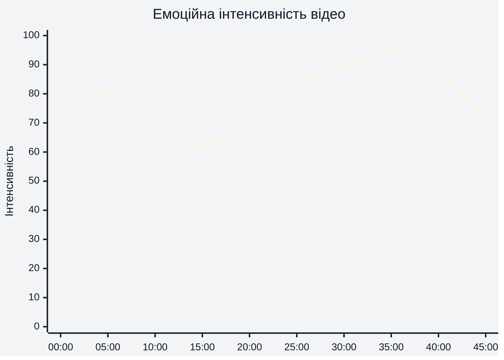
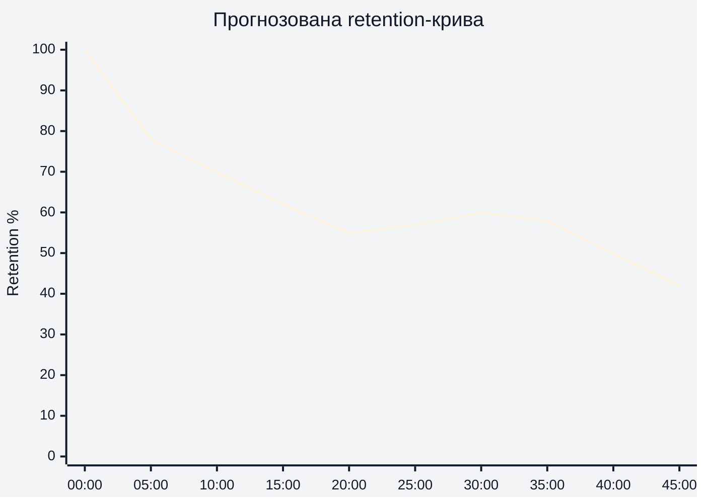
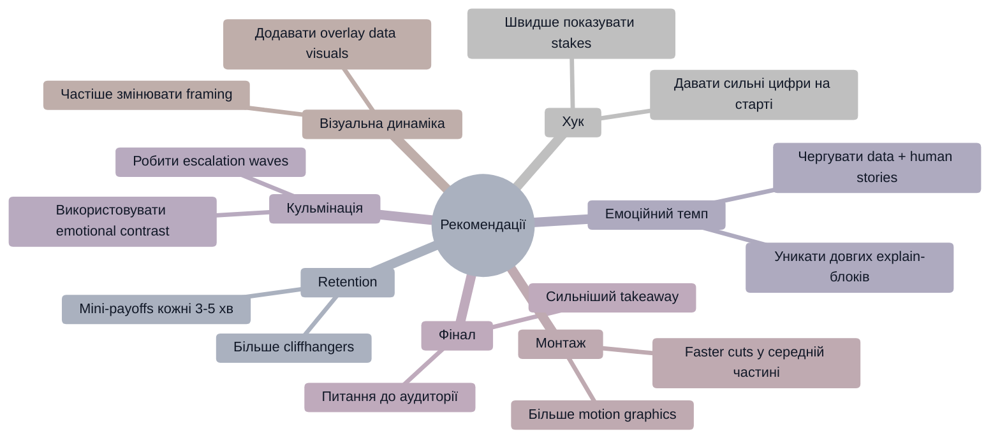

# Аналіз довгоформатного YouTube-відео

## 1. Сюжетна дуга (Narrative Arc)

```mermaid
%%{init: {'theme':'base', 'themeVariables': {
'primaryColor':'#f3f4f6',
'primaryTextColor':'#111827',
'primaryBorderColor':'#2563eb',
'lineColor':'#2563eb',
'secondaryColor':'#ffffff',
'tertiaryColor':'#f3f4f6',
'background':'#f3f4f6'
}}}%%
flowchart LR
A["00:00–02:10<br/>Хук<br/>ICE, депортації та шокуючі цифри"] -->
B["02:10–08:57<br/>Експозиція<br/>Пояснення ролі ICE та політичного контексту"] -->
C["08:57–17:09<br/>Перша ескалація<br/>Історія імміграції та ринку праці США"] -->
D["17:09–23:14<br/>Переломний момент<br/>Після 9/11 ICE отримує нові повноваження"] -->
E["23:14–29:38<br/>Наростання напруги<br/>Collateral Enforcement та масові арешти"] -->
F["29:38–36:48<br/>Кульмінація<br/>Національна надзвичайна ситуація та розширення депортацій"] -->
G["36:48–43:00<br/>Розв’язка<br/>ICE виходить за межі боротьби зі злочинцями"] -->
H["43:00–45:27<br/>Фінальний висновок<br/>Людська ціна депортацій та майбутнє системи"]
```

---

## 2. Ключові Story Beats

```mermaid
%%{init: {'theme':'base', 'themeVariables': {
'primaryColor':'#f3f4f6',
'primaryTextColor':'#111827',
'primaryBorderColor':'#2563eb',
'lineColor':'#2563eb',
'secondaryColor':'#ffffff',
'tertiaryColor':'#f3f4f6',
'background':'#f3f4f6'
}}}%%
flowchart LR
A["00:15<br/>ICE бюджет $10B<br/>Шоковий контекст"] -->
B["01:50<br/>Графік арештів<br/>Конфлікт і питання"] -->
C["05:47<br/>Знайомство з Daniel<br/>Емоційний anchor"] -->
D["08:57<br/>Америка до ICE<br/>Історичний контекст"] -->
E["13:55<br/>Роль нелегальної праці<br/>Економічний аргумент"] -->
F["17:09<br/>9/11 та Homeland Security<br/>Перелом системи"] -->
G["23:14<br/>Collateral Enforcement<br/>Ескалація страху"] -->
H["29:38<br/>National Emergency<br/>Політичне загострення"] -->
I["36:48<br/>ICE Unleashed<br/>Кульмінація загрози"] -->
J["41:20<br/>Особисті історії депортацій<br/>Максимум емоцій"] -->
K["44:10<br/>Що буде далі?<br/>Відкритий фінал"]
```

---

## 3. Емоційний темп

### Інтерпретація
- 00:00–05:00 — високий старт через конфлікт і страх.
- 13:00–18:00 — просідання через історичний бекграунд.
- 23:00–36:00 — головна емоційна ескалація.
- 36:00–42:00 — пік тривоги та людських історій.

---

## 4. Утримання аудиторії

### Дані retention
Реальні retention-дані не надані. Нижче — прогнозована retention-структура на основі сценарію, pacing і монтажу.

### Інтерпретація
- Найсильніше утримання: перші 5 хвилин.
- Потенційний спад: історичний блок 10:00–18:00.
- Повторне зростання: 23:00–36:00 через ескалацію конфлікту.

---

## 5. Піки retention

| Таймкод | Подія | Чому це може утримувати увагу | Сила піку 1–10 |
|---|---|---|---|
| 00:15 | Показ бюджету ICE | Шокуючі цифри та сильний контекст | 9 |
| 01:50 | Графік арештів без кримінального минулого | Конфлікт та інтрига | 10 |
| 05:47 | Історія Daniel | Емоційна прив’язка до героя | 8 |
| 23:14 | Collateral Enforcement | Страх та ескалація | 9 |
| 29:38 | National Emergency | Відчуття загрози та масштабу | 9 |
| 41:20 | Реальні наслідки депортацій | Найсильніший emotional payoff | 10 |

---

## 6. Провали retention

| Таймкод | Проблема | Ймовірна причина спаду | Що покращити |
|---|---|---|---|
| 11:00–15:00 | Довгий історичний блок | Зниження драматичної напруги | Додати короткі human-story inserts |
| 19:00–21:00 | Багато пояснювальної інформації | Висока когнітивна складність | Більше графіки та швидших cuts |
| 32:00–34:00 | Політичні деталі | Частина аудиторії може втрачати фокус | Вставити stronger cliffhanger |
| 43:00–45:00 | Повільний фінал | Після кульмінації темп падає | Додати сильніший final takeaway |

---

## 7. Оцінка сегментів

| Сегмент | Таймкод | Функція | Емоційна інтенсивність | Ризик втрати уваги | Оцінка 1–10 | Що покращити |
|---|---|---|---|---|---|---|
| Хук | 00:00–02:10 | Захопити увагу | Висока | Низький | 10 | Майже ідеально |
| Експозиція | 02:10–08:57 | Контекст | Середня | Низький | 8 | Трохи скоротити sponsor bridge |
| Історичний блок | 08:57–17:09 | Пояснення системи | Середня | Високий | 7 | Більше mini-payoffs |
| Homeland Security | 17:09–23:14 | Ескалація | Висока | Середній | 8 | Більше візуальної динаміки |
| Collateral Enforcement | 23:14–29:38 | Конфлікт | Висока | Низький | 9 | Дуже сильний блок |
| National Emergency | 29:38–36:48 | Кульмінація | Дуже висока | Низький | 10 | Сильна напруга |
| ICE Unleashed | 36:48–43:00 | Emotional payoff | Дуже висока | Низький | 9 | Можна ще сильніше персоналізувати |
| Фінал | 43:00–45:27 | Рефлексія | Середня | Середній | 7 | Сильніший closing CTA |

---

## 8. Практичні рекомендації

---

## 9. Підсумкова оцінка

| Показник | Оцінка 1–10 | Коментар |
|---|---|---|
| Сюжетна дуга | 9 | Сильна escalation структура |
| Story Beats | 9 | Чіткі emotional pivots |
| Емоційний темп | 8 | Є кілька explain-heavy ділянок |
| Retention Structure | 8 | Потенційний спад у середині |
| Загальна оцінка | 9 | Дуже сильний long-form documentary format |
