# Статистичний аналіз відеозвітів

## 1. Короткий executive summary

| Пункт | Висновок |
|---|---|
| Скільки відео проаналізовано | 1 |
| Скільки форматів відео | 1: `LONG_20_PLUS_MIN` |
| Найсильніше відео за overall score | `Video 1` — 4.35 / 5 |
| Найсильніше відео за ER Public % | `Video 1` — 3.1486% |
| Найсильніше відео за views per day | `Video 1` — 28,502.74 views/day |
| Найсильніша повторювана механіка | `NOT_APPLICABLE`: є лише один звіт, тому повторюваність не перевіряється. Найсильніша механіка в цьому звіті: `CLEAR_HOOK` + `STRONG_STORY_STRUCTURE`. |
| Найчастіша слабкість | `NOT_APPLICABLE`: є лише один звіт. У цьому звіті головна слабкість: `COMMENTS_SHOW_CONFUSION`. |
| Головна стратегічна можливість | Масштабувати формат `data contradiction hook → human story → system explanation`, але додавати pinned FAQ / comment prompt для зниження confusion. |
| Рівень впевненості | `LOW_CONFIDENCE` для статистичних патернів через n=1; `MEDIUM` для описових графіків одного відео; `PARTIAL_DATA` за якістю джерела. |

## 2. Якість і повнота даних

| Поле | Кількість відео з даними | Кількість N/A | Коментар |
|---|---:|---:|---|
| views | 1 | 0 | Є public metric. |
| likes | 1 | 0 | Є public metric. |
| comments_count | 1 | 0 | Є public metric. |
| views_per_day | 1 | 0 | Є derived metric у звіті. |
| er_public_percent | 1 | 0 | Є derived metric у звіті. |
| views_per_1k_subs | 1 | 0 | Є derived metric; subscribers доступні. |
| hook_score | 1 | 0 | Є score 1–5. |
| cta_score | 1 | 0 | Є score 1–5. |
| ad_integration_score | 1 | 0 | Є score 1–5. |
| audio_score | 1 | 0 | Є score 1–5, але confidence `PARTIAL_DATA`. |
| comment_resonance_score | 1 | 0 | Є score 1–5. |
| overall_video_score | 1 | 0 | Є weighted score. |

### Обмеження аналізу

- Вибірка містить лише 1 відео, тому кореляції, кластери та повторювані статистичні патерни не будуються.
- Усі висновки про стратегію позначаються як `LOW_CONFIDENCE`, якщо вони виходять за межі одного відео.
- CTR, impressions, retention, watch time, subscribers gained, traffic sources і revenue відсутні; вони не реконструюються.
- `ad_load_percent`, `first_ad_relative_position_percent` і точний `first_ad_time` мають `N/A / NO_TIMECODES`, тому ad timing графіки обмежені.
- Дані не змішуються між форматами: доступна лише когорта `LONG_20_PLUS_MIN`.

## 3. Підготовлена таблиця для графіків

| Video | Format | Views | Views/day | Like Rate % | Comment Rate % | ER Public % | Views/1k subs | Hook | CTA | Ad | Audio | Comment Resonance | Overall |
|---|---|---:|---:|---:|---:|---:|---:|---:|---:|---:|---:|---:|---:|
| Video 1 | LONG_20_PLUS_MIN | 5,757,554 | 28,502.74 | 2.7387 | 0.4099 | 3.1486 | 746.7645 | 5.0 | 3.0 | 4.0 | 4.0 | 4.5 | 4.35 |

| Label | Full title | URL |
|---|---|---|
| Video 1 | Why the US is deporting so many people | https://www.youtube.com/watch?v=aDbtrdfYqBc |

## 4. Рекомендовані графіки

| # | Назва графіка | Тип графіка | Поля | Для чого потрібен | Пріоритет |
|---:|---|---|---|---|---|
| 1 | Overall score by video | Mermaid bar chart | `overall_video_score` | Побачити загальну силу відео | HIGH |
| 2 | Views per day by video | Mermaid bar chart | `views_per_day` | Оцінити швидкість набору переглядів з урахуванням віку | HIGH |
| 3 | ER Public % by video | Mermaid bar chart | `er_public_percent` | Оцінити public engagement | HIGH |
| 4 | ER Public % vs Views/day | Таблиця / single-point scatter | `er_public_percent`, `views_per_day` | Баланс охоплення й реакції | HIGH |
| 5 | Hook score by video | Mermaid bar chart | `hook_score` | Оцінити якість hook | HIGH |
| 6 | CTA score by video | Mermaid bar chart | `cta_score` | Оцінити CTA-систему | HIGH |
| 7 | Score breakdown heatmap | Таблична heatmap | score fields | Побачити сильні/слабкі сторони | HIGH |
| 8 | Sentiment distribution | Mermaid pie + table | comment sentiment fields | Побачити структуру реакції | HIGH |
| 9 | CTA features heatmap | Matrix | CTA boolean fields | Побачити наявність CTA-елементів | HIGH |
| 10 | Ad load % by video | Skipped / table | `ad_load_percent` | Неможливо без точного ad duration | HIGH |
| 11 | Comments per 1k views | Mermaid bar chart | `comments_per_1k_views` | Оцінити реактивність теми | MEDIUM |
| 12 | Hook type distribution | Mermaid pie | `hook_primary_type` | Побачити тип hook у вибірці | MEDIUM |

## 5. Графіки продуктивності

## 5.1. Views by video

- Назва графіка: Views by video
- Яке питання він відповідає: яке відео має найбільший raw reach.
- Які поля використовуються: `video_label`, `views`.
- Тип графіка: Mermaid bar chart.
- Що видно з графіка: є лише одне відео, тому ranking неможливий.
- Практичний висновок: raw reach високий у межах одного кейсу, але без інших відео або normalized benchmark не можна назвати його statistical outlier.

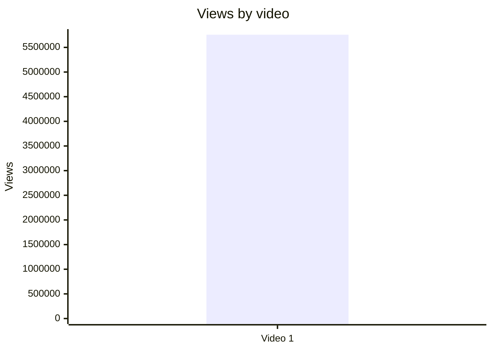

## 5.2. Views per day by video

- Назва графіка: Views per day by video
- Яке питання він відповідає: яка швидкість набору переглядів з урахуванням віку.
- Які поля використовуються: `video_label`, `views_per_day`.
- Тип графіка: Mermaid bar chart.
- Що видно з графіка: `Video 1` має 28,502.74 views/day.
- Практичний висновок: це краща базова метрика продуктивності, ніж raw views, але порівняння потребує інших `LONG_20_PLUS_MIN` відео.

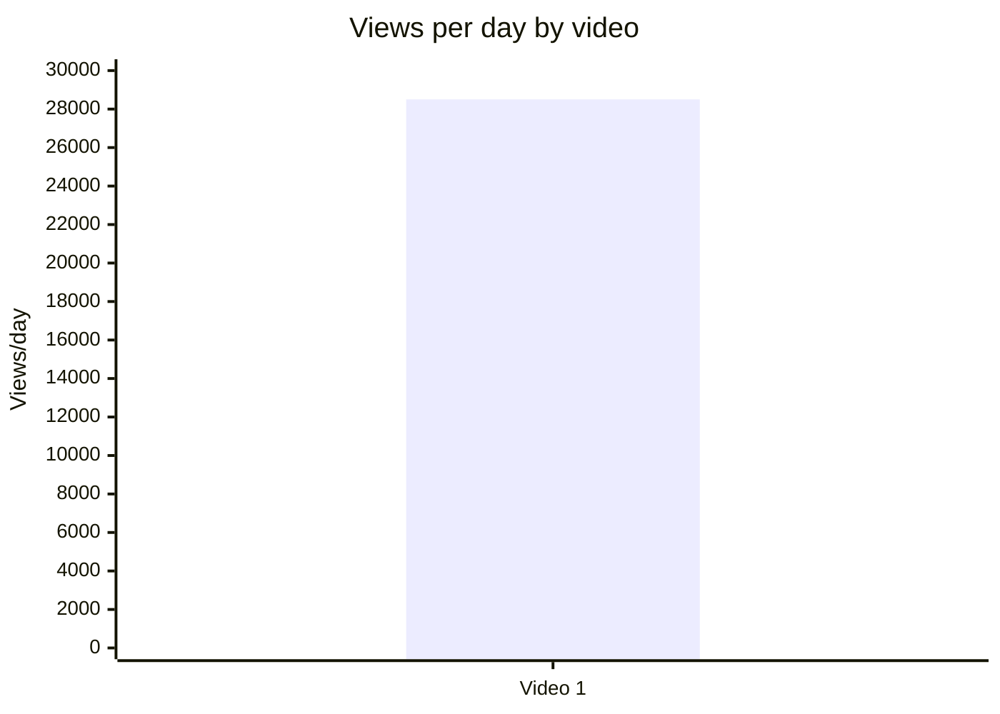

## 5.3. Views per 1k subscribers

- Назва графіка: Views per 1k subscribers
- Яке питання він відповідає: наскільки відео перетворює розмір каналу в перегляди.
- Які поля використовуються: `video_label`, `views_per_1k_subs`.
- Тип графіка: Mermaid bar chart.
- Що видно з графіка: `Video 1` має 746.7645 views per 1k subscribers.
- Практичний висновок: метрика придатна для майбутнього порівняння з іншими каналами/відео, але сама по собі не дає benchmark.

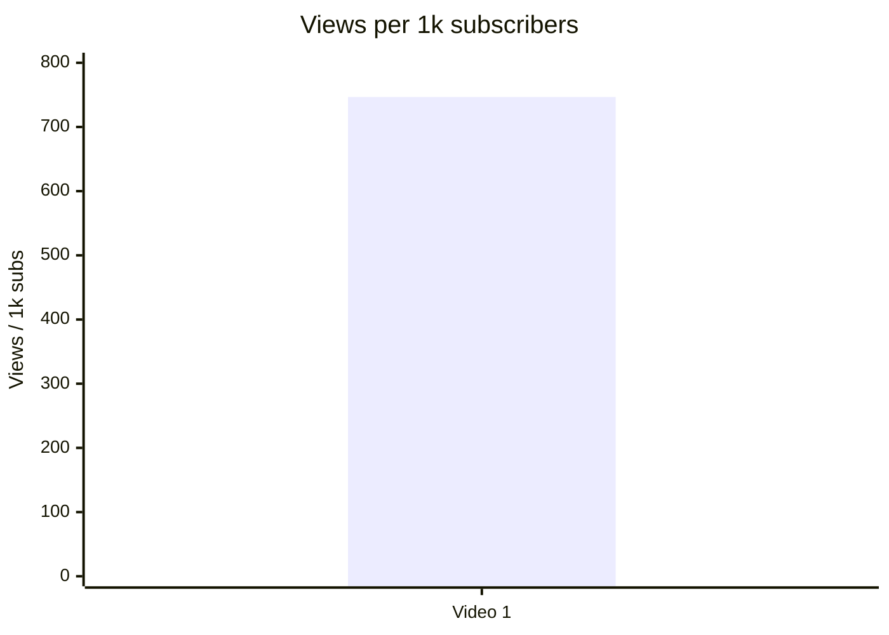

## 5.4. Performance quadrant

- Назва графіка: Performance quadrant
- Яке питання він відповідає: баланс охоплення і public engagement.
- Які поля використовуються: `views_per_day`, `er_public_percent`.
- Тип графіка: single-point scatter table, бо Mermaid quadrant із одним відео не дає статистичного порівняння.
- Що видно з графіка: точка одна, тому high/low thresholds не визначаються.
- Практичний висновок: графік готовий для майбутнього benchmark, але зараз quadrant classification = `INSUFFICIENT_DATA`.

| Video | Views/day | ER Public % | Quadrant |
|---|---:|---:|---|
| Video 1 | 28,502.74 | 3.1486 | `INSUFFICIENT_DATA`: немає cohort median / threshold |

## 6. Графіки залучення

## 6.1. ER Public % by video

- Назва графіка: ER Public % by video
- Яке питання він відповідає: який рівень публічної взаємодії має відео.
- Які поля використовуються: `er_public_percent`.
- Тип графіка: Mermaid bar chart.
- Що видно з графіка: `Video 1` має ER Public 3.1486%.
- Практичний висновок: сильний discussion potential треба перевіряти в порівнянні з іншими long-form відео.

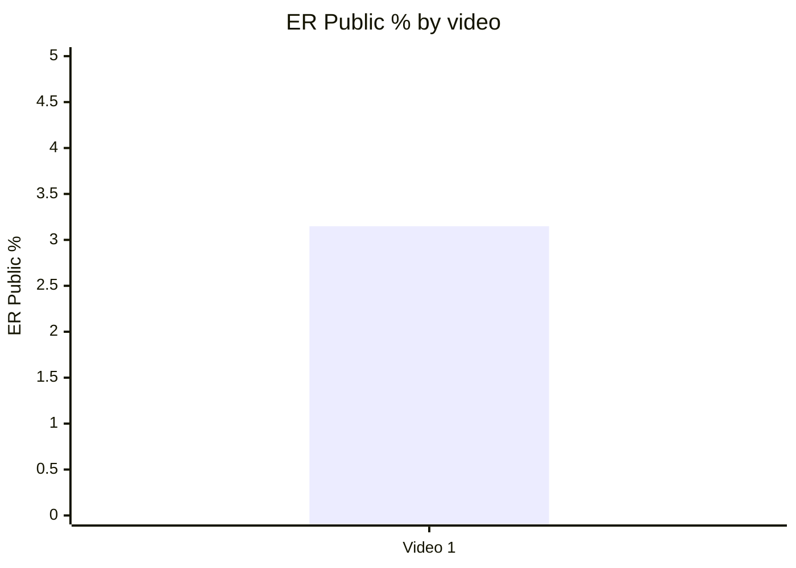

## 6.2. Like Rate % vs Comment Rate %

- Назва графіка: Like Rate % vs Comment Rate %
- Яке питання він відповідає: реакція більше схожа на approval чи discussion/debate.
- Які поля використовуються: `like_rate_percent`, `comment_rate_percent`.
- Тип графіка: single-point scatter table.
- Що видно з графіка: like rate = 2.7387%, comment rate = 0.4099%.
- Практичний висновок: коментарі є значущим engagement engine, але без порівняльних відео не можна встановити, чи це high-comment outlier.

| Video | Like Rate % | Comment Rate % | Interpretation |
|---|---:|---:|---|
| Video 1 | 2.7387 | 0.4099 | Один кейс; тема провокує дискусію, але quadrant high/low не визначається. |

## 6.3. Comments per 1k views

- Назва графіка: Comments per 1k views
- Яке питання він відповідає: наскільки відео провокує коментарі на одиницю переглядів.
- Які поля використовуються: `comments_per_1k_views`.
- Тип графіка: Mermaid bar chart.
- Що видно з графіка: 4.0995 comments per 1k views.
- Практичний висновок: метрика корисна для майбутніх sensitive-topic порівнянь.

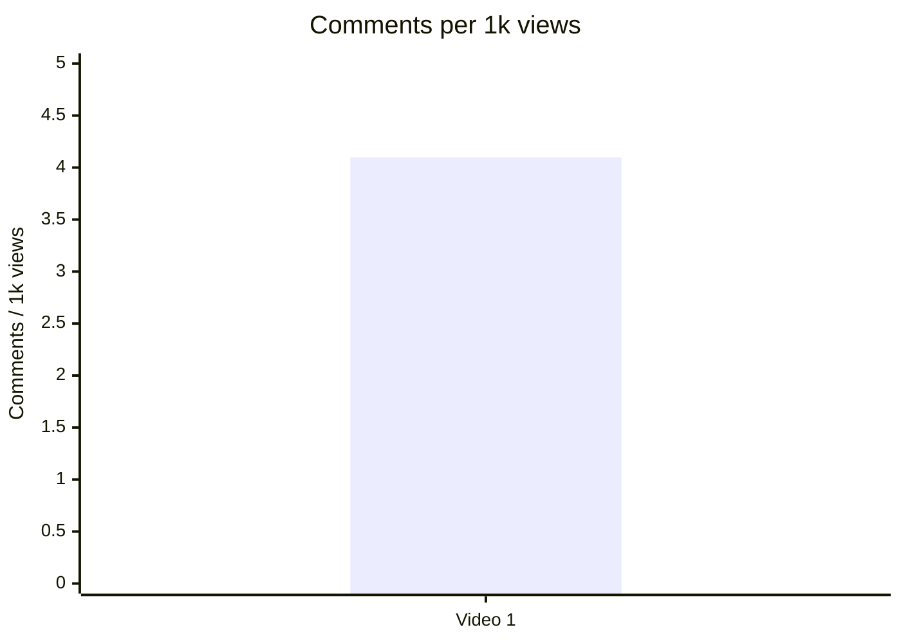

## 7. Графіки структури та hook

## 7.1. Hook score by video

- Назва графіка: Hook score by video
- Яке питання він відповідає: наскільки сильний hook.
- Які поля використовуються: `hook_score`.
- Тип графіка: Mermaid bar chart.
- Що видно з графіка: hook score = 5.0 / 5.
- Практичний висновок: hook — одна з найсильніших частин відео; варто тестувати data contradiction hooks у наступних відео.

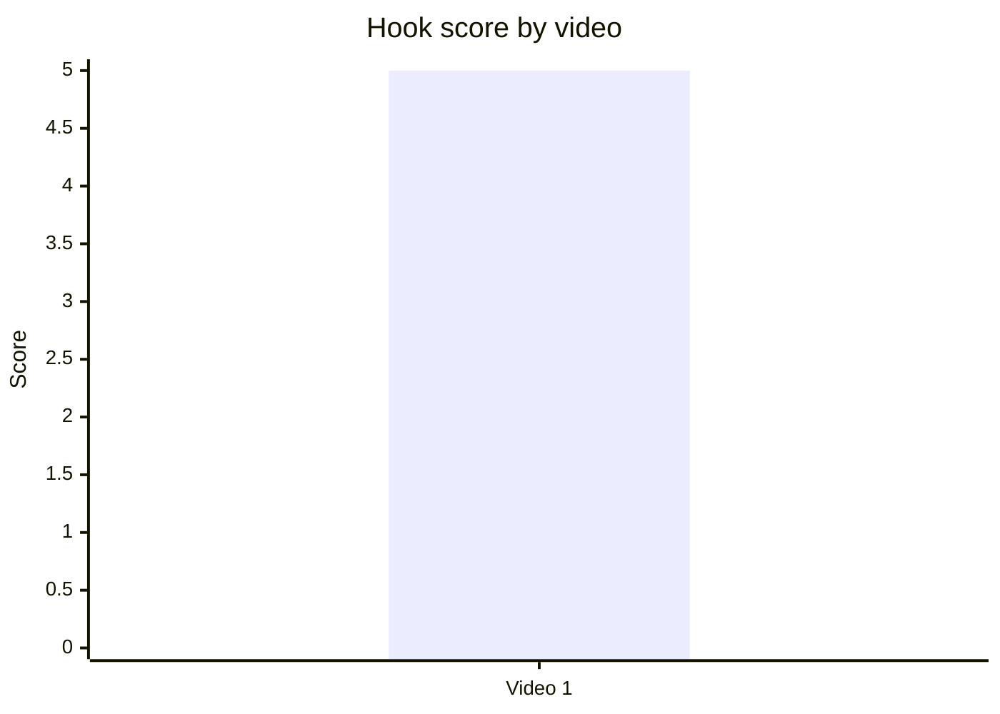

## 7.2. Hook type distribution

- Назва графіка: Hook type distribution
- Яке питання він відповідає: який primary hook type використано.
- Які поля використовуються: `hook_primary_type`.
- Тип графіка: Mermaid pie chart.
- Що видно з графіка: у вибірці є один primary type — `CURIOSITY_GAP`.
- Практичний висновок: не можна сказати, що цей hook type статистично найкращий, але для цього кейсу він збігається з високим hook score.

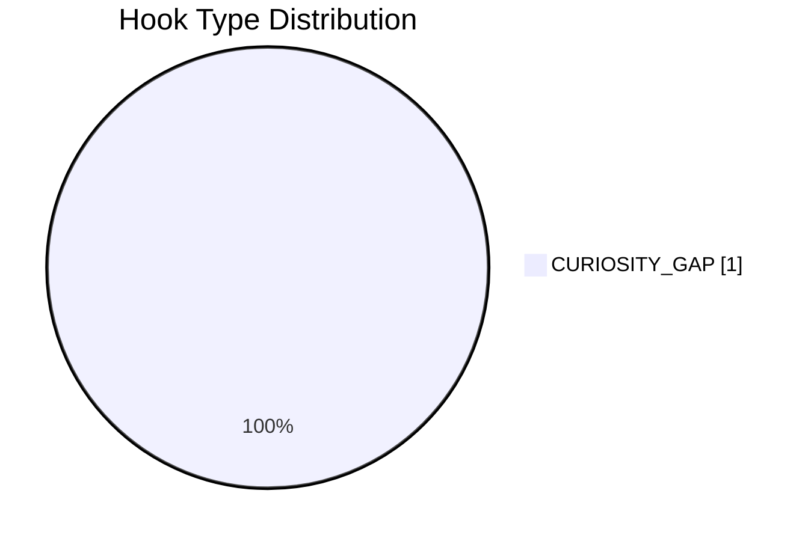

## 7.3. Time to first value vs Overall Score

- Назва графіка: Time to first value vs Overall Score
- Яке питання він відповідає: чи швидший перший value пов’язаний із вищим результатом.
- Які поля використовуються: `time_to_first_value`, `overall_video_score`.
- Тип графіка: skipped scatter / table.
- Що видно з графіка: `time_to_first_value` = `<00:30`, але точне число секунд не надане.
- Практичний висновок: для майбутніх звітів потрібно стандартизувати `time_to_first_value_seconds`.

| Video | Time to first value | Time to first value seconds | Overall |
|---|---|---:|---:|
| Video 1 | `<00:30` | `INSUFFICIENT_DATA` | 4.35 |

## 8. Графіки CTA

## 8.1. CTA score by video

- Назва графіка: CTA score by video
- Яке питання він відповідає: наскільки добре CTA вбудовано у відео.
- Які поля використовуються: `cta_score`.
- Тип графіка: Mermaid bar chart.
- Що видно з графіка: CTA score = 3.0 / 5.
- Практичний висновок: CTA є, але в системі є слабкі місця: немає comment prompt, subscribe CTA, like CTA, bell CTA і clear verbal next-video bridge.

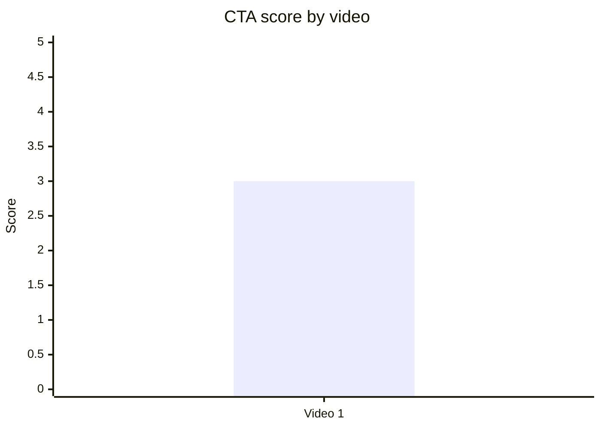

## 8.2. CTA count vs ER Public %

- Назва графіка: CTA count vs ER Public %
- Яке питання він відповідає: чи більше CTA пов’язано з кращим engagement.
- Які поля використовуються: `cta_count`, `er_public_percent`.
- Тип графіка: single-point scatter table.
- Що видно з графіка: `cta_count` = 7, ER Public = 3.1486%.
- Практичний висновок: причинний або статистичний зв’язок не визначається при n=1; якість CTA важливіша за кількість.

| Video | CTA count | ER Public % | Risk |
|---|---:|---:|---|
| Video 1 | 7 | 3.1486 | `PARTLY`: багато description/pinned/sponsor CTA, але немає discussion prompt. |

## 8.3. CTA features heatmap

- Назва графіка: CTA features heatmap
- Яке питання він відповідає: які CTA-функції присутні / відсутні.
- Які поля використовуються: `has_comment_prompt`, `has_subscribe_cta`, `has_like_cta`, `has_bell_cta`, `has_next_video_bridge`.
- Тип графіка: matrix heatmap.
- Що видно з графіка: strongest gap — відсутність engagement CTA.
- Практичний висновок: додати pinned question + explicit next video bridge.

| Video | Comment prompt | Subscribe | Like | Bell | Next video bridge |
|---|---|---|---|---|---|
| Video 1 | ❌ | ❌ | ❌ | ❌ | 🟨 `PARTLY_DESCRIPTION_ONLY` |

## 9. Графіки реклами / інтеграцій

Реклама виявлена: Ground News sponsor read + pinned/description repeats.

## 9.1. Ad load % by video

- Назва графіка: Ad load % by video
- Яке питання він відповідає: яке рекламне навантаження має відео.
- Які поля використовуються: `ad_load_percent`.
- Тип графіка: skipped.
- Що видно з графіка: `ad_load_percent = N/A`.
- Практичний висновок: без точного duration sponsor segment не можна оцінити ad load. Для майбутніх звітів потрібні exact ad start/end.

Advertising graph skipped: `ad_load_percent = N/A / NO_TIMECODES`.

| Video | Ad detected | Ad count | Ad load % | Reason graph skipped |
|---|---|---:|---|---|
| Video 1 | ✅ | 1 main sponsor + repeats | N/A | Немає exact ad duration. |

## 9.2. First ad position %

- Назва графіка: First ad position %
- Яке питання він відповідає: чи реклама стоїть занадто рано.
- Які поля використовуються: `first_ad_time`, `first_ad_relative_position_percent`.
- Тип графіка: skipped.
- Що видно з графіка: точний timestamp відсутній; відомо лише, що sponsor стоїть у intro block після hook.
- Практичний висновок: якісно реклама early, але quantitative chart неможливий.

| Video | First ad time | First ad relative position % | Qualitative timing |
|---|---|---:|---|
| Video 1 | `NO_TIMECODES` | N/A | Sponsor у intro block після hook, до повної story/value delivery. |

## 9.3. Ad integration score vs ER Public %

- Назва графіка: Ad integration score vs ER Public %
- Яке питання він відповідає: чи якість інтеграції пов’язана з реакцією аудиторії.
- Які поля використовуються: `ad_integration_score`, `er_public_percent`.
- Тип графіка: single-point scatter table.
- Що видно з графіка: ad integration score = 4.0, ER Public = 3.1486%.
- Практичний висновок: native fit хороший, але статистичний зв’язок не визначається.

| Video | Ad integration score | ER Public % | Interpretation |
|---|---:|---:|---|
| Video 1 | 4.0 | 3.1486 | Один кейс; зв’язок не обчислюється. |

## 10. Графіки аудіо

Аудіо-оцінка доступна, але confidence = `PARTIAL_DATA`.

## 10.1. Audio score by video

- Назва графіка: Audio score by video
- Яке питання він відповідає: яка загальна аудіо-оцінка.
- Які поля використовуються: `audio_score`.
- Тип графіка: Mermaid bar chart.
- Що видно з графіка: audio score = 4.0 / 5.
- Практичний висновок: аудіо не є головною слабкістю; ризик більше в cognitive/audio fatigue, ніж у технічній якості.

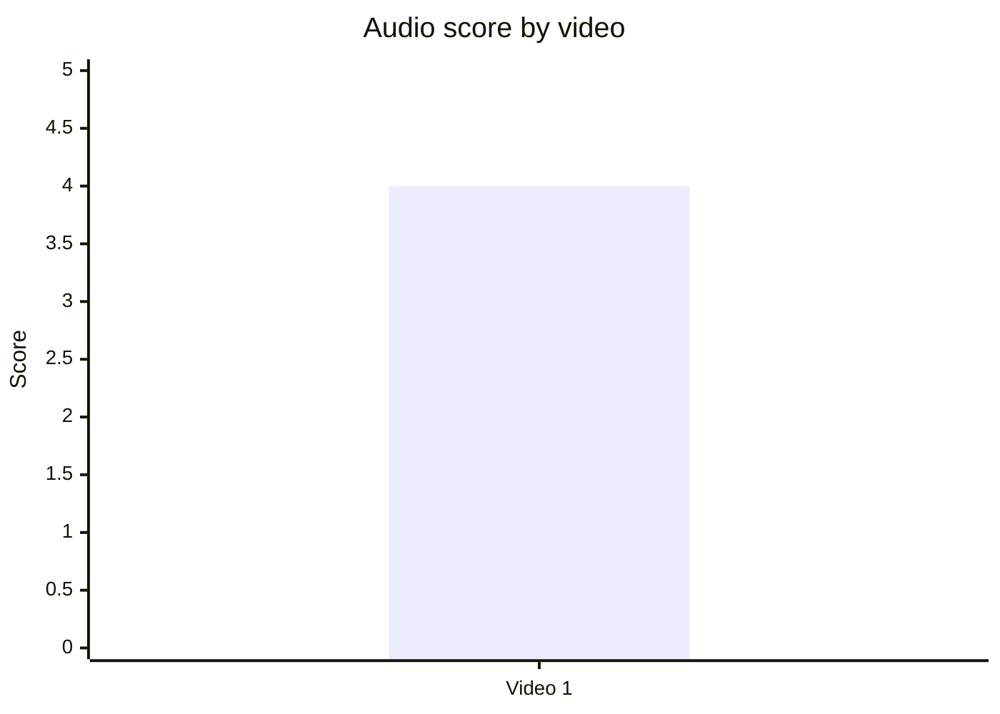

## 10.2. Audio score vs Overall Score

- Назва графіка: Audio score vs Overall Score
- Яке питання він відповідає: чи краща якість аудіо пов’язана із загальним балом.
- Які поля використовуються: `audio_score`, `overall_video_score`.
- Тип графіка: single-point scatter table.
- Що видно з графіка: audio score 4.0, overall 4.35.
- Практичний висновок: кореляція не обчислюється при n=1; аудіо не обмежує overall score у цьому кейсі.

| Video | Audio score | Overall score |
|---|---:|---:|
| Video 1 | 4.0 | 4.35 |

## 11. Графіки коментарів

## 11.1. Sentiment distribution

- Назва графіка: Sentiment distribution
- Яке питання він відповідає: як розподіляється реакція аудиторії.
- Які поля використовуються: `positive_percent`, `negative_percent`, `mixed_percent`, `neutral_percent`, `question_percent`, `request_percent`.
- Тип графіка: Mermaid pie chart + table.
- Що видно з графіка: найбільший клас — `NEUTRAL` / discussion, потім `NEGATIVE`, потім `QUESTION`.
- Практичний висновок: engagement значною мірою тримається на policy debate і clarification demand; потрібен pinned FAQ.

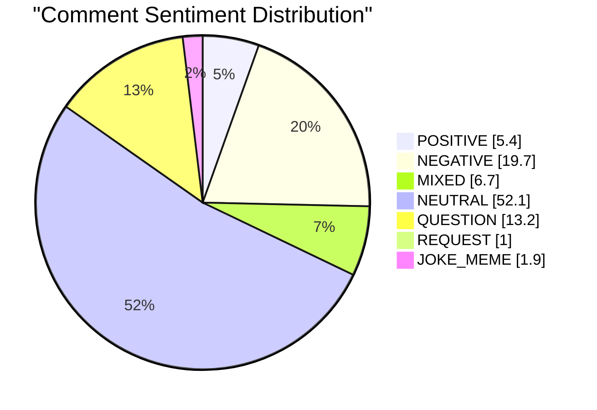

| Sentiment | Count | Percent |
|---|---:|---:|
| POSITIVE | 1,236 | 5.4% |
| NEGATIVE | 4,512 | 19.7% |
| MIXED | 1,544 | 6.7% |
| NEUTRAL | 11,929 | 52.1% |
| QUESTION | 3,014 | 13.2% |
| REQUEST | 231 | 1.0% |
| JOKE_MEME | 436 | 1.9% |

## 11.2. Comment resonance score by video

- Назва графіка: Comment resonance score by video
- Яке питання він відповідає: наскільки сильно відео викликало реакцію в коментарях.
- Які поля використовуються: `comment_resonance_score`.
- Тип графіка: Mermaid bar chart.
- Що видно з графіка: comment resonance = 4.5 / 5.
- Практичний висновок: коментарі — сильна сторона, але з високим ризиком confusion / polarization.

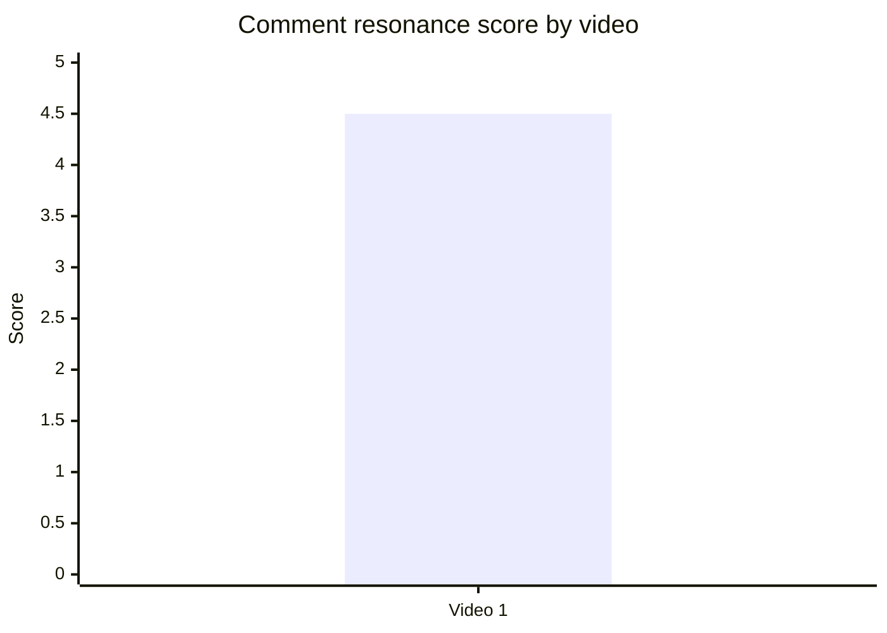

## 11.3. Top comment clusters

- Назва графіка: Top comment clusters
- Яке питання він відповідає: які теми найчастіше повторюються в коментарях.
- Які поля використовуються: cluster name, percent of relevant comments.
- Тип графіка: Mermaid horizontal alternative unavailable; використано xychart-beta bar.
- Що видно з графіка: найбільший кластер — general immigration debate / policy arguments.
- Практичний висновок: тема сама створює discussion engine, але потребує better moderation / FAQ / source framing.

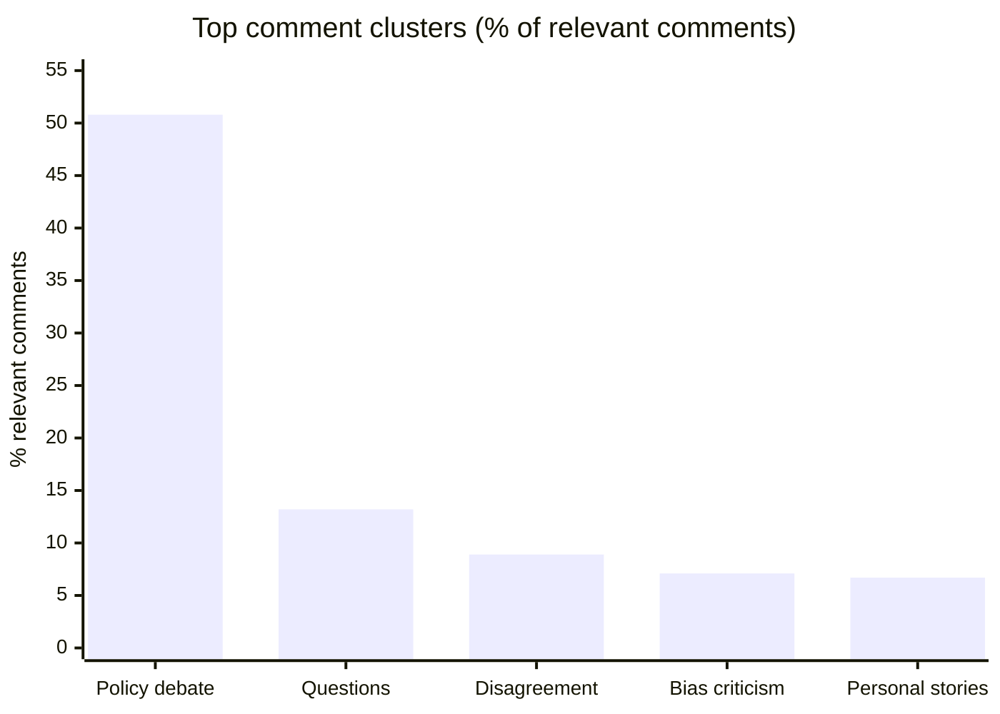

| Cluster | Topic label | Count | % of relevant comments |
|---|---|---:|---:|
| General immigration debate / policy arguments | COMMUNITY_DISCUSSION | 11,630 | 50.8% |
| Questions and clarification requests | QUESTION_CLARIFICATION | 3,014 | 13.2% |
| Disagreement with framing / law-and-order stance | DISAGREEMENT | 2,045 | 8.9% |
| Criticism of content / bias | CRITICISM_CONTENT | 1,633 | 7.1% |
| Personal stories / lived experience | PERSONAL_STORY | 1,544 | 6.7% |

## 12. Графіки score-системи

## 12.1. Overall score by video

- Назва графіка: Overall score by video
- Яке питання він відповідає: загальна оцінка відео.
- Які поля використовуються: `overall_video_score`.
- Тип графіка: Mermaid bar chart.
- Що видно з графіка: overall = 4.35 / 5.
- Практичний висновок: відео сильне як single-case benchmark, але ranking неможливий без інших звітів.

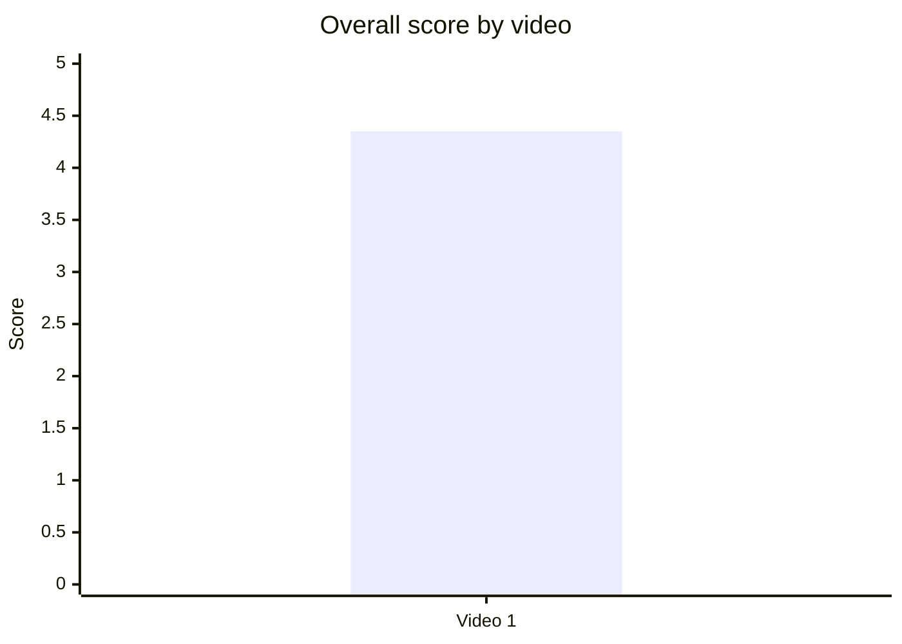

## 12.2. Score breakdown heatmap

- Назва графіка: Score breakdown heatmap
- Яке питання він відповідає: де сильні та слабкі сторони.
- Які поля використовуються: `hook_score`, `structure_score`, `value_density_score`, `audio_score`, `cta_score`, `ad_integration_score`, `comment_resonance_score`, `replicability_score`, `overall_video_score`.
- Тип графіка: score heatmap table.
- Що видно з графіка: найсильніші — hook і structure; найнижча оцінка — CTA.
- Практичний висновок: наступні тести мають не міняти core structure, а покращити CTA/comment management.

| Video | Hook | Structure | Value Density | Audio | CTA | Ad | Comments | Replicability | Overall |
|---|---:|---:|---:|---:|---:|---:|---:|---:|---:|
| Video 1 | 🟩 5.0 | 🟩 5.0 | 🟩 4.5 | 🟨 4.0 | 🟧 3.0 | 🟨 4.0 | 🟩 4.5 | 🟨 4.0 | 🟩 4.35 |

Legend: 🟩 = 4.5–5.0, 🟨 = 3.5–4.49, 🟧 = 2.5–3.49, 🟥 = <2.5.

## 12.3. Strengths vs weaknesses count

- Назва графіка: Strengths vs weaknesses count
- Яке питання він відповідає: скільки сильних механік і missed opportunities зафіксовано.
- Які поля використовуються: success mechanics count, missed opportunities count.
- Тип графіка: Mermaid bar chart.
- Що видно з графіка: 5 success mechanics і 5 missed opportunities у звіті.
- Практичний висновок: відео сильне, але має чіткий optimization backlog.

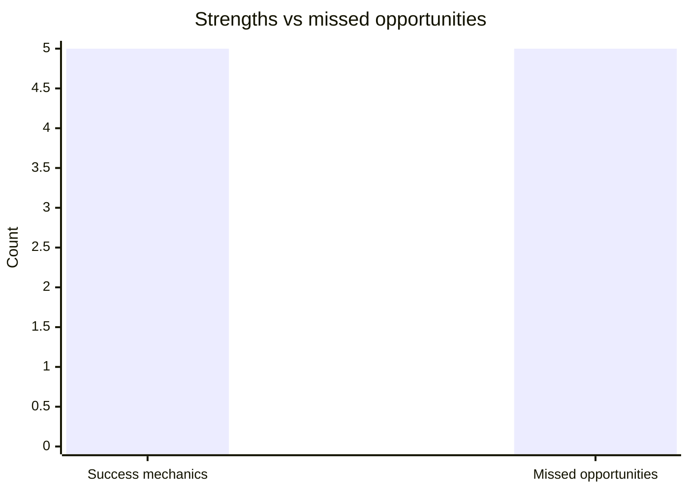

## 13. Кореляції та патерни

Correlation analysis skipped: fewer than 5 comparable videos.

| Pair | Correlation / Pattern | Strength | Interpretation | Confidence |
|---|---:|---|---|---|
| hook_score → overall_video_score | `INSUFFICIENT_DATA` | N/A | Є лише один кейс: hook 5.0 і overall 4.35, але зв’язок не обчислюється. | LOW |
| value_density_score → er_public_percent | `INSUFFICIENT_DATA` | N/A | Є лише один кейс: value density 4.5 і ER 3.1486%. | LOW |
| cta_score → comment_rate_percent | `INSUFFICIENT_DATA` | N/A | CTA score 3.0; comment rate 0.4099%; причинність не визначається. | LOW |
| comment_resonance_score → er_public_percent | `INSUFFICIENT_DATA` | N/A | Comment resonance 4.5; ER 3.1486%; порівняння потребує n≥5. | LOW |
| views_per_day → er_public_percent | `INSUFFICIENT_DATA` | N/A | Single-point quadrant, thresholds відсутні. | LOW |
| ad_load_percent → er_public_percent | `INSUFFICIENT_DATA` | N/A | `ad_load_percent = N/A`. | LOW |
| time_to_first_value_seconds → overall_video_score | `INSUFFICIENT_DATA` | N/A | `time_to_first_value_seconds` не витягнуто точно. | LOW |

## 14. Висновки для контент-стратегії

| Спостереження | Дані / графік | Що це означає | Що робити |
|---|---|---|---|
| Hook і структура — головні сильні сторони | Hook 5.0, Structure 5.0, Overall 4.35 | Data contradiction + human story працюють у цьому single-case звіті. | Тестувати старт із графіка/аномалії + ранній human anchor. |
| CTA — найслабший score-блок | CTA score 3.0; CTA features heatmap має ❌ для comment/sub/like/bell | Відео отримує коментарі органічно, але не керує дискусією. | Додати pinned comment із питанням + FAQ + clear watch-next bridge. |
| Коментарі сильні, але поляризовані | Comment resonance 4.5; 50.8% policy debate; 13.2% questions; 7.1% bias criticism | Debate підсилює engagement, але створює trust risk. | Для sensitive topics додавати “critics’ strongest argument” і source explainer. |
| Реклама інтегрована тематично, але timing неповний | Ad integration 4.0; ad load N/A; sponsor early in intro block | Native fit сильний, але ad placement може створювати friction. | В наступних тестах переносити sponsor після першого mini-payoff. |
| Аудіо не є головним bottleneck | Audio score 4.0; audio confidence PARTIAL_DATA | Якість достатня, але long-form density може втомлювати. | Додавати retention resets / breathers кожні 7–10 хв. |
| Даних замало для статистичних закономірностей | n=1 | Немає кореляцій, outlier detection або cohort ranking. | Додати 4+ звіти цього ж формату `LONG_20_PLUS_MIN`. |

## 15. Що тестувати далі

| Тест | Гіпотеза | На яких даних базується | Як виміряти | Пріоритет |
|---|---|---|---|---|
| Data contradiction hook | Початок із суперечності в даних підвищує curiosity gap. | Hook score 5.0; success mechanic `CLEAR_HOOK`. | Порівняти 5+ відео: hook type, early retention, views/day, ER. | HIGH |
| Human anchor before system explanation | Ранній герой допомагає тримати long-form policy тему. | Success mechanic `STRONG_STORY_STRUCTURE`; comment cluster personal stories 6.7%. | Для нових відео фіксувати `human_anchor_time_seconds` і overall/comment resonance. | HIGH |
| Pinned FAQ + comment prompt | Керований pinned comment зменшить confusion і підніме якість дискусії. | Missed opportunity `COMMENTS_SHOW_CONFUSION`; 13.2% questions. | Порівняти question cluster %, comment quality, pinned comment engagement. | HIGH |
| Sponsor after first payoff | Перенесення sponsor знизить early ad friction. | Missed opportunity `AD_TOO_EARLY`; ad timing qualitative only. | Виміряти retention before/after sponsor у власній аналітиці. | MEDIUM |
| Verbal next-video bridge | Явний end-screen bridge підвищить session depth. | `has_next_video_bridge = PARTLY_DESCRIPTION_ONLY`; missed opportunity `NO_NEXT_VIDEO_BRIDGE`. | CTR end screen, watch-next conversion, session time. | MEDIUM |
| Critics’ strongest argument segment | Включення опозиційного блоку знизить perceived bias. | 7.1% bias criticism; disagreement 8.9%. | Виміряти negative/bias cluster %, like rate, average sentiment. | HIGH |
| Retention reset every 7–10 minutes | Mini-payoffs знизять cognitive load у 45+ хв відео. | Value density 4.5; audio fatigue risk MEDIUM. | Owner-only retention graph; без нього — comments about pacing/over-editing. | MEDIUM |
| Source-first description strategy | Ранній source/FAQ block зменшить objections to stats. | Comments about sources/statistics; missed opportunity confusion. | Кількість source-demand comments на 1k comments. | MEDIUM |

## 16. Дані для експорту в таблицю / CSV

| video_label | title | format_group | views | views_per_day | like_rate_percent | comment_rate_percent | er_public_percent | views_per_1k_subs | hook_type | hook_score | cta_count | cta_score | ad_load_percent | ad_integration_score | audio_score | comment_resonance_score | overall_video_score | top_success_mechanic | top_missed_opportunity |
|---|---|---|---:|---:|---:|---:|---:|---:|---|---:|---:|---:|---:|---:|---:|---:|---:|---|---|
| Video 1 | Why the US is deporting so many people | LONG_20_PLUS_MIN | 5757554 | 28502.74 | 2.7387 | 0.4099 | 3.1486 | 746.7645 | CURIOSITY_GAP | 5.0 | 7 | 3.0 | N/A | 4.0 | 4.0 | 4.5 | 4.35 | CLEAR_HOOK | COMMENTS_SHOW_CONFUSION |
