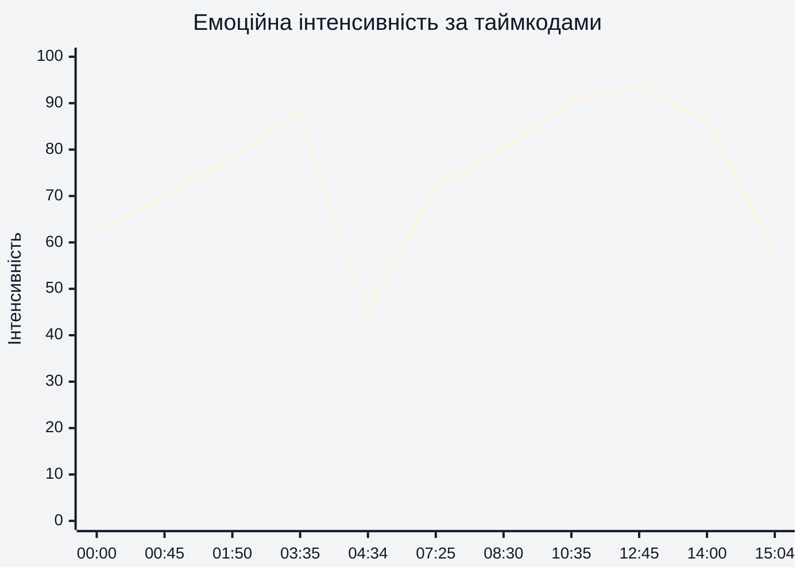
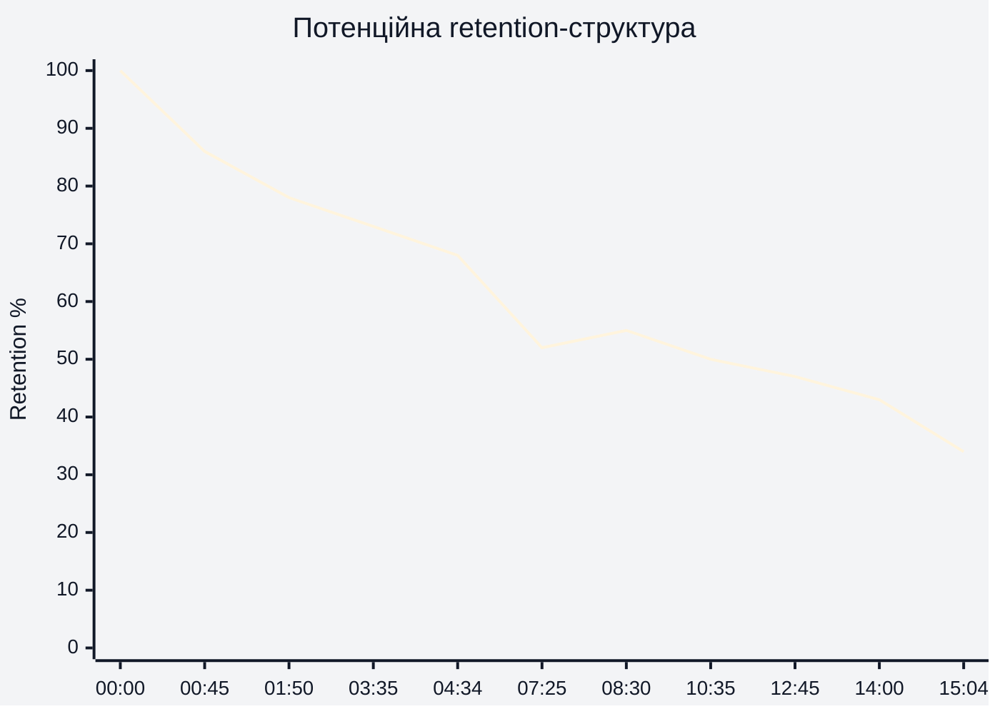
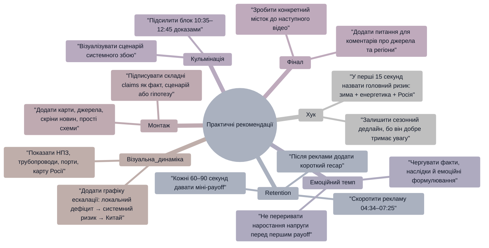

# Аналіз довгоформатного YouTube-відео

**Відео:** `Something BIG is Breaking in Russia Right Now`  
**Тривалість:** `15:04`  
**Формат:** довгоформатне YouTube-відео  
**Примітка щодо retention:** реальні retention-дані або скріншот YouTube Studio не надано, тому нижче використано **потенційну retention-структуру**, побудовану за сценарними подіями, темпом і таймкодами відео. Це не реальні дані YouTube Analytics.

## 1. Сюжетна дуга (Narrative Arc)

```mermaid
%%{init: {'theme':'base', 'themeVariables': {
'primaryColor':'#f3f4f6',
'primaryTextColor':'#111827',
'primaryBorderColor':'#2563eb',
'lineColor':'#2563eb',
'secondaryColor':'#ffffff',
'tertiaryColor':'#f3f4f6',
'background':'#f3f4f6'
}}}%%
flowchart LR
    A["00:00–00:45<br/>Хук<br/>Зима наближається, Росія вразлива до холодного сезону"] -->
    B["00:45–01:50<br/>Експозиція<br/>Перед зимою зростає роль ударів по енергетичній інфраструктурі"] -->
    C["01:50–03:35<br/>Перша ескалація<br/>Україна б'є по НПЗ, трубопроводах і портовій енергологістиці"] -->
    D["03:35–04:34<br/>Переломний момент<br/>Дефіцит пального, черги, раціонування і пріоритет армії"] -->
    E["04:34–07:25<br/>Наростання напруги перервано<br/>Рекламна інтеграція Incogni тимчасово знижує драматичний темп"] -->
    F["07:25–10:35<br/>Наростання напруги<br/>Зима, логістика, опалення і ризик системної енергетичної кризи"] -->
    G["10:35–14:00<br/>Кульмінація<br/>Ризик довгострокового пошкодження інфраструктури та залежність від Китаю"] -->
    H["14:00–15:04<br/>Розв'язка і фінальний висновок<br/>Іронія: енергетична зброя Росії повертається проти неї, далі CTA"]
```

Графік показує, що відео має чітку сюжетну дугу: від сезонного хука `00:00–00:45` до системного геополітичного payoff у блоці `10:35–14:00`. Найсильніше драматичне наростання відбувається після рекламної інтеграції, коли автор повертається до теми зимової енергетичної вразливості `07:25–10:35`.

## 2. Ключові Story Beats

```mermaid
%%{init: {'theme':'base', 'themeVariables': {
'primaryColor':'#f3f4f6',
'primaryTextColor':'#111827',
'primaryBorderColor':'#2563eb',
'lineColor':'#2563eb',
'secondaryColor':'#ffffff',
'tertiaryColor':'#f3f4f6',
'background':'#f3f4f6'
}}}%%
flowchart LR
    B1["00:00<br/>Кінець серпня<br/>Функція: сезонний дедлайн"] -->
    B2["00:25<br/>Зима в Росії<br/>Функція: підняти ставки"] -->
    B3["00:55<br/>Удари по енергетиці<br/>Функція: пояснити контекст війни"] -->
    B4["01:35<br/>Україна діє агресивніше<br/>Функція: показати новизну"] -->
    B5["02:10<br/>НПЗ, порти, трубопроводи<br/>Функція: конкретизувати проблему"] -->
    B6["03:35<br/>Черги й раціонування<br/>Функція: перший великий payoff"] -->
    B7["04:34<br/>Реклама Incogni<br/>Функція: монетизаційна пауза"] -->
    B8["07:25<br/>Повернення до зими<br/>Функція: відновити головну напругу"] -->
    B9["08:30<br/>Історичний приклад після СРСР<br/>Функція: доказова аналогія"] -->
    B10["10:35<br/>Ризик замороження інфраструктури<br/>Функція: системна ескалація"] -->
    B11["12:45<br/>Китай як вигодонабувач<br/>Функція: геополітичний масштаб"] -->
    B12["14:40<br/>Лайк, підписка, наступне відео<br/>Функція: фінальна конверсія"]
```

Story beats тримаються на моделі “дедлайн → загроза → конкретні наслідки → системний ризик → геополітичний payoff”. Найважливіші точки для утримання уваги: `03:35`, де абстрактна тема переходить у побутовий дефіцит пального, і `12:45`, де локальна проблема піднімається до рівня Китаю та енергетичної залежності.

## 3. Емоційний темп

Графік показує сценарну емоційну інтенсивність, а не реальну retention-метрику. Пік напруги формується в зоні `10:35–12:45`, де автор переходить від локальних дефіцитів до ризику довгострокового пошкодження енергетичної системи. Найсильніше падіння інтенсивності припадає на `04:34–07:25`, бо рекламна інтеграція перериває основну сюжетну лінію.

## 4. Утримання аудиторії

Це прогнозована retention-крива, бо реальні retention-дані не надано. Потенційно найсильніша зона утримання — `00:00–03:35`, де є хук, контекст і перший конкретний payoff про удари по енергетичній інфраструктурі. Найризикованіша зона — `04:34–07:25`, тому що довга рекламна інтеграція може спричинити помітний спад уваги до повернення в основну тему.

## 5. Піки retention

| Таймкод | Подія | Чому це може утримувати увагу | Сила піку 1–10 |
|---|---|---|---:|
| `00:00–00:45` | Хук про кінець серпня, вересень і наближення зими | Сезонний дедлайн швидко створює urgency і відповідає назві відео про “щось велике” | 8 |
| `01:50–03:35` | Перехід до НПЗ, портів, трубопроводів і повторних ударів | Абстрактна геополітика стає конкретною: є об’єкти, механіка ударів і наслідки | 8 |
| `03:35–04:34` | Черги за пальним, раціонування, військовий пріоритет ресурсу | Побутовий наслідок робить тему ближчою для глядача й підвищує драматичну ставку | 9 |
| `08:30–10:35` | Приклад після розпаду СРСР і пошкодження інфраструктури в холодний період | Історична аналогія додає відчуття масштабу та пояснює, чому зима є не просто фоном | 8 |
| `10:35–12:45` | Сценарій довгострокового пошкодження енергетичної системи | Це головна системна ескалація: проблема може стати не короткою кризою, а структурним ударом | 9 |
| `12:45–14:00` | Китай як потенційний вигодонабувач слабкості Росії | Дає другий рівень payoff: криза впливає не лише на Росію й Україну, а й на глобальні відносини | 8 |
| `14:00–14:40` | Фінальна іронія про енергетичну зброю Росії | Емоційне закриття підсилює запам’ятовуваність і завершує сюжетну дугу | 7 |

## 6. Провали retention

| Таймкод | Проблема | Ймовірна причина спаду | Що покращити |
|---|---|---|---|
| `04:34–07:25` | Довга рекламна інтеграція Incogni | Основна історія про Росію й енергетику переривається майже на три хвилини | Скоротити інтеграцію до `60–90` секунд або перенести після першого великого payoff `07:25–08:30` |
| `07:25–08:30` | Повернення після реклами потребує повторного входу в тему | Частина глядачів могла втратити контекст після рекламної паузи | Додати короткий recap на `1` речення: “Повертаємось до головного: зима робить дефіцит пального критичним” |
| `08:30–10:35` | Історичний приклад може здатися неперевіреним | У відео немає видимого джерела або графічного доказу для складного твердження | Додати on-screen джерело, карту або коротку вставку з документом/датою |
| `10:35–12:45` | Сценарій стає більш спекулятивним | Глядачі можуть сприйняти прогноз як перебільшення без доказів | Розділити блок на “що вже сталося”, “що можливо”, “що є гіпотезою” |
| `14:40–15:04` | Фінальний CTA загальний | Заклик до перегляду наступного відео не називає конкретне наступне відео або причину переходу | Дати конкретний місток: “Далі подивіться розбір Flamingo, бо він пояснює, як Україна може бити глибше” |

## 7. Оцінка сегментів

| Сегмент | Таймкод | Функція | Емоційна інтенсивність | Ризик втрати уваги | Оцінка 1–10 | Що покращити |
|---|---|---|---:|---|---:|---|
| Хук | `00:00–00:45` | Захопити увагу через зиму й дедлайн | 70 | Низький | 8 | Ще швидше назвати головний конфлікт у перші `15` секунд |
| Експозиція | `00:45–01:50` | Пояснити, чому енергетичні удари важливі перед зимою | 76 | Низький | 8 | Додати просту карту або список типів цілей на екрані |
| Перша ескалація | `01:50–03:35` | Показати конкретні об’єкти ударів: НПЗ, порти, трубопроводи | 84 | Середній | 8 | Підкріпити кожен тип цілі коротким джерелом або візуальним доказом |
| Перший payoff | `03:35–04:34` | Показати наслідок: дефіцит, черги, раціонування | 88 | Середній | 8 | Розділити факти й припущення, щоб зменшити недовіру |
| Реклама | `04:34–07:25` | Монетизація через sponsor read | 45 | Високий | 5 | Скоротити, зробити нативніший перехід або поставити після основного payoff |
| Повернення до теми | `07:25–08:30` | Відновити головну лінію про зиму, логістику й побутові потреби | 72 | Середній | 7 | Додати короткий recap після реклами |
| Історична аналогія | `08:30–10:35` | Пояснити ризик замороження інфраструктури через приклад після СРСР | 80 | Середній | 7 | Додати джерело/дату/візуалізацію, бо твердження складне |
| Системна ескалація | `10:35–12:45` | Показати, як локальна криза може стати довгостроковою | 90 | Середній | 8 | Чітко маркувати “факт”, “ймовірний сценарій”, “ризик” |
| Геополітичний payoff | `12:45–14:00` | Підняти тему до Китаю, трубопроводів і енергетичної залежності | 94 | Середній | 8 | Додати просту схему “Росія → Китай → ціна → залежність” |
| Розв’язка | `14:00–14:40` | Закрити історію через іронію енергетичної зброї | 86 | Низький | 8 | Залишити, але зробити фінальну тезу ще коротшою і різкішою |
| CTA | `14:40–15:04` | Лайк, підписка, підтримка, наступне відео | 58 | Середній | 6 | Додати конкретний comment prompt і конкретний next-video bridge |

## 8. Практичні рекомендації

## 9. Підсумкова оцінка

| Показник | Оцінка 1–10 | Коментар |
|---|---:|---|
| Сюжетна дуга | 8 | Відео має сильну дугу `00:00–15:04`: зима → удари → дефіцит → системний ризик → Китай → іронічний фінал. |
| Story Beats | 8 | Є 12 чітких beats, найсильніші — `03:35` про дефіцит пального і `12:45` про Китай як другий рівень payoff. |
| Емоційний темп | 7 | Темп добре зростає до `03:35`, але падає на рекламному блоці `04:34–07:25`; після `07:25` напруга відновлюється. |
| Retention Structure | 7 | Потенційно сильний старт і середина, але найбільший ризик retention — довга реклама перед основною системною кульмінацією. |
| Загальна оцінка | 7.5 | Сильна тема, чіткий narrative arc і високий потенціал утримання, але потрібні коротша інтеграція, більше візуальних доказів і конкретніший фінальний CTA. |
