# Статистичний аналіз відеозвітів

## 1. Короткий executive summary

| Пункт | Висновок |
|---|---|
| Скільки відео проаналізовано | 1 |
| Скільки форматів відео | 1: `LONG_10_20_MIN` |
| Найсильніше відео за overall score | `Video 1` — 3.7/5 |
| Найсильніше відео за ER Public % | `Video 1` — 5.39% |
| Найсильніше відео за views per day | `Video 1` — 3527.66 |
| Найсильніша повторювана механіка | `INSUFFICIENT_DATA` для повторюваності; у цьому відео: `TIMELY_TOPIC`, `CLEAR_HOOK`, `CONTROVERSY_OR_DEBATE` |
| Найчастіша слабкість | `INSUFFICIENT_DATA` для повторюваності; у цьому відео: `COMMENTS_SHOW_TOPIC_GAP`, `AD_TOO_LONG`, `NO_COMMENT_PROMPT` |
| Головна стратегічна можливість | Повторити структуру “timely topic + curiosity gap + системний ризик”, але додати source cards, коротшу рекламу й конкретний comment prompt |
| Рівень впевненості | `LOW_CONFIDENCE` — доступний лише 1 comparable report; кореляції та статистичні порівняння не будуються |

## 2. Якість і повнота даних

| Поле | Кількість відео з даними | Кількість N/A | Коментар |
|---|---:|---:|---|
| views | 1 | 0 | Public metric доступна |
| likes | 1 | 0 | Public metric доступна |
| comments_count | 1 | 0 | Public metric доступна; є розбіжність із parsed comments |
| views_per_day | 1 | 0 | Розраховано в YT_VIDEO_ANALYSIS_V1 |
| er_public_percent | 1 | 0 | Розраховано в YT_VIDEO_ANALYSIS_V1 |
| views_per_1k_subs | 1 | 0 | Розраховано, бо subscribers доступні |
| hook_score | 1 | 0 | Score доступний |
| cta_score | 1 | 0 | Score доступний |
| ad_integration_score | 1 | 0 | Score доступний |
| audio_score | 1 | 0 | Audio було надано у mp4 |
| comment_resonance_score | 1 | 0 | Score доступний |
| overall_video_score | 1 | 0 | Score доступний |

### Обмеження аналізу

- `LOW_CONFIDENCE`: доступне лише 1 відео, тому немає статистичного порівняння між відео.
- Correlation analysis skipped: fewer than 5 comparable videos.
- `PARTIAL_DATA`: report містить flags `NO_TIMECODES`, `PARTIAL_COMMENT_COVERAGE`, `PUBLIC_METRICS_ONLY`, `OWNER_ONLY_METRICS_NOT_PROVIDED`, `METRIC_SOURCE_DISCREPANCY`.
- CTR, impressions, retention, watch time, average view duration, traffic sources і subscribers gained не використовуються, бо вони `OWNER_ONLY`.

## 3. Підготовлена таблиця для графіків

| Video | Format | Views | Likes | Comments | Views/day | Like Rate % | Comment Rate % | ER Public % | Views/1k subs | Hook | CTA | Ad | Audio | Comment Resonance | Overall |
|---|---|---:|---:|---:|---:|---:|---:|---:|---:|---:|---:|---:|---:|---:|---:|
| Video 1 | `LONG_10_20_MIN` | 931,302 | 46,412 | 3,751 | 3,527.66 | 4.98 | 0.40 | 5.39 | 2,282.60 | 0 | 0 | 0 | 4 | 0 | 0 |

| Label | Full title | URL |
|---|---|---|
| Video 1 | Something BIG is Breaking in Russia Right Now | `https://www.youtube.com/watch?v=N26m1hq60k0` |

## 4. Рекомендовані графіки

| # | Назва графіка | Тип графіка | Поля | Для чого потрібен | Пріоритет |
|---:|---|---|---|---|---|
| 1 | Overall score by video | Mermaid bar chart | `overall_video_score` | Показати загальний score доступного відео | HIGH |
| 2 | Views per day by video | Mermaid bar chart | `views_per_day` | Показати швидкість набору переглядів | HIGH |
| 3 | ER Public % by video | Mermaid bar chart | `er_public_percent` | Показати normalized engagement | HIGH |
| 4 | Score breakdown heatmap | Matrix table | scores 1–5 | Побачити сильні/слабкі блоки | HIGH |
| 5 | CTA features heatmap | Matrix table | CTA flags | Побачити наявні/відсутні CTA | HIGH |
| 6 | Sentiment distribution | Mermaid pie chart + table | sentiment counts | Показати структуру реакції коментарів | HIGH |
| 7 | Ad load by video | Mermaid bar chart | `ad_load_percent` | Оцінити рекламне навантаження | HIGH |
| 8 | Performance quadrant | Table / not true scatter | `views_per_day`, `er_public_percent` | Для 1 відео — лише позиціонування без порівняння | MEDIUM |
| 9 | CTA count vs ER Public % | Table / not true scatter | `cta_count`, `er_public_percent` | Для 1 відео — без висновку про зв’язок | MEDIUM |
| 10 | Audio score vs Overall Score | Table / not true scatter | `audio_score`, `overall_video_score` | Для 1 відео — без висновку про зв’язок | LOW |

## 5. Графіки продуктивності

## 5.1. Views by video

- Назва графіка: Views by video
- Яке питання він відповідає: яке відео має найбільший raw reach?
- Які поля використовуються: `video_label`, `views`
- Тип графіка: Mermaid bar chart
- Що видно з графіка: доступне лише одне відео з 931,302 views.
- Практичний висновок: raw reach високий у межах одного прикладу, але без інших відео не можна визначити outlier статистично.

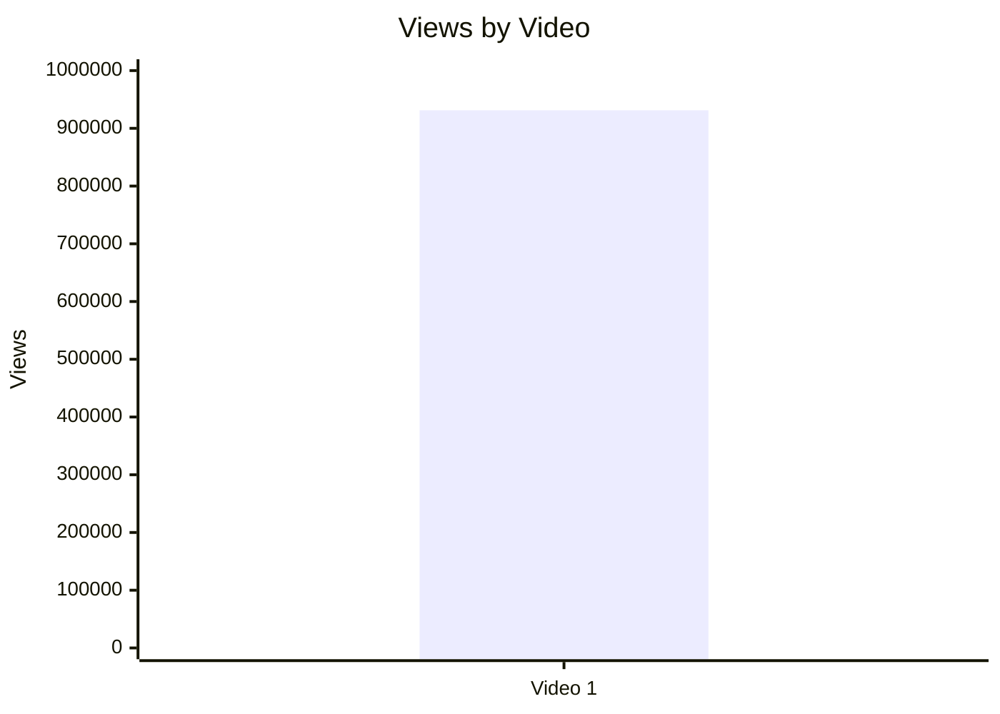
```mermaid
xychart-beta
    title "Views by Video"
    x-axis ["Video 1"]
    y-axis "Views" 0 --> 1000000
    bar [931302]
```

## 5.2. Views per day by video

- Назва графіка: Views per day by video
- Яке питання він відповідає: яка швидкість набору переглядів із урахуванням віку відео?
- Які поля використовуються: `video_label`, `views_per_day`
- Тип графіка: Mermaid bar chart
- Що видно з графіка: `Video 1` має 3,527.66 views/day.
- Практичний висновок: normalized reach можна використовувати як baseline для наступних відео у тій самій когорті `LONG_10_20_MIN`.

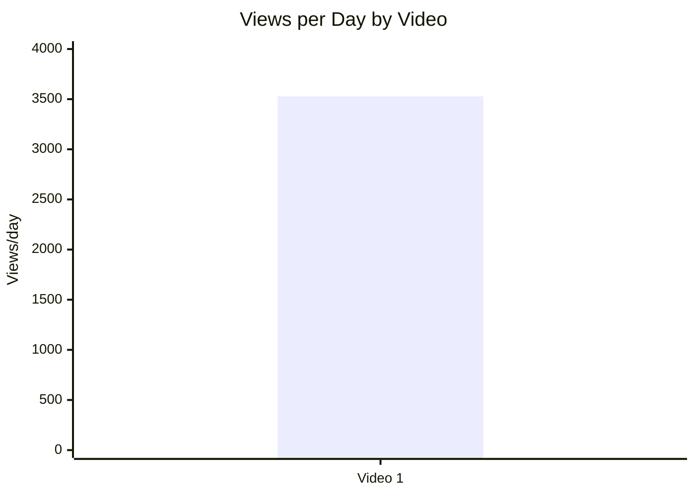
```mermaid
xychart-beta
    title "Views per Day by Video"
    x-axis ["Video 1"]
    y-axis "Views/day" 0 --> 4000
    bar [3527.66]
```

## 5.3. Views per 1k subscribers

- Назва графіка: Views per 1k subscribers
- Яке питання він відповідає: наскільки ефективно відео конвертує розмір каналу в перегляди?
- Які поля використовуються: `video_label`, `views_per_1k_subs`
- Тип графіка: Mermaid bar chart
- Що видно з графіка: `Video 1` має 2,282.60 views per 1k subs.
- Практичний висновок: показник варто порівнювати з наступними long-form відео цього каналу; зараз це одиничний baseline.

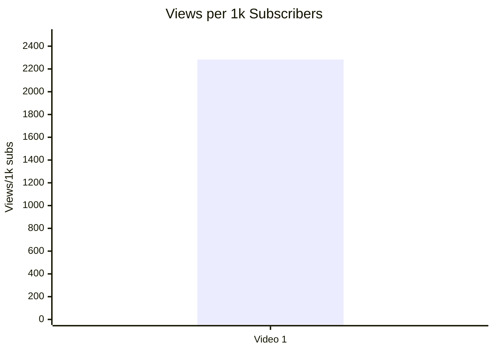
```mermaid
xychart-beta
    title "Views per 1k Subscribers"
    x-axis ["Video 1"]
    y-axis "Views/1k subs" 0 --> 2500
    bar [2282.6]
```

## 5.4. Performance quadrant

- Назва графіка: Performance quadrant
- Яке питання він відповідає: де відео розташоване за балансом reach і engagement?
- Які поля використовуються: `views_per_day`, `er_public_percent`
- Тип графіка: таблиця позиціонування; scatter quadrant `INSUFFICIENT_DATA` для одного відео
- Що видно з графіка: є одна точка: 3,527.66 views/day і 5.39% ER Public.
- Практичний висновок: немає медіан по когорті, тому quadrant label не присвоюється.

| Video | Views/day | ER Public % | Quadrant |
|---|---:|---:|---|
| Video 1 | 3527.66 | 5.39 | `NOT_COMPARABLE` — немає cohort median / інших відео |

## 6. Графіки залучення

## 6.1. ER Public % by video

- Назва графіка: ER Public % by video
- Яке питання він відповідає: яке normalized engagement має відео?
- Які поля використовуються: `video_label`, `er_public_percent`
- Тип графіка: Mermaid bar chart
- Що видно з графіка: ER Public = 5.39%.
- Практичний висновок: показник варто трекати для наступних відео; без benchmark не називати “добрим” або “поганим”.

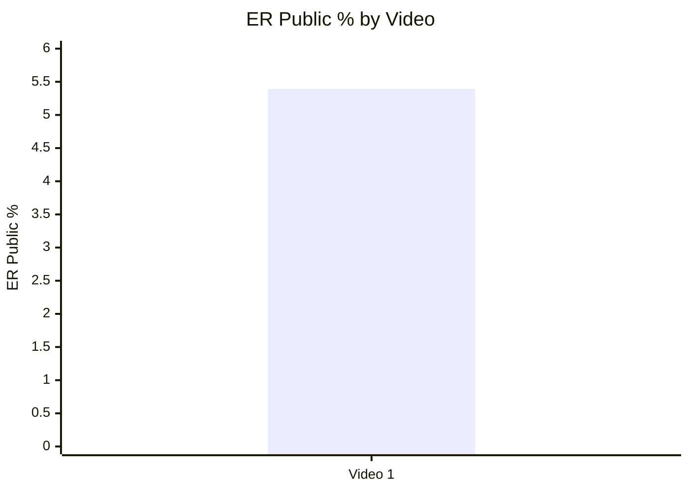
```mermaid
xychart-beta
    title "ER Public % by Video"
    x-axis ["Video 1"]
    y-axis "ER Public %" 0 --> 6
    bar [5.39]
```

## 6.2. Like Rate % vs Comment Rate %

- Назва графіка: Like Rate % vs Comment Rate %
- Яке питання він відповідає: engagement більше схожий на approval чи discussion?
- Які поля використовуються: `like_rate_percent`, `comment_rate_percent`
- Тип графіка: таблиця для scatter plot; true scatter comparison `INSUFFICIENT_DATA`
- Що видно з графіка: like rate 4.98%, comment rate 0.40%.
- Практичний висновок: відео має сильніший сигнал лайків, ніж коментарів у відсотках; але абсолютна кількість коментарів висока.

| Video | Like Rate % | Comment Rate % | Interpretation |
|---|---:|---:|---|
| Video 1 | 4.98 | 0.4 | Approval signal stronger than comment-rate signal; controversy still visible in comment clusters |

## 6.3. Comments per 1k views

- Назва графіка: Comments per 1k views
- Яке питання він відповідає: скільки коментарів генерує кожна 1,000 views?
- Які поля використовуються: `comments_per_1k_views`
- Тип графіка: Mermaid bar chart
- Що видно з графіка: 4.03 comments per 1k views.
- Практичний висновок: це baseline для оцінки майбутніх відео з подібною темою.

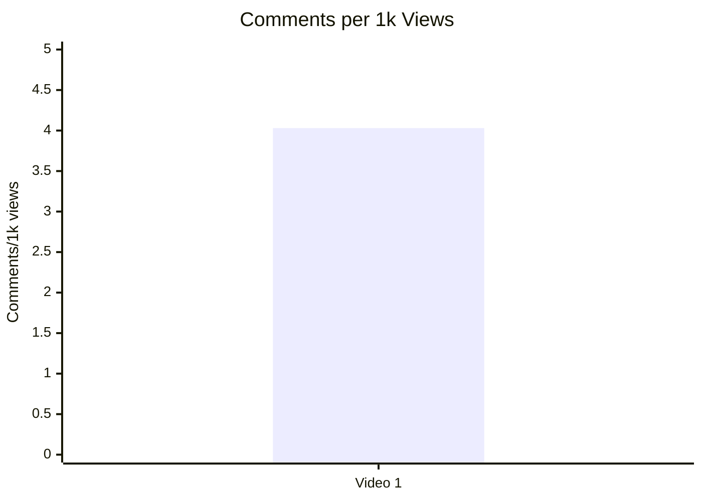
```mermaid
xychart-beta
    title "Comments per 1k Views"
    x-axis ["Video 1"]
    y-axis "Comments/1k views" 0 --> 5
    bar [4.03]
```

## 7. Графіки структури та hook

## 7.1. Hook score by video

- Назва графіка: Hook score by video
- Яке питання він відповідає: наскільки сильний hook у відео?
- Які поля використовуються: `hook_score`
- Тип графіка: Mermaid bar chart
- Що видно з графіка: hook score = 4/5.
- Практичний висновок: hook є одним із сильних елементів; варто повторювати curiosity gap + seasonal urgency.

```mermaid
xychart-beta
    title "Hook Score by Video"
    x-axis ["Video 1"]
    y-axis "Score" 0 --> 5
    bar [4]
```

## 7.2. Hook type distribution

- Назва графіка: Hook type distribution
- Яке питання він відповідає: які hook types присутні у вибірці?
- Які поля використовуються: `hook_primary_type`
- Тип графіка: Mermaid pie chart
- Що видно з графіка: 1 відео використовує primary hook `CURIOSITY_GAP`.
- Практичний висновок: неможливо сказати, який hook type працює краще; можна лише зафіксувати тип для майбутньої бази.

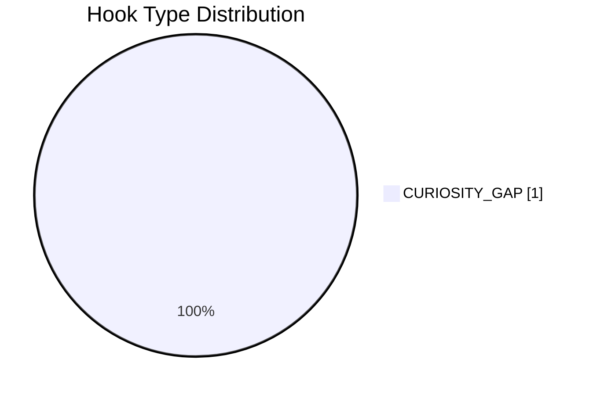
```mermaid
pie showData
    title Hook Type Distribution
    "CURIOSITY_GAP" : 1
```

## 7.3. Time to first value vs Overall Score

- Назва графіка: Time to first value vs Overall Score
- Яке питання він відповідає: чи швидша перша цінність пов’язана з overall score?
- Які поля використовуються: `time_to_first_value`, `overall_video_score`
- Тип графіка: `INSUFFICIENT_DATA`
- Що видно з графіка: `time_to_first_value` має приблизний діапазон `NO_TIMECODES_APPROX_01:50_03:35`, не точне число.
- Практичний висновок: для наступних аналізів потрібні точні timestamps у секундах.

| Video | time_to_first_value | overall_video_score | Status |
|---|---|---:|---|
| Video 1 | `NO_TIMECODES_APPROX_01:50_03:35` | 3.7 | `INSUFFICIENT_DATA` for scatter |

## 8. Графіки CTA

## 8.1. CTA score by video

- Назва графіка: CTA score by video
- Яке питання він відповідає: наскільки сильна CTA-система?
- Які поля використовуються: `cta_score`
- Тип графіка: Mermaid bar chart
- Що видно з графіка: CTA score = 3/5.
- Практичний висновок: CTA є, але немає comment prompt і bell CTA; є room for improvement.

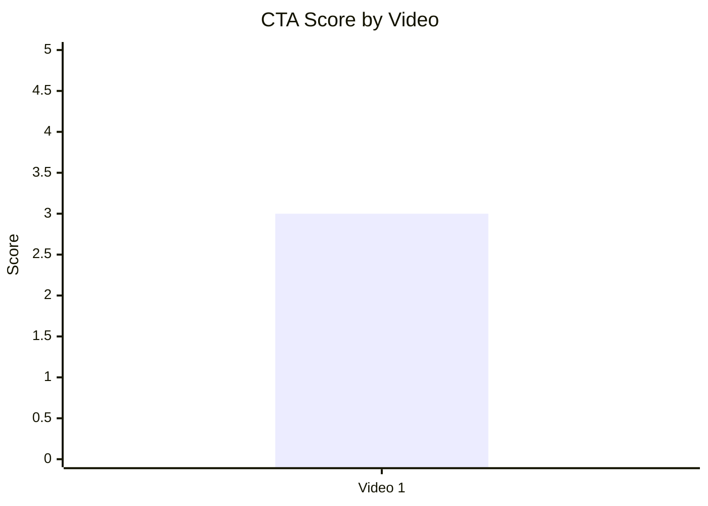
```mermaid
xychart-beta
    title "CTA Score by Video"
    x-axis ["Video 1"]
    y-axis "Score" 0 --> 5
    bar [3]
```

## 8.2. CTA count vs ER Public %

- Назва графіка: CTA count vs ER Public %
- Яке питання він відповідає: чи більше CTA пов’язано з кращим engagement?
- Які поля використовуються: `cta_count`, `er_public_percent`
- Тип графіка: таблиця для scatter; correlation skipped
- Що видно з графіка: 7 CTA placements/types detected, ER Public = 5.39%.
- Практичний висновок: не можна робити висновок про зв’язок; окремо видно ризик CTA/ad overload через довгу рекламу й багато description links.

| Video | CTA count | ER Public % | Interpretation |
|---|---:|---:|---|
| Video 1 | 7 | 5.39 | `NOT_COMPARABLE`; CTA count includes sponsor/support/watch-next items |

## 8.3. CTA features heatmap

- Назва графіка: CTA features heatmap
- Яке питання він відповідає: які CTA-функції присутні або відсутні?
- Які поля використовуються: `has_comment_prompt`, `has_subscribe_cta`, `has_like_cta`, `has_bell_cta`, `has_next_video_bridge`
- Тип графіка: heatmap / matrix
- Що видно з графіка: є subscribe, like, next-video bridge; немає comment prompt і bell CTA.
- Практичний висновок: найбільша CTA-можливість — додати структурований comment prompt.

| Video | Comment prompt | Subscribe | Like | Bell | Next video bridge |
|---|---|---|---|---|---|
| Video 1 | ❌ | ✅ | ✅ | ❌ | ✅ |

## 9. Графіки реклами / інтеграцій

## 9.1. Ad load % by video

- Назва графіка: Ad load % by video
- Яке питання він відповідає: яке рекламне навантаження має відео?
- Які поля використовуються: `ad_load_percent`
- Тип графіка: Mermaid bar chart
- Що видно з графіка: ad load = 18.9%.
- Практичний висновок: це потенційна слабкість; у звіті вона позначена як `AD_TOO_LONG`.

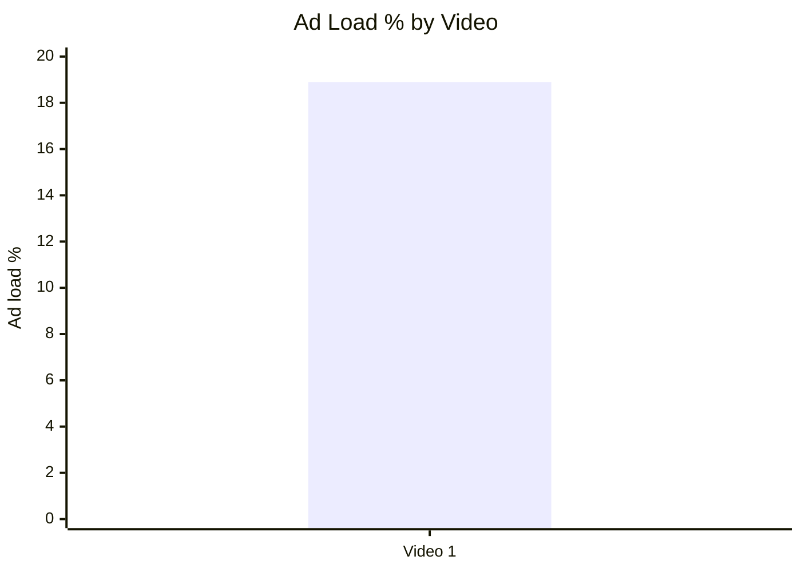
```mermaid
xychart-beta
    title "Ad Load % by Video"
    x-axis ["Video 1"]
    y-axis "Ad load %" 0 --> 20
    bar [18.9]
```

## 9.2. First ad position %

- Назва графіка: First ad position %
- Яке питання він відповідає: наскільки рано починається перша реклама?
- Які поля використовуються: `first_ad_relative_position_percent`
- Тип графіка: Mermaid bar chart
- Що видно з графіка: перший major sponsor read приблизно на 30.3% відео.
- Практичний висновок: реклама не стоїть перед hook, але з’являється до main payoff; варто тестувати placement після сильнішого payoff.

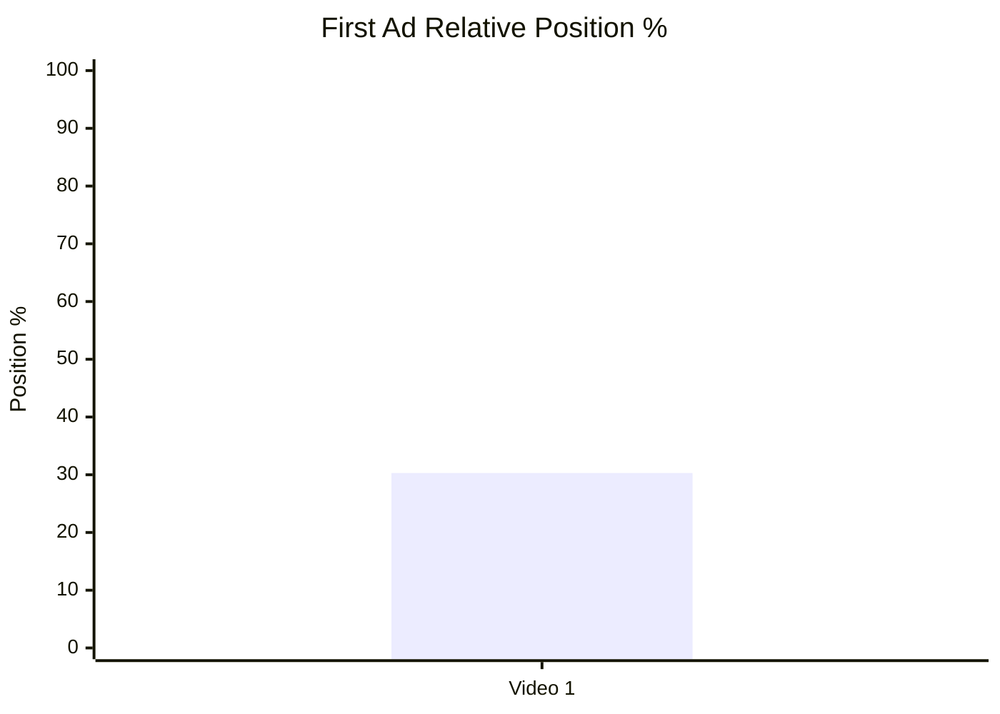
```mermaid
xychart-beta
    title "First Ad Relative Position %"
    x-axis ["Video 1"]
    y-axis "Position %" 0 --> 100
    bar [30.3]
```

## 9.3. Ad integration score vs ER Public %

- Назва графіка: Ad integration score vs ER Public %
- Яке питання він відповідає: чи якість інтеграції пов’язана з engagement?
- Які поля використовуються: `ad_integration_score`, `er_public_percent`
- Тип графіка: таблиця для scatter; correlation skipped
- Що видно з графіка: ad integration score = 2/5, ER Public = 5.39%.
- Практичний висновок: неможливо оцінити зв’язок; але report already flags sponsor fit/duration as weakness.

| Video | Ad integration score | ER Public % | Status |
|---|---:|---:|---|
| Video 1 | 2 | 5.39 | `NOT_COMPARABLE` |

## 10. Графіки аудіо

## 10.1. Audio score by video

- Назва графіка: Audio score by video
- Яке питання він відповідає: яка оцінка аудіо?
- Які поля використовуються: `audio_score`
- Тип графіка: Mermaid bar chart
- Що видно з графіка: audio score = 4/5.
- Практичний висновок: audio не є головним bottleneck; головні ризики — sourcing і ad load.

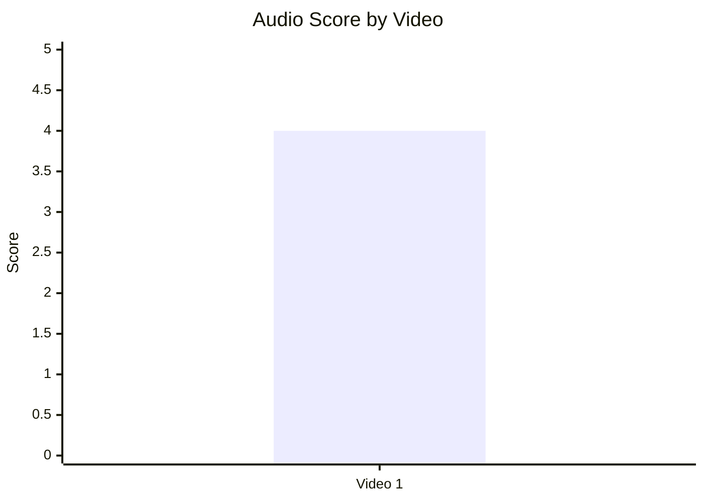
```mermaid
xychart-beta
    title "Audio Score by Video"
    x-axis ["Video 1"]
    y-axis "Score" 0 --> 5
    bar [4]
```

## 10.2. Audio score vs Overall Score

- Назва графіка: Audio score vs Overall Score
- Яке питання він відповідає: чи краща якість аудіо пов’язана з overall score?
- Які поля використовуються: `audio_score`, `overall_video_score`
- Тип графіка: таблиця для scatter; correlation skipped
- Що видно з графіка: audio score = 4, overall = 3.70.
- Практичний висновок: з одного відео немає статистичного зв’язку; audio достатньо сильне, але не компенсує ad/source weaknesses.

| Video | Audio score | Overall score | Status |
|---|---:|---:|---|
| Video 1 | 4 | 3.7 | `NOT_COMPARABLE` |

## 11. Графіки коментарів

## 11.1. Sentiment distribution

- Назва графіка: Sentiment distribution
- Яке питання він відповідає: як розподілена реакція аудиторії?
- Які поля використовуються: sentiment counts із comment analysis
- Тип графіка: Mermaid pie chart + table
- Що видно з графіка: найбільший кластер — neutral/community discussion; negative/questions також помітні.
- Практичний висновок: відео провокує дискусію і скепсис; source cards можуть зменшити criticism/question clusters.

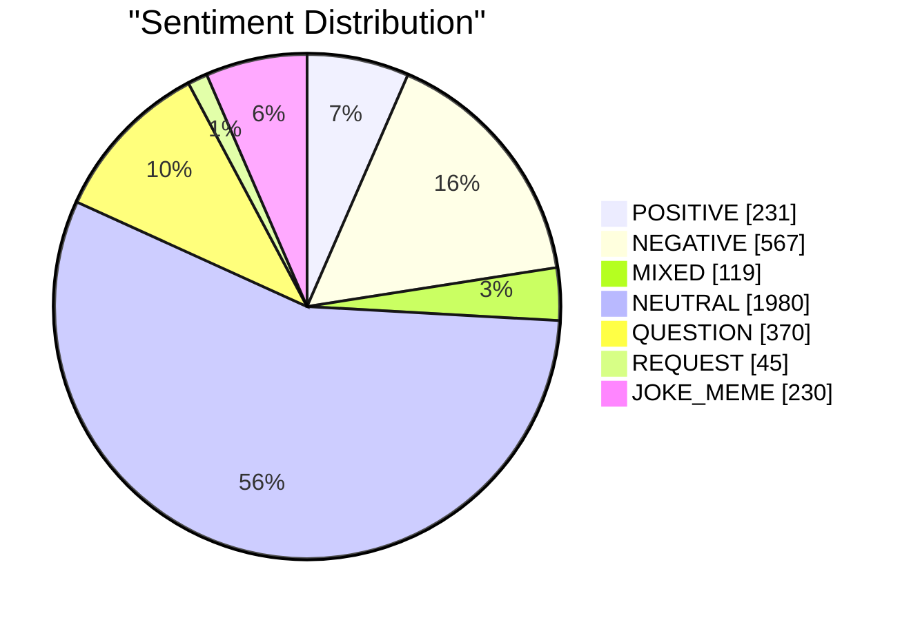
```mermaid
pie showData
    title "Sentiment Distribution"
    "POSITIVE" : 231
    "NEGATIVE" : 567
    "MIXED" : 119
    "NEUTRAL" : 1980
    "QUESTION" : 370
    "REQUEST" : 45
    "JOKE_MEME" : 230
```

| Sentiment | Count | Percent of relevant comments |
|---|---:|---:|
| POSITIVE | 231 | 6.52% |
| NEGATIVE | 567 | 16.01% |
| MIXED | 119 | 3.36% |
| NEUTRAL | 1,980 | 55.90% |
| QUESTION | 370 | 10.45% |
| REQUEST | 45 | 1.27% |
| JOKE_MEME | 230 | 6.49% |
| SPAM / IRRELEVANT | 31 | 0.87% of parsed comments |

## 11.2. Comment resonance score by video

- Назва графіка: Comment resonance score by video
- Яке питання він відповідає: наскільки сильна реакція коментарів?
- Які поля використовуються: `comment_resonance_score`
- Тип графіка: Mermaid bar chart
- Що видно з графіка: comment resonance score = 4/5.
- Практичний висновок: тема добре генерує reaction volume, але дискусія значною мірою спірна.

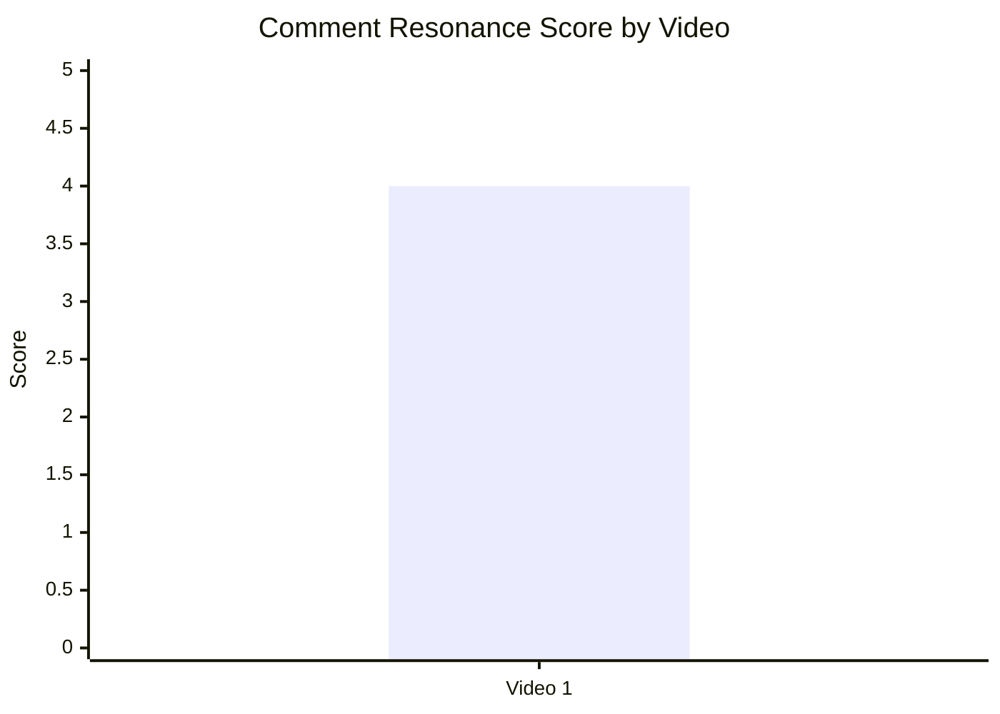
```mermaid
xychart-beta
    title "Comment Resonance Score by Video"
    x-axis ["Video 1"]
    y-axis "Score" 0 --> 5
    bar [4]
```

## 11.3. Top comment clusters

- Назва графіка: Top comment clusters
- Яке питання він відповідає: що найчастіше обговорюють/критикують?
- Які поля використовуються: cluster counts
- Тип графіка: Mermaid bar chart
- Що видно з графіка: домінує general war/Russia-Ukraine debate; далі accuracy/evidence criticism і source requests.
- Практичний висновок: наступні відео мають вбудовувати evidence trail у структуру.

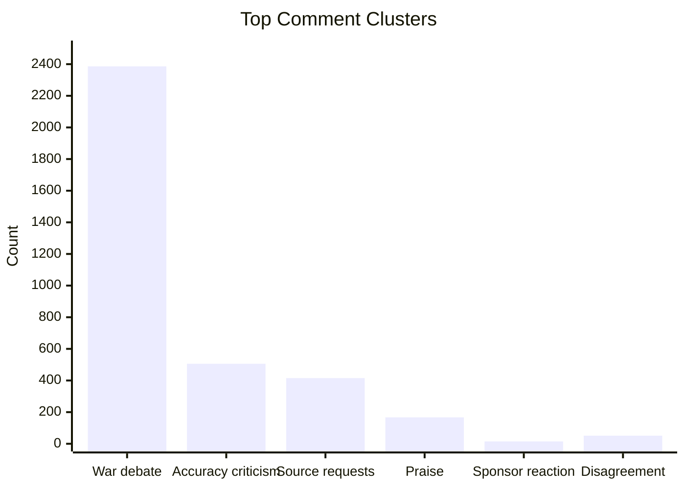
```mermaid
xychart-beta
    title "Top Comment Clusters"
    x-axis ["War debate", "Accuracy criticism", "Source requests", "Praise", "Sponsor reaction", "Disagreement"]
    y-axis "Count" 0 --> 2500
    bar [2386, 506, 415, 167, 15, 51]
```

| Cluster | Count | % relevant comments | Practical interpretation |
|---|---:|---:|---|
| `COMMUNITY_DISCUSSION` | 2,386 | 67.36% | Debate is the main engagement driver |
| `CRITICISM_ACCURACY` | 506 | 14.29% | Biggest trust gap |
| `QUESTION_CLARIFICATION` | 415 | 11.72% | Viewers want sources and proof |
| `PRAISE_CONTENT` | 167 | 4.72% | Positive segment exists but is smaller |
| `SPONSOR_REACTION` | 15 | 0.42% | Small but actionable ad-fatigue signal |
| `DISAGREEMENT` | 51 | 1.44% | Polarized topic attracts hostile replies |

## 12. Графіки score-системи

## 12.1. Overall score by video

- Назва графіка: Overall score by video
- Яке питання він відповідає: який загальний score відео?
- Які поля використовуються: `overall_video_score`
- Тип графіка: Mermaid bar chart
- Що видно з графіка: overall = 3.70/5.
- Практичний висновок: відео має сильну основу, але ad integration і CTA знижують total score.

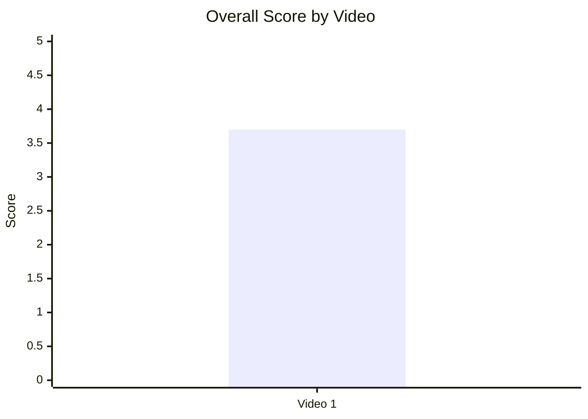
```mermaid
xychart-beta
    title "Overall Score by Video"
    x-axis ["Video 1"]
    y-axis "Score" 0 --> 5
    bar [3.7]
```

## 12.2. Score breakdown heatmap

- Назва графіка: Score breakdown heatmap
- Яке питання він відповідає: які компоненти сильні/слабкі?
- Які поля використовуються: score fields 1–5
- Тип графіка: matrix heatmap
- Що видно з графіка: сильні Hook/Structure/Value/Audio/Comments/Replicability; слабше CTA; найслабша Ad integration.
- Практичний висновок: найперші важелі покращення — реклама, comment prompt, visible sources.

| Video | Hook | Structure | Value Density | Audio | CTA | Ad | Comments | Replicability | Overall |
|---|---:|---:|---:|---:|---:|---:|---:|---:|---:|
| Video 1 | 4 | 4 | 4 | 4 | 3 | 2 | 4 | 4 | 3.7 |

## 12.3. Strengths vs weaknesses count

- Назва графіка: Strengths vs weaknesses count
- Яке питання він відповідає: скільки сильних механік і missed opportunities зафіксовано?
- Які поля використовуються: success mechanics count, missed opportunities count
- Тип графіка: Mermaid bar chart
- Що видно з графіка: 5 success mechanics і 5 missed opportunities у звіті.
- Практичний висновок: відео має достатньо сильних елементів для replication, але повторювати треба з виправленнями.

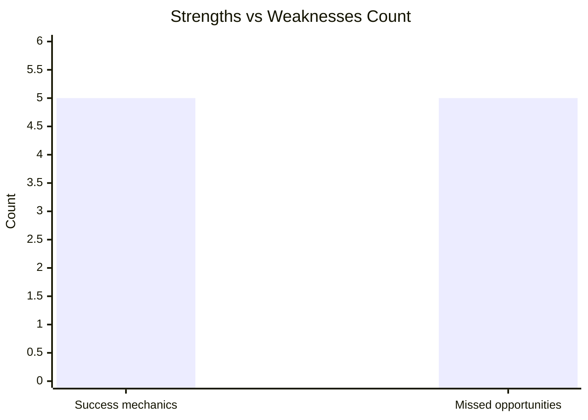
```mermaid
xychart-beta
    title "Strengths vs Weaknesses Count"
    x-axis ["Success mechanics", "Missed opportunities"]
    y-axis "Count" 0 --> 6
    bar [5, 5]
```

## 13. Кореляції та патерни

Correlation analysis skipped: fewer than 5 comparable videos.

| Pair | Correlation / Pattern | Strength | Interpretation | Confidence |
|---|---:|---|---|---|
| hook_score → overall_video_score | `INSUFFICIENT_DATA` | N/A | Потрібно мінімум 5 comparable videos | LOW |
| value_density_score → er_public_percent | `INSUFFICIENT_DATA` | N/A | Потрібно мінімум 5 comparable videos | LOW |
| cta_score → comment_rate_percent | `INSUFFICIENT_DATA` | N/A | Потрібно мінімум 5 comparable videos | LOW |
| comment_resonance_score → er_public_percent | `INSUFFICIENT_DATA` | N/A | Потрібно мінімум 5 comparable videos | LOW |
| views_per_day → er_public_percent | `INSUFFICIENT_DATA` | N/A | Потрібно мінімум 5 comparable videos | LOW |
| ad_load_percent → er_public_percent | `INSUFFICIENT_DATA` | N/A | Потрібно мінімум 5 comparable videos | LOW |
| time_to_first_value_seconds → overall_video_score | `INSUFFICIENT_DATA` | N/A | Немає точного `time_to_first_value_seconds` | LOW |

## 14. Висновки для контент-стратегії

| Спостереження | Дані / графік | Що це означає | Що робити |
|---|---|---|---|
| Curiosity gap + seasonal urgency виглядає сильним елементом | Hook score 4/5; hook type `CURIOSITY_GAP` | Це працює як стартова framing-механіка, але статистично не доведено на вибірці з 1 відео | Повторити у 3–5 наступних відео і порівняти views/day та ER |
| Тема провокує дебати | Comment resonance 4/5; `COMMUNITY_DISCUSSION` 2,386 comments | Debate може піднімати comments, але також збільшує skepticism | Додати evidence trail: source cards, карти, таблиці, посилання |
| Найбільший trust gap — джерела | `CRITICISM_ACCURACY` 506; `QUESTION_CLARIFICATION` 415 | Частина аудиторії не приймає claims без доказів | Вбудувати “claim → source → implication” |
| Реклама має високий friction risk | Ad load 18.9%; ad score 2/5; sponsor reaction cluster | Sponsor read може ламати momentum | Тестувати 60–90 sec read або placement після main payoff |
| CTA неповна | CTA score 3/5; no comment prompt; no bell CTA | Відео не каналізує дискусію в корисні коментарі | Додати comment prompt: “region + source + what you see” |
| Audio не головний bottleneck | Audio score 4/5 | Покращення аудіо менш пріоритетне, ніж sourcing/ad/CTA | Не витрачати перший ресурс на audio overhaul |
| Strong story structure є replication asset | Structure score 4/5; value density 4/5 | Ланцюг “симптом → причина → наслідок → геополітичний payoff” варто повторювати | Стандартизувати сценарний шаблон для long-form 10–20 min |

## 15. Що тестувати далі

| Тест | Гіпотеза | На яких даних базується | Як виміряти | Пріоритет |
|---|---|---|---|---|
| Source cards every 60–90 sec | Видимі джерела зменшать criticism/question clusters | 506 accuracy criticism + 415 source/clarification requests | % comments у `CRITICISM_ACCURACY`, comment sentiment, ER Public | HIGH |
| Shorter sponsor read | Зменшення ad load підвищить pacing і зменшить ad complaints | Ad load 18.9%, ad score 2/5, `AD_TOO_LONG` | Ad complaints per 1k comments, retention if owner data exists, ER Public | HIGH |
| Sponsor after main payoff | Перенесення реклами після сильнішого value block зменшить disruption | First major ad at ~30.3%, before final payoff | Viewer drop-off if owner data exists; qualitative comments | MEDIUM |
| Structured comment prompt | Prompt збільшить якісні коментарі й зменшить хаотичну полеміку | `NO_COMMENT_PROMPT`, high debate volume | Comments/1k views, % comments with evidence/region/source | HIGH |
| Specific next-video bridge | Конкретний bridge підвищить session depth | Has next video bridge, але weak/non-specific | End screen CTR / next video traffic if owner data exists | MEDIUM |
| Series format “Energy Pressure Map” | Серійність на темі energy infrastructure збере повторювану аудиторію | `TIMELY_TOPIC`, strong debate, high views/day baseline | Views/day і returning viewers across series | HIGH |
| Claim → evidence → implication script | Чітка структура claims підвищить trust | Source criticism clusters | Negative/question share in comments | HIGH |
| Reduce description link overload | Менше links підвищить clarity CTA | Description has many support/affiliate links | Click distribution if owner data exists; qualitative comment complaints | LOW |

## 16. Дані для експорту в таблицю / CSV

| video_label | title | format_group | views | views_per_day | like_rate_percent | comment_rate_percent | er_public_percent | views_per_1k_subs | hook_type | hook_score | cta_count | cta_score | ad_load_percent | ad_integration_score | audio_score | comment_resonance_score | overall_video_score | top_success_mechanic | top_missed_opportunity |
|---|---|---|---:|---:|---:|---:|---:|---:|---|---:|---:|---:|---:|---:|---:|---:|---:|---|---|
| Video 1 | Something BIG is Breaking in Russia Right Now | LONG_10_20_MIN | 931302 | 3527.66 | 4.98 | 0.4 | 5.39 | 2282.6 | CURIOSITY_GAP | 4 | 7 | 3 | 18.9 | 2 | 4 | 4 | 3.7 | TIMELY_TOPIC | COMMENTS_SHOW_TOPIC_GAP |