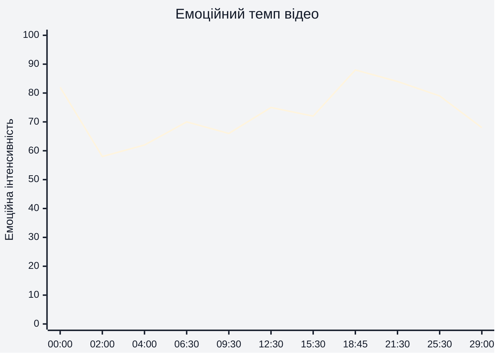
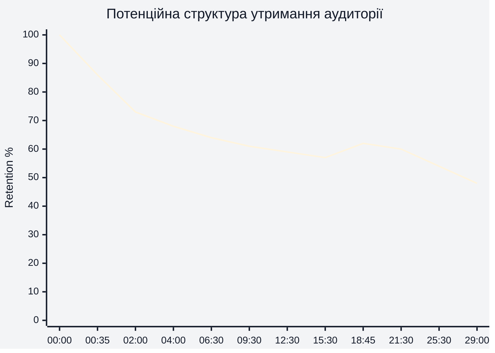
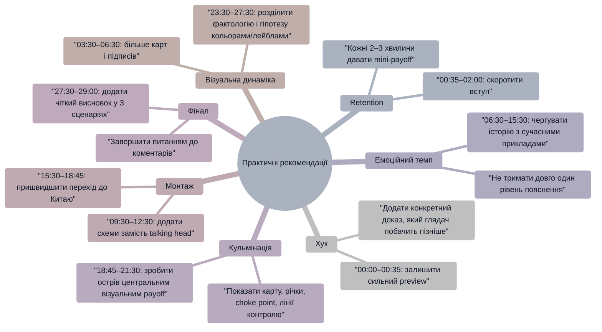

# Аналіз довгоформатного YouTube-відео

> Відео: **The Truth About Siberia that Russia Wants to Hide**  
> Тривалість: **29:00**  
> Retention-дані: **не надано** — нижче використано **потенційну retention-структуру**, а не реальні дані YouTube Studio.  
> Примітка: таймкоди в аналізі сюжетної структури є **орієнтовними**, бо окремий транскрипт із повними таймкодами не надано.

## 1. Сюжетна дуга (Narrative Arc)

```mermaid
%%{init: {'theme':'base', 'themeVariables': {
'primaryColor':'#f3f4f6',
'primaryTextColor':'#111827',
'primaryBorderColor':'#2563eb',
'lineColor':'#2563eb',
'secondaryColor':'#ffffff',
'tertiaryColor':'#f3f4f6',
'background':'#f3f4f6'
}}}%%
flowchart LR
    A["00:00–00:35<br/>Хук<br/>Сибір має темну історію; Росія боїться Китаю; Китай уже зробив крок"] -->
    B["00:35–02:00<br/>Експозиція<br/>Метафора перехрестя: контроль однієї точки може контролювати всю систему"] -->
    C["02:00–06:30<br/>Перша ескалація<br/>Питання: чи може Росія втратити Сибір; Сибір як ресурсна колонія Москви"] -->
    D["06:30–11:30<br/>Переломний момент<br/>Історія підкорення місцевих народів і страх Москви перед об’єднанням регіонів"] -->
    E["11:30–17:30<br/>Наростання напруги<br/>Сучасна війна, мобілізація з регіонів, демографічна слабкість РФ"] -->
    F["17:30–23:30<br/>Кульмінація<br/>Китайський фактор і стратегічний вузол Bolshoy Ussuriysky Island"] -->
    G["23:30–27:30<br/>Розв’язка<br/>Тайвань як можливий відволікаючий фокус і логіка довгострокової стратегії Китаю"] -->
    H["27:30–29:00<br/>Фінальний висновок<br/>Сценарій не швидкий, але ризик для Росії подано як системний"]
```

| Етап | Таймкод | Роль у відео | Висновок |
|---|---|---|---|
| Хук | 00:00–00:35 | Одразу створює конфлікт: Сибір, Росія, Китай, прихована загроза | Сильний старт, бо за перші 35 секунд глядач отримує кілька високоставкових обіцянок. |
| Експозиція | 00:35–02:00 | Перехрестя як візуальна метафора | Метафора працює, але може створювати ризик спаду, якщо глядач чекає швидкого переходу до геополітики. |
| Ескалація | 02:00–17:30 | Історія Сибіру + сучасна війна | Відео поступово піднімає ставки: від історії колонізації до сучасної військової вразливості Росії. |
| Кульмінація | 17:30–23:30 | Китай і стратегічний острів | Найсильніша точка структури: рання метафора перехрестя отримує payoff через географічний choke point. |
| Фінал | 27:30–29:00 | Узагальнення сценарію | Фінал логічний, але йому бракує чіткішого next-step або переходу в наступне відео. |

## 2. Ключові Story Beats

```mermaid
%%{init: {'theme':'base', 'themeVariables': {
'primaryColor':'#f3f4f6',
'primaryTextColor':'#111827',
'primaryBorderColor':'#2563eb',
'lineColor':'#2563eb',
'secondaryColor':'#ffffff',
'tertiaryColor':'#f3f4f6',
'background':'#f3f4f6'
}}}%%
flowchart LR
    B1["00:00<br/>Темна історія Сибіру<br/>Функція: шок і інтрига"] -->
    B2["00:35<br/>Перехрестя в Юті<br/>Функція: візуальна метафора контролю"] -->
    B3["02:00<br/>Чи може Росія втратити Сибір?<br/>Функція: головне питання"] -->
    B4["04:00<br/>Сибір як ресурсна колонія<br/>Функція: історичний контекст"] -->
    B5["06:30<br/>Підкорення місцевих народів<br/>Функція: моральна й історична напруга"] -->
    B6["09:30<br/>Московський контроль і розділення регіонів<br/>Функція: пояснення системи влади"] -->
    B7["12:30<br/>Мобілізація з сибірських регіонів<br/>Функція: сучасний доказ слабкості"] -->
    B8["15:30<br/>Китай як ресурсний інтерес<br/>Функція: зміна масштабу конфлікту"] -->
    B9["18:45<br/>Bolshoy Ussuriysky Island<br/>Функція: географічний payoff"] -->
    B10["23:30<br/>Тайвань як можливе відволікання<br/>Функція: стратегічний twist"] -->
    B11["27:30<br/>Довгостроковий сценарій<br/>Функція: фінальний висновок"]
```

| # | Таймкод | Story beat | Функція в історії | Коментар |
|---:|---|---|---|---|
| 1 | 00:00–00:35 | Сибір має темну історію, а Росія боїться Китаю | Відкрити curiosity gap | Хук одразу продає масштаб і приховану загрозу. |
| 2 | 00:35–02:00 | Автор стоїть на перехресті й пояснює контроль точки | Дати метафору | Метафора потрібна для подальшого пояснення острова, але вступ можна ущільнити. |
| 3 | 02:00–03:30 | “Чи може Росія втратити Сибір?” | Сформулювати головне питання | Це чіткий narrative engine відео. |
| 4 | 03:30–06:30 | Сибір як малозаселений ресурсний простір | Дати контекст | Пояснює, чому територія стратегічно важлива. |
| 5 | 06:30–09:30 | Колоніальна історія та примус місцевих народів | Підняти емоційну ставку | Дає моральну напругу, але потребує сильного source-pack. |
| 6 | 09:30–12:30 | Москва історично боялася об’єднання регіонів | Пояснити механіку контролю | Підсилює тезу про страх центру перед периферією. |
| 7 | 12:30–15:30 | Війна в Україні та мобілізація з регіонів | Показати сучасний наслідок | Зв’язує історію із сьогоденням. |
| 8 | 15:30–18:45 | Китай як ресурсно зацікавлений сусід | Розширити конфлікт | Відео переходить із внутрішньої проблеми Росії до зовнішнього ризику. |
| 9 | 18:45–21:30 | Bolshoy Ussuriysky Island як choke point | Дати головний payoff | Найсильніший географічний момент відео. |
| 10 | 21:30–25:30 | Росія не заперечує достатньо жорстко проти китайського кроку | Підсилити підозру | Це підтримує title promise про “truth Russia wants to hide”. |
| 11 | 25:30–27:30 | Тайвань і стратегія відволікання | Дати twist | Суперечливий, але коментогенний блок. |
| 12 | 27:30–29:00 | Сценарій може розгортатися десятиліттями | Закрити дугу | Фінал обережний, але не має сильного переходу до наступної дії. |

## 3. Емоційний темп

| Таймкод | Емоційна інтенсивність | Чому саме так |
|---|---:|---|
| 00:00–00:35 | 82 | Хук одразу використовує “темну історію”, страх Росії перед Китаєм і загрозу втрати території. |
| 00:35–02:00 | 58 | Метафора перехрестя знижує темп після сильного preview. |
| 06:30–09:30 | 70 | Історія підкорення місцевих народів додає моральну напругу. |
| 12:30–15:30 | 75 | Мобілізація з регіонів під час війни робить тему сучасною й гострою. |
| 18:45–21:30 | 88 | Поява стратегічного острова — найсильніший payoff відео. |
| 27:30–29:00 | 68 | Фінал обережний і пояснювальний, тому інтенсивність нижча за кульмінацію. |

## 4. Утримання аудиторії

Retention-дані YouTube Studio не надані. Графік нижче — **прогнозована retention-крива**, побудована на структурі відео, довжині 29:00, силі hook, довжині пояснювальних блоків і ймовірних payoff-точках.

| Таймкод | Потенційна retention-логіка | Практичний висновок |
|---|---|---|
| 00:00–00:35 | Висока стартова увага через сильний preview | Залишити preview, але ще швидше обіцяти конкретний payoff. |
| 00:35–02:00 | Можливий спад через локаційний вступ | Скоротити метафоричний вступ або швидше прив’язати його до карти/острова. |
| 06:30–12:30 | Повільніше пояснення історії може втрачати impatient viewers | Додати mini-payoff або карту кожні 2–3 хвилини. |
| 18:45–21:30 | Потенційний spike через Bolshoy Ussuriysky Island | Раніше тизерити, що саме цей острів є payoff метафори перехрестя. |
| 25:30–29:00 | Фінальна частина може просідати без next-video bridge | Додати сильний фінальний CTA на продовження теми. |

## 5. Піки retention

| Таймкод | Подія | Чому це може утримувати увагу | Сила піку 1–10 |
|---|---|---|---:|
| 00:00–00:35 | Preview: темна історія Сибіру, страх Росії перед Китаєм, мобілізація з регіонів | Одразу створює конфлікт, небезпеку й обіцянку прихованої правди | 9 |
| 02:00–03:30 | Формулювання питання “чи може Росія втратити Сибір?” | Дає глядачу головну інтригу, заради якої варто дивитися далі | 8 |
| 06:30–09:30 | Історія колонізації та підкорення місцевих народів | Підсилює моральну напругу і пояснює, чому Сибір може мати конфлікт із Москвою | 7 |
| 12:30–15:30 | Зв’язок із війною в Україні та мобілізацією з Сибіру | Актуалізує історичний блок через сучасну війну | 8 |
| 18:45–21:30 | Bolshoy Ussuriysky Island як стратегічне перехрестя | Головний географічний payoff, який повертає метафору з початку | 10 |
| 25:30–27:30 | Тайвань як можливий відволікаючий маневр | Дає несподіваний стратегічний twist і провокує дискусію | 8 |

## 6. Провали retention

| Таймкод | Проблема | Ймовірна причина спаду | Що покращити |
|---|---|---|---|
| 00:35–02:00 | Локаційний вступ після сильного preview | Після високої напруги 00:00–00:35 глядач може чекати одразу карту або доказ | Скоротити вступ до 20–30 секунд і швидше показати карту Сибіру / острова. |
| 03:30–06:30 | Довге пояснення базового контексту | Частина аудиторії вже розуміє, де Сибір і чому він важливий | Додати on-screen карту з підписами “ресурси”, “населення”, “відстань до Москви”. |
| 09:30–12:30 | Абстрактна логіка московського контролю | Без візуалізації “hub-and-spoke” тема може здаватися складною | Показати просту схему залізниць/адміністративного контролю. |
| 15:30–18:45 | Перехід до Китаю може відчуватися довгим | Глядач ще не отримав головний payoff про острів | Раніше сказати: “Через 3 хвилини покажу точку, за яку Росія вже фактично поступилась Китаю”. |
| 23:30–25:30 | Блок про Тайвань може здатися відгалуженням | Частина глядачів може не прийняти зв’язок Тайвань → Сибір | Чіткіше пояснити логічний міст: “Тайвань — не тема відео, а приклад стратегічного відволікання”. |
| 27:30–29:00 | Фінал без сильного next-step | Після кульмінації немає потужного переходу до наступного відео або питання | Завершити конкретним питанням і end-screen bridge на пов’язану тему. |

## 7. Оцінка сегментів

| Сегмент | Таймкод | Функція | Емоційна інтенсивність | Ризик втрати уваги | Оцінка 1–10 | Що покращити |
|---|---|---|---:|---|---:|---|
| Хук / Preview | 00:00–00:35 | Привернути увагу через конфлікт і приховану загрозу | 82 | Низький | 9 | Залишити формат, але додати ще конкретніший teaser головного доказу. |
| Вступ із перехрестям | 00:35–02:00 | Дати метафору контролю | 58 | Середній | 7 | Скоротити й швидше прив’язати до Bolshoy Ussuriysky Island. |
| Головне питання | 02:00–03:30 | Сформулювати narrative engine | 65 | Низький | 8 | Показати карту Сибіру одразу в цей момент. |
| Історичний контекст | 03:30–06:30 | Пояснити Сибір як ресурсну колонію | 62 | Середній | 7 | Додати більше візуальних доказів і менше загального пояснення. |
| Колонізація і місцеві народи | 06:30–09:30 | Підняти моральну напругу | 70 | Середній | 8 | Додати короткі джерела/дати на екрані. |
| Москва і контроль регіонів | 09:30–12:30 | Пояснити системну логіку РФ | 66 | Середній | 7 | Візуалізувати “розділяй і контролюй” через просту схему. |
| Війна і мобілізація | 12:30–15:30 | Прив’язати історію до сучасності | 75 | Низький | 8 | Підкріпити конкретними прикладами/джерелами на екрані. |
| Перехід до Китаю | 15:30–18:45 | Розширити stakes | 72 | Середній | 7 | Раніше анонсувати кульмінаційний острів. |
| Стратегічний острів | 18:45–21:30 | Головний payoff | 88 | Низький | 10 | Зробити цей блок більш візуальним: карта, річки, стрілки, choke point. |
| Російська реакція | 21:30–23:30 | Показати слабкість/замовчування | 84 | Низький | 9 | Дати екранний proof-pack: карта, дата, реакція РФ. |
| Тайвань і deception logic | 23:30–27:30 | Дати стратегічний twist | 79 | Середній | 8 | Чіткіше відділити факт від спекулятивної гіпотези. |
| Фінал | 27:30–29:00 | Закрити тезу | 68 | Середній | 7 | Додати конкретний comment prompt і next-video bridge. |

## 8. Практичні рекомендації

| Напрям | Таймкод | Рекомендація | Очікуваний ефект |
|---|---|---|---|
| Хук | 00:00–00:35 | Додати фразу “пізніше покажу точку на карті, яка пояснює страх Росії” | Сильніше утримання до 18:45–21:30. |
| Retention | 00:35–02:00 | Скоротити локаційний вступ | Менший ранній спад після preview. |
| Візуальна динаміка | 03:30–12:30 | Додати карти, схеми контролю, короткі source captions | Вища ясність у найпояснювальніших блоках. |
| Кульмінація | 18:45–21:30 | Вивести Bolshoy Ussuriysky Island у повноекранну карту | Посилити головний payoff відео. |
| Фінал | 27:30–29:00 | Додати питання: “що ймовірніше — м’який контроль, сепаратизм чи військовий тиск?” | Більше структурованих коментарів. |

## 9. Підсумкова оцінка

| Показник | Оцінка 1–10 | Коментар |
|---|---:|---|
| Сюжетна дуга | 8 | На 00:00–29:00 є зрозуміла дуга: прихована загроза → історія Сибіру → слабкість Росії → китайський фактор → стратегічний payoff. |
| Story Beats | 8 | Найсильніші beats: 00:00–00:35, 12:30–15:30, 18:45–21:30. Слабше місце — 00:35–02:00 через повільніший вступ. |
| Емоційний темп | 7 | Темп має сильні піки на 00:00–00:35 і 18:45–21:30, але в середині 03:30–12:30 можливі просідання через довгі пояснення. |
| Retention Structure | 7 | Потенційна retention-структура сильна завдяки hook і payoff, але реальні retention-дані не надані; висновок має LOW_CONFIDENCE. |
| Загальна оцінка | 7.5 | Відео має сильний narrative engine і коментогенну тезу, але потребує щільнішого вступу, більше карт і чіткішого фінального CTA. |
