# Статистичний аналіз відеозвітів

## 1. Короткий executive summary

| Пункт | Висновок |
|---|---|
| Скільки відео проаналізовано | 1 |
| Скільки форматів відео | 1: `LONG_20_PLUS_MIN` |
| Найсильніше відео за overall score | Video 1 — 3.8/5 |
| Найсильніше відео за ER Public % | Video 1 — 5.91% |
| Найсильніше відео за views per day | Video 1 — 1977.87 |
| Найсильніша повторювана механіка | `NOT_COMPARABLE`: є лише одне відео. Для цього відео головна механіка — `STRONG_TOPIC_DEMAND` + `CONTROVERSY_OR_DEBATE` + `CLEAR_HOOK`. |
| Найчастіша слабкість | `NOT_COMPARABLE`: є лише одне відео. Для цього відео головні слабкості — `NO_COMMENT_PROMPT`, `NO_NEXT_VIDEO_BRIDGE`, `COMMENTS_SHOW_TOPIC_GAP`. |
| Головна стратегічна можливість | Додати source-pack, конкретний comment prompt і next-video bridge для серійності теми. |
| Рівень впевненості | LOW — лише 1 відео; дозволена тільки описова статистика без кореляцій. |

## 2. Якість і повнота даних

| Поле | Кількість відео з даними | Кількість N/A | Коментар |
|---|---:|---:|---|
| views | 1 | 0 | Є в `YT_VIDEO_ANALYSIS_V1`. |
| likes | 1 | 0 | Є в `YT_VIDEO_ANALYSIS_V1`. |
| comments_count | 1 | 0 | Є в `YT_VIDEO_ANALYSIS_V1`. |
| views_per_day | 1 | 0 | Розраховано у звіті. |
| er_public_percent | 1 | 0 | Розраховано у звіті. |
| views_per_1k_subs | 1 | 0 | Є, але `PARTIAL_DATA`, бо subscribers відрізняються між джерелами. |
| hook_score | 1 | 0 | Є. |
| cta_score | 1 | 0 | Є. |
| ad_integration_score | 1 | 0 | Є; реклама не in-video, а description/pinned layer. |
| audio_score | 1 | 0 | Є; оцінка зі звіту. |
| comment_resonance_score | 1 | 0 | Є. |
| overall_video_score | 1 | 0 | Є. |

### Обмеження аналізу

- `LOW_CONFIDENCE`: вибірка складається з одного відео, тому не можна робити кореляції, кластери або надійні порівняння.
- `NOT_COMPARABLE`: немає інших відео тієї самої когорти `LONG_20_PLUS_MIN`.
- `PARTIAL_DATA`: у вихідному звіті позначено відсутність CTR, impressions, retention, watch time, traffic sources і повних таймкодів транскрипту.
- Усі графіки нижче є описовими для одного відео, а не статистичним порівнянням.

## 3. Підготовлена таблиця для графіків

| Video | Format | Views | Likes | Comments | Views/day | Like Rate % | Comment Rate % | ER Public % | Views/1k subs | Hook | CTA | Ad | Audio | Comment Resonance | Overall |
|---|---|---:|---:|---:|---:|---:|---:|---:|---:|---:|---:|---:|---:|---:|---:|
| Video 1 | LONG_20_PLUS_MIN | 915,756 | 48,134 | 5,982 | 1,977.87 | 5.26 | 0.65 | 5.91 | 2,244.50 | 0 | 0 | 0 | 0 | 0 | 0 |

| Label | Full title | URL |
|---|---|---|
| Video 1 | The Truth About Siberia that Russia Wants to Hide | https://www.youtube.com/watch?v=jOnBf4xxkKw |

## 4. Рекомендовані графіки

| # | Назва графіка | Тип графіка | Поля | Для чого потрібен | Пріоритет |
|---:|---|---|---|---|---|
| 1 | Overall score by video | Mermaid bar chart | `overall_video_score` | Побачити загальну оцінку відео | HIGH |
| 2 | Views per day by video | Mermaid bar chart | `views_per_day` | Оцінити швидкість набору переглядів | HIGH |
| 3 | ER Public % by video | Mermaid bar chart | `er_public_percent` | Оцінити публічне залучення | HIGH |
| 4 | ER Public % vs Views/day | Таблиця / quadrant | `er_public_percent`, `views_per_day` | Показати баланс reach і engagement | HIGH |
| 5 | Hook score by video | Mermaid bar chart | `hook_score` | Оцінити якість hook | HIGH |
| 6 | CTA score by video | Mermaid bar chart | `cta_score` | Оцінити якість CTA | HIGH |
| 7 | Score breakdown heatmap | Matrix table | scores 1–5 | Побачити сильні/слабкі сторони | HIGH |
| 8 | Sentiment distribution | Mermaid pie chart + таблиця | comment sentiment % | Показати структуру реакції аудиторії | HIGH |
| 9 | CTA features heatmap | Matrix table | CTA boolean fields | Побачити, які CTA є/немає | HIGH |
| 10 | Ad load % by video | Mermaid bar chart | `ad_load_percent` | Оцінити рекламне навантаження | HIGH |

## 5. Графіки продуктивності

## 5.1. Views by video

- Назва графіка: Views by video
- Яке питання він відповідає: яке відео має найбільший raw reach.
- Які поля використовуються: `video_label`, `views`.
- Тип графіка: Mermaid bar chart.
- Що видно з графіка: Video 1 має 915,756 переглядів.
- Практичний висновок: raw reach високий у межах одного кейсу, але без когорти це не benchmark.

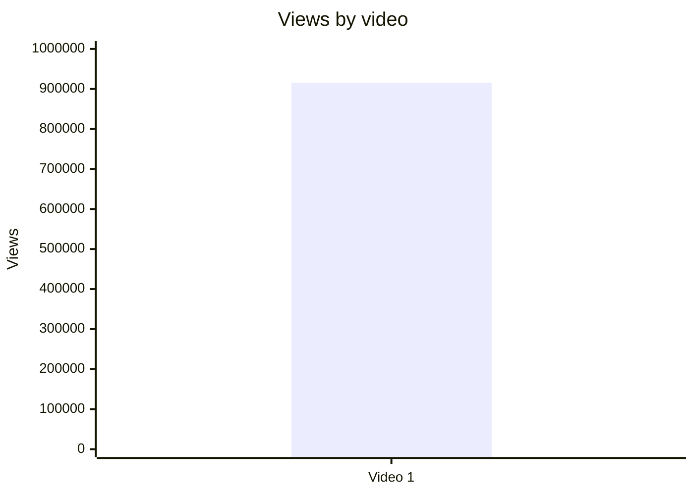

## 5.2. Views per day by video

- Назва графіка: Views per day by video
- Яке питання він відповідає: яка швидкість набору переглядів із урахуванням віку відео.
- Які поля використовуються: `video_label`, `views_per_day`.
- Тип графіка: Mermaid bar chart.
- Що видно з графіка: Video 1 має 1977.87 views/day.
- Практичний висновок: ця normalized metric корисніша за raw views, але для порівняння потрібні інші відео.

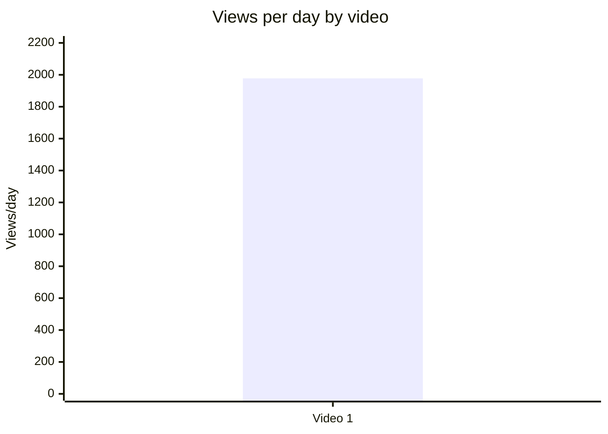

## 5.3. Views per 1k subscribers

- Назва графіка: Views per 1k subscribers
- Яке питання він відповідає: наскільки відео конвертує розмір каналу в перегляди.
- Які поля використовуються: `video_label`, `views_per_1k_subs`.
- Тип графіка: Mermaid bar chart.
- Що видно з графіка: Video 1 має 2244.5 views/1k subs.
- Практичний висновок: показник доступний, але має `PARTIAL_DATA` через різні значення subscribers у джерелах.

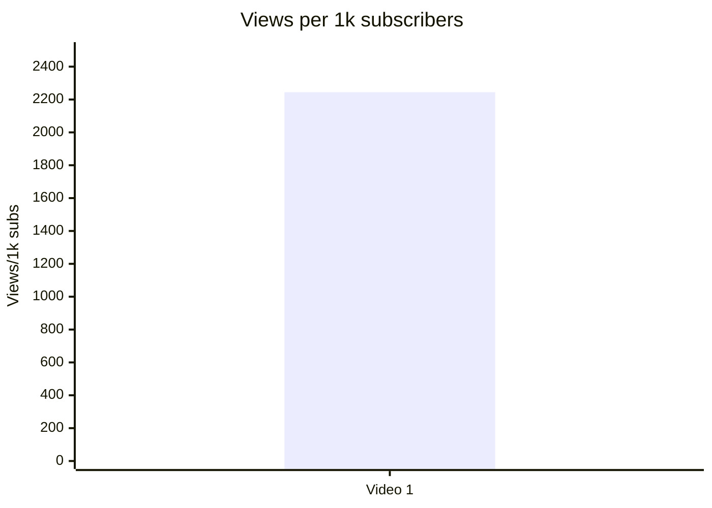

## 5.4. Performance quadrant

- Назва графіка: Performance quadrant
- Яке питання він відповідає: баланс охоплення і залучення.
- Які поля використовуються: `views_per_day`, `er_public_percent`.
- Тип графіка: таблиця quadrant, бо scatter із 1 точкою не дає порівняння.
- Що видно з графіка: є одна точка: 1977.87 views/day і 5.91% ER.
- Практичний висновок: `INSUFFICIENT_DATA` для quadrant classification; потрібно мінімум кілька відео в одній когорті.

| Video | Views/day | ER Public % | Quadrant |
|---|---:|---:|---|
| Video 1 | 1977.87 | 5.91 | INSUFFICIENT_DATA для визначення high/low threshold |

## 6. Графіки залучення

## 6.1. ER Public % by video

- Назва графіка: ER Public % by video
- Яке питання він відповідає: який рівень публічного engagement.
- Які поля використовуються: `video_label`, `er_public_percent`.
- Тип графіка: Mermaid bar chart.
- Що видно з графіка: Video 1 має 5.91% ER Public.
- Практичний висновок: показник описовий; без benchmark не називається добрим або поганим.

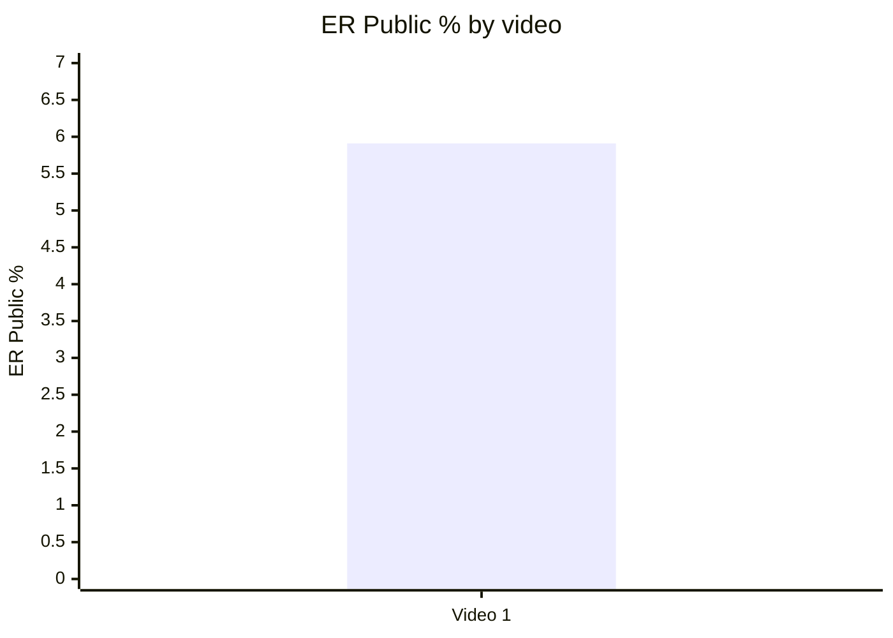

## 6.2. Like Rate % vs Comment Rate %

- Назва графіка: Like Rate % vs Comment Rate %
- Яке питання він відповідає: чи відео більше отримує лайки чи дискусії.
- Які поля використовуються: `like_rate_percent`, `comment_rate_percent`.
- Тип графіка: таблиця scatter-ready.
- Що видно з графіка: like rate = 5.26%, comment rate = 0.65%.
- Практичний висновок: відео має і лайки, і коментарі, але без порівняння з іншими відео не можна визначити quadrant.

| Video | Like Rate % | Comment Rate % | Interpretation |
|---|---:|---:|---|
| Video 1 | 5.26 | 0.65 | Описово: сильний debate pattern у коментарях, але quadrant = `INSUFFICIENT_DATA`. |

## 6.3. Comments per 1k views

- Назва графіка: Comments per 1k views
- Яке питання він відповідає: наскільки відео провокує реакцію.
- Які поля використовуються: `comments_per_1k_views`.
- Тип графіка: Mermaid bar chart.
- Що видно з графіка: Video 1 має 6.53 comments/1k views.
- Практичний висновок: показник підтверджує comment activity у цьому кейсі, але не є benchmark без когорти.

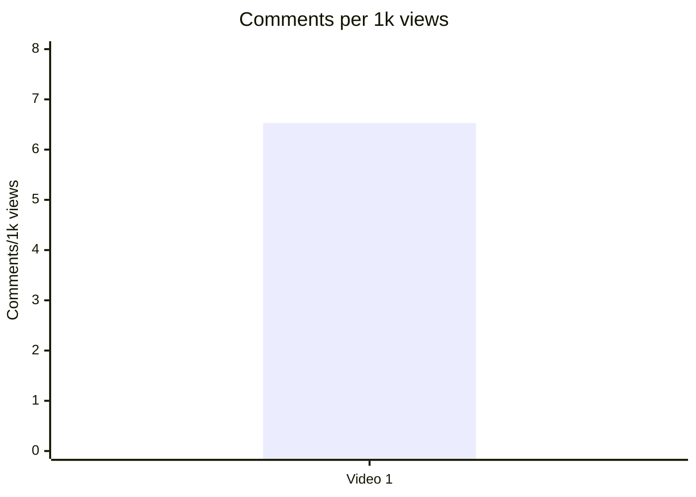

## 7. Графіки структури та hook

## 7.1. Hook score by video

- Назва графіка: Hook score by video
- Яке питання він відповідає: наскільки сильний hook.
- Які поля використовуються: `hook_score`.
- Тип графіка: Mermaid bar chart.
- Що видно з графіка: Video 1 має hook score 4/5.
- Практичний висновок: hook — одна з сильних сторін кейсу.

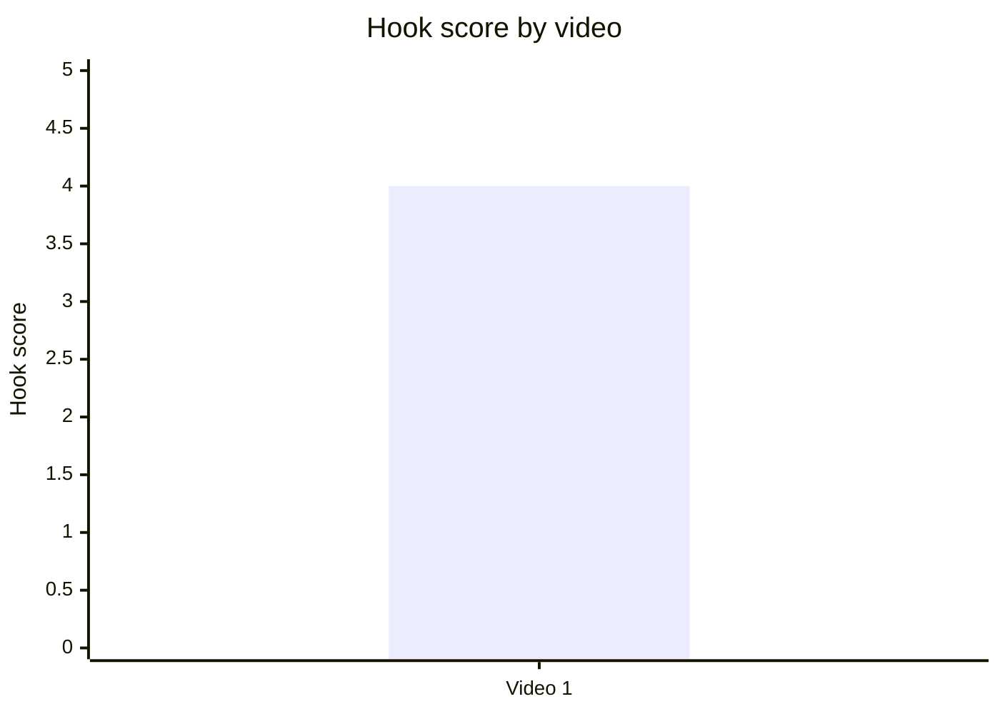

## 7.2. Hook type distribution

- Назва графіка: Hook type distribution
- Яке питання він відповідає: які hook types використовуються.
- Які поля використовуються: `hook_primary_type`.
- Тип графіка: Mermaid pie chart.
- Що видно з графіка: у вибірці є тільки `CURIOSITY_GAP`.
- Практичний висновок: не можна сказати, що цей hook type статистично кращий; можна лише зафіксувати його для майбутнього порівняння.

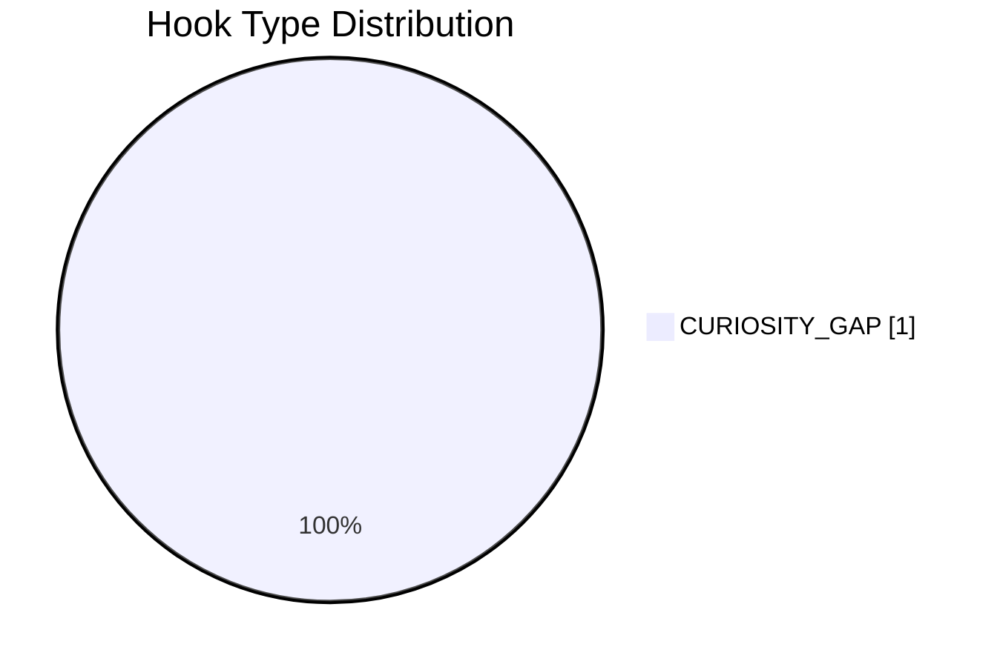

## 7.3. Time to first value vs Overall Score

- Назва графіка: Time to first value vs Overall Score
- Яке питання він відповідає: чи швидша перша цінність пов’язана з overall score.
- Які поля використовуються: `time_to_first_value`, `overall_video_score`.
- Тип графіка: skipped.
- Що видно з графіка: `INSUFFICIENT_DATA`, бо `time_to_first_value` не має однозначного seconds value: “00:00 / 00:35 depending definition; transcript has NO_TIMECODES”.
- Практичний висновок: у наступних звітах потрібно нормалізувати `time_to_first_value_seconds`.

| Video | time_to_first_value | time_to_first_value_seconds | Overall |
|---|---|---:|---:|
| Video 1 | 00:00 / 00:35 depending definition; `NO_TIMECODES` | INSUFFICIENT_DATA | 3.8 |

## 8. Графіки CTA

## 8.1. CTA score by video

- Назва графіка: CTA score by video
- Яке питання він відповідає: наскільки добре реалізовані CTA.
- Які поля використовуються: `cta_score`.
- Тип графіка: Mermaid bar chart.
- Що видно з графіка: CTA score = 3/5.
- Практичний висновок: CTA — середня зона; є description/pinned CTA, але бракує comment prompt і next-video bridge.

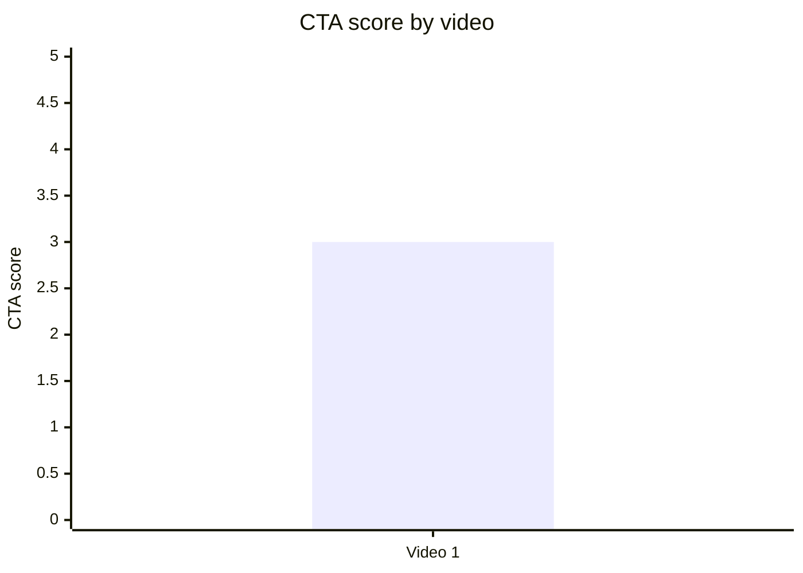

## 8.2. CTA count vs ER Public %

- Назва графіка: CTA count vs ER Public %
- Яке питання він відповідає: чи більше CTA пов’язано з кращим engagement.
- Які поля використовуються: `cta_count`, `er_public_percent`.
- Тип графіка: scatter-ready table.
- Що видно з графіка: Video 1 має 8 CTA і 5.91% ER.
- Практичний висновок: `INSUFFICIENT_DATA` для висновку; є ризик link-heavy description, але не доведено, що це шкодить ER.

| Video | CTA count | ER Public % | CTA overload risk |
|---|---:|---:|---|
| Video 1 | 8 | 5.91 | PARTLY — багато description links |

## 8.3. CTA features heatmap

- Назва графіка: CTA features heatmap
- Яке питання він відповідає: які типи CTA присутні або відсутні.
- Які поля використовуються: `has_comment_prompt`, `has_subscribe_cta`, `has_like_cta`, `has_bell_cta`, `has_next_video_bridge`.
- Тип графіка: matrix heatmap.
- Що видно з графіка: є subscribe CTA, але немає comment prompt, like, bell, next-video bridge.
- Практичний висновок: головна CTA-можливість — додати керований comment prompt і watch-next bridge.

| Video | Comment prompt | Subscribe | Like | Bell | Next video bridge |
|---|---|---|---|---|---|
| Video 1 | ❌ | ✅ | ❌ | ❌ | ❌ |

## 9. Графіки реклами / інтеграцій

Є advertising/self-promo data, але це не in-video sponsor read. Дані стосуються description/pinned affiliate/self-promo layer.

## 9.1. Ad load % by video

- Назва графіка: Ad load % by video
- Яке питання він відповідає: яке рекламне навантаження у runtime.
- Які поля використовуються: `ad_load_percent`.
- Тип графіка: Mermaid bar chart.
- Що видно з графіка: in-video ad load = 0%.
- Практичний висновок: реклама не перериває runtime; ризик — link clutter у description, а не drop-off від sponsor segment.

```mermaid
xychart-beta
    title "Ad load % by video"
    x-axis ["Video 1"]
    y-axis "Ad load %" 0 --> 5
    bar [0]
```

## 9.2. First ad position %

- Назва графіка: First ad position %
- Яке питання він відповідає: чи реклама стоїть занадто рано.
- Які поля використовуються: `first_ad_relative_position_percent`.
- Тип графіка: skipped.
- Що видно з графіка: `N/A`, бо перша реклама — description / pinned comment, не in-video timestamp.
- Практичний висновок: немає доказу in-video disruption.

| Video | First ad time | First ad relative position % |
|---|---|---:|
| Video 1 | DESCRIPTION / PINNED_COMMENT | N/A |

## 9.3. Ad integration score vs ER Public %

- Назва графіка: Ad integration score vs ER Public %
- Яке питання він відповідає: чи якість інтеграції пов’язана з engagement.
- Які поля використовуються: `ad_integration_score`, `er_public_percent`.
- Тип графіка: scatter-ready table.
- Що видно з графіка: ad integration score = 3/5; ER = 5.91%.
- Практичний висновок: `INSUFFICIENT_DATA`; з одного відео не можна встановити pattern.

| Video | Ad integration score | ER Public % |
|---|---:|---:|
| Video 1 | 3 | 5.91 |

## 10. Графіки аудіо

## 10.1. Audio score by video

- Назва графіка: Audio score by video
- Яке питання він відповідає: яка якість audio layer.
- Які поля використовуються: `audio_score`.
- Тип графіка: Mermaid bar chart.
- Що видно з графіка: audio score = 4/5.
- Практичний висновок: аудіо не виглядає головним обмеженням у цьому кейсі.

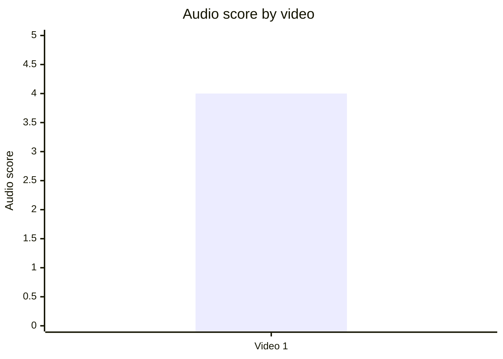

## 10.2. Audio score vs Overall Score

- Назва графіка: Audio score vs Overall Score
- Яке питання він відповідає: чи краща якість аудіо пов’язана з overall score.
- Які поля використовуються: `audio_score`, `overall_video_score`.
- Тип графіка: scatter-ready table.
- Що видно з графіка: Audio = 4, Overall = 3.8.
- Практичний висновок: `INSUFFICIENT_DATA` для pattern.

| Video | Audio score | Overall score |
|---|---:|---:|
| Video 1 | 4 | 3.8 |

## 11. Графіки коментарів

## 11.1. Sentiment distribution

- Назва графіка: Sentiment distribution
- Яке питання він відповідає: як розподілена реакція аудиторії.
- Які поля використовуються: `positive_percent`, `negative_percent`, `mixed_percent`, `neutral_percent`, `question_percent`, `request_percent`, `joke_meme_percent`.
- Тип графіка: Mermaid pie chart + table.
- Що видно з графіка: найбільший share — `NEUTRAL`/discussion, потім positive і question.
- Практичний висновок: відео працює як discussion engine; варто додавати source-pack і comment prompt, щоб керувати дискусією.

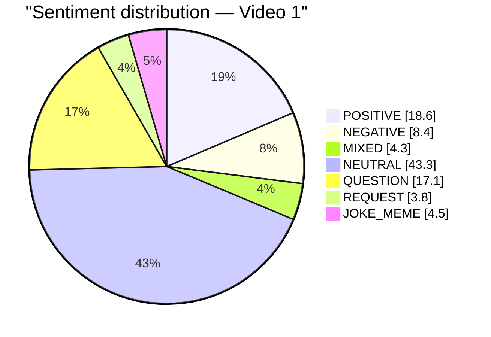

| Sentiment | Percent |
|---|---:|
| POSITIVE | 18.6% |
| NEGATIVE | 8.4% |
| MIXED | 4.3% |
| NEUTRAL | 43.3% |
| QUESTION | 17.1% |
| REQUEST | 3.8% |
| JOKE_MEME | 4.5% |

## 11.2. Comment resonance score by video

- Назва графіка: Comment resonance score by video
- Яке питання він відповідає: наскільки коментарі показують сильну реакцію.
- Які поля використовуються: `comment_resonance_score`.
- Тип графіка: Mermaid bar chart.
- Що видно з графіка: comment resonance score = 4/5.
- Практичний висновок: сильна зона відео — здатність запускати дискусію.

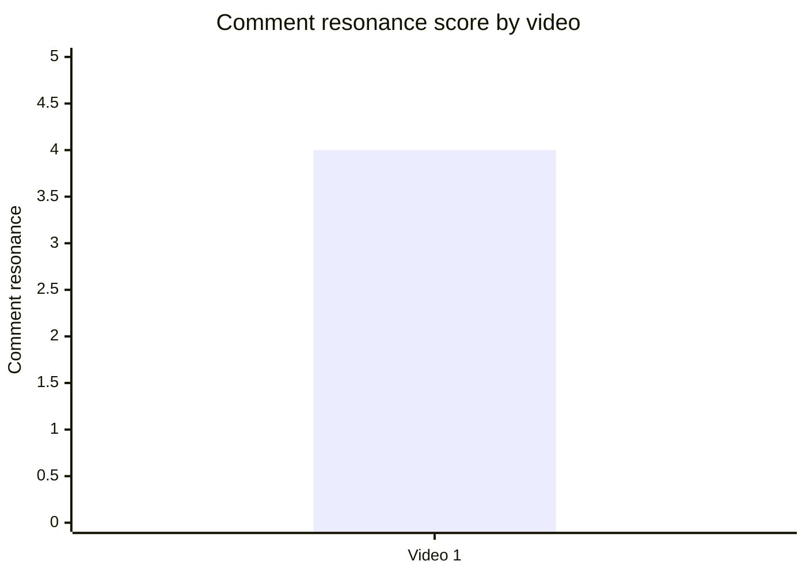

## 11.3. Top comment clusters

- Назва графіка: Top comment clusters
- Яке питання він відповідає: які теми найчастіше з’являються у коментарях.
- Які поля використовуються: `cluster name`, `percent`.
- Тип графіка: Mermaid bar chart.
- Що видно з графіка: домінує broad debate cluster.
- Практичний висновок: масштабувати можна теми, які створюють довгі дискусії, але треба підсилювати credibility.

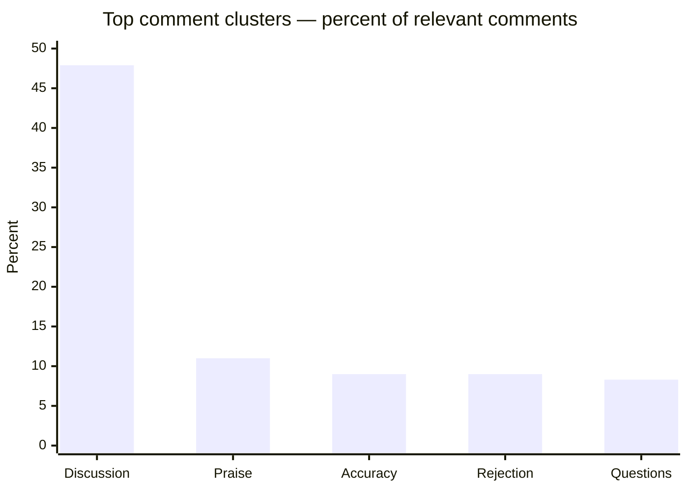

| Cluster | Count | Percent | Strategic meaning |
|---|---:|---:|---|
| COMMUNITY_DISCUSSION | 2,750 | 47.9% | Головний driver — debate про China/Russia/Siberia. |
| PRAISE_CONTENT | 631 | 11.0% | Оригінальний angle резонує. |
| CRITICISM_ACCURACY | 517 | 9.0% | Потрібні sources / qualifications / corrections. |
| CRITICISM_CONTENT | 514 | 9.0% | Тема поляризує; credibility важлива. |
| QUESTION_CLARIFICATION | 477 | 8.3% | Є попит на пояснення і follow-up. |

## 12. Графіки score-системи

## 12.1. Overall score by video

- Назва графіка: Overall score by video
- Яке питання він відповідає: загальна оцінка відео.
- Які поля використовуються: `overall_video_score`.
- Тип графіка: Mermaid bar chart.
- Що видно з графіка: Video 1 має 3.8/5.
- Практичний висновок: кейс сильний за hook/value/comments, але CTA/ad integration не максимальні.

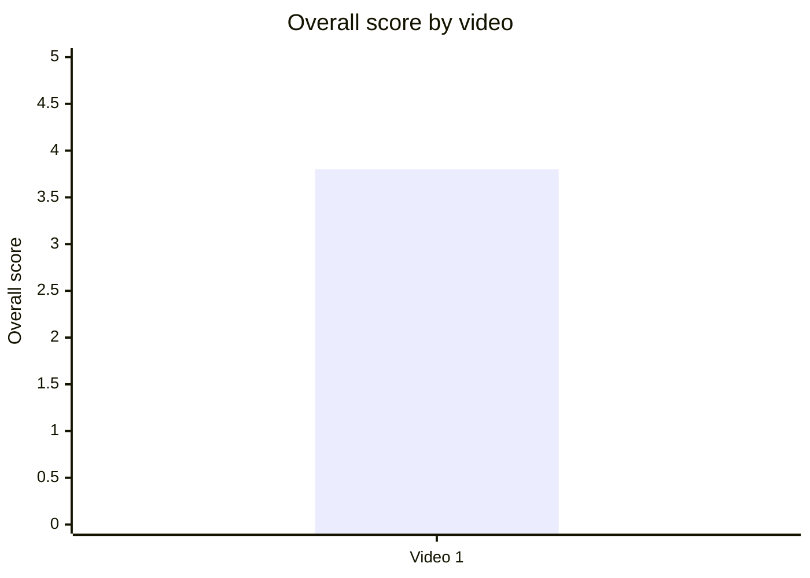

## 12.2. Score breakdown heatmap

- Назва графіка: Score breakdown heatmap
- Яке питання він відповідає: які компоненти сильніші або слабші.
- Які поля використовуються: `hook_score`, `structure_score`, `value_density_score`, `audio_score`, `cta_score`, `ad_integration_score`, `comment_resonance_score`, `replicability_score`, `overall_video_score`.
- Тип графіка: matrix heatmap.
- Що видно з графіка: найслабші зони — CTA і ad integration; сильні — hook, structure, value, audio, comments, replicability.
- Практичний висновок: оптимізація має йти не через зміну теми, а через CTA, source-pack, next-video bridge і cleaner description.

| Video | Hook | Structure | Value Density | Audio | CTA | Ad | Comments | Replicability | Overall |
|---|---:|---:|---:|---:|---:|---:|---:|---:|---:|
| Video 1 | 4 | 4 | 4 | 4 | 3 | 3 | 4 | 4 | 3.8 |

## 12.3. Strengths vs weaknesses count

- Назва графіка: Strengths vs weaknesses count
- Яке питання він відповідає: скільки success mechanics і missed opportunities виділено.
- Які поля використовуються: `top_success_mechanic_*`, `top_missed_opportunity_*`.
- Тип графіка: Mermaid bar chart.
- Що видно з графіка: у Comparable Summary JSON є 3 top success mechanics і 3 top missed opportunities.
- Практичний висновок: для порівняння потрібні інші звіти; тут баланс описовий.

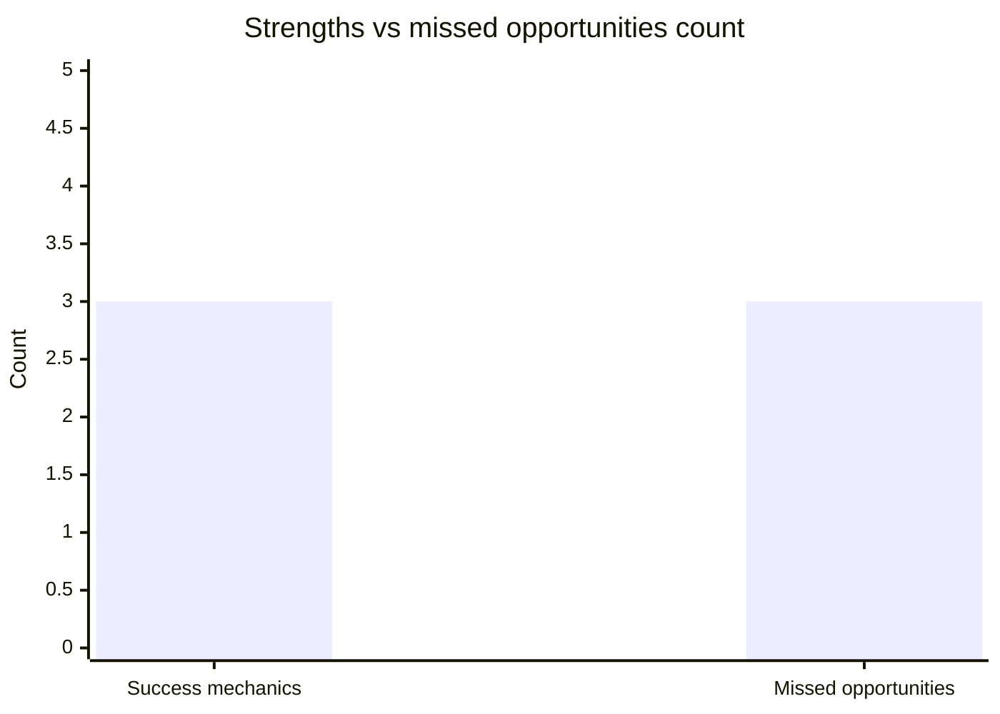

| Type | Count | Items |
|---|---:|---|
| Success mechanics | 3 | `STRONG_TOPIC_DEMAND`, `CONTROVERSY_OR_DEBATE`, `CLEAR_HOOK` |
| Missed opportunities | 3 | `NO_COMMENT_PROMPT`, `NO_NEXT_VIDEO_BRIDGE`, `COMMENTS_SHOW_TOPIC_GAP` |

## 13. Кореляції та патерни

Correlation analysis skipped: fewer than 5 comparable videos.

| Pair | Correlation / Pattern | Strength | Interpretation | Confidence |
|---|---:|---|---|---|
| hook_score → overall_video_score | NOT_COMPARABLE | N/A | Потрібно мінімум 5 відео для обережної кореляції. | LOW |
| value_density_score → er_public_percent | NOT_COMPARABLE | N/A | Є лише 1 відео. | LOW |
| cta_score → comment_rate_percent | NOT_COMPARABLE | N/A | Є лише 1 відео. | LOW |
| comment_resonance_score → er_public_percent | NOT_COMPARABLE | N/A | Є лише 1 відео. | LOW |
| views_per_day → er_public_percent | NOT_COMPARABLE | N/A | Є лише 1 відео. | LOW |
| ad_load_percent → er_public_percent | NOT_COMPARABLE | N/A | Є лише 1 відео. | LOW |
| time_to_first_value_seconds → overall_video_score | INSUFFICIENT_DATA | N/A | Немає нормалізованого seconds value. | LOW |

## 14. Висновки для контент-стратегії

| Спостереження | Дані / графік | Що це означає | Що робити |
|---|---|---|---|
| Hook працює як сильна зона кейсу | Hook score = 4/5; hook type = `CURIOSITY_GAP` | Тема “прихована геополітична правда” створює очікування payoff. | Тестувати схожі hooks, але додавати source-pack. |
| Коментарі — головний сигнал resonance | Comment resonance = 4/5; discussion cluster = 47.9% | Відео запускає debate, а не просто пасивне споживання. | Додати comment prompt із вибором сценаріїв. |
| CTA недовикористаний | CTA score = 3/5; comment prompt ❌; next-video bridge ❌ | Є перегляди й дискусія, але немає повного перетворення у session depth. | Додати verbal CTA після першого value block і end-screen bridge. |
| Реклама не шкодить runtime | ad_load_percent = 0% | Немає in-video interruption. | Залишити рекламу поза runtime, але почистити description від link clutter. |
| Accuracy objections повторюються в коментарях | CRITICISM_ACCURACY = 9.0% | Сильна теза викликає запити на джерела. | Pinned source-pack: 5 sources + 3 caveats + 1 question. |
| Audio не є головною проблемою | audio_score = 4/5 | Оптимізація аудіо не перший пріоритет. | Пріоритет — структура CTA, source-pack, visuals/maps. |

## 15. Що тестувати далі

| Тест | Гіпотеза | На яких даних базується | Як виміряти | Пріоритет |
|---|---|---|---|---|
| Pinned source-pack | Якщо додати джерела й caveats, зменшиться частка accuracy objections. | CRITICISM_ACCURACY = 9.0%; repeated requests for sources/qualifications. | Частка comments із “source?”, “qualifications?”, corrections; comment sentiment. | HIGH |
| Comment prompt після першого payoff | Якщо прямо запитати про сценарій, дискусія стане якіснішою. | Comment prompt ❌; discussion cluster = 47.9%. | Comment rate %, replies per top comment, quality of comments. | HIGH |
| End-screen bridge на related video | Якщо додати watch-next bridge, зросте session depth. | Next video bridge ❌; тема має series potential. | End screen CTR, watch next clicks, session duration. | HIGH |
| Cleaner description hierarchy | Якщо зменшити link clutter, CTA стане зрозумілішим. | CTA overload risk = PARTLY; many description links. | Clicks by link type, support conversion, newsletter signup. | MEDIUM |
| Map-first visual sections | Якщо більше fullscreen maps, знизиться confusion у складних geographic блоках. | Comments mention maps/fullscreen and confusion; score structure/value = 4. | Retention around map segments, comments about clarity. | MEDIUM |
| Shorter/tighter cut | Якщо скоротити до 18–22 хв або зробити 2 parts, зменшиться pacing risk. | Missed opportunity from source report: pacing complaints. | Retention, average view duration, completion rate. | MEDIUM |

## 16. Дані для експорту в таблицю / CSV

| video_label | title | format_group | views | views_per_day | like_rate_percent | comment_rate_percent | er_public_percent | views_per_1k_subs | hook_type | hook_score | cta_count | cta_score | ad_load_percent | ad_integration_score | audio_score | comment_resonance_score | overall_video_score | top_success_mechanic | top_missed_opportunity |
|---|---|---|---:|---:|---:|---:|---:|---:|---|---:|---:|---:|---:|---:|---:|---:|---:|---|---|
| Video 1 | The Truth About Siberia that Russia Wants to Hide | LONG_20_PLUS_MIN | 915756 | 1977.87 | 5.26 | 0.65 | 5.91 | 2244.5 | CURIOSITY_GAP | 4 | 8 | 3 | 0 | 3 | 4 | 4 | 3.8 | STRONG_TOPIC_DEMAND | NO_COMMENT_PROMPT |