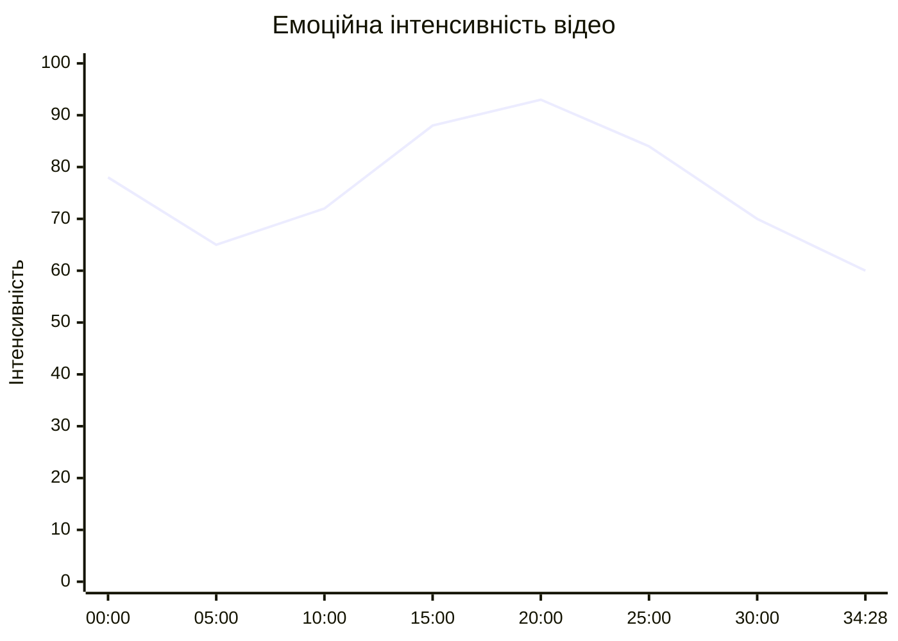
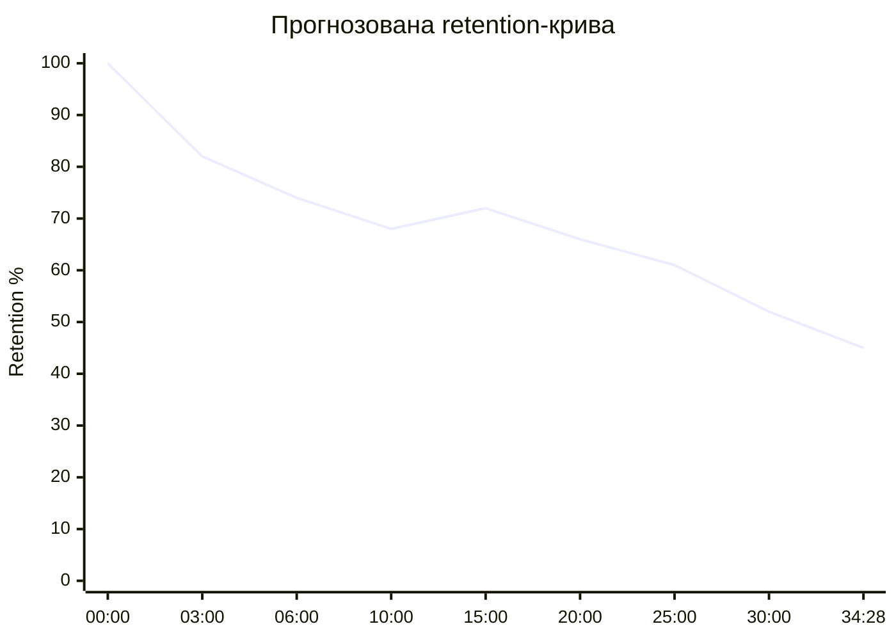
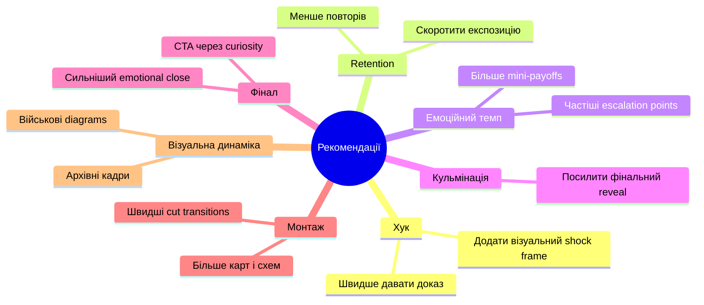

```mermaid
flowchart LR
A["00:00–01:20<br>Хук<br>Росія виявилась значно слабшою, ніж світ вважав"] -->
B["01:20–04:30<br>Експозиція<br>Пояснення міфу про силу РФ та СРСР"] -->
C["04:30–09:40<br>Перша ескалація<br>Порівняння Росії та Китаю через призму корупції"] -->
D["09:40–14:30<br>Переломний момент<br>Розбір військової корупції та фейкової сили"] -->
E["14:30–20:00<br>Наростання напруги<br>Китайські системи та приховані слабкості"] -->
F["20:00–27:00<br>Кульмінація<br>Аргумент: Китай може бути “paper tiger”"] -->
G["27:00–32:00<br>Розв’язка<br>Аналіз економіки, енергетики та логістики Китаю"] -->
H["32:00–34:28<br>Фінальний висновок<br>Заклик переосмислити геополітичні міфи"]
```

```mermaid
flowchart LR
A["00:15<br>Україна зруйнувала міф про РФ<br>Функція: шоковий хук"] -->
B["01:40<br>СРСР і попкультура<br>Функція: контекст"] -->
C["03:20<br>Експерти помилились щодо війни<br>Функція: підрив авторитетів"] -->
D["05:00<br>Порівняння РФ і Китаю<br>Функція: зміна масштабу"] -->
E["07:30<br>Парадність диктатур<br>Функція: візуальна метафора"] -->
F["09:45<br>Інтеграція Ground News<br>Функція: монетизація"] -->
G["12:10<br>Корупція в армії РФ<br>Функція: доказ"] -->
H["16:40<br>Китайські ракетні скандали<br>Функція: escalation"] -->
I["22:30<br>Китай не допомагає РФ напряму<br>Функція: ключовий аргумент"] -->
J["27:10<br>Логістичні слабкості Китаю<br>Функція: стратегічний аналіз"] -->
K["31:20<br>Глобальні наслідки помилкових оцінок<br>Функція: payoff"] -->
L["33:40<br>Підсумок про “paper tiger”<br>Функція: фінальний меседж"]
```

# Аналіз довгоформатного YouTube-відео

## 1. Сюжетна дуга (Narrative Arc)

%%{init: {'theme':'base', 'themeVariables': {
'primaryColor':'#f3f4f6',
'primaryTextColor':'#111827',
'primaryBorderColor':'#2563eb',
'lineColor':'#2563eb',
'secondaryColor':'#ffffff',
'tertiaryColor':'#f3f4f6',
'background':'#f3f4f6'
}}}%%

---

## 2. Ключові Story Beats

%%{init: {'theme':'base', 'themeVariables': {
'primaryColor':'#f3f4f6',
'primaryTextColor':'#111827',
'primaryBorderColor':'#2563eb',
'lineColor':'#2563eb',
'secondaryColor':'#ffffff',
'tertiaryColor':'#f3f4f6',
'background':'#f3f4f6'
}}}%%

---

## 3. Емоційний темп

%%{init: {'theme':'base', 'themeVariables': {
'primaryColor':'#f3f4f6',
'primaryTextColor':'#111827',
'primaryBorderColor':'#2563eb',
'lineColor':'#2563eb',
'secondaryColor':'#ffffff',
'tertiaryColor':'#f3f4f6',
'background':'#f3f4f6'
}}}%%

### Інтерпретація
- 00:00–03:00 — сильний емоційний старт через руйнування глобального міфу.
- 12:00–22:00 — максимальна інтенсивність через приклади корупції та “фейкової сили”.
- 27:00+ — темп знижується, відео переходить у стратегічний аналіз і висновки.

---

## 4. Утримання аудиторії

Retention-дані YouTube Studio не надані. Нижче — прогнозована retention-крива (`LOW_CONFIDENCE`).

%%{init: {'theme':'base', 'themeVariables': {
'primaryColor':'#f3f4f6',
'primaryTextColor':'#111827',
'primaryBorderColor':'#2563eb',
'lineColor':'#2563eb',
'secondaryColor':'#ffffff',
'tertiaryColor':'#f3f4f6',
'background':'#f3f4f6'
}}}%%

### Інтерпретація
- Найбільше падіння ймовірне між 00:30–03:00 через довгу експозицію.
- Потенційний spike біля 12:00–20:00 через конкретні приклади корупції.
- Поступовий спад після 27:00 через абстрактні геополітичні висновки.

---

## 5. Піки retention

| Таймкод | Подія | Чому це може утримувати увагу | Сила піку 1–10 |
|---|---|---|---:|
| 00:15 | “Світ помилявся щодо Росії” | Сильний конфлікт і ревізія усталених уявлень | 9 |
| 05:00 | Перехід від РФ до Китаю | Масштабування теми та новий intrigue hook | 8 |
| 12:10 | Розбір корупції в армії РФ | Конкретні деталі й приклади | 9 |
| 16:40 | Фейкові китайські ракетні системи | Скандальний елемент | 10 |
| 22:30 | Китай не рятує Росію | Сильний геополітичний аргумент | 8 |
| 31:20 | Переосмислення сили Китаю | Великий payoff усієї тези відео | 7 |

---

## 6. Провали retention

| Таймкод | Проблема | Ймовірна причина спаду | Що покращити |
|---|---|---|---|
| 01:30–03:30 | Затяжна експозиція | Багато контексту без нової інформації | Додати швидші cutaways і B-roll |
| 09:40–11:00 | Sponsor integration | Переривання narrative momentum | Скоротити інтеграцію або зробити її нативнішою |
| 27:00–30:00 | Абстрактний стратегічний аналіз | Менше конкретики та візуальної динаміки | Додати карти, графіки, кейси |
| 32:00–34:00 | Повторення основної тези | Втрата новизни | Додати сильніший фінальний twist |

---

## 7. Оцінка сегментів

| Сегмент | Таймкод | Функція | Емоційна інтенсивність | Ризик втрати уваги | Оцінка 1–10 | Що покращити |
|---|---|---|---|---|---:|---|
| Хук | 00:00–01:20 | Захоплення уваги | Висока | Низький | 9 | Швидше перейти до доказів |
| Експозиція | 01:20–04:30 | Контекст | Середня | Середній | 7 | Додати візуальну динаміку |
| Порівняння РФ і Китаю | 04:30–09:40 | Narrative bridge | Висока | Низький | 8 | Скоротити повтори |
| Sponsor segment | 09:40–11:00 | Монетизація | Низька | Високий | 5 | Інтегрувати органічніше |
| Корупція РФ | 11:00–16:00 | Доказова база | Дуже висока | Низький | 9 | Додати ще більше візуальних прикладів |
| Китайські скандали | 16:00–22:00 | Escalation | Дуже висока | Низький | 10 | Сильний сегмент |
| Геополітичний аналіз | 22:00–30:00 | Strategic payoff | Середня | Середній | 7 | Більше конкретних кейсів |
| Фінал | 30:00–34:28 | Висновок | Середня | Середній | 7 | Сильніший emotional close |

---

## 8. Практичні рекомендації

%%{init: {'theme':'base', 'themeVariables': {
'primaryColor':'#f3f4f6',
'primaryTextColor':'#111827',
'primaryBorderColor':'#2563eb',
'lineColor':'#2563eb',
'secondaryColor':'#ffffff',
'tertiaryColor':'#f3f4f6',
'background':'#f3f4f6'
}}}%%

---

## 9. Підсумкова оцінка

| Показник | Оцінка 1–10 | Коментар |
|---|---:|---|
| Сюжетна дуга | 8 | Сильна escalation-структура та чітка теза |
| Story Beats | 9 | Багато конкретних сюжетних точок із payoff |
| Емоційний темп | 8 | Хороше наростання, але є затяжні ділянки |
| Retention Structure | 7 | Потенційні провали через sponsor segment і довгі пояснення |
| Загальна оцінка | 8 | Сильне long-form essay video з хорошим narrative control |
