# Статистичний аналіз відеозвітів

## 1. Короткий executive summary

| Пункт | Висновок |
|---|---|
| Скільки відео проаналізовано | 1 |
| Скільки форматів відео | 1: `LONG_20_PLUS_MIN` |
| Найсильніше відео за overall score | Video 1 — 4.20/5 |
| Найсильніше відео за ER Public % | Video 1 — 6.01% |
| Найсильніше відео за views per day | Video 1 — 5,050.83 |
| Найсильніша повторювана механіка | `INSUFFICIENT_DATA`: є лише 1 відео, тому повторюваність не перевіряється статистично. У цьому відео топ-механіка: `CLEAR_HOOK`. |
| Найчастіша слабкість | `INSUFFICIENT_DATA`: є лише 1 відео. Для цього відео головна слабкість: `NO_COMMENT_PROMPT`. |
| Головна стратегічна можливість | Масштабувати формулу “відомий провал/міф → прихований висновок про більшу геополітичну тему”, але перевірити на більшій вибірці. |
| Рівень впевненості | LOW: 1 відео, `PARTIAL_DATA`, `NO_TIMECODES`, owner-only метрики недоступні. |

## 2. Якість і повнота даних

| Поле | Кількість відео з даними | Кількість N/A | Коментар |
|---|---:|---:|---|
| views | 1 | 0 | Є raw public metric. |
| likes | 1 | 0 | Є raw public metric. |
| comments_count | 1 | 0 | Є raw public metric; parsed comments = `PARTIAL_DATA`. |
| views_per_day | 1 | 0 | Є derived metric у звіті. |
| er_public_percent | 1 | 0 | Є derived metric у звіті. |
| views_per_1k_subs | 1 | 0 | Є, бо subscribers надані. |
| hook_score | 1 | 0 | Є score 1–5. |
| cta_score | 1 | 0 | Є score 1–5. |
| ad_integration_score | 1 | 0 | Є score 1–5. |
| audio_score | 1 | 0 | Є score 1–5, але `LOW_CONFIDENCE`. |
| comment_resonance_score | 1 | 0 | Є score 1–5. |
| overall_video_score | 1 | 0 | Є calculated score. |

### Обмеження аналізу

- Є тільки 1 відео, тому всі порівняння, рейтинги, патерни та висновки мають `LOW_CONFIDENCE`.
- Кореляції не будуються: потрібно мінімум 5 порівнюваних відео.
- Усі графіки є описовими для одного відео, а не статистично порівняльними.
- Таймкоди у звіті позначені як `NO_TIMECODES_APPROX`, тому графіки з `time_to_first_value_seconds` не будуються.
- CTR, impressions, retention, watch time, traffic sources, subscribers gained, revenue — `OWNER_ONLY` / відсутні у звіті.

## 3. Підготовлена таблиця для графіків

| Video | Format | Views | Likes | Comments | Views/day | Like Rate % | Comment Rate % | ER Public % | Views/1k subs | Hook | CTA | Ad | Audio | Comment Resonance | Overall |
|---|---|---:|---:|---:|---:|---:|---:|---:|---:|---:|---:|---:|---:|---:|---:|
| Video 1 | LONG_20_PLUS_MIN | 1,015,216 | 51,569 | 9,434 | 5,050.83 | 5.08 | 0.93 | 6.01 | 2,446.30 | 5 | 5 | 5 | 5 | 5 | 0 |

| Label | Full title | URL |
|---|---|---|
| Video 1 | Ukraine Has Exposed the Truth About China’s Military (It’s Embarrassing!) | https://www.youtube.com/watch?v=Pe80P7uIYPk |

## 4. Рекомендовані графіки

| # | Назва графіка | Тип графіка | Поля | Для чого потрібен | Пріоритет |
|---:|---|---|---|---|---|
| 1 | Overall score by video | Mermaid bar chart | overall_video_score | Побачити загальну силу відео | HIGH |
| 2 | Views per day by video | Mermaid bar chart | views_per_day | Оцінити швидкість набору переглядів | HIGH |
| 3 | ER Public % by video | Mermaid bar chart | er_public_percent | Оцінити публічне залучення | HIGH |
| 4 | ER Public % vs Views/day | Таблиця замість scatter | er_public_percent, views_per_day | Баланс охоплення і реакції | HIGH |
| 5 | Hook score by video | Mermaid bar chart | hook_score | Оцінити силу hook | HIGH |
| 6 | CTA score by video | Mermaid bar chart | cta_score | Оцінити CTA | HIGH |
| 7 | Score breakdown heatmap | Matrix table | score fields | Побачити сильні/слабкі сторони | HIGH |
| 8 | Sentiment distribution | Mermaid pie chart + table | comment sentiment % | Оцінити реакцію аудиторії | HIGH |
| 9 | CTA features heatmap | Matrix table | CTA booleans | Побачити CTA-набір | HIGH |
| 10 | Ad load % by video | Mermaid bar chart | ad_load_percent | Оцінити рекламне навантаження | HIGH |

## 5. Графіки продуктивності

### 5.1. Views by video

- Назва графіка: Views by video
- Яке питання він відповідає: який raw reach має відео?
- Які поля використовуються: `video_label`, `views`
- Тип графіка: Mermaid bar chart
- Що видно з графіка: Video 1 має 1,015,216 переглядів.
- Практичний висновок: raw views високі в абсолюті, але без інших відео/когорти не можна визначити outlier статистично.

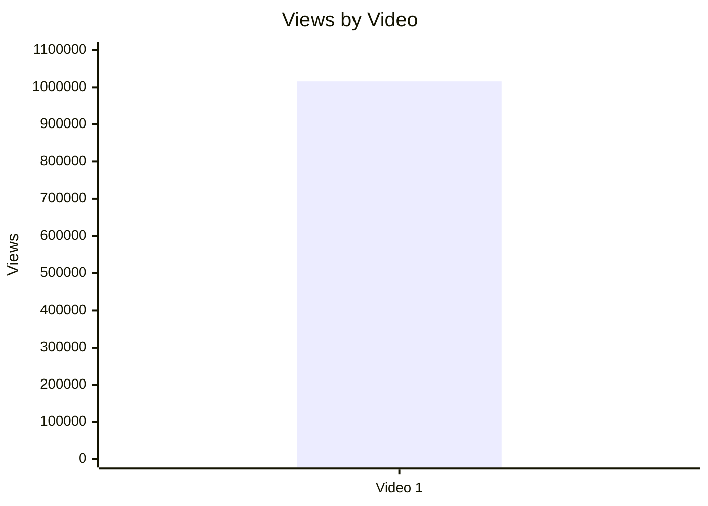
```mermaid
xychart-beta
    title "Views by Video"
    x-axis ["Video 1"]
    y-axis "Views" 0 --> 1100000
    bar [1015216]
```

### 5.2. Views per day by video

- Назва графіка: Views per day by video
- Яке питання він відповідає: яка нормалізована швидкість набору переглядів?
- Які поля використовуються: `video_label`, `views_per_day`
- Тип графіка: Mermaid bar chart
- Що видно з графіка: Video 1 має 5,050.83 переглядів/день.
- Практичний висновок: це краща метрика для майбутнього порівняння з іншими відео, ніж raw views.

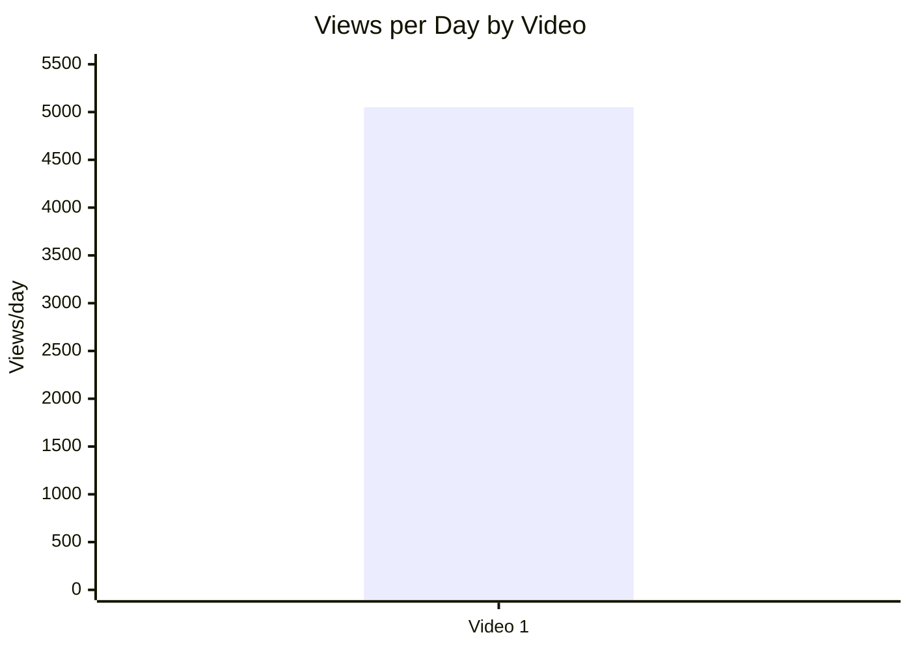
```mermaid
xychart-beta
    title "Views per Day by Video"
    x-axis ["Video 1"]
    y-axis "Views/day" 0 --> 5500
    bar [5050.83]
```

### 5.3. Views per 1k subscribers

- Назва графіка: Views per 1k subscribers
- Яке питання він відповідає: наскільки відео перетворило розмір каналу в перегляди?
- Які поля використовуються: `video_label`, `views_per_1k_subs`
- Тип графіка: Mermaid bar chart
- Що видно з графіка: Video 1 має 2,446.30 views/1k subs.
- Практичний висновок: відео вийшло за межі бази підписників; для підтвердження сили потрібні інші відео каналу.

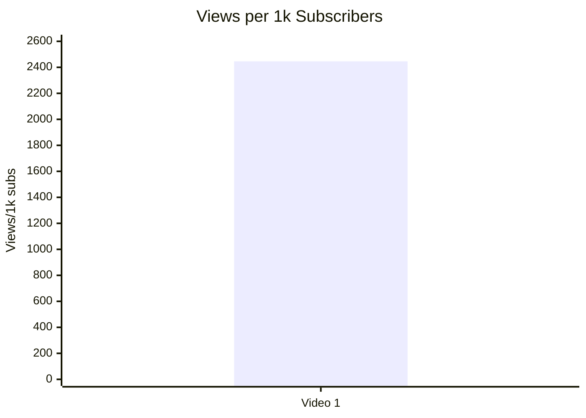
```mermaid
xychart-beta
    title "Views per 1k Subscribers"
    x-axis ["Video 1"]
    y-axis "Views/1k subs" 0 --> 2600
    bar [2446.30]
```

### 5.4. Performance quadrant

- Назва графіка: Performance quadrant
- Яке питання він відповідає: де відео стоїть за балансом охоплення і залучення?
- Які поля використовуються: `views_per_day`, `er_public_percent`
- Тип графіка: scatter/quadrant
- Що видно з графіка: `INSUFFICIENT_DATA` для quadrant thresholds, бо є тільки 1 відео.
- Практичний висновок: збережено точку для майбутнього порівняння.

| Video | Views/day | ER Public % | Quadrant |
|---|---:|---:|---|
| Video 1 | 5,050.83 | 6.01 | `INSUFFICIENT_DATA`: немає медіан/порогів когорти. |

## 6. Графіки залучення

### 6.1. ER Public % by video

- Назва графіка: ER Public % by video
- Яке питання він відповідає: який рівень публічного engagement?
- Які поля використовуються: `video_label`, `er_public_percent`
- Тип графіка: Mermaid bar chart
- Що видно з графіка: ER Public = 6.01%.
- Практичний висновок: метрика корисна як baseline для наступних відео; без benchmark не називаємо її “доброю/поганою”.

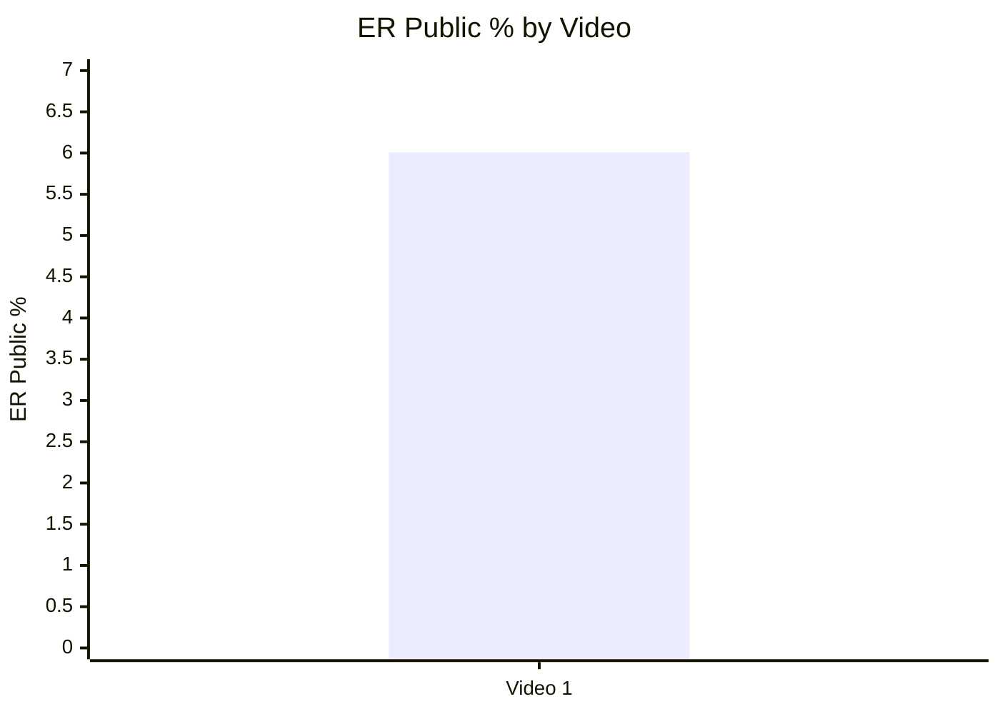
```mermaid
xychart-beta
    title "ER Public % by Video"
    x-axis ["Video 1"]
    y-axis "ER Public %" 0 --> 7
    bar [6.01]
```

### 6.2. Like Rate % vs Comment Rate %

- Назва графіка: Like Rate % vs Comment Rate %
- Яке питання він відповідає: відео більше отримує підтримку чи дискусію?
- Які поля використовуються: `like_rate_percent`, `comment_rate_percent`
- Тип графіка: scatter plot
- Що видно з графіка: Like Rate = 5.08%, Comment Rate = 0.93%.
- Практичний висновок: точка показує одночасно помітну підтримку і дискусійність, але без порівняльної когорти це лише baseline.

| Video | Like Rate % | Comment Rate % | Interpretation |
|---|---:|---:|---|
| Video 1 | 5.08 | 0.93 | `LOW_CONFIDENCE`: сильна реакція в абсолютних числах; потрібні інші відео для порівняння. |

### 6.3. Comments per 1k views

- Назва графіка: Comments per 1k views
- Яке питання він відповідає: наскільки відео провокує коментарі на одиницю переглядів?
- Які поля використовуються: `video_label`, `comments_per_1k_views`
- Тип графіка: Mermaid bar chart
- Що видно з графіка: 9.29 comments/1k views.
- Практичний висновок: це важлива baseline-метрика для тем із високою дискусійністю.

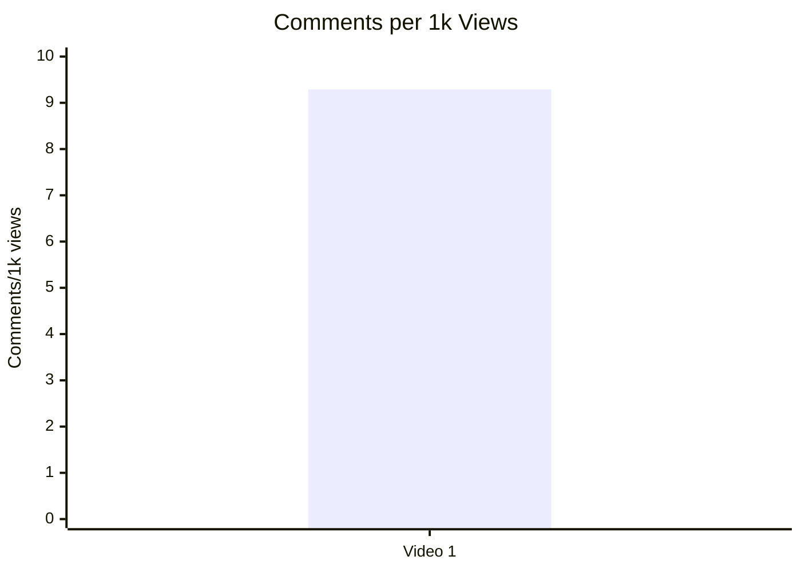
```mermaid
xychart-beta
    title "Comments per 1k Views"
    x-axis ["Video 1"]
    y-axis "Comments/1k views" 0 --> 10
    bar [9.29]
```

## 7. Графіки структури та hook

### 7.1. Hook score by video

- Назва графіка: Hook score by video
- Яке питання він відповідає: наскільки сильний старт відео?
- Які поля використовуються: `video_label`, `hook_score`
- Тип графіка: Mermaid bar chart
- Що видно з графіка: hook_score = 5/5.
- Практичний висновок: hook — найсильніший елемент цього відео; варто тестувати формулу на інших темах.

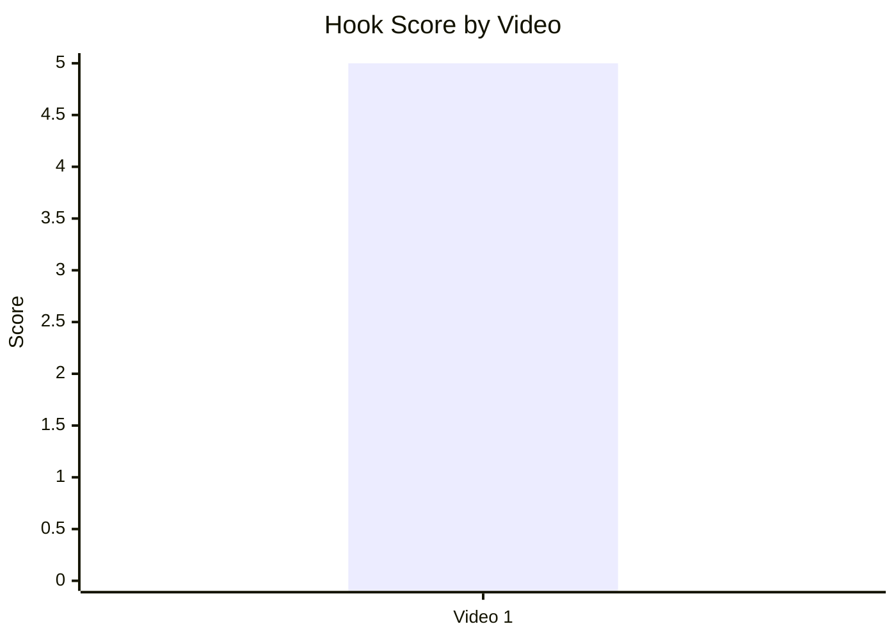
```mermaid
xychart-beta
    title "Hook Score by Video"
    x-axis ["Video 1"]
    y-axis "Score" 0 --> 5
    bar [5]
```

### 7.2. Hook type distribution

- Назва графіка: Hook type distribution
- Яке питання він відповідає: який тип hook використовується?
- Які поля використовуються: `hook_primary_type`, count
- Тип графіка: Mermaid pie chart
- Що видно з графіка: 100% наявної вибірки — `CURIOSITY_GAP`.
- Практичний висновок: не можна казати, що цей тип “працює краще”, бо є лише 1 відео; можна тестувати його повторно.

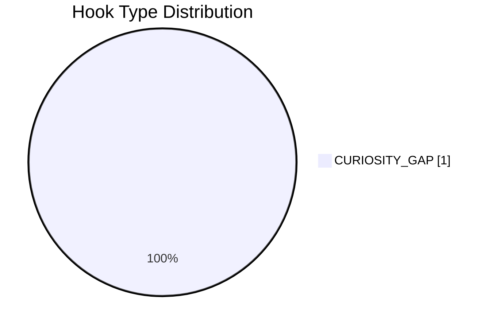
```mermaid
pie showData
    title Hook Type Distribution
    "CURIOSITY_GAP" : 1
```

### 7.3. Time to first value vs Overall Score

- Назва графіка: Time to first value vs Overall Score
- Яке питання він відповідає: чи швидша перша цінність пов’язана з вищим score?
- Які поля використовуються: `time_to_first_value_seconds`, `overall_video_score`
- Тип графіка: scatter plot
- Що видно з графіка: графік не будується.
- Практичний висновок: потрібні точні таймкоди або перетворені секунди.

| Video | time_to_first_value | time_to_first_value_seconds | Overall |
|---|---|---:|---:|
| Video 1 | NO_TIMECODES_APPROX_03:15 | INSUFFICIENT_DATA | 4.20 |

## 8. Графіки CTA

### 8.1. CTA score by video

- Назва графіка: CTA score by video
- Яке питання він відповідає: наскільки якісно вбудовані CTA?
- Які поля використовуються: `video_label`, `cta_score`
- Тип графіка: Mermaid bar chart
- Що видно з графіка: CTA score = 3/5.
- Практичний висновок: CTA працює, але є явна зона покращення: comment prompt і timing sponsor CTA.

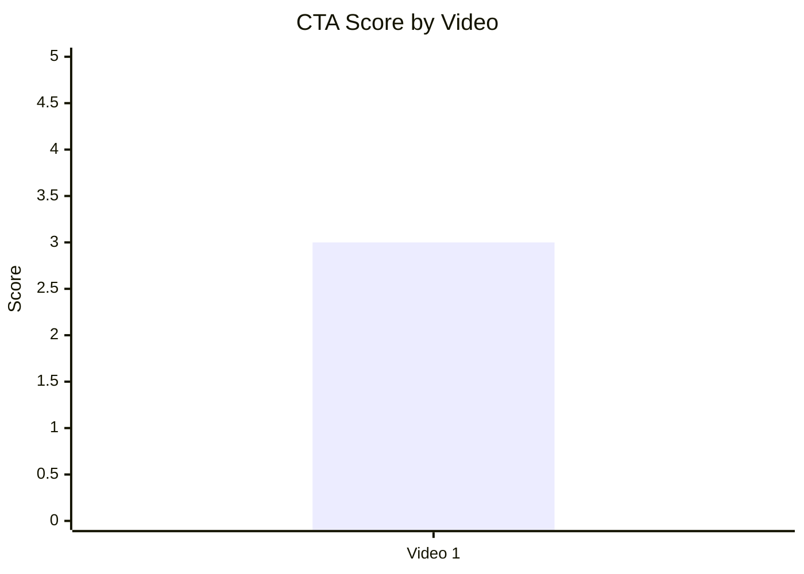
```mermaid
xychart-beta
    title "CTA Score by Video"
    x-axis ["Video 1"]
    y-axis "Score" 0 --> 5
    bar [3]
```

### 8.2. CTA count vs ER Public %

- Назва графіка: CTA count vs ER Public %
- Яке питання він відповідає: чи більше CTA пов’язано з кращим engagement?
- Які поля використовуються: `cta_count`, `er_public_percent`
- Тип графіка: scatter plot
- Що видно з графіка: `INSUFFICIENT_DATA` для зв’язку, бо є 1 відео.
- Практичний висновок: для Video 1 CTA count = 7, ER = 6.01%; висновок про overload/ефективність можливий тільки після 5+ відео.

| Video | CTA count | ER Public % | CTA overload note |
|---|---:|---:|---|
| Video 1 | 7 | 6.01 | PARTLY: фінал містить like + subscribe + support + next video; comment prompt відсутній. |

### 8.3. CTA features heatmap

- Назва графіка: CTA features heatmap
- Яке питання він відповідає: які CTA-елементи присутні?
- Які поля використовуються: `has_comment_prompt`, `has_subscribe_cta`, `has_like_cta`, `has_bell_cta`, `has_next_video_bridge`
- Тип графіка: matrix / heatmap table
- Що видно з графіка: є like, subscribe, next-video bridge; немає comment prompt і bell.
- Практичний висновок: головний тест — додати конкретний comment prompt після першого proof/payoff.

| Video | Comment prompt | Subscribe | Like | Bell | Next video bridge |
|---|---|---|---|---|---|
| Video 1 | ❌ | ✅ | ✅ | ❌ | ✅ |

## 9. Графіки реклами / інтеграцій

### 9.1. Ad load % by video

- Назва графіка: Ad load % by video
- Яке питання він відповідає: яке рекламне навантаження у відео?
- Які поля використовуються: `video_label`, `ad_load_percent`
- Тип графіка: Mermaid bar chart
- Що видно з графіка: ad_load_percent = 4.74%.
- Практичний висновок: навантаження не виглядає надмірним за часткою, але placement ранній.

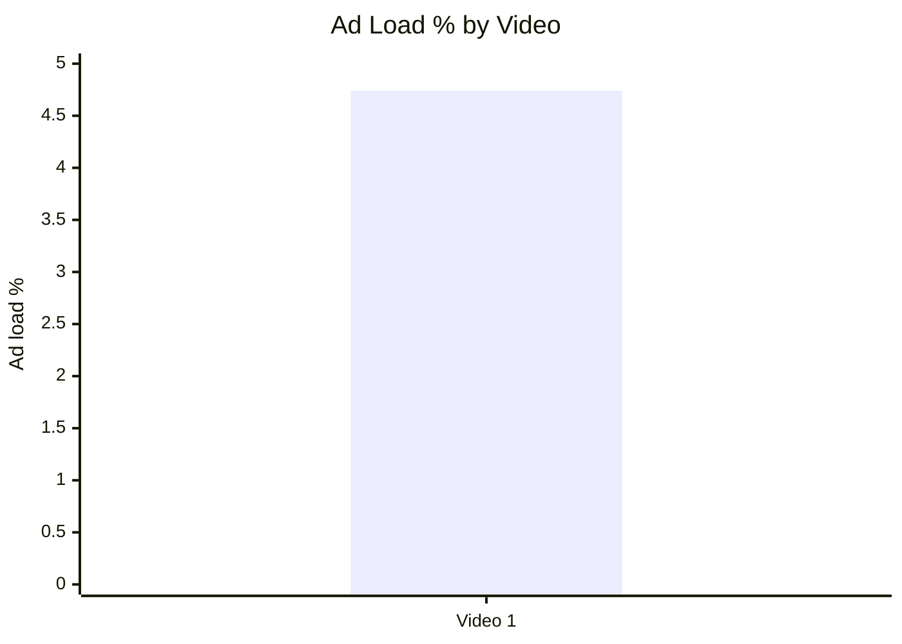
```mermaid
xychart-beta
    title "Ad Load % by Video"
    x-axis ["Video 1"]
    y-axis "Ad load %" 0 --> 5
    bar [4.74]
```

### 9.2. First ad position %

- Назва графіка: First ad position %
- Яке питання він відповідає: наскільки рано стоїть перша реклама?
- Які поля використовуються: `first_ad_relative_position_percent`
- Тип графіка: Mermaid bar chart
- Що видно з графіка: перша реклама приблизно на 13.5% відео.
- Практичний висновок: тестувати перенос реклами після першого сильного proof-блоку.

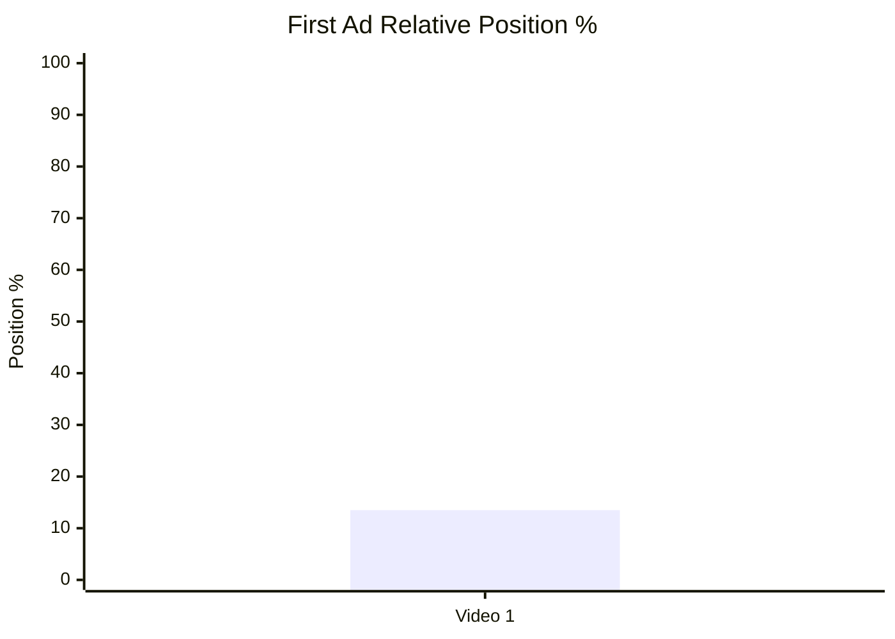
```mermaid
xychart-beta
    title "First Ad Relative Position %"
    x-axis ["Video 1"]
    y-axis "Position %" 0 --> 100
    bar [13.5]
```

### 9.3. Ad integration score vs ER Public %

- Назва графіка: Ad integration score vs ER Public %
- Яке питання він відповідає: чи якість інтеграції пов’язана з реакцією аудиторії?
- Які поля використовуються: `ad_integration_score`, `er_public_percent`
- Тип графіка: scatter plot
- Що видно з графіка: `INSUFFICIENT_DATA` для зв’язку, бо є 1 відео.
- Практичний висновок: current baseline — Ad score 4, ER 6.01%; потрібна серія відео з різним ad timing/load.

| Video | Ad integration score | ER Public % | Note |
|---|---:|---:|---|
| Video 1 | 4 | 6.01 | Тематично релевантна інтеграція, але ранній timing. |

## 10. Графіки аудіо

### 10.1. Audio score by video

- Назва графіка: Audio score by video
- Яке питання він відповідає: яка технічна/аналітична оцінка аудіо?
- Які поля використовуються: `video_label`, `audio_score`
- Тип графіка: Mermaid bar chart
- Що видно з графіка: audio_score = 4/5.
- Практичний висновок: аудіо не виглядає головним bottleneck, але оцінка має `LOW_CONFIDENCE`.

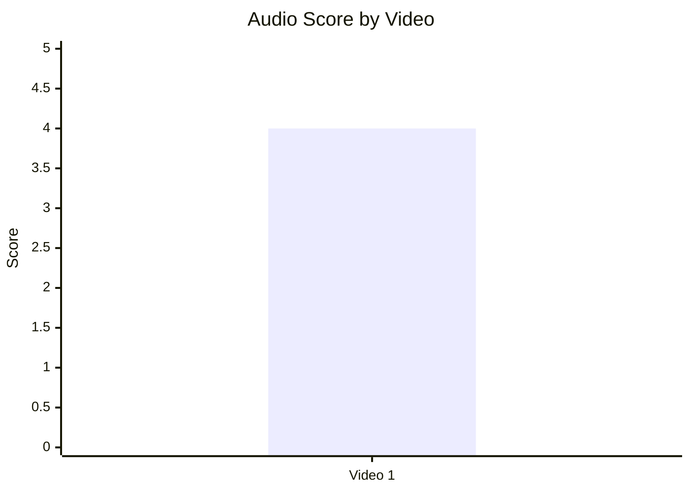
```mermaid
xychart-beta
    title "Audio Score by Video"
    x-axis ["Video 1"]
    y-axis "Score" 0 --> 5
    bar [4]
```

### 10.2. Audio score vs Overall Score

- Назва графіка: Audio score vs Overall Score
- Яке питання він відповідає: чи кращий audio score пов’язаний із higher overall?
- Які поля використовуються: `audio_score`, `overall_video_score`
- Тип графіка: scatter plot
- Що видно з графіка: `INSUFFICIENT_DATA` для зв’язку, бо є 1 відео.
- Практичний висновок: зберегти як baseline для майбутніх звітів.

| Video | Audio score | Overall score | Confidence |
|---|---:|---:|---|
| Video 1 | 4 | 4.20 | LOW_CONFIDENCE |

## 11. Графіки коментарів

### 11.1. Sentiment distribution

- Назва графіка: Sentiment distribution
- Яке питання він відповідає: яка структура реакції аудиторії?
- Які поля використовуються: `positive_percent`, `negative_percent`, `mixed_percent`, `neutral_percent`, `question_percent`, `request_percent`, `joke_meme_percent`
- Тип графіка: Mermaid pie chart + table
- Що видно з графіка: найбільша частка — neutral/discussion; значні частки negative, questions і meme reactions.
- Практичний висновок: тема не просто “лайкова”, а дискусійна; варто додавати rebuttal/FAQ-блоки.

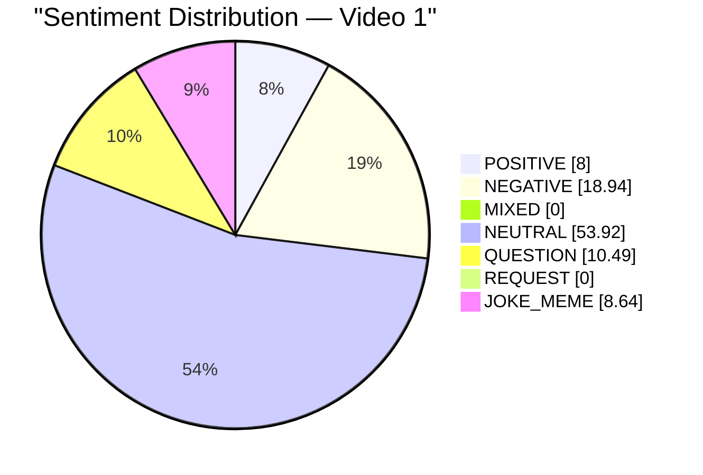
```mermaid
pie showData
    title "Sentiment Distribution — Video 1"
    "POSITIVE" : 8.00
    "NEGATIVE" : 18.94
    "MIXED" : 0.00
    "NEUTRAL" : 53.92
    "QUESTION" : 10.49
    "REQUEST" : 0.00
    "JOKE_MEME" : 8.64
```

| Sentiment | Count | Percent |
|---|---:|---:|
| POSITIVE | 716 | 8.00 |
| NEGATIVE | 1,694 | 18.94 |
| MIXED | 0 | 0.00 |
| NEUTRAL | 4,823 | 53.92 |
| QUESTION | 938 | 10.49 |
| REQUEST | 0 | 0.00 |
| JOKE_MEME | 773 | 8.64 |

### 11.2. Comment resonance score by video

- Назва графіка: Comment resonance score by video
- Яке питання він відповідає: наскільки сильно відео резонує в коментарях?
- Які поля використовуються: `video_label`, `comment_resonance_score`
- Тип графіка: Mermaid bar chart
- Що видно з графіка: comment_resonance_score = 5/5.
- Практичний висновок: коментарі — сильна сторона; треба краще направляти їх через comment prompt.

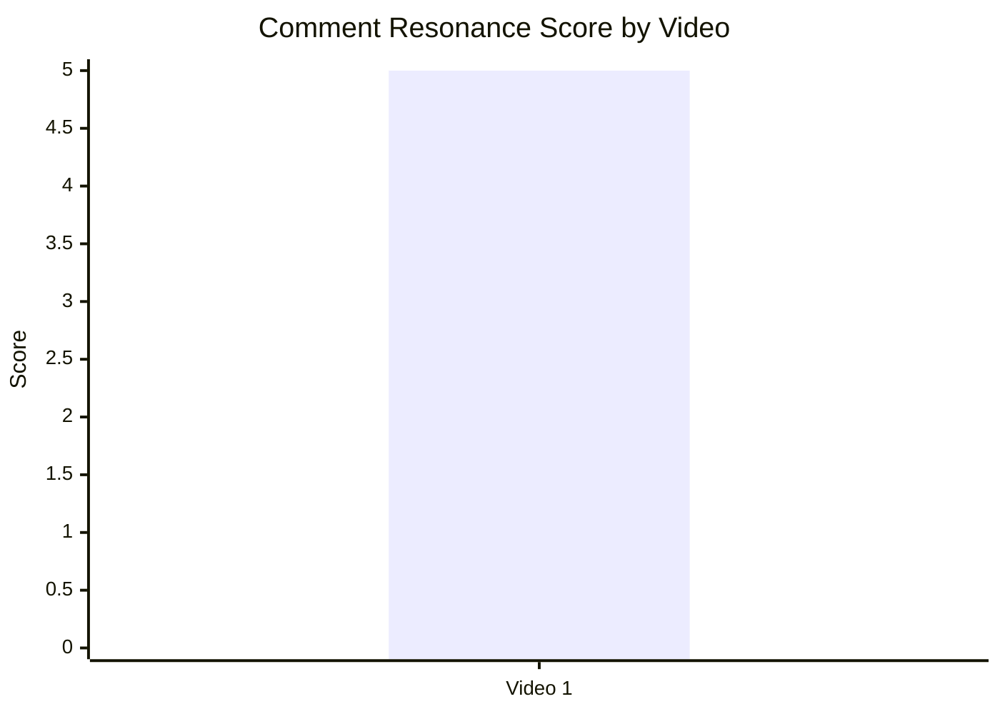
```mermaid
xychart-beta
    title "Comment Resonance Score by Video"
    x-axis ["Video 1"]
    y-axis "Score" 0 --> 5
    bar [5]
```

### 11.3. Top comment clusters

- Назва графіка: Top comment clusters
- Яке питання він відповідає: які теми найчастіше виникають у коментарях?
- Які поля використовуються: cluster name, count, percent
- Тип графіка: table замість horizontal bar chart
- Що видно з графіка: найбільший кластер — запити/уточнення; далі підтримка paper tiger / meme frame.
- Практичний висновок: наступні відео варто будувати як response to objections + продовження “China/Russia/Ukraine” серії.

| Cluster | Count | % of relevant comments | Strategic meaning |
|---|---:|---:|---|
| Запити / уточнення | 1,697 | 18.98 | Високий попит на follow-up / FAQ / rebuttal video. |
| Підтримка “China/Russia paper tiger” | 1,426 | 15.94 | Meme-frame має потенціал для Shorts і повторюваної серії. |
| Заперечення / “це пропаганда” | 761 | 8.51 | Треба сильніше закривати контраргументи. |
| Не недооцінювати Китай: manufacturing/economy | 671 | 7.50 | Потрібен balanced steelman блок. |
| Жарти / меми | 624 | 6.98 | Тема легко мемифікується. |
| Корупція як ключова причина | 524 | 5.86 | Центральна теза резонує. |
| Роль НАТО / допомоги Україні | 461 | 5.15 | Основний контраргумент до premise. |
| Дрони / нова епоха війни | 213 | 2.38 | Перспективна тема для окремого відео. |
| Продакшн / поведінка в кадрі | 51 | 0.57 | Низький, але помітний production feedback. |
| Реклама / Ground News | 20 | 0.22 | Масової ad fatigue не видно. |

## 12. Графіки score-системи

### 12.1. Overall score by video

- Назва графіка: Overall score by video
- Яке питання він відповідає: яка загальна оцінка відео?
- Які поля використовуються: `video_label`, `overall_video_score`
- Тип графіка: Mermaid bar chart
- Що видно з графіка: overall_video_score = 4.20/5.
- Практичний висновок: сильний baseline для майбутньої когорти, але не рейтинг без інших відео.

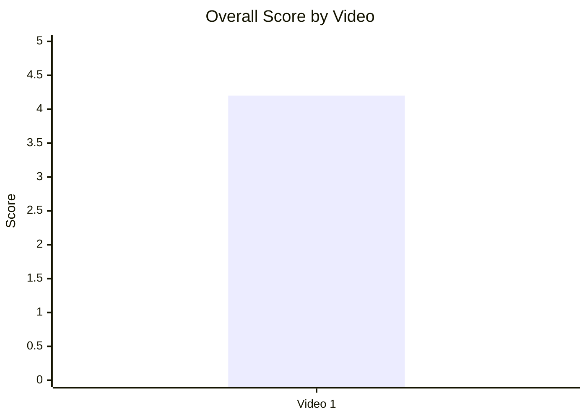
```mermaid
xychart-beta
    title "Overall Score by Video"
    x-axis ["Video 1"]
    y-axis "Score" 0 --> 5
    bar [4.20]
```

### 12.2. Score breakdown heatmap

- Назва графіка: Score breakdown heatmap
- Яке питання він відповідає: які елементи найсильніші/найслабші?
- Які поля використовуються: score fields 1–5
- Тип графіка: heatmap / matrix table
- Що видно з графіка: найсильніші — Hook і Comments; найслабший — CTA.
- Практичний висновок: не треба змінювати ядро hook/теми; треба оптимізувати CTA і ad timing.

| Video | Hook | Structure | Value Density | Audio | CTA | Ad | Comments | Replicability | Overall |
|---|---:|---:|---:|---:|---:|---:|---:|---:|---:|
| Video 1 | 5 | 4 | 4 | 4 | 3 | 4 | 5 | 4 | 4.20 |

### 12.3. Strengths vs weaknesses count

- Назва графіка: Strengths vs weaknesses count
- Яке питання він відповідає: скільки success mechanics і missed opportunities виділено?
- Які поля використовуються: count of success mechanics, count of missed opportunities
- Тип графіка: Mermaid bar chart
- Що видно з графіка: 5 success mechanics, 5 missed opportunities.
- Практичний висновок: сильне відео не означає відсутність оптимізацій; найближчі тести — CTA/comment prompt/ad timing.

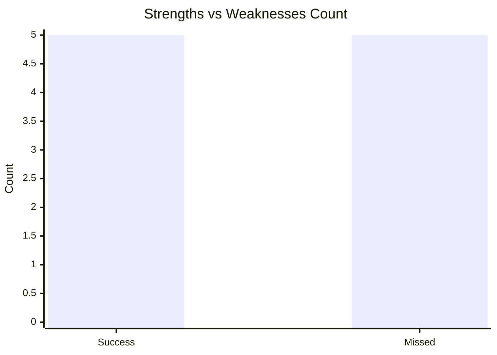
```mermaid
xychart-beta
    title "Strengths vs Weaknesses Count"
    x-axis ["Success", "Missed"]
    y-axis "Count" 0 --> 5
    bar [5, 5]
```

## 13. Кореляції та патерни

Correlation analysis skipped: fewer than 5 comparable videos.

| Pair | Correlation / Pattern | Strength | Interpretation | Confidence |
|---|---:|---|---|---|
| hook_score → overall_video_score | INSUFFICIENT_DATA | N/A | Є лише 1 відео; не можна оцінити зв’язок. | LOW |
| value_density_score → er_public_percent | INSUFFICIENT_DATA | N/A | Є лише 1 відео; не можна оцінити зв’язок. | LOW |
| cta_score → comment_rate_percent | INSUFFICIENT_DATA | N/A | Є лише 1 відео; не можна оцінити зв’язок. | LOW |
| comment_resonance_score → er_public_percent | INSUFFICIENT_DATA | N/A | Є лише 1 відео; не можна оцінити зв’язок. | LOW |
| views_per_day → er_public_percent | INSUFFICIENT_DATA | N/A | Є лише 1 відео; не можна оцінити зв’язок. | LOW |
| ad_load_percent → er_public_percent | INSUFFICIENT_DATA | N/A | Є лише 1 відео; не можна оцінити зв’язок. | LOW |
| time_to_first_value_seconds → overall_video_score | INSUFFICIENT_DATA | N/A | Немає точного `time_to_first_value_seconds`. | LOW |

## 14. Висновки для контент-стратегії

| Спостереження | Дані / графік | Що це означає | Що робити |
|---|---|---|---|
| Hook є головною силою відео | Hook score = 5; hook type = `CURIOSITY_GAP` | Формула “світ помилявся про X → що це відкриває про Y” має потенціал. | Повторити на 3–5 темах і порівняти views/day + ER. |
| Коментарі дуже резонують | Comment resonance = 5; 9.29 comments/1k views; 18.98% cluster “запити/уточнення” | Аудиторія хоче продовження і контраргументи. | Робити follow-up / FAQ / rebuttal videos. |
| CTA слабший за hook/comments | CTA score = 3; comment prompt = ❌ | Engagement можна краще спрямовувати. | Додати конкретний comment prompt після першого proof-блоку. |
| Реклама релевантна, але рання | first_ad_relative_position = 13.5%; ad score = 4 | Sponsor fit добрий, але timing може різати proof expectation. | Тестувати рекламу після першого proof/payoff. |
| Теми “дрони / NATO aid / manufacturing” повторюються в коментарях | Top clusters: drones 2.38%, NATO aid 5.15%, manufacturing/economy 7.50% | Це ключові незакриті objections. | Додати блок “3 strongest objections” або окремі відео. |
| Мем-фрейм має потенціал | “paper tiger / tofu dreg / Temu army” clusters 15.94% + 6.98% jokes | Тема легко пакується в Shorts. | Виносити 30–60 sec clips із доказом + meme frame. |

## 15. Що тестувати далі

| Тест | Гіпотеза | На яких даних базується | Як виміряти | Пріоритет |
|---|---|---|---|---|
| Повторити hook “Україна показала правду про X” | Такий hook дасть високий curiosity gap і reach поза підписниками. | Hook score 5; views/1k subs 2,446.30. | Views/day, ER Public %, average score у 3–5 відео. | HIGH |
| Додати comment prompt | Конкретне питання збільшить якість і керованість коментарів. | `has_comment_prompt = false`, comments_per_1k_views = 9.29. | Comment rate %, частка тематичних коментарів, кількість повторюваних objections. | HIGH |
| Додати “strongest counterarguments” block | Зменшить негатив/accuracy criticism і підвищить довіру. | Negative = 18.94%; clusters NATO aid, manufacturing, drones. | Negative/comment clusters до/після; ER Public %; comment sentiment. | HIGH |
| Перенести sponsor після першого proof | Зменшить disruption на старті. | First ad at 13.5%, до основного proof-блоку; ad score 4, timing слабший. | Retention до 25%, ad skip complaints, ER Public %. | MEDIUM |
| Створити playlist/end-screen серію | Підвищить session depth. | Є next video bridge ✅, але playlist strategy N/A. | End screen CTR, playlist views, returning viewers. | MEDIUM |
| Shorts із meme-frame | Дає дешевий top-of-funnel для long-form. | Paper tiger/tofu/Temu clusters = сильна частина реакції. | Shorts views, long-form clicks, comments containing target terms. | MEDIUM |
| Додати chapters | Полегшить навігацію у 34:28 відео. | Chapters N/A, формат LONG_20_PLUS_MIN. | Chapter usage, retention around sponsor/proof blocks, comments про навігацію. | LOW |

## 16. Дані для експорту в таблицю / CSV

| video_label | title | format_group | views | views_per_day | like_rate_percent | comment_rate_percent | er_public_percent | views_per_1k_subs | hook_type | hook_score | cta_count | cta_score | ad_load_percent | ad_integration_score | audio_score | comment_resonance_score | overall_video_score | top_success_mechanic | top_missed_opportunity |
|---|---|---|---:|---:|---:|---:|---:|---:|---|---:|---:|---:|---:|---:|---:|---:|---:|---|---|
| Video 1 | Ukraine Has Exposed the Truth About China’s Military (It’s Embarrassing!) | LONG_20_PLUS_MIN | 1015216 | 5050.83 | 5.08 | 0.93 | 6.01 | 2446.30 | CURIOSITY_GAP | 5 | 7 | 3 | 4.74 | 4 | 4 | 5 | 4.20 | CLEAR_HOOK | NO_COMMENT_PROMPT |