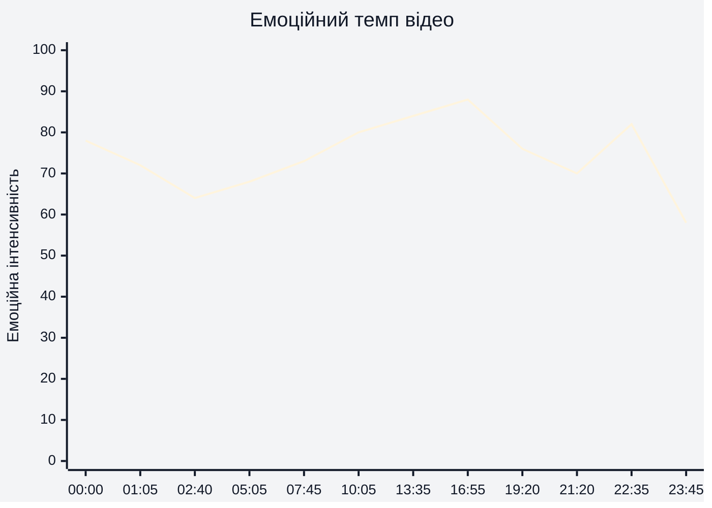
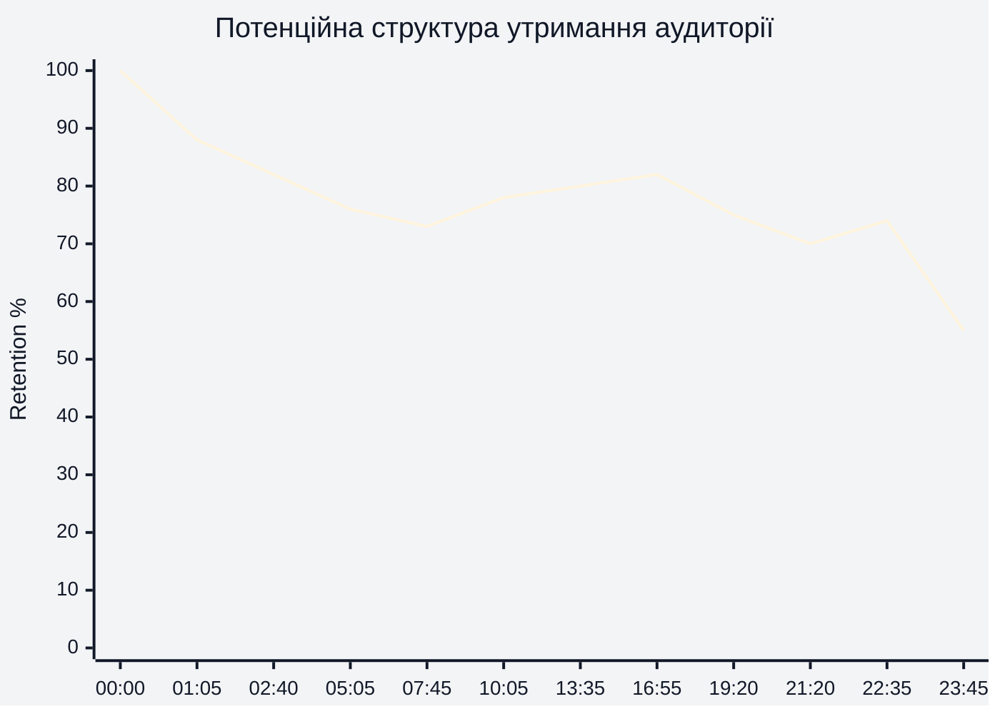
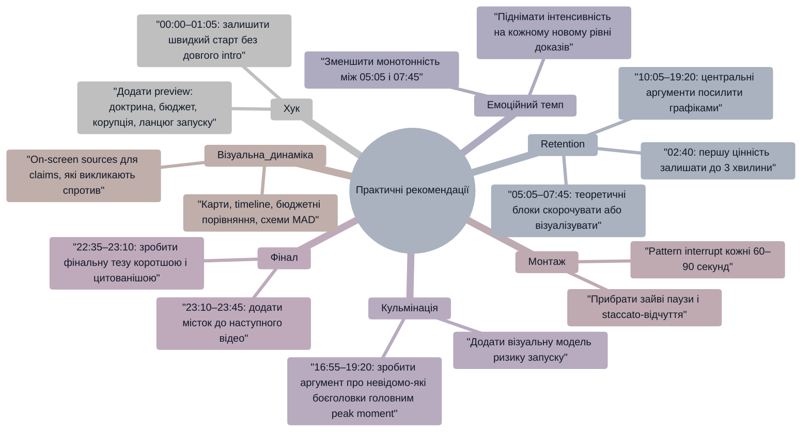

# Аналіз довгоформатного YouTube-відео

**Відео:** `Why Russia Can NEVER Use a Nuclear Weapon`  
**Тривалість:** `23:45`  
**Формат:** довгоформатне відео `LONG_20_PLUS_MIN`  
**Тема:** чи є російські ядерні погрози реальною загрозою або переважно інструментом страху.  
**Важливе обмеження:** реальні retention-дані / YouTube Studio retention-графік не надано, тому в розділі 4 побудована **потенційна retention-структура**, а не фактична крива утримання.

---

## 1. Сюжетна дуга (Narrative Arc)

```mermaid
%%{init: {'theme':'base', 'themeVariables': {
'primaryColor':'#f3f4f6',
'primaryTextColor':'#111827',
'primaryBorderColor':'#2563eb',
'lineColor':'#2563eb',
'secondaryColor':'#ffffff',
'tertiaryColor':'#f3f4f6',
'background':'#f3f4f6'
}}}%%
flowchart LR
    A["00:00–01:05<br/>Хук<br/>Автор одразу ставить питання: наскільки реальні російські ядерні погрози?"] -->
    B["01:05–02:40<br/>Експозиція<br/>Контекст 40+ ядерних погроз і червоних ліній РФ"] -->
    C["02:40–05:05<br/>Перша ескалація<br/>Ядерна зброя має більшу цінність як погроза, ніж як реальне застосування"] -->
    D["05:05–07:45<br/>Переломний момент<br/>MAD і страх стають центральною зброєю, а не сама боєголовка"] -->
    E["07:45–16:55<br/>Наростання напруги<br/>Приклади СРСР, Цар-бомби, бюджету, корупції та деградації арсеналу"] -->
    F["16:55–21:20<br/>Кульмінація<br/>Навіть якщо частина зброї працює, РФ не знає, яка саме; запуск стає самознищенням"] -->
    G["21:20–22:35<br/>Розв’язка<br/>Ланцюг авторизації та людський фактор знижують шанс реального запуску"] -->
    H["22:35–23:45<br/>Фінальний висновок<br/>Небезпека не в перетині red lines, а в тому, що страх винагороджує диктаторів"]
```

**Пояснення:** графік показує логічну дугу відео від страху перед ядерною загрозою до висновку, що головний інструмент РФ — психологічний тиск. Таймкоди базуються на структурній реконструкції відео; точні subtitle-таймкоди не були надані, тому оцінка таймінгів має `LOW_CONFIDENCE`.

---

## 2. Ключові Story Beats

```mermaid
%%{init: {'theme':'base', 'themeVariables': {
'primaryColor':'#f3f4f6',
'primaryTextColor':'#111827',
'primaryBorderColor':'#2563eb',
'lineColor':'#2563eb',
'secondaryColor':'#ffffff',
'tertiaryColor':'#f3f4f6',
'background':'#f3f4f6'
}}}%%
flowchart LR
    B1["00:00<br/>Тема названа одразу<br/>Функція: швидкий вхід у high-stakes topic"] -->
    B2["00:20–01:05<br/>Питання: чи може і чи буде РФ бити по містах?<br/>Функція: створити конфлікт і curiosity gap"] -->
    B3["01:05–02:40<br/>40+ ядерних погроз РФ<br/>Функція: підняти ставки"] -->
    B4["02:40–03:40<br/>Погроза цінніша за застосування<br/>Функція: перша зміна рамки"] -->
    B5["03:40–05:05<br/>Приклад США і Японії<br/>Функція: історичний proof для тези про deterrence"] -->
    B6["05:05–07:45<br/>MAD і холодна війна<br/>Функція: пояснити, чому страх працює як зброя"] -->
    B7["07:45–10:05<br/>СРСР, dummy missiles і Цар-бомба<br/>Функція: показати пропагандистську силу ядерної теми"] -->
    B8["10:05–13:35<br/>Чи може РФ технічно застосувати ядерну зброю?<br/>Функція: центральний поворот від психології до спроможності"] -->
    B9["13:35–16:55<br/>Бюджет, утримання арсеналу, корупція<br/>Функція: раціонально послабити сприйняття загрози"] -->
    B10["16:55–19:20<br/>Проблема невідомо-яких робочих боєголовок<br/>Функція: відповісти на аргумент 'достатньо однієї'"] -->
    B11["19:20–21:20<br/>Самозбереження диктатора<br/>Функція: пояснити мотивацію Путіна не запускати ядерну ескалацію"] -->
    B12["21:20–23:45<br/>Ланцюг запуску, фінальний висновок і CTA<br/>Функція: закрити страх і перевести в дію"]
```

**Пояснення:** графік показує 12 ключових сюжетних точок, які тримають відео як послідовну деконструкцію страху. Найсильніші story beats — `02:40`, `10:05`, `13:35`, `16:55`, `22:35`, бо саме там змінюється або посилюється головна рамка відео.

---

## 3. Емоційний темп

**Що показує графік:** емоційна інтенсивність не базується на retention-даних, а на структурі відео: страх теми, сила аргументів, зміна ставок і фінальний payoff.

| Таймкод | Інтенсивність | Чому |
|---|---:|---|
| 00:00–01:05 | 78 | Хук одразу вводить ядерну загрозу і питання удару по європейському або американському місту. |
| 02:40–05:05 | 64 | Темп стає більш пояснювальним: доктрина і приклад США/Японії. |
| 10:05–13:35 | 80 | Центральний поворот: `technically probably yes, practically probably no`. |
| 13:35–16:55 | 84 | Сильний блок із бюджетами, корупцією і сумнівами щодо стану арсеналу. |
| 16:55–19:20 | 88 | Пік напруги: навіть робочі боєголовки тактично небезпечні для самої РФ через невизначеність. |
| 22:35–23:45 | 58 | Після payoff іде спад у CTA, тому інтенсивність природно знижується. |

---

## 4. Утримання аудиторії

**Тип графіка:** потенційна retention-крива.  
**Причина:** реальні retention-дані або скріншот YouTube Studio не надано.  
**Статус:** `POTENTIAL_RETENTION_STRUCTURE`, не фактична аналітика.

**Що показує графік:** прогнозована крива передбачає типовий спад після хука, стабілізацію на сильних value blocks і помірний відскок біля кульмінаційних аргументів.

| Таймкод | Потенційна retention-динаміка | Пояснення |
|---|---:|---|
| 00:00 | 100% | Початковий інтерес через title і тему ядерної загрози. |
| 01:05 | 88% | Частина аудиторії відсіюється після постановки теми, але ставки залишаються високими. |
| 02:40 | 82% | Перша цінність з’являється достатньо рано: погроза важливіша за застосування. |
| 05:05–07:45 | 73–76% | Пояснювальний історичний блок може просідати через меншу візуальну динаміку. |
| 10:05–16:55 | 78–82% | Центральні докази про спроможність, бюджет і корупцію можуть утримувати увагу краще. |
| 19:20–21:20 | 70–75% | Психологія диктатора менш фактова і може викликати скепсис або втому. |
| 22:35 | 74% | Фінальний payoff може дати короткий відскок перед CTA. |
| 23:45 | 55% | Фінальний CTA зазвичай має природний спад після завершення основної цінності. |

---

## 5. Піки retention

| Таймкод | Подія | Чому це може утримувати увагу | Сила піку 1–10 |
|---|---|---|---:|
| 00:00–01:05 | Автор одразу ставить питання: чи може РФ реально застосувати ядерну зброю проти Європи або США. | Високі ставки, страх, пряма відповідність назві, швидкий старт без довгого intro. | 8 |
| 02:40–03:40 | Перша сильна рамка: від ядерної зброї більше користі як від погрози, ніж від реального застосування. | Дає глядачу перший інтелектуальний payoff і знижує тривогу. | 7 |
| 07:45–10:05 | Приклади радянської пропаганди, dummy missiles і Цар-бомби. | Конкретні образні приклади краще запам’ятовуються, ніж абстрактна доктрина. | 7 |
| 10:05–13:35 | Центральний поворот: `technically probably yes, practically probably no`. | Відповідає на головну обіцянку title і відкриває новий шар аргументації. | 9 |
| 13:35–16:55 | Порівняння витрат США на ядерний арсенал із російським військовим бюджетом і приклади корупції. | Числа і конкретні приклади створюють відчуття доказовості. | 8 |
| 16:55–19:20 | Аргумент, що РФ може не знати, які саме боєголовки працюють. | Сильно відповідає на типове заперечення “достатньо однієї ракети”. | 9 |
| 22:35–23:10 | Фінальний висновок: небезпека не в перетині red lines, а в тому, що страх винагороджує диктаторів. | Дає чіткий стратегічний takeaway після довгої аргументації. | 8 |

---

## 6. Провали retention

| Таймкод | Проблема | Ймовірна причина спаду | Що покращити |
|---|---|---|---|
| 01:05–02:40 | Контекст 40+ погроз може бути знайомим аудиторії. | Глядачі, які вже знають тему, можуть чекати швидшого переходу до нової цінності. | Додати короткий preview: “буде 4 причини — доктрина, бюджет, корупція, ланцюг запуску”. |
| 05:05–07:45 | Блок про MAD і холодну війну має пояснювальний темп. | Менше конкретної новизни, більше абстрактної теорії. | Додати схему MAD або коротку timeline-графіку на екрані. |
| 11:30–13:35 | Історія про пострадянські арсенали і Казахстан/Україну може здаватися відступом. | Складний історичний контекст без візуальної карти може втрачати частину аудиторії. | Додати карту розподілу радянських арсеналів і короткі підписи. |
| 19:20–21:20 | Психологія диктатора може звучати як припущення. | Частина глядачів у коментарях оскаржує логіку “Путін не ризикуватиме самознищенням”. | Додати приклади поведінки диктаторів або чітко відділити факт від гіпотези. |
| 21:20–22:35 | Ланцюг авторизації запуску потребує точності. | Без схеми командного ланцюга твердження може виглядати спрощеним. | Додати візуальну схему “хто має підтвердити запуск” і дисклеймер про невідомі деталі. |
| 23:10–23:45 | CTA після завершення основного payoff. | Після відповіді на головне питання частина аудиторії завершує перегляд. | Перед CTA додати next-video bridge: “далі розберу MAD / hypersonics / nuclear red lines”. |

---

## 7. Оцінка сегментів

| Сегмент | Таймкод | Функція | Емоційна інтенсивність | Ризик втрати уваги | Оцінка 1–10 | Що покращити |
|---|---|---|---:|---|---:|---|
| Хук | 00:00–01:05 | Швидко поставити головне питання про реальність ядерної загрози. | 78 | Низький | 8 | Додати preview структури: “3–4 причини, чому це bluff / deterrence”. |
| Контекст погроз | 01:05–02:40 | Пояснити, чому тема актуальна: 40+ nuclear threats. | 72 | Середній | 7 | Стиснути або показати короткий монтаж/список погроз на екрані. |
| Доктрина і приклад США | 02:40–05:05 | Дати першу логічну рамку про deterrence. | 64 | Середній | 7 | Підсилити візуальною схемою “threat value vs use value”. |
| MAD і холодна війна | 05:05–07:45 | Пояснити, чому страх став самою зброєю. | 68 | Середній | 7 | Додати timeline, іконки сторін, просту діаграму mutual destruction. |
| СРСР / Цар-бомба | 07:45–10:05 | Показати пропагандистську силу ядерних демонстрацій. | 73 | Низько-середній | 8 | Додати archival B-roll або on-screen факт-картки. |
| Центральний поворот | 10:05–13:35 | Перейти від “чи захоче” до “чи зможе”. | 80 | Низький | 9 | Ще чіткіше назвати це як головний поворот відео. |
| Бюджет і корупція | 13:35–16:55 | Раціонально пояснити сумнів у працездатності арсеналу. | 84 | Середній | 8 | Показати таблицю витрат США vs РФ і візуальні приклади корупції. |
| Невідомо-які робочі боєголовки | 16:55–19:20 | Відповісти на заперечення “достатньо однієї”. | 88 | Низький | 9 | Додати коротку формулу ризику: “невідомість = тактична непридатність”. |
| Психологія диктатора | 19:20–21:20 | Пояснити мотивацію самозбереження. | 76 | Середньо-високий | 7 | Більше evidence або disclaimer: це логічна модель, не доведений факт. |
| Ланцюг запуску | 21:20–22:35 | Показати procedural safeguard і людський фактор. | 70 | Середній | 7 | Додати схему командного ланцюга і приклади історичних інцидентів. |
| Фінальний payoff | 22:35–23:10 | Сформулювати головний стратегічний висновок. | 82 | Низький | 8 | Зробити висновок коротшим і більш punchy для цитування. |
| CTA | 23:10–23:45 | Підписка, лайк, Patreon, підтримка каналу. | 58 | Високий | 6 | Додати comment prompt і bridge на наступне відео до стандартного CTA. |

---

## 8. Практичні рекомендації

**Пояснення:** mindmap перетворює проблеми конкретних таймкодів у монтажні та сценарні дії. Найважливіші зони для покращення: `05:05–07:45`, `13:35–16:55`, `16:55–19:20`, `23:10–23:45`.

---

## 9. Підсумкова оцінка

| Показник | Оцінка 1–10 | Коментар |
|---|---:|---|
| Сюжетна дуга | 8 | Відео має чітку дугу: страх → доктрина → спроможність → мотивація → фінальний стратегічний висновок. Найсильніші точки: `10:05`, `16:55`, `22:35`. |
| Story Beats | 8 | Є 10+ виразних beats, які поступово розкривають тезу. Слабше місце — частина beats без візуального підкріплення, особливо `05:05–07:45` і `21:20–22:35`. |
| Емоційний темп | 7 | Інтенсивність добре наростає до `16:55–19:20`, але talking-head формат і пояснювальні блоки можуть створювати просідання. |
| Retention Structure | 7 | Потенційна структура сильна завдяки high-stakes темі й центральним payoff-блокам, але реальні retention-дані не надано; оцінка має `LOW_CONFIDENCE`. |
| Загальна оцінка | 7.5 | Сильне long-form explainer-відео з потужною темою і логічною деконструкцією; головні покращення — візуальні докази, pattern interrupts, comment prompt і next-video bridge. |

---

## Додаткова таблиця для швидкого використання в монтажі

| Таймкод | Роль у відео | Що залишити | Що змінити |
|---|---|---|---|
| 00:00–01:05 | Хук | Прямий high-stakes старт | Додати короткий roadmap відео |
| 02:40–05:05 | Перша цінність | Рамка “погроза > застосування” | Стиснути приклад або додати схему |
| 07:45–10:05 | Візуальний proof-потенціал | Цар-бомба, dummy missiles, пропаганда | Додати архівні вставки / факт-картки |
| 13:35–16:55 | Доказовий центр | Бюджет, корупція, maintenance logic | Показати джерела і порівняльні таблиці |
| 16:55–19:20 | Найсильніший retention peak | Аргумент про невідомо-які робочі боєголовки | Виділити як кульмінацію графікою |
| 22:35–23:10 | Фінальний payoff | Теза про red lines і винагороду диктаторів | Зробити коротший punchline |
| 23:10–23:45 | CTA | Підписка / Patreon після цінності | Додати comment prompt і watch-next bridge |
