# Статистичний аналіз відеозвітів

## 1. Короткий executive summary

| Пункт | Висновок |
|---|---|
| Скільки відео проаналізовано | 1 |
| Скільки форматів відео | 1: `LONG_20_PLUS_MIN` |
| Найсильніше відео за overall score | Video 1 — `Why Russia Can NEVER Use a Nuclear Weapon`, overall score 3.86/5 |
| Найсильніше відео за ER Public % | Video 1 — 4.26% |
| Найсильніше відео за views per day | Video 1 — 3,517.54 views/day |
| Найсильніша повторювана механіка | `INSUFFICIENT_DATA`: лише 1 відео, повторюваність не можна підтвердити. У цьому відео найсильніші механіки: `STRONG_TOPIC_DEMAND`, `CLEAR_HOOK`, `CONTROVERSY_OR_DEBATE`. |
| Найчастіша слабкість | `INSUFFICIENT_DATA`: лише 1 відео. У цьому відео головні missed opportunities: `MISSING_SERIES_LOGIC`, `NO_COMMENT_PROMPT`, `COMMENTS_SHOW_TOPIC_GAP`. |
| Головна стратегічна можливість | Побудувати серію навколо high-stakes myth deconstruction: nuclear red lines, MAD, Flexible Response, hypersonics, Iran/North Korea analogies; додати джерела, comment prompt і next-video bridge. |
| Рівень впевненості | LOW |

## 2. Якість і повнота даних

| Поле | Кількість відео з даними | Кількість N/A | Коментар |
|---|---:|---:|---|
| views | 1 | 0 | Є raw metric: 1,632,140. |
| likes | 1 | 0 | Є raw metric: 59,868. |
| comments_count | 1 | 0 | Є public count: 9,653. |
| views_per_day | 1 | 0 | Є derived metric: 3,517.54. |
| er_public_percent | 1 | 0 | Є derived metric за формулою V1: 4.26%. |
| views_per_1k_subs | 1 | 0 | Є derived metric: 4,000.34; є subscriber-count conflict 408K vs 415K, використано 408K. |
| hook_score | 1 | 0 | 4.0/5. |
| cta_score | 1 | 0 | 3.5/5. |
| ad_integration_score | 1 | 0 | 4.0/5. |
| audio_score | 1 | 0 | 3.0/5; `PARTIAL_DATA`. |
| comment_resonance_score | 1 | 0 | 4.0/5; comment classification `LOW_CONFIDENCE`. |
| overall_video_score | 1 | 0 | 3.86/5. |

### Обмеження аналізу

- `LOW_CONFIDENCE`: є лише 1 відео, тому дозволена тільки описова статистика, без кореляцій і без справжнього порівняння.
- Усі графіки показують один datapoint; вони корисні як baseline для майбутніх звітів, але не доводять патерни.
- Не можна будувати статистично валідні зв’язки між hook, CTA, audio, comments і performance, бо потрібно мінімум 5 comparable videos.
- `NO_TIMECODES`: time-to-first-value, ad position і segment timing мають низьку точність.
- CTR, impressions, traffic sources, watch time, subscribers gained, revenue не використовуються, бо їх немає у V1-звіті або вони `OWNER_ONLY`.

## 3. Підготовлена таблиця для графіків

| Video | Format | Views | Views/day | Like Rate % | Comment Rate % | ER Public % | Views/1k subs | Hook | CTA | Ad | Audio | Comment Resonance | Overall |
|---|---|---:|---:|---:|---:|---:|---:|---:|---:|---:|---:|---:|---:|
| Video 1 | LONG_20_PLUS_MIN | 1,632,140 | 3,517.54 | 3.67 | 0.59 | 4.26 | 4,000.34 | 4.0 | 3.5 | 4.0 | 3.0 | 4.0 | 3.86 |

| Label | Full title | URL |
|---|---|---|
| Video 1 | Why Russia Can NEVER Use a Nuclear Weapon | https://www.youtube.com/watch?v=l-Am4hOgTLA |

## 4. Рекомендовані графіки

| # | Назва графіка | Тип графіка | Поля | Для чого потрібен | Пріоритет |
|---:|---|---|---|---|---|
| 1 | Overall score by video | Mermaid bar chart | overall_video_score | Зафіксувати baseline загальної якості | HIGH |
| 2 | Views per day by video | Mermaid bar chart | views_per_day | Оцінити швидкість набору переглядів з урахуванням віку | HIGH |
| 3 | ER Public % by video | Mermaid bar chart | er_public_percent | Оцінити публічне залучення | HIGH |
| 4 | ER Public % vs Views/day | Таблиця / quadrant matrix | views_per_day, er_public_percent | Показати баланс reach і engagement | HIGH |
| 5 | Hook score by video | Mermaid bar chart | hook_score | Зафіксувати силу hook | HIGH |
| 6 | CTA score by video | Mermaid bar chart | cta_score | Оцінити ефективність CTA | HIGH |
| 7 | Score breakdown heatmap | Markdown heatmap table | hook, structure, value density, audio, CTA, ad, comments, replicability, overall | Побачити сильні/слабкі сторони | HIGH |
| 8 | Sentiment distribution | Mermaid pie / table | sentiment percentages | Показати структуру реакції аудиторії | HIGH |
| 9 | CTA features heatmap | Markdown matrix | CTA feature booleans | Побачити наявні / відсутні CTA | HIGH |
| 10 | Ad load % by video | Mermaid bar chart | ad_load_percent | Оцінити рекламне навантаження | MEDIUM |

## 5. Графіки продуктивності

## 5.1. Views by video

- Назва графіка: Views by video
- Яке питання він відповідає: яке відео має найбільший raw reach?
- Які поля використовуються: `video_label`, `views`
- Тип графіка: Mermaid bar chart
- Що видно з графіка: є один datapoint — 1,632,140 views.
- Практичний висновок: raw reach високий як абсолютне число, але без інших відео й без нормалізації не можна робити порівняльний висновок.

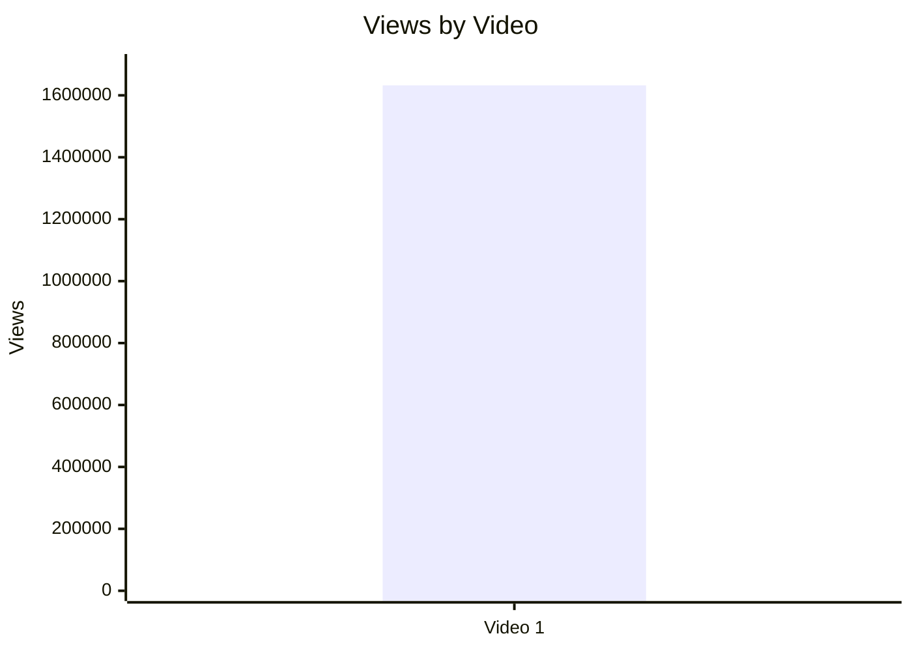
```mermaid
xychart-beta
    title "Views by Video"
    x-axis ["Video 1"]
    y-axis "Views" 0 --> 1700000
    bar [1632140]
```

## 5.2. Views per day by video

- Назва графіка: Views per day by video
- Яке питання він відповідає: яка швидкість набору переглядів з урахуванням віку відео?
- Які поля використовуються: `video_label`, `views_per_day`
- Тип графіка: Mermaid bar chart
- Що видно з графіка: Video 1 має 3,517.54 views/day.
- Практичний висновок: це головний baseline для майбутніх long-form 20+ min відео; нові відео варто порівнювати саме з views/day, а не тільки raw views.

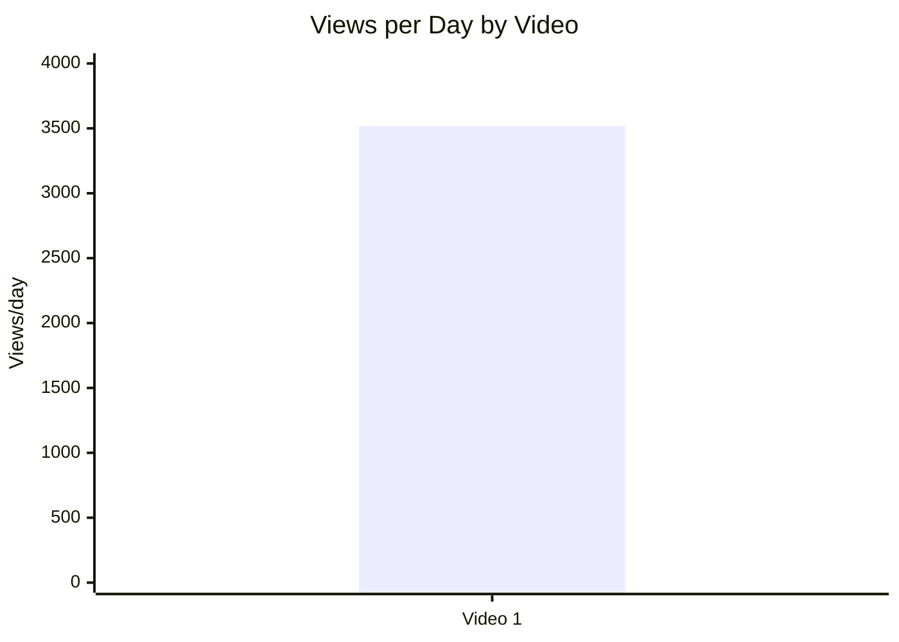
```mermaid
xychart-beta
    title "Views per Day by Video"
    x-axis ["Video 1"]
    y-axis "Views/day" 0 --> 4000
    bar [3517.54]
```

## 5.3. Views per 1k subscribers

- Назва графіка: Views per 1k subscribers
- Яке питання він відповідає: наскільки відео конвертує розмір каналу в перегляди?
- Які поля використовуються: `video_label`, `views_per_1k_subs`
- Тип графіка: Mermaid bar chart
- Що видно з графіка: Video 1 має 4,000.34 views per 1k subscribers.
- Практичний висновок: відео сильно виходить за межі subscriber base, але це не можна називати outlier без когорти.

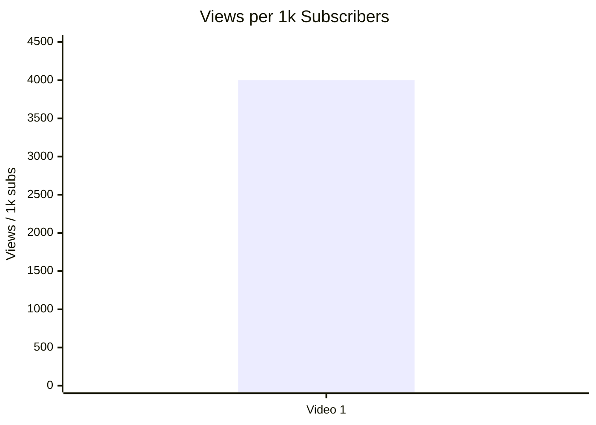
```mermaid
xychart-beta
    title "Views per 1k Subscribers"
    x-axis ["Video 1"]
    y-axis "Views / 1k subs" 0 --> 4500
    bar [4000.34]
```

## 5.4. Performance quadrant

- Назва графіка: Performance quadrant
- Яке питання він відповідає: чи відео має баланс reach і engagement?
- Які поля використовуються: `views_per_day`, `er_public_percent`
- Тип графіка: quadrant matrix / scatter concept
- Що видно з графіка: для одного відео немає медіан і меж квадрантів.
- Практичний висновок: `INSUFFICIENT_DATA` для справжнього quadrant chart; Video 1 стає baseline point для майбутньої когорти `LONG_20_PLUS_MIN`.

| Video | Views/day | ER Public % | Quadrant status |
|---|---:|---:|---|
| Video 1 | 3,517.54 | 4.26 | `INSUFFICIENT_DATA`: немає порогів high/low без інших відео |

## 6. Графіки залучення

## 6.1. ER Public % by video

- Назва графіка: ER Public % by video
- Яке питання він відповідає: яке публічне залучення має відео?
- Які поля використовуються: `video_label`, `er_public_percent`
- Тип графіка: Mermaid bar chart
- Що видно з графіка: ER Public = 4.26%.
- Практичний висновок: це baseline для оцінки майбутніх відео; без benchmark не маркується як good/bad.

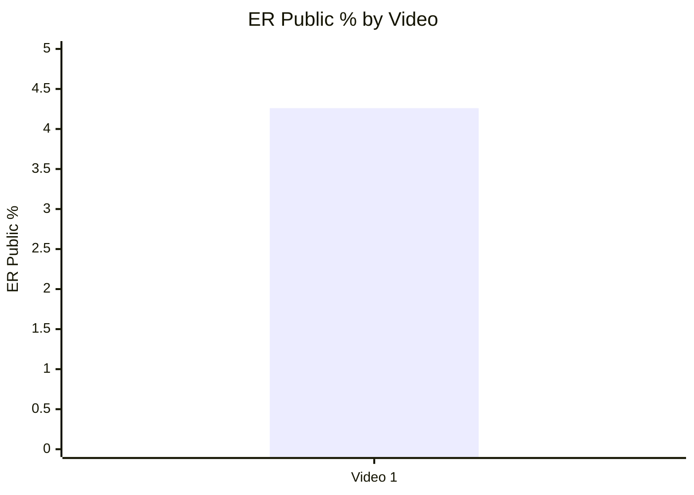
```mermaid
xychart-beta
    title "ER Public % by Video"
    x-axis ["Video 1"]
    y-axis "ER Public %" 0 --> 5
    bar [4.26]
```

## 6.2. Like Rate % vs Comment Rate %

- Назва графіка: Like Rate % vs Comment Rate %
- Яке питання він відповідає: залучення більше схоже на likes чи на дискусію?
- Які поля використовуються: `like_rate_percent`, `comment_rate_percent`
- Тип графіка: scatter concept / table
- Що видно з графіка: like rate 3.67%, comment rate 0.59%.
- Практичний висновок: Video 1 має помітну дискусійну реакцію, але справжній висновок потребує когорти.

| Video | Like Rate % | Comment Rate % | Interpretation |
|---|---:|---:|---|
| Video 1 | 3.67 | 0.59 | Один datapoint; тема провокує коментарі, але без порівнянь не можна визначити high/low. |

## 6.3. Comments per 1k views

- Назва графіка: Comments per 1k views
- Яке питання він відповідає: наскільки відео провокує реакцію в коментарях?
- Які поля використовуються: `video_label`, `comments_per_1k_views`
- Тип графіка: Mermaid bar chart
- Що видно з графіка: 5.91 comments per 1k views.
- Практичний висновок: це baseline для майбутніх controversial explainer topics.

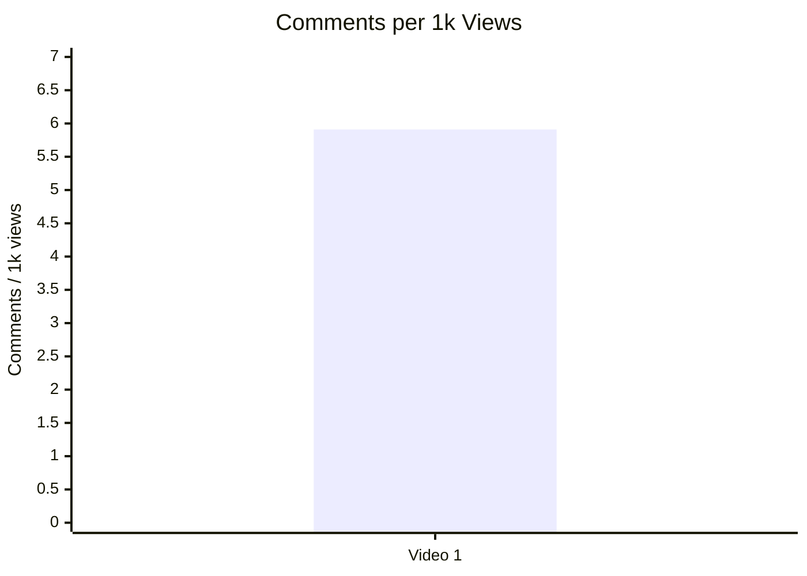
```mermaid
xychart-beta
    title "Comments per 1k Views"
    x-axis ["Video 1"]
    y-axis "Comments / 1k views" 0 --> 7
    bar [5.91]
```

## 7. Графіки структури та hook

## 7.1. Hook score by video

- Назва графіка: Hook score by video
- Яке питання він відповідає: наскільки сильний hook?
- Які поля використовуються: `hook_score`
- Тип графіка: Mermaid bar chart
- Що видно з графіка: hook score 4.0/5.
- Практичний висновок: сильний hook є важливою частиною baseline, але зв’язок із performance не можна довести на одному відео.

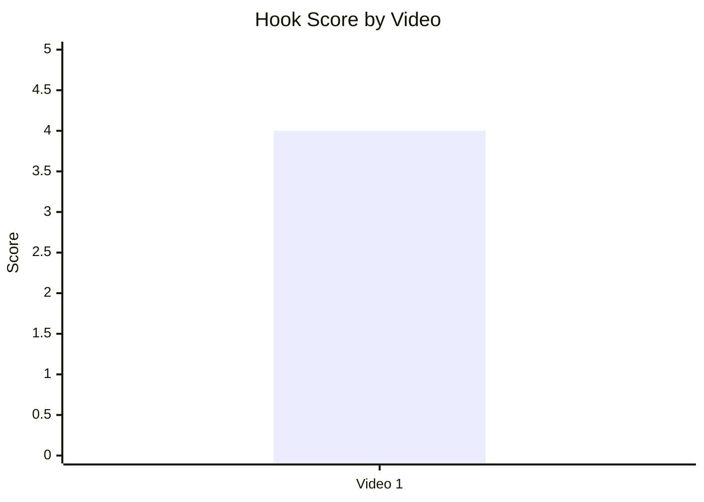
```mermaid
xychart-beta
    title "Hook Score by Video"
    x-axis ["Video 1"]
    y-axis "Score" 0 --> 5
    bar [4.0]
```

## 7.2. Hook type distribution

- Назва графіка: Hook type distribution
- Яке питання він відповідає: які hook types використовуються?
- Які поля використовуються: `hook_primary_type`
- Тип графіка: Mermaid pie chart
- Що видно з графіка: 100% поточної вибірки — `CONFLICT`.
- Практичний висновок: `CONFLICT` є baseline hook type, але “найкращий тип” визначити неможливо без інших відео.

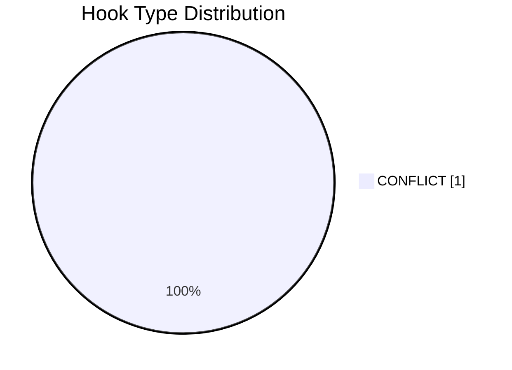
```mermaid
pie showData
    title Hook Type Distribution
    "CONFLICT" : 1
```

## 7.3. Time to first value vs Overall Score

- Назва графіка: Time to first value vs Overall Score
- Яке питання він відповідає: чи швидша перша цінність пов’язана з вищим score?
- Які поля використовуються: `time_to_first_value_seconds`, `overall_video_score`
- Тип графіка: scatter concept / table
- Що видно з графіка: time-to-first-value приблизно 160 секунд, але `NO_TIMECODES / LOW_CONFIDENCE`.
- Практичний висновок: графік неможливо побудувати надійно; у майбутніх звітах треба фіксувати точні таймкоди.

| Video | Time to first value | Time to first value seconds | Overall score | Status |
|---|---|---:|---:|---|
| Video 1 | ~02:40 | 160 | 3.86 | `LOW_CONFIDENCE / NO_TIMECODES` |

## 8. Графіки CTA

## 8.1. CTA score by video

- Назва графіка: CTA score by video
- Яке питання він відповідає: наскільки ефективно побудований CTA?
- Які поля використовуються: `cta_score`
- Тип графіка: Mermaid bar chart
- Що видно з графіка: CTA score 3.5/5.
- Практичний висновок: CTA достатній, але є очевидний upside: comment prompt, bell CTA, next-video bridge.

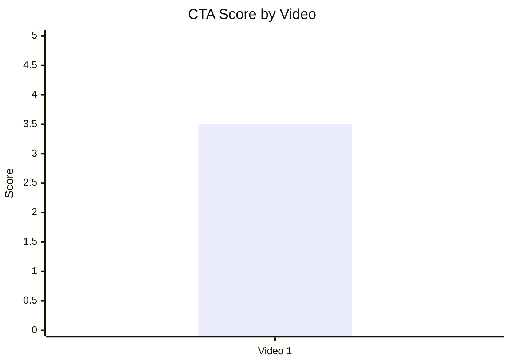
```mermaid
xychart-beta
    title "CTA Score by Video"
    x-axis ["Video 1"]
    y-axis "Score" 0 --> 5
    bar [3.5]
```

## 8.2. CTA count vs ER Public %

- Назва графіка: CTA count vs ER Public %
- Яке питання він відповідає: чи кількість CTA пов’язана з engagement?
- Які поля використовуються: `cta_count`, `er_public_percent`
- Тип графіка: scatter concept / table
- Що видно з графіка: Video 1 має 6 CTA items і ER Public 4.26%.
- Практичний висновок: `INSUFFICIENT_DATA`; не можна сказати, що більше CTA підвищує або знижує ER.

| Video | CTA count | ER Public % | CTA overload risk |
|---|---:|---:|---|
| Video 1 | 6 | 4.26 | PARTLY: description має багато support/affiliate links, але verbal CTA короткий і в кінці. |

## 8.3. CTA features heatmap

- Назва графіка: CTA features heatmap
- Яке питання він відповідає: які CTA-механіки присутні або відсутні?
- Які поля використовуються: `has_comment_prompt`, `has_subscribe_cta`, `has_like_cta`, `has_bell_cta`, `has_next_video_bridge`
- Тип графіка: heatmap / matrix
- Що видно з графіка: є subscribe і like; немає comment prompt, bell і next-video bridge.
- Практичний висновок: головний CTA upside — спрямовувати дискусію і переводити глядача в наступне відео.

| Video | Comment prompt | Subscribe | Like | Bell | Next video bridge |
|---|---|---|---|---|---|
| Video 1 | ❌ | ✅ | ✅ | ❌ | ❌ |

## 9. Графіки реклами / інтеграцій

Рекламні / промо-дані є: self-promo Patreon, description support links, affiliate gear links.

## 9.1. Ad load % by video

- Назва графіка: Ad load % by video
- Яке питання він відповідає: яке рекламне навантаження всередині відео?
- Які поля використовуються: `ad_load_percent`
- Тип графіка: Mermaid bar chart
- Що видно з графіка: ad load ≈1.75%.
- Практичний висновок: навантаження низьке, бо in-video promo стоїть наприкінці; точність `LOW_CONFIDENCE` через відсутність таймкодів.

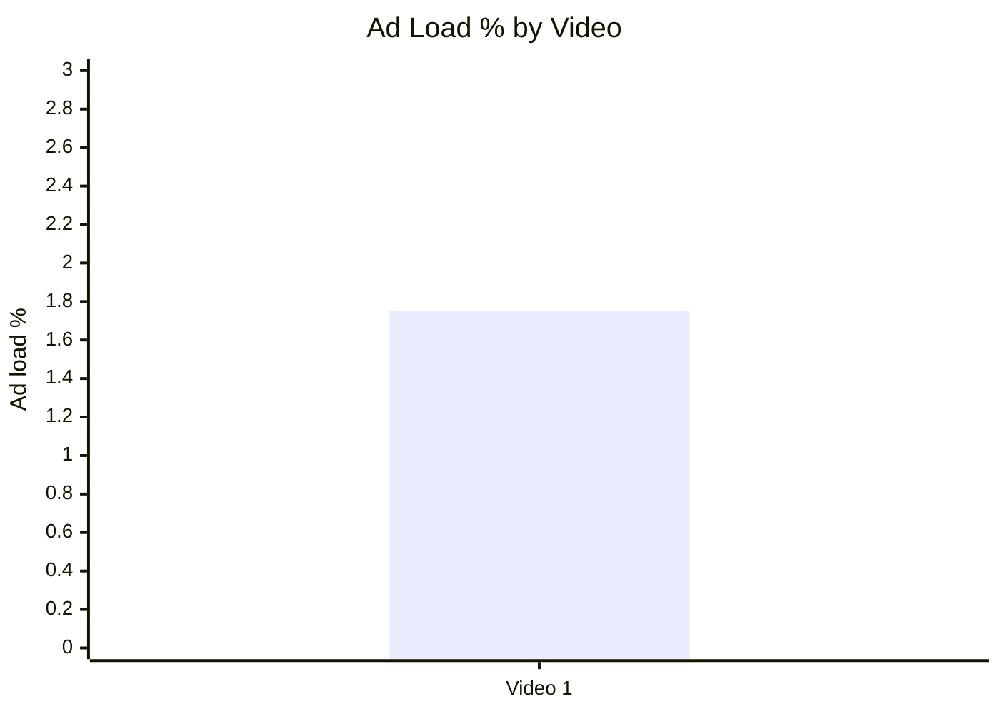
```mermaid
xychart-beta
    title "Ad Load % by Video"
    x-axis ["Video 1"]
    y-axis "Ad load %" 0 --> 3
    bar [1.75]
```

## 9.2. First ad position %

- Назва графіка: First ad position %
- Яке питання він відповідає: реклама стоїть до чи після першої цінності?
- Які поля використовуються: `first_ad_relative_position_percent`
- Тип графіка: Mermaid bar chart
- Що видно з графіка: first in-video promo ≈97.5% тривалості.
- Практичний висновок: реклама/самопромо не заважає основній цінності; це безпечна модель для довгого explainer.

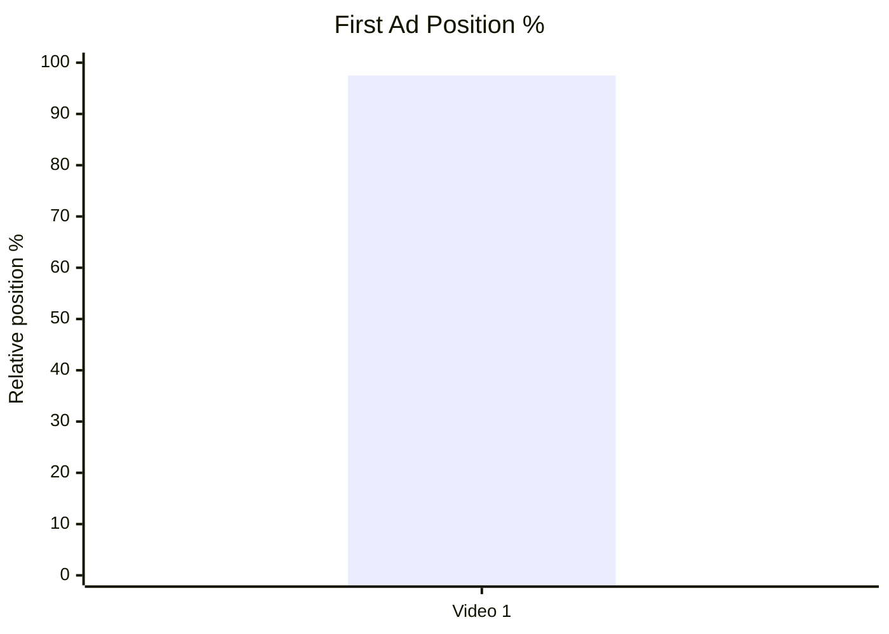
```mermaid
xychart-beta
    title "First Ad Position %"
    x-axis ["Video 1"]
    y-axis "Relative position %" 0 --> 100
    bar [97.5]
```

## 9.3. Ad integration score vs ER Public %

- Назва графіка: Ad integration score vs ER Public %
- Яке питання він відповідає: чи якість інтеграції пов’язана з реакцією аудиторії?
- Які поля використовуються: `ad_integration_score`, `er_public_percent`
- Тип графіка: scatter concept / table
- Що видно з графіка: ad integration score 4.0, ER Public 4.26%.
- Практичний висновок: `INSUFFICIENT_DATA`; зв’язок не можна оцінити на одному відео.

| Video | Ad integration score | ER Public % | Interpretation |
|---|---:|---:|---|
| Video 1 | 4.0 | 4.26 | Low-disruption end promo; correlation skipped. |

## 10. Графіки аудіо

Аудіо-оцінка доступна, але `PARTIAL_DATA`.

## 10.1. Audio score by video

- Назва графіка: Audio score by video
- Яке питання він відповідає: яка базова аудіо/подача оцінка?
- Які поля використовуються: `audio_score`
- Тип графіка: Mermaid bar chart
- Що видно з графіка: audio score 3.0/5.
- Практичний висновок: аудіо не є критичною поломкою, але delivery/tempo може бути зоною покращення.

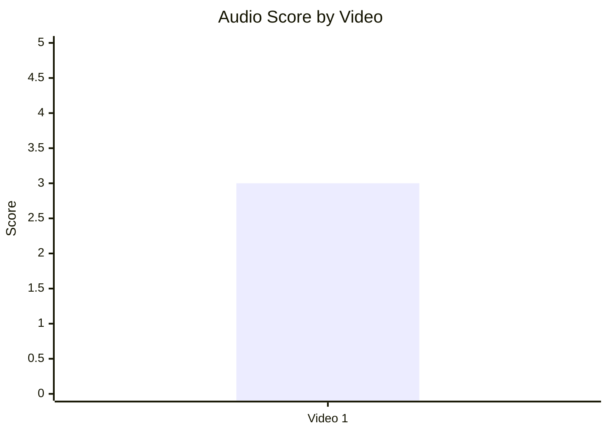
```mermaid
xychart-beta
    title "Audio Score by Video"
    x-axis ["Video 1"]
    y-axis "Score" 0 --> 5
    bar [3.0]
```

## 10.2. Audio score vs Overall Score

- Назва графіка: Audio score vs Overall Score
- Яке питання він відповідає: чи кращий audio score пов’язаний із кращим overall score?
- Які поля використовуються: `audio_score`, `overall_video_score`
- Тип графіка: scatter concept / table
- Що видно з графіка: audio 3.0, overall 3.86.
- Практичний висновок: `INSUFFICIENT_DATA`; можна лише зафіксувати, що audio нижчий за hook/structure/value/comments.

| Video | Audio score | Overall score | Note |
|---|---:|---:|---|
| Video 1 | 3.0 | 3.86 | Audio is one of the lower score components. |

## 11. Графіки коментарів

## 11.1. Sentiment distribution

- Назва графіка: Sentiment distribution
- Яке питання він відповідає: як розподілена реакція аудиторії?
- Які поля використовуються: `positive_percent`, `negative_percent`, `mixed_percent`, `neutral_percent`, `question_percent`, `request_percent`
- Тип графіка: Mermaid pie chart + table
- Що видно з графіка: найбільший сегмент — neutral/discussion 51.31%, далі questions 16.98%, positive 14.20%.
- Практичний висновок: відео працює не як “чисте схвалення”, а як debate engine; це добре для comments, але вимагає stronger sourcing.

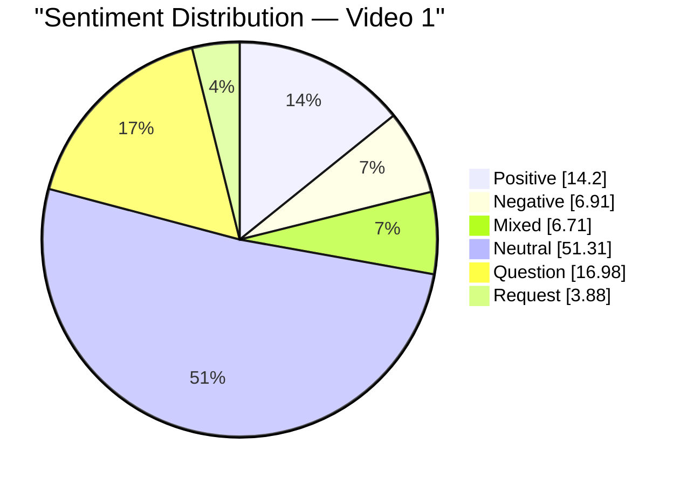
```mermaid
pie showData
    title "Sentiment Distribution — Video 1"
    "Positive" : 14.20
    "Negative" : 6.91
    "Mixed" : 6.71
    "Neutral" : 51.31
    "Question" : 16.98
    "Request" : 3.88
```

| Sentiment | Percent |
|---|---:|
| POSITIVE | 14.20 |
| NEGATIVE | 6.91 |
| MIXED | 6.71 |
| NEUTRAL | 51.31 |
| QUESTION | 16.98 |
| REQUEST | 3.88 |

## 11.2. Comment resonance score by video

- Назва графіка: Comment resonance score by video
- Яке питання він відповідає: наскільки сильно відео резонує в коментарях?
- Які поля використовуються: `comment_resonance_score`
- Тип графіка: Mermaid bar chart
- Що видно з графіка: comment resonance score 4.0/5.
- Практичний висновок: тема й теза сильні для дискусії; варто додати question prompt, щоб краще керувати коментарями.

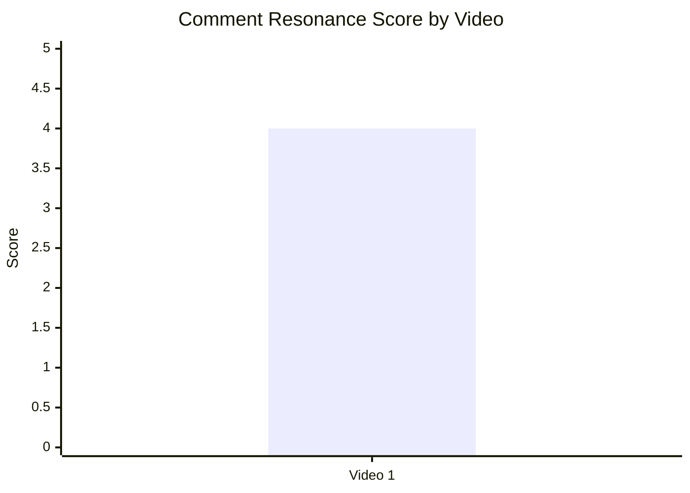
```mermaid
xychart-beta
    title "Comment Resonance Score by Video"
    x-axis ["Video 1"]
    y-axis "Score" 0 --> 5
    bar [4.0]
```

## 11.3. Top comment clusters

- Назва графіка: Top comment clusters
- Яке питання він відповідає: що найчастіше хвалять, критикують і питають?
- Які поля використовуються: cluster label, estimated percent
- Тип графіка: Mermaid bar chart + table
- Що видно з графіка: найбільший кластер — political/off-topic debate; другий — disagreement; третій — agreement with fear-tactics thesis.
- Практичний висновок: наступні відео треба робити з visible sources і окремими technical follow-ups.

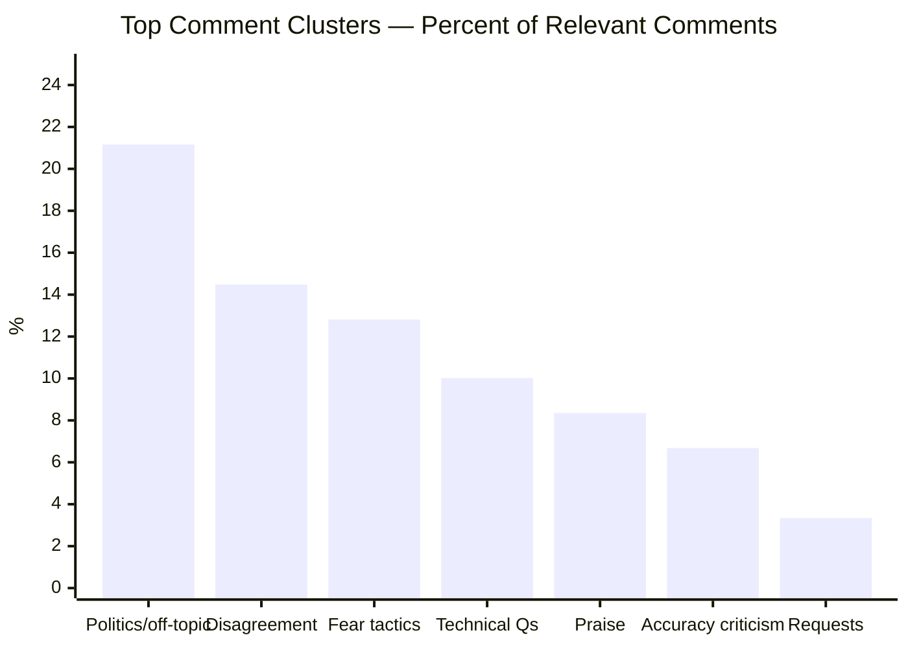
```mermaid
xychart-beta
    title "Top Comment Clusters — Percent of Relevant Comments"
    x-axis ["Politics/off-topic", "Disagreement", "Fear tactics", "Technical Qs", "Praise", "Accuracy criticism", "Requests"]
    y-axis "%" 0 --> 25
    bar [21.16, 14.48, 12.81, 10.02, 8.35, 6.68, 3.34]
```

| Cluster | % of relevant comments | Strategic meaning |
|---|---:|---|
| Political/off-topic geopolitics | 21.16 | High-stakes теми генерують широкий debate; потрібна модерація і pinned framing. |
| Disagreement / “Russia can use nukes” | 14.48 | Контроверсійність підсилює comments, але створює ризик довіри. |
| Agreement with “fear tactics” thesis | 12.81 | Центральна теза резонує і легко запам’ятовується. |
| Technical questions | 10.02 | Є попит на follow-up: MAD, Flexible Response, hypersonics. |
| Praise for logical explanation | 8.35 | Авторський бренд calm logical explainer працює. |
| Accuracy criticism / sources | 6.68 | Найважливіший production/content fix — visible sourcing. |
| Requests for more | 3.34 | Є серійний потенціал. |

## 12. Графіки score-системи

## 12.1. Overall score by video

- Назва графіка: Overall score by video
- Яке питання він відповідає: який загальний score має відео?
- Які поля використовуються: `overall_video_score`
- Тип графіка: Mermaid bar chart
- Що видно з графіка: Video 1 = 3.86/5.
- Практичний висновок: baseline сильний, але не максимальний; найпростіший upside — CTA, audio/tempo, visible sourcing, next-video bridge.

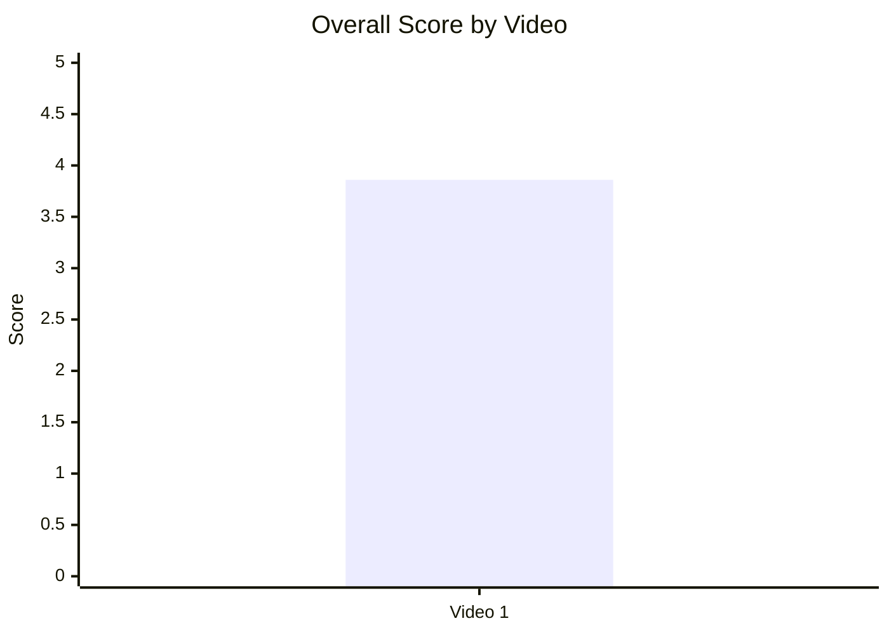
```mermaid
xychart-beta
    title "Overall Score by Video"
    x-axis ["Video 1"]
    y-axis "Score" 0 --> 5
    bar [3.86]
```

## 12.2. Score breakdown heatmap

- Назва графіка: Score breakdown heatmap
- Яке питання він відповідає: які компоненти сильніші/слабші?
- Які поля використовуються: `hook_score`, `structure_score`, `value_density_score`, `audio_score`, `cta_score`, `ad_integration_score`, `comment_resonance_score`, `replicability_score`, `overall_video_score`
- Тип графіка: Markdown heatmap table
- Що видно з графіка: strongest = hook, structure, value density, ad integration, comments, replicability; weakest = audio 3.0, CTA 3.5.
- Практичний висновок: не треба міняти core concept; треба посилити packaging/retention/CTA layer.

| Video | Hook | Structure | Value Density | Audio | CTA | Ad | Comments | Replicability | Overall |
|---|---:|---:|---:|---:|---:|---:|---:|---:|---:|
| Video 1 | 4.0 | 4.0 | 4.0 | 3.0 | 3.5 | 4.0 | 4.0 | 4.0 | 3.86 |

## 12.3. Strengths vs weaknesses count

- Назва графіка: Strengths vs weaknesses count
- Яке питання він відповідає: скільки success mechanics і missed opportunities зафіксовано?
- Які поля використовуються: count of success mechanics, count of missed opportunities
- Тип графіка: Mermaid bar chart
- Що видно з графіка: 5 success mechanics і 5 missed opportunities.
- Практичний висновок: відео має сильну базову механіку, але багато конкретних improvement levers.

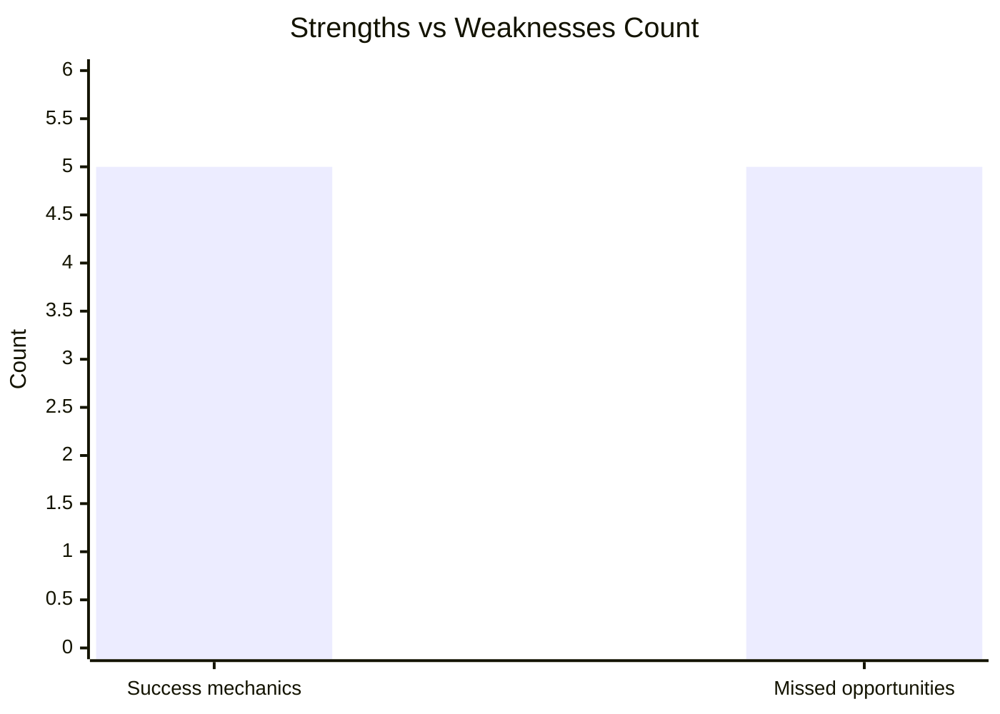
```mermaid
xychart-beta
    title "Strengths vs Weaknesses Count"
    x-axis ["Success mechanics", "Missed opportunities"]
    y-axis "Count" 0 --> 6
    bar [5, 5]
```

| Video | Success mechanics count | Missed opportunities count | High-priority issues |
|---|---:|---:|---:|
| Video 1 | 5 | 5 | 3 |

## 13. Кореляції та патерни

Correlation analysis skipped: fewer than 5 comparable videos.

| Pair | Correlation / Pattern | Strength | Interpretation | Confidence |
|---|---:|---|---|---|
| hook_score → overall_video_score | `INSUFFICIENT_DATA` | N/A | Потрібно мінімум 5 comparable videos. | LOW |
| value_density_score → er_public_percent | `INSUFFICIENT_DATA` | N/A | Потрібно мінімум 5 comparable videos. | LOW |
| cta_score → comment_rate_percent | `INSUFFICIENT_DATA` | N/A | Потрібно мінімум 5 comparable videos. | LOW |
| comment_resonance_score → er_public_percent | `INSUFFICIENT_DATA` | N/A | Потрібно мінімум 5 comparable videos. | LOW |
| views_per_day → er_public_percent | `INSUFFICIENT_DATA` | N/A | Потрібно мінімум 5 comparable videos. | LOW |
| ad_load_percent → er_public_percent | `INSUFFICIENT_DATA` | N/A | Потрібно мінімум 5 comparable videos. | LOW |
| time_to_first_value_seconds → overall_video_score | `INSUFFICIENT_DATA` | N/A | Потрібно мінімум 5 comparable videos і точні таймкоди. | LOW |

## 14. Висновки для контент-стратегії

| Спостереження | Дані / графік | Що це означає | Що робити |
|---|---|---|---|
| Core concept сильний | Overall 3.86; hook 4.0; value density 4.0; comment resonance 4.0 | High-stakes myth deconstruction має потенціал для серії. | Повторити формат на суміжних темах: MAD, nuclear red lines, hypersonics, Iran/North Korea. |
| Коментарі працюють як debate engine | Sentiment distribution: neutral 51.31%, questions 16.98%, disagreement 14.48% | Відео провокує не лише лайки, а й суперечки/питання. | Додати pinned comment із джерелами й питанням для follow-up. |
| CTA layer недовикористаний | CTA heatmap: no comment prompt, no bell, no next-video bridge; CTA score 3.5 | Частину engagement/session time не добирають. | Додати comment prompt і end-screen bridge після payoff. |
| Реклама не заважає | Ad load ≈1.75%; first ad position ≈97.5%; ad score 4.0 | End-placement мінімізує disruption risk. | Залишити промо в кінці або після main payoff. |
| Audio/tempo — нижчий компонент | Audio score 3.0; коментарі про staccato/speed | Production fatigue може шкодити 20+ хв long-form. | Тестувати tighter edit, pattern interrupts, B-roll, on-screen sources. |
| Sources — критичний trust lever | Accuracy criticism cluster ≈6.68%; technical questions ≈10.02% | Частина аудиторії не приймає claims без доказів. | Показувати джерела, цифри, карти, доктринальні схеми на екрані. |

## 15. Що тестувати далі

| Тест | Гіпотеза | На яких даних базується | Як виміряти | Пріоритет |
|---|---|---|---|---|
| Comment prompt у фіналі | Пряме питання збільшить частку корисних коментарів і тем для follow-up. | CTA heatmap: comment prompt ❌; requests/questions уже є. | comment_rate_percent, comments_per_1k_views, частка REQUEST/QUESTION clusters. | HIGH |
| Next-video bridge | Міст у наступне відео збільшить session depth. | CTA heatmap: next-video bridge ❌; є topic clusters для серії. | End screen CTR, watch-next clicks, views from end screens. | HIGH |
| Visible source overlays | Джерела на екрані зменшать accuracy criticism. | Accuracy criticism ≈6.68%; questions ≈16.98%. | Частка comments із “sources?”, negative accuracy cluster, retention на factual blocks. | HIGH |
| Pattern interrupts кожні 60–90 секунд | Візуальні зміни зменшать fatigue для 23+ хв talking-head. | Audio score 3.0; visual monotony/missed opportunity у V1-звіті. | Avg view duration, retention curve, comments about pacing/audio. | MEDIUM |
| Серія “nuclear myths explained” | High-stakes myth deconstruction можна масштабувати. | Success mechanics: `STRONG_TOPIC_DEMAND`, `CLEAR_HOOK`, `CONTROVERSY_OR_DEBATE`. | Views/day, ER Public %, returning viewers, playlist session time. | HIGH |
| Softer title angle vs absolutist title | Менш абсолютна назва може знизити defensive disagreement без втрати curiosity. | Disagreement cluster 14.48%; title містить “NEVER”. | CTR, comment sentiment, negative/disagreement cluster share. | MEDIUM |
| Pinned comment як evidence hub | Pinned comment може керувати дискусією краще, ніж просто додаткова теза. | Коментарі показують потребу в sources і follow-up topics. | Likes/replies на pinned comment, qualitative comment quality. | HIGH |

## 16. Дані для експорту в таблицю / CSV

| video_label | title | format_group | views | views_per_day | like_rate_percent | comment_rate_percent | er_public_percent | views_per_1k_subs | hook_type | hook_score | cta_count | cta_score | ad_load_percent | ad_integration_score | audio_score | comment_resonance_score | overall_video_score | top_success_mechanic | top_missed_opportunity |
|---|---|---|---:|---:|---:|---:|---:|---:|---|---:|---:|---:|---:|---:|---:|---:|---:|---|---|
| Video 1 | Why Russia Can NEVER Use a Nuclear Weapon | LONG_20_PLUS_MIN | 1632140 | 3517.54 | 3.67 | 0.59 | 4.26 | 4000.34 | CONFLICT | 4.0 | 6 | 3.5 | 1.75 | 4.0 | 3.0 | 4.0 | 3.86 | STRONG_TOPIC_DEMAND | MISSING_SERIES_LOGIC |
