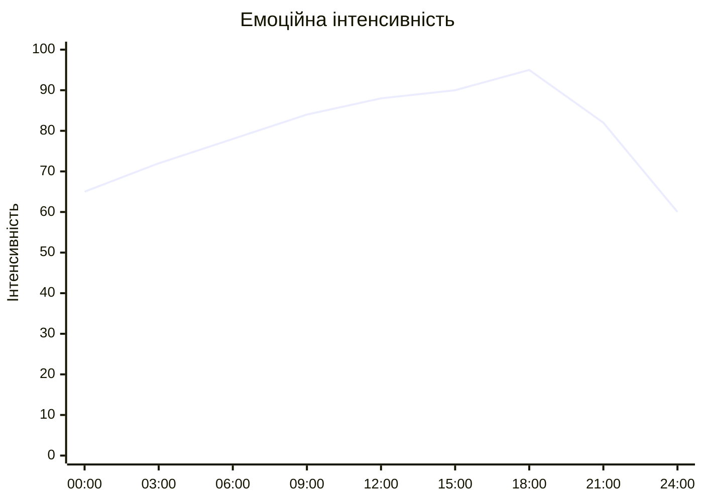
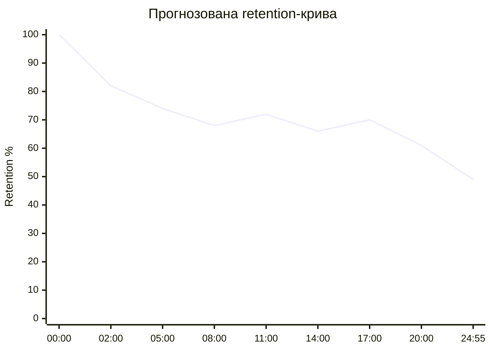
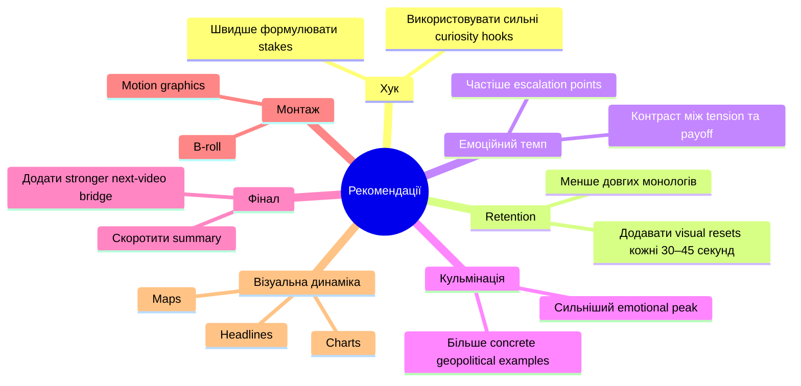

# Аналіз довгоформатного YouTube-відео

## 1. Сюжетна дуга (Narrative Arc)

%%{init: {'theme':'base', 'themeVariables': {
'primaryColor':'#f3f4f6',
'primaryTextColor':'#111827',
'primaryBorderColor':'#2563eb',
'lineColor':'#2563eb',
'secondaryColor':'#ffffff',
'tertiaryColor':'#f3f4f6',
'background':'#f3f4f6'
}}}%%

```mermaid
flowchart LR
A["00:00–01:20<br>Хук<br>Теза про занепад глобального впливу США"] -->
B["01:20–03:40<br>Експозиція<br>Пояснення історичного циклу імперій"] -->
C["03:40–07:20<br>Перша ескалація<br>Військова та економічна домінація США"] -->
D["07:20–12:00<br>Переломний момент<br>Тарифи, Greenland, Panama Canal, Ukraine"] -->
E["12:00–16:30<br>Наростання напруги<br>Приклад F-35 та довіри союзників"] -->
F["16:30–21:00<br>Кульмінація<br>Криза довіри до США та НАТО"] -->
G["21:00–24:00<br>Розв’язка<br>Пояснення глобальних наслідків"] -->
H["24:00–24:55<br>Фінальний висновок<br>CTA та підсумок про зміну світового порядку"]
```

## 2. Ключові Story Beats

%%{init: {'theme':'base', 'themeVariables': {
'primaryColor':'#f3f4f6',
'primaryTextColor':'#111827',
'primaryBorderColor':'#2563eb',
'lineColor':'#2563eb',
'secondaryColor':'#ffffff',
'tertiaryColor':'#f3f4f6',
'background':'#f3f4f6'
}}}%%

## 3. Емоційний темп

%%{init: {'theme':'base', 'themeVariables': {
'primaryColor':'#f3f4f6',
'primaryTextColor':'#111827',
'primaryBorderColor':'#2563eb',
'lineColor':'#2563eb',
'secondaryColor':'#ffffff',
'tertiaryColor':'#f3f4f6',
'background':'#f3f4f6'
}}}%%

### Пояснення

- 00:00–03:00 — сильний curiosity hook та історичний framing.
- 06:00–12:00 — емоційне зростання через geopolitical conflict.
- 15:00–18:00 — пік напруги через тему НАТО та втрати довіри.
- 21:00+ — поступове зниження інтенсивності та підсумок.

## 4. Утримання аудиторії

Retention-дані не були надані. Нижче — прогнозована retention-структура на основі сценарію, pacing та типу контенту.

%%{init: {'theme':'base', 'themeVariables': {
'primaryColor':'#f3f4f6',
'primaryTextColor':'#111827',
'primaryBorderColor':'#2563eb',
'lineColor':'#2563eb',
'secondaryColor':'#ffffff',
'tertiaryColor':'#f3f4f6',
'background':'#f3f4f6'
}}}%%

### Пояснення

- 00:00–02:00 — стандартний early drop після hook.
- 11:00–12:00 — можливий spike через приклад F-35.
- 17:00–19:00 — другий spike через NATO/payoff segment.
- 21:00+ — природний спад після кульмінації.

## 5. Піки retention

| Таймкод | Подія | Чому це може утримувати увагу | Сила піку 1–10 |
|---|---|---|---:|
| 00:00–01:20 | Теза про кінець American century | Сильний curiosity gap | 9 |
| 03:40–05:00 | Формула сили США | Чітка explanatory framework | 8 |
| 12:00–13:30 | F-35 / Switzerland | Конкретний реальний приклад | 8 |
| 16:30–19:00 | НАТО та втрата довіри | Високий geopolitical tension | 9 |
| 21:00–22:30 | Майбутній світовий порядок | Великий narrative payoff | 7 |

## 6. Провали retention

| Таймкод | Проблема | Ймовірна причина спаду | Що покращити |
|---|---|---|---|
| 05:30–07:00 | Довгий монолог | Низька візуальна динаміка | Додати графіку або B-roll |
| 09:00–10:30 | Повтор аргументів | Repetitive pacing | Скоротити повтори |
| 14:00–15:00 | Абстрактний geopolitical analysis | Менше concrete examples | Додати case-study |
| 22:30–24:00 | Плавний спад після кульмінації | Емоційний payoff уже досягнутий | Додати stronger final escalation |

## 7. Оцінка сегментів

| Сегмент | Таймкод | Функція | Емоційна інтенсивність | Ризик втрати уваги | Оцінка 1–10 | Що покращити |
|---|---|---|---|---|---:|---|
| Хук | 00:00–01:20 | Curiosity + tension | Висока | Низький | 9 | Швидше показати stakes |
| Експозиція | 01:20–03:40 | Контекст | Середня | Середній | 7 | Додати visual pacing |
| Основна теза | 03:40–07:20 | Framework | Висока | Середній | 8 | Менше повторів |
| Конфлікт | 07:20–12:00 | Escalation | Висока | Низький | 8 | Більше конкретних прикладів |
| F-35 блок | 12:00–16:30 | Proof | Висока | Низький | 9 | Посилити візуалізацію |
| НАТО / кульмінація | 16:30–21:00 | Payoff | Дуже висока | Низький | 9 | Додати stronger climax editing |
| Фінал | 21:00–24:55 | Summary + CTA | Середня | Високий | 6 | Коротший ending |

## 8. Практичні рекомендації

%%{init: {'theme':'base', 'themeVariables': {
'primaryColor':'#f3f4f6',
'primaryTextColor':'#111827',
'primaryBorderColor':'#2563eb',
'lineColor':'#2563eb',
'secondaryColor':'#ffffff',
'tertiaryColor':'#f3f4f6',
'background':'#f3f4f6'
}}}%%

## 9. Підсумкова оцінка

| Показник | Оцінка 1–10 | Коментар |
|---|---:|---|
| Сюжетна дуга | 8 | Добре побудована escalation structure |
| Story Beats | 8 | Чіткі narrative transitions |
| Емоційний темп | 7 | Сильні піки, але є довгі спокійні блоки |
| Retention Structure | 7 | Потенційно хороше утримання для long-form |
| Загальна оцінка | 8 | Сильний geopolitical essay із високою дискусійністю |
