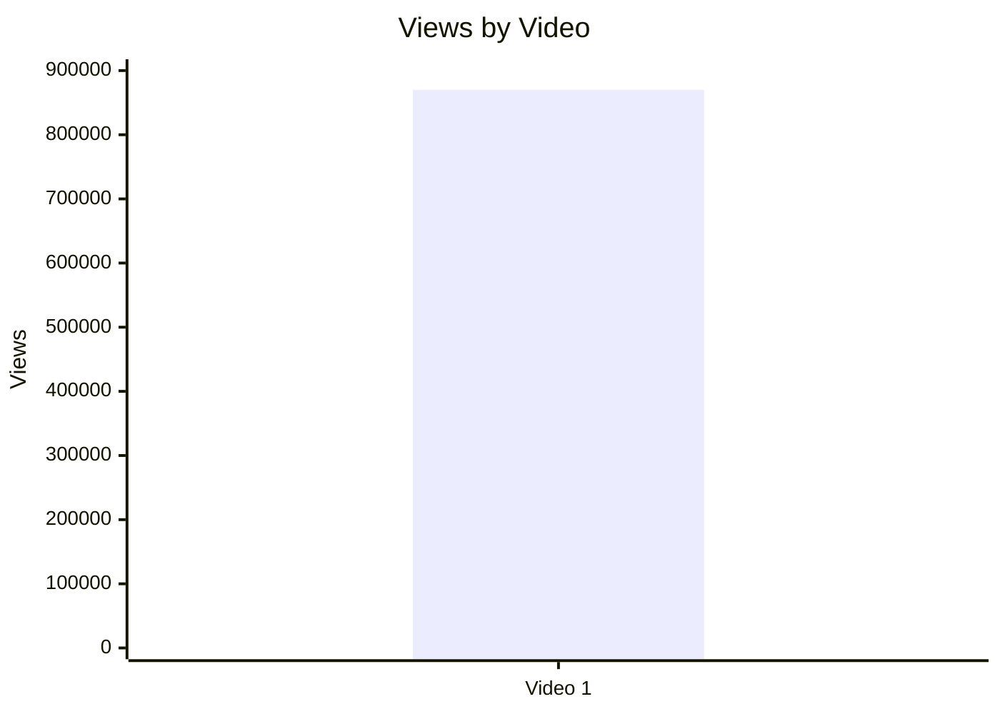
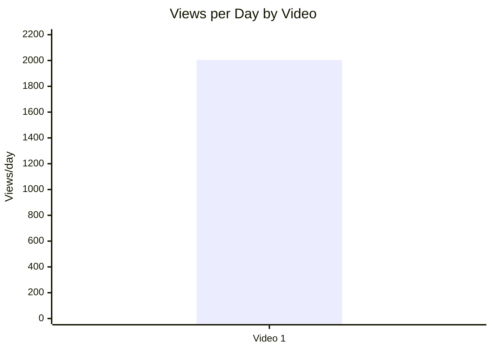
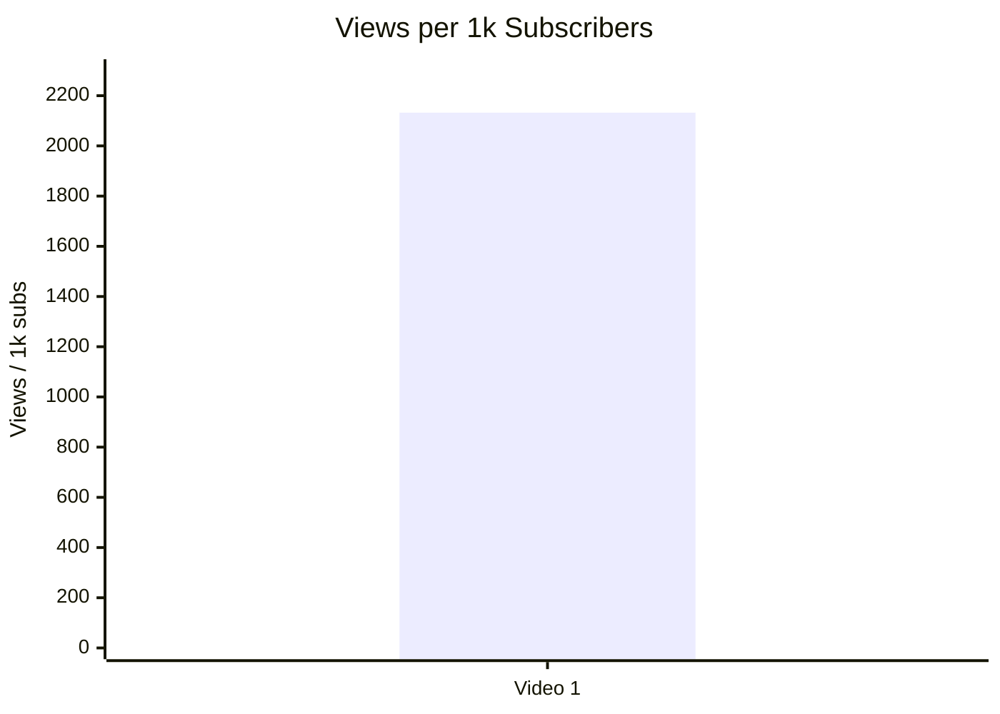
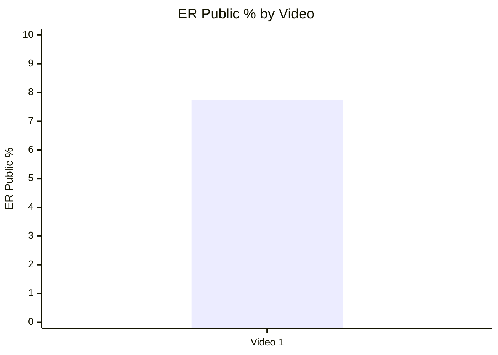
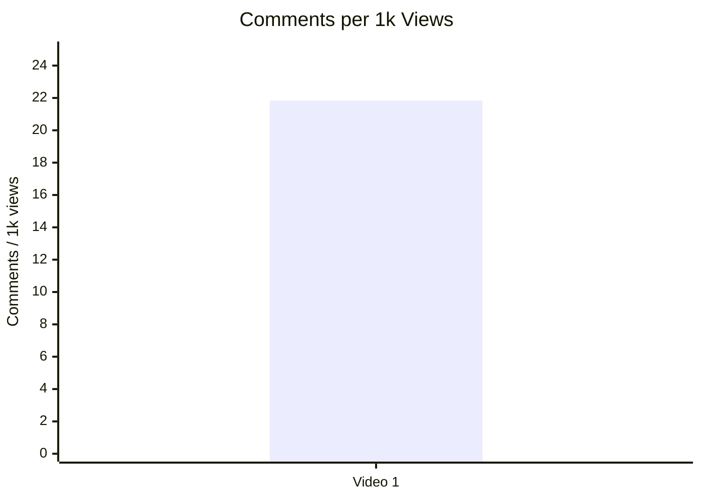
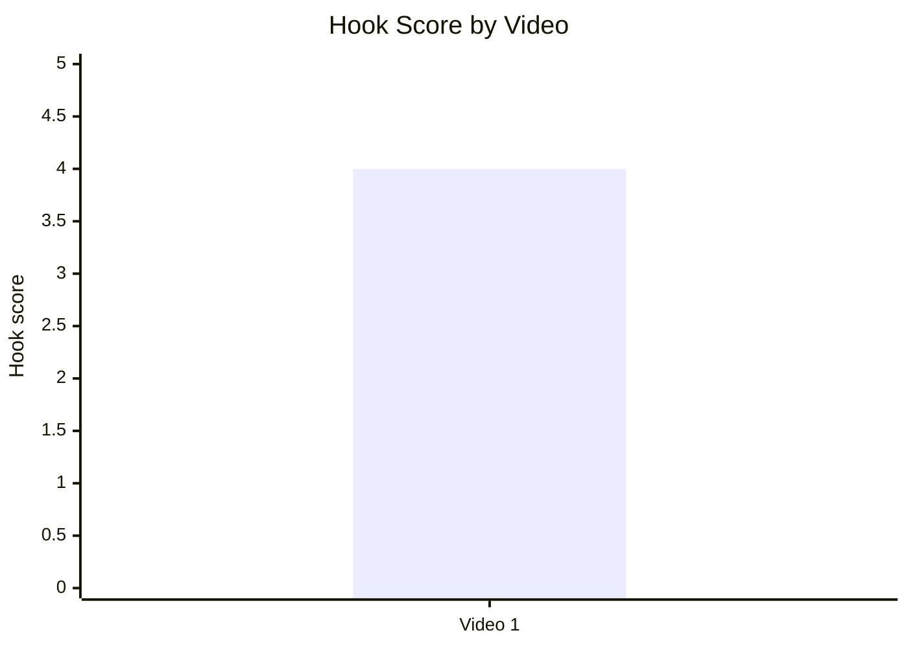
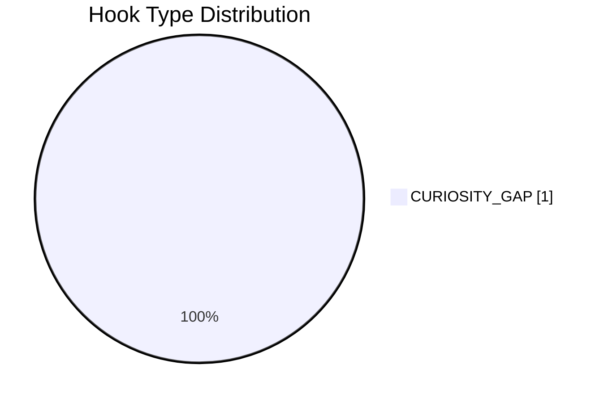
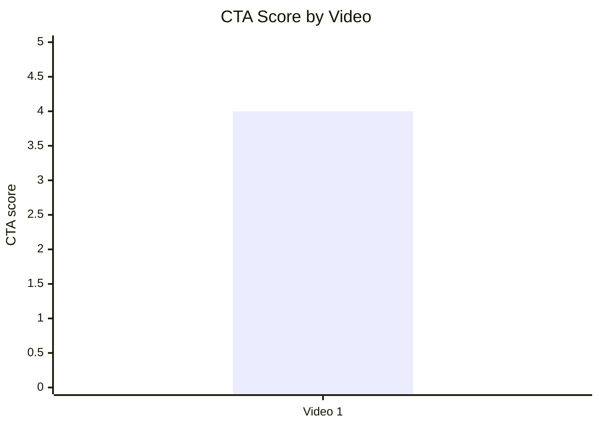
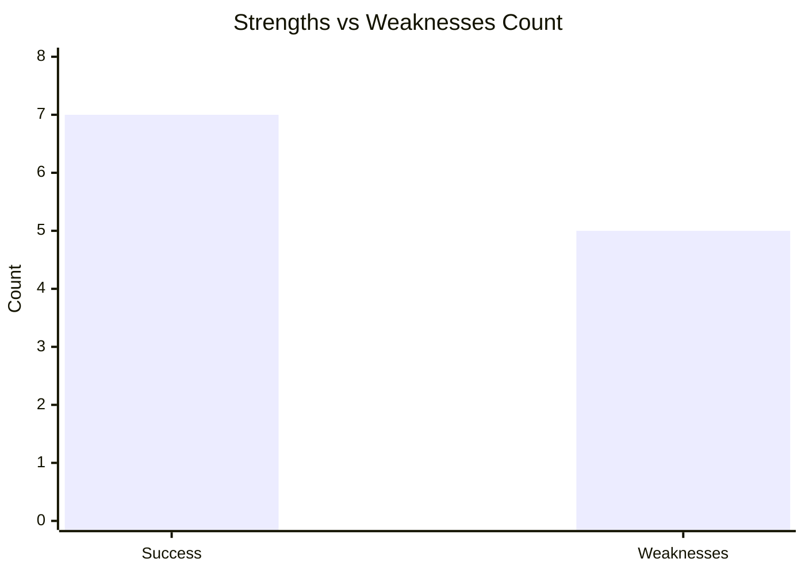

# Статистичний аналіз відеозвітів

## 1. Короткий executive summary

| Пункт | Висновок |
|---|---|
| Скільки відео проаналізовано | 1 |
| Скільки форматів відео | 1 формат: `LONG_20_PLUS_MIN` |
| Найсильніше відео за overall score | `N/A` — у звіті немає `overall_video_score` |
| Найсильніше відео за ER Public % | Video 1 — 7.73% |
| Найсильніше відео за views per day | Video 1 — 2004.65 |
| Найсильніша повторювана механіка | `INSUFFICIENT_DATA` для повторюваності; в одному відео головна механіка: polarizing geopolitical decline framing |
| Найчастіша слабкість | `INSUFFICIENT_DATA` для частотності; в одному відео: довгі монологи / weak visual pacing / minimal direct comment prompt |
| Головна стратегічна можливість | Масштабувати macro-threat / empire-decline framing, але перевіряти на більшій вибірці |
| Рівень впевненості | LOW |

---

## 2. Якість і повнота даних

| Поле | Кількість відео з даними | Кількість N/A | Коментар |
|---|---:|---:|---|
| views | 1 | 0 | Є raw views |
| likes | 1 | 0 | Є raw likes |
| comments_count | 1 | 0 | Є raw comments |
| views_per_day | 1 | 0 | Є derived metric |
| er_public_percent | 1 | 0 | Є derived metric |
| views_per_1k_subs | 1 | 0 | Є derived metric |
| hook_score | 1 | 0 | Є score 1–5 |
| cta_score | 1 | 0 | Є score 1–5 |
| ad_integration_score | 0 | 1 | У звіті є ad presence, але немає числового score |
| audio_score | 0 | 1 | Є qualitative audio analysis, але немає єдиного numeric audio_score |
| comment_resonance_score | 0 | 1 | Є qualitative comment analysis, але немає numeric score |
| overall_video_score | 0 | 1 | Overall score не заданий |

### Обмеження аналізу

- Вибірка містить лише 1 відео, тому статистичні порівняння, кластери та кореляції не будуються.
- Усі висновки мають статус `LOW_CONFIDENCE`.
- Частина score-полів відсутня як числові змінні: `overall_video_score`, `ad_integration_score`, `audio_score`, `comment_resonance_score`.
- Графіки з одним відео є описовими, а не порівняльними.
- Не змішуються різні формати: усі дані належать до `LONG_20_PLUS_MIN`.

---

## 3. Підготовлена таблиця для графіків

| Video | Format | Views | Likes | Comments | Views/day | Like Rate % | Comment Rate % | ER Public % | Views/1k subs | Hook | CTA | Ad | Audio | Comment Resonance | Overall |
|---|---|---:|---:|---:|---:|---:|---:|---:|---:|---:|---:|---:|---:|---:|---:|
| Video 1 | LONG_20_PLUS_MIN | 870,016 | 48,291 | 18,999 | 2004.65 | 5.55 | 2.18 | 7.73 | 2132.39 | 5 | 5 | 1 | 1 | 1 | 1 |

### Legend

| Label | Full title | URL |
|---|---|---|
| Video 1 | Why is America Intentionally Destroying its Global Influence? | https://www.youtube.com/watch?v=0f0vuCycOTE |

---

## 4. Рекомендовані графіки

| # | Назва графіка | Тип графіка | Поля | Для чого потрібен | Пріоритет |
|---:|---|---|---|---|---|
| 1 | Views by video | Bar chart | views | Показати raw reach | HIGH |
| 2 | Views per day by video | Bar chart | views_per_day | Показати normalized performance | HIGH |
| 3 | Views per 1k subscribers | Bar chart | views_per_1k_subs | Показати reach відносно розміру каналу | HIGH |
| 4 | ER Public % by video | Bar chart | er_public_percent | Показати публічне залучення | HIGH |
| 5 | Like Rate % vs Comment Rate % | Scatter plot | like_rate_percent, comment_rate_percent | Показати баланс лайків і дискусій | MEDIUM |
| 6 | Hook score by video | Bar chart | hook_score | Показати якість hook | HIGH |
| 7 | Hook type distribution | Pie/bar chart | primary_hook_type | Показати типи hook | MEDIUM |
| 8 | CTA score by video | Bar chart | cta_score | Показати якість CTA | HIGH |
| 9 | CTA features heatmap | Matrix | CTA feature flags | Показати наявність CTA елементів | HIGH |
| 10 | Score breakdown heatmap | Heatmap / matrix | available scores | Показати сильні/слабкі сторони | HIGH |
| 11 | Advertising presence matrix | Matrix | ads_detected, ad types | Показати типи інтеграцій | MEDIUM |
| 12 | Comment clusters table | Table/manual chart | cluster names | Показати теми реакцій | MEDIUM |

---

## 5. Графіки продуктивності

## 5.1. Views by video

- Назва графіка: Views by video
- Яке питання він відповідає: яке відео має найбільший raw reach?
- Які поля використовуються: `video_label`, `views`
- Тип графіка: bar chart / Mermaid bar chart
- Що видно з графіка: Video 1 має 870,016 переглядів.
- Практичний висновок: raw reach високий, але без інших відео неможливо визначити outlier у когорті.



| Video | Views |
|---|---:|
| Video 1 | 870016 |

## 5.2. Views per day by video

- Назва графіка: Views per day by video
- Яке питання він відповідає: яка швидкість набору переглядів з урахуванням віку відео?
- Які поля використовуються: `video_label`, `views_per_day`
- Тип графіка: bar chart / Mermaid bar chart
- Що видно з графіка: Video 1 має 2004.65 views/day.
- Практичний висновок: це основна normalized performance metric для цього звіту; порівняння потребує інших відео цього ж формату.



| Video | Views/day |
|---|---:|
| Video 1 | 2004.65 |

## 5.3. Views per 1k subscribers

- Назва графіка: Views per 1k subscribers
- Яке питання він відповідає: наскільки відео вийшло за межі бази підписників?
- Які поля використовуються: `video_label`, `views_per_1k_subs`
- Тип графіка: bar chart / Mermaid bar chart
- Що видно з графіка: Video 1 має 2132.39 views per 1k subscribers.
- Практичний висновок: відео отримало переглядів більше, ніж 2× розмір підписної бази у перерахунку на 1k subs, але без benchmark це не можна назвати статистичним outlier.



| Video | Views/1k subs |
|---|---:|
| Video 1 | 2132.39 |

## 5.4. Performance quadrant

- Назва графіка: Performance quadrant
- Яке питання він відповідає: чи є баланс між reach і engagement?
- Які поля використовуються: `views_per_day`, `er_public_percent`
- Тип графіка: scatter / quadrant chart
- Що видно з графіка: є лише одна точка: Video 1 = 2004.65 views/day і 7.73% ER Public.
- Практичний висновок: quadrant не можна інтерпретувати без мінімум 2–3 відео для порогів, тому статус `INSUFFICIENT_DATA`.

| Video | Views/day | ER Public % | Quadrant status |
|---|---:|---:|---|
| Video 1 | 2004.65 | 7.73 | INSUFFICIENT_DATA |

---

## 6. Графіки залучення

## 6.1. ER Public % by video

- Назва графіка: ER Public % by video
- Яке питання він відповідає: яке відео має найбільше публічне залучення?
- Які поля використовуються: `video_label`, `er_public_percent`
- Тип графіка: bar chart / Mermaid bar chart
- Що видно з графіка: Video 1 має ER Public 7.73%.
- Практичний висновок: ER високий у межах цього одного кейсу, але статистичне порівняння неможливе.



| Video | ER Public % |
|---|---:|
| Video 1 | 7.73 |

## 6.2. Like Rate % vs Comment Rate %

- Назва графіка: Like Rate % vs Comment Rate %
- Яке питання він відповідає: реакція більше схожа на підтримку чи дискусію?
- Які поля використовуються: `like_rate_percent`, `comment_rate_percent`
- Тип графіка: scatter plot
- Що видно з графіка: Video 1 має 5.55% like rate і 2.18% comment rate.
- Практичний висновок: формат провокує і лайки, і коментарі; з одним відео це описовий факт, не патерн.

| Video | Like Rate % | Comment Rate % | Interpretation |
|---|---:|---:|---|
| Video 1 | 5.55 | 2.18 | Strong engagement within single-video dataset |

## 6.3. Comments per 1k views

- Назва графіка: Comments per 1k views
- Яке питання він відповідає: наскільки відео провокує реакцію?
- Які поля використовуються: `comments_per_1k_views`
- Тип графіка: bar chart / Mermaid bar chart
- Що видно з графіка: Video 1 має 21.84 comments per 1k views.
- Практичний висновок: коментарність — одна з найсильніших видимих механік цього кейсу.



| Video | Comments per 1k views |
|---|---:|
| Video 1 | 21.84 |

---

## 7. Графіки структури та hook

## 7.1. Hook score by video

- Назва графіка: Hook score by video
- Яке питання він відповідає: наскільки сильний hook?
- Які поля використовуються: `hook_score`
- Тип графіка: bar chart / Mermaid bar chart
- Що видно з графіка: Video 1 має hook score 4/5.
- Практичний висновок: hook достатньо сильний для тестування схожих curiosity/conflict frameworks.



| Video | Hook type | Hook score |
|---|---|---:|
| Video 1 | CURIOSITY_GAP | 4 |

## 7.2. Hook type distribution

- Назва графіка: Hook type distribution
- Яке питання він відповідає: які типи hook використані?
- Які поля використовуються: `hook_primary_type`, count
- Тип графіка: pie chart / Mermaid pie
- Що видно з графіка: 100% відео у вибірці має primary hook type `CURIOSITY_GAP`.
- Практичний висновок: не можна визначити, чи цей hook type кращий за інші; потрібні інші відео для порівняння.



| Hook type | Count |
|---|---:|
| CURIOSITY_GAP | 1 |

## 7.3. Time to first value vs Overall Score

- Назва графіка: Time to first value vs Overall Score
- Яке питання він відповідає: чи швидша перша цінність пов’язана з вищим overall score?
- Які поля використовуються: `time_to_first_value_seconds`, `overall_video_score`
- Тип графіка: scatter plot
- Що видно з графіка: `time_to_first_value` є як `< 90 сек`, але `overall_video_score` відсутній.
- Практичний висновок: графік не будується; потрібні numeric `time_to_first_value_seconds` і `overall_video_score`.

| Video | Time to first value | time_to_first_value_seconds | Overall score | Status |
|---|---|---:|---:|---|
| Video 1 | < 90 сек | 90 | N/A | INSUFFICIENT_DATA |

---

## 8. Графіки CTA

## 8.1. CTA score by video

- Назва графіка: CTA score by video
- Яке питання він відповідає: наскільки якісно вбудовано CTA?
- Які поля використовуються: `cta_score`
- Тип графіка: bar chart / Mermaid bar chart
- Що видно з графіка: Video 1 має CTA score 4/5.
- Практичний висновок: CTA працює як functional support CTA, але є можливість посилити comment prompt і next-video bridge.



| Video | CTA count | CTA score |
|---|---:|---:|
| Video 1 | 3 | 4 |

## 8.2. CTA count vs ER Public %

- Назва графіка: CTA count vs ER Public %
- Яке питання він відповідає: чи більше CTA пов’язано з кращим engagement?
- Які поля використовуються: `cta_count`, `er_public_percent`
- Тип графіка: scatter plot
- Що видно з графіка: одна точка: CTA count 3, ER Public 7.73%.
- Практичний висновок: неможливо оцінити зв’язок між кількістю CTA і ER Public з одним відео.

| Video | CTA count | ER Public % | Status |
|---|---:|---:|---|
| Video 1 | 3 | 7.73 | INSUFFICIENT_DATA |

## 8.3. CTA features heatmap

- Назва графіка: CTA features heatmap
- Яке питання він відповідає: які CTA features присутні?
- Які поля використовуються: `has_comment_prompt`, `has_subscribe_cta`, `has_like_cta`, `has_bell_cta`, `has_next_video_bridge`
- Тип графіка: heatmap / matrix
- Що видно з графіка: підписка і лайк присутні; bell CTA відсутній; comment prompt і next-video bridge часткові.
- Практичний висновок: тестувати конкретний comment prompt і сильніший next-video bridge.

| Video | Comment prompt | Subscribe | Like | Bell | Next video bridge |
|---|---|---|---|---|---|
| Video 1 | 🟨 PARTLY | ✅ YES | ✅ YES | ❌ NO | 🟨 PARTLY |

---

## 9. Графіки реклами / інтеграцій

Реклама / інтеграції виявлені, але числових полів `ad_load_percent`, `first_ad_relative_position_percent`, `ad_integration_score` у звіті немає. Тому графіки рекламного навантаження не будуються.

## 9.1. Ad load % by video

- Назва графіка: Ad load % by video
- Яке питання він відповідає: яке рекламне навантаження має відео?
- Які поля використовуються: `ad_load_percent`
- Тип графіка: bar chart
- Що видно з графіка: `ad_load_percent` відсутній.
- Практичний висновок: потрібно фіксувати тривалість рекламних інтеграцій у майбутніх `YT_VIDEO_ANALYSIS_V1` звітах.

| Video | Ads detected | Ad load % | Status |
|---|---|---:|---|
| Video 1 | YES | N/A | INSUFFICIENT_DATA |

## 9.2. First ad position %

- Назва графіка: First ad position %
- Яке питання він відповідає: чи реклама з’являється до або після першої цінності?
- Які поля використовуються: `first_ad_relative_position_percent`
- Тип графіка: bar chart / scatter plot
- Що видно з графіка: реклама виявлена лише як description links / creator support, mid-roll sponsor не виявлений.
- Практичний висновок: first ad position не застосовується до description-only links.

| Video | First ad time | First ad relative position % | Status |
|---|---|---:|---|
| Video 1 | DESCRIPTION_LINK | NOT_APPLICABLE | NOT_APPLICABLE |

## 9.3. Ad integration score vs ER Public %

- Назва графіка: Ad integration score vs ER Public %
- Яке питання він відповідає: чи якість інтеграції пов’язана із залученням?
- Які поля використовуються: `ad_integration_score`, `er_public_percent`
- Тип графіка: scatter plot
- Що видно з графіка: `ad_integration_score` відсутній.
- Практичний висновок: зв’язок не оцінюється.

| Video | Ad integration score | ER Public % | Status |
|---|---:|---:|---|
| Video 1 | N/A | 7.73 | INSUFFICIENT_DATA |

### Advertising presence matrix

| Video | Affiliate links | Patreon | Buy Me a Coffee | Channel promotion | Mid-roll sponsor |
|---|---|---|---|---|---|
| Video 1 | ✅ YES | ✅ YES | ✅ YES | ✅ YES | ❌ NO_AD_DETECTED |

---

## 10. Графіки аудіо

У звіті є qualitative audio analysis, але немає єдиного numeric `audio_score`. Тому numeric audio charts не будуються.

## 10.1. Audio score by video

- Назва графіка: Audio score by video
- Яке питання він відповідає: яке відео має найкращу аудіо-якість?
- Які поля використовуються: `audio_score`
- Тип графіка: bar chart
- Що видно з графіка: `audio_score` відсутній.
- Практичний висновок: у наступних звітах потрібно додати єдину audio score змінну.

| Video | Audio quality | Audio score | Status |
|---|---|---:|---|
| Video 1 | Good | N/A | INSUFFICIENT_DATA |

## 10.2. Audio score vs Overall Score

- Назва графіка: Audio score vs Overall Score
- Яке питання він відповідає: чи якість аудіо пов’язана з overall score?
- Які поля використовуються: `audio_score`, `overall_video_score`
- Тип графіка: scatter plot
- Що видно з графіка: обидва numeric поля відсутні.
- Практичний висновок: графік неможливий у цьому dataset.

| Video | Audio score | Overall score | Status |
|---|---:|---:|---|
| Video 1 | N/A | N/A | INSUFFICIENT_DATA |

---

## 11. Графіки коментарів

## 11.1. Sentiment distribution

- Назва графіка: Sentiment distribution
- Яке питання він відповідає: який розподіл реакцій аудиторії?
- Які поля використовуються: `positive_percent`, `negative_percent`, `mixed_percent`, `neutral_percent`, `question_percent`, `request_percent`
- Тип графіка: stacked bar chart
- Що видно з графіка: numeric sentiment distribution відсутній; є qualitative sentiment `Polarized`.
- Практичний висновок: для stacked chart потрібна розмітка коментарів у відсотках.

| Video | Dominant sentiment | Positive % | Negative % | Mixed % | Neutral % | Question % | Request % | Status |
|---|---|---:|---:|---:|---:|---:|---:|---|
| Video 1 | Polarized | N/A | N/A | N/A | N/A | N/A | N/A | INSUFFICIENT_DATA |

## 11.2. Comment resonance score by video

- Назва графіка: Comment resonance score by video
- Яке питання він відповідає: яке відео має найсильніший резонанс у коментарях?
- Які поля використовуються: `comment_resonance_score`
- Тип графіка: bar chart
- Що видно з графіка: numeric score відсутній.
- Практичний висновок: є qualitative evidence сильного comment resonance, але без score графік не будується.

| Video | Comments | Dominant sentiment | Comment resonance score | Status |
|---|---:|---|---:|---|
| Video 1 | 18999 | Polarized | N/A | INSUFFICIENT_DATA |

## 11.3. Top comment clusters

- Назва графіка: Top comment clusters
- Яке питання він відповідає: які теми найчастіше виникають у коментарях?
- Які поля використовуються: cluster name; count/percent
- Тип графіка: horizontal bar chart
- Що видно з графіка: cluster names є, але count/percent немає.
- Практичний висновок: можна використовувати як qualitative map; для chart потрібна кількісна кластеризація.

| Cluster | Count / Percent | Interpretation |
|---|---:|---|
| Підтримка тези про втрату довіри до США | N/A | Qualitative cluster |
| Анти-Trump реакції | N/A | Qualitative cluster |
| Anti-globalism rebuttal | N/A | Qualitative cluster |
| NATO / military debate | N/A | Qualitative cluster |
| Historical empire discussions | N/A | Qualitative cluster |
| European perspective comments | N/A | Qualitative cluster |

---

## 12. Графіки score-системи

## 12.1. Overall score by video

- Назва графіка: Overall score by video
- Яке питання він відповідає: яке відео найсильніше загалом?
- Які поля використовуються: `overall_video_score`
- Тип графіка: bar chart
- Що видно з графіка: `overall_video_score` відсутній.
- Практичний висновок: неможливо побудувати overall ranking без явного overall score.

| Video | Overall score | Status |
|---|---:|---|
| Video 1 | N/A | INSUFFICIENT_DATA |

## 12.2. Score breakdown heatmap

- Назва графіка: Score breakdown heatmap
- Яке питання він відповідає: які сильні та слабкі сторони відео за score-блоками?
- Які поля використовуються: доступні score-поля зі звіту
- Тип графіка: heatmap / matrix
- Що видно з графіка: є hook, CTA, structure, value density, pacing та engagement; ad/audio/comments/overall відсутні як standardized numeric scores.
- Практичний висновок: найсильніший numeric score у звіті — Audience Engagement 10/10; слабше місце — pacing 6/10 або pacing 3/5 у value/pacing таблиці.

| Video | Hook | Structure | Value Density | Audio | CTA | Ad | Comments | Replicability | Overall |
|---|---:|---:|---:|---:|---:|---:|---:|---:|---:|
| Video 1 | 4/5 | 7/10 | 4/5 | N/A | 4/5 | N/A | N/A | N/A | N/A |

### Додаткові доступні score-поля зі звіту

| Video | Topic Selection | Title Effectiveness | Pacing | Audience Engagement | SEO Potential | Evergreen Potential |
|---|---:|---:|---:|---:|---:|---:|
| Video 1 | 9/10 | 8/10 | 6/10 | 10/10 | 8/10 | 8/10 |

## 12.3. Strengths vs weaknesses count

- Назва графіка: Strengths vs weaknesses count
- Яке питання він відповідає: у відео більше повторюваних сильних механік чи missed opportunities?
- Які поля використовуються: count of success mechanics, count of missed opportunities
- Тип графіка: stacked bar chart / table
- Що видно з графіка: 7 success mechanics і 5 missed opportunities.
- Практичний висновок: у цьому кейсі сильних механік більше, ніж зафіксованих слабкостей, але це не статистичний висновок.



| Video | Success mechanics count | Missed opportunities count |
|---|---:|---:|
| Video 1 | 7 | 5 |

---

## 13. Кореляції та патерни

Correlation analysis skipped: fewer than 5 comparable videos.

| Pair | Correlation / Pattern | Strength | Interpretation | Confidence |
|---|---:|---|---|---|
| hook_score → overall_video_score | INSUFFICIENT_DATA | N/A | Немає `overall_video_score` і лише 1 відео | LOW |
| value_density_score → er_public_percent | INSUFFICIENT_DATA | N/A | Є 1 точка, зв’язок не оцінюється | LOW |
| cta_score → comment_rate_percent | INSUFFICIENT_DATA | N/A | Є 1 точка, зв’язок не оцінюється | LOW |
| comment_resonance_score → er_public_percent | INSUFFICIENT_DATA | N/A | Немає `comment_resonance_score` | LOW |
| views_per_day → er_public_percent | INSUFFICIENT_DATA | N/A | Є 1 точка, quadrant неінтерпретований | LOW |
| ad_load_percent → er_public_percent | INSUFFICIENT_DATA | N/A | Немає `ad_load_percent` | LOW |
| time_to_first_value_seconds → overall_video_score | INSUFFICIENT_DATA | N/A | Немає `overall_video_score` | LOW |

---

## 14. Висновки для контент-стратегії

| Спостереження | Дані / графік | Що це означає | Що робити |
|---|---|---|---|
| Geopolitical decline framing дав сильний engagement у цьому кейсі | ER Public 7.73%, Comments 18,999 | Тема провокує реакцію і debate | Тестувати серію з macro-threat / power-decline темами |
| Hook type `CURIOSITY_GAP` має сильну якісну оцінку в одному кейсі | Hook score 4/5 | Hook швидко продає tension | Тестувати варіанти CURIOSITY_GAP vs CONFLICT на більшій вибірці |
| Коментарі є головною силою відео | 21.84 comments per 1k views | Тема створює дискусійні петлі | Додати прямий comment prompt у pinned comment і verbal CTA |
| CTA достатній, але не максимально оптимізований | CTA score 4/5; comment prompt PARTLY | Є subscribe/like, але слабкий next-video bridge | Додати end screen bridge і конкретне питання для коментарів |
| Реклама не шкодить через низьку intrusive presence | Description-only affiliate/support links | Monetization не перериває retention | Зберігати description-only support або ставити інтеграції після першого payoff |
| Pacing слабший за topic/hook | Pacing 6/10; у value table pacing 3/5 | Long talking-head може втрачати частину аудиторії | Додати visual resets, chapters, pattern interrupts |

---

## 15. Що тестувати далі

| Тест | Гіпотеза | На яких даних базується | Як виміряти | Пріоритет |
|---|---|---|---|---|
| Прямий comment prompt у перші 70–80% відео | Чітке питання збільшить comments per 1k views | У звіті comment prompt = PARTLY, але comment rate вже 2.18% | comments_per_1k_views, comment_rate_percent | HIGH |
| Сильніший next-video bridge | Session continuation може зрости | Next video bridge = PARTLY | CTR end screen, watch next video rate `OWNER_ONLY` | HIGH |
| Shorter time to first value | Швидше формулювання цінності може підняти retention | time_to_first_value `< 90 сек`, але pacing 3/5 | retention `OWNER_ONLY`, manual drop-off proxy | MEDIUM |
| Більше visual resets у long-form | Зменшить втому від talking-head | Weakness: weak visual pacing | average view duration `OWNER_ONLY`, comments about pace | MEDIUM |
| Серія “empire decline / trust collapse” | Повторення macro threat framing може масштабувати reach | Success mechanic: geopolitical decline framing | views_per_day, ER Public %, comments_per_1k_views | HIGH |
| A/B title із сильнішим payoff | Більш конкретна назва може збільшити CTR | Title effectiveness 8/10, але CTR `OWNER_ONLY` | CTR `OWNER_ONLY`, views_per_day | MEDIUM |
| Pinned comment із debate question | Може направити дискусію і збільшити якісні replies | Pinned comment зараз LIKE/SUBSCRIBE | replies per pinned comment, comment_rate_percent | HIGH |
| Кількісна розмітка sentiment | Дасть змогу будувати sentiment distribution | Sentiment зараз qualitative: Polarized | positive/negative/mixed/neutral % | MEDIUM |

---

## 16. Дані для експорту в таблицю / CSV

| video_label | title | format_group | views | views_per_day | like_rate_percent | comment_rate_percent | er_public_percent | views_per_1k_subs | hook_type | hook_score | cta_count | cta_score | ad_load_percent | ad_integration_score | audio_score | comment_resonance_score | overall_video_score | top_success_mechanic | top_missed_opportunity |
|---|---|---|---:|---:|---:|---:|---:|---:|---|---:|---:|---:|---:|---:|---:|---:|---:|---|---|
| Video 1 | Why is America Intentionally Destroying its Global Influence? | LONG_20_PLUS_MIN | 870016 | 2004.65 | 5.55 | 2.18 | 7.73 | 2132.39 | CURIOSITY_GAP | 4 | 3 | 4 | N/A | N/A | N/A | N/A | N/A | Polarizing geopolitical decline framing | Weak visual pacing / long talking-head monologues |

### CSV-ready

```csv
video_label,title,format_group,views,views_per_day,like_rate_percent,comment_rate_percent,er_public_percent,views_per_1k_subs,hook_type,hook_score,cta_count,cta_score,ad_load_percent,ad_integration_score,audio_score,comment_resonance_score,overall_video_score,top_success_mechanic,top_missed_opportunity
Video 1,Why is America Intentionally Destroying its Global Influence?,LONG_20_PLUS_MIN,870016,2004.65,5.55,2.18,7.73,2132.39,CURIOSITY_GAP,4,3,4,N/A,N/A,N/A,N/A,N/A,Polarizing geopolitical decline framing,Weak visual pacing / long talking-head monologues
```