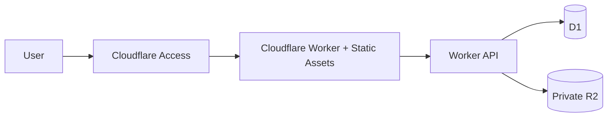

# Marketing Report Studio

**Marketing Report Studio** is a web application for collecting, structuring,
analyzing, and presenting marketing and competitive research.

The service turns spreadsheets, analytical files, and research materials into
a unified interactive report containing charts, tables, company files, and a
separate client-facing version.

The project supports two operating modes:

- **collaborative online mode** powered by Cloudflare Workers, Access, D1, and R2;
- **local mode** delivered as a standalone HTML file with no dedicated server.

## What the Service Is Used For

Marketing Report Studio is designed for workflows where data, findings, and
research materials need to be collected in one clear and accessible environment.

Typical use cases include:

- competitive intelligence and company comparisons;
- preparation of marketing research;
- analysis of websites, channels, content, and advertising metrics;
- research into YouTube videos, reach, engagement, and retention metrics;
- preparation of internal analytical reports;
- creation of polished client-facing reports;
- collaboration between analysts, marketers, and editors on a shared report;
- storage of sources, spreadsheets, and supporting files alongside findings.

The service is especially useful for marketing agencies, analytics teams,
consultants, researchers, content teams, and competitive intelligence
professionals.

## Marketing Report Studio Features

### Data Management

- import of `XLSX`, `CSV`, `TSV`, and `JSON` files;
- pasting tables from Excel or Google Sheets;
- automatic detection of columns and data types;
- editing rows directly inside a report;
- generation of a unified competitive intelligence data model;
- organization of materials by company, folder, and research project.

### Analytics and Visualization

- automatic generation of a basic report from a table;
- chart creation from numeric and categorical fields;
- creation of summary tables;
- analytics filtering by website or research project;
- comparison of a client with competitors;
- inspection of source rows used by a visualization;
- support for marketing, engagement, and content metrics.

### Files and Research Materials

- storage of Markdown, TXT, HTML, PDF, DOCX, and image files;
- in-app preview of supported files;
- connection to a local folder through the File System Access API;
- automatic reading of structured materials from connected folders;
- attachment of files to a specific company or research project;
- export of a portable archive containing both files and report data.

### Team Collaboration

- authentication through Cloudflare Access;
- a shared report for an authorized team;
- automatic cloud saving;
- `owner`, `editor`, and `viewer` roles;
- user management by email address;
- audit records for creation, editing, and access changes;
- report versioning;
- protection against accidentally overwriting a newer version.

### Delivering Reports to Clients

An editor can generate a separate client-facing HTML version of a report. This
version:

- opens locally in a browser;
- contains the required data and visualizations;
- does not connect to the cloud API;
- does not display editing controls;
- uses the fixed `clientLocked` viewing mode.

This is useful when a client needs a finished interactive report without access
to the team's workspace.

> The client HTML disables editing at the application level, but it is not a
> cryptographically immutable document. For a legally significant or completely
> fixed copy, consider providing a PDF as well.

## Typical Workflow

1. An analyst creates or opens a shared report.
2. They add spreadsheets, files, and research materials.
3. They associate the data with the client and its competitors.
4. They create charts, tables, and analytical sections.
5. The team reviews and expands the report according to each member's role.
6. Changes are automatically stored as new versions.
7. Once the report is complete, an editor exports the client-facing HTML version.

## Operating Modes

### Cloud Mode

Cloud mode is intended for team collaboration.



Components:

| Component | Purpose |
| --- | --- |
| Cloudflare Workers Static Assets | hosts the web interface |
| Cloudflare Access | authenticates users |
| Cloudflare Worker | provides the protected server-side API |
| D1 | stores users, roles, metadata, versions, and audit records |
| R2 | privately stores report snapshots and embedded files |

The production build contains only an empty application shell. Actual report
data is loaded from R2 only after Cloudflare Access and user permissions have
been verified.

### Local Mode

The main HTML file can be opened directly in a browser:

```text
marketing_report_studio_v8_access_folders_fixed.html
```

In this mode:

- no server is required;
- working data remains in the current browser;
- access to local folders is granted explicitly by the user;
- the report can be saved as a standalone HTML file or ZIP archive;
- data is not synchronized between devices or users.

A Chromium-based browser is recommended for local folder access because the
File System Access API is not supported equally across all browsers.

## Access Roles

| Role | Permissions |
| --- | --- |
| `owner` | edit reports and manage users |
| `editor` | create and edit reports |
| `viewer` | view the shared report without write access |

Cloudflare Access verifies the user's identity, while the role stored in D1
determines which operations are permitted inside the service. The interface is
not used as the sole security boundary: permissions are verified again by the
server-side API.

## Data Security

Cloud mode implements:

- validation of the Access JWT signature, issuer, audience, and expiration;
- server-side authorization for every write operation;
- data isolation by workspace;
- a private R2 bucket with no direct public access;
- origin validation for write requests;
- JSON request-size limits;
- parameterized SQL queries;
- user action auditing;
- Content Security Policy and additional security headers;
- optimistic locking to prevent editing conflicts;
- no report data in the production HTML or hosted-mode `localStorage`.

Secrets and Cloudflare API tokens must never be stored in HTML or committed to Git.

## Quick Local Start

For standalone use, open
`marketing_report_studio_v8_access_folders_fixed.html` in a browser.

To generate the production build:

```bash
npm run build
```

The result is created in the `dist/` directory:

```text
dist/
├── index.html
├── _headers
├── _routes.json
└── robots.txt
```

## Tests

```bash
npm test
```

The smoke test verifies:

- creation of the initial workspace owner;
- report creation and retrieval;
- storage of report versions in R2;
- write access for an `editor`;
- write protection for a `viewer`;
- conflict handling when attempting to overwrite a newer version.

## Cloudflare Deployment

Complete step-by-step instructions are available in
[CLOUDFLARE_DEPLOYMENT.md](./CLOUDFLARE_DEPLOYMENT.md).

Main Cloudflare Workers Builds settings:

```text
Build command: npm run build
Deploy command: npx wrangler deploy
```

Required bindings:

```text
DB              -> Cloudflare D1
REPORTS_BUCKET  -> private Cloudflare R2 bucket
```

Required environment variables:

```text
ACCESS_TEAM_DOMAIN
ACCESS_AUD
BOOTSTRAP_OWNER_EMAIL
```

## Project Structure

```text
.
├── marketing_report_studio_v8_access_folders_fixed.html
├── functions/
│   └── api/[[path]].js
├── migrations/
│   └── 0001_init.sql
├── scripts/
│   └── build.mjs
├── tests/
│   └── api-smoke.mjs
├── CLOUDFLARE_DEPLOYMENT.md
├── wrangler.toml.example
├── .dev.vars.example
└── package.json
```

## Current Limitations

- The interface currently operates on one primary active report per workspace.
- Concurrent editing is protected by version checks, but real-time change merging
  comparable to Google Docs is not yet implemented.
- Large attachments increase the size of the report JSON snapshot. At a larger
  scale, attachments should be stored as separate R2 objects.
- Local folder permissions are tied to a specific browser and device.
- A standalone client HTML file can technically be modified outside the application.

## Technology Stack

- HTML, CSS, and JavaScript without a frontend framework;
- Cloudflare Workers and Static Assets;
- Cloudflare Access;
- Cloudflare D1;
- Cloudflare R2;
- JSZip;
- File System Access API;
- GitHub for source control and automated deployments.

## Licensing and Data Responsibility

The project uses JSZip; its licensing terms are included in the source HTML.
Users who add reports, text, images, or other materials to the system are
responsible for verifying that they have the necessary rights to use them.
