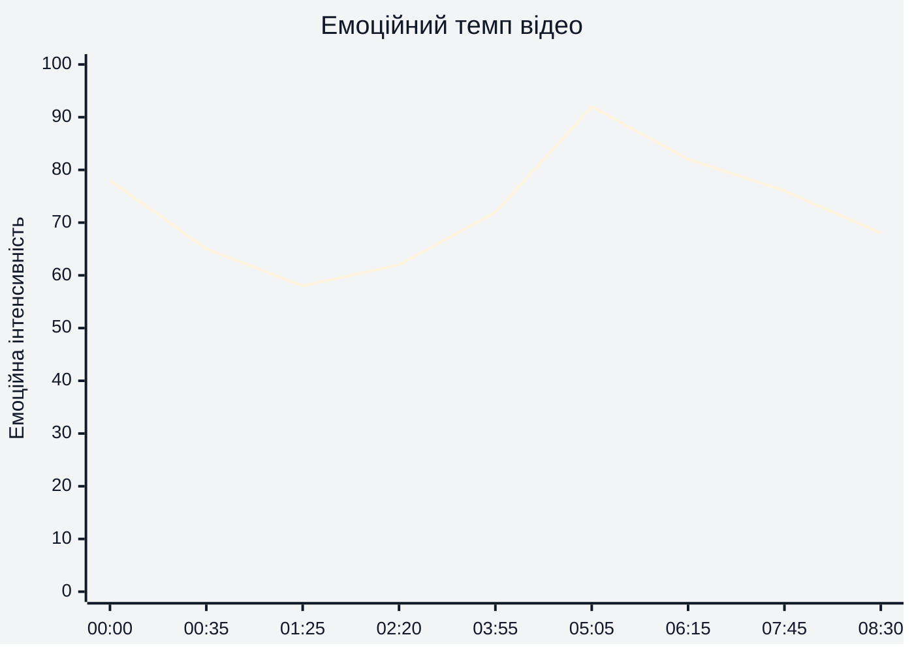
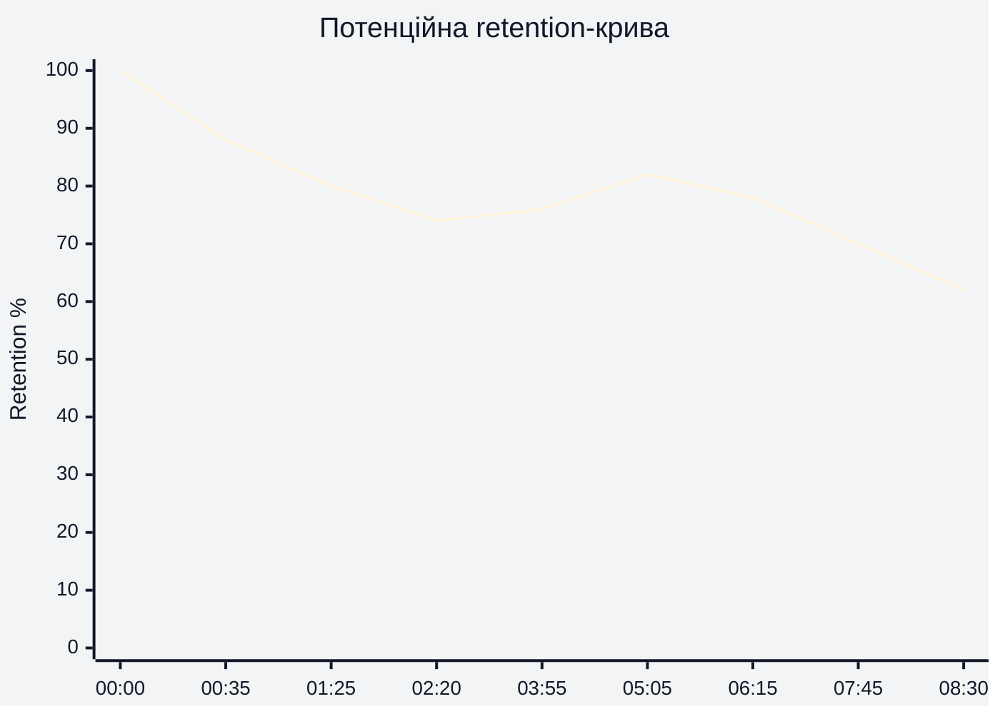
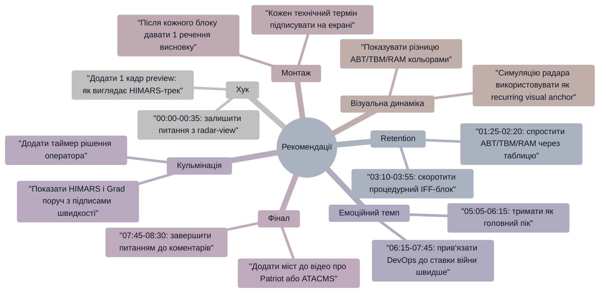

# Аналіз довгоформатного YouTube-відео

## 1. Сюжетна дуга (Narrative Arc)

```mermaid
%%{init: {'theme':'base', 'themeVariables': {
'primaryColor':'#f3f4f6',
'primaryTextColor':'#111827',
'primaryBorderColor':'#2563eb',
'lineColor':'#2563eb',
'secondaryColor':'#ffffff',
'tertiaryColor':'#f3f4f6',
'background':'#f3f4f6'
}}}%%
flowchart LR
    A["00:00-00:35<br/>Хук<br/>Що HIMARS бачить на російському радарі і чому це не очевидна ціль"]
    B["00:35-01:25<br/>Експозиція<br/>Що таке HIMARS і чому він критичний для України"]
    C["01:25-02:20<br/>Перша ескалація<br/>Пояснення типів загроз: ABT, TBM, RAM"]
    D["02:20-03:55<br/>Переломний момент<br/>Демонстрація звичайної повітряної цілі та рішення оператора"]
    E["03:55-05:05<br/>Наростання напруги<br/>Порівняння TBM із HIMARS: система бачить трек, але не розуміє клас цілі"]
    F["05:05-06:15<br/>Кульмінація<br/>HIMARS і Grad виглядають схоже, оператор має швидко відрізнити реальну загрозу"]
    G["06:15-07:45<br/>Розв'язка<br/>Проблема software update, deployment і downtime радарів"]
    H["07:45-08:30<br/>Фінальний висновок<br/>Росія змушена або витрачати ресурси, або перекидати ППО в тил"]
    A --> B --> C --> D --> E --> F --> G --> H
```

Сюжетна дуга побудована як технічний детектив: у `00:00-00:35` автор ставить питання, у `01:25-05:05` навчає глядача розпізнавати типи загроз, у `05:05-06:15` показує головну дилему HIMARS/Grad, а в `07:45-08:30` переводить технічну проблему в стратегічний наслідок.

## 2. Ключові Story Beats

```mermaid
%%{init: {'theme':'base', 'themeVariables': {
'primaryColor':'#f3f4f6',
'primaryTextColor':'#111827',
'primaryBorderColor':'#2563eb',
'lineColor':'#2563eb',
'secondaryColor':'#ffffff',
'tertiaryColor':'#f3f4f6',
'background':'#f3f4f6'
}}}%%
flowchart LR
    B1["00:00<br/>Питання<br/>Запустити curiosity gap"]
    B2["00:18<br/>Контртеза<br/>Росія може збити HIMARS, але не знає, що бачить"]
    B3["00:35<br/>Визначення HIMARS<br/>Дати базовий контекст"]
    B4["01:05<br/>Український контекст<br/>Пояснити stakes для війни"]
    B5["01:35<br/>ABT / TBM / RAM<br/>Навчити мові систем ППО"]
    B6["02:35<br/>Симуляція С-400<br/>Перевести глядача в роль оператора"]
    B7["03:10<br/>IFF і час рішення<br/>Показати, що повільна ціль дає час"]
    B8["04:10<br/>TBM-приклад<br/>Показати ціль, яку система класифікує швидко"]
    B9["05:05<br/>Проблема HIMARS<br/>Трек є, але клас цілі нечіткий"]
    B10["05:45<br/>Grad як маскування<br/>Створити головну дилему оператора"]
    B11["06:35<br/>Software update<br/>Пояснити, чому швидкий fix складний"]
    B12["08:00<br/>Стратегічна ціна<br/>Показати наслідок для російської ППО"]
    B1 --> B2 --> B3 --> B4 --> B5 --> B6 --> B7 --> B8 --> B9 --> B10 --> B11 --> B12
```

Ключовий beat відео — `05:05-05:45`: автор переводить питання з “чи бачить радар HIMARS?” у “чи встигає система та оператор правильно класифікувати загрозу?”. Саме цей момент створює основну цінність ролика.

## 3. Емоційний темп

Емоційна інтенсивність найвища в `05:05-06:15`, коли з'являється дилема HIMARS проти Grad і оператор мусить відрізнити швидкість та профіль цілі. Помітне зниження в `01:25-02:20` пов'язане з навчальним блоком термінів ABT/TBM/RAM, який потрібен для розуміння, але менш драматичний.

## 4. Утримання аудиторії

Реальні retention-дані або скріншот YouTube Studio не надані. Нижче — потенційна retention-структура, а не фактичні дані.

Потенційна крива передбачає природний спад після хука `00:00-01:25`, стабілізацію під час демонстрацій `02:20-05:05`, коротке підсилення на головному payoff `05:05-06:15` і спад у фінальному стратегічному поясненні `07:45-08:30`.

## 5. Піки retention

| Таймкод | Подія | Чому це може утримувати увагу | Сила піку 1–10 |
|---|---|---|---:|
| 00:00-00:35 | Автор питає, як HIMARS виглядає на російському радарі | Питання напряму відповідає назві й запускає curiosity gap | 9 |
| 00:18-00:35 | Контртеза: Росія може збити HIMARS, але не знає, що бачить | Ламає очікувану просту відповідь “не може збити” | 8 |
| 02:20-03:10 | Перехід у симуляцію С-400 | Візуальна/рольова зміна: глядач стає оператором системи | 8 |
| 03:55-04:45 | TBM приклад із impact point | Показує контраст: де система впевнена, а де ні | 7 |
| 05:05-06:15 | HIMARS проти Grad на радарі | Головний payoff: схожі профілі, різниця швидкості, мало часу на рішення | 10 |
| 06:35-07:25 | Software update і deployment проблема | Несподіваний міст між військовою темою і DevOps, який робить пояснення людяним | 7 |
| 07:45-08:20 | Стратегічна дилема перекидання ППО | Технічне пояснення отримує військовий наслідок | 8 |

## 6. Провали retention

| Таймкод | Проблема | Ймовірна причина спаду | Що покращити |
|---|---|---|---|
| 01:25-02:20 | Блок термінів ABT/TBM/RAM може бути щільним | Глядачі без бази ППО можуть втратити нитку до демонстрації | Додати коротку екранну таблицю “3 типи загроз” і залишити її на екрані під час пояснення |
| 03:10-03:55 | Пояснення IFF і процедури дозволу на вогонь | Це процедурний блок із нижчою драмою, ніж radar payoff | Скоротити або швидше підвести до фрази “тут є час подумати, але з HIMARS його не буде” |
| 06:15-07:25 | Software update може здатися відступом від радарної теми | Після кульмінації HIMARS/Grad увага може спадати, якщо не підкреслити stakes | Почати блок з чіткішого мосту: “Ось чому навіть простий software fix не рятує завтра” |
| 07:25-08:30 | Фінал без сильного CTA або next-video bridge | Після відповіді на головне питання немає нової петлі цікавості | Додати фінальне питання до коментарів і міст до наступного відео про Patriot/ППО |

## 7. Оцінка сегментів

| Сегмент | Таймкод | Функція | Емоційна інтенсивність | Ризик втрати уваги | Оцінка 1–10 | Що покращити |
|---|---|---|---:|---|---:|---|
| Хук | 00:00-00:35 | Поставити питання і пообіцяти демонстрацію | 78 | Низький | 9 | Додати ще коротший preview payoff на екрані |
| Контекст HIMARS | 00:35-01:25 | Пояснити систему і важливість для України | 65 | Середній | 8 | Стиснути визначення і швидше перейти до radar-view |
| Типи загроз | 01:25-02:20 | Дати поняття ABT, TBM, RAM | 58 | Середній | 7 | Візуалізувати як просту матрицю з 3 рядками |
| ABT-демонстрація | 02:20-03:55 | Показати повільну повітряну ціль і час на рішення | 62 | Середній | 8 | Додати таймер “скільки часу має оператор” |
| TBM-демонстрація | 03:55-05:05 | Показати ціль, яку система класифікує швидко | 72 | Низький | 8 | Чіткіше підписати різницю між TBM і HIMARS |
| HIMARS/Grad дилема | 05:05-06:15 | Дати головний payoff відео | 92 | Низький | 10 | Залишити як центральний шаблон для майбутніх роликів |
| Software update | 06:15-07:45 | Пояснити, чому адаптація ППО не миттєва | 82 | Середній | 8 | Додати графіку “patch -> тест -> deploy -> radar downtime” |
| Стратегічний фінал | 07:45-08:30 | Показати наслідки для ресурсів РФ і можливість України | 76 | Середній | 7 | Додати comment prompt і next-video bridge |

## 8. Практичні рекомендації

## 9. Підсумкова оцінка

| Показник | Оцінка 1–10 | Коментар |
|---|---:|---|
| Сюжетна дуга | 8 | У `00:00-08:30` є чіткий рух від питання до стратегічного висновку; найсильніша частина — `05:05-06:15`. |
| Story Beats | 9 | Beats логічно пов'язані: `00:00` питання, `02:20` симуляція, `05:05` payoff, `07:45` наслідок. |
| Емоційний темп | 8 | Темп має сильний пік у `05:05-06:15`, але навчальний блок `01:25-02:20` може просідати. |
| Retention Structure | 7 | Потенційно сильна структура завдяки демонстраціям, але реальних retention-даних немає; фінал `07:45-08:30` потребує CTA/bridge. |
| Загальна оцінка | 8 | Відео має сильну технічну драматургію і чіткий payoff, але може краще утримувати фінальну увагу через pinned question, end-screen bridge і візуальні підказки. |
