# Статистичний аналіз відеозвітів

## 1. Короткий executive summary

| Пункт | Висновок |
|---|---|
| Скільки відео проаналізовано | 1 |
| Скільки форматів відео | 1: `LONG_4_10_MIN` |
| Найсильніше відео за overall score | Video 1: `HIMARS on Russian Radar - how does it get through?` — 3.95 |
| Найсильніше відео за ER Public % | Video 1 — 3.42% |
| Найсильніше відео за views per day | INSUFFICIENT_DATA: `views_per_day = N/A` |
| Найсильніша повторювана механіка | LOW_CONFIDENCE: повторюваність неможливо оцінити на 1 відео; top mechanic у звіті: `CLEAR_HOOK` |
| Найчастіша слабкість | LOW_CONFIDENCE: частотність неможливо оцінити на 1 відео; top missed opportunity: `NO_COMMENT_PROMPT` |
| Головна стратегічна можливість | Перетворити strong technical explainer у серійний формат із comment prompt, pinned FAQ і next-video bridge. |
| Рівень впевненості | LOW |

## 2. Якість і повнота даних

| Поле | Кількість відео з даними | Кількість N/A | Коментар |
|---|---:|---:|---|
| views | 1 | 0 | Є: 1,223,534 |
| likes | 1 | 0 | Є: 38,659 |
| comments_count | 1 | 0 | Є: 3,133 |
| views_per_day | 0 | 1 | `published_at` / exact video age unavailable. |
| er_public_percent | 1 | 0 | Є: 3.42% |
| views_per_1k_subs | 1 | 0 | Є: 1,165.27 |
| hook_score | 1 | 0 | Є: 4 |
| cta_score | 1 | 0 | Є: 2 |
| ad_integration_score | 1 | 0 | Є: 4, але ad load має `NOT_APPLICABLE`, бо in-video ad не знайдено. |
| audio_score | 1 | 0 | Є: 3, але з `PARTIAL_DATA`. |
| comment_resonance_score | 1 | 0 | Є: 4 |
| overall_video_score | 1 | 0 | Є: 3.95 |

### Обмеження аналізу

- Даних лише по 1 відео, тому всі висновки мають `LOW_CONFIDENCE`.
- Кореляції не будуються: потрібно мінімум 5 comparable videos.
- `views_per_day`, `published_at`, `video_age_days`, `time_to_first_value_seconds`, `ad_load_percent`, `first_ad_relative_position_percent` відсутні або `NOT_APPLICABLE`.
- Не можна оцінити outlier статистично всередині когорти, бо немає медіани групи з кількох відео.
- Всі графіки є descriptive single-video charts, а не comparative cohort analysis.

## 3. Підготовлена таблиця для графіків

| Video | Format | Views | Likes | Comments | Views/day | Like Rate % | Comment Rate % | ER Public % | Views/1k subs | Hook | CTA | Ad | Audio | Comment Resonance | Overall |
|---|---|---:|---:|---:|---:|---:|---:|---:|---:|---:|---:|---:|---:|---:|---:|
| Video 1 | LONG_4_10_MIN | 1,223,534 | 38,659 | 3,133 |  | 3.16 | 0.26 | 3.42 | 1,165.27 | 4 | 2 | 4 | 3 | 4 | 3.95 |

| Label | Full title | URL |
|---|---|---|
| Video 1 | HIMARS on Russian Radar - how does it get through? | N/A |

## 4. Рекомендовані графіки

| # | Назва графіка | Тип графіка | Поля | Для чого потрібен | Пріоритет |
|---:|---|---|---|---|---|
| 1 | Views by video | Bar chart | views | Показати raw reach одного відео | HIGH |
| 2 | Views per day by video | Bar chart | views_per_day | Порівняти швидкість набору переглядів | HIGH, але `INSUFFICIENT_DATA` |
| 3 | Views per 1k subscribers | Bar chart | views_per_1k_subs | Показати normalized reach відносно каналу | HIGH |
| 4 | ER Public % by video | Bar chart | er_public_percent | Показати public engagement | HIGH |
| 5 | Like Rate % vs Comment Rate % | Scatter plot | like_rate_percent, comment_rate_percent | Побачити баланс лайків і коментарів | MEDIUM |
| 6 | Hook score by video | Bar chart | hook_score | Показати якість hook | HIGH |
| 7 | CTA score by video | Bar chart | cta_score | Показати слабкість CTA | HIGH |
| 8 | CTA features heatmap | Heatmap / matrix | has_comment_prompt, has_next_video_bridge | Побачити відсутні CTA-функції | HIGH |
| 9 | Score breakdown heatmap | Heatmap | scores 1-5 | Побачити сильні/слабкі сторони | HIGH |
| 10 | Sentiment distribution | Stacked bar chart | sentiment percentages | Показати структуру реакції аудиторії | HIGH |
| 11 | Top comment clusters | Horizontal bar chart | cluster percent | Показати, про що говорять коментарі | HIGH |
| 12 | Correlations | Scatter/correlation table | multiple pairs | Статистичні зв'язки | LOW, `INSUFFICIENT_DATA` |

## 5. Графіки продуктивності

### 5.1. Views by video

- Назва графіка: Views by video
- Яке питання він відповідає: який raw reach має відео?
- Які поля використовуються: `video_label`, `views`
- Тип графіка: bar chart / Mermaid xychart
- Що видно з графіка: Video 1 має 1,223,534 views.
- Практичний висновок: raw reach високий як абсолютне число, але без інших відео або normalized benchmark це не доводить повторювану performance-механіку.

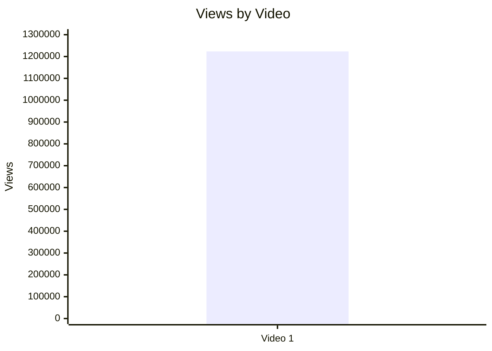

| Video | Views |
|---|---:|
| Video 1 | 1,223,534 |

### 5.2. Views per day by video

- Назва графіка: Views per day by video
- Яке питання він відповідає: як швидко відео набирало перегляди з урахуванням віку?
- Які поля використовуються: `video_label`, `views_per_day`
- Тип графіка: bar chart
- Що видно з графіка: `INSUFFICIENT_DATA`, бо `views_per_day = N/A`.
- Практичний висновок: для майбутніх звітів потрібно мати точний `published_at` або `video_age_days`.

| Video | Views/day | Причина |
|---|---:|---|
| Video 1 | N/A | Exact published date/video age unavailable in comparable summary. |

### 5.3. Views per 1k subscribers

- Назва графіка: Views per 1k subscribers
- Яке питання він відповідає: наскільки відео конвертує розмір каналу в перегляди?
- Які поля використовуються: `video_label`, `views_per_1k_subs`
- Тип графіка: bar chart / Mermaid xychart
- Що видно з графіка: Video 1 має 1,165.27 views per 1k subscribers.
- Практичний висновок: відео набрало більше переглядів, ніж кількість підписників у перерахунку на 1k subs, але без когорти це descriptive insight, не benchmark.

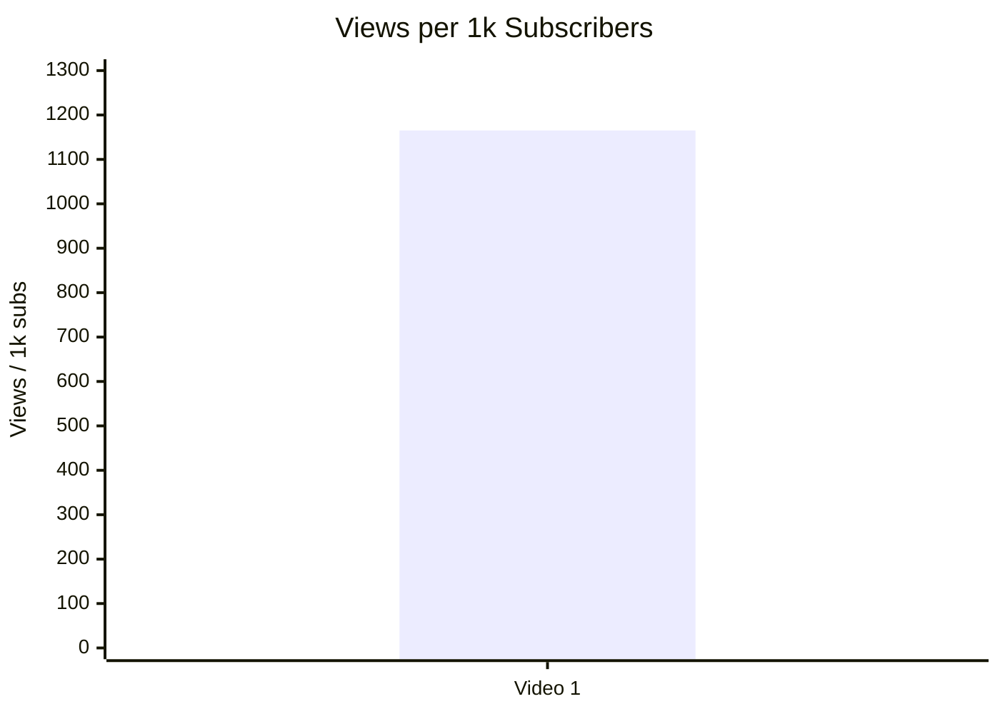

| Video | Views/1k subs |
|---|---:|
| Video 1 | 1,165.27 |

### 5.4. Performance quadrant

- Назва графіка: Performance quadrant
- Яке питання він відповідає: чи має відео баланс охоплення і залучення?
- Які поля використовуються: `views_per_day`, `er_public_percent`
- Тип графіка: scatter plot / quadrant
- Що видно з графіка: `INSUFFICIENT_DATA`, бо `views_per_day = N/A`.
- Практичний висновок: quadrant неможливо побудувати; потрібен `views_per_day`.

| Video | Views/day | ER Public % | Quadrant |
|---|---:|---:|---|
| Video 1 | N/A | 3.42 | INSUFFICIENT_DATA |

## 6. Графіки залучення

### 6.1. ER Public % by video

- Назва графіка: ER Public % by video
- Яке питання він відповідає: який public engagement rate має відео?
- Які поля використовуються: `video_label`, `er_public_percent`
- Тип графіка: bar chart / Mermaid xychart
- Що видно з графіка: Video 1 має ER Public 3.42%.
- Практичний висновок: engagement можна використовувати як baseline для наступних відео того ж формату.

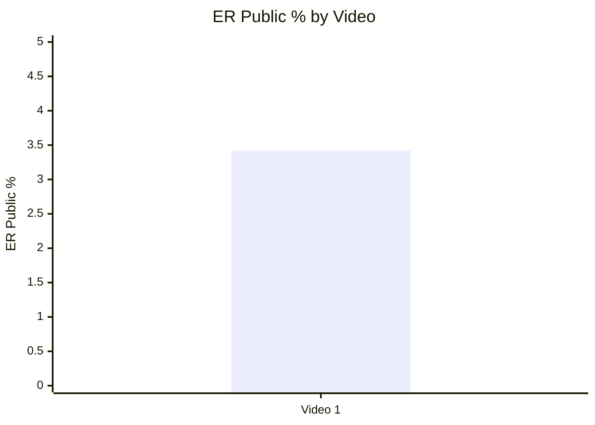

| Video | ER Public % |
|---|---:|
| Video 1 | 3.42 |

### 6.2. Like Rate % vs Comment Rate %

- Назва графіка: Like Rate % vs Comment Rate %
- Яке питання він відповідає: відео більше отримує пасивне схвалення чи дискусію?
- Які поля використовуються: `like_rate_percent`, `comment_rate_percent`
- Тип графіка: scatter plot
- Що видно з графіка: Video 1 має 3.16% like rate і 0.26% comment rate.
- Практичний висновок: на одному відео немає порівняльного висновку; descriptive reading: лайки значно сильніші за коментарі, але коментарний масив достатній для тем і кластерів.

| Video | Like Rate % | Comment Rate % |
|---|---:|---:|
| Video 1 | 3.16 | 0.26 |

### 6.3. Comments per 1k views

- Назва графіка: Comments per 1k views
- Яке питання він відповідає: наскільки відео провокує коментарі відносно переглядів?
- Які поля використовуються: `comments_per_1k_views`
- Тип графіка: bar chart
- Що видно з графіка: Video 1 має 2.56 comments per 1k views.
- Практичний висновок: це baseline для майбутніх technical explainers; висновок про "сильне/слабке" можливий лише після появи когорти.

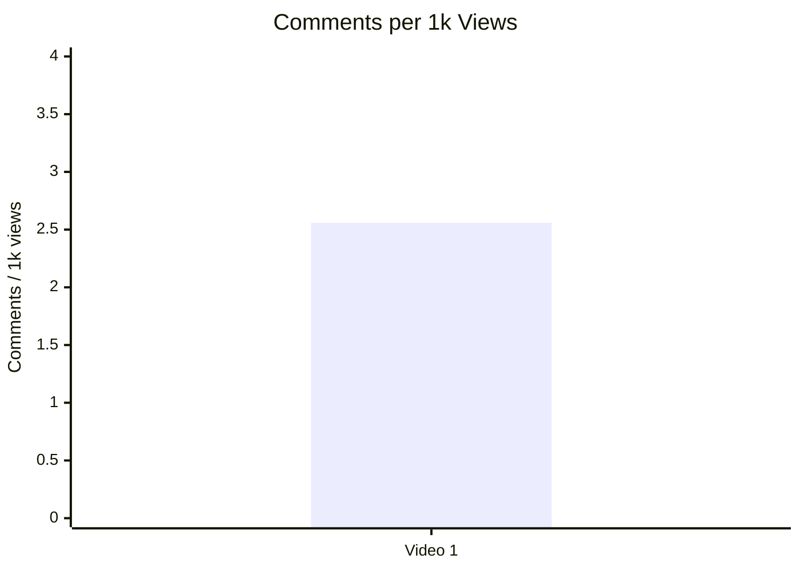

| Video | Comments per 1k views |
|---|---:|
| Video 1 | 2.56 |

## 7. Графіки структури та hook

### 7.1. Hook score by video

- Назва графіка: Hook score by video
- Яке питання він відповідає: наскільки сильний hook?
- Які поля використовуються: `hook_score`
- Тип графіка: bar chart / Mermaid xychart
- Що видно з графіка: Video 1 має hook score 4/5.
- Практичний висновок: hook є однією з сильних сторін, яку варто повторювати.

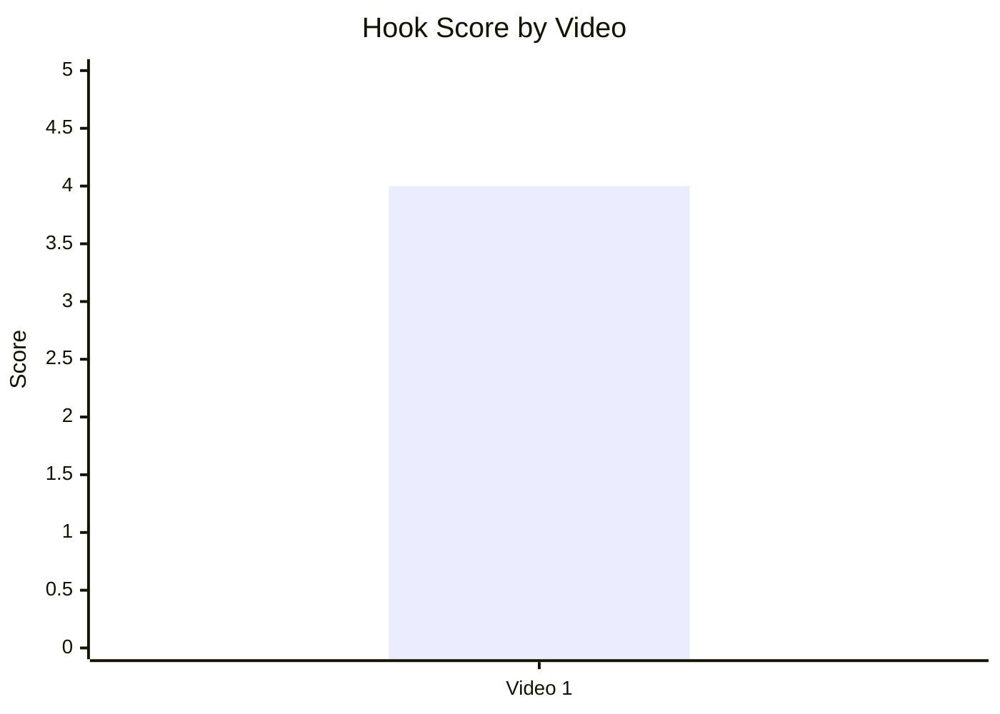

| Video | Hook score |
|---|---:|
| Video 1 | 4 |

### 7.2. Hook type distribution

- Назва графіка: Hook type distribution
- Яке питання він відповідає: який hook type використано?
- Які поля використовуються: `hook_primary_type`
- Тип графіка: pie chart / Mermaid pie
- Що видно з графіка: 100% наявних відео використовує `CURIOSITY_GAP`.
- Практичний висновок: це не distribution у статистичному сенсі, а single-case label; для висновків потрібні 5+ відео.

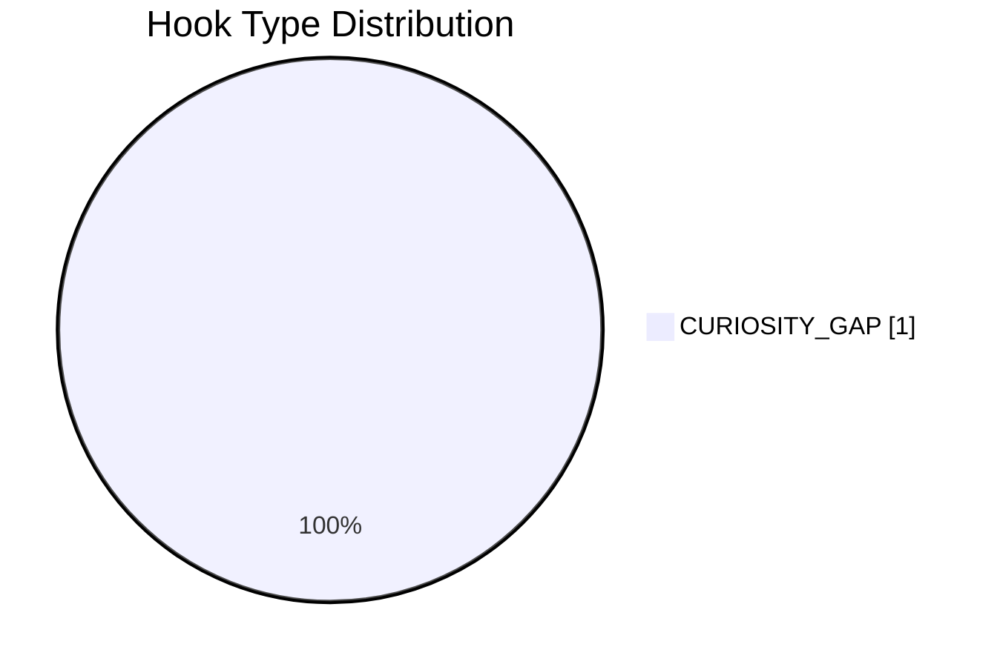

| Hook type | Count |
|---|---:|
| CURIOSITY_GAP | 1 |

### 7.3. Time to first value vs Overall Score

- Назва графіка: Time to first value vs Overall Score
- Яке питання він відповідає: чи швидша перша цінність пов'язана з вищим результатом?
- Які поля використовуються: `time_to_first_value_seconds`, `overall_video_score`
- Тип графіка: scatter plot
- Що видно з графіка: `INSUFFICIENT_DATA`, бо `time_to_first_value = NO_TIMECODES`.
- Практичний висновок: у наступних звітах треба фіксувати seconds, інакше цей графік неможливий.

| Video | Time to first value seconds | Overall score |
|---|---:|---:|
| Video 1 | INSUFFICIENT_DATA | 3.95 |

## 8. Графіки CTA

### 8.1. CTA score by video

- Назва графіка: CTA score by video
- Яке питання він відповідає: наскільки сильна CTA-система відео?
- Які поля використовуються: `cta_score`
- Тип графіка: bar chart / Mermaid xychart
- Що видно з графіка: CTA score = 2/5.
- Практичний висновок: CTA є головним слабким score-блоком.

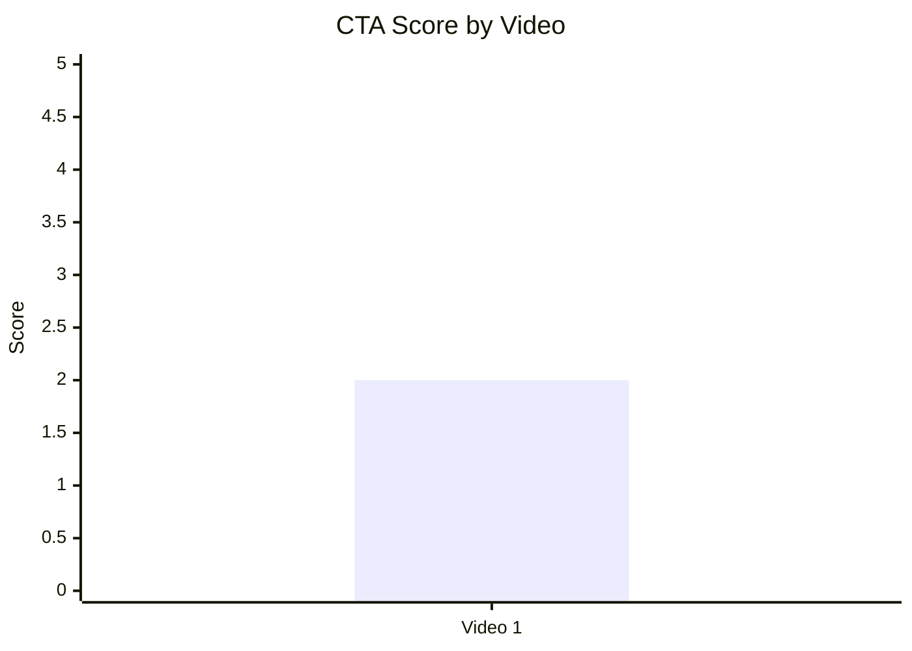

| Video | CTA score |
|---|---:|
| Video 1 | 2 |

### 8.2. CTA count vs ER Public %

- Назва графіка: CTA count vs ER Public %
- Яке питання він відповідає: чи кількість CTA пов'язана із залученням?
- Які поля використовуються: `cta_count`, `er_public_percent`
- Тип графіка: scatter plot
- Що видно з графіка: Video 1 має 5 CTA entries і ER Public 3.42%.
- Практичний висновок: не можна робити висновок про зв'язок на одному відео; також CTA count включає description links, а не тільки in-video CTA.

| Video | CTA count | ER Public % | Confidence |
|---|---:|---:|---|
| Video 1 | 5 | 3.42 | LOW_CONFIDENCE |

### 8.3. CTA features heatmap

- Назва графіка: CTA features heatmap
- Яке питання він відповідає: які CTA-функції присутні або відсутні?
- Які поля використовуються: `has_comment_prompt`, `has_subscribe_cta`, `has_like_cta`, `has_bell_cta`, `has_next_video_bridge`
- Тип графіка: heatmap / matrix
- Що видно з графіка: comment prompt і next-video bridge відсутні; subscribe/like/bell не надані в Comparable Summary JSON і позначені з аналізу як absent.
- Практичний висновок: найшвидший тест — додати comment prompt і next-video bridge.

| Video | Comment prompt | Subscribe | Like | Bell | Next video bridge |
|---|---|---|---|---|---|
| Video 1 | No | No | No | No | No |

## 9. Графіки реклами / інтеграцій

У звіті є `ad_detected = true`, але це description-level promo links; in-video advertising integration не виявлено, а `ad_load_percent = NOT_APPLICABLE`.

### 9.1. Ad load % by video

- Назва графіка: Ad load % by video
- Яке питання він відповідає: який відсоток runtime займає реклама?
- Які поля використовуються: `ad_load_percent`
- Тип графіка: bar chart
- Що видно з графіка: `INSUFFICIENT_DATA / NOT_APPLICABLE`.
- Практичний висновок: description links не створюють runtime ad load; для графіка потрібен timed sponsor segment.

| Video | Ad detected | Ad load % | Comment |
|---|---|---:|---|
| Video 1 | true | NOT_APPLICABLE | Description-level ads only; no timed in-video ad. |

### 9.2. First ad position %

- Назва графіка: First ad position %
- Яке питання він відповідає: чи реклама з'являється занадто рано?
- Які поля використовуються: `first_ad_relative_position_percent`
- Тип графіка: bar chart / scatter plot
- Що видно з графіка: `INSUFFICIENT_DATA / NOT_APPLICABLE`.
- Практичний висновок: in-video ad timing не оцінюється.

| Video | First ad position % |
|---|---:|
| Video 1 | NOT_APPLICABLE |

### 9.3. Ad integration score vs ER Public %

- Назва графіка: Ad integration score vs ER Public %
- Яке питання він відповідає: чи якість інтеграції пов'язана з реакцією аудиторії?
- Які поля використовуються: `ad_integration_score`, `er_public_percent`
- Тип графіка: scatter plot
- Що видно з графіка: Video 1 має ad integration score 4 і ER Public 3.42%.
- Практичний висновок: зв'язок не оцінюється на одному відео; score 4 переважно відображає низький disruption, а не якість sponsor read.

| Video | Ad integration score | ER Public % | Confidence |
|---|---:|---:|---|
| Video 1 | 4 | 3.42 | LOW_CONFIDENCE |

## 10. Графіки аудіо

### 10.1. Audio score by video

- Назва графіка: Audio score by video
- Яке питання він відповідає: яка аудіо-оцінка відео?
- Які поля використовуються: `audio_score`
- Тип графіка: bar chart / Mermaid xychart
- Що видно з графіка: audio score = 3/5.
- Практичний висновок: аудіо не головна сила; оцінка має `PARTIAL_DATA`, тому тестувати варто обережно.

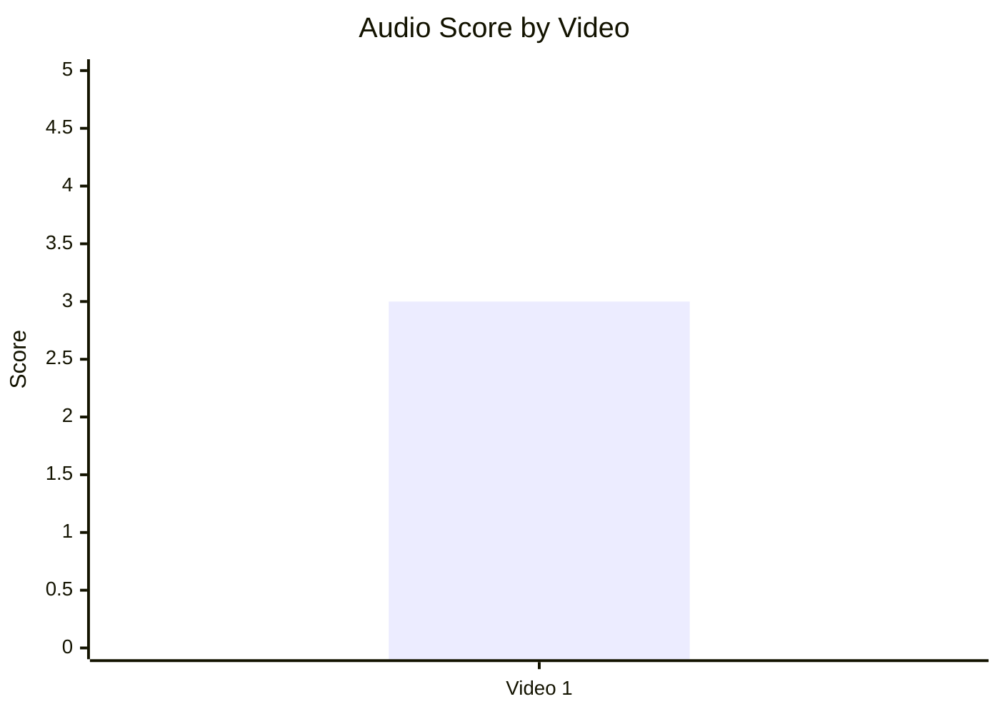

| Video | Audio score | Data quality |
|---|---:|---|
| Video 1 | 3 | PARTIAL_DATA |

### 10.2. Audio score vs Overall Score

- Назва графіка: Audio score vs Overall Score
- Яке питання він відповідає: чи краща якість аудіо пов'язана з вищим overall score?
- Які поля використовуються: `audio_score`, `overall_video_score`
- Тип графіка: scatter plot
- Що видно з графіка: один datapoint: audio 3, overall 3.95.
- Практичний висновок: correlation skipped; потрібні 5+ відео.

| Video | Audio score | Overall score |
|---|---:|---:|
| Video 1 | 3 | 3.95 |

## 11. Графіки коментарів

### 11.1. Sentiment distribution

- Назва графіка: Sentiment distribution
- Яке питання він відповідає: яка структура реакції аудиторії?
- Які поля використовуються: `positive_percent`, `negative_percent`, `mixed_percent`, `neutral_percent`, `question_percent`, `request_percent`
- Тип графіка: stacked bar chart / Mermaid pie as fallback
- Що видно з графіка: найбільша частка — neutral/general discussion 56.88%; questions 15.55%; positive 14.80%; negative 7.24%; requests 4.33%.
- Практичний висновок: коментарі не тільки хвалять відео, а активно розгортають технічну дискусію; це добрий ґрунт для pinned FAQ і sequel.

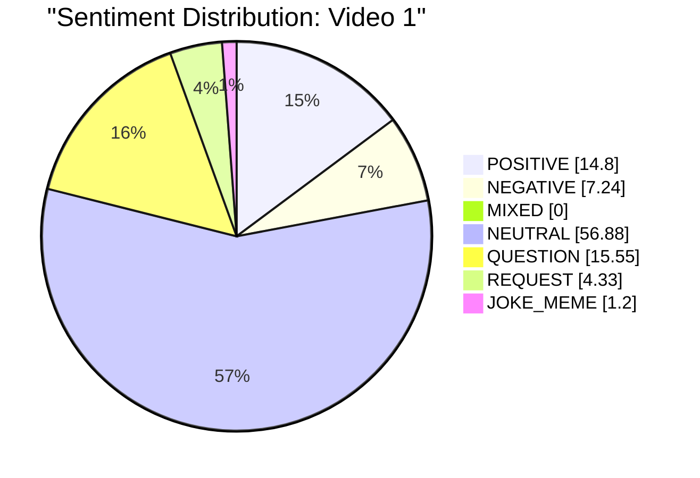

| Sentiment | Percent of relevant comments |
|---|---:|
| POSITIVE | 14.80 |
| NEGATIVE | 7.24 |
| MIXED | 0.00 |
| NEUTRAL | 56.88 |
| QUESTION | 15.55 |
| REQUEST | 4.33 |
| JOKE_MEME | 1.20 |

### 11.2. Comment resonance score by video

- Назва графіка: Comment resonance score by video
- Яке питання він відповідає: наскільки сильна реакція коментарів?
- Які поля використовуються: `comment_resonance_score`
- Тип графіка: bar chart / Mermaid xychart
- Що видно з графіка: comment resonance score = 4/5.
- Практичний висновок: коментарі є сильним активом, який CTA ще не використовує повністю.

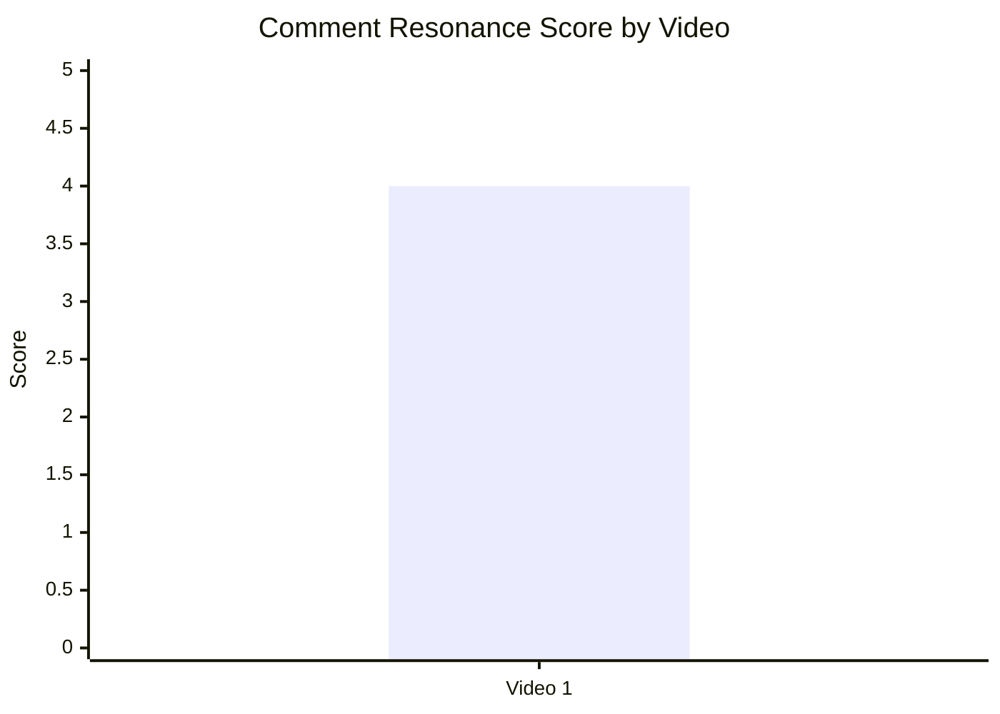

| Video | Comment Resonance |
|---|---:|
| Video 1 | 4 |

### 11.3. Top comment clusters

- Назва графіка: Top comment clusters
- Яке питання він відповідає: які теми найчастіше виникають у коментарях?
- Які поля використовуються: cluster name, percent of relevant comments
- Тип графіка: horizontal bar chart / Mermaid xychart fallback
- Що видно з графіка: largest clusters — general discussion 31.48%, technical discussion 25.40%, technical questions 15.55%, praise 14.80%.
- Практичний висновок: найкращі наступні відео мають відповідати на технічні питання, а не просто повторювати тему.

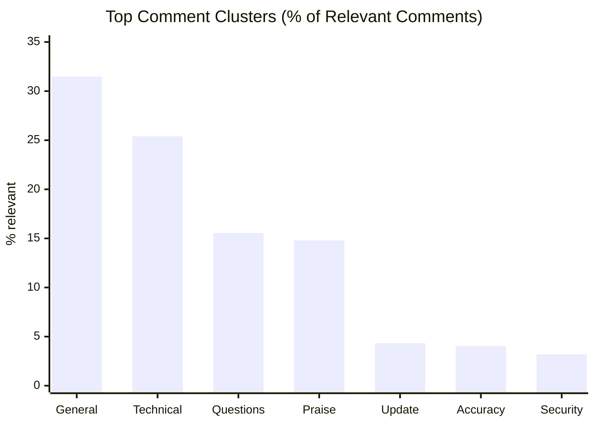

| Cluster | % of relevant comments |
|---|---:|
| General discussion / neutral reactions | 31.48 |
| Technical discussion and extensions | 25.40 |
| Technical clarification questions | 15.55 |
| Praise for clarity/explanation | 14.80 |
| Requests for update/current status | 4.33 |
| Accuracy disagreement / later-war challenge | 4.05 |
| Concern that video helps Russia | 3.19 |

## 12. Графіки score-системи

### 12.1. Overall score by video

- Назва графіка: Overall score by video
- Яке питання він відповідає: який загальний score відео?
- Які поля використовуються: `overall_video_score`
- Тип графіка: bar chart / Mermaid xychart
- Що видно з графіка: Video 1 має overall score 3.95/5.
- Практичний висновок: відео сильне структурно і за hook, але CTA стримує score.

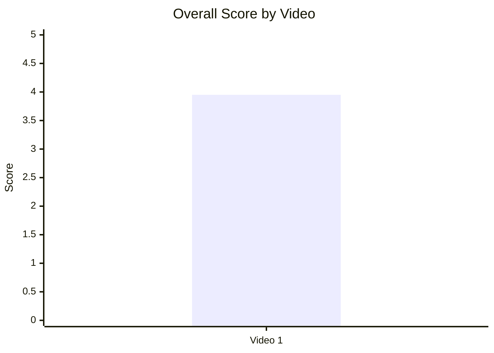

| Video | Overall score |
|---|---:|
| Video 1 | 3.95 |

### 12.2. Score breakdown heatmap

- Назва графіка: Score breakdown heatmap
- Яке питання він відповідає: які score-блоки сильні, а які слабкі?
- Які поля використовуються: `hook_score`, `structure_score`, `value_density_score`, `audio_score`, `cta_score`, `ad_integration_score`, `comment_resonance_score`, `replicability_score`, `overall_video_score`
- Тип графіка: heatmap / matrix
- Що видно з графіка: найсильніші блоки — structure 5, replicability 5; найслабший — CTA 2.
- Практичний висновок: не треба ламати core format; треба додати CTA mechanics поверх уже працюючої структури.

| Video | Hook | Structure | Value Density | Audio | CTA | Ad | Comments | Replicability | Overall |
|---|---:|---:|---:|---:|---:|---:|---:|---:|---:|
| Video 1 | 4 | 5 | 4 | 3 | 2 | 4 | 4 | 5 | 3.95 |

Heatmap legend: `5 = strongest`, `4 = strong`, `3 = acceptable / partial`, `2 = weak`, `1 = critical`.

### 12.3. Strengths vs weaknesses count

- Назва графіка: Strengths vs weaknesses count
- Яке питання він відповідає: скільки success mechanics і missed opportunities виділено?
- Які поля використовуються: count of success mechanics, count of missed opportunities, count of HIGH-priority issues
- Тип графіка: stacked bar chart / table fallback
- Що видно з графіка: 5 success mechanics, 5 missed opportunities, 2 high-priority issues.
- Практичний висновок: потенціал повторення високий, але CTA/bridge треба виправити першими.

| Video | Success mechanics count | Missed opportunities count | HIGH-priority issues |
|---|---:|---:|---:|
| Video 1 | 5 | 5 | 2 |

## 13. Кореляції та патерни

Correlation analysis skipped: fewer than 5 comparable videos.

| Pair | Correlation / Pattern | Strength | Interpretation | Confidence |
|---|---:|---|---|---|
| hook_score -> overall_video_score | INSUFFICIENT_DATA | LOW | 1 datapoint не дозволяє оцінити зв'язок. | LOW |
| value_density_score -> er_public_percent | INSUFFICIENT_DATA | LOW | 1 datapoint не дозволяє оцінити зв'язок. | LOW |
| cta_score -> comment_rate_percent | INSUFFICIENT_DATA | LOW | CTA score низький, comment rate відомий, але причинний зв'язок не оцінюється. | LOW |
| comment_resonance_score -> er_public_percent | INSUFFICIENT_DATA | LOW | 1 datapoint не дозволяє оцінити зв'язок. | LOW |
| views_per_day -> er_public_percent | INSUFFICIENT_DATA | LOW | `views_per_day = N/A`. | LOW |
| ad_load_percent -> er_public_percent | INSUFFICIENT_DATA | LOW | `ad_load_percent = NOT_APPLICABLE`. | LOW |
| time_to_first_value_seconds -> overall_video_score | INSUFFICIENT_DATA | LOW | `time_to_first_value = NO_TIMECODES`. | LOW |

Попередній descriptive pattern, не correlation: сильні scores `structure_score = 5`, `replicability_score = 5`, `hook_score = 4` співіснують із `overall_video_score = 3.95`, тоді як `cta_score = 2` є найочевиднішим improvement lever.

## 14. Висновки для контент-стратегії

| Спостереження | Дані / графік | Що це означає | Що робити |
|---|---|---|---|
| Core format сильний | Score breakdown heatmap: Structure 5, Replicability 5, Hook 4 | Формат operator-view technical explainer варто не замінювати, а масштабувати. | Повторити структуру "простий кейс -> складний кейс -> дилема оператора". |
| CTA є головним слабким блоком | CTA score by video: 2/5; CTA features heatmap: comment prompt/next bridge absent | Відео генерує коментарі органічно, але не керує ними. | Додати конкретний comment prompt і end-screen bridge. |
| Коментарі дають ідеї для sequel | Top clusters: questions 15.55%, technical discussion 25.40%, update requests 4.33% | Аудиторія просить уточнення й оновлення, хоча requests <5%. | Зробити follow-up або pinned FAQ з відповідями на recurring questions. |
| Engagement baseline відомий, але не порівняльний | ER Public 3.42%, Like Rate 3.16%, Comment Rate 0.26% | Це стартова точка для наступної когорти, не доказ "краще/гірше". | Порівнювати наступні `LONG_4_10_MIN` відео з цим baseline. |
| Реклама не шкодить runtime | Ad load = NOT_APPLICABLE; no in-video ad detected | Description-level promo не створює interruption. | Якщо додавати sponsor read, ставити після першого payoff і вимірювати comment/ad complaints. |
| Audio потребує обережного тесту | Audio score 3, `PARTIAL_DATA`; 2 explicit audio complaints | Не критична проблема, але може впливати на non-native глядачів. | Тестувати чіткішу дикцію, subtitles, on-screen labels. |

## 15. Що тестувати далі

| Тест | Гіпотеза | На яких даних базується | Як виміряти | Пріоритет |
|---|---|---|---|---|
| Comment prompt у фіналі | Конкретне питання підсилить already-active discussion. | CTA score 2; comment prompt absent; questions 15.55%; technical discussion 25.40%. | Comment Rate %, comments per 1k views, частка relevant technical replies. | HIGH |
| Next-video bridge | Перехід на суміжний explainer підвищить session depth. | Next video bridge absent; series potential listed; update requests 4.33%. | OWNER_ONLY: end screen CTR, watch next rate; public proxy: comments mentioning next topic. | HIGH |
| Pinned FAQ | FAQ зніме recurring objections і направить дискусію. | Clusters: accuracy challenge 4.05%, concern helping Russia 3.19%, questions 15.55%. | Частка повторних objections після pinned comment; replies to pinned comment. | HIGH |
| Серія "Weapon vs Sensor: operator view" | Core mechanic transferable to other military tech topics. | Success mechanics: CLEAR_HOOK, PRACTICAL_UTILITY, SERIES_POTENTIAL. | Compare future `LONG_4_10_MIN`: ER Public %, views/1k subs, comment clusters. | HIGH |
| Timecoded reports | Якщо додати timecodes, можна будувати time_to_first_value graphs. | Current `NO_TIMECODES`; section 7.3 impossible. | Наявність `time_to_first_value_seconds`, hook_end, payoff_time у наступних reports. | MEDIUM |
| Audio clarity pass | Чіткіший voice/mix може підвищити доступність. | Audio score 3, `PARTIAL_DATA`, 2 audio complaints. | Audio complaints per 1k comments, retention if owner-only available, comment sentiment. | MEDIUM |
| Timed sponsor placement | Якщо додати in-video ad, placement після першого payoff знизить disruption. | Current in-video ad absent, ad load NOT_APPLICABLE, ad score 4 mostly through low disruption. | Ad load %, first ad position %, CRITICISM_ADS cluster. | MEDIUM |

## 16. Дані для експорту в таблицю / CSV

| video_label | title | format_group | views | views_per_day | like_rate_percent | comment_rate_percent | er_public_percent | views_per_1k_subs | hook_type | hook_score | cta_count | cta_score | ad_load_percent | ad_integration_score | audio_score | comment_resonance_score | overall_video_score | top_success_mechanic | top_missed_opportunity |
|---|---|---|---:|---:|---:|---:|---:|---:|---|---:|---:|---:|---:|---:|---:|---:|---:|---|---|
| Video 1 | HIMARS on Russian Radar - how does it get through? | LONG_4_10_MIN | 1223534 | N/A | 3.16 | 0.26 | 3.42 | 1165.27 | CURIOSITY_GAP | 4 | 5 | 2 | NOT_APPLICABLE | 4 | 3 | 4 | 3.95 | CLEAR_HOOK | NO_COMMENT_PROMPT |

CSV-ready:

```csv
video_label,title,format_group,views,views_per_day,like_rate_percent,comment_rate_percent,er_public_percent,views_per_1k_subs,hook_type,hook_score,cta_count,cta_score,ad_load_percent,ad_integration_score,audio_score,comment_resonance_score,overall_video_score,top_success_mechanic,top_missed_opportunity
Video 1,HIMARS on Russian Radar - how does it get through?,LONG_4_10_MIN,1223534,N/A,3.16,0.26,3.42,1165.27,CURIOSITY_GAP,4,5,2,NOT_APPLICABLE,4,3,4,3.95,CLEAR_HOOK,NO_COMMENT_PROMPT
```