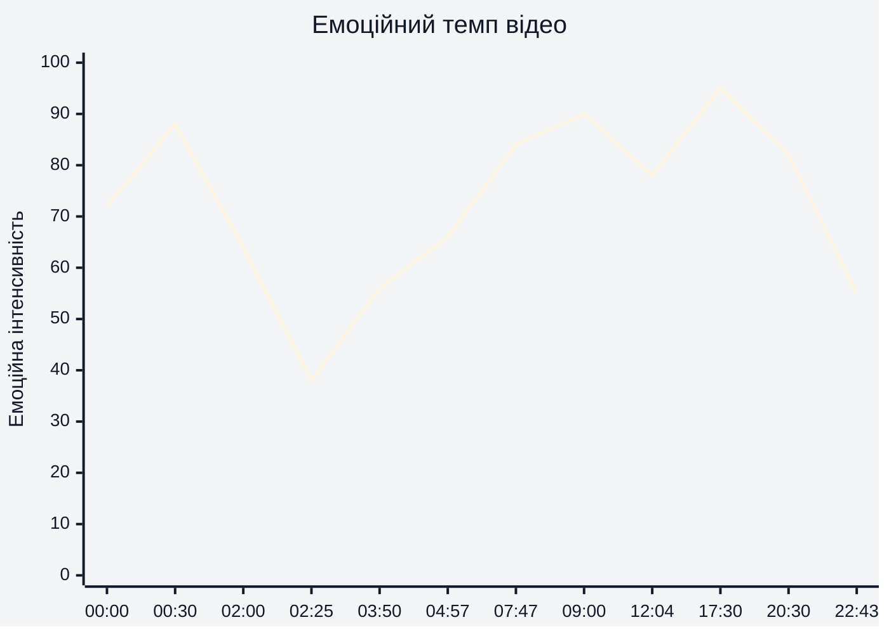
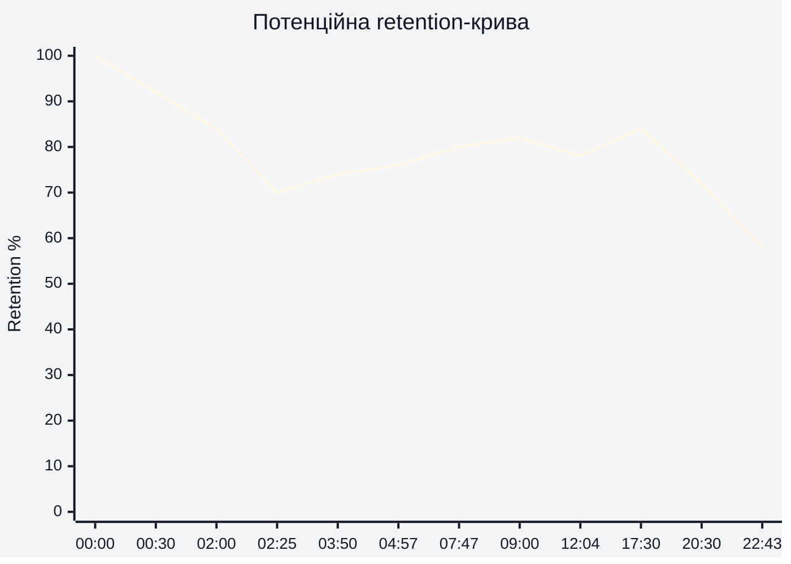
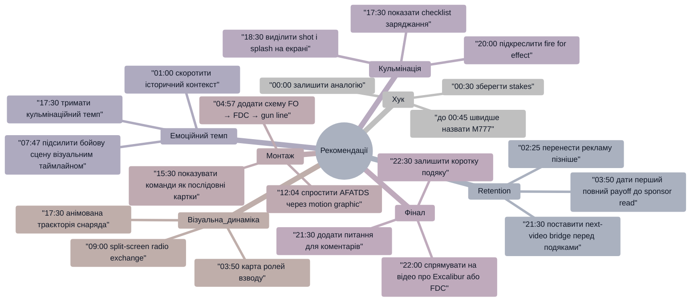

# Аналіз довгоформатного YouTube-відео

## 1. Сюжетна дуга (Narrative Arc)

```mermaid
%%{init: {'theme':'base', 'themeVariables': {
'primaryColor':'#f3f4f6',
'primaryTextColor':'#111827',
'primaryBorderColor':'#2563eb',
'lineColor':'#2563eb',
'secondaryColor':'#ffffff',
'tertiaryColor':'#f3f4f6',
'background':'#f3f4f6'
}}}%%
flowchart LR
    A["00:00<br/>Хук<br/>Мінігольф із зав'язаними очима: одна помилка може коштувати життя іншій людині"]
    B["00:45<br/>Експозиція<br/>Пояснення, що артилерія стріляє поза прямою видимістю"]
    C["02:00<br/>Перша ескалація<br/>Питання: що реально відбувається, коли викликають артилерію"]
    D["02:25<br/>Переломний момент<br/>Рекламна пауза Atlas VPN перед головним поясненням"]
    E["03:50<br/>Наростання напруги<br/>Розбір структури артилерійського взводу, екіпажу, FDC і ролей"]
    F["07:47<br/>Кульмінація<br/>Сценарій Афганістану: піхота під вогнем, forward observer викликає fire mission"]
    G["12:04<br/>Розв'язка<br/>FDC рахує рішення, гармата заряджається, постріл, splash, корекція, fire for effect"]
    H["21:30<br/>Фінальний висновок<br/>Artillery conquers and infantry occupies; подяка консультантам і глядачу"]
    A --> B --> C --> D --> E --> F --> G --> H
```

Сюжетна дуга побудована як перехід від простої аналогії до повного operational walkthrough. Найсильніша частина дуги починається приблизно з `07:47`, коли технічне пояснення перетворюється на бойову історію з конкретною послідовністю дій.

## 2. Ключові Story Beats

```mermaid
%%{init: {'theme':'base', 'themeVariables': {
'primaryColor':'#f3f4f6',
'primaryTextColor':'#111827',
'primaryBorderColor':'#2563eb',
'lineColor':'#2563eb',
'secondaryColor':'#ffffff',
'tertiaryColor':'#f3f4f6',
'background':'#f3f4f6'
}}}%%
flowchart LR
    B1["00:00<br/>Сліпий мінігольф<br/>Функція: миттєво пояснити складність непрямого вогню"]
    B2["00:30<br/>Смертельна ставка<br/>Функція: підняти емоційну напругу"]
    B3["01:00<br/>Історія артилерії<br/>Функція: дати контекст розвитку"]
    B4["02:00<br/>Головне питання<br/>Функція: сформувати обіцянку відео"]
    B5["02:25<br/>Atlas VPN<br/>Функція: монетизація, але з ризиком раннього спаду"]
    B6["03:50<br/>Схема взводу<br/>Функція: показати систему ролей"]
    B7["04:20<br/>Екіпаж гармати<br/>Функція: пояснити, хто за що відповідає"]
    B8["04:57<br/>FDC і математика<br/>Функція: показати мозок операції"]
    B9["07:47<br/>Контакт в Афганістані<br/>Функція: перевести лекцію в історію"]
    B10["09:00<br/>Call for fire<br/>Функція: показати реальний протокол"]
    B11["12:04<br/>FDC і firing solution<br/>Функція: пояснити розрахунок пострілу"]
    B12["17:30<br/>Постріл, splash, fire for effect<br/>Функція: дати головний payoff"]
    B1 --> B2 --> B3 --> B4 --> B5 --> B6 --> B7 --> B8 --> B9 --> B10 --> B11 --> B12
```

Ключовий narrative beat — `07:47`, бо саме там відео перестає бути лише поясненням і стає сценою з конфліктом: підрозділ під вогнем, є forward observer, потрібне швидке рішення.

## 3. Емоційний темп

Емоційна інтенсивність найвища на `00:30`, коли хук додає смертельні наслідки, і на `17:30`, коли пояснення доходить до пострілу, splash, корекції та fire for effect. Найбільший спад очікуваний біля `02:25`, бо рекламна інтеграція перериває перехід від питання до відповіді.

## 4. Утримання аудиторії

Реальні retention-дані не надані. Нижче — потенційна retention-структура, побудована на основі структури відео, розміщення реклами, щільності цінності та сюжетних payoff.

Потенційна крива передбачає сильний старт на `00:00–00:30`, спад на рекламному блоці біля `02:25`, часткове відновлення з `03:50`, новий підйом у сценарії з `07:47`, і природний спад після головного payoff приблизно після `20:30`.

## 5. Піки retention

| Таймкод | Подія | Чому це може утримувати увагу | Сила піку 1–10 |
|---|---|---|---:|
| 00:00 | Аналогія з мінігольфом із зав'язаними очима | Простий образ швидко пояснює складність теми без технічного жаргону | 8 |
| 00:30 | Ставка: помилка означає смерть іншої людини | Різко піднімає напругу і створює емоційний контраст | 9 |
| 02:00 | Питання: як реально працює виклик артилерії | Формує чітку обіцянку відео і відкриває curiosity gap | 7 |
| 03:50 | Початок розбору towed artillery platoon | Глядач отримує структурну карту: guns, platoon, vehicles, crew | 7 |
| 04:57 | FDC як “мозок операції” | Пояснення переходить від ролей до математики і координації | 8 |
| 07:47 | Афганістан 2010, піхота під вогнем | З'являється конкретна бойова ситуація, конфлікт і urgency | 9 |
| 09:00 | Радіообмін forward observer і FDC | Процес стає сценічним: глядач чує послідовність команд | 8 |
| 12:04 | Пояснення FDC і firing solution | Авторитетний блок із Captain Preston Stewart додає credibility | 8 |
| 17:30 | Заряджання, постріл, shot, splash, correction | Головний payoff: усі попередні ролі сходяться в дію | 10 |
| 20:30 | Fire for effect і завершення місії | Дає відчуття завершеності та результату всієї процедури | 8 |

## 6. Провали retention

| Таймкод | Проблема | Ймовірна причина спаду | Що покращити |
|---|---|---|---|
| 01:00–02:00 | Історичний контекст може сповільнювати темп після сильного hook | Після високої ставки на `00:30` глядач може чекати швидшого переходу до M777 | Скоротити історичний контекст або дати мікро-payoff перед ним |
| 02:25 | Реклама Atlas VPN перед основним value block | Sponsor read стоїть до повної відповіді на питання “how does it work?” | Перенести рекламу після `03:50` або після першого завершеного value block |
| 04:57–07:47 | Висока щільність термінів | FDC, fuses, collimator, charts and darts, charges можуть перевантажити частину аудиторії | Додати короткі on-screen labels або 3-секундні recap cards |
| 12:04–15:30 | Глибокий технічний блок FDC | Частина глядачів може втратити нитку через AFATDS, firing solution і бази даних | Вставити просту схему “FO → FDC → gun line” перед деталями |
| 21:30–22:43 | Фінальні подяки після головного payoff | Після завершення місії мотивація дослухати падає | Додати next-video bridge або конкретний comment prompt перед подяками |

## 7. Оцінка сегментів

| Сегмент | Таймкод | Функція | Емоційна інтенсивність | Ризик втрати уваги | Оцінка 1–10 | Що покращити |
|---|---|---|---:|---|---:|---|
| Хук | 00:00–00:45 | Привернути увагу через аналогію та stakes | 88 | Низький | 9 | Залишити структуру, можна швидше назвати M777 у першій хвилині |
| Історичний контекст | 00:45–02:00 | Пояснити розвиток артилерії до beyond visual range | 64 | Середній | 7 | Скоротити або розбити на швидші візуальні beat-и |
| Головне питання | 02:00–02:25 | Сформувати обіцянку відео | 70 | Низький | 8 | Після питання одразу дати короткий preview майбутнього процесу |
| Реклама | 02:25–03:40 | Sponsor integration | 38 | Високий | 5 | Перенести після першої цінності або зробити коротший read |
| Система взводу | 03:50–04:57 | Показати структуру ролей і техніки | 62 | Середній | 8 | Додати просту графічну карту екіпажу |
| FDC і підготовка | 04:57–07:47 | Пояснити “мозок” артилерійської операції | 70 | Середній | 8 | Дати міні-підсумок після fuse/charge пояснень |
| Бойовий сценарій | 07:47–12:04 | Перетворити пояснення на історію з конфліктом | 90 | Низький | 9 | Можна підсилити візуальним таймлайном call for fire |
| Експертний блок FDC | 12:04–15:30 | Додати авторитет і деталізацію розрахунку | 78 | Середній | 8 | Візуально спростити AFATDS/firing solution |
| Gun line commands | 15:30–17:30 | Розшифрувати команди до гармати | 82 | Середній | 9 | Показати команду як checklist на екрані |
| Постріл і корекція | 17:30–20:30 | Головний payoff: shot, splash, correction, fire for effect | 95 | Низький | 10 | Залишити як кульмінаційний блок |
| Фінал | 20:30–22:43 | Завершити місію, дати висновок і подяки | 55 | Середній | 7 | Додати comment prompt і bridge на наступне відео |

## 8. Практичні рекомендації

## 9. Підсумкова оцінка

| Показник | Оцінка 1–10 | Коментар |
|---|---:|---|
| Сюжетна дуга | 8 | Відео має сильний шлях від `00:00` аналогії до `17:30–20:30` практичного payoff, але реклама на `02:25` створює ранній розрив дуги. |
| Story Beats | 9 | Ключові точки чіткі: hook `00:00`, питання `02:00`, система `03:50`, сценарій `07:47`, FDC `12:04`, кульмінація `17:30`. |
| Емоційний темп | 8 | Темп добре росте після `07:47`, але просідає на `02:25` і частково в технічних блоках `04:57–07:47` та `12:04–15:30`. |
| Retention Structure | 7 | Потенційно сильна retention-структура через payoff-и, але без реальних retention-даних це прогноз; найбільший ризик — рання реклама `02:25`. |
| Загальна оцінка | 8 | Сильне довгоформатне пояснювальне відео з високою цінністю, чіткою кульмінацією і тактичними можливостями покращення CTA, реклами та фіналу. |
