# Статистичний аналіз відеозвітів

## 1. Короткий executive summary

| Пункт | Висновок |
|---|---|
| Скільки відео проаналізовано | 1 |
| Скільки форматів відео | 1: `LONG_20_PLUS_MIN` |
| Найсильніше відео за overall score | Video 1 — How the M777 Howitzer Works, overall score 4.20 |
| Найсильніше відео за ER Public % | Video 1 — 5.87% |
| Найсильніше відео за views per day | Video 1 — 694.31 |
| Найсильніша повторювана механіка | `INSUFFICIENT_DATA`: повторюваність неможливо визначити з 1 відео; у цьому відео top mechanics: `CLEAR_HOOK`, `HIGH_VALUE_DENSITY`, `COMMUNITY_IDENTIFICATION` |
| Найчастіша слабкість | `INSUFFICIENT_DATA`: частотність неможливо визначити з 1 відео; у цьому відео top missed opportunity: `AD_TOO_EARLY` |
| Головна стратегічна можливість | Масштабувати формат “сильна аналогія + системна карта + детальний operational walkthrough”, але тестувати sponsor timing, pinned comment і next-video bridge |
| Рівень впевненості | LOW: 1 відео, `PARTIAL_DATA`, `NO_TIMECODES`, `PARTIAL_DATA_AUDIO_ANALYSIS`, `CONFLICTING_ANALYTICS_FILE` |

## 2. Якість і повнота даних

| Поле | Кількість відео з даними | Кількість N/A | Коментар |
|---|---:|---:|---|
| views | 1 | 0 | 990,085 |
| likes | 1 | 0 | 54,495 |
| comments_count | 1 | 0 | 3,648 |
| views_per_day | 1 | 0 | 694.31 |
| er_public_percent | 1 | 0 | 5.87% |
| views_per_1k_subs | 1 | 0 | 943.0 |
| hook_score | 1 | 0 | 5 |
| cta_score | 1 | 0 | 3 |
| ad_integration_score | 1 | 0 | 3 |
| audio_score | 0 | 1 | `AUDIO_NOT_PROVIDED` у score-блоці, бо технічний audio analysis не був доступний |
| comment_resonance_score | 1 | 0 | 5 |
| overall_video_score | 1 | 0 | 4.20 |

### Обмеження аналізу

- `LOW_CONFIDENCE`: є тільки 1 відео, тому дозволена лише описова статистика без кореляцій і без тверджень про повторювані патерни.
- Усі графіки є single-video snapshots, а не порівняльною статистикою когорти.
- `time_to_first_value`, `first_ad_time`, `ad_load_percent`, `first_ad_relative_position_percent` мають `PARTIAL_DATA` / `NO_TIMECODES`, тому графіки для цих полів неможливо побудувати коректно.
- `audio_score` не числовий (`AUDIO_NOT_PROVIDED`), тому аудіо-графіки пропущені.
- Не змішуються формати: є лише `LONG_20_PLUS_MIN`.

## 3. Підготовлена таблиця для графіків

| Video | Format | Views | Likes | Comments | Views/day | Like Rate % | Comment Rate % | ER Public % | Views/1k subs | Hook | CTA | Ad | Audio | Comment Resonance | Overall |
|---|---|---:|---:|---:|---:|---:|---:|---:|---:|---:|---:|---:|---:|---:|---:|
| Video 1 | LONG_20_PLUS_MIN | 990,085 | 54,495 | 3,648 | 694.31 | 5.50 | 0.37 | 5.87 | 943.0 | 5 | 3 | 3 | 1 | 5 | 4.20 |

| Label | Full title | URL |
|---|---|---|
| Video 1 | How the M777 Howitzer Works | https://www.youtube.com/watch?v=Kux_4KGuj1w |

## 4. Рекомендовані графіки

| # | Назва графіка | Тип графіка | Поля | Для чого потрібен | Пріоритет |
|---:|---|---|---|---|---|
| 1 | Overall score by video | Mermaid bar chart | overall_video_score | Побачити загальний score відео | HIGH |
| 2 | Views per day by video | Mermaid bar chart | views_per_day | Оцінити normalized performance з урахуванням віку | HIGH |
| 3 | ER Public % by video | Mermaid bar chart | er_public_percent | Оцінити normalized engagement | HIGH |
| 4 | Score breakdown heatmap | Markdown heatmap table | hook_score, structure_score, value_density_score, cta_score, ad_integration_score, comment_resonance_score, replicability_score, overall_video_score | Побачити сильні/слабкі блоки | HIGH |
| 5 | CTA features heatmap | Markdown matrix | has_comment_prompt, has_subscribe_cta, has_like_cta, has_bell_cta, has_next_video_bridge | Побачити відсутні CTA-елементи | HIGH |
| 6 | Sentiment distribution | Mermaid pie chart + table | positive_percent, negative_percent, mixed_percent, neutral_percent, question_percent, request_percent | Зрозуміти структуру реакції аудиторії | HIGH |
| 7 | Top comment clusters | Mermaid bar chart | cluster_name, percent | Побачити головні теми коментарів | HIGH |
| 8 | Ad load % by video | Table only | ad_load_percent | Оцінити рекламне навантаження | HIGH, але `INSUFFICIENT_DATA` |
| 9 | Performance quadrant | Table only | views_per_day, er_public_percent | Баланс охоплення і залучення | MEDIUM, але `INSUFFICIENT_DATA` для квадрантів без когорти |
| 10 | Audio score by video | Skipped | audio_score | Оцінити аудіо | LOW, `INSUFFICIENT_DATA` |

## 5. Графіки продуктивності

### 5.1. Views by video

- Назва графіка: Views by video
- Яке питання він відповідає: який raw reach має відео?
- Які поля використовуються: `video_label`, `views`
- Тип графіка: Mermaid bar chart
- Що видно з графіка: Video 1 має 990,085 переглядів
- Практичний висновок: raw reach високий у абсолютному значенні, але без інших відео і benchmark не можна визначити outlier або когорту

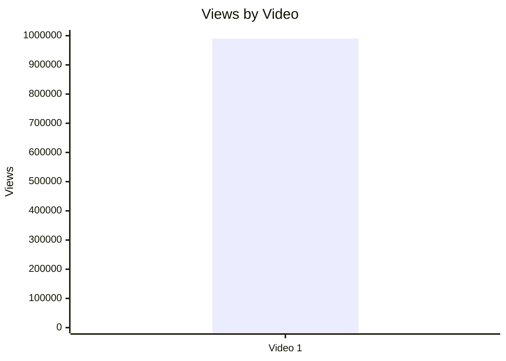

### 5.2. Views per day by video

- Назва графіка: Views per day by video
- Яке питання він відповідає: яка normalized швидкість переглядів із урахуванням віку?
- Які поля використовуються: `video_label`, `views_per_day`
- Тип графіка: Mermaid bar chart
- Що видно з графіка: Video 1 має 694.31 views/day
- Практичний висновок: це usable normalized metric для майбутнього порівняння з іншими `LONG_20_PLUS_MIN` відео

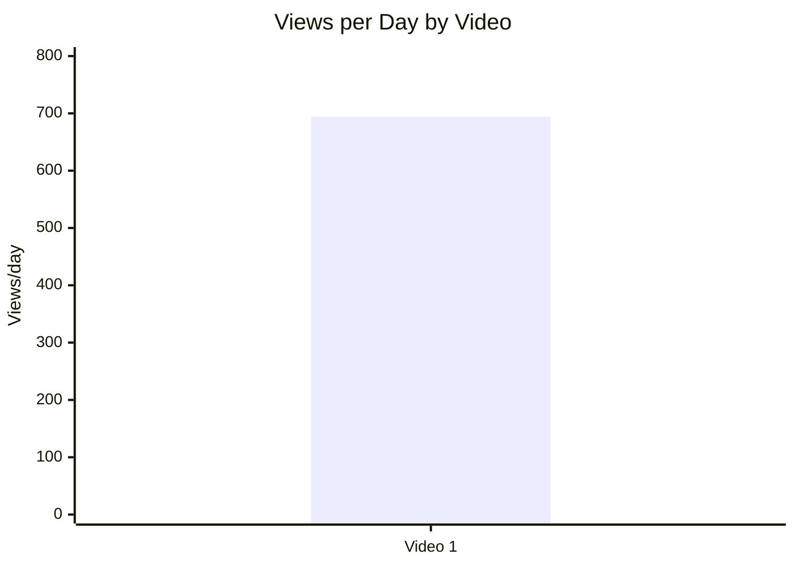

### 5.3. Views per 1k subscribers

- Назва графіка: Views per 1k subscribers
- Яке питання він відповідає: скільки переглядів відео отримало відносно розміру каналу?
- Які поля використовуються: `video_label`, `views_per_1k_subs`
- Тип графіка: Mermaid bar chart
- Що видно з графіка: Video 1 має 943.0 views per 1k subs
- Практичний висновок: значення готове для порівняння з майбутніми відео; зараз рейтинг неможливий

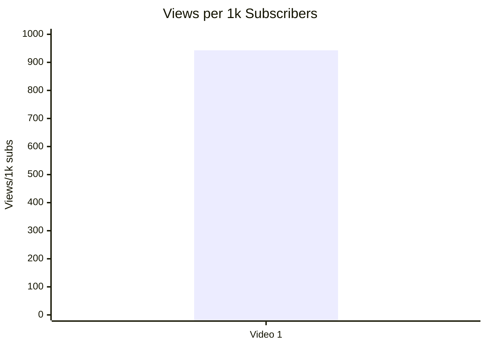

### 5.4. Performance quadrant

- Назва графіка: Performance quadrant
- Яке питання він відповідає: чи відео має баланс reach і engagement?
- Які поля використовуються: `views_per_day`, `er_public_percent`
- Тип графіка: scatter / quadrant chart
- Що видно з графіка: `INSUFFICIENT_DATA` для квадрантів, бо є тільки 1 відео і немає медіан/порогів когорти
- Практичний висновок: зберегти точку Video 1 як baseline для майбутніх `LONG_20_PLUS_MIN` відео

| Video | Views/day | ER Public % | Quadrant |
|---|---:|---:|---|
| Video 1 | 694.31 | 5.87 | `INSUFFICIENT_DATA`: потрібна когорта для high/low threshold |

## 6. Графіки залучення

### 6.1. ER Public % by video

- Назва графіка: ER Public % by video
- Яке питання він відповідає: який рівень публічного engagement?
- Які поля використовуються: `video_label`, `er_public_percent`
- Тип графіка: Mermaid bar chart
- Що видно з графіка: Video 1 має ER Public 5.87%
- Практичний висновок: показник варто використовувати як baseline для наступних відео цього формату

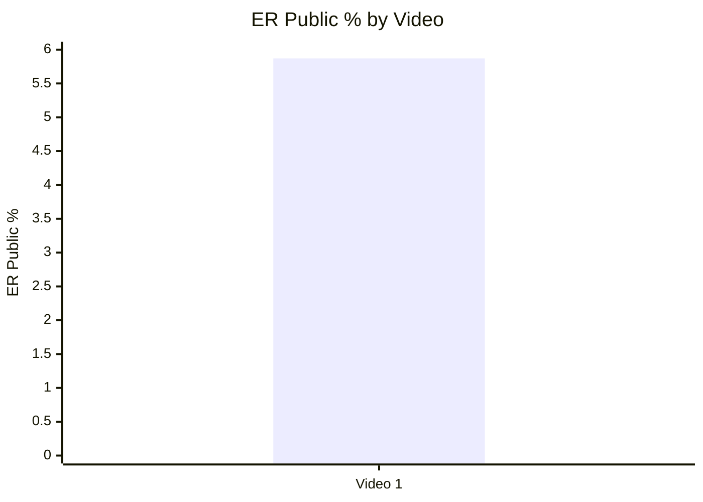

### 6.2. Like Rate % vs Comment Rate %

- Назва графіка: Like Rate % vs Comment Rate %
- Яке питання він відповідає: чи залучення більше через лайки чи коментарі?
- Які поля використовуються: `like_rate_percent`, `comment_rate_percent`
- Тип графіка: scatter plot
- Що видно з графіка: одна точка: like rate 5.50%, comment rate 0.37%
- Практичний висновок: відео має значно сильніший like signal, ніж comment signal; без когорти не можна класифікувати як high/low

| Video | Like Rate % | Comment Rate % | Interpretation |
|---|---:|---:|---|
| Video 1 | 5.50 | 0.37 | Одне відео; scatter неможливо інтерпретувати як патерн |

### 6.3. Comments per 1k views

- Назва графіка: Comments per 1k views
- Яке питання він відповідає: наскільки відео провокує коментарі відносно переглядів?
- Які поля використовуються: `video_label`, `comments_per_1k_views`
- Тип графіка: Mermaid bar chart
- Що видно з графіка: Video 1 має 3.68 comments per 1k views
- Практичний висновок: metric готова для порівняння з майбутніми відео; зараз рейтинг неможливий

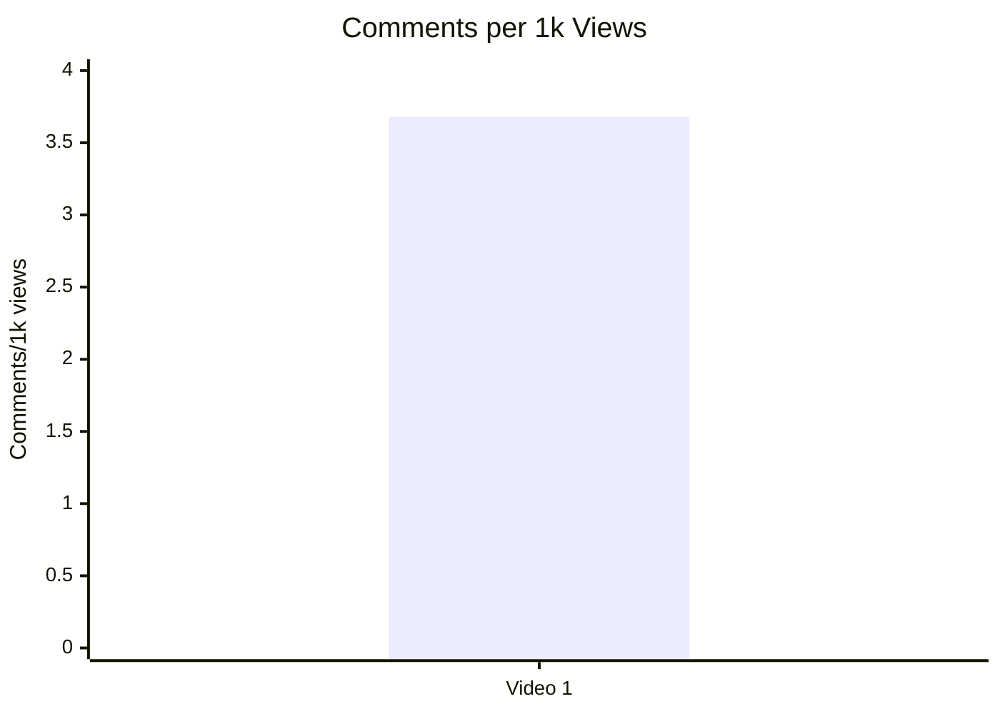

## 7. Графіки структури та hook

### 7.1. Hook score by video

- Назва графіка: Hook score by video
- Яке питання він відповідає: наскільки сильний hook?
- Які поля використовуються: `video_label`, `hook_score`
- Тип графіка: Mermaid bar chart
- Що видно з графіка: Video 1 має hook_score 5
- Практичний висновок: hook є сильною стороною цього відео; повторюваність потребує більше відео

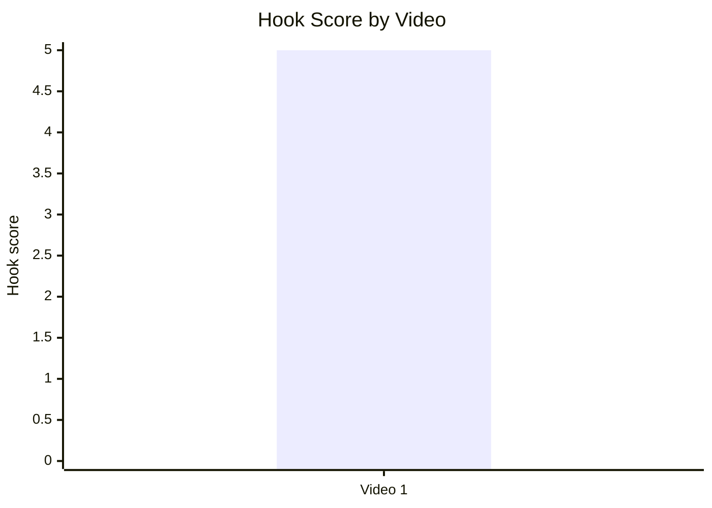

### 7.2. Hook type distribution

- Назва графіка: Hook type distribution
- Яке питання він відповідає: який primary hook type використано?
- Які поля використовуються: `hook_primary_type`, count
- Тип графіка: Mermaid pie chart
- Що видно з графіка: є один hook type — `CURIOSITY_GAP`
- Практичний висновок: цей тип треба порівняти з іншими відео перед висновком, що він працює краще

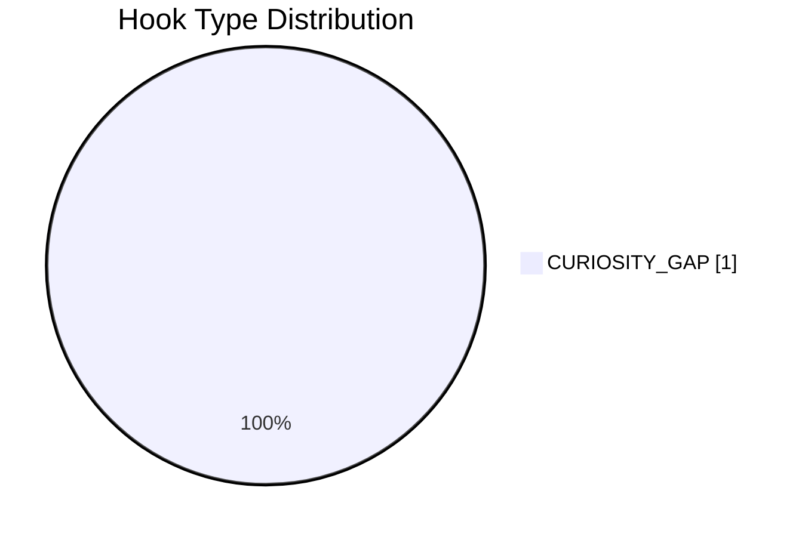

### 7.3. Time to first value vs Overall Score

- Назва графіка: Time to first value vs Overall Score
- Яке питання він відповідає: чи швидша перша цінність пов’язана з вищим score?
- Які поля використовуються: `time_to_first_value_seconds`, `overall_video_score`
- Тип графіка: scatter plot
- Що видно з графіка: `INSUFFICIENT_DATA`, бо `time_to_first_value` = `PARTIAL_DATA`, а не seconds
- Практичний висновок: у наступних аналізах потрібно фіксувати `time_to_first_value_seconds`

| Video | time_to_first_value | time_to_first_value_seconds | Overall |
|---|---|---:|---:|
| Video 1 | PARTIAL_DATA | N/A | 4.20 |

## 8. Графіки CTA

### 8.1. CTA score by video

- Назва графіка: CTA score by video
- Яке питання він відповідає: наскільки сильний CTA-блок?
- Які поля використовуються: `video_label`, `cta_score`
- Тип графіка: Mermaid bar chart
- Що видно з графіка: Video 1 має CTA score 3
- Практичний висновок: CTA є середнім блоком; головні прогалини — no comment prompt, no next-video bridge, no subscribe/like/bell CTA

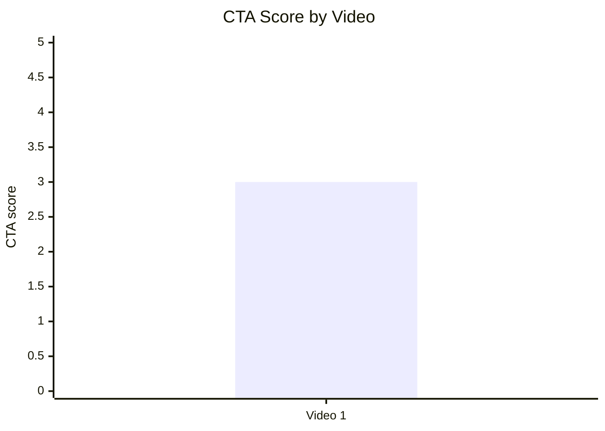

### 8.2. CTA count vs ER Public %

- Назва графіка: CTA count vs ER Public %
- Яке питання він відповідає: чи кількість CTA пов’язана з engagement?
- Які поля використовуються: `cta_count`, `er_public_percent`
- Тип графіка: scatter plot
- Що видно з графіка: одна точка: cta_count 4, ER 5.87%
- Практичний висновок: `INSUFFICIENT_DATA` для зв’язку; можна лише зафіксувати baseline

| Video | CTA count | ER Public % | Interpretation |
|---|---:|---:|---|
| Video 1 | 4 | 5.87 | Немає порівняльної вибірки; CTA overload не доведений |

### 8.3. CTA features heatmap

- Назва графіка: CTA features heatmap
- Яке питання він відповідає: які CTA-функції присутні або відсутні?
- Які поля використовуються: `has_comment_prompt`, `has_subscribe_cta`, `has_like_cta`, `has_bell_cta`, `has_next_video_bridge`
- Тип графіка: heatmap / matrix
- Що видно з графіка: ключові engagement/session CTA відсутні або не зафіксовані у Comparable Summary JSON
- Практичний висновок: наступний тест — comment prompt + next-video bridge

| Video | Comment prompt | Subscribe | Like | Bell | Next video bridge |
|---|---|---|---|---|---|
| Video 1 | No | N/A | N/A | N/A | No |

## 9. Графіки реклами / інтеграцій

Advertising graphs included because `ad_detected = true`, but several ad timing/load fields are `PARTIAL_DATA`.

### 9.1. Ad load % by video

- Назва графіка: Ad load % by video
- Яке питання він відповідає: яке рекламне навантаження має відео?
- Які поля використовуються: `video_label`, `ad_load_percent`
- Тип графіка: bar chart
- Що видно з графіка: `INSUFFICIENT_DATA`, бо `ad_load_percent = PARTIAL_DATA`
- Практичний висновок: для майбутніх звітів потрібні точні ad start/end timestamps

| Video | ad_detected | ad_count | ad_load_percent |
|---|---|---:|---|
| Video 1 | true | 2 | PARTIAL_DATA |

### 9.2. First ad position %

- Назва графіка: First ad position %
- Яке питання він відповідає: наскільки рано стоїть перша реклама?
- Які поля використовуються: `first_ad_relative_position_percent`
- Тип графіка: bar chart або scatter plot
- Що видно з графіка: `INSUFFICIENT_DATA`, бо `first_ad_time = NO_TIMECODES`, `first_ad_relative_position_percent = PARTIAL_DATA`
- Практичний висновок: analysis report якісно визначив `AD_TOO_EARLY`, але статистичний графік неможливий без точного часу

| Video | first_ad_time | first_ad_relative_position_percent | Qualitative issue |
|---|---|---|---|
| Video 1 | NO_TIMECODES | PARTIAL_DATA | AD_TOO_EARLY |

### 9.3. Ad integration score vs ER Public %

- Назва графіка: Ad integration score vs ER Public %
- Яке питання він відповідає: чи якість інтеграції пов’язана з engagement?
- Які поля використовуються: `ad_integration_score`, `er_public_percent`
- Тип графіка: scatter plot
- Що видно з графіка: одна точка: ad score 3, ER 5.87%
- Практичний висновок: зв’язок не можна визначити; поле готове для майбутньої когорти

| Video | Ad integration score | ER Public % |
|---|---:|---:|
| Video 1 | 3 | 5.87 |

## 10. Графіки аудіо

Audio graphs skipped: `audio_score = AUDIO_NOT_PROVIDED`, тому числових audio scores немає.

### 10.1. Audio score by video

- Назва графіка: Audio score by video
- Яке питання він відповідає: яка якість аудіо за score?
- Які поля використовуються: `audio_score`
- Тип графіка: bar chart
- Що видно з графіка: `INSUFFICIENT_DATA`
- Практичний висновок: наступні звіти мають давати числовий `audio_score`, якщо аудіо реально оцінюється

| Video | Audio score | Status |
|---|---|---|
| Video 1 | AUDIO_NOT_PROVIDED | INSufficient for chart |

### 10.2. Audio score vs Overall Score

- Назва графіка: Audio score vs Overall Score
- Яке питання він відповідає: чи аудіо впливає на overall?
- Які поля використовуються: `audio_score`, `overall_video_score`
- Тип графіка: scatter plot
- Що видно з графіка: `INSUFFICIENT_DATA`
- Практичний висновок: не робити audio-performance висновків із цього набору

## 11. Графіки коментарів

### 11.1. Sentiment distribution

- Назва графіка: Sentiment distribution
- Яке питання він відповідає: як розподілена реакція коментарів?
- Які поля використовуються: `positive_percent`, `negative_percent`, `mixed_percent`, `neutral_percent`, `question_percent`, `request_percent`
- Тип графіка: Mermaid pie chart + table
- Що видно з графіка: найбільші частки — positive 40.1% і neutral 34.8%; questions 11.9%
- Практичний висновок: коментарі не лише хвалять, а й формують технічний question backlog

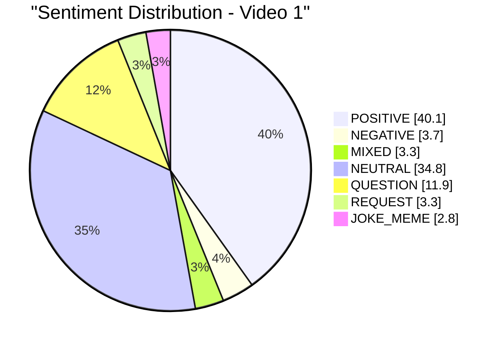

| Video | Positive % | Negative % | Mixed % | Neutral % | Question % | Request % | Joke/Meme % |
|---|---:|---:|---:|---:|---:|---:|---:|
| Video 1 | 40.1 | 3.7 | 3.3 | 34.8 | 11.9 | 3.3 | 2.8 |

### 11.2. Comment resonance score by video

- Назва графіка: Comment resonance score by video
- Яке питання він відповідає: наскільки сильна реакція в коментарях?
- Які поля використовуються: `video_label`, `comment_resonance_score`
- Тип графіка: Mermaid bar chart
- Що видно з графіка: Video 1 має score 5
- Практичний висновок: коментарі є сильною стороною цього відео, особливо через technical questions і expert validation

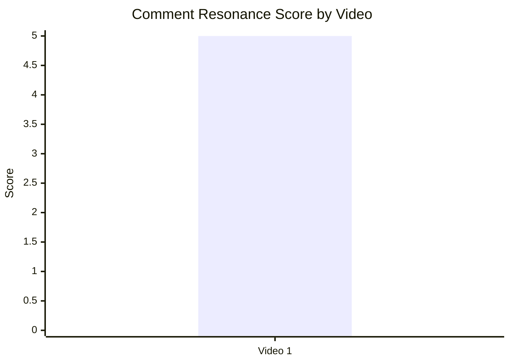

### 11.3. Top comment clusters

- Назва графіка: Top comment clusters
- Яке питання він відповідає: що найчастіше обговорюють?
- Які поля використовуються: `cluster_name`, `% of relevant comments`
- Тип графіка: Mermaid horizontal-equivalent bar chart
- Що видно з графіка: найбільші кластери — praise for detail/clarity 17.2%, practitioner validation 11.9%, technical questions 11.9%
- Практичний висновок: майбутні теми треба будувати навколо clarification/Q&A і practitioner credibility

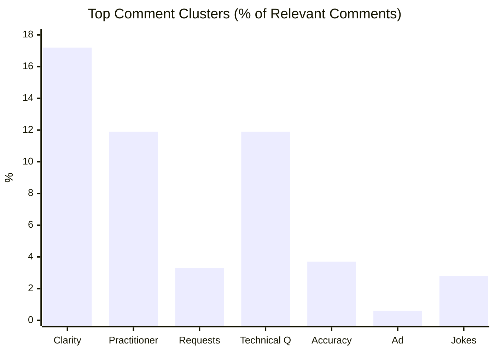

## 12. Графіки score-системи

### 12.1. Overall score by video

- Назва графіка: Overall score by video
- Яке питання він відповідає: який загальний score відео?
- Які поля використовуються: `video_label`, `overall_video_score`
- Тип графіка: Mermaid bar chart
- Що видно з графіка: Video 1 має overall 4.20
- Практичний висновок: це сильний single-video baseline, але не ranking

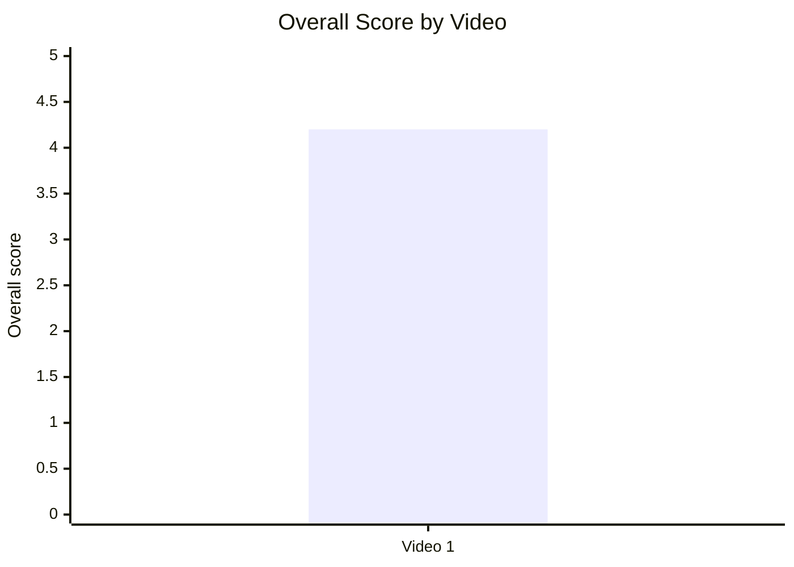

### 12.2. Score breakdown heatmap

- Назва графіка: Score breakdown heatmap
- Яке питання він відповідає: які блоки сильні, а які слабші?
- Які поля використовуються: `hook_score`, `structure_score`, `value_density_score`, `audio_score`, `cta_score`, `ad_integration_score`, `comment_resonance_score`, `replicability_score`, `overall_video_score`
- Тип графіка: heatmap table
- Що видно з графіка: найсильніші блоки — Hook, Value Density, Comments; слабші — CTA і Ad
- Практичний висновок: стратегія не в переписуванні формату, а в оптимізації CTA/ad placement

| Video | Hook | Structure | Value Density | Audio | CTA | Ad | Comments | Replicability | Overall |
|---|---:|---:|---:|---|---:|---:|---:|---:|---:|
| Video 1 | 5 | 4 | 5 | AUDIO_NOT_PROVIDED | 3 | 3 | 5 | 4 | 4.20 |

### 12.3. Strengths vs weaknesses count

- Назва графіка: Strengths vs weaknesses count
- Яке питання він відповідає: скільки success mechanics і missed opportunities зафіксовано?
- Які поля використовуються: count(success_mechanics), count(missed_opportunities), count(HIGH-priority issues)
- Тип графіка: Mermaid bar chart
- Що видно з графіка: 5 success mechanics, 5 missed opportunities, 2 high-priority issues
- Практичний висновок: відео має сильну основу, але є конкретні тактичні виправлення

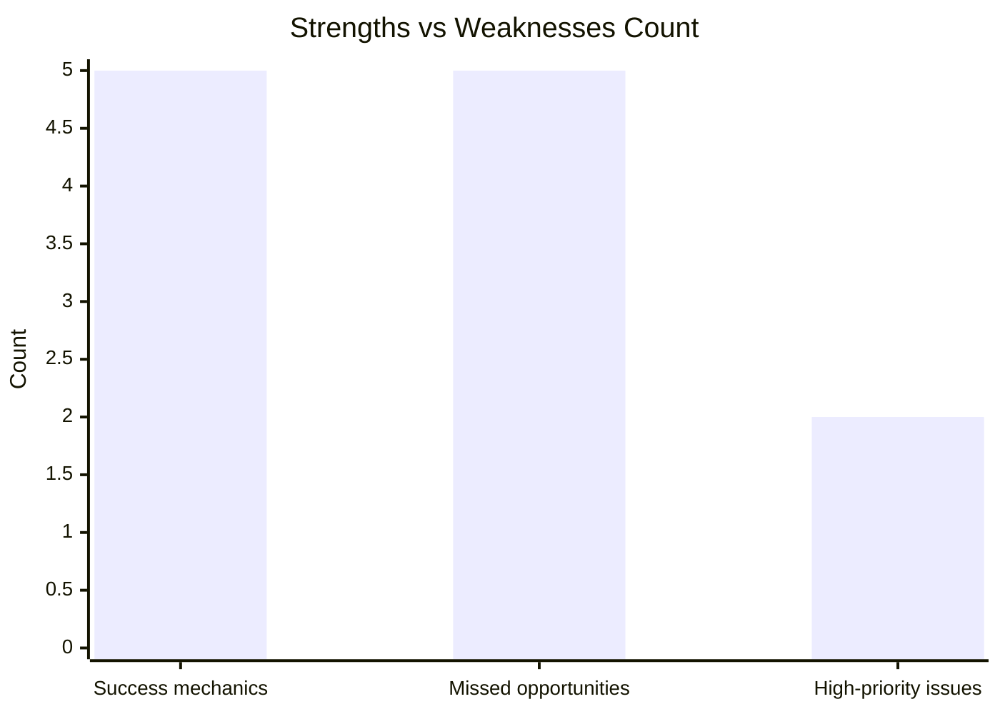

## 13. Кореляції та патерни

Correlation analysis skipped: fewer than 5 comparable videos.

| Pair | Correlation / Pattern | Strength | Interpretation | Confidence |
|---|---:|---|---|---|
| hook_score → overall_video_score | INSufficient data | LOW | Є лише одна точка: hook_score 5, overall 4.20; зв’язок не визначається. | LOW |
| value_density_score → er_public_percent | INSufficient data | LOW | Є лише одна точка: value_density 5, ER 5.87%. | LOW |
| cta_score → comment_rate_percent | INSufficient data | LOW | Є лише одна точка: CTA 3, comment rate 0.37%. | LOW |
| comment_resonance_score → er_public_percent | INSufficient data | LOW | Є лише одна точка: comment resonance 5, ER 5.87%. | LOW |
| views_per_day → er_public_percent | INSufficient data | LOW | Є лише одна точка: views/day 694.31, ER 5.87%. | LOW |
| ad_load_percent → er_public_percent | INSufficient data | LOW | `ad_load_percent = PARTIAL_DATA`. | LOW |
| time_to_first_value_seconds → overall_video_score | INSufficient data | LOW | `time_to_first_value_seconds = N/A`. | LOW |

## 14. Висновки для контент-стратегії

| Спостереження | Дані / графік | Що це означає | Що робити |
|---|---|---|---|
| Hook є найсильнішим блоком | Hook score 5; hook type `CURIOSITY_GAP` | Аналогія + stakes працюють як сильний старт у цьому кейсі | Повторювати структуру hook, але збирати більше відео для статистики |
| Value density сильна | Value density 5; comment cluster “Praise for detail and clarity” 17.2% | Глядачі реагують на глибоке пояснення | Продовжувати technical walkthrough, не спрощувати до поверхневого формату |
| Коментарі дають topic backlog | Technical questions 11.9%, requests 3.3% | Є база для серії, але не можна казати “масово просять” | Робити follow-up через pinned poll або Q&A відео |
| CTA слабший за контент | CTA score 3; comment prompt No; next-video bridge No | Відео може втрачати comments/session depth | Додати comment prompt і end-screen bridge |
| Реклама є тактичним ризиком | Ad score 3; top issue `AD_TOO_EARLY`; ad load `PARTIAL_DATA` | Sponsor timing варто тестувати, але не робити висновок про шкоду без retention | Перенести sponsor після першого value block і міряти retention/ER |
| Аудіо не можна статистично оцінити | audio_score `AUDIO_NOT_PROVIDED` | Немає підстав для audio-performance висновків | У наступних звітах фіксувати числовий audio_score або технічні audio metrics |

## 15. Що тестувати далі

| Тест | Гіпотеза | На яких даних базується | Як виміряти | Пріоритет |
|---|---|---|---|---|
| Sponsor після першого value block | Пізніша реклама зменшить ризик раннього drop-off | `AD_TOO_EARLY`, ad score 3, sponsor до core walkthrough | Retention до/після sponsor, ER Public %, comments mentioning ads | HIGH |
| Pinned comment із технічним питанням | Конкретний prompt підвищить якість і кількість релевантних коментарів | `NO_COMMENT_PROMPT`, technical questions 11.9% | Comment rate %, comments per 1k views, частка QUESTION/REQUEST | HIGH |
| End-screen bridge на follow-up | Перехід у related video збільшить session depth | `NO_NEXT_VIDEO_BRIDGE`, series potential | End screen CTR, views from end screen, returning viewers | HIGH |
| Серія з Excalibur / fuses / ballistics | Follow-up на recurring questions підтримає community identification | Requests 3.3%, technical questions 11.9%, top_success `SERIES_POTENTIAL` | Views/day, ER, comment clusters, repeat viewers | MEDIUM |
| Фіксація точного time_to_first_value_seconds | Дозволить порівнювати структуру статистично | `time_to_first_value = PARTIAL_DATA` | Заповненість поля, future correlation after 5+ videos | MEDIUM |
| Числовий audio_score у наступних звітах | Audio можна буде порівнювати з overall score | `AUDIO_NOT_PROVIDED` | Audio score 1-5, audio complaints %, overall score | LOW |

## 16. Дані для експорту в таблицю / CSV

| video_label | title | format_group | views | views_per_day | like_rate_percent | comment_rate_percent | er_public_percent | views_per_1k_subs | hook_type | hook_score | cta_count | cta_score | ad_load_percent | ad_integration_score | audio_score | comment_resonance_score | overall_video_score | top_success_mechanic | top_missed_opportunity |
|---|---|---|---:|---:|---:|---:|---:|---:|---|---:|---:|---:|---|---:|---|---:|---:|---|---|
| Video 1 | How the M777 Howitzer Works | LONG_20_PLUS_MIN | 990085 | 694.31 | 5.50 | 0.37 | 5.87 | 943.0 | CURIOSITY_GAP | 5 | 4 | 3 | PARTIAL_DATA | 3 | AUDIO_NOT_PROVIDED | 5 | 4.20 | CLEAR_HOOK | AD_TOO_EARLY |

```csv
video_label,title,format_group,views,views_per_day,like_rate_percent,comment_rate_percent,er_public_percent,views_per_1k_subs,hook_type,hook_score,cta_count,cta_score,ad_load_percent,ad_integration_score,audio_score,comment_resonance_score,overall_video_score,top_success_mechanic,top_missed_opportunity
Video 1,How the M777 Howitzer Works,LONG_20_PLUS_MIN,990085,694.31,5.50,0.37,5.87,943.0,CURIOSITY_GAP,5,4,3,PARTIAL_DATA,3,AUDIO_NOT_PROVIDED,5,4.20,CLEAR_HOOK,AD_TOO_EARLY
```