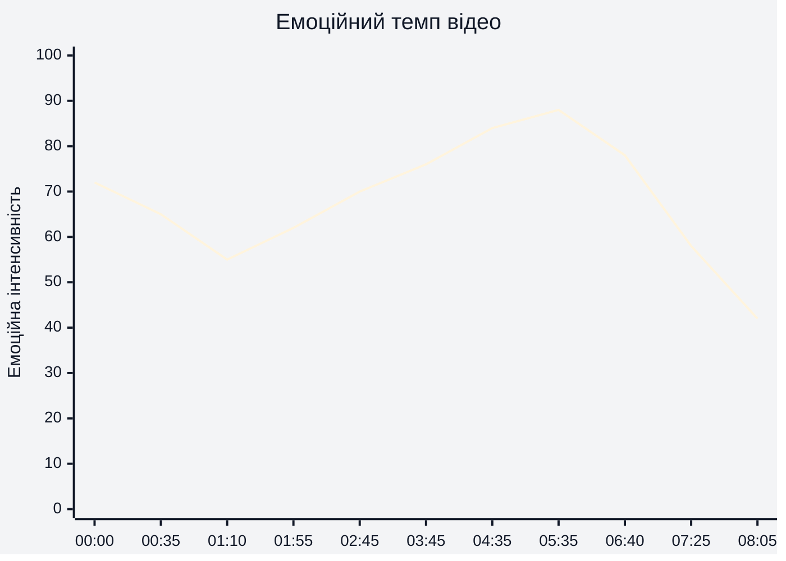
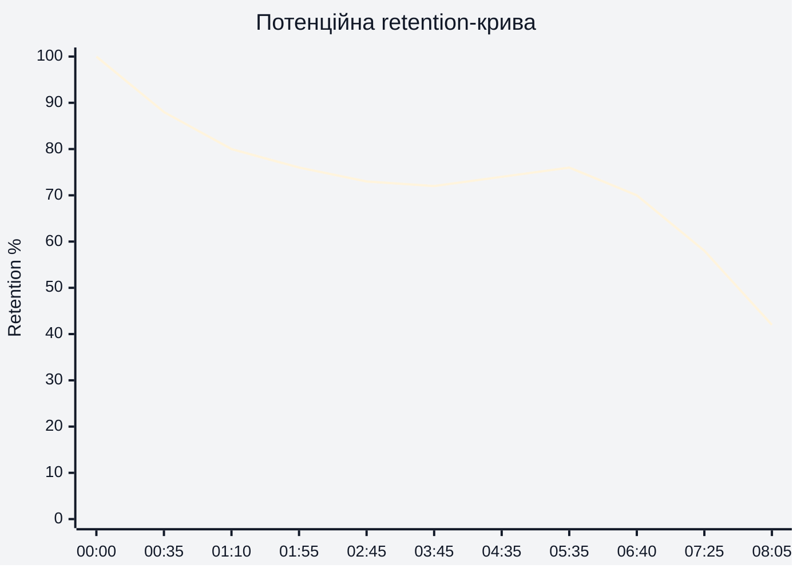
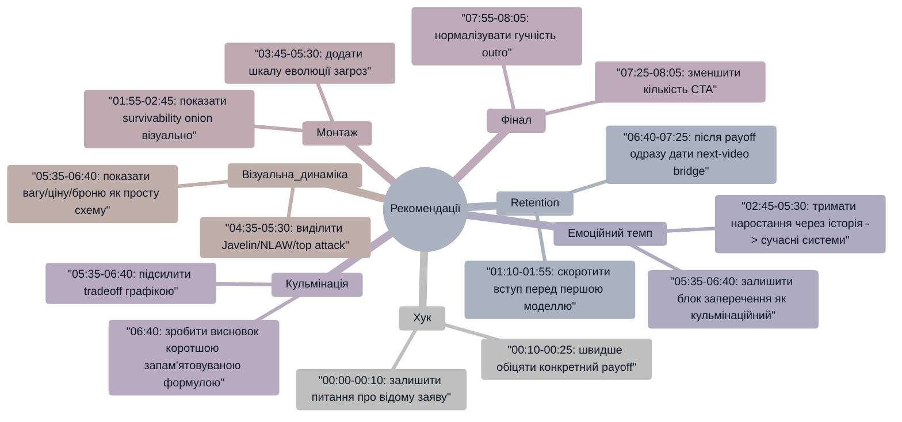

# Аналіз довгоформатного YouTube-відео

## 1. Сюжетна дуга (Narrative Arc)

```mermaid
%%{init: {'theme':'base', 'themeVariables': {
'primaryColor':'#f3f4f6',
'primaryTextColor':'#111827',
'primaryBorderColor':'#2563eb',
'lineColor':'#2563eb',
'secondaryColor':'#ffffff',
'tertiaryColor':'#f3f4f6',
'background':'#f3f4f6'
}}}%%
flowchart LR
    A["00:00-00:35<br/>Хук<br/>Питання: чи правий Ілон Маск, що танки є death traps?"]
    B["00:35-01:10<br/>Експозиція<br/>Заява Маска і рамка: факти важливіші за емоції"]
    C["01:10-01:55<br/>Перша ескалація<br/>Автор уточнює, що саме називає танком"]
    D["01:55-02:45<br/>Переломний момент<br/>Вводиться модель survivability onion"]
    E["02:45-05:30<br/>Наростання напруги<br/>Історична еволюція протитанкових засобів до Javelin/NLAW"]
    F["05:30-06:40<br/>Кульмінація<br/>Чому не можна просто додати більше броні: фізика, вага, ціна"]
    G["06:40-07:25<br/>Розв’язка<br/>Маск частково правий, але танки все ще мають роль"]
    H["07:25-08:05<br/>Фінальний висновок<br/>CTA, мерч, survivability onion, наступне відео"]
    A --> B --> C --> D --> E --> F --> G --> H
```

## 2. Ключові Story Beats

```mermaid
%%{init: {'theme':'base', 'themeVariables': {
'primaryColor':'#f3f4f6',
'primaryTextColor':'#111827',
'primaryBorderColor':'#2563eb',
'lineColor':'#2563eb',
'secondaryColor':'#ffffff',
'tertiaryColor':'#f3f4f6',
'background':'#f3f4f6'
}}}%%
flowchart LR
    B1["00:00<br/>Запитання про Маска і танки<br/>Функція: миттєво задати тему"]
    B2["00:15<br/>Автор отримав багато повідомлень<br/>Функція: показати актуальність"]
    B3["00:25<br/>Opinions don't matter, facts matter<br/>Функція: задати авторитетну рамку"]
    B4["00:40<br/>Цитата/переказ Маска<br/>Функція: показати конфлікт"]
    B5["01:05<br/>Some truth, but it also doesn't matter<br/>Функція: створити інтригу"]
    B6["01:20<br/>Визначення, що таке танк<br/>Функція: прибрати двозначність"]
    B7["01:55<br/>Survivability onion<br/>Функція: дати головну модель"]
    B8["02:45<br/>Bazooka/Panzerfaust і 100 метрів<br/>Функція: історичний контраст"]
    B9["03:45<br/>TOW/Dragon/Sagger, термали, нічне бачення<br/>Функція: ескалація загрози"]
    B10["04:35<br/>Javelin/NLAW і top attack<br/>Функція: сучасний перелом"]
    B11["05:35<br/>Why don't they just add armor?<br/>Функція: закрити типове заперечення"]
    B12["06:40<br/>Маск частково правий, але війна небезпечна<br/>Функція: payoff і висновок"]
    B1 --> B2 --> B3 --> B4 --> B5 --> B6 --> B7 --> B8 --> B9 --> B10 --> B11 --> B12
```

## 3. Емоційний темп

Емоційна інтенсивність найвища в зоні 04:35-06:40, коли відео переходить від історичного пояснення до сучасних Javelin/NLAW, top attack і неможливості "просто додати броню". Найнижча інтенсивність у фіналі 07:25-08:05, де основна історія вже завершена і починається CTA/реклама.

## 4. Утримання аудиторії

Реальні retention-дані або скріншот YouTube Studio не надані. Нижче — потенційна retention-структура, побудована за сценарними подіями, темпом і ймовірними точками втрати уваги.

Крива прогнозує стандартний спад після хука 00:00-01:55, стабілізацію в основних пояснювальних блоках 02:45-06:40 і помітніше падіння після payoff 06:40-07:25, коли глядач уже отримав відповідь на головне питання.

## 5. Піки retention

| Таймкод | Подія | Чому це може утримувати увагу | Сила піку 1–10 |
|---|---|---|---:|
| 00:00-00:35 | Питання "чи правий Ілон Маск?" | Ім'я Маска + тема танків створюють конфлікт і цікавість із першої секунди. | 8 |
| 00:35-01:10 | Формула "some truth to it, but it also doesn't matter" | Глядач очікує не просту відповідь "так/ні", а нюансований розбір. | 7 |
| 01:55-02:45 | Survivability onion | Відео дає просту модель, через яку можна зрозуміти складну тему. | 8 |
| 04:35-05:30 | Javelin/NLAW, fire-and-forget, top attack | Сучасні системи пояснюють, чому загроза для танків змінилася саме зараз. | 9 |
| 05:35-06:40 | Відповідь на "why don't they just add armor?" | Закривається типове заперечення аудиторії; це сильний освітній payoff. | 9 |
| 06:40-07:25 | Підсумок: Маск правий, але танки все ще потрібні | Головна відповідь на назву відео; глядач отримує фінальний висновок. | 8 |

## 6. Провали retention

| Таймкод | Проблема | Ймовірна причина спаду | Що покращити |
|---|---|---|---|
| 01:10-01:55 | Повільніший вступ перед головною моделлю | Згадка попереднього відео і визначення танка можуть затримувати першу велику цінність. | Ввести survivability onion раніше, а попереднє відео згадати після першого value block. |
| 02:45-03:45 | Історичний контекст може здаватися довшим | Частина аудиторії прийшла за відповіддю про сучасні танки, а не за історією Bazooka/Panzerfaust. | Додати швидкий preview: "це важливо, бо зараз ці шари зникли". |
| 07:25-08:05 | CTA і outro після завершення основної відповіді | Після payoff частина глядачів імовірно йде, бо основне питання вже закрите. | Зробити end-screen bridge із новою інтригою до наступного власного відео. |
| 07:55-08:05 | Рекламний outro може бути різким | У попередньому аналізі зафіксована скарга на різницю гучності між основним контентом і outro ad. | Нормалізувати гучність outro і зробити м'якший аудіоперехід. |

## 7. Оцінка сегментів

| Сегмент | Таймкод | Функція | Емоційна інтенсивність | Ризик втрати уваги | Оцінка 1–10 | Що покращити |
|---|---|---|---:|---|---:|---|
| Хук | 00:00-00:35 | Зачепити через Маска, танки і конфліктну тезу | 72 | Низький | 8 | Ще швидше сформулювати, що саме глядач дізнається наприкінці. |
| Експозиція | 00:35-01:10 | Дати цитату/позицію Маска і рамку "facts matter" | 65 | Низький | 8 | Залишити, бо вона задає тон без емоційного перегріву. |
| Визначення танка | 01:10-01:55 | Прибрати двозначність у термінах | 55 | Середній | 7 | Скоротити або підкріпити візуальним прикладом танк/IFV/APC. |
| Головна модель | 01:55-02:45 | Пояснити survivability onion | 62 | Низький | 9 | Додати візуальну схему onion на екрані, якщо її немає або вона коротка. |
| Історичне порівняння | 02:45-03:45 | Показати, як раніше infantry мав менше шансів проти танка | 70 | Середній | 8 | Швидше перейти від 1940s-1960s до того, чому це важливо зараз. |
| Ескалація загроз | 03:45-04:35 | Показати TOW/Dragon/Sagger, сенсори і Yom Kippur War | 76 | Низький | 8 | Посилити графічною шкалою "range/sensor/risk". |
| Сучасний перелом | 04:35-05:30 | Пояснити Javelin/NLAW, top attack і fire-and-forget | 84 | Низький | 9 | Залишити як один із центральних retention-блоків. |
| Заперечення про броню | 05:35-06:40 | Закрити "why don't they just add armor?" | 88 | Низький | 9 | Додати коротку формулу tradeoff: protection / mobility / firepower / cost. |
| Payoff | 06:40-07:25 | Дати відповідь: Маск частково правий, але танки потрібні | 78 | Середній | 8 | Стиснути висновок у ще сильнішу фразу для запам'ятовування. |
| CTA та реклама | 07:25-08:05 | Перевести до мерчу, onion, наступного відео | 42-58 | Високий | 6 | Один primary CTA, чіткий next-video bridge, нормалізація гучності outro. |

## 8. Практичні рекомендації

## 9. Підсумкова оцінка

| Показник | Оцінка 1–10 | Коментар |
|---|---:|---|
| Сюжетна дуга | 8 | 00:00-07:25 має чітку дугу: питання -> контекст -> модель -> ескалація -> заперечення -> відповідь. Фінал 07:25-08:05 слабший через CTA/рекламу після payoff. |
| Story Beats | 9 | Ключові точки 00:00, 01:55, 04:35, 05:35 і 06:40 добре ведуть глядача від конфлікту до висновку. |
| Емоційний темп | 8 | Найсильніше наростання від 03:45 до 06:40; спад після 07:25 логічний, але його можна пом'якшити next-video інтригою. |
| Retention Structure | 7 | Потенційно сильна середина 01:55-06:40; ризики — повільніший вступ 01:10-01:55 і рекламний фінал 07:25-08:05. Реальні retention-дані не надані. |
| Загальна оцінка | 8 | Відео має сильну освітню структуру, зрозумілий payoff і дискусійну тему; головні покращення — швидша перша цінність, чистіший CTA і м'якший аудіофінал. |
