# Статистичний аналіз відеозвітів

## 1. Короткий executive summary

| Пункт | Висновок |
|---|---|
| Скільки відео проаналізовано | 1 |
| Скільки форматів відео | 1: `LONG_4_10_MIN` |
| Найсильніше відео за overall score | Video 1 — `Is Elon Musk right about tanks?`, overall_video_score = 3.90 |
| Найсильніше відео за ER Public % | Video 1 — ER Public % = 5.31 |
| Найсильніше відео за views per day | Video 1 — views_per_day = 776.54 |
| Найсильніша повторювана механіка | `INSUFFICIENT_DATA`: є тільки одне відео, тому повторюваність не перевіряється. У цьому відео top mechanic = `CONTROVERSY_OR_DEBATE`. |
| Найчастіша слабкість | `INSUFFICIENT_DATA`: є тільки одне відео. У цьому відео top missed opportunity = `AUDIO_DISTRACTION`. |
| Головна стратегічна можливість | `LOW_CONFIDENCE`: масштабувати формат "спірна публічна заява + спокійний фактологічний розбір + проста модель пояснення". |
| Рівень впевненості | LOW: вибірка = 1 відео, data_quality = `PARTIAL_DATA`, comparability flags включають `NO_TIMECODES` і `COMMENT_ANALYSIS_CLUSTER_ESTIMATED`. |

## 2. Якість і повнота даних

| Поле | Кількість відео з даними | Кількість N/A | Коментар |
|---|---:|---:|---|
| views | 1 | 0 | 953 591 |
| likes | 1 | 0 | 44 297 |
| comments_count | 1 | 0 | 6 302 |
| views_per_day | 1 | 0 | 776.54 |
| er_public_percent | 1 | 0 | 5.31 |
| views_per_1k_subs | 1 | 0 | 908.18 |
| hook_score | 1 | 0 | 4 |
| cta_score | 1 | 0 | 3 |
| ad_integration_score | 1 | 0 | 3 |
| audio_score | 1 | 0 | 3, але позначено як `PARTIAL_DATA` у вихідному звіті. |
| comment_resonance_score | 1 | 0 | 5 |
| overall_video_score | 1 | 0 | 3.90 |

### Обмеження аналізу

- Вибірка містить лише 1 відео, тому кореляції, порівняння між відео, outlier-аналіз і статистичні патерни = `INSUFFICIENT_DATA`.
- Усі практичні висновки позначаються як `LOW_CONFIDENCE`, бо для стандарту `YT_VIDEO_VISUALIZATION_V1` менше 5 відео не дозволяє робити кореляції.
- Вихідний аналіз має `PARTIAL_DATA`: немає CTR, impressions, retention, watch time, traffic sources; таймкоди оцінені як `NO_TIMECODES`.
- Дані не змішуються з Shorts або live: єдина когорта = `LONG_4_10_MIN`.

## 3. Підготовлена таблиця для графіків

| Video | Format | Views | Likes | Comments | Views/day | Like Rate % | Comment Rate % | ER Public % | Views/1k subs | Hook | CTA | Ad | Audio | Comment Resonance | Overall |
|---|---|---:|---:|---:|---:|---:|---:|---:|---:|---:|---:|---:|---:|---:|---:|
| Video 1 | LONG_4_10_MIN | 953 591 | 44 297 | 6 302 | 776.54 | 4.64 | 0.66 | 5.31 | 908.18 | 4 | 3 | 3 | 3 | 5 | 3.90 |

| Label | Full title | URL |
|---|---|---|
| Video 1 | Is Elon Musk right about tanks? | https://www.youtube.com/watch?v=tK_EcLQAFxk |

## 4. Рекомендовані графіки

| # | Назва графіка | Тип графіка | Поля | Для чого потрібен | Пріоритет |
|---:|---|---|---|---|---|
| 1 | Overall score by video | Bar chart / Mermaid xychart | overall_video_score | Побачити загальну оцінку відео | HIGH |
| 2 | Views per day by video | Bar chart / Mermaid xychart | views_per_day | Показати нормалізовану швидкість набору переглядів | HIGH |
| 3 | ER Public % by video | Bar chart / Mermaid xychart | er_public_percent | Показати публічне залучення | HIGH |
| 4 | Score breakdown heatmap | Matrix table | hook_score, structure_score, value_density_score, audio_score, cta_score, ad_integration_score, comment_resonance_score, replicability_score, overall_video_score | Побачити сильні та слабкі блоки одного відео | HIGH |
| 5 | CTA features heatmap | Matrix table | has_comment_prompt, has_subscribe_cta, has_like_cta, has_bell_cta, has_next_video_bridge | Побачити, яких CTA бракує | HIGH |
| 6 | Sentiment distribution | Mermaid pie / table | positive_percent, negative_percent, mixed_percent, neutral_percent, question_percent, request_percent, joke_meme_percent | Показати структуру реакцій аудиторії | MEDIUM |
| 7 | Ad load % by video | Bar chart / Mermaid xychart | ad_load_percent | Оцінити рекламне навантаження | MEDIUM |
| 8 | Performance quadrant | Scatter plot | views_per_day, er_public_percent | `INSUFFICIENT_DATA` для квадрантів, але точку можна нанести вручну | LOW |

## 5. Графіки продуктивності

### 5.1. Views by video

- Назва графіка: Views by video
- Яке питання він відповідає: який raw reach має відео?
- Які поля використовуються: `video_label`, `views`
- Тип графіка: bar chart / Mermaid xychart
- Що видно з графіка: Video 1 має 953 591 перегляд.
- Практичний висновок: raw views можна показати як охоплення, але без інших відео та без нормалізації це не дає порівняльного висновку.

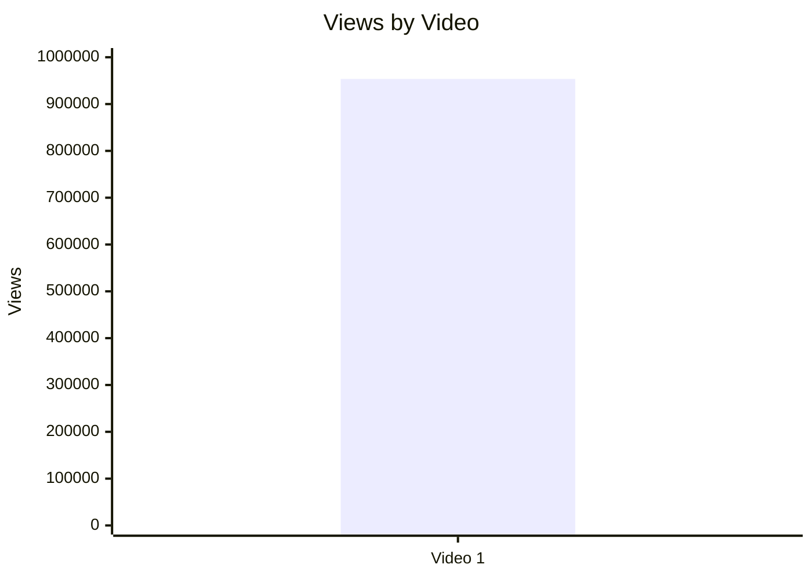

### 5.2. Views per day by video

- Назва графіка: Views per day by video
- Яке питання він відповідає: яка нормалізована швидкість набору переглядів?
- Які поля використовуються: `video_label`, `views_per_day`
- Тип графіка: bar chart / Mermaid xychart
- Що видно з графіка: Video 1 має 776.54 views/day.
- Практичний висновок: це краща метрика для майбутнього порівняння з іншими long-form відео, ніж raw views.

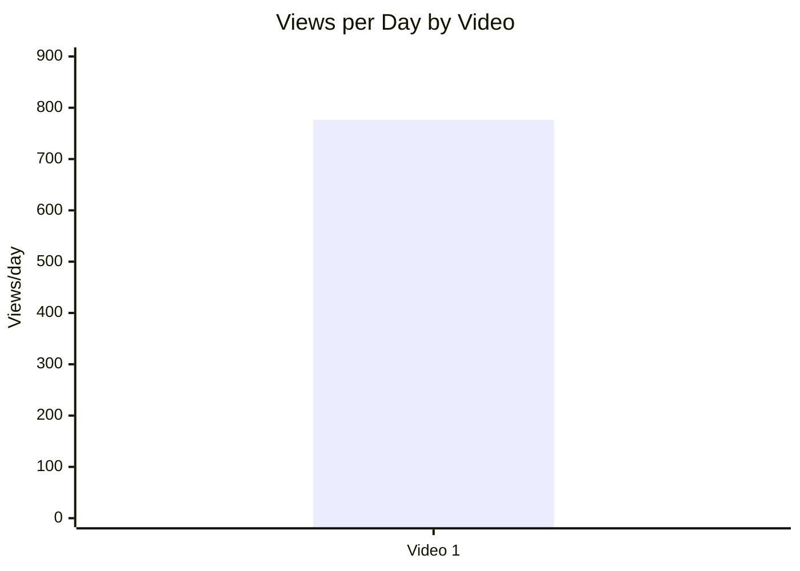

### 5.3. Views per 1k subscribers

- Назва графіка: Views per 1k subscribers
- Яке питання він відповідає: наскільки відео конвертує розмір каналу в перегляди?
- Які поля використовуються: `video_label`, `views_per_1k_subs`
- Тип графіка: bar chart / Mermaid xychart
- Що видно з графіка: Video 1 має 908.18 views per 1k subs.
- Практичний висновок: значення готове для майбутнього порівняння в когорті `LONG_4_10_MIN`.

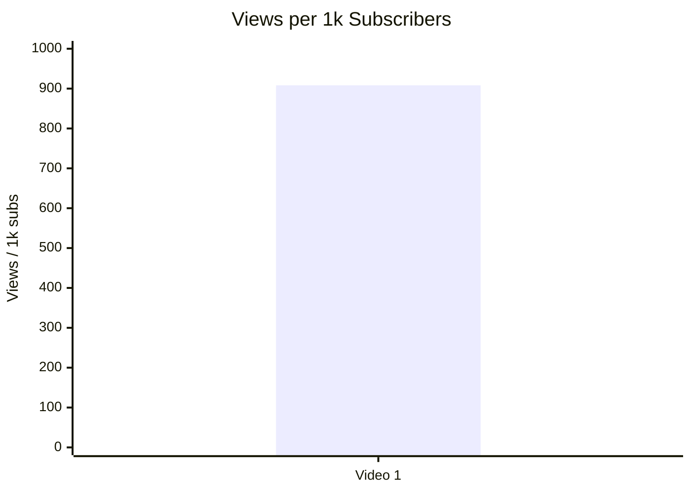

### 5.4. Performance quadrant

- Назва графіка: Performance quadrant
- Яке питання він відповідає: чи відео має баланс охоплення і залучення?
- Які поля використовуються: `views_per_day`, `er_public_percent`
- Тип графіка: scatter plot / quadrant chart
- Що видно з графіка: є лише одна точка: Video 1 = 776.54 views/day і 5.31 ER Public %.
- Практичний висновок: `INSUFFICIENT_DATA` для квадрантів, бо немає медіан або інших відео для меж High/Low.

| Video | views_per_day | er_public_percent | Quadrant |
|---|---:|---:|---|
| Video 1 | 776.54 | 5.31 | `INSUFFICIENT_DATA`: немає порівняльної когорти |

## 6. Графіки залучення

### 6.1. ER Public % by video

- Назва графіка: ER Public % by video
- Яке питання він відповідає: який рівень публічного engagement?
- Які поля використовуються: `video_label`, `er_public_percent`
- Тип графіка: bar chart / Mermaid xychart
- Що видно з графіка: Video 1 має ER Public % = 5.31.
- Практичний висновок: значення придатне для порівняння з наступними звітами тієї ж когорти.

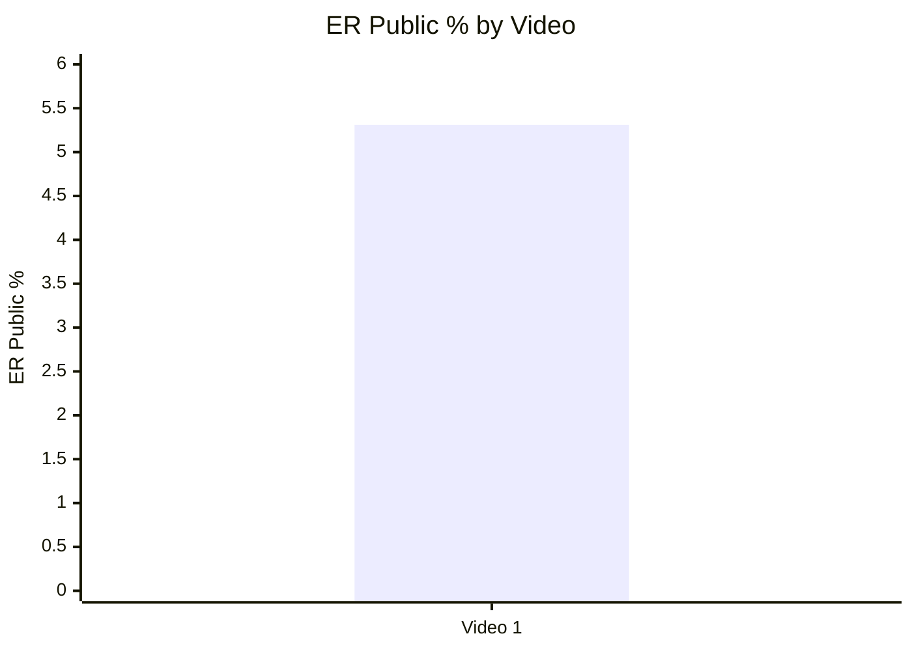

### 6.2. Like Rate % vs Comment Rate %

- Назва графіка: Like Rate % vs Comment Rate %
- Яке питання він відповідає: баланс "подобається" проти "провокує дискусію"?
- Які поля використовуються: `like_rate_percent`, `comment_rate_percent`
- Тип графіка: scatter plot
- Що видно з графіка: Video 1 = 4.64 like rate і 0.66 comment rate.
- Практичний висновок: `INSUFFICIENT_DATA` для quadrant interpretation, але точку можна нанести вручну.

| Video | Like Rate % | Comment Rate % |
|---|---:|---:|
| Video 1 | 4.64 | 0.66 |

### 6.3. Comments per 1k views

- Назва графіка: Comments per 1k views
- Яке питання він відповідає: наскільки відео провокує коментарі відносно переглядів?
- Які поля використовуються: `video_label`, `comments_per_1k_views`
- Тип графіка: bar chart / Mermaid xychart
- Що видно з графіка: Video 1 має 6.61 comments per 1k views.
- Практичний висновок: зручно використовувати як normalized metric для порівняння майбутніх відео.

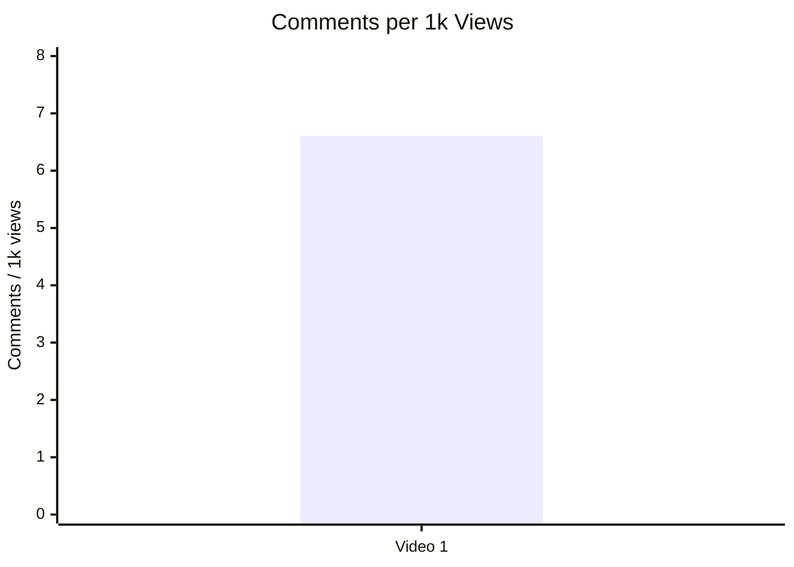

## 7. Графіки структури та hook

### 7.1. Hook score by video

- Назва графіка: Hook score by video
- Яке питання він відповідає: наскільки сильний hook?
- Які поля використовуються: `video_label`, `hook_score`
- Тип графіка: bar chart / Mermaid xychart
- Що видно з графіка: Video 1 має hook_score = 4.
- Практичний висновок: hook є одним із сильніших елементів; порівняння потребує більше відео.

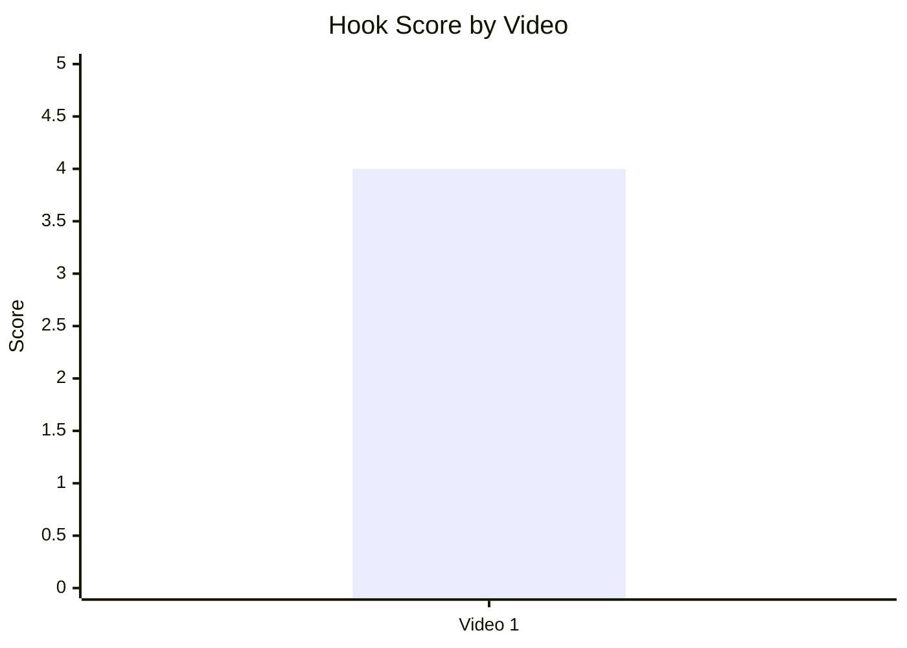

### 7.2. Hook type distribution

- Назва графіка: Hook type distribution
- Яке питання він відповідає: які hook types використовуються?
- Які поля використовуються: `hook_primary_type`, count
- Тип графіка: pie chart / Mermaid pie
- Що видно з графіка: у вибірці є тільки `QUESTION`.
- Практичний висновок: `LOW_CONFIDENCE`; не можна сказати, що QUESTION працює краще за інші типи, бо інших типів у вибірці немає.

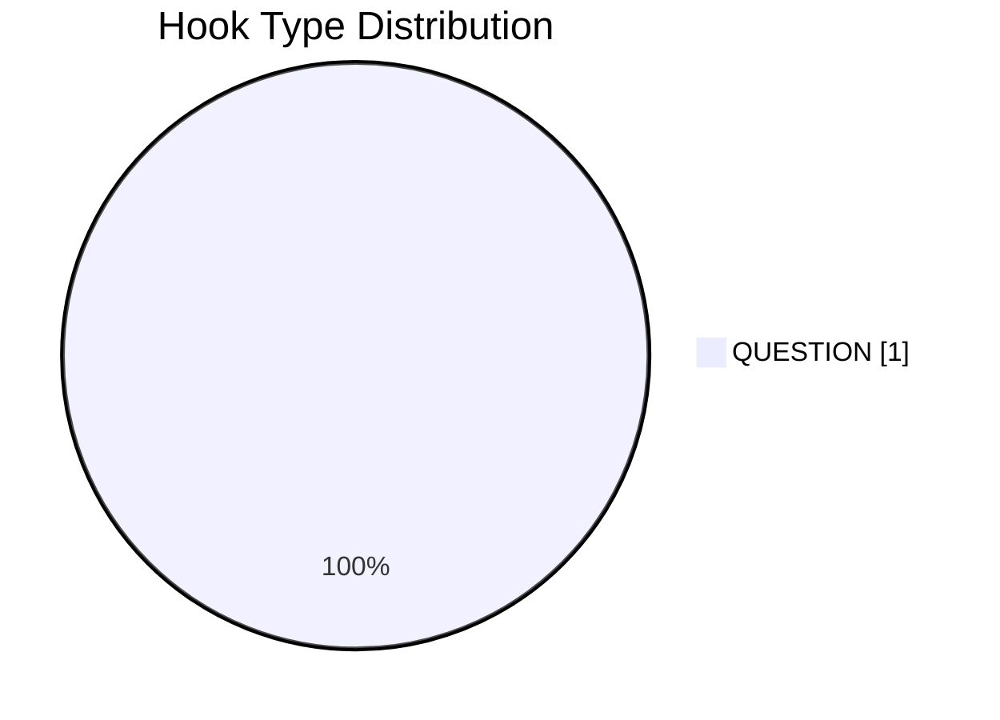

### 7.3. Time to first value vs Overall Score

- Назва графіка: Time to first value vs Overall Score
- Яке питання він відповідає: чи швидша перша цінність пов'язана з вищим overall score?
- Які поля використовуються: `time_to_first_value_seconds`, `overall_video_score`
- Тип графіка: scatter plot
- Що видно з графіка: `INSUFFICIENT_DATA`, бо `time_to_first_value` у звіті = `approx_01:55_NO_TIMECODES`, а вибірка = 1.
- Практичний висновок: для майбутніх звітів потрібно фіксувати `time_to_first_value_seconds` як число.

| Video | time_to_first_value | time_to_first_value_seconds | overall_video_score |
|---|---|---:|---:|
| Video 1 | approx_01:55_NO_TIMECODES | 115, але `LOW_CONFIDENCE` через `NO_TIMECODES` | 3.90 |

## 8. Графіки CTA

### 8.1. CTA score by video

- Назва графіка: CTA score by video
- Яке питання він відповідає: наскільки якісна CTA-система?
- Які поля використовуються: `video_label`, `cta_score`
- Тип графіка: bar chart / Mermaid xychart
- Що видно з графіка: Video 1 має cta_score = 3.
- Практичний висновок: CTA не провальний, але є простір для тесту comment prompt і чистішого pinned comment.

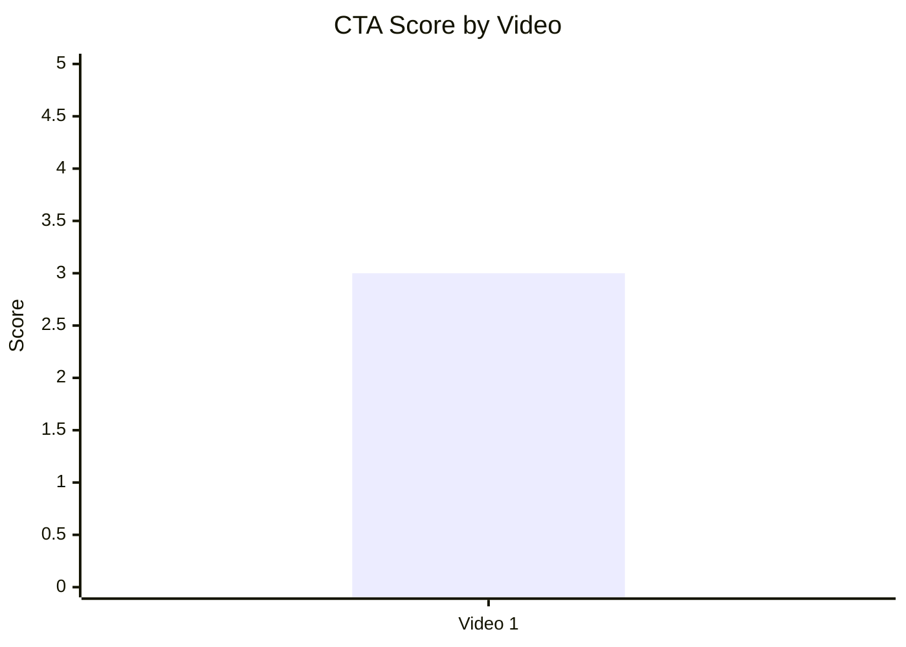

### 8.2. CTA count vs ER Public %

- Назва графіка: CTA count vs ER Public %
- Яке питання він відповідає: чи більше CTA пов'язано з кращим залученням?
- Які поля використовуються: `cta_count`, `er_public_percent`
- Тип графіка: scatter plot
- Що видно з графіка: Video 1 має cta_count = 6 і ER Public % = 5.31.
- Практичний висновок: `INSUFFICIENT_DATA`; за одним відео не можна оцінити CTA overload статистично.

| Video | cta_count | er_public_percent | CTA overload flag |
|---|---:|---:|---|
| Video 1 | 6 | 5.31 | YES у вихідному звіті |

### 8.3. CTA features heatmap

- Назва графіка: CTA features heatmap
- Яке питання він відповідає: які CTA-фічі присутні або відсутні?
- Які поля використовуються: `has_comment_prompt`, `has_subscribe_cta`, `has_like_cta`, `has_bell_cta`, `has_next_video_bridge`
- Тип графіка: heatmap / matrix
- Що видно з графіка: є next video bridge, але немає comment/subscription/like/bell CTA.
- Практичний висновок: найпростіший тест — додати конкретний comment prompt без перевантаження CTA.

| Video | Comment prompt | Subscribe | Like | Bell | Next video bridge |
|---|---|---|---|---|---|
| Video 1 | NO | NO | NO | NO | YES |

## 9. Графіки реклами / інтеграцій

### 9.1. Ad load % by video

- Назва графіка: Ad load % by video
- Яке питання він відповідає: яке рекламне навантаження у відео?
- Які поля використовуються: `video_label`, `ad_load_percent`
- Тип графіка: bar chart / Mermaid xychart
- Що видно з графіка: Video 1 має ad_load_percent = 6.19.
- Практичний висновок: навантаження помірне, але вихідний звіт вказує ризик через різку гучність outro ad.

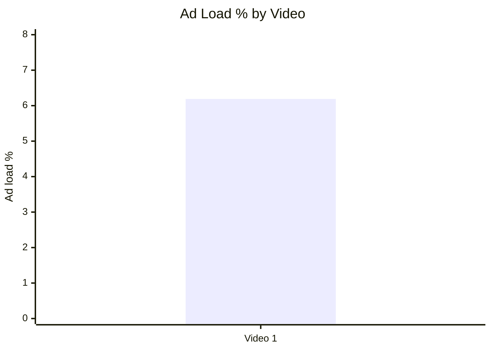

### 9.2. First ad position %

- Назва графіка: First ad position %
- Яке питання він відповідає: чи реклама стоїть занадто рано?
- Які поля використовуються: `video_label`, `first_ad_relative_position_percent`
- Тип графіка: bar chart / Mermaid xychart
- Що видно з графіка: перша реклама починається приблизно на 91.8% відео.
- Практичний висновок: за timing реклама стоїть після основної цінності; основний ризик не timing, а audio disruption.

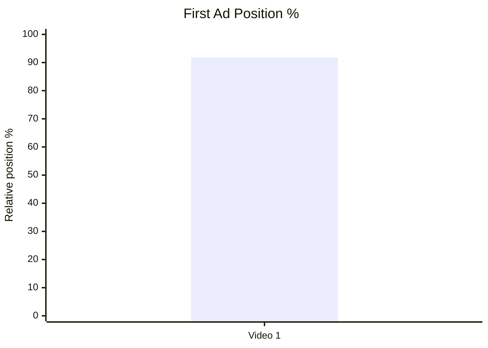

### 9.3. Ad integration score vs ER Public %

- Назва графіка: Ad integration score vs ER Public %
- Яке питання він відповідає: чи якість інтеграції пов'язана з реакцією аудиторії?
- Які поля використовуються: `ad_integration_score`, `er_public_percent`
- Тип графіка: scatter plot
- Що видно з графіка: одна точка: ad_integration_score = 3, ER Public % = 5.31.
- Практичний висновок: `INSUFFICIENT_DATA`; для перевірки зв'язку потрібно мінімум 5 comparable videos.

| Video | ad_integration_score | er_public_percent |
|---|---:|---:|
| Video 1 | 3 | 5.31 |

## 10. Графіки аудіо

### 10.1. Audio score by video

- Назва графіка: Audio score by video
- Яке питання він відповідає: яка оцінка аудіо?
- Які поля використовуються: `video_label`, `audio_score`
- Тип графіка: bar chart / Mermaid xychart
- Що видно з графіка: Video 1 має audio_score = 3.
- Практичний висновок: аудіо не є найсильнішим блоком; головний конкретний ризик — різниця гучності між основним контентом і outro ad.


### 10.2. Audio score vs Overall Score

- Назва графіка: Audio score vs Overall Score
- Яке питання він відповідає: чи краща якість аудіо пов'язана з загальним балом?
- Які поля використовуються: `audio_score`, `overall_video_score`
- Тип графіка: scatter plot
- Що видно з графіка: одна точка: audio_score = 3, overall_video_score = 3.90.
- Практичний висновок: `INSUFFICIENT_DATA` для зв'язку; аудіо варто покращувати як tactical fix, не як доведену статистичну причину росту.

| Video | audio_score | overall_video_score |
|---|---:|---:|
| Video 1 | 3 | 3.90 |

## 11. Графіки коментарів

### 11.1. Sentiment distribution

- Назва графіка: Sentiment distribution
- Яке питання він відповідає: які типи реакцій домінують?
- Які поля використовуються: `positive_percent`, `negative_percent`, `mixed_percent`, `neutral_percent`, `question_percent`, `request_percent`, `joke_meme_percent`
- Тип графіка: stacked bar chart; у Markdown подано Mermaid pie + таблицю
- Що видно з графіка: найбільші частки — POSITIVE 22.3%, JOKE_MEME 21.1%, NEUTRAL 20.0%, NEGATIVE 15.4%.
- Практичний висновок: тема генерує не лише схвалення, а й жарти та дебати; це підтримує comment resonance.

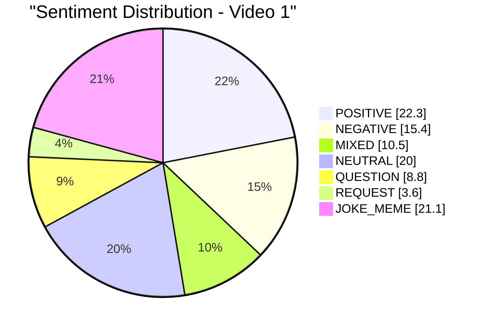

| Sentiment | Percent |
|---|---:|
| POSITIVE | 22.3 |
| NEGATIVE | 15.4 |
| MIXED | 10.5 |
| NEUTRAL | 20.0 |
| QUESTION | 8.8 |
| REQUEST | 3.6 |
| JOKE_MEME | 21.1 |

### 11.2. Comment resonance score by video

- Назва графіка: Comment resonance score by video
- Яке питання він відповідає: наскільки сильно відео провокує коментарі?
- Які поля використовуються: `video_label`, `comment_resonance_score`
- Тип графіка: bar chart / Mermaid xychart
- Що видно з графіка: Video 1 має comment_resonance_score = 5.
- Практичний висновок: comment resonance — найсильніший score-блок цього відео.

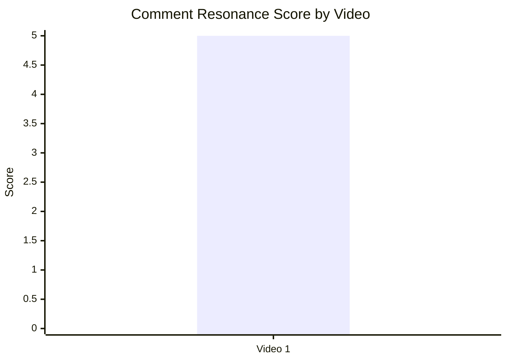

### 11.3. Top comment clusters

- Назва графіка: Top comment clusters
- Яке питання він відповідає: які теми найчастіше з'являються в коментарях?
- Які поля використовуються: `cluster`, `count`, `% of relevant comments`
- Тип графіка: horizontal bar chart / table
- Що видно з графіка: найбільші кластери — Technical debate 20.0%, Elon-focused ridicule/disagreement 16.1%, Disagreement with Ryan 9.5%.
- Практичний висновок: найсильніший драйвер коментарів — дискусійність теми і технічні суперечки.

| Cluster | Count | % of relevant comments |
|---|---:|---:|
| Technical debate about tanks/ATGMs/APS | 1180 | 20.0 |
| Elon-focused ridicule/disagreement | 950 | 16.1 |
| Disagreement with Ryan's conclusion | 560 | 9.5 |
| Praise for balanced explanation | 520 | 8.8 |
| Questions and topic requests | 520 | 8.8 |
| Praise for humor / Elon impression | 300 | 5.1 |
| Merch / survivability onion response | 120 | 2.0 |
| Audio/outro complaints | 35 | 0.6 |

## 12. Графіки score-системи

### 12.1. Overall score by video

- Назва графіка: Overall score by video
- Яке питання він відповідає: яка загальна оцінка відео?
- Які поля використовуються: `video_label`, `overall_video_score`
- Тип графіка: bar chart / Mermaid xychart
- Що видно з графіка: Video 1 має overall_video_score = 3.90.
- Практичний висновок: відео сильне в коментарях і hook/value, слабше в CTA/audio/ad integration.

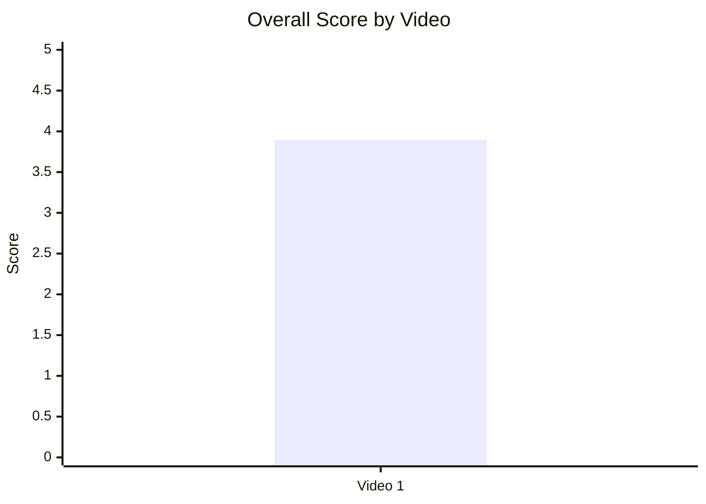

### 12.2. Score breakdown heatmap

- Назва графіка: Score breakdown heatmap
- Яке питання він відповідає: які блоки сильніші/слабші?
- Які поля використовуються: `hook_score`, `structure_score`, `value_density_score`, `audio_score`, `cta_score`, `ad_integration_score`, `comment_resonance_score`, `replicability_score`, `overall_video_score`
- Тип графіка: heatmap / matrix
- Що видно з графіка: найвищий блок — Comments = 5; найнижчі — Audio, CTA, Ad = 3.
- Практичний висновок: next tests мають фокусуватися на CTA clarity, audio normalization і менш перевантаженій інтеграції.

| Video | Hook | Structure | Value Density | Audio | CTA | Ad | Comments | Replicability | Overall |
|---|---:|---:|---:|---:|---:|---:|---:|---:|---:|
| Video 1 | 4 | 4 | 4 | 3 | 3 | 3 | 5 | 4 | 3.90 |

### 12.3. Strengths vs weaknesses count

- Назва графіка: Strengths vs weaknesses count
- Яке питання він відповідає: скільки success mechanics і missed opportunities зафіксовано?
- Які поля використовуються: кількість `success_mechanics`, кількість `missed_opportunities`, кількість HIGH-priority issues
- Тип графіка: stacked bar chart / table
- Що видно з графіка: 5 success mechanics, 5 missed opportunities, 1 HIGH-priority issue.
- Практичний висновок: відео має багато повторюваних елементів, але один чіткий high-priority fix — `AUDIO_DISTRACTION`.

| Video | Success mechanics count | Missed opportunities count | HIGH-priority issues |
|---|---:|---:|---:|
| Video 1 | 5 | 5 | 1 |

## 13. Кореляції та патерни

Correlation analysis skipped: fewer than 5 comparable videos.

| Pair | Correlation / Pattern | Strength | Interpretation | Confidence |
|---|---:|---|---|---|
| hook_score → overall_video_score | `INSUFFICIENT_DATA` | LOW | Є тільки одна точка: hook_score 4, overall 3.90. Зв'язок не оцінюється. | LOW |
| value_density_score → er_public_percent | `INSUFFICIENT_DATA` | LOW | Є тільки одна точка: value_density 4, ER 5.31. | LOW |
| cta_score → comment_rate_percent | `INSUFFICIENT_DATA` | LOW | Є тільки одна точка: cta_score 3, comment_rate 0.66. | LOW |
| comment_resonance_score → er_public_percent | `INSUFFICIENT_DATA` | LOW | Є тільки одна точка: comment_resonance 5, ER 5.31. | LOW |
| views_per_day → er_public_percent | `INSUFFICIENT_DATA` | LOW | Є тільки одна точка: 776.54 views/day, ER 5.31. | LOW |
| ad_load_percent → er_public_percent | `INSUFFICIENT_DATA` | LOW | Є тільки одна точка: ad_load 6.19, ER 5.31. | LOW |
| time_to_first_value_seconds → overall_video_score | `INSUFFICIENT_DATA` | LOW | Time to first value має `NO_TIMECODES`; приблизно 115 секунд, але точність низька. | LOW |

## 14. Висновки для контент-стратегії

| Спостереження | Дані / графік | Що це означає | Що робити |
|---|---|---|---|
| Найсильніший блок відео — коментарі | Comment resonance score = 5; top clusters: technical debate 20.0%, Elon-focused discussion 16.1% | Спірна тема + технічний розбір добре провокують реакцію. | Повторювати формат "controversial public claim + technical explanation", але спрямовувати коментарі конкретним prompt. |
| Hook сильний, але не можна довести його статистичну перевагу | Hook score = 4; hook type = QUESTION; sample size = 1 | QUESTION hook виглядає корисним у цьому кейсі, але це `LOW_CONFIDENCE`. | Тестувати QUESTION vs CONFLICT vs PROBLEM на наступних 5+ відео. |
| CTA-система має прогалини | CTA score = 3; comment prompt/subscription/like/bell CTA = NO; next video bridge = YES | CTA є, але частина дій не покрита, а pinned comment перевантажений. | Залишити 1 primary CTA, додати comment prompt, посилити власний next-video bridge. |
| Рекламний timing безпечний, але audio disruption шкодить фіналу | First ad position = 91.8%; ad_load = 6.19%; audio_score = 3; missed opportunity = `AUDIO_DISTRACTION` | Реклама стоїть пізно, але проблема у відчутті різкої гучності outro. | Нормалізувати гучність outro ad і перевіряти фінальний блок перед публікацією. |
| Серійність має потенціал | Success mechanic = `SERIES_POTENTIAL`; comment clusters містять questions/topic requests 8.8% | Глядачі задають суміжні питання про helicopters, unmanned vehicles, APS, future armor. | Зібрати playlist/серію про future battlefield platforms. |

## 15. Що тестувати далі

| Тест | Гіпотеза | На яких даних базується | Як виміряти | Пріоритет |
|---|---|---|---|---|
| Comment prompt у фіналі | Конкретне питання збільшить частку релевантних коментарів і зменшить хаотичний off-topic | Немає comment prompt; comment_resonance_score = 5; top clusters мають багато debate/jokes | comment_rate_percent, comments_per_1k_views, частка релевантних technical comments | HIGH |
| Чистіший pinned comment | Один primary CTA дасть кращу конверсію, ніж багато посилань | CTA overload = YES; cta_score = 3 | CTR по pinned links, кількість CTA_RESPONSE comments, session continuation | HIGH |
| Нормалізація outro ad | Вирівнювання гучності зменшить audio complaints і ad disruption | audio_score = 3; top missed opportunity = `AUDIO_DISTRACTION`; audio/outro complaints cluster = 0.6% | кількість audio complaints, retention останніх 30 секунд, скарги на ad | HIGH |
| Швидший time to first value | Початок із core model раніше може покращити retention | time_to_first_value ≈ 01:55 `NO_TIMECODES`; issue = `OVERLONG_INTRO` | retention first 60 seconds, average view duration, qualitative comments | MEDIUM |
| Серія про future battlefield platforms | Суміжні теми можуть підняти session time і повторні перегляди | success mechanic = `SERIES_POTENTIAL`; questions/topic requests = 8.8% | playlist starts, end screen CTR, returning viewers, views_per_day наступних відео | MEDIUM |
| Порівняння hook types | QUESTION hook може бути сильним, але потрібна вибірка | Hook score = 4, hook type = QUESTION, але sample size = 1 | Після 5+ відео порівняти hook_type з ER Public %, views/day, overall score | MEDIUM |

## 16. Дані для експорту в таблицю / CSV

| video_label | title | format_group | views | views_per_day | like_rate_percent | comment_rate_percent | er_public_percent | views_per_1k_subs | hook_type | hook_score | cta_count | cta_score | ad_load_percent | ad_integration_score | audio_score | comment_resonance_score | overall_video_score | top_success_mechanic | top_missed_opportunity |
|---|---|---|---:|---:|---:|---:|---:|---:|---|---:|---:|---:|---:|---:|---:|---:|---:|---|---|
| Video 1 | Is Elon Musk right about tanks? | LONG_4_10_MIN | 953591 | 776.54 | 4.64 | 0.66 | 5.31 | 908.18 | QUESTION | 4 | 6 | 3 | 6.19 | 3 | 3 | 5 | 3.90 | CONTROVERSY_OR_DEBATE | AUDIO_DISTRACTION |

```csv
video_label,title,format_group,views,views_per_day,like_rate_percent,comment_rate_percent,er_public_percent,views_per_1k_subs,hook_type,hook_score,cta_count,cta_score,ad_load_percent,ad_integration_score,audio_score,comment_resonance_score,overall_video_score,top_success_mechanic,top_missed_opportunity
Video 1,Is Elon Musk right about tanks?,LONG_4_10_MIN,953591,776.54,4.64,0.66,5.31,908.18,QUESTION,4,6,3,6.19,3,3,5,3.90,CONTROVERSY_OR_DEBATE,AUDIO_DISTRACTION
```