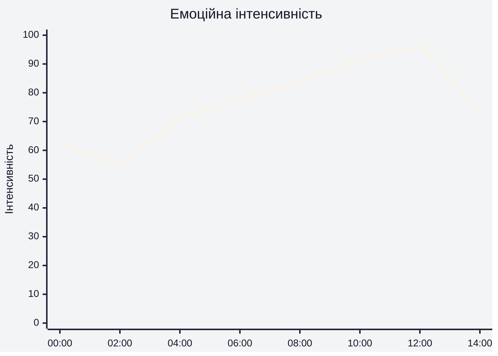
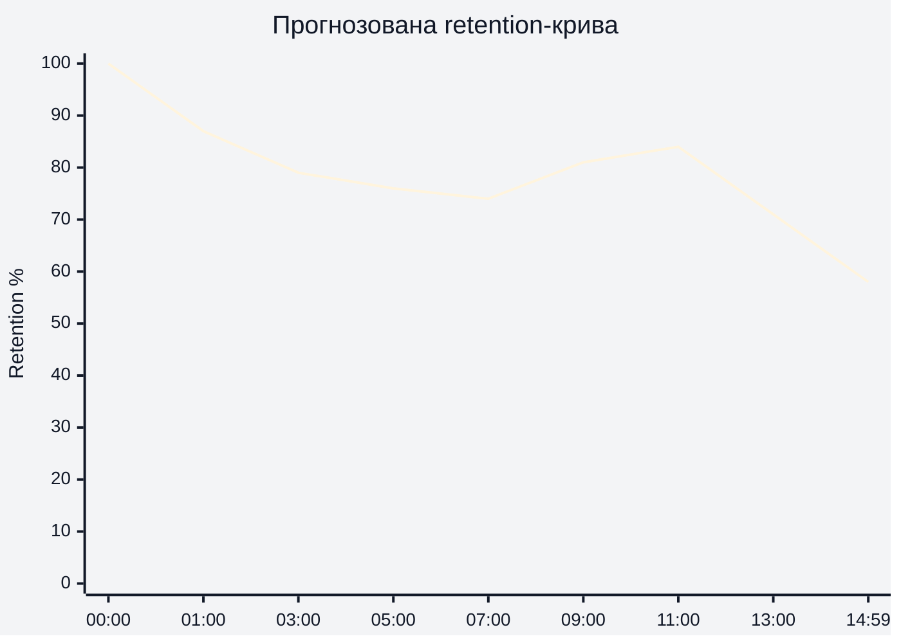
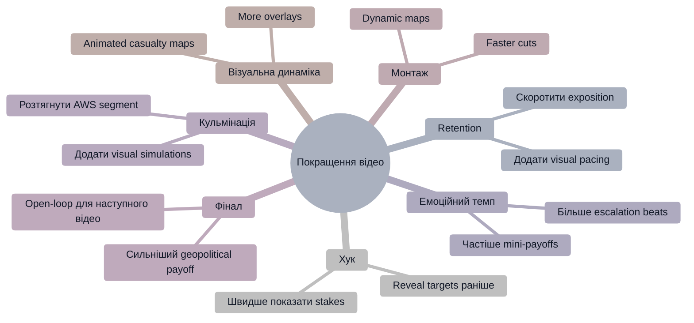

# Аналіз довгоформатного YouTube-відео

## 1. Сюжетна дуга (Narrative Arc)

```mermaid
%%{init: {'theme':'base', 'themeVariables': {
'primaryColor':'#f3f4f6',
'primaryTextColor':'#111827',
'primaryBorderColor':'#2563eb',
'lineColor':'#2563eb',
'secondaryColor':'#ffffff',
'tertiaryColor':'#f3f4f6',
'background':'#f3f4f6'
}}}%%
flowchart LR
    A["00:00–00:40<br/>Хук<br/>Питання: куди Росія могла б завдати ядерного удару по Британії"] -->
    B["00:40–01:30<br/>Експозиція<br/>Пояснення концепції 'Very Bad Things' і рамок аналізу"] -->
    C["01:30–03:20<br/>Перша ескалація<br/>Типи ядерних ударів та operational intent"] -->
    D["03:20–05:30<br/>Переломний момент<br/>Аргументація, чому UK є стратегічною ціллю"] -->
    E["05:30–09:10<br/>Наростання напруги<br/>Покроковий розбір військових цілей"] -->
    F["09:10–12:10<br/>Кульмінація<br/>Удари по портах, нафтопереробці та дата-центрах"] -->
    G["12:10–14:00<br/>Розв’язка<br/>Оцінка гуманітарної катастрофи та реакції НАТО"] -->
    H["14:00–14:59<br/>Фінальний висновок<br/>Теза про ймовірну відповідь Великої Британії"]
```

---

## 2. Ключові Story Beats

```mermaid
%%{init: {'theme':'base', 'themeVariables': {
'primaryColor':'#f3f4f6',
'primaryTextColor':'#111827',
'primaryBorderColor':'#2563eb',
'lineColor':'#2563eb',
'secondaryColor':'#ffffff',
'tertiaryColor':'#f3f4f6',
'background':'#f3f4f6'
}}}%%
flowchart LR
    A["00:08<br/>Головне питання<br/>Створення curiosity gap"] -->
    B["00:42<br/>Very Bad Things rule<br/>Моральне дистанціювання"] -->
    C["01:35<br/>Airburst vs Groundburst<br/>Освітній блок"] -->
    D["02:25<br/>Operational intent РФ<br/>Стратегічна рамка"] -->
    E["04:10<br/>Чому лише 2 ракети<br/>Напруга та логіка сценарію"] -->
    F["05:40<br/>Counterforce vs Countervalue<br/>Ескалація ставки"] -->
    G["06:35<br/>RAF Fylingdales<br/>Початок target list"] -->
    H["07:45<br/>HMNB Clyde / Lakenheath<br/>Військова кульмінація"] -->
    I["09:30<br/>Refineries & ports<br/>Інфраструктурний колапс"] -->
    J["11:10<br/>AWS дата-центри<br/>Найвищий емоційний spike"] -->
    K["12:45<br/>1.2M injured estimate<br/>Гуманітарна кульмінація"] -->
    L["14:15<br/>Чи відповість НАТО?<br/>Фінальний payoff"]
```

---

## 3. Емоційний темп

### Пояснення
- 00:00–02:00: сильний curiosity hook, але ще низька емоційна загроза.
- 04:00–08:00: інтенсивність росте через конкретизацію сценарію удару.
- 09:00–12:00: максимальна напруга через civilian infrastructure та AWS/data centers.
- 12:30–14:00: гуманітарні втрати створюють емоційний peak.

---

## 4. Утримання аудиторії

> Реальні retention-дані не надані. Нижче — прогнозована retention-структура на основі сценарію, pacing та structure analysis.

### Потенційна логіка retention
- Сильне утримання на старті через provocative premise.
- Невеликий спад на technical exposition.
- Retention spikes під час target-by-target breakdown.
- Другий spike — дата-центри та casualty estimates.
- Просідання наприкінці через довгий geopolitical wrap-up.

---

## 5. Піки retention

| Таймкод | Подія | Чому це може утримувати увагу | Сила піку 1–10 |
|---|---|---|---:|
| 00:08 | Формулювання головного питання | Створює curiosity gap та страх | 9 |
| 04:10 | Пояснення “двох ракет” | Контрінтуїтивна логіка | 8 |
| 06:35 | Початок target list | Конкретика та очікування ударів | 9 |
| 07:45 | HMNB Clyde / RAF Lakenheath | Military escalation | 8 |
| 09:30 | Знищення refinery infrastructure | Реальна економічна загроза | 8 |
| 11:10 | AWS дата-центри в Лондоні | Високий shock value | 10 |
| 12:45 | 1.2M injured estimate | Масштаб гуманітарної катастрофи | 10 |
| 14:15 | Чи відповість Британія | Геополітичний payoff | 7 |

---

## 6. Провали retention

| Таймкод | Проблема | Ймовірна причина спаду | Що покращити |
|---|---|---|---|
| 01:30–02:20 | Technical exposition | Забагато термінів поспіль | Додати візуальні анімації |
| 03:00–04:00 | Operational intent | Довгий abstract explanation | Вставити карту або timeline |
| 05:20–05:50 | Counterforce vs countervalue | Теоретичний блок без payoff | Скоротити або дати приклад раніше |
| 13:20–14:00 | НАТО response discussion | Менше нової інформації | Додати escalation scenarios |

---

## 7. Оцінка сегментів

| Сегмент | Таймкод | Функція | Емоційна інтенсивність | Ризик втрати уваги | Оцінка 1–10 | Що покращити |
|---|---|---|---|---|---:|---|
| Хук | 00:00–00:40 | Curiosity trigger | Висока | Низький | 9 | Швидше перейти до target reveal |
| Експозиція | 00:40–02:20 | Контекст | Середня | Середній | 7 | Менше пояснювального тексту |
| Nuclear mechanics | 02:20–03:20 | Освітній блок | Середня | Високий | 6 | Більше візуалізації |
| Operational intent | 03:20–05:20 | Стратегічний framing | Висока | Середній | 8 | Скоротити повтори |
| Military targets | 05:20–08:50 | Escalation | Висока | Низький | 9 | Додати більше карт |
| Infrastructure collapse | 08:50–12:00 | Main payoff | Дуже висока | Низький | 10 | Підсилити pacing монтажем |
| Humanitarian crisis | 12:00–13:30 | Emotional climax | Максимальна | Низький | 10 | Додати visual overlays |
| NATO response | 13:30–14:59 | Resolution | Середня | Середній | 7 | Більш сильний фінальний CTA |

---

## 8. Практичні рекомендації

---

## 9. Підсумкова оцінка

| Показник | Оцінка 1–10 | Коментар |
|---|---:|---|
| Сюжетна дуга | 9 | Сильна escalation structure та clear payoff |
| Story Beats | 9 | Багато retention-oriented reveals |
| Емоційний темп | 8 | Висока напруга, але є exposition dips |
| Retention Structure | 8 | Хороший pacing із кількома theoretical slowdowns |
| Загальна оцінка | 9 | Сильне analytical storytelling із високим curiosity retention |
