# Статистичний аналіз відеозвітів

## 1. Короткий executive summary

| Пункт | Висновок |
|---|---|
| Скільки відео проаналізовано | 1 |
| Скільки форматів відео | 1: `LONG_10_20_MIN` |
| Найсильніше відео за overall score | Video 1 — `UK Limited Nuclear War Target List`, overall score `3.85/5` |
| Найсильніше відео за ER Public % | Video 1 — `2.7099%` |
| Найсильніше відео за views per day | Video 1 — `920.3014` views/day |
| Найсильніша повторювана механіка | `INSUFFICIENT_DATA` для повторюваності між відео; у цьому звіті найсильніша механіка: `STRONG_TOPIC_DEMAND` |
| Найчастіша слабкість | `INSUFFICIENT_DATA` для частотності між відео; у цьому звіті головна слабкість: `COMMENTS_SHOW_TOPIC_GAP` / неповний або спірний target-list у сприйнятті аудиторії |
| Головна стратегічна можливість | Перетворити outlier у серію: follow-up за counterarguments, missed targets і відповідями на коментарі |
| Рівень впевненості | LOW |

**Причина `LOW`:** доступний лише один звіт `YT_VIDEO_ANALYSIS_V1`, тому дозволена тільки описова статистика. Кореляції, міжвідео-патерни та повторюваність механік не обчислюються.

## 2. Якість і повнота даних

| Поле | Кількість відео з даними | Кількість N/A | Коментар |
|---|---:|---:|---|
| views | 1 | 0 | Є public metric |
| likes | 1 | 0 | Є public metric |
| comments_count | 1 | 0 | Є public metric; файл коментарів має 9,638 витягнутих коментарів проти 9,955–9,956 у metadata |
| views_per_day | 1 | 0 | Обчислено у звіті `YT_VIDEO_ANALYSIS_V1` |
| er_public_percent | 1 | 0 | Обчислено у звіті |
| views_per_1k_subs | 1 | 0 | Обчислено у звіті |
| hook_score | 1 | 0 | Є score |
| cta_score | 1 | 0 | Є score |
| ad_integration_score | 1 | 0 | Є score |
| audio_score | 1 | 0 | Є score; MP4 був доступний у попередньому аналізі |
| comment_resonance_score | 1 | 0 | Є score |
| overall_video_score | 1 | 0 | Є score |

### Обмеження аналізу

- Є лише 1 відео, тому всі графіки є описовими, а не порівняльними.
- Кореляції пропущено: потрібно мінімум 5 comparable videos.
- Не можна визначити “найчастіші” механіки або слабкості між відео — тільки описати механіки одного кейсу.
- CTR, impressions, retention, watch time, traffic sources, revenue, subscribers gained — `OWNER_ONLY` / не використовуються.
- Raw reach можна показувати, але стратегічні висновки краще базувати на normalized metrics: views/day, ER Public %, views/1k subs.
- Форматна когорта одна: `LONG_10_20_MIN`; змішування Shorts / live / long-form немає.

## 3. Підготовлена таблиця для графіків

| Video | Format | Views | Views/day | Like Rate % | Comment Rate % | ER Public % | Views/1k subs | Hook | CTA | Ad | Audio | Comment Resonance | Overall |
|---|---|---:|---:|---:|---:|---:|---:|---:|---:|---:|---:|---:|---:|
| Video 1 | LONG_10_20_MIN | 1,218,479 | 920.3014 | 1.8929 | 0.8171 | 2.7099 | 1,160.4562 | 4 | 2 | 3 | 4 | 5 | 3.85 |

| Label | Full title | URL |
|---|---|---|
| Video 1 | UK Limited Nuclear War Target List | N/A |

## 4. Рекомендовані графіки

| # | Назва графіка | Тип графіка | Поля | Для чого потрібен | Пріоритет |
|---:|---|---|---|---|---|
| 1 | Overall score by video | Mermaid bar chart | `overall_video_score` | Побачити загальну оцінку кейсу | HIGH |
| 2 | Views per day by video | Mermaid bar chart | `views_per_day` | Оцінити нормалізовану швидкість набору переглядів | HIGH |
| 3 | ER Public % by video | Mermaid bar chart | `er_public_percent` | Оцінити публічне залучення | HIGH |
| 4 | ER Public % vs Views/day | Таблиця / quadrant note | `er_public_percent`, `views_per_day` | Баланс охоплення і реакції | HIGH |
| 5 | Hook score by video | Mermaid bar chart | `hook_score` | Оцінити силу hook | HIGH |
| 6 | CTA score by video | Mermaid bar chart | `cta_score` | Побачити слабкість CTA-системи | HIGH |
| 7 | Score breakdown heatmap | Matrix table | scores 1–5 | Побачити сильні/слабкі сторони | HIGH |
| 8 | Sentiment distribution | Mermaid pie / table | comment sentiment % | Побачити структуру реакції аудиторії | HIGH |
| 9 | CTA features heatmap | Matrix table | CTA boolean fields | Побачити, яких CTA бракує | HIGH |
| 10 | Ad load % by video | Mermaid bar chart | `ad_load_percent` | Оцінити рекламне навантаження | MEDIUM |
| 11 | Comment clusters | Horizontal-bar style table | cluster %, count | Побачити теми реакції | HIGH |
| 12 | Strengths vs weaknesses count | Mermaid bar chart | success mechanics count, missed opportunities count | Оцінити баланс сильних і слабких сторін | MEDIUM |

## 5. Графіки продуктивності

## 5.1. Views by video

- Назва графіка: Views by video
- Яке питання він відповідає: яке відео має найбільший raw reach?
- Які поля використовуються: `video_label`, `views`
- Тип графіка: Mermaid bar chart
- Що видно з графіка: Video 1 має `1,218,479` views.
- Практичний висновок: raw views підтверджує великий масштаб кейсу, але без інших відео та без нормалізації не можна робити порівняльний висновок.

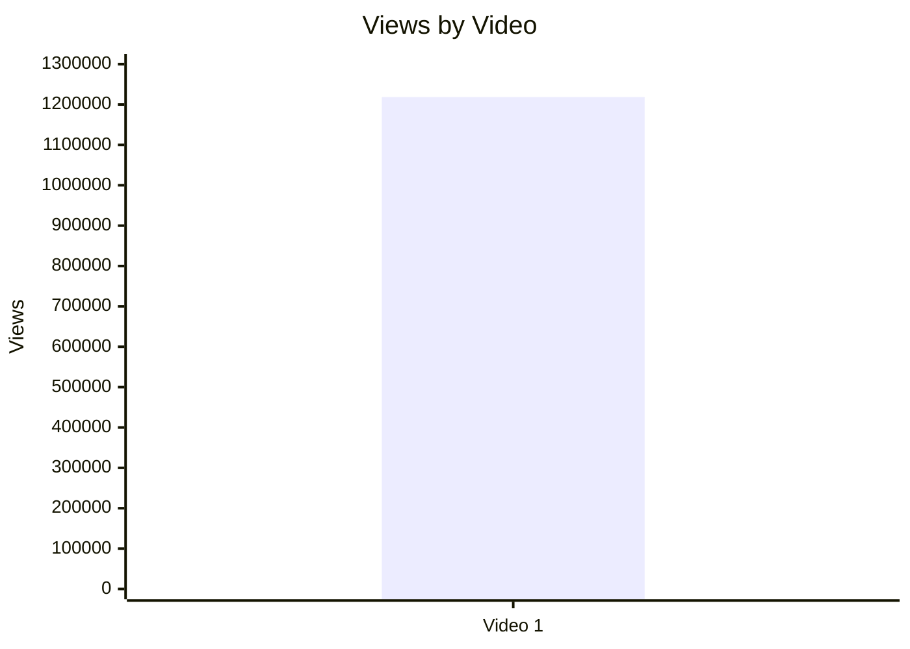

| Video | Views | Коментар |
|---|---:|---|
| Video 1 | 1,218,479 | Raw reach високий у межах одного кейсу; `NOT_COMPARABLE` без інших відео |

## 5.2. Views per day by video

- Назва графіка: Views per day by video
- Яке питання він відповідає: яка нормалізована швидкість набору переглядів?
- Які поля використовуються: `video_label`, `views_per_day`
- Тип графіка: Mermaid bar chart
- Що видно з графіка: Video 1 має `920.3014` views/day.
- Практичний висновок: відео має сильний long-tail discovery, але без когорти не можна визначити percentile або outlier тільки за цим графіком.

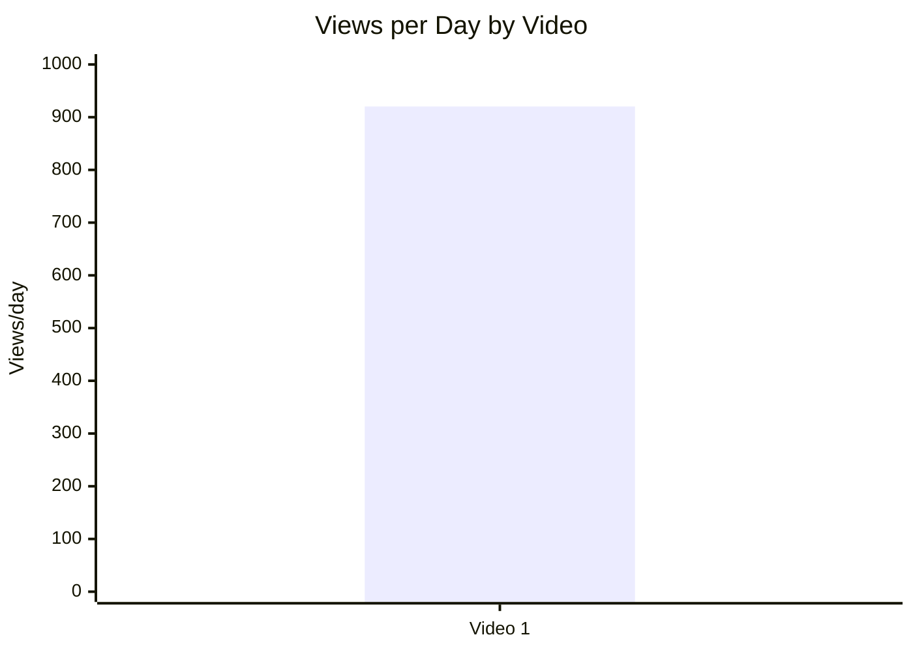

| Video | Views/day | Коментар |
|---|---:|---|
| Video 1 | 920.3014 | Нормалізований reach доступний; порівняння між відео `INSUFFICIENT_DATA` |

## 5.3. Views per 1k subscribers

- Назва графіка: Views per 1k subscribers
- Яке питання він відповідає: наскільки добре відео конвертує розмір каналу в перегляди?
- Які поля використовуються: `video_label`, `views_per_1k_subs`
- Тип графіка: Mermaid bar chart
- Що видно з графіка: Video 1 має `1,160.4562` views per 1k subscribers.
- Практичний висновок: перегляди перевищують кількість підписників у перерахунку на 1k, тобто відео вийшло за межі subscriber-base; однак це описовий висновок без додаткових відео.

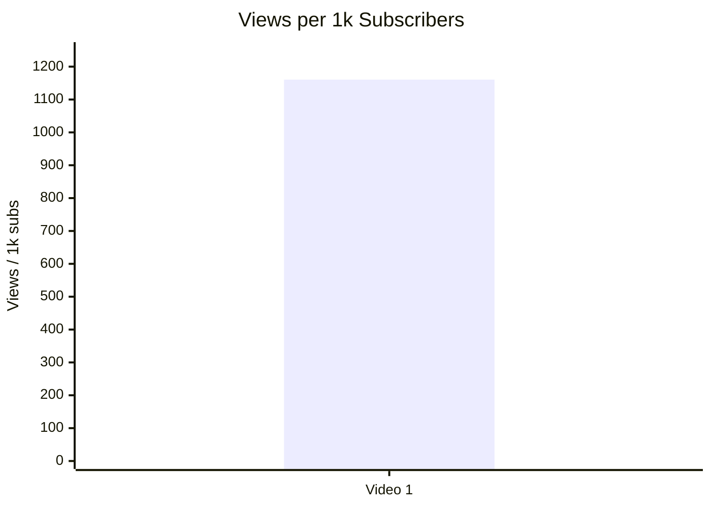

| Video | Views/1k subs | Коментар |
|---|---:|---|
| Video 1 | 1,160.4562 | Показує reach за межами підписників; `LOW_CONFIDENCE` для стратегії без порівняння |

## 5.4. Performance quadrant

- Назва графіка: Performance quadrant
- Яке питання він відповідає: чи відео одночасно має охоплення і залучення?
- Які поля використовуються: `views_per_day`, `er_public_percent`
- Тип графіка: quadrant scatter; для 1 відео подано таблицю, бо межі high/low потребують когорти або benchmark.
- Що видно з графіка: точка одна: `views_per_day = 920.3014`, `ER Public % = 2.7099`.
- Практичний висновок: без 5+ відео або benchmark не можна коректно визначити квадрант; попередньо це сильний кейс для масштабування, але `LOW_CONFIDENCE`.

| Video | Views/day | ER Public % | Quadrant |
|---|---:|---:|---|
| Video 1 | 920.3014 | 2.7099 | `NOT_COMPARABLE` — потрібні пороги когорти |

## 6. Графіки залучення

## 6.1. ER Public % by video

- Назва графіка: ER Public % by video
- Яке питання він відповідає: який рівень публічного engagement?
- Які поля використовуються: `video_label`, `er_public_percent`
- Тип графіка: Mermaid bar chart
- Що видно з графіка: ER Public % = `2.7099`.
- Практичний висновок: відео провокує вимірюване публічне залучення; головний драйвер коментарів — дискусійність теми, але міжвідео-порівняння неможливе.

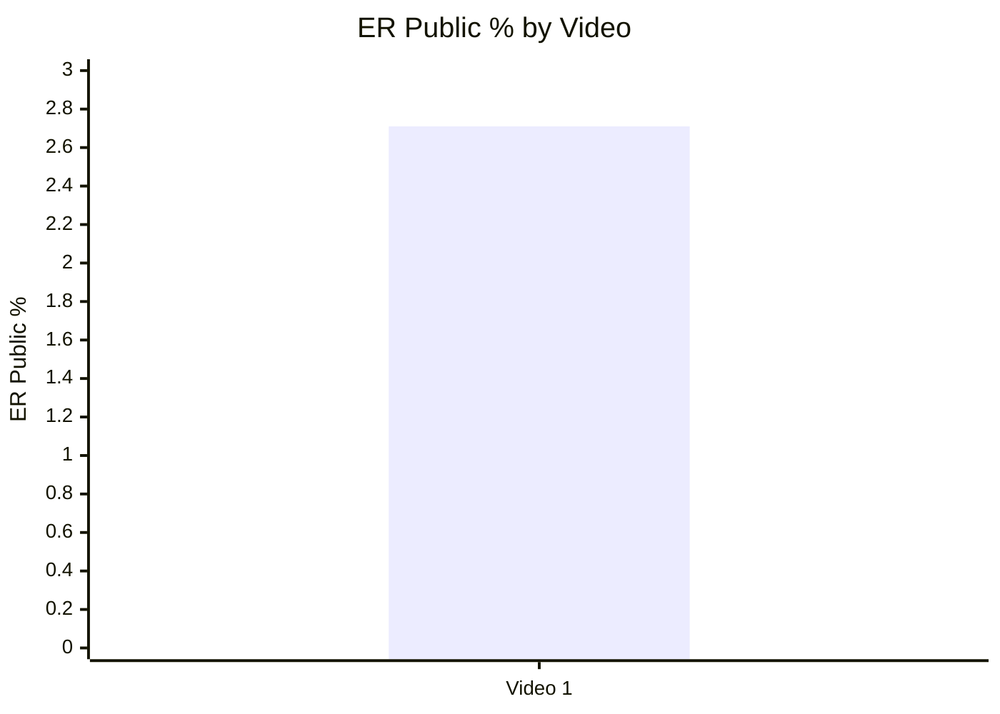

| Video | ER Public % | Likes | Comments | Коментар |
|---|---:|---:|---:|---|
| Video 1 | 2.7099 | 23,064 | 9,956 | Engagement формується з лайків і дуже активних коментарів |

## 6.2. Like Rate % vs Comment Rate %

- Назва графіка: Like Rate % vs Comment Rate %
- Яке питання він відповідає: чи engagement більше схожий на approval чи на дискусію?
- Які поля використовуються: `like_rate_percent`, `comment_rate_percent`
- Тип графіка: scatter; для 1 відео подано точку як таблицю.
- Що видно з графіка: Like Rate % = `1.8929`, Comment Rate % = `0.8171`.
- Практичний висновок: comment rate високий за абсолютною кількістю коментарів, а зміст коментарів показує сильну дискусійність; без benchmark не називаємо це “високим/низьким”.

| Video | Like Rate % | Comment Rate % | Engagement interpretation |
|---|---:|---:|---|
| Video 1 | 1.8929 | 0.8171 | Схоже на дискусійне відео: коментарі не просто praise, а debate / objections / questions |

## 6.3. Comments per 1k views

- Назва графіка: Comments per 1k views
- Яке питання він відповідає: наскільки відео провокує коментарі відносно переглядів?
- Які поля використовуються: `video_label`, `comments_per_1k_views`
- Тип графіка: Mermaid bar chart
- Що видно з графіка: `8.1708` comments per 1k views.
- Практичний висновок: тема має сильний comment-trigger потенціал, але частина коментарів є запереченнями до premise.

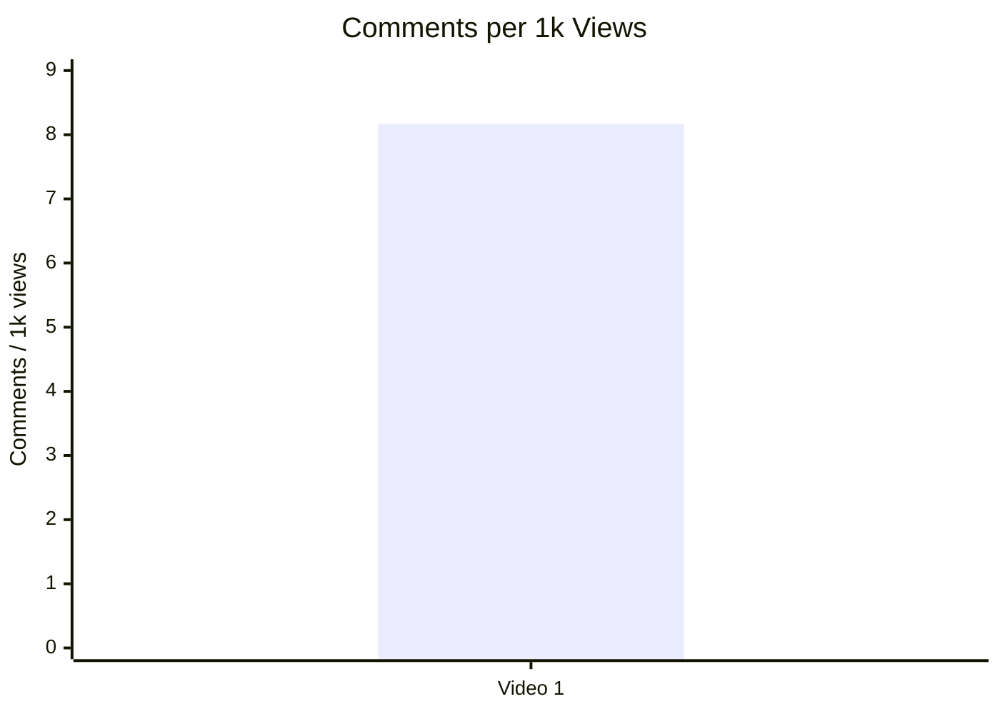

| Video | Comments/1k views | Коментар |
|---|---:|---|
| Video 1 | 8.1708 | Коментарі — ключовий performance сигнал цього відео |

## 7. Графіки структури та hook

## 7.1. Hook score by video

- Назва графіка: Hook score by video
- Яке питання він відповідає: наскільки сильний hook?
- Які поля використовуються: `video_label`, `hook_score`
- Тип графіка: Mermaid bar chart
- Що видно з графіка: hook_score = `4/5`.
- Практичний висновок: direct scenario-question hook є сильною складовою кейсу.


| Video | Hook type | Hook score | Коментар |
|---|---|---:|---|
| Video 1 | QUESTION | 4 | Hook одразу формулює головне питання відео |

## 7.2. Hook type distribution

- Назва графіка: Hook type distribution
- Яке питання він відповідає: які типи hook використовуються?
- Які поля використовуються: `hook_primary_type`, count
- Тип графіка: Mermaid pie chart
- Що видно з графіка: у вибірці один hook type — `QUESTION`.
- Практичний висновок: для цього кейсу `QUESTION` працює як scenario-entry, але повторюваність не доведена.

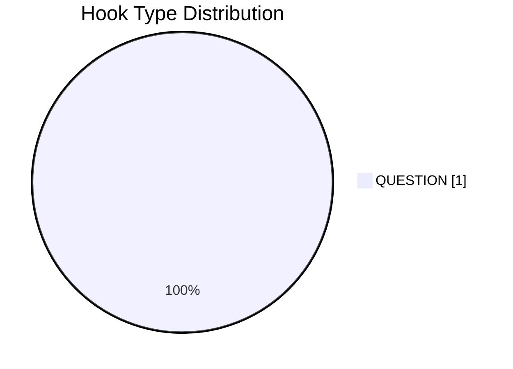

| Hook type | Count | Коментар |
|---|---:|---|
| QUESTION | 1 | `INSUFFICIENT_DATA` для висновку, що цей hook type системно найкращий |

## 7.3. Time to first value vs Overall Score

- Назва графіка: Time to first value vs Overall Score
- Яке питання він відповідає: чи швидша перша цінність пов’язана з вищим результатом?
- Які поля використовуються: `time_to_first_value_seconds`, `overall_video_score`
- Тип графіка: scatter; для 1 відео — таблиця.
- Що видно з графіка: `time_to_first_value ≈ 00:01:20`, тобто приблизно `80` секунд; overall score = `3.85`.
- Практичний висновок: можна тестувати скорочення time-to-first-value, але зв’язок не можна називати кореляцією.

| Video | Time to first value | Seconds | Overall |
|---|---|---:|---:|
| Video 1 | ~00:01:20 | 80 | 3.85 |

## 8. Графіки CTA

## 8.1. CTA score by video

- Назва графіка: CTA score by video
- Яке питання він відповідає: наскільки сильна CTA-система?
- Які поля використовуються: `video_label`, `cta_score`
- Тип графіка: Mermaid bar chart
- Що видно з графіка: CTA score = `2/5`.
- Практичний висновок: CTA — слабке місце кейсу; варто тестувати pinned comment, comment prompt і next-video bridge.

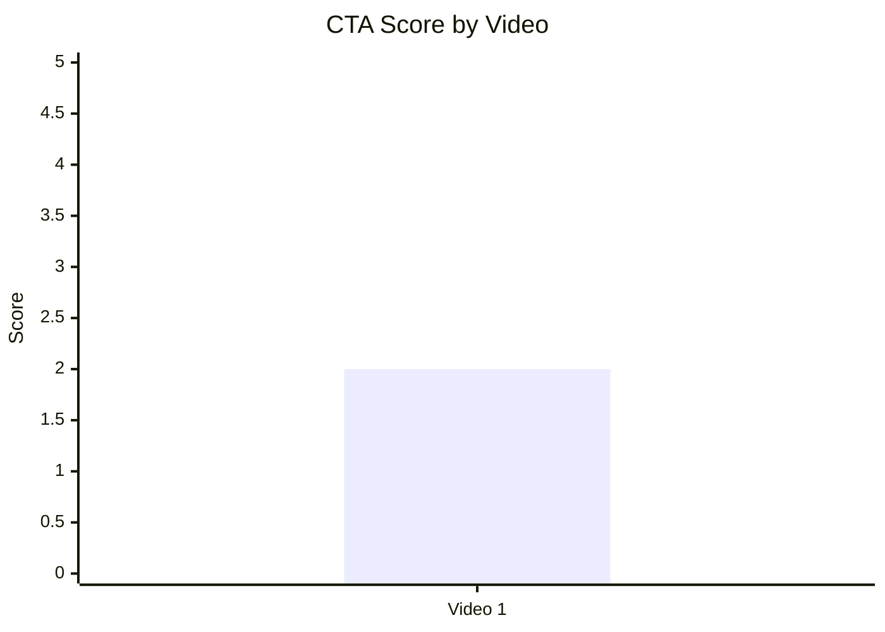

| Video | CTA count | CTA score | Пояснення |
|---|---:|---:|---|
| Video 1 | 3 | 2 | Є resource/description CTA, але немає comment prompt, like/subscription CTA або чіткого next-video bridge |

## 8.2. CTA count vs ER Public %

- Назва графіка: CTA count vs ER Public %
- Яке питання він відповідає: чи більше CTA пов’язано з кращим engagement?
- Які поля використовуються: `cta_count`, `er_public_percent`
- Тип графіка: scatter; для 1 відео — таблиця.
- Що видно з графіка: `cta_count = 3`, `ER Public % = 2.7099`.
- Практичний висновок: зв’язок оцінити неможливо; є якісний висновок, що органічні коментарі високі навіть без comment prompt.

| Video | CTA count | ER Public % | CTA overload risk |
|---|---:|---:|---|
| Video 1 | 3 | 2.7099 | PARTLY — description має багато посилань, але in-stream sponsor overload немає |

## 8.3. CTA features heatmap

- Назва графіка: CTA features heatmap
- Яке питання він відповідає: які CTA-елементи присутні або відсутні?
- Які поля використовуються: `has_comment_prompt`, `has_subscribe_cta`, `has_like_cta`, `has_bell_cta`, `has_next_video_bridge`
- Тип графіка: matrix / heatmap table
- Що видно з графіка: базові engagement CTA відсутні; next-video bridge відсутній.
- Практичний висновок: найбільший CTA-тест — керований comment prompt + pinned comment.

| Video | Comment prompt | Subscribe | Like | Bell | Next video bridge |
|---|---|---|---|---|---|
| Video 1 | ❌ | ❌ | ❌ | ❌ | ❌ |

## 9. Графіки реклами / інтеграцій

Advertising graphs limited: no in-stream sponsor integrations detected. Є description merch/self-promo/resource links, але sponsor ad load = `0.0%`.

## 9.1. Ad load % by video

- Назва графіка: Ad load % by video
- Яке питання він відповідає: чи є рекламне навантаження у відео?
- Які поля використовуються: `ad_load_percent`
- Тип графіка: Mermaid bar chart
- Що видно з графіка: sponsor ad load = `0.0%`.
- Практичний висновок: реклама не пояснює негативні реакції; слабкість не в ad load, а в premise/counterarguments/CTA.

```mermaid
xychart-beta
    title "Ad Load % by Video"
    x-axis ["Video 1"]
    y-axis "Ad Load %" 0 --> 5
    bar [0]
```

| Video | Ad detected | Ad load % | Ad integration score |
|---|---|---:|---:|
| Video 1 | false | 0.0 | 3 |

## 9.2. First ad position %

- Назва графіка: First ad position %
- Яке питання він відповідає: чи реклама стоїть занадто рано?
- Які поля використовуються: `first_ad_relative_position_percent`
- Тип графіка: не будується
- Що видно з графіка: sponsor ad відсутній, `first_ad_time = NOT_APPLICABLE`.
- Практичний висновок: цей графік `NOT_APPLICABLE`; resource CTA був приблизно на `~3.9%`, але це не sponsor ad.

| Video | First sponsor ad time | First sponsor ad position % | Resource CTA position % |
|---|---|---:|---:|
| Video 1 | NOT_APPLICABLE | NOT_APPLICABLE | ~3.9% |

## 9.3. Ad integration score vs ER Public %

- Назва графіка: Ad integration score vs ER Public %
- Яке питання він відповідає: чи якість інтеграції пов’язана з реакцією аудиторії?
- Які поля використовуються: `ad_integration_score`, `er_public_percent`
- Тип графіка: scatter; для 1 відео — таблиця.
- Що видно з графіка: `ad_integration_score = 3`, `ER Public % = 2.7099`.
- Практичний висновок: зв’язок не оцінюється; даних замало.

| Video | Ad integration score | ER Public % | Interpretation |
|---|---:|---:|---|
| Video 1 | 3 | 2.7099 | `INSUFFICIENT_DATA` для зв’язку |

## 10. Графіки аудіо

## 10.1. Audio score by video

- Назва графіка: Audio score by video
- Яке питання він відповідає: чи є аудіо сильним або слабким місцем?
- Які поля використовуються: `audio_score`
- Тип графіка: Mermaid bar chart
- Що видно з графіка: audio_score = `4/5`.
- Практичний висновок: аудіо не виглядає головним бар’єром; більш помітна production/accuracy проблема — pronunciation/naming corrections.

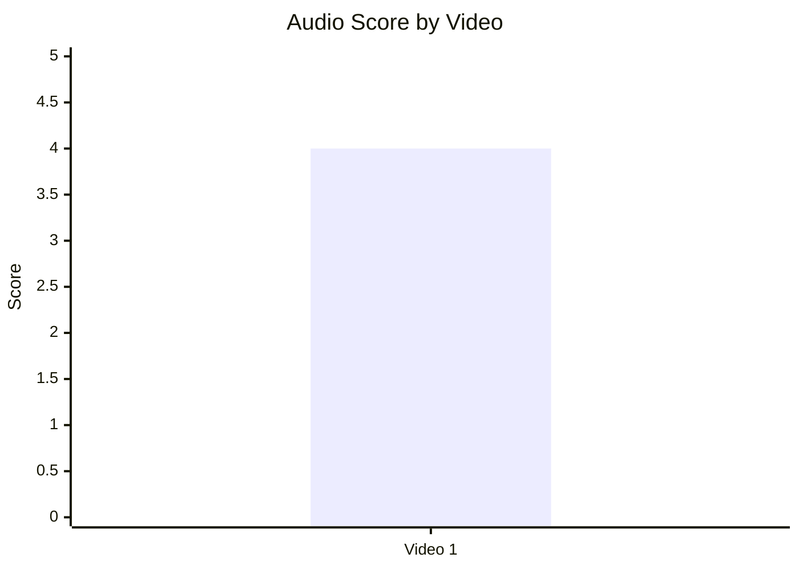

| Video | Audio score | Коментар |
|---|---:|---|
| Video 1 | 4 | Технічно придатне аудіо; немає великого кластера скарг на звук |

## 10.2. Audio score vs Overall Score

- Назва графіка: Audio score vs Overall Score
- Яке питання він відповідає: чи краща якість аудіо пов’язана з вищим overall score?
- Які поля використовуються: `audio_score`, `overall_video_score`
- Тип графіка: scatter; для 1 відео — таблиця.
- Що видно з графіка: audio_score = `4`, overall = `3.85`.
- Практичний висновок: зв’язок не оцінюється; аудіо скоріше підтримує сприйняття, ніж є головною growth-механікою.

| Video | Audio score | Overall |
|---|---:|---:|
| Video 1 | 4 | 3.85 |

## 11. Графіки коментарів

## 11.1. Sentiment distribution

- Назва графіка: Sentiment distribution
- Яке питання він відповідає: яка структура реакції аудиторії?
- Які поля використовуються: `positive_percent`, `negative_percent`, `mixed_percent`, `neutral_percent`, `question_percent`, `request_percent`, `joke_meme_percent`
- Тип графіка: Mermaid pie chart + table
- Що видно з графіка: найбільші категорії — neutral discussion `35.5%`, negative/disagreement `29.7%`, questions `17.7%`.
- Практичний висновок: відео працює як debate engine; для серії потрібен блок відповідей на objections.

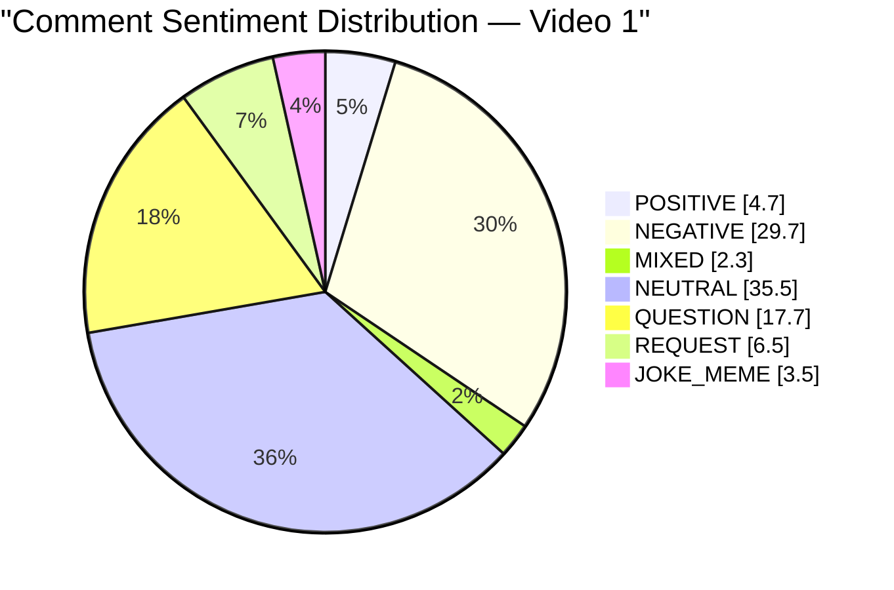

| Sentiment | Count | Percent |
|---|---:|---:|
| POSITIVE | 451 | 4.7% |
| NEGATIVE | 2,862 | 29.7% |
| MIXED | 220 | 2.3% |
| NEUTRAL | 3,424 | 35.5% |
| QUESTION | 1,710 | 17.7% |
| REQUEST | 629 | 6.5% |
| JOKE_MEME | 339 | 3.5% |

## 11.2. Comment resonance score by video

- Назва графіка: Comment resonance score by video
- Яке питання він відповідає: наскільки сильно відео резонує в коментарях?
- Які поля використовуються: `comment_resonance_score`
- Тип графіка: Mermaid bar chart
- Що видно з графіка: comment_resonance_score = `5/5`.
- Практичний висновок: коментарі — найсильніший сигнал відео; next content треба будувати з коментарів.

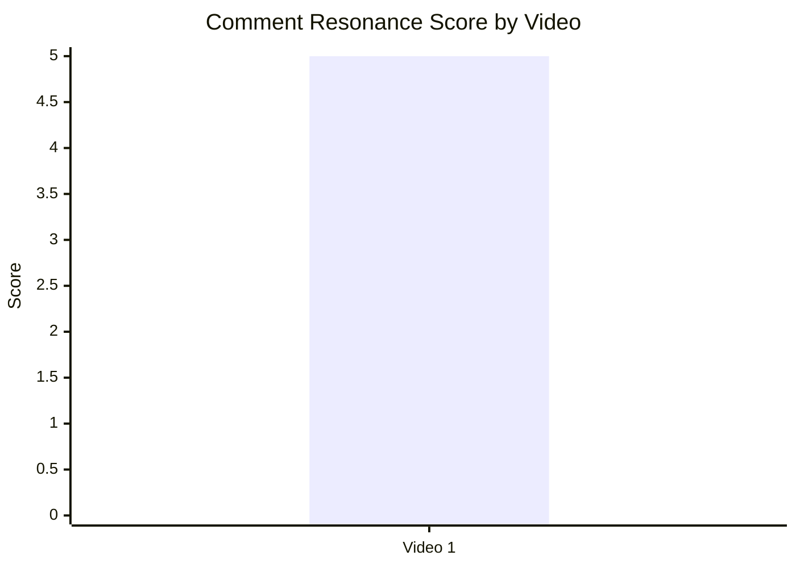

| Video | Comment resonance | Коментар |
|---|---:|---|
| Video 1 | 5 | 9,956 public comments; великий debate/request/question footprint |

## 11.3. Top comment clusters

- Назва графіка: Top comment clusters
- Яке питання він відповідає: що саме обговорює аудиторія?
- Які поля використовуються: cluster name, count, percent
- Тип графіка: horizontal-bar style table
- Що видно з графіка: головні кластери — broad discussion, retaliation/MAD objections, questions.
- Практичний висновок: follow-up має відповідати на objections, а не просто повторювати target-list.

| Rank | Cluster | Count | Percent | Bar |
|---:|---|---:|---:|---|
| 1 | General debate around nuclear scenario | 3,424 | 35.5% | ███████████████████████████████████ |
| 2 | Retaliation / MAD objections | 2,480 | 25.7% | ██████████████████████████ |
| 3 | Clarifying / technical questions | 1,710 | 17.7% | ██████████████████ |
| 4 | Missed targets / accuracy additions | 610 | 6.3% | ██████ |
| 5 | Praise for analysis / interest | 451 | 4.7% | █████ |
| 6 | Jokes / dark humor | 339 | 3.5% | ████ |
| 7 | Personal proximity stories | 220 | 2.3% | ██ |
| 8 | Pronunciation / naming corrections | 186 | 1.9% | ██ |
| 9 | Content criticism / “nonsense” | 108 | 1.1% | █ |
| 10 | Security concern about publishing targets | 88 | 0.9% | █ |

## 12. Графіки score-системи

## 12.1. Overall score by video

- Назва графіка: Overall score by video
- Яке питання він відповідає: яка загальна оцінка відео?
- Які поля використовуються: `overall_video_score`
- Тип графіка: Mermaid bar chart
- Що видно з графіка: overall = `3.85/5`.
- Практичний висновок: сильний кейс із помітними слабкими місцями CTA/counterarguments.

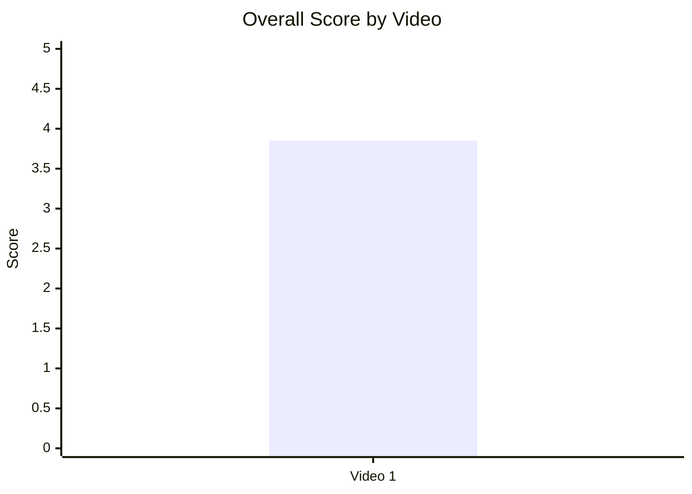

| Video | Overall |
|---|---:|
| Video 1 | 3.85 |

## 12.2. Score breakdown heatmap

- Назва графіка: Score breakdown heatmap
- Яке питання він відповідає: де сильні й слабкі сторони відео?
- Які поля використовуються: `hook_score`, `structure_score`, `value_density_score`, `audio_score`, `cta_score`, `ad_integration_score`, `comment_resonance_score`, `replicability_score`, `overall_video_score`
- Тип графіка: heatmap / matrix table
- Що видно з графіка: найсильніше — comments `5`; найслабше — CTA `2`.
- Практичний висновок: масштабувати треба scenario format і comment-driven follow-up; покращувати CTA architecture.

| Video | Hook | Structure | Value Density | Audio | CTA | Ad | Comments | Replicability | Overall |
|---|---:|---:|---:|---:|---:|---:|---:|---:|---:|
| Video 1 | 4 | 4 | 4 | 4 | 2 | 3 | 5 | 4 | 3.85 |

| Score zone | Значення | Інтерпретація |
|---|---|---|
| 5 | Comments | Максимальний резонанс |
| 4 | Hook, Structure, Value Density, Audio, Replicability | Сильна основа формату |
| 3 | Ad | Нейтрально / не заважає |
| 2 | CTA | Головна зона покращення |

## 12.3. Strengths vs weaknesses count

- Назва графіка: Strengths vs weaknesses count
- Яке питання він відповідає: баланс сильних механік і missed opportunities?
- Які поля використовуються: count of success mechanics, count of missed opportunities
- Тип графіка: Mermaid bar chart
- Що видно з графіка: 5 success mechanics і 5 missed opportunities.
- Практичний висновок: відео сильне не тому, що ідеальне, а тому що тема/структура/дискусійність переважили CTA й premise gaps.

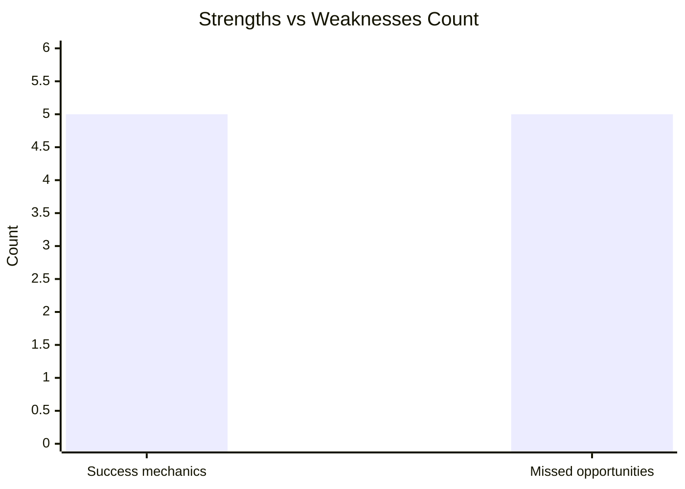

| Category | Count | Top item |
|---|---:|---|
| Success mechanics | 5 | `STRONG_TOPIC_DEMAND` |
| Missed opportunities | 5 | `COMMENTS_SHOW_TOPIC_GAP` |

## 13. Кореляції та патерни

Correlation analysis skipped: fewer than 5 comparable videos.

| Pair | Correlation / Pattern | Strength | Interpretation | Confidence |
|---|---:|---|---|---|
| hook_score → overall_video_score | `INSUFFICIENT_DATA` | N/A | Є тільки 1 відео; кореляція неможлива | LOW |
| value_density_score → er_public_percent | `INSUFFICIENT_DATA` | N/A | Є тільки 1 відео | LOW |
| cta_score → comment_rate_percent | `INSUFFICIENT_DATA` | N/A | Відео має низький CTA score і високу comment activity, але це не зв’язок, а один кейс | LOW |
| comment_resonance_score → er_public_percent | `INSUFFICIENT_DATA` | N/A | Потрібно 5+ відео | LOW |
| views_per_day → er_public_percent | `INSUFFICIENT_DATA` | N/A | Потрібна когорта | LOW |
| ad_load_percent → er_public_percent | `INSUFFICIENT_DATA` | N/A | Sponsor ad load = 0, порівняння неможливе | LOW |
| time_to_first_value_seconds → overall_video_score | `INSUFFICIENT_DATA` | N/A | Можна тестувати, але не робити статистичний висновок | LOW |

Попередні патерни для одного кейсу:

| Pattern | Дані | Обмеження | Confidence |
|---|---|---|---|
| Debate-driven comments | 2,480 retaliation/MAD objections + 3,424 general debate comments | Один ролик, чутлива тема | LOW |
| Strong hook + high resonance | hook_score 4, comment_resonance_score 5 | Немає порівняння з іншими hook types | LOW |
| CTA missed opportunity | CTA score 2, comment prompt absent, comments_count 9,956 | Не доводить причинність | LOW |
| Follow-up demand | 610 missed target comments + 19 direct update requests | Частково це критика, не тільки попит | LOW |

## 14. Висновки для контент-стратегії

| Спостереження | Дані / графік | Що це означає | Що робити |
|---|---|---|---|
| Scenario-question hook працює як сильний entry point у цьому кейсі | Hook type `QUESTION`, hook_score `4` | Глядач одразу розуміє premise і очікує payoff | Тестувати opening у форматі “Що буде, якщо X?” + обіцяти структуру відповіді |
| Коментарі — головний asset відео | Comment resonance `5`, 9,956 comments, топ-кластери debate/questions/requests | Відео створило не тільки перегляд, а дискусію | Робити follow-up “Answering the top objections/comments” |
| Найбільший gap — контраргументи до premise | 2,480 comments про retaliation/MAD/Article 5/Trident | Частина аудиторії не прийняла базове припущення | У майбутніх сценарних відео додавати блок “Why this scenario may fail” до середини відео |
| CTA-система слабка | CTA score `2`; comment prompt/sub/like/bell/next bridge відсутні | Органічний engagement високий, але не спрямований | Додати pinned comment з конкретним питанням і verbal bridge до наступного відео |
| Ad load не є проблемою | ad_load_percent `0.0%`; no sponsor read detected | Немає доказу, що реклама шкодила темпу | Не змінювати ad load як пріоритет; фокус на structure/CTA/counterarguments |
| Аудіо достатньо сильне, але naming accuracy створила шум | audio_score `4`; 186 corrections щодо pronunciation/naming | Production issue не в звуку, а в локальній точності | Додати pronunciation checklist для топонімів |
| Outlier може змішувати аудиторію каналу | Звіт позначає topic mismatch: automotive vs military/nuclear analysis | Віральне відео може привести аудиторію, яка не дивиться core content | Виділити geopolitical analysis у playlist/series або окремий канал |

## 15. Що тестувати далі

| Тест | Гіпотеза | На яких даних базується | Як виміряти | Пріоритет |
|---|---|---|---|---|
| Pinned comment із питанням | Керований comment prompt підвищить якість дискусії | Немає comment prompt; 9,956 comments; CTA score 2 | Comment rate, частка релевантних відповідей, replies на pinned comment | HIGH |
| Counterarguments block у першій третині | Зменшить perceived credibility gap без втрати debate | 2,480 retaliation/MAD objections | Частка negative/disagreement comments, average sentiment, утримання в середині відео якщо доступне | HIGH |
| Follow-up “Top objections answered” | Перетворить outlier у серію | 610 missed-target requests + 1,710 questions | Views/day follow-up, comments per 1k views, returning viewers якщо доступно | HIGH |
| Shorter time to first value | Швидший payoff може покращити early retention | time_to_first_value ~80s; retention `OWNER_ONLY` | A/B через схожі відео: time_to_first_value vs views/day/ER | MEDIUM |
| End-screen bridge до наступного відео | Підвищить session continuation | no_next_video_bridge; CTA score 2 | End screen CTR `OWNER_ONLY`, views on next video, playlist starts | MEDIUM |
| Pronunciation/name validation checklist | Зменшить accuracy-noise у коментарях | 186 naming/pronunciation corrections | Кількість pronunciation corrections на 1k comments | MEDIUM |
| Серійний формат “scenario → counterarguments → response” | Збере аудиторію навколо повторюваної структури | Success mechanics: clear hook, high value density, controversy/debate | Порівняти 5+ відео за views/day, ER Public %, comment resonance | HIGH |
| Description cleanup | Зменшить CTA overload і зробить resource CTA зрозумілішим | Description має merch, slides, credits, playlist, Twitter, donations, Discord | Click distribution `OWNER_ONLY`; qualitative comment feedback | LOW |

## 16. Дані для експорту в таблицю / CSV

| video_label | title | format_group | views | views_per_day | like_rate_percent | comment_rate_percent | er_public_percent | views_per_1k_subs | hook_type | hook_score | cta_count | cta_score | ad_load_percent | ad_integration_score | audio_score | comment_resonance_score | overall_video_score | top_success_mechanic | top_missed_opportunity |
|---|---|---|---:|---:|---:|---:|---:|---:|---|---:|---:|---:|---:|---:|---:|---:|---:|---|---|
| Video 1 | UK Limited Nuclear War Target List | LONG_10_20_MIN | 1218479 | 920.3014 | 1.8929 | 0.8171 | 2.7099 | 1160.4562 | QUESTION | 4 | 3 | 2 | 0.0 | 3 | 4 | 5 | 3.85 | STRONG_TOPIC_DEMAND | COMMENTS_SHOW_TOPIC_GAP |

CSV-ready:

```csv
video_label,title,format_group,views,views_per_day,like_rate_percent,comment_rate_percent,er_public_percent,views_per_1k_subs,hook_type,hook_score,cta_count,cta_score,ad_load_percent,ad_integration_score,audio_score,comment_resonance_score,overall_video_score,top_success_mechanic,top_missed_opportunity
Video 1,UK Limited Nuclear War Target List,LONG_10_20_MIN,1218479,920.3014,1.8929,0.8171,2.7099,1160.4562,QUESTION,4,3,2,0.0,3,4,5,3.85,STRONG_TOPIC_DEMAND,COMMENTS_SHOW_TOPIC_GAP
```
