# Статистичний аналіз відеозвітів

## 1. Короткий executive summary

| Пункт | Висновок |
|---|---|
| Скільки відео проаналізовано | 1 |
| Скільки форматів відео | 1 (`LONG_10_20_MIN`) |
| Найсильніше відео за overall score | Video 1 (`3.71`) |
| Найсильніше відео за ER Public % | Video 1 (`8.68%`) |
| Найсильніше відео за views per day | Video 1 (`2274.14`) |
| Найсильніша повторювана механіка | `INSUFFICIENT_DATA` (лише 1 відео) |
| Найчастіша слабкість | `INSUFFICIENT_DATA` (лише 1 відео) |
| Головна стратегічна можливість | Масштабувати формат “QUESTION hook + evidence chain + debate-trigger” |
| Рівень впевненості | LOW |

## 2. Якість і повнота даних

| Поле | Кількість відео з даними | Кількість N/A | Коментар |
|---|---:|---:|---|
| views | 1 | 0 | Є в Comparable Summary JSON |
| likes | 1 | 0 | Є |
| comments_count | 1 | 0 | Є |
| views_per_day | 1 | 0 | Є |
| er_public_percent | 1 | 0 | Є |
| views_per_1k_subs | 1 | 0 | Є |
| hook_score | 1 | 0 | Є |
| cta_score | 1 | 0 | Є |
| ad_integration_score | 1 | 0 | Є |
| audio_score | 0 | 1 | `AUDIO_NOT_PROVIDED` |
| comment_resonance_score | 1 | 0 | Є |
| overall_video_score | 1 | 0 | Є |

### Обмеження аналізу

- Вибірка: 1 відео, тому лише описова статистика (`LOW_CONFIDENCE`).
- `NO_TIMECODES`: неможливо конвертувати `time_to_first_value` у секунди.
- `AUDIO_NOT_PROVIDED`: неможливі аудіо-порівняння.

## 3. Підготовлена таблиця для графіків

| Video | Format | Views | Views/day | Like Rate % | Comment Rate % | ER Public % | Views/1k subs | Hook | CTA | Ad | Audio | Comment Resonance | Overall |
|---|---|---:|---:|---:|---:|---:|---:|---:|---:|---:|---:|---:|---:|
| Video 1 | LONG_10_20_MIN | 1517323 | 2274.14 | 7.96 | 0.72 | 8.68 | 1445.07 | 4 | 3 | 3 | N/A | 4 | 3.71 |

| Label | Full title | URL |
|---|---|---|
| Video 1 | Who is End Wokeness? | https://www.youtube.com/watch?v=8zZeZFs5KLQ |

## 4. Рекомендовані графіки

| # | Назва графіка | Тип графіка | Поля | Для чого потрібен | Пріоритет |
|---:|---|---|---|---|---|
| 1 | Overall score by video | Bar chart | overall_video_score | Бачити силу відео | HIGH |
| 2 | Views per day by video | Bar chart | views_per_day | Оцінка темпу набору | HIGH |
| 3 | ER Public % by video | Bar chart | er_public_percent | Оцінка залучення | HIGH |
| 4 | Score breakdown heatmap | Heatmap | score-блок | Сильні/слабкі сторони | HIGH |
| 5 | CTA features heatmap | Matrix | CTA binary features | CTA-профіль | HIGH |
| 6 | ER Public vs Views/day | Scatter | er_public_percent, views_per_day | Квадрант продуктивності | MEDIUM |
| 7 | Sentiment distribution | Stacked bar | sentiment % | Профіль реакції коментарів | MEDIUM |
| 8 | Ad load % by video | Bar chart | ad_load_percent | Аналіз ad pressure | LOW (`INSUFFICIENT_DATA`) |

## 5. Графіки продуктивності

### 5.1. Views by video

- Назва графіка: `Views by Video`
- Яке питання він відповідає: Яке відео має найбільший raw reach?
- Які поля використовуються: `video_label`, `views`
- Тип графіка: Bar chart
- Що видно з графіка: лише `Video 1 = 1,517,323`
- Практичний висновок: raw reach високий, але без порівняння з іншими відео висновок `LOW_CONFIDENCE`.

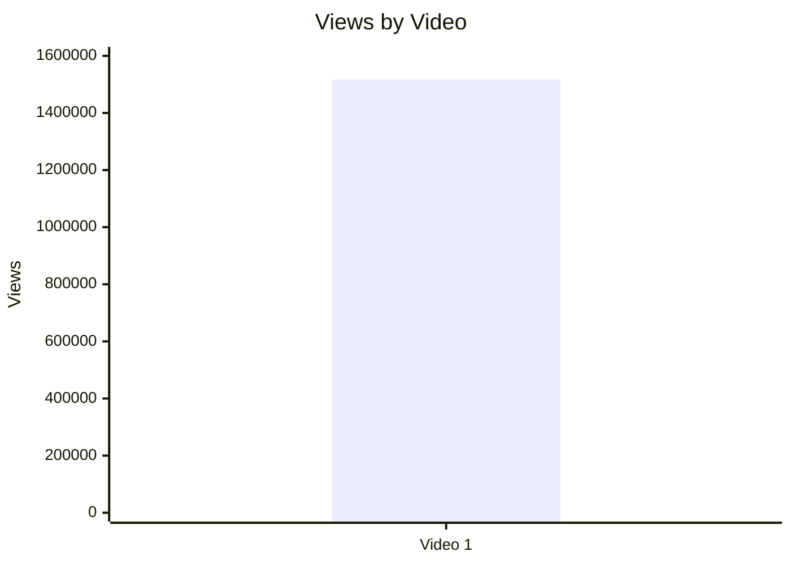

### 5.2. Views per day by video

- Назва графіка: `Views per Day by Video`
- Яке питання він відповідає: Яка швидкість набору переглядів з урахуванням віку?
- Які поля використовуються: `video_label`, `views_per_day`
- Тип графіка: Bar chart
- Що видно з графіка: `Video 1 = 2274.14`
- Практичний висновок: метрика придатна як базова точка для майбутніх відео цієї ж когорти.

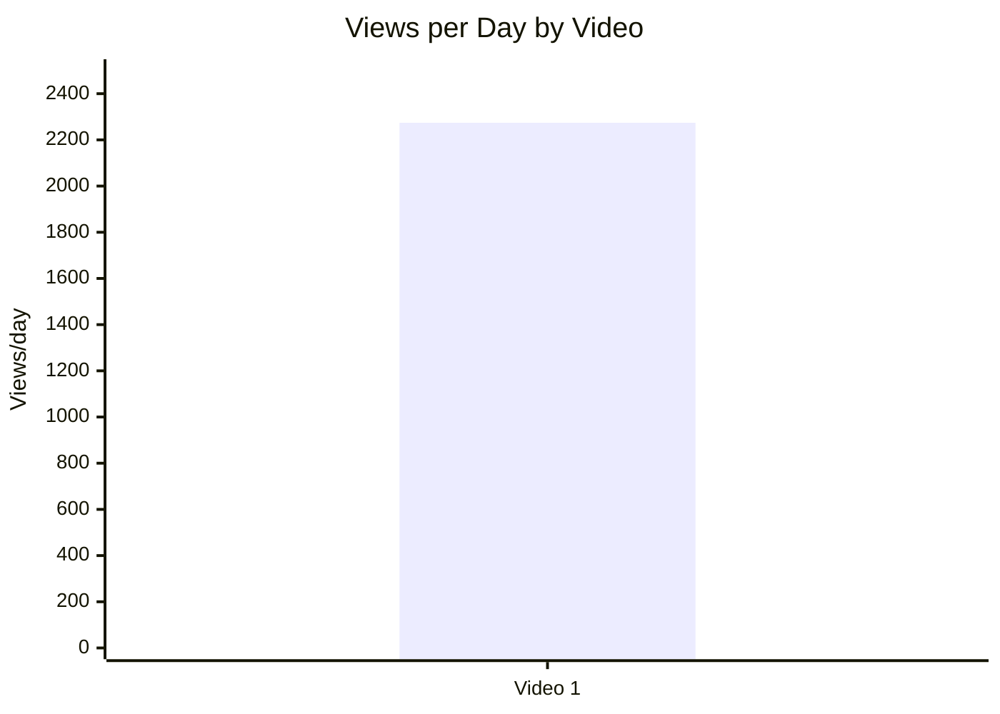

### 5.3. Views per 1k subscribers

- Назва графіка: `Views per 1k Subscribers`
- Яке питання він відповідає: Наскільки відео конвертує розмір каналу в перегляди?
- Які поля використовуються: `video_label`, `views_per_1k_subs`
- Тип графіка: Bar chart
- Що видно з графіка: `Video 1 = 1445.07`
- Практичний висновок: сильна конверсія для одного кейсу; потрібні ще відео для порогу/benchmark.

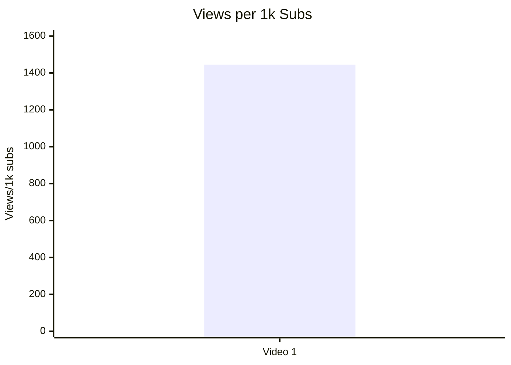

### 5.4. Performance quadrant

- Назва графіка: `Performance Quadrant`
- Яке питання він відповідає: Баланс охоплення (`views_per_day`) і залучення (`er_public_percent`)
- Які поля використовуються: `views_per_day`, `er_public_percent`
- Тип графіка: Scatter plot (manual)
- Що видно з графіка: одна точка
- Практичний висновок: `INSUFFICIENT_DATA` для квадрантного порівняння.

| video_label | views_per_day | er_public_percent | quadrant |
|---|---:|---:|---|
| Video 1 | 2274.14 | 8.68 | NOT_COMPARABLE (single-point) |

## 6. Графіки залучення

### 6.1. ER Public % by video

- Назва графіка: `ER Public % by Video`
- Яке питання він відповідає: Яке відео має найвищу публічну взаємодію?
- Які поля використовуються: `video_label`, `er_public_percent`
- Тип графіка: Bar chart
- Що видно з графіка: `Video 1 = 8.68%`
- Практичний висновок: висока база залучення для повторення формату.

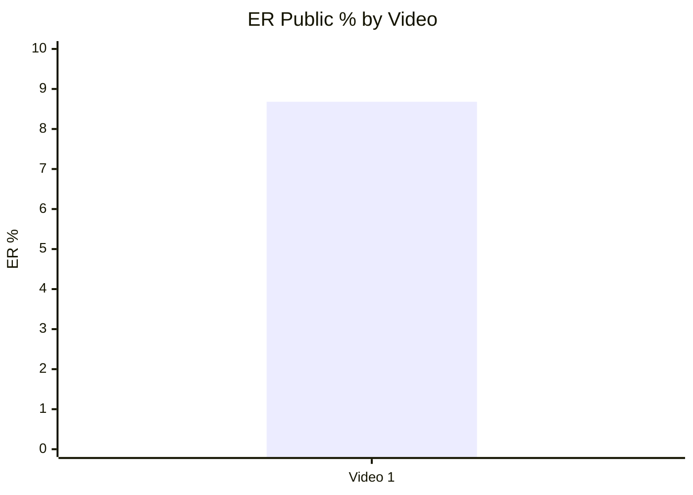

### 6.2. Like Rate % vs Comment Rate %

- Назва графіка: `Like Rate vs Comment Rate`
- Яке питання він відповідає: Чи відео більше “подобається” чи більше “дискусійне”?
- Які поля використовуються: `like_rate_percent`, `comment_rate_percent`
- Тип графіка: Scatter plot (manual)
- Що видно з графіка: точка `(7.96, 0.72)` — high like, помірний comment
- Практичний висновок: контент викликає реакцію і симпатію; без мультивідео — `LOW_CONFIDENCE`.

| video_label | like_rate_percent | comment_rate_percent | interpretation |
|---|---:|---:|---|
| Video 1 | 7.96 | 0.72 | High like + moderate/high discussion |

### 6.3. Comments per 1k views

- Назва графіка: `Comments per 1k Views`
- Яке питання він відповідає: Які відео найкраще провокують реакцію?
- Які поля використовуються: `video_label`, `comments_per_1k_views`
- Тип графіка: Bar chart
- Що видно з графіка: `Video 1 = 7.16`
- Практичний висновок: сильний discussion trigger для long-form кейсу.

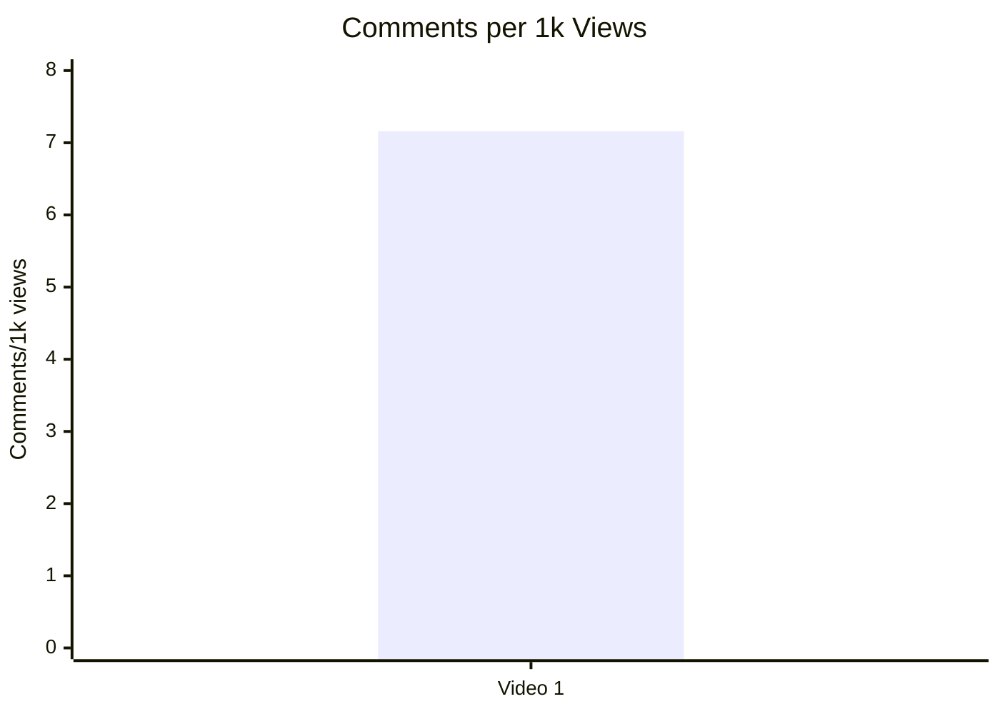

## 7. Графіки структури та hook

### 7.1. Hook score by video

- Назва графіка: `Hook Score by Video`
- Яке питання він відповідає: Якість відкриття відео
- Які поля використовуються: `video_label`, `hook_score`
- Тип графіка: Bar chart
- Що видно з графіка: `Video 1 = 4`
- Практичний висновок: варто масштабувати QUESTION-first hook.

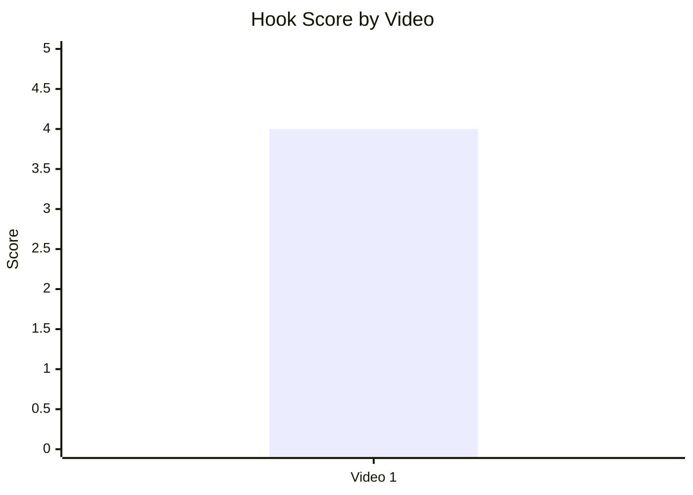

### 7.2. Hook type distribution

- Назва графіка: `Hook Type Distribution`
- Яке питання він відповідає: Які hook типи домінують?
- Які поля використовуються: `hook_primary_type`, count
- Тип графіка: Pie chart
- Що видно з графіка: 100% `QUESTION`
- Практичний висновок: висновок лише попередній (`LOW_CONFIDENCE`).

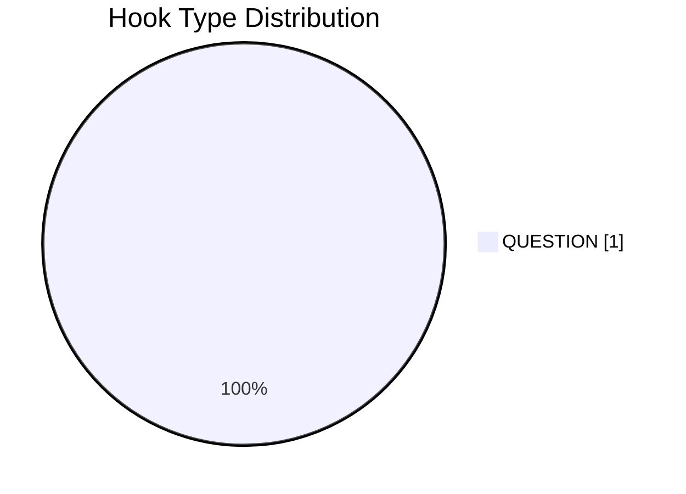

### 7.3. Time to first value vs Overall Score

- Назва графіка: `Time to First Value vs Overall Score`
- Яке питання він відповідає: Чи швидша перша цінність пов’язана з вищим score?
- Які поля використовуються: `time_to_first_value_seconds`, `overall_video_score`
- Тип графіка: Scatter
- Що видно з графіка: `INSUFFICIENT_DATA` (`NO_TIMECODES`, немає секунд)
- Практичний висновок: потрібні таймкоди в майбутніх звітах.

## 8. Графіки CTA

### 8.1. CTA score by video

- Назва графіка: `CTA Score by Video`
- Яке питання він відповідає: Якість CTA-реалізації
- Які поля використовуються: `video_label`, `cta_score`
- Тип графіка: Bar chart
- Що видно з графіка: `Video 1 = 3`
- Практичний висновок: робочий CTA-блок, але є запас (comment prompt, спрощення стеку).

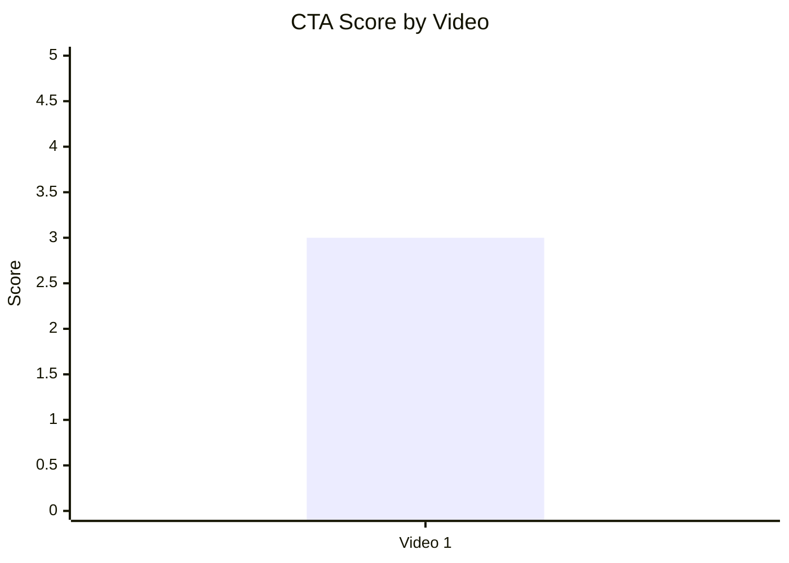

### 8.2. CTA count vs ER Public %

- Назва графіка: `CTA Count vs ER Public %`
- Яке питання він відповідає: Чи більша кількість CTA пов’язана із залученням?
- Які поля використовуються: `cta_count`, `er_public_percent`
- Тип графіка: Scatter (manual)
- Що видно з графіка: одна точка `(5, 8.68)`
- Практичний висновок: `INSUFFICIENT_DATA` для зв’язку/перенавантаження.

| video_label | cta_count | er_public_percent |
|---|---:|---:|
| Video 1 | 5 | 8.68 |

### 8.3. CTA features heatmap

- Назва графіка: `CTA Features Heatmap`
- Яке питання він відповідає: Які CTA-функції реально використані?
- Які поля використовуються: `has_comment_prompt`, `has_subscribe_cta`, `has_like_cta`, `has_bell_cta`, `has_next_video_bridge`
- Тип графіка: Matrix
- Що видно з графіка: є only next-video bridge, немає core engagement prompts
- Практичний висновок: головний недобір — відсутність comment prompt.

| Video | Comment prompt | Subscribe | Like | Bell | Next video bridge |
|---|---|---|---|---|---|
| Video 1 | ❌ | ❌ | ❌ | ❌ | ✅ |

## 9. Графіки реклами / інтеграцій

### 9.1. Ad load % by video

- Назва графіка: `Ad Load % by Video`
- Яке питання він відповідає: Яке рекламне навантаження?
- Які поля використовуються: `ad_load_percent`
- Тип графіка: Bar chart
- Що видно з графіка: `N/A`
- Практичний висновок: `INSUFFICIENT_DATA` (немає ad duration/precise timestamps).

| video_label | ad_detected | ad_count | ad_load_percent |
|---|---|---:|---|
| Video 1 | YES | 2 | N/A |

### 9.2. First ad position %

- Назва графіка: `First Ad Relative Position`
- Яке питання він відповідає: Наскільки рано з’являється перша реклама?
- Які поля використовуються: `first_ad_relative_position_percent`
- Тип графіка: Bar/Scatter
- Що видно з графіка: `N/A`
- Практичний висновок: `INSUFFICIENT_DATA`.

### 9.3. Ad integration score vs ER Public %

- Назва графіка: `Ad Integration Score vs ER`
- Яке питання він відповідає: Чи пов’язана якість інтеграції з реакцією?
- Які поля використовуються: `ad_integration_score`, `er_public_percent`
- Тип графіка: Scatter (manual)
- Що видно з графіка: одна точка `(3, 8.68)`
- Практичний висновок: лише baseline, без pattern.

| video_label | ad_integration_score | er_public_percent |
|---|---:|---:|
| Video 1 | 3 | 8.68 |

## 10. Графіки аудіо

Audio graphs skipped: `AUDIO_NOT_PROVIDED`.

| Причина | Статус |
|---|---|
| audio_score | N/A |
| audio severity metrics | INSUFFICIENT_DATA |
| audio vs overall | INSUFFICIENT_DATA |

## 11. Графіки коментарів

### 11.1. Sentiment distribution

- Назва графіка: `Sentiment Distribution`
- Яке питання він відповідає: Який профіль реакції в коментарях?
- Які поля використовуються: `positive_percent`, `negative_percent`, `neutral_percent`, `question_percent`, `request_percent` (+ `joke_meme_percent`)
- Тип графіка: Stacked bar
- Що видно з графіка: домінує `NEUTRAL (68.86%)`, далі `POSITIVE (11.23%)`
- Практичний висновок: відео більше генерує дискусію, ніж однозначну емоційну полярність.

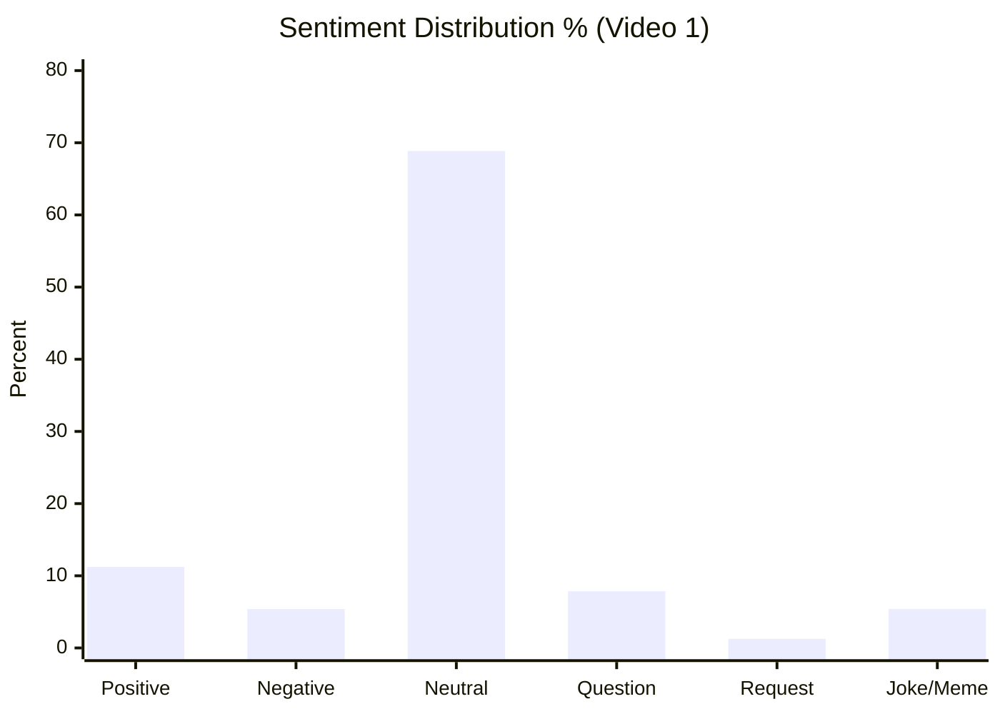

### 11.2. Comment resonance score by video

- Назва графіка: `Comment Resonance Score`
- Яке питання він відповідає: Наскільки сильно відео викликає коментарну реакцію?
- Які поля використовуються: `comment_resonance_score`
- Тип графіка: Bar
- Що видно з графіка: `Video 1 = 4`
- Практичний висновок: тема добре запускає обговорення.

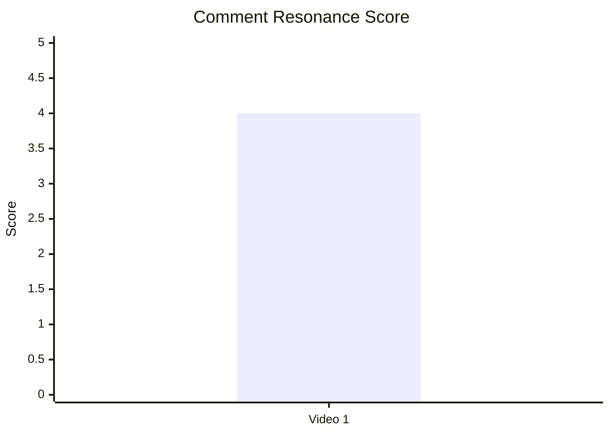

### 11.3. Top comment clusters

- Назва графіка: `Top Comment Clusters`
- Яке питання він відповідає: Які теми переважають у дискусії?
- Які поля використовуються: `cluster/topic`, `count`, `%`
- Тип графіка: Horizontal bar (table-ready)
- Що видно з графіка: домінує `COMMUNITY_DISCUSSION (68.43%)`
- Практичний висновок: контент працює як debate-engine; є сенс додавати framing-коментар від автора.

| Cluster | Count | % of relevant comments |
|---|---:|---:|
| COMMUNITY_DISCUSSION | 6788 | 68.43% |
| QUESTION_CLARIFICATION | 1627 | 16.40% |
| PRAISE_CONTENT | 716 | 7.22% |
| CRITICISM_ACCURACY | 543 | 5.47% |
| REQUEST_MORE_CONTENT | 95 | 0.96% |
| SPONSOR_REACTION | 83 | 0.84% |

## 12. Графіки score-системи

### 12.1. Overall score by video

- Назва графіка: `Overall Score by Video`
- Яке питання він відповідає: Загальна сила відео
- Які поля використовуються: `overall_video_score`
- Тип графіка: Bar
- Що видно з графіка: `3.71/5`
- Практичний висновок: сильний результат у межах одного кейсу.

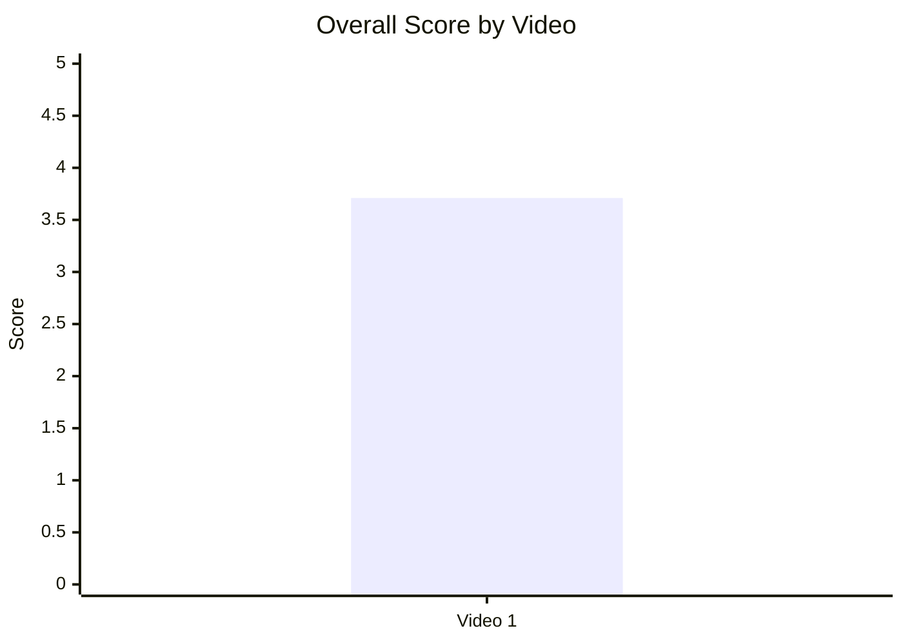

### 12.2. Score breakdown heatmap

- Назва графіка: `Score Breakdown Heatmap`
- Яке питання він відповідає: Які підсистеми тягнуть результат вгору/вниз?
- Які поля використовуються: score-блок
- Тип графіка: Heatmap (table representation)
- Що видно з графіка: сильні Hook/Structure/Value/Comments; слабше CTA/Ad; Audio N/A
- Практичний висновок: головний резерв — CTA і ad integration polish.

| Video | Hook | Structure | Value Density | Audio | CTA | Ad | Comments | Replicability | Overall |
|---|---:|---:|---:|---:|---:|---:|---:|---:|---:|
| Video 1 | 4 | 4 | 4 | N/A | 3 | 3 | 4 | 4 | 3.71 |

### 12.3. Strengths vs weaknesses count

- Назва графіка: `Strengths vs Weaknesses Count`
- Яке питання він відповідає: Баланс сильних механік та слабких місць
- Які поля використовуються: `success_mechanics_count`, `missed_opportunities_count`
- Тип графіка: Stacked bar / bar
- Що видно з графіка: `5 vs 5`
- Практичний висновок: формат сильний, але є чіткий набір оптимізацій.

| video_label | success_mechanics_count | missed_opportunities_count |
|---|---:|---:|
| Video 1 | 5 | 5 |

## 13. Кореляції та патерни

Correlation analysis skipped: fewer than 5 comparable videos.

| Pair | Correlation / Pattern | Strength | Interpretation | Confidence |
|---|---:|---|---|---|
| hook_score → overall_video_score | NOT_COMPARABLE | LOW | Один datapoint, зв’язок не рахується | LOW |
| value_density_score → er_public_percent | NOT_COMPARABLE | LOW | Лише базова фіксація значень | LOW |
| cta_score → comment_rate_percent | NOT_COMPARABLE | LOW | Немає міжвідео-варіативності | LOW |
| comment_resonance_score → er_public_percent | NOT_COMPARABLE | LOW | Неможливо оцінити тренд | LOW |
| views_per_day → er_public_percent | NOT_COMPARABLE | LOW | Квадрант не формується | LOW |
| ad_load_percent → er_public_percent | INSUFFICIENT_DATA | LOW | `ad_load_percent = N/A` | LOW |
| time_to_first_value_seconds → overall_video_score | INSUFFICIENT_DATA | LOW | `NO_TIMECODES` | LOW |

## 14. Висновки для контент-стратегії

| Спостереження | Дані / графік | Що це означає | Що робити |
|---|---|---|---|
| Високий ER при сильному hook | ER=8.68%, hook=4 | Формат “question-led investigation” працює | Повторювати QUESTION hook у темах з конфліктом/доказами |
| Сильний comment resonance | Comment score=4; великий debate cluster | Відео відкриває дискусію, а не лише пасивний перегляд | Додавати контрольований comment prompt |
| CTA-профіль неповний | CTA matrix: comment/sub/like/bell = ❌ | Недобір engagement-дій | Тестувати 1 чіткий CTA після value block |
| Рекламні дані неповні | ad_load N/A, first_ad_pos N/A | Не можна оцінити ad pressure quantitatively | Збирати точні ad timestamps у наступних звітах |
| Audio blind spot | `AUDIO_NOT_PROVIDED` | Втрата одного важливого діагностичного шару | Додавати аудіо-оцінку у V1-звіти обов’язково |

## 15. Що тестувати далі

| Тест | Гіпотеза | На яких даних базується | Як виміряти | Пріоритет |
|---|---|---|---|---|
| Comment prompt у фіналі | Явний prompt підвищить comments/1k views | Відео дискусійне, але prompt відсутній | `comments_per_1k_views`, `comment_rate_percent` | HIGH |
| CTA simplification (1 primary CTA) | Менше CTA-шуму = вища CTA-ефективність | Поточний CTA stack перевантажений | CTR зовнішнього CTA + retention around CTA | HIGH |
| Next-video verbal bridge | Bridge збільшить session depth | Є лише playlist link, слабкий сценарний перехід | End-screen CTR / next video starts | MEDIUM |
| Ad timing discipline | Перенесення ads після першого payoff знизить фрикцію | Є sponsor reactions у кластерах | Sponsor sentiment cluster share | MEDIUM |
| Таймкодована структура | Чіткі таймкоди покращать якість діагностики | `NO_TIMECODES` блокує частину графіків | Частка полів без `N/A` у наступних звітах | HIGH |

## 16. Дані для експорту в таблицю / CSV

| video_label | title | format_group | views | views_per_day | like_rate_percent | comment_rate_percent | er_public_percent | views_per_1k_subs | hook_type | hook_score | cta_count | cta_score | ad_load_percent | ad_integration_score | audio_score | comment_resonance_score | overall_video_score | top_success_mechanic | top_missed_opportunity |
|---|---|---|---:|---:|---:|---:|---:|---:|---|---:|---:|---:|---:|---:|---:|---:|---:|---|---|
| Video 1 | Who is End Wokeness? | LONG_10_20_MIN | 1517323 | 2274.14 | 7.96 | 0.72 | 8.68 | 1445.07 | QUESTION | 4 | 5 | 3 | N/A | 3 | N/A | 4 | 3.71 | CLEAR_HOOK | NO_COMMENT_PROMPT |