# Статистичний аналіз відеозвітів

## 1. Короткий executive summary

| Пункт | Висновок |
|---|---|
| Скільки відео проаналізовано | 1 |
| Скільки форматів відео | 1: `LONG_20_PLUS_MIN` |
| Найсильніше відео за overall score | Video 1 — 3.85 / 5 |
| Найсильніше відео за ER Public % | Video 1 — 10.77% |
| Найсильніше відео за views per day | Video 1 — 101.61 views/day |
| Найсильніша повторювана механіка | `INSUFFICIENT_DATA` для повторюваності між відео; у єдиному звіті найсильніша механіка — `CONTROVERSY_OR_DEBATE` |
| Найчастіша слабкість | `INSUFFICIENT_DATA` для частотності між відео; у єдиному звіті головна слабкість — `OVERLONG_INTRO` |
| Головна стратегічна можливість | Масштабувати формат “translation + context + commentary + controversial myth-busting”, але тестувати коротший hook, scope disclaimer і сильніший pinned-comment / end-screen funnel |
| Рівень впевненості | LOW — лише 1 відео, тому доступна тільки описова статистика без кореляцій |

## 2. Якість і повнота даних

| Поле | Кількість відео з даними | Кількість N/A | Коментар |
|---|---:|---:|---|
| views | 1 | 0 | Є raw public metric: 53 347 |
| likes | 1 | 0 | Є raw public metric: 4 672 |
| comments_count | 1 | 0 | Є public metric: 1 071; comment file містить 963 blocks, тому comment analysis = `PARTIAL_DATA` щодо повної кількості |
| views_per_day | 1 | 0 | 101.61 |
| er_public_percent | 1 | 0 | 10.77% |
| views_per_1k_subs | 1 | 0 | 2 793.04 |
| hook_score | 1 | 0 | 4 / 5 |
| cta_score | 1 | 0 | 3 / 5 |
| ad_integration_score | 1 | 0 | 3 / 5; third-party sponsor не виявлено, self-promo / description support link виявлено |
| audio_score | 1 | 0 | 3 / 5; аудіофайл був доступний у первинному аналізі |
| comment_resonance_score | 1 | 0 | 5 / 5 |
| overall_video_score | 1 | 0 | 3.85 / 5 |

### Обмеження аналізу

- `LOW_CONFIDENCE`: доступний лише один `YT_VIDEO_ANALYSIS_V1`-звіт, тому немає статистично валідного порівняння між відео.
- Кореляції не будуються: `Correlation analysis skipped: fewer than 5 comparable videos.`
- Outlier detection за медіаною когорти неможливий: `INSUFFICIENT_DATA`.
- Усі графіки нижче є описовими для одного відео, а не порівняльними доказами закономірностей.
- Не змішуються різні формати: наявний тільки `LONG_20_PLUS_MIN`.
- Частина даних має `PARTIAL_DATA`: transcript без точних timestamp captions, comment file не дорівнює повній public comment count, retention graph і thumbnail-файл не надані.

## 3. Підготовлена таблиця для графіків

| Video | Format | Views | Likes | Comments | Subscribers | Views/day | Like Rate % | Comment Rate % | ER Public % | Views/1k subs | Likes/1k views | Comments/1k views | Hook | CTA | Ad | Audio | Comment Resonance | Overall |
|---|---|---:|---:|---:|---:|---:|---:|---:|---:|---:|---:|---:|---:|---:|---:|---:|---:|---:|
| Video 1 | LONG_20_PLUS_MIN | 53 347 | 4 672 | 1 071 | 19 100 | 101.61 | 8.76 | 2.01 | 10.77 | 5 | 5 | 5 | 5 | 5 | 5 |

| Label | Full title | URL |
|---|---|---|
| Video 1 | A Brutally Honest Peek Into "Russian" Mindset | https://www.youtube.com/watch?v=R8qLZpIP-zg |

Додаткові поля для графіків:

| Video | Hook type | Time to first value | Time to first value seconds | Average view duration | Watch time (hours) | Subscribers gained | Non-subscribed viewers % | Impressions CTR % | CTA count | Comment prompt | Subscribe | Like | Bell | Next video bridge | Ad detected | Ad load % | Positive % | Negative % | Mixed % | Neutral % | Question % | Request % | Joke/Meme % |
|---|---|---|---:|---|---:|---:|---:|---:|---:|---|---|---|---|---|---|---:|---:|---:|---:|---:|---:|---:|---:|
| Video 1 | AUTHORITY | ~00:00–00:30 promise; ~02:59 first source payoff | 179 | 09:45 | 8 658.9 | +1 000 | 82.9 | 5.6 | 5 | ✅ | ❌ | ❌ | ❌ | ✅ weak/generic | ✅ self-promo | N/A | 11.3 | 10.4 | 3.9 | 42.6 | 16.9 | 12.2 | 2.8 |

## 4. Рекомендовані графіки

| # | Назва графіка | Тип графіка | Поля | Для чого потрібен | Пріоритет |
|---:|---|---|---|---|---|
| 1 | Overall score by video | Mermaid bar chart | `overall_video_score` | Побачити загальну силу відео | HIGH |
| 2 | Views per day by video | Mermaid bar chart | `views_per_day` | Показати нормалізовану швидкість набору переглядів | HIGH |
| 3 | ER Public % by video | Mermaid bar chart | `er_public_percent` | Показати публічне залучення | HIGH |
| 4 | ER Public % vs Views/day | Таблиця + quadrant interpretation | `views_per_day`, `er_public_percent` | Оцінити баланс охоплення і залучення | HIGH |
| 5 | Hook score by video | Mermaid bar chart | `hook_score` | Оцінити силу hook | HIGH |
| 6 | CTA score by video | Mermaid bar chart | `cta_score` | Оцінити якість CTA | HIGH |
| 7 | Score breakdown heatmap | Markdown heatmap table | score-поля 1–5 | Побачити сильні/слабкі сторони | HIGH |
| 8 | Sentiment distribution | Mermaid pie + таблиця | sentiment percent/count | Показати структуру реакції аудиторії | HIGH |
| 9 | CTA features heatmap | Markdown matrix | CTA boolean fields | Показати, які CTA присутні / відсутні | HIGH |
| 10 | Ad load % by video | Skipped + data table | `ad_load_percent` | Оцінити рекламне навантаження | HIGH, але `INSUFFICIENT_DATA` |
| 11 | Comment cluster distribution | Mermaid bar chart | cluster percent | Показати, що саме провокує коментарі | MEDIUM |
| 12 | Strengths vs weaknesses count | Mermaid bar chart | success mechanics count, missed opportunities count | Показати баланс сильних механік і проблем | MEDIUM |

## 5. Графіки продуктивності

### 5.1. Views by video

- Назва графіка: Views by video
- Яке питання він відповідає: яке відео має найбільший raw reach?
- Які поля використовуються: `video_label`, `views`
- Тип графіка: Mermaid bar chart
- Що видно з графіка: є лише одне відео з 53 347 переглядами.
- Практичний висновок: raw reach не можна оцінити як “сильний” або “слабкий” без когорти; для стратегії важливіше дивитися на normalized metrics.

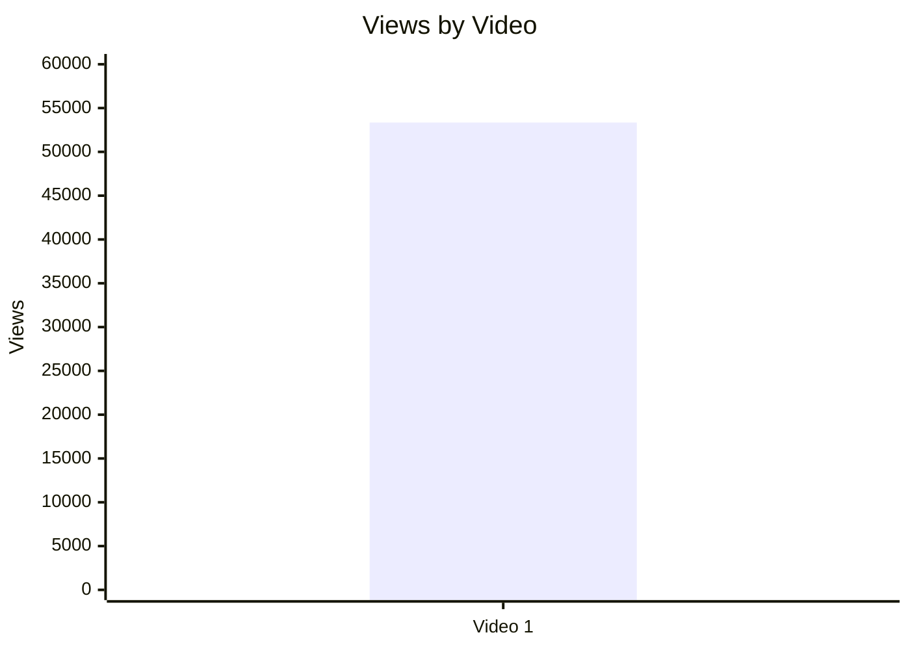

| Video | Views | Коментар |
|---|---:|---|
| Video 1 | 53 347 | Raw reach доступний, але `LOW_CONFIDENCE` для оцінки без порівняння з іншими відео |

### 5.2. Views per day by video

- Назва графіка: Views per day by video
- Яке питання він відповідає: яка нормалізована швидкість набору переглядів з урахуванням віку відео?
- Які поля використовуються: `video_label`, `views_per_day`
- Тип графіка: Mermaid bar chart
- Що видно з графіка: Video 1 має 101.61 views/day за весь період від публікації до snapshot date.
- Практичний висновок: метрика корисна для майбутнього порівняння з іншими long-form відео; зараз вона є baseline, а не доказом outlier.

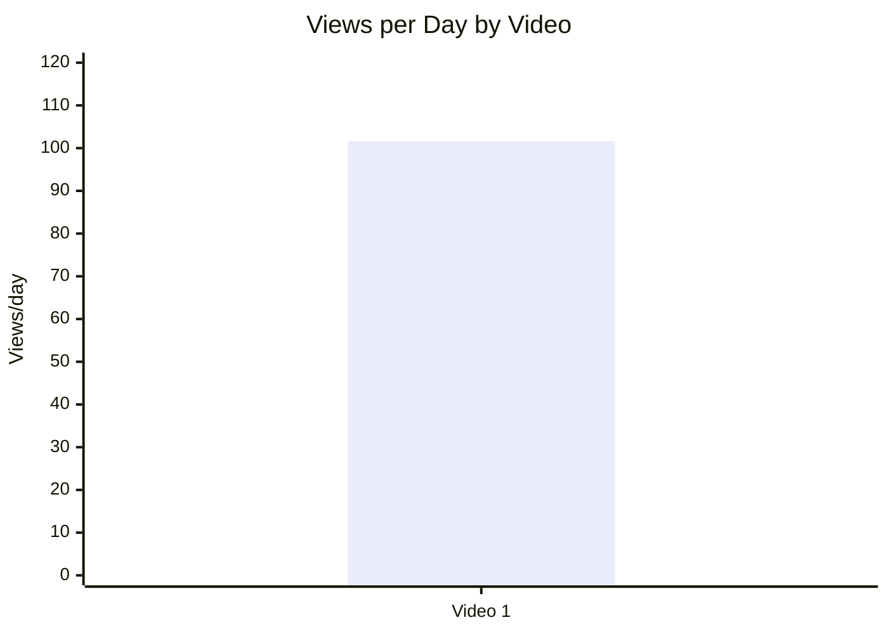

### 5.3. Views per 1k subscribers

- Назва графіка: Views per 1k subscribers
- Яке питання він відповідає: як відео перетворює розмір каналу в перегляди?
- Які поля використовуються: `video_label`, `views_per_1k_subs`
- Тип графіка: Mermaid bar chart
- Що видно з графіка: Video 1 має 2 793.04 views per 1k subs.
- Практичний висновок: відео вийшло далеко за межі subscriber base; це узгоджується з часткою non-subscribed viewers 82.9%, але порівняльний висновок потребує інших відео.

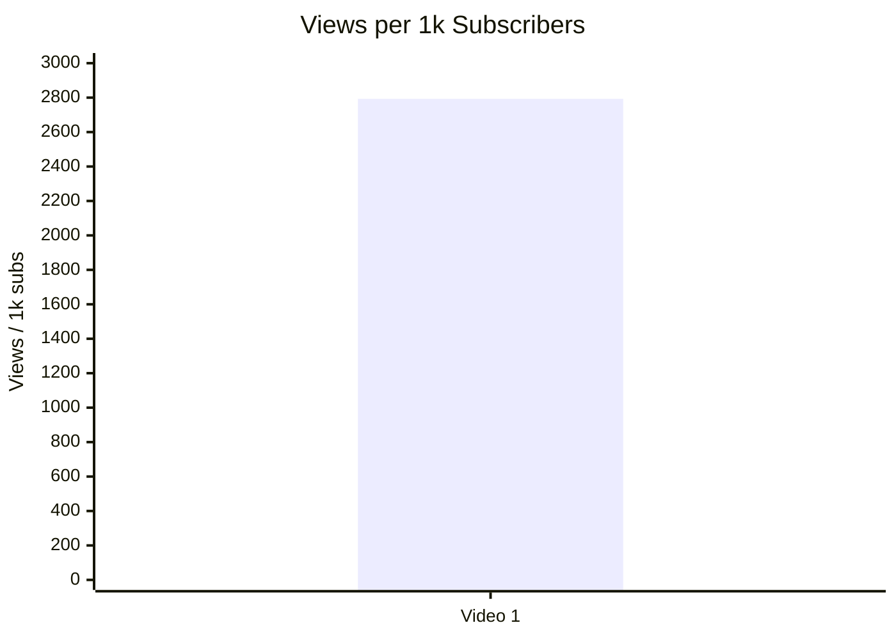

### 5.4. Performance quadrant

- Назва графіка: Performance quadrant
- Яке питання він відповідає: чи поєднує відео охоплення і залучення?
- Які поля використовуються: `views_per_day`, `er_public_percent`
- Тип графіка: scatter / quadrant table; реальний quadrant chart `INSUFFICIENT_DATA`, бо є лише одна точка і немає median/benchmark для high/low.
- Що видно з графіка: точка Video 1 = 101.61 views/day і 10.77% ER Public.
- Практичний висновок: це baseline для майбутньої когорти `LONG_20_PLUS_MIN`; high/low межі треба встановити після додавання мінімум 3–5 порівнюваних відео.

| Video | X: Views/day | Y: ER Public % | Quadrant status |
|---|---:|---:|---|
| Video 1 | 101.61 | 10.77 | `INSUFFICIENT_DATA` — немає меж high/low без когорти |

## 6. Графіки залучення

### 6.1. ER Public % by video

- Назва графіка: ER Public % by video
- Яке питання він відповідає: яке публічне залучення має відео?
- Які поля використовуються: `video_label`, `er_public_percent`
- Тип графіка: Mermaid bar chart
- Що видно з графіка: Video 1 має ER Public 10.77%.
- Практичний висновок: це сильний внутрішній сигнал для теми, але без benchmark не можна робити остаточне “добре/погано”.

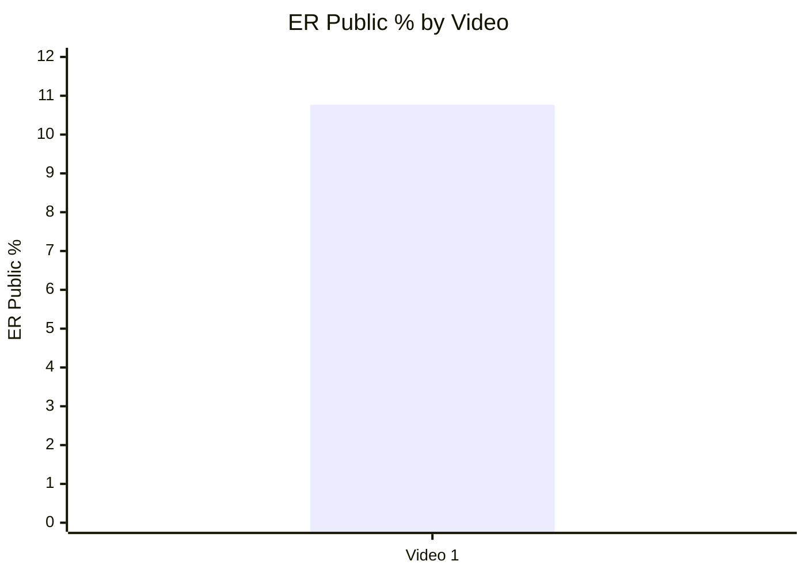

### 6.2. Like Rate % vs Comment Rate %

- Назва графіка: Like Rate % vs Comment Rate %
- Яке питання він відповідає: відео більше подобається чи провокує дискусію?
- Які поля використовуються: `like_rate_percent`, `comment_rate_percent`
- Тип графіка: scatter table; Mermaid scatter недоступний у базовому Markdown, тому дана таблиця для побудови вручну.
- Що видно з графіка: like_rate_percent = 8.76%, comment_rate_percent = 2.01%.
- Практичний висновок: відео одночасно отримує позитивні реакції і багато коментарів; однак без інших відео неможливо класифікувати його як high/high щодо когорти.

| Video | Like Rate % | Comment Rate % | Interpretation |
|---|---:|---:|---|
| Video 1 | 8.76 | 2.01 | Високе видиме engagement у межах одного кейсу; `LOW_CONFIDENCE` без когорти |

### 6.3. Comments per 1k views

- Назва графіка: Comments per 1k views
- Яке питання він відповідає: наскільки відео провокує коментарі відносно переглядів?
- Які поля використовуються: `video_label`, `comments_per_1k_views`
- Тип графіка: Mermaid bar chart
- Що видно з графіка: Video 1 має 20.08 comments per 1k views.
- Практичний висновок: це треба використовувати як baseline для майбутніх controversy / explainer відео.

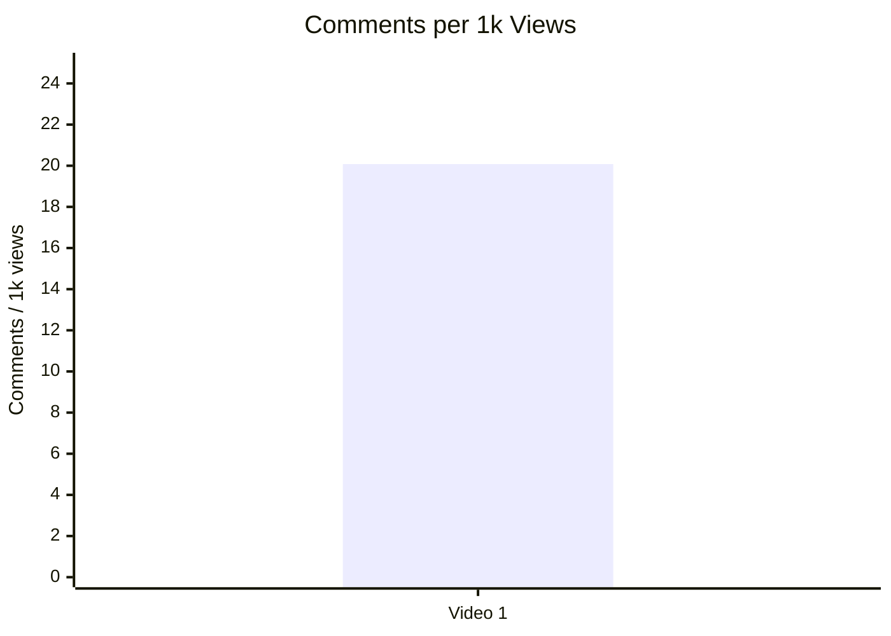

## 7. Графіки структури та hook

### 7.1. Hook score by video

- Назва графіка: Hook score by video
- Яке питання він відповідає: наскільки сильним був hook?
- Які поля використовуються: `video_label`, `hook_score`
- Тип графіка: Mermaid bar chart
- Що видно з графіка: Video 1 має hook score 4 / 5.
- Практичний висновок: authority + conflict + promise працюють як сильна упаковка, але intro duration 179 секунд створює ризик early drop-off.

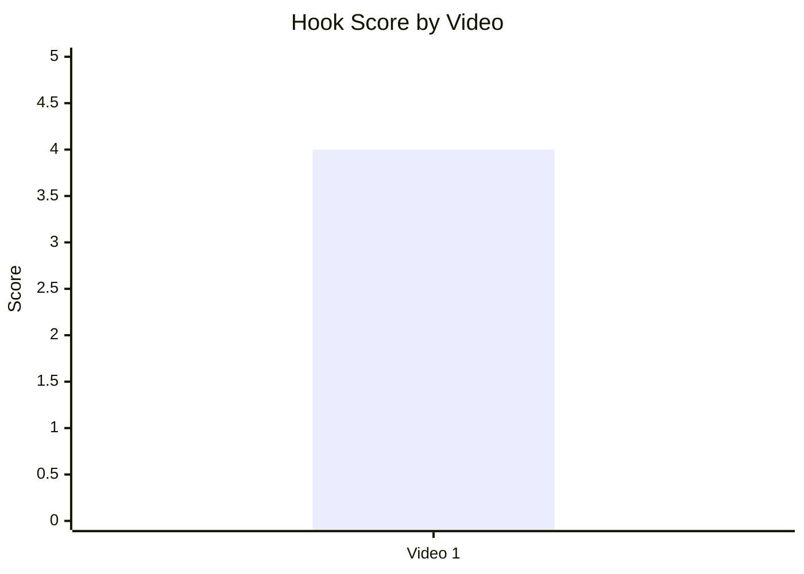

### 7.2. Hook type distribution

- Назва графіка: Hook type distribution
- Яке питання він відповідає: який primary hook type використано?
- Які поля використовуються: `hook_primary_type`, count
- Тип графіка: Mermaid pie chart
- Що видно з графіка: у наявній вибірці є один primary hook type — `AUTHORITY`.
- Практичний висновок: поки не можна сказати, чи `AUTHORITY` працює краще за інші hook types; це гіпотеза для тесту.

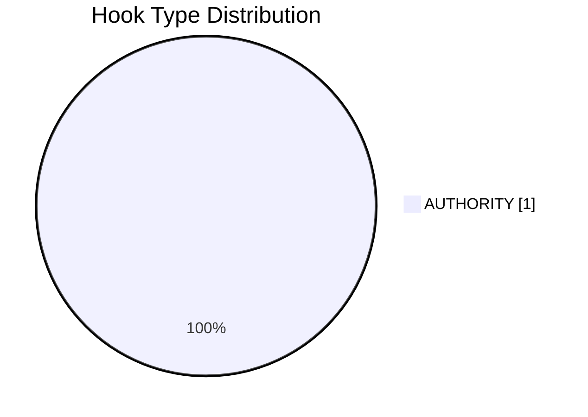

| Hook type | Count | Частка |
|---|---:|---:|
| AUTHORITY | 1 | 100% |

### 7.3. Time to first value vs Overall Score

- Назва графіка: Time to first value vs Overall Score
- Яке питання він відповідає: чи швидша перша цінність пов’язана з вищим результатом?
- Які поля використовуються: `time_to_first_value_seconds`, `overall_video_score`
- Тип графіка: scatter table; кореляційний scatter `INSUFFICIENT_DATA`, бо є лише одна точка.
- Що видно з графіка: перша source-value точка приблизно на 179 секунді, overall score = 3.85.
- Практичний висновок: скорочення time to first source payoff є високопріоритетним тестом, але не доведено статистично.

| Video | Time to first source payoff, sec | Overall score | Коментар |
|---|---:|---:|---|
| Video 1 | 179 | 3.85 | Довгий вступ є missed opportunity у первинному звіті; статистичний зв’язок не перевіряється на одному відео |

## 8. Графіки CTA

### 8.1. CTA score by video

- Назва графіка: CTA score by video
- Яке питання він відповідає: наскільки якісно побудовано CTA?
- Які поля використовуються: `video_label`, `cta_score`
- Тип графіка: Mermaid bar chart
- Що видно з графіка: Video 1 має CTA score 3 / 5.
- Практичний висновок: CTA нормальний, але є місце для посилення через конкретний subscribe CTA, pinned-comment funnel і next-video bridge.

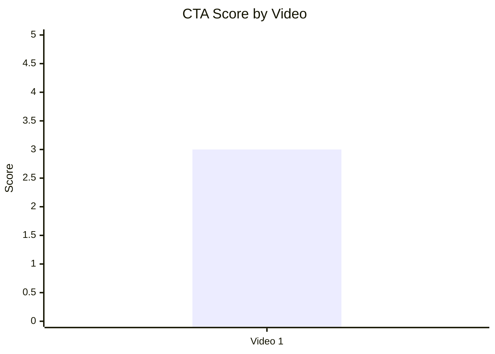

### 8.2. CTA count vs ER Public %

- Назва графіка: CTA count vs ER Public %
- Яке питання він відповідає: чи більша кількість CTA пов’язана з вищим залученням?
- Які поля використовуються: `cta_count`, `er_public_percent`
- Тип графіка: scatter table; кореляція не будується.
- Що видно з графіка: CTA count = 5, ER Public = 10.77%.
- Практичний висновок: не можна стверджувати, що саме кількість CTA спричинила ER; якісно найбільш релевантним виглядає comment prompt у conclusion.

| Video | CTA count | ER Public % | CTA overload risk |
|---|---:|---:|---|
| Video 1 | 5 | 10.77 | LOW / PARTIAL_DATA — CTA не виглядає перевантаженим, бо більшість стоїть у description або conclusion |

### 8.3. CTA features heatmap

- Назва графіка: CTA features heatmap
- Яке питання він відповідає: які CTA-елементи присутні або відсутні?
- Які поля використовуються: `has_comment_prompt`, `has_subscribe_cta`, `has_like_cta`, `has_bell_cta`, `has_next_video_bridge`
- Тип графіка: Markdown heatmap / matrix
- Що видно з графіка: є comment prompt і weak/generic next-video bridge; немає subscribe, like, bell CTA.
- Практичний висновок: найближчий тест — додати короткий subscribe CTA після першого value block і конкретний end-screen bridge.

| Video | Comment prompt | Subscribe | Like | Bell | Next video bridge |
|---|---|---|---|---|---|
| Video 1 | ✅ | ❌ | ❌ | ❌ | ✅ weak/generic |

## 9. Графіки реклами / інтеграцій

Advertising graphs partially skipped: third-party advertising integrations were not detected, but self-promo / description support link were detected. Exact `ad_load_percent` is `N/A`, because the verbal support duration cannot be isolated from timestamped transcript.

### 9.1. Ad load % by video

- Назва графіка: Ad load % by video
- Яке питання він відповідає: яке рекламне навантаження має відео?
- Які поля використовуються: `ad_load_percent`
- Тип графіка: skipped
- Що видно з графіка: `ad_load_percent = N/A`.
- Практичний висновок: рекламне навантаження не можна кількісно порівняти; якісно disruption risk низький, бо self-promo стоїть у description / conclusion.

| Video | Ad detected | Ad types | Ad count | Ad load % | Reason graph skipped |
|---|---|---|---:|---:|---|
| Video 1 | ✅ | SELF_PROMO, DESCRIPTION_LINK_AD | 2 | N/A | Exact verbal support duration = `PARTIAL_DATA / NO_TIMECODES` |

### 9.2. First ad position %

- Назва графіка: First ad position %
- Яке питання він відповідає: чи реклама стоїть занадто рано?
- Які поля використовуються: `first_ad_relative_position_percent`
- Тип графіка: table only
- Що видно з графіка: description support link = `NOT_APPLICABLE` для in-video position; verbal self-promo в conclusion приблизно після 93.8% тривалості.
- Практичний висновок: self-promo не блокує першу цінність і має низький retention risk.

| Video | First ad / self-promo position | Relative position % | Коментар |
|---|---|---:|---|
| Video 1 | Description link; verbal self-promo in conclusion | ~93.8%+ for verbal mention | Не стоїть перед першою цінністю |

### 9.3. Ad integration score vs ER Public %

- Назва графіка: Ad integration score vs ER Public %
- Яке питання він відповідає: чи якість інтеграції пов’язана з реакцією аудиторії?
- Які поля використовуються: `ad_integration_score`, `er_public_percent`
- Тип графіка: scatter table; кореляція не будується.
- Що видно з графіка: ad integration score = 3, ER Public = 10.77%.
- Практичний висновок: на одному відео неможливо оцінити вплив self-promo на ER; повторюваних скарг на рекламу не зафіксовано у звіті.

| Video | Ad integration score | ER Public % | Interpretation |
|---|---:|---:|---|
| Video 1 | 3 | 10.77 | `INSUFFICIENT_DATA` для зв’язку; disruption risk низький |

## 10. Графіки аудіо

### 10.1. Audio score by video

- Назва графіка: Audio score by video
- Яке питання він відповідає: яка загальна оцінка аудіо?
- Які поля використовуються: `audio_score`
- Тип графіка: Mermaid bar chart
- Що видно з графіка: Video 1 має audio score 3 / 5.
- Практичний висновок: аудіо не є головним blocker, але production upgrade може зменшити fatigue risk і частину скарг на AI voice / audio / visuals.


### 10.2. Audio score vs Overall Score

- Назва графіка: Audio score vs Overall Score
- Яке питання він відповідає: чи краща якість аудіо пов’язана з вищим загальним балом?
- Які поля використовуються: `audio_score`, `overall_video_score`
- Тип графіка: scatter table; кореляція не будується.
- Що видно з графіка: audio score = 3, overall = 3.85.
- Практичний висновок: production upgrade варто тестувати, але не можна довести, що audio score обмежує overall score без інших відео.

| Video | Audio score | Overall score | Audio fatigue risk |
|---|---:|---:|---|
| Video 1 | 3 | 3.85 | MEDIUM |

## 11. Графіки коментарів

### 11.1. Sentiment distribution

- Назва графіка: Sentiment distribution
- Яке питання він відповідає: яка структура реакції аудиторії у коментарях?
- Які поля використовуються: `positive_percent`, `negative_percent`, `mixed_percent`, `neutral_percent`, `question_percent`, `request_percent`, `joke_meme_percent`
- Тип графіка: Mermaid pie chart + таблиця; stacked bar для одного відео не додає цінності.
- Що видно з графіка: найбільша частка — neutral / discussion-like comments 42.6%; questions 16.9%, requests 12.2%, positive 11.3%, negative 10.4%.
- Практичний висновок: сила відео не лише в позитиві, а в дискусійності; pinned-comment strategy має направляти цю дискусію у корисну воронку.

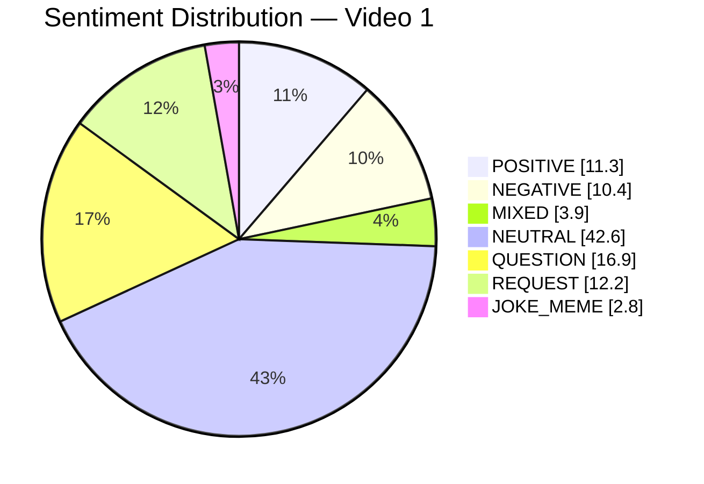

| Sentiment | Count | Percent of relevant comments |
|---|---:|---:|
| POSITIVE | 108 | 11.3% |
| NEGATIVE | 99 | 10.4% |
| MIXED | 37 | 3.9% |
| NEUTRAL | 406 | 42.6% |
| QUESTION | 161 | 16.9% |
| REQUEST | 116 | 12.2% |
| JOKE_MEME | 27 | 2.8% |

### 11.2. Comment resonance score by video

- Назва графіка: Comment resonance score by video
- Яке питання він відповідає: наскільки сильно відео резонує у коментарях?
- Які поля використовуються: `comment_resonance_score`
- Тип графіка: Mermaid bar chart
- Що видно з графіка: Video 1 має 5 / 5.
- Практичний висновок: comment resonance — найсильніший score відео; це варто масштабувати, але з кращим framing control.

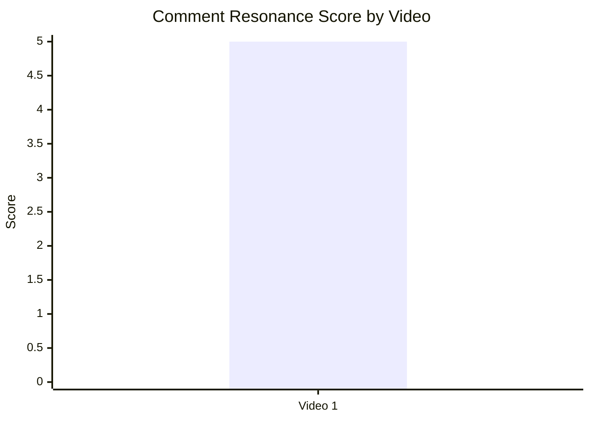

### 11.3. Top comment clusters

- Назва графіка: Top comment clusters
- Яке питання він відповідає: що саме найчастіше викликає коментарі?
- Які поля використовуються: `cluster name`, `% of relevant comments`
- Тип графіка: Mermaid horizontal-equivalent bar chart
- Що видно з графіка: найбільший кластер — general debate / long thread discussion 34.5%; далі Russian mindset / imperialism 24.0%; praise 18.8%; criticism 10.4%.
- Практичний висновок: контент найкраще працює як debate engine; потрібно додати source links, counterargument prompt і playlist bridge у pinned comment.

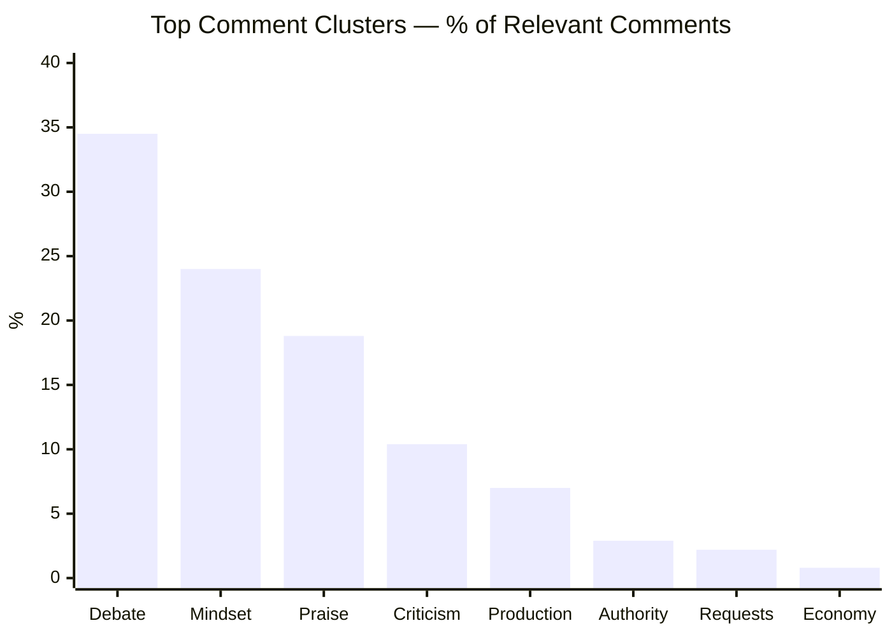

| Cluster | % of relevant comments | Практичне значення |
|---|---:|---|
| General debate / long thread discussion | 34.5% | Коментарі живляться конфліктом позицій |
| Russian mindset / imperialism discussion | 24.0% | Title-topic fit підтверджений коментарями |
| Praise / gratitude / content value | 18.8% | Є supportive base для серійності |
| Propaganda / dehumanization criticism | 10.4% | Головний reputational risk |
| Production / AI voice / visuals / audio | 7.0% | Production upgrade може зменшити friction |
| Nevzorov / Zolkin authority debate | 2.9% | Authority hook потребує source triangulation |
| Requests / continuation / subtitles / guests | 2.2% | Є попит на продовження, але не масовий |
| Economy / coup / religion / war outcome | 0.8% | Якісні питання, але малий кластер |

## 12. Графіки score-системи

### 12.1. Overall score by video

- Назва графіка: Overall score by video
- Яке питання він відповідає: яка загальна оцінка відео?
- Які поля використовуються: `overall_video_score`
- Тип графіка: Mermaid bar chart
- Що видно з графіка: Video 1 має 3.85 / 5.
- Практичний висновок: відео сильне за resonance і structure, але загальний бал стримують CTA, audio і ad/self-promo integration scores.

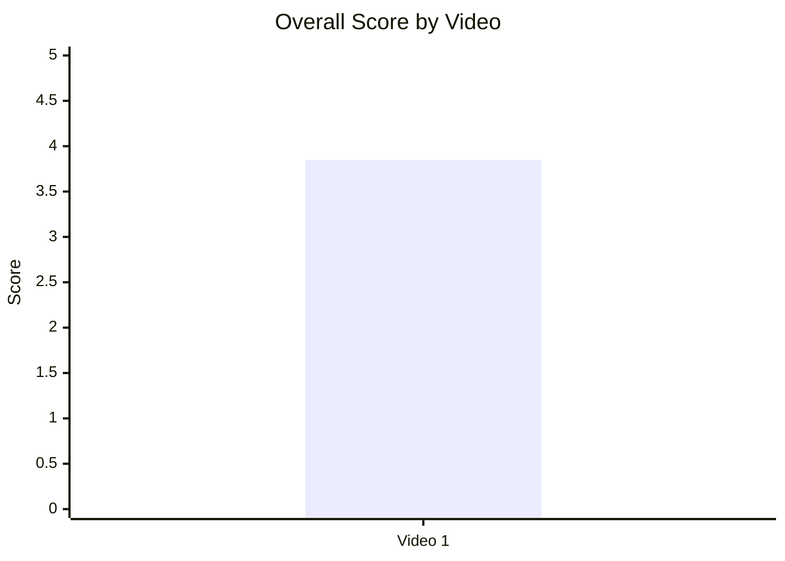

### 12.2. Score breakdown heatmap

- Назва графіка: Score breakdown heatmap
- Яке питання він відповідає: де сильні та слабкі сторони відео?
- Які поля використовуються: `hook_score`, `structure_score`, `value_density_score`, `audio_score`, `cta_score`, `ad_integration_score`, `comment_resonance_score`, `replicability_score`, `overall_video_score`
- Тип графіка: Markdown heatmap table
- Що видно з графіка: найсильніший score — Comments 5; сильні Hook / Structure / Value Density / Replicability 4; слабші Audio / CTA / Ad 3.
- Практичний висновок: наступні тести мають зберігати debate/value core і покращувати conversion + packaging.

Legend: 🟩 = 4.5–5.0, 🟨 = 3.5–4.49, 🟧 = 2.5–3.49, 🟥 = <2.5

| Video | Hook | Structure | Value Density | Audio | CTA | Ad | Comments | Replicability | Overall |
|---|---:|---:|---:|---:|---:|---:|---:|---:|---:|
| Video 1 | 🟨 4 | 🟨 4 | 🟨 4 | 🟧 3 | 🟧 3 | 🟧 3 | 🟩 5 | 🟨 4 | 🟨 3.85 |

### 12.3. Strengths vs weaknesses count

- Назва графіка: Strengths vs weaknesses count
- Яке питання він відповідає: чи більше у відео сильних механік чи missed opportunities?
- Які поля використовуються: count `success_mechanics`, count `missed_opportunities`
- Тип графіка: Mermaid bar chart
- Що видно з графіка: у звіті зафіксовано 5 success mechanics і 5 missed opportunities.
- Практичний висновок: потенціал масштабування є, але він залежить від контролю ризиків: framing, intro length, pinned comment funnel, next-video bridge, audio/visual polish.

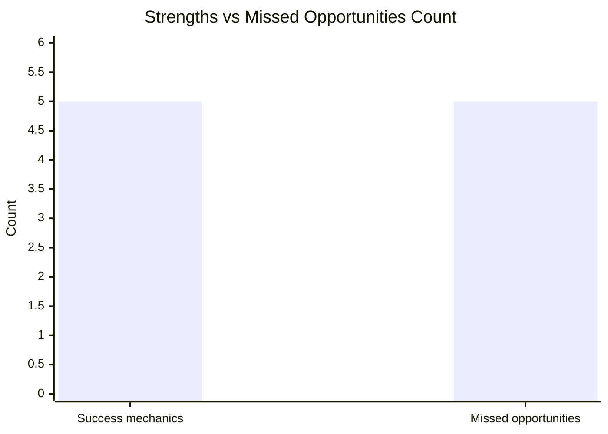

| Type | Count | Top item |
|---|---:|---|
| Success mechanics | 5 | CONTROVERSY_OR_DEBATE |
| Missed opportunities | 5 | OVERLONG_INTRO |

## 13. Кореляції та патерни

Correlation analysis skipped: fewer than 5 comparable videos.

| Pair | Correlation / Pattern | Strength | Interpretation | Confidence |
|---|---:|---|---|---|
| hook_score → overall_video_score | `INSUFFICIENT_DATA` | N/A | Є лише одна точка: hook_score 4, overall 3.85 | LOW |
| value_density_score → er_public_percent | `INSUFFICIENT_DATA` | N/A | Є лише одна точка: value_density 4, ER 10.77% | LOW |
| cta_score → comment_rate_percent | `INSUFFICIENT_DATA` | N/A | Є лише одна точка: CTA 3, comment_rate 2.01% | LOW |
| comment_resonance_score → er_public_percent | `INSUFFICIENT_DATA` | N/A | Є лише одна точка: comment_resonance 5, ER 10.77% | LOW |
| views_per_day → er_public_percent | `INSUFFICIENT_DATA` | N/A | Є лише одна точка: 101.61 views/day, ER 10.77% | LOW |
| ad_load_percent → er_public_percent | `N/A` | N/A | `ad_load_percent` не розраховано | LOW |
| time_to_first_value_seconds → overall_video_score | `INSUFFICIENT_DATA` | N/A | Є лише одна точка: 179 sec, overall 3.85 | LOW |

Попередні патерни, не кореляції:

| Pattern | Дані | Інтерпретація | Confidence |
|---|---|---|---|
| Comment resonance є головною силою відео | comment_resonance_score 5 / 5; comments_per_1k_views 20.08; cluster debate 34.5% | Формат створює дискусію і поляризацію | LOW через N=1, але сильний single-case evidence |
| CTA слабший за resonance | CTA score 3 / 5 при comment_resonance 5 / 5 | Відео генерує реакцію, але не максимально направляє її у підписку / next session | LOW |
| Production friction не зламав результат, але є ризиком | audio_score 3 / 5; production cluster 7.0% | Аудіо / AI voice / AI visuals варто покращувати | LOW |
| Authority hook працює, але атакований у коментарях | hook type AUTHORITY; authority criticism cluster 2.9%; propaganda/dehumanization 10.4% | Потрібен додатковий source framing і scope disclaimer | LOW |

## 14. Висновки для контент-стратегії

| Спостереження | Дані / графік | Що це означає | Що робити |
|---|---|---|---|
| Відео сильніше за все працює як debate engine | Comment resonance 5 / 5; debate cluster 34.5%; comment_rate 2.01% | Коментарі не випадкові, а структурно спричинені темою і framing | Залишити controversial myth-busting, але керувати дискусією через pinned comment |
| Topic-title fit підтверджений поведінкою аудиторії | Search terms: “russian mentality” 16.8%, “russian mindset” 12.6%; Russian mindset cluster 24.0% | Назва відповідає реальному інтересу аудиторії | Продовжувати SEO-формули з exact-match “Russian mindset / mentality / propaganda / imperialism” |
| Висока частка non-subscribed viewers означає потенціал масштабування | Non-subscribed viewers 82.9%; views_per_1k_subs 2 793.04 | Тема виходить за межі ядра каналу | Додати explicit subscribe CTA після першого value block |
| Intro є головним структурним ризиком | intro_duration_seconds 179; missed opportunity `OVERLONG_INTRO` | Холодна аудиторія може не дочекатися першого source payoff | Тестувати cold open 15–25 сек із найсильнішою цитатою |
| Framing створює одночасно engagement і reputational risk | criticism cluster 10.4%; pinned “ukrainian propaganda”; comments про dehumanization | Поляризація піднімає коментарі, але може знижувати довіру skeptical аудиторії | Додати scope disclaimer і розділяти “imperial pattern” від ethnic essentialism |
| CTA не використовує весь потенціал | CTA score 3 / 5; немає subscribe/like/bell; next bridge weak/generic | Відео генерує реакцію, але не повністю конвертує її у session/subscription | Pin structured comment + end-screen bridge + короткий subscribe CTA |
| Реклама не є явним ризиком | third-party sponsor не виявлено; self-promo near conclusion; ad_load % = N/A | Немає підстав вважати рекламу причиною негативу | Не змінювати timing self-promo; збирати точні ad duration дані в майбутніх звітах |
| Аудіо / production — середній ризик | audio_score 3; production cluster 7.0%; audio fatigue risk MEDIUM | Якість не руйнує відео, але може обмежувати довіру | Тестувати cleaner loudness, менше AI-slop visuals, чіткіше маркування перекладів |

## 15. Що тестувати далі

| Тест | Гіпотеза | На яких даних базується | Як виміряти | Пріоритет |
|---|---|---|---|---|
| Cold open із найсильнішою цитатою | Якщо перший source payoff буде до 00:30, early retention покращиться | intro_duration_seconds 179; `OVERLONG_INTRO` | Retention до 00:30 / 01:00, AVD, views/day | HIGH |
| Scope disclaimer у першій хвилині | Чітке розмежування “імперський патерн” vs “етнічність” зменшить defensive backlash | criticism cluster 10.4%; comments про propaganda/dehumanization | Negative comment %, dislike/like proxy якщо доступно, retention skeptical traffic | HIGH |
| Pinned comment funnel | Structured pinned comment перетворить debate на session / playlist / source engagement | pinned hostile comment створив debate, але не funnel | Comment quality, playlist clicks, end-screen CTR, returning viewers | HIGH |
| Конкретний comment prompt | Питання “What is the strongest counterargument?” дасть якісніші коментарі, ніж загальний prompt | Comment resonance 5 / 5; debate cluster 34.5% | Comment count, average comment length, % question/request/mixed | HIGH |
| Subscribe CTA після першого value block | Після першої цінності підписка конвертуватиме краще без шкоди retention | +1.0k subscribers gained; немає subscribe CTA | Subscribers gained / views, retention around CTA | MEDIUM |
| End-screen bridge до конкретного next video / playlist | Конкретний next step підвищить session depth | has_next_video_bridge weak/generic; playlist traffic 1.0% | End-screen CTR, playlist starts, average views per viewer | MEDIUM |
| Production upgrade translated segments | Human/cleaner voiceover і менше AI visuals зменшать production complaints | audio_score 3; production cluster 7.0%; fatigue risk MEDIUM | Production complaint %, AVD, comments mentioning AI/audio | MEDIUM |
| Reddit-friendly cutdowns | Короткі clips збільшать qualified external discovery | External traffic 6.9%; Reddit 45.6% external | External views, Reddit source share, subscriber conversion from external | MEDIUM |
| Серія про economy / war machine | Контрінтуїтивна теза про economy може стати окремим сильним відео | main payoff 17:34–20:20; questions about economy/war end | Views/day, ER, comment clusters economy/war outcome | HIGH |
| Authority triangulation | Додавання третього source layer зменшить attack surface на Nevzorov/Zolkin | authority criticism cluster 2.9%; hook type AUTHORITY | Negative authority comments %, watch time, trust comments | MEDIUM |

## 16. Дані для експорту в таблицю / CSV

| video_label | title | format_group | views | likes | comments_count | subscribers | views_per_day | like_rate_percent | comment_rate_percent | er_public_percent | views_per_1k_subs | likes_per_1k_views | comments_per_1k_views | avg_view_duration | watch_time_hours | subscribers_gained | non_subscribed_viewers_percent | impressions_ctr_percent | hook_type | hook_score | cta_count | cta_score | has_comment_prompt | has_subscribe_cta | has_like_cta | has_bell_cta | has_next_video_bridge | ad_load_percent | ad_integration_score | audio_score | comment_resonance_score | overall_video_score | top_success_mechanic | top_missed_opportunity |
|---|---|---|---:|---:|---:|---:|---:|---:|---:|---:|---:|---:|---:|---|---:|---:|---:|---:|---|---:|---:|---:|---|---|---|---|---|---:|---:|---:|---:|---:|---|---|
| Video 1 | A Brutally Honest Peek Into "Russian" Mindset | LONG_20_PLUS_MIN | 53347 | 4672 | 1071 | 19100 | 101.61 | 8.76 | 2.01 | 10.77 | 2793.04 | 87.58 | 20.08 | 09:45 | 8658.9 | 1000 | 82.9 | 5.6 | AUTHORITY | 4 | 5 | 3 | true | false | false | false | true | N/A | 3 | 3 | 5 | 3.85 | CONTROVERSY_OR_DEBATE | OVERLONG_INTRO |

CSV-ready:

```csv
video_label,title,format_group,views,likes,comments_count,subscribers,views_per_day,like_rate_percent,comment_rate_percent,er_public_percent,views_per_1k_subs,likes_per_1k_views,comments_per_1k_views,avg_view_duration,watch_time_hours,subscribers_gained,non_subscribed_viewers_percent,impressions_ctr_percent,hook_type,hook_score,cta_count,cta_score,has_comment_prompt,has_subscribe_cta,has_like_cta,has_bell_cta,has_next_video_bridge,ad_load_percent,ad_integration_score,audio_score,comment_resonance_score,overall_video_score,top_success_mechanic,top_missed_opportunity
Video 1,"A Brutally Honest Peek Into ""Russian"" Mindset",LONG_20_PLUS_MIN,53347,4672,1071,19100,101.61,8.76,2.01,10.77,2793.04,87.58,20.08,09:45,8658.9,1000,82.9,5.6,AUTHORITY,4,5,3,true,false,false,false,true,N/A,3,3,5,3.85,CONTROVERSY_OR_DEBATE,OVERLONG_INTRO
```