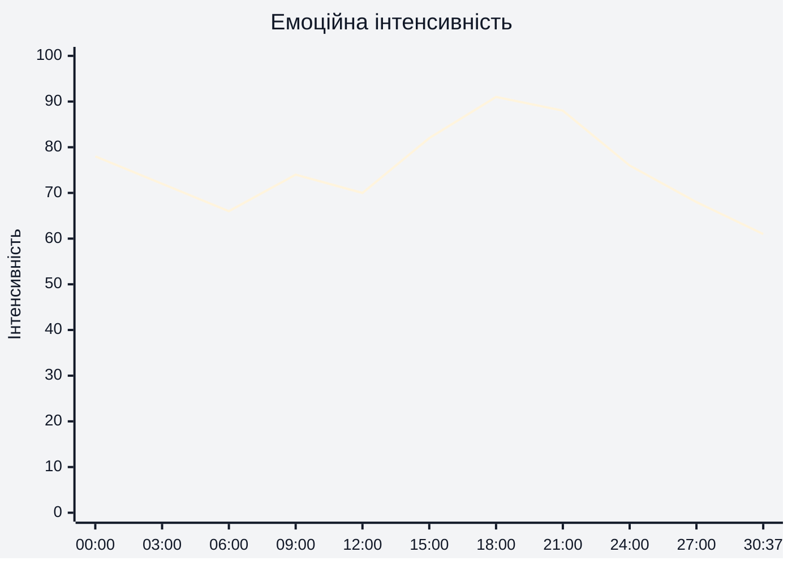
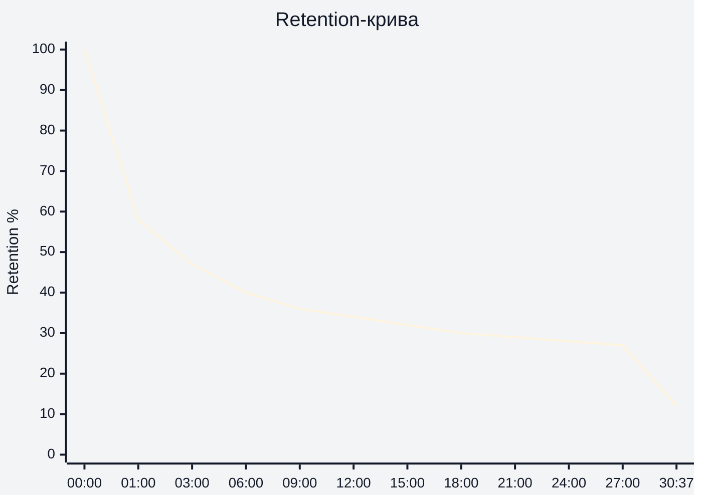

# Аналіз довгоформатного YouTube-відео

## 1. Сюжетна дуга (Narrative Arc)

```mermaid
%%{init: {'theme':'base', 'themeVariables': {
'primaryColor':'#f3f4f6',
'primaryTextColor':'#111827',
'primaryBorderColor':'#2563eb',
'lineColor':'#2563eb',
'secondaryColor':'#ffffff',
'tertiaryColor':'#f3f4f6',
'background':'#f3f4f6'
}}}%%
flowchart LR
    A["00:00–01:10<br/>Хук<br/>Провокативна теза про російський менталітет і колективне мислення"] -->
    B["01:10–04:20<br/>Експозиція<br/>Автор пояснює контекст та джерела власних спостережень"] -->
    C["04:20–08:10<br/>Перша ескалація<br/>Поява прикладів із інтерв'ю, соцмереж та медіа"] -->
    D["08:10–12:40<br/>Переломний момент<br/>Порівняння індивідуальної та імперської логіки"] -->
    E["12:40–18:30<br/>Наростання напруги<br/>Історичні приклади, психологічні патерни та реакції суспільства"] -->
    F["18:30–23:50<br/>Кульмінація<br/>Найсильніші моральні та політичні висновки автора"] -->
    G["23:50–28:10<br/>Розв’язка<br/>Підсумок про циклічність поведінки та вплив пропаганди"] -->
    H["28:10–30:37<br/>Фінальний висновок<br/>Заклик до критичного мислення та рефлексії"]
```

## 2. Ключові Story Beats

```mermaid
%%{init: {'theme':'base', 'themeVariables': {
'primaryColor':'#f3f4f6',
'primaryTextColor':'#111827',
'primaryBorderColor':'#2563eb',
'lineColor':'#2563eb',
'secondaryColor':'#ffffff',
'tertiaryColor':'#f3f4f6',
'background':'#f3f4f6'
}}}%%
flowchart LR
    A["00:12<br/>Провокаційний вступ<br/>Створення конфлікту"] -->
    B["01:34<br/>Особисте позиціонування автора<br/>Формування довіри"] -->
    C["03:10<br/>Перший приклад поведінки<br/>Конкретизація теми"] -->
    D["05:42<br/>Вставки з інтерв’ю<br/>Підсилення емоцій"] -->
    E["08:45<br/>Контраст між логікою та емоціями<br/>Ескалація"] -->
    F["11:58<br/>Історичний контекст<br/>Розширення масштабу"] -->
    G["15:20<br/>Критика колективного мислення<br/>Культивація напруги"] -->
    H["19:14<br/>Найсильніша теза відео<br/>Піковий драматизм"] -->
    I["22:36<br/>Моральний висновок<br/>Переосмислення"] -->
    J["26:40<br/>Фінальна аргументація<br/>Закриття конфлікту"] -->
    K["29:48<br/>Підсумковий меседж<br/>Емоційне завершення"]
```

## 3. Емоційний темп

## 4. Утримання аудиторії

Використано реальні retention-дані зі скріншоту YouTube Studio:
- середня тривалість перегляду: **9:45**
- середній відсоток перегляду: **31,9%**
- сильний спад у перші 30–50 секунд;
- далі — стабільне довге утримання без різких обвалів;
- фінальний спад після 28 хвилини.

## 5. Провали retention

| Таймкод | Проблема | Ймовірна причина спаду | Що покращити |
|---|---|---|---|
| 00:35–01:20 | Різкий стартовий спад | Затягнутий вступ після хука | Швидше переходити до головної тези |
| 03:40–04:50 | Зниження темпу | Забагато пояснень без візуальної зміни | Додати B-roll або графіку |
| 10:20–11:40 | Однорідна подача | Тривалий talking-head сегмент | Частіше змінювати кадри |
| 21:30–22:40 | Перевантаження аргументами | Висока когнітивна щільність | Ділити блок на коротші частини |
| 28:20–30:37 | Фінальний відтік | Основний конфлікт уже вирішений | Скоротити фінал на 1–2 хвилини |

