# Статистичний аналіз відеозвітів

## 1. Короткий executive summary

| Пункт | Висновок |
|---|---|
| Скільки відео проаналізовано | 1 |
| Скільки форматів відео | 1: `LONG_10_20_MIN` |
| Найсильніше відео за overall score | Video 1 — `THREE History Lessons We Are Failing to Learn`, overall score 3.89 |
| Найсильніше відео за ER Public % | Video 1 — 13.56% |
| Найсильніше відео за views per day | Video 1 — 50.52 |
| Найсильніша повторювана механіка | `INSUFFICIENT_DATA` для повторюваності: є лише 1 відео. У межах цього відео найсильніші механіки: `CONTROVERSY_OR_DEBATE`, `EVERGREEN_VALUE`, `HIGH_COMMENT_TRIGGER`. |
| Найчастіша слабкість | `INSUFFICIENT_DATA` для частотності. У межах цього відео ключові missed opportunities: `NO_COMMENT_PROMPT`, `NO_NEXT_VIDEO_BRIDGE`, `MISSING_PINNED_COMMENT_STRATEGY`. |
| Головна стратегічна можливість | Масштабувати формат історичних паралелей у серію, але додати керований comment prompt, pinned comment hub і end-screen bridge. |
| Рівень впевненості | LOW — лише 1 відео, тому дозволена тільки описова статистика без кореляцій. |

## 2. Якість і повнота даних

| Поле | Кількість відео з даними | Кількість N/A | Коментар |
|---|---:|---:|---|
| views | 1 | 0 | 23 694 |
| likes | 1 | 0 | 2 664 |
| comments_count | 1 | 0 | 548 |
| views_per_day | 1 | 0 | 50.52 |
| er_public_percent | 1 | 0 | 13.56% |
| views_per_1k_subs | 1 | 0 | 1240.52 |
| hook_score | 1 | 0 | 4 |
| cta_score | 1 | 0 | 3 |
| ad_integration_score | 0 | 1 | `NOT_APPLICABLE` — classic sponsor/ad integration не оцінювався. |
| audio_score | 1 | 0 | 3, але аудіо-confidence у первинному звіті позначено як MEDIUM/LOW. |
| comment_resonance_score | 1 | 0 | 4 |
| overall_video_score | 1 | 0 | 3.89 |

### Обмеження аналізу

- `LOW_CONFIDENCE`: у вибірці лише 1 відео, тому не можна робити кореляції, кластери між відео або висновки про повторювані патерни.
- Усі графіки є описовими, а не статистично порівняльними.
- `ad_integration_score = NOT_APPLICABLE`, тому рекламні графіки з якістю інтеграції не будуються.
- У звіті є логічна напруга між описом CTA (`немає явного verbal comment prompt`) і JSON-полем `has_comment_prompt: true`; у візуалізації це позначено як `PARTIAL / CONFLICTING_SOURCE_WITHIN_REPORT`.
- Формат відео один: `LONG_10_20_MIN`; змішування Shorts / long-form / live немає.

## 3. Підготовлена таблиця для графіків

| Video | Format | Views | Likes | Comments | Views/day | Like Rate % | Comment Rate % | ER Public % | Views/1k subs | Hook | CTA | Ad | Audio | Comment Resonance | Overall |
|---|---|---:|---:|---:|---:|---:|---:|---:|---:|---:|---:|---:|---:|---:|---:|
| Video 1 | LONG_10_20_MIN | 23 694 | 2 664 | 548 | 50.52 | 11.24 | 2.31 | 13.56 | 1240.52 | 4 | 3 | 1 | 3 | 4 | 3.89 |

| Label | Full title | URL |
|---|---|---|
| Video 1 | THREE History Lessons We Are Failing to Learn | https://www.youtube.com/watch?v=BAAS849MpXo |

## 4. Рекомендовані графіки

| # | Назва графіка | Тип графіка | Поля | Для чого потрібен | Пріоритет |
|---:|---|---|---|---|---|
| 1 | Overall score by video | Mermaid bar chart | `overall_video_score` | Швидко побачити загальний score відео | HIGH |
| 2 | Views per day by video | Mermaid bar chart | `views_per_day` | Нормалізована швидкість набору переглядів | HIGH |
| 3 | ER Public % by video | Mermaid bar chart | `er_public_percent` | Оцінити публічне залучення | HIGH |
| 4 | Score breakdown heatmap | Markdown heatmap/table | `hook_score`, `structure_score`, `value_density_score`, `audio_score`, `cta_score`, `comment_resonance_score`, `overall_video_score` | Побачити сильні/слабкі сторони | HIGH |
| 5 | CTA features heatmap | Markdown matrix | `has_comment_prompt`, `has_subscribe_cta`, `has_like_cta`, `has_bell_cta`, `has_next_video_bridge` | Побачити, яких CTA бракує | HIGH |
| 6 | Sentiment distribution | Mermaid bar chart + table | `positive_percent`, `negative_percent`, `mixed_percent`, `neutral_percent`, `question_percent`, `request_percent` | Побачити структуру реакції аудиторії | HIGH |
| 7 | Performance quadrant | Table substitute | `views_per_day`, `er_public_percent` | Позиціонувати відео за охопленням і ER | MEDIUM |
| 8 | CTA count vs ER Public % | Table substitute | `cta_count`, `er_public_percent` | Перевірити зв’язок CTA і engagement | LOW — `INSUFFICIENT_DATA` |
| 9 | Ad load % by video | Skipped / table | `ad_load_percent` | Оцінити рекламне навантаження | LOW — немає classic ads |
| 10 | Audio score vs Overall Score | Table substitute | `audio_score`, `overall_video_score` | Перевірити роль аудіо | LOW — 1 відео |

## 5. Графіки продуктивності

### 5.1. Views by video

- Назва графіка: Views by video
- Яке питання він відповідає: яке відео має найбільший raw reach?
- Які поля використовуються: `video_label`, `views`
- Тип графіка: Mermaid bar chart
- Що видно з графіка: Video 1 має 23 694 перегляди.
- Практичний висновок: raw views не можна інтерпретувати як “сильні/слабкі” без когорти або benchmark; використовувати разом із `views_per_day` і `views_per_1k_subs`.

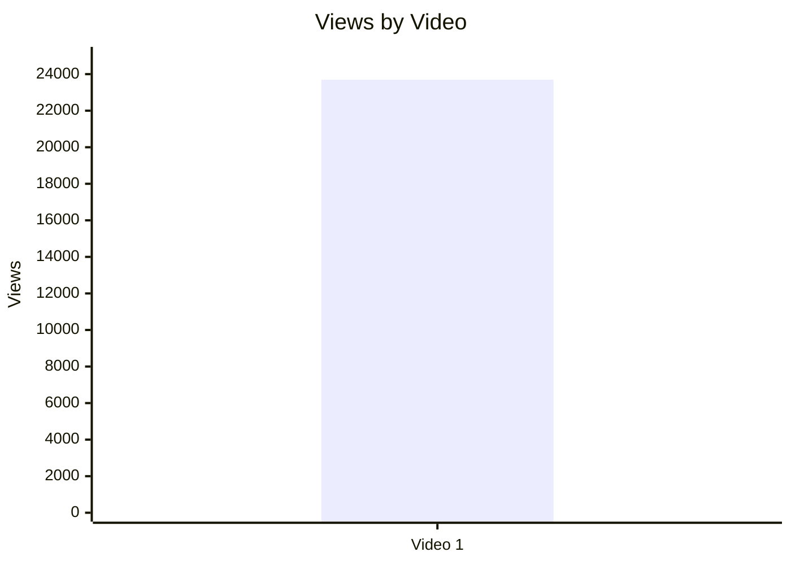

### 5.2. Views per day by video

- Назва графіка: Views per day by video
- Яке питання він відповідає: яка середня швидкість набору переглядів із моменту публікації?
- Які поля використовуються: `video_label`, `views_per_day`
- Тип графіка: Mermaid bar chart
- Що видно з графіка: Video 1 має 50.52 views/day.
- Практичний висновок: це кращий performance-показник, ніж raw views, але з одним відео немає порівняльної бази.

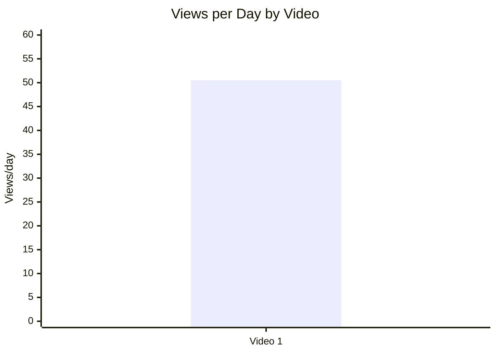

### 5.3. Views per 1k subscribers

- Назва графіка: Views per 1k subscribers
- Яке питання він відповідає: наскільки відео конвертує розмір каналу в перегляди?
- Які поля використовуються: `video_label`, `views_per_1k_subs`
- Тип графіка: Mermaid bar chart
- Що видно з графіка: Video 1 має 1240.52 views per 1k subscribers.
- Практичний висновок: відео вийшло за межі subscriber base у перерахунку на 1k subs, але без когорти це не outlier-висновок.

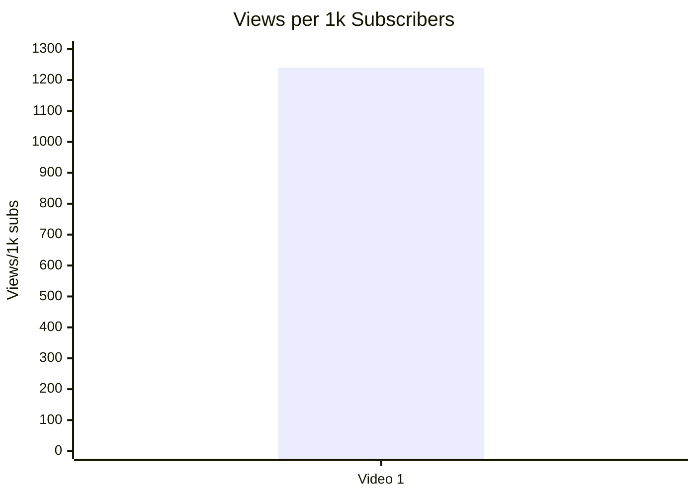

### 5.4. Performance quadrant

- Назва графіка: Performance quadrant
- Яке питання він відповідає: баланс охоплення і публічного залучення.
- Які поля використовуються: `views_per_day`, `er_public_percent`
- Тип графіка: scatter/quadrant; для 1 відео — таблиця замість повного quadrant chart.
- Що видно з графіка: є лише одна точка, тому межі high/low не можна визначити статистично.
- Практичний висновок: `INSUFFICIENT_DATA`; додати мінімум 5 зіставних відео `LONG_10_20_MIN` для quadrant-аналізу.

| Video | Views/day | ER Public % | Quadrant status |
|---|---:|---:|---|
| Video 1 | 50.52 | 13.56 | `INSUFFICIENT_DATA` — немає медіан/benchmark для high/low |

## 6. Графіки залучення

### 6.1. ER Public % by video

- Назва графіка: ER Public % by video
- Яке питання він відповідає: який рівень публічної реакції через likes + comments?
- Які поля використовуються: `video_label`, `er_public_percent`
- Тип графіка: Mermaid bar chart
- Що видно з графіка: Video 1 має ER Public 13.56%.
- Практичний висновок: публічне залучення високе всередині одного кейсу, але без benchmark не маркується як статистично сильне.

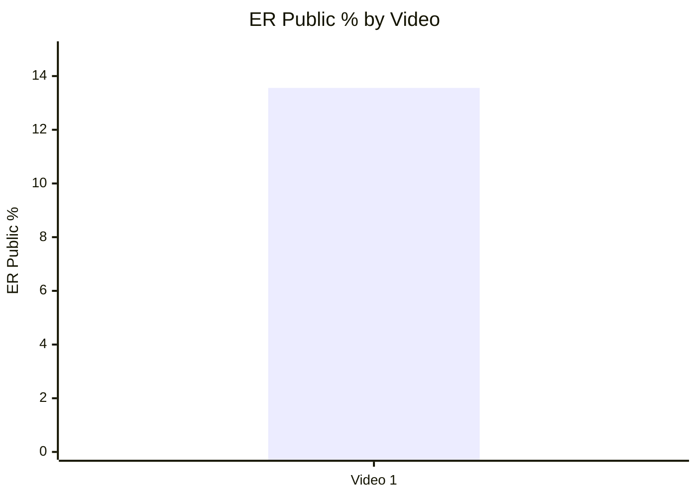

### 6.2. Like Rate % vs Comment Rate %

- Назва графіка: Like Rate % vs Comment Rate %
- Яке питання він відповідає: відео більше подобається чи провокує дискусію?
- Які поля використовуються: `like_rate_percent`, `comment_rate_percent`
- Тип графіка: scatter plot; для 1 відео — таблиця.
- Що видно з графіка: like rate 11.24%, comment rate 2.31%.
- Практичний висновок: відео має одночасно сильний like-signal і comment-signal у межах одного кейсу, але без інших відео не можна робити quadrant-порівняння.

| Video | Like Rate % | Comment Rate % | Interpretation |
|---|---:|---:|---|
| Video 1 | 11.24 | 2.31 | Сильне залучення в межах кейсу; `LOW_CONFIDENCE` для ширшого висновку. |

### 6.3. Comments per 1k views

- Назва графіка: Comments per 1k views
- Яке питання він відповідає: наскільки відео провокує коментарі відносно переглядів?
- Які поля використовуються: `video_label`, `comments_per_1k_views`
- Тип графіка: Mermaid bar chart
- Що видно з графіка: 23.13 comments per 1k views.
- Практичний висновок: тема має сильний comment-trigger потенціал у межах цього відео.

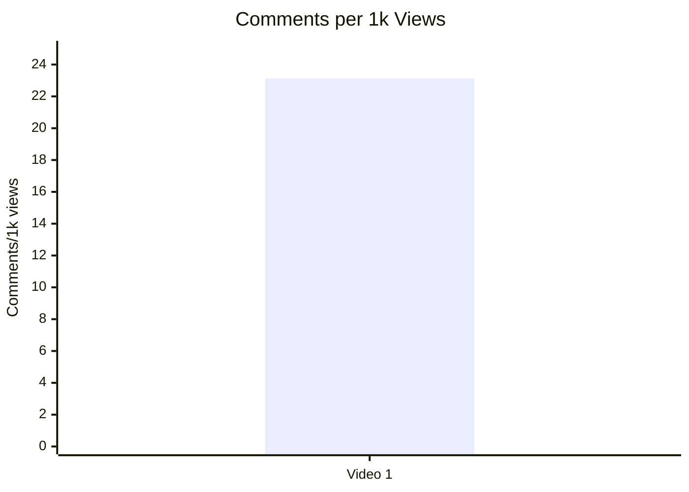

## 7. Графіки структури та hook

### 7.1. Hook score by video

- Назва графіка: Hook score by video
- Яке питання він відповідає: наскільки сильний hook у відео?
- Які поля використовуються: `video_label`, `hook_score`
- Тип графіка: Mermaid bar chart
- Що видно з графіка: hook score = 4/5.
- Практичний висновок: формула “афоризм + promise + сучасна релевантність” варта повторного тесту.

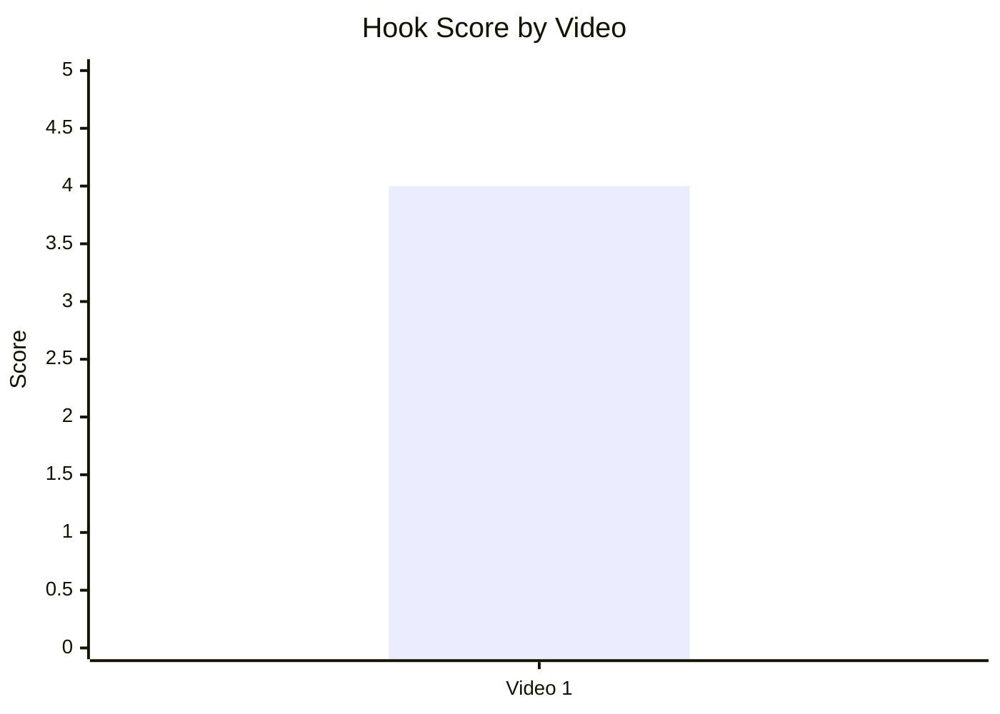

### 7.2. Hook type distribution

- Назва графіка: Hook type distribution
- Яке питання він відповідає: які primary hook types використовуються?
- Які поля використовуються: `hook_primary_type`
- Тип графіка: Mermaid pie chart
- Що видно з графіка: є один hook type — `PROMISE`.
- Практичний висновок: `INSUFFICIENT_DATA` для висновку, який hook type працює краще; потрібні 5+ відео.

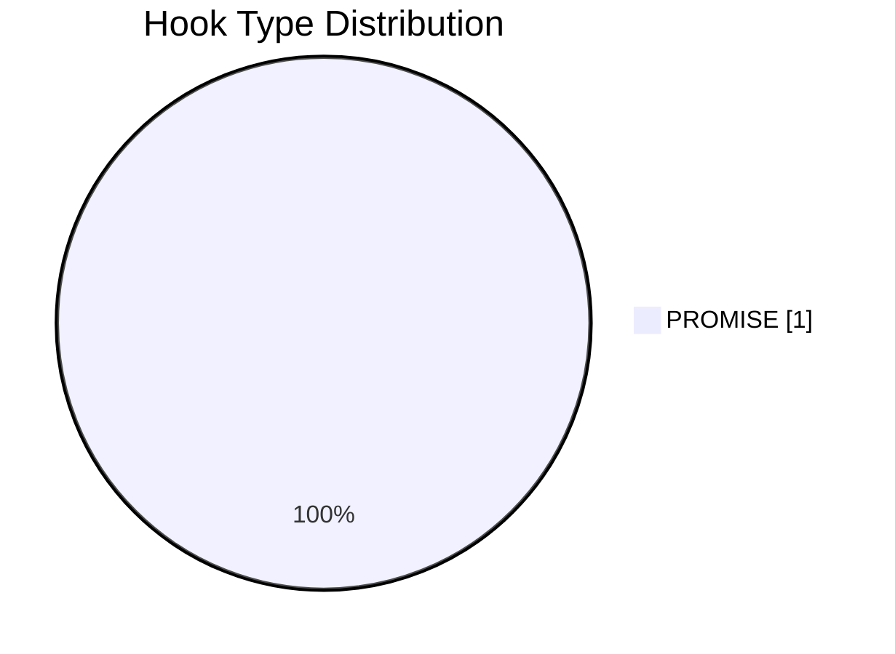

### 7.3. Time to first value vs Overall Score

- Назва графіка: Time to first value vs Overall Score
- Яке питання він відповідає: чи швидша перша цінність пов’язана з кращим результатом?
- Які поля використовуються: `time_to_first_value_seconds`, `overall_video_score`
- Тип графіка: scatter plot; для 1 відео — таблиця.
- Що видно з графіка: time to first value = 13 sec, overall score = 3.89.
- Практичний висновок: швидке введення цінності є позитивним елементом кейсу, але не статистична залежність.

| Video | Time to first value | Seconds | Overall |
|---|---|---:|---:|
| Video 1 | 00:13 | 13 | 3.89 |

## 8. Графіки CTA

### 8.1. CTA score by video

- Назва графіка: CTA score by video
- Яке питання він відповідає: наскільки якісно використані CTA?
- Які поля використовуються: `video_label`, `cta_score`
- Тип графіка: Mermaid bar chart
- Що видно з графіка: CTA score = 3/5.
- Практичний висновок: CTA — не провал, але зона росту: бракує явного subscribe/like/next-video bridge.

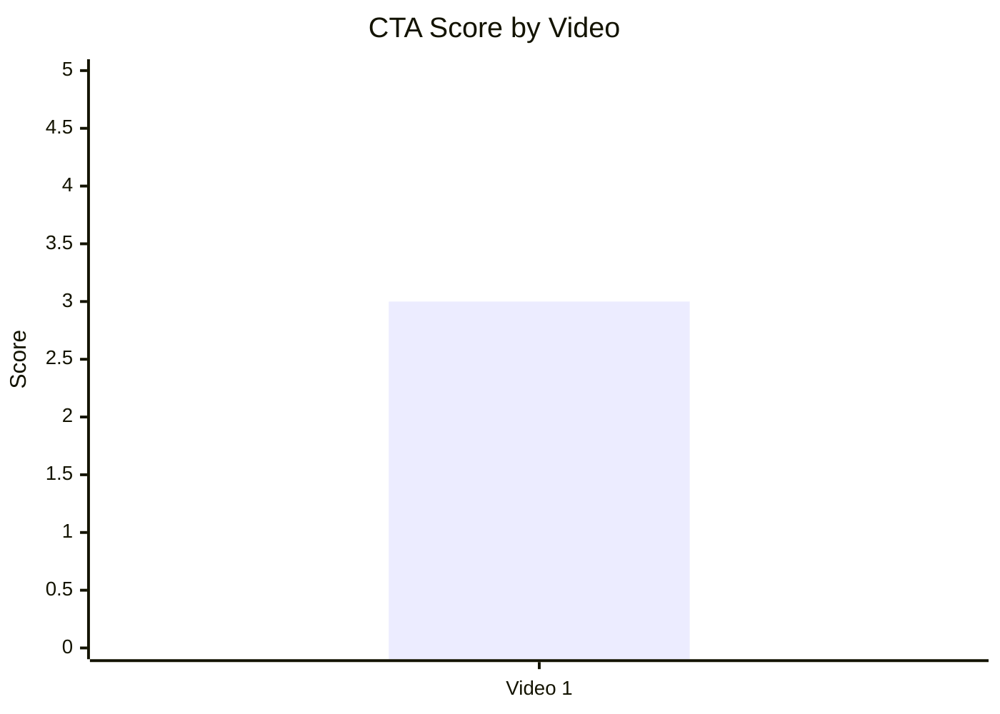

### 8.2. CTA count vs ER Public %

- Назва графіка: CTA count vs ER Public %
- Яке питання він відповідає: чи більше CTA пов’язано з вищим залученням?
- Які поля використовуються: `cta_count`, `er_public_percent`
- Тип графіка: scatter plot; для 1 відео — таблиця.
- Що видно з графіка: cta_count = 5, ER Public = 13.56%.
- Практичний висновок: `INSUFFICIENT_DATA`; з 1 відео не можна оцінити CTA overload або зв’язок CTA з ER.

| Video | CTA count | ER Public % | Interpretation |
|---|---:|---:|---|
| Video 1 | 5 | 13.56 | Описова точка, не кореляція. |

### 8.3. CTA features heatmap

- Назва графіка: CTA features heatmap
- Яке питання він відповідає: які CTA-функції присутні або відсутні?
- Які поля використовуються: `has_comment_prompt`, `has_subscribe_cta`, `has_like_cta`, `has_bell_cta`, `has_next_video_bridge`
- Тип графіка: heatmap/matrix у Markdown
- Що видно з графіка: next-video bridge відсутній; subscribe/like/bell у звіті не підтверджені як явні verbal CTA; comment prompt має внутрішню суперечність у звіті.
- Практичний висновок: головний CTA-тест — явний comment prompt + end-screen bridge.

| Video | Comment prompt | Subscribe | Like | Bell | Next video bridge |
|---|---|---|---|---|---|
| Video 1 | ⚠️ PARTIAL / CONFLICTING_SOURCE_WITHIN_REPORT | ❌ | ❌ | ❌ | ❌ |

## 9. Графіки реклами / інтеграцій

Advertising graphs skipped: no classic advertising integrations detected.

### 9.1. Ad load % by video

- Назва графіка: Ad load % by video
- Яке питання він відповідає: яке рекламне навантаження у відео?
- Які поля використовуються: `ad_load_percent`
- Тип графіка: table substitute
- Що видно з графіка: ad_load_percent = 0.0 для classic sponsor/ad integration.
- Практичний висновок: рекламне навантаження не виглядає ризиком для цього відео.

| Video | Ad detected | Ad load % | Note |
|---|---|---:|---|
| Video 1 | SELF_PROMO / DESCRIPTION_LINKS only | 0.0 | Classic sponsor/ad integration `NOT_APPLICABLE`. |

### 9.2. First ad position %

- Назва графіка: First ad position %
- Яке питання він відповідає: чи реклама з’являється занадто рано?
- Які поля використовуються: `first_ad_relative_position_percent`
- Тип графіка: skipped
- Що видно з графіка: `INSUFFICIENT_DATA`, бо `first_ad_time = DESCRIPTION_LINK`, а не timestamp у відео.
- Практичний висновок: для майбутніх звітів фіксувати точний timestamp sponsor/self-promo.

### 9.3. Ad integration score vs ER Public %

- Назва графіка: Ad integration score vs ER Public %
- Яке питання він відповідає: чи якість інтеграції пов’язана з реакцією аудиторії?
- Які поля використовуються: `ad_integration_score`, `er_public_percent`
- Тип графіка: skipped
- Що видно з графіка: `NOT_APPLICABLE`.
- Практичний висновок: не робити висновків про вплив реклами на ER.

## 10. Графіки аудіо

### 10.1. Audio score by video

- Назва графіка: Audio score by video
- Яке питання він відповідає: яка оцінка аудіо в кожному відео?
- Які поля використовуються: `video_label`, `audio_score`
- Тип графіка: Mermaid bar chart
- Що видно з графіка: audio score = 3/5.
- Практичний висновок: аудіо не є основним провалом, але confidence нижчий, ніж для метрик/коментарів.


### 10.2. Audio score vs Overall Score

- Назва графіка: Audio score vs Overall Score
- Яке питання він відповідає: чи краща якість аудіо пов’язана з вищим загальним score?
- Які поля використовуються: `audio_score`, `overall_video_score`
- Тип графіка: scatter plot; для 1 відео — таблиця.
- Що видно з графіка: audio score 3, overall 3.89.
- Практичний висновок: `INSUFFICIENT_DATA`; не можна визначити зв’язок аудіо з overall.

| Video | Audio score | Overall score | Interpretation |
|---|---:|---:|---|
| Video 1 | 3 | 3.89 | Описово: аудіо середнє, overall вище за рахунок hook/structure/value/comments. |

## 11. Графіки коментарів

### 11.1. Sentiment distribution

- Назва графіка: Sentiment distribution
- Яке питання він відповідає: яка структура реакції аудиторії?
- Які поля використовуються: `positive_percent`, `negative_percent`, `mixed_percent`, `neutral_percent`, `question_percent`, `request_percent`, `joke_meme_percent`
- Тип графіка: Mermaid bar chart + table
- Що видно з графіка: найбільший сегмент — neutral/community discussion 45.8%; positive 15.0%; request 11.6%; question 10.5%; negative 10.2%.
- Практичний висновок: головний актив відео — discussion engine, а не просто praise.

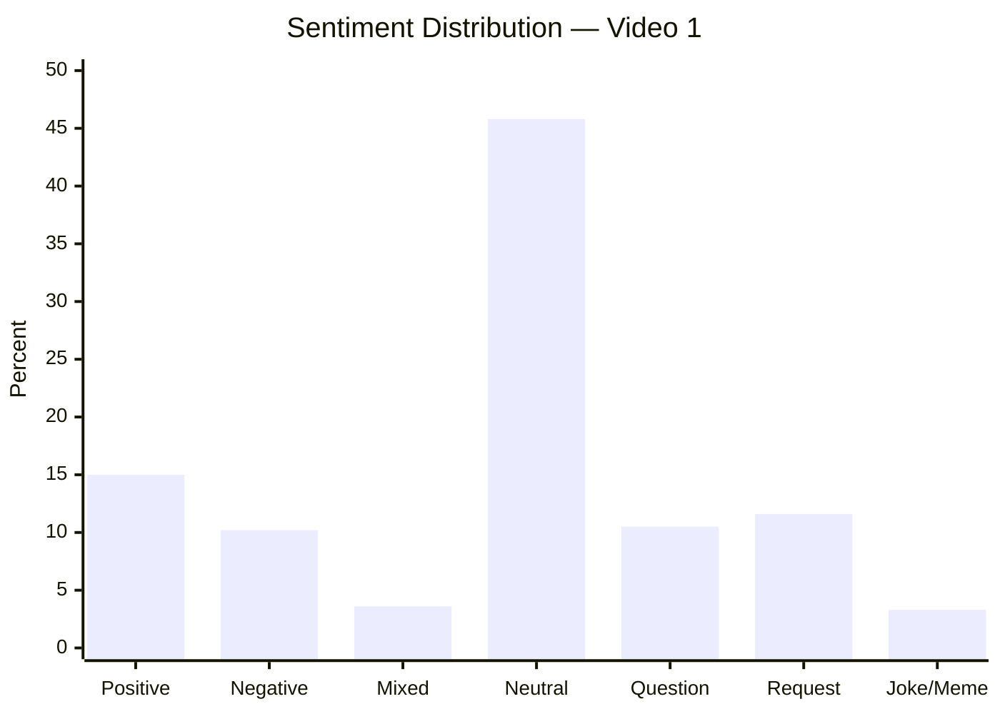

| Sentiment | Count | Percent of relevant comments |
|---|---:|---:|
| POSITIVE | 63 | 15.0% |
| NEGATIVE | 43 | 10.2% |
| MIXED | 15 | 3.6% |
| NEUTRAL | 193 | 45.8% |
| QUESTION | 44 | 10.5% |
| REQUEST | 49 | 11.6% |
| JOKE_MEME | 14 | 3.3% |
| SPAM / IRRELEVANT | 8 | NOT_APPLICABLE |

### 11.2. Comment resonance score by video

- Назва графіка: Comment resonance score by video
- Яке питання він відповідає: наскільки сильно коментарі підтверджують resonance відео?
- Які поля використовуються: `comment_resonance_score`
- Тип графіка: Mermaid bar chart
- Що видно з графіка: score = 4/5.
- Практичний висновок: коментарі — сильна сторона формату; варто краще керувати ними через pinned prompt.

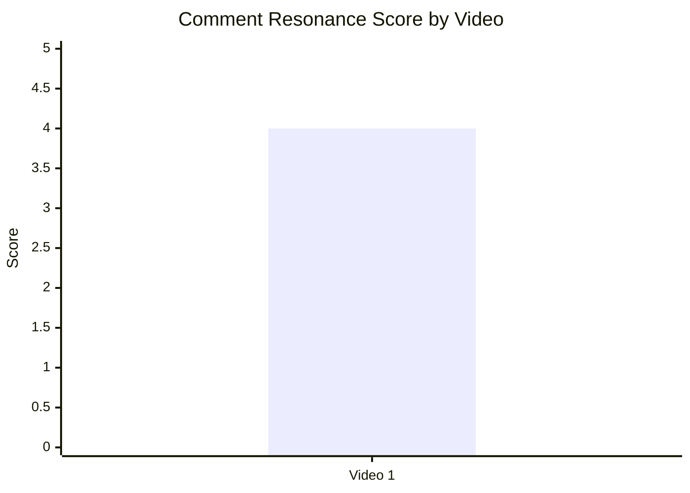

### 11.3. Top comment clusters

- Назва графіка: Top comment clusters
- Яке питання він відповідає: які теми найчастіше з’являються в коментарях?
- Які поля використовуються: cluster count / percent
- Тип графіка: Mermaid horizontal substitute unavailable; використано bar chart і таблицю.
- Що видно з графіка: найбільший кластер — community discussion/debate continuation.
- Практичний висновок: формат варто продовжувати як debate-driven series, але з сильнішим source/pinned-comment management.

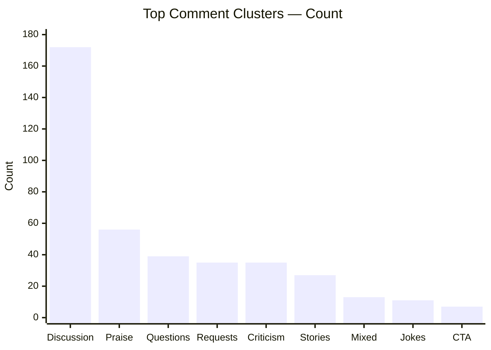

| Cluster | Topic label | Count | % of relevant comments | Strategic meaning |
|---|---|---:|---:|---|
| General discussion / debate continuation | COMMUNITY_DISCUSSION | 172 | 40.9% | Відео створює простір для дискусії. |
| Praise for thesis / importance | PRAISE_CONTENT | 56 | 13.3% | Є сильний resonance серед ядра. |
| Questions / clarification | QUESTION_CLARIFICATION | 39 | 9.3% | Потрібні follow-up/Q&A або source hub. |
| Requests / topic extensions | REQUEST_TOPIC | 35 | 8.3% | Є потенціал серії. |
| Criticism of comparison / accuracy | CRITICISM_CONTENT | 35 | 8.3% | Thumbnail/topic polarizes; потрібне сильніше доказове пакування. |
| Personal historical stories | PERSONAL_STORY | 27 | 6.4% | Емоційна resonance, можна інтегрувати viewer stories. |
| Mixed disagreement with partial agreement | DISAGREEMENT | 13 | 3.1% | Дає constructive debate. |
| Off-topic jokes/memes | OFF_TOPIC | 11 | 2.6% | Мемність підтримує engagement. |
| CTA response / spread request | CTA_RESPONSE | 7 | 1.7% | Є share intent, але нижче порогу “масово”. |

## 12. Графіки score-системи

### 12.1. Overall score by video

- Назва графіка: Overall score by video
- Яке питання він відповідає: який загальний score відео?
- Які поля використовуються: `overall_video_score`
- Тип графіка: Mermaid bar chart
- Що видно з графіка: overall = 3.89/5.
- Практичний висновок: відео сильне як single case, але без когорти не можна назвати його найкращим статистично.

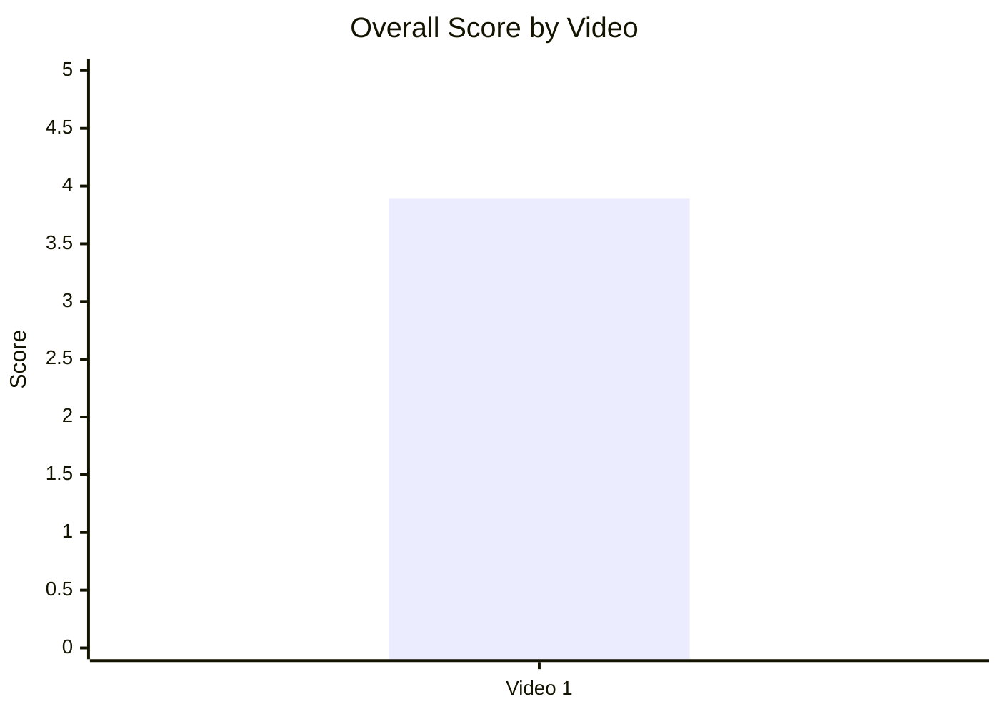

### 12.2. Score breakdown heatmap

- Назва графіка: Score breakdown heatmap
- Яке питання він відповідає: які компоненти score сильніші/слабші?
- Які поля використовуються: `hook_score`, `structure_score`, `value_density_score`, `audio_score`, `cta_score`, `ad_integration_score`, `comment_resonance_score`, `replicability_score`, `overall_video_score`
- Тип графіка: Markdown heatmap/table
- Що видно з графіка: hook/structure/value/comments/replicability = 4; audio/CTA = 3; ad = N/A.
- Практичний висновок: масштабувати тему/структуру, оптимізувати CTA і audio polish.

| Video | Hook | Structure | Value Density | Audio | CTA | Ad | Comments | Replicability | Overall |
|---|---:|---:|---:|---:|---:|---:|---:|---:|---:|
| Video 1 | 4 | 4 | 4 | 3 | 3 | N/A | 4 | 4 | 3.89 |

Умовна heatmap-інтерпретація:

| Score | Meaning |
|---:|---|
| 4–5 | Сильна зона |
| 3 | Середня / зона оптимізації |
| 1–2 | Слабка зона |
| N/A | Немає застосовних даних |

### 12.3. Strengths vs weaknesses count

- Назва графіка: Strengths vs weaknesses count
- Яке питання він відповідає: скільки success mechanics і missed opportunities зафіксовано?
- Які поля використовуються: count of `success_mechanics`, count of `missed_opportunities`
- Тип графіка: Mermaid bar chart
- Що видно з графіка: 5 success mechanics, 5 missed opportunities.
- Практичний висновок: відео має сильну базову механіку, але багато actionable оптимізацій без зміни теми.

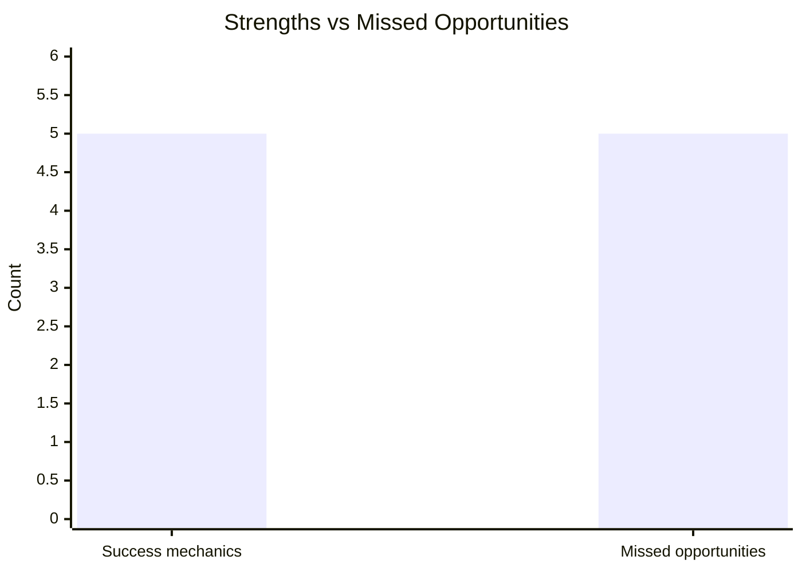

## 13. Кореляції та патерни

Correlation analysis skipped: fewer than 5 comparable videos.

| Pair | Correlation / Pattern | Strength | Interpretation | Confidence |
|---|---:|---|---|---|
| hook_score → overall_video_score | `INSUFFICIENT_DATA` | N/A | 1 відео не дозволяє оцінити зв’язок. | LOW |
| value_density_score → er_public_percent | `INSUFFICIENT_DATA` | N/A | 1 відео не дозволяє оцінити зв’язок. | LOW |
| cta_score → comment_rate_percent | `INSUFFICIENT_DATA` | N/A | 1 відео не дозволяє оцінити зв’язок. | LOW |
| comment_resonance_score → er_public_percent | `INSUFFICIENT_DATA` | N/A | 1 відео не дозволяє оцінити зв’язок. | LOW |
| views_per_day → er_public_percent | `INSUFFICIENT_DATA` | N/A | Немає розподілу high/low. | LOW |
| ad_load_percent → er_public_percent | `NOT_APPLICABLE` | N/A | Classic ad integration відсутня. | LOW |
| time_to_first_value_seconds → overall_video_score | `INSUFFICIENT_DATA` | N/A | 1 відео не дозволяє оцінити залежність. | LOW |

## 14. Висновки для контент-стратегії

| Спостереження | Дані / графік | Що це означає | Що робити |
|---|---|---|---|
| Debate-driven historical framing працює як single-case engagement engine | Comment clusters: discussion 40.9%, criticism 8.3%, questions 9.3%, requests 8.3%; comment resonance 4/5 | Тема не просто отримує лайки, а запускає дискусії. | Робити серію з історичними паралелями, але з джерелами й контрольованим prompt. |
| Hook достатньо сильний | Hook score 4/5, hook type `PROMISE`, time to first value 13 sec | Формула швидко пояснює stakes і promise. | Тестувати той самий opening: афоризм → promise → numbered framework. |
| CTA — головна зона росту | CTA score 3/5; next-video bridge ❌; subscribe/like/bell ❌ | Відео може втрачати session time і конверсії після payoff. | Додати verbal comment prompt, pinned hub, end-screen bridge. |
| Коментарі дають roadmap для наступних тем | Requests/topic extensions 35 comments / 8.3% | Аудиторія сама пропонує продовження: China, Syria, Spanish Civil War, Manchuria, Trump. | Запланувати playlist і використати запити як title/thumbnail research. |
| Classic ad risk відсутній | Ad load 0.0%, ad score N/A | Немає доказів, що реклама шкодить engagement. | Не додавати ранню рекламу; self-promo лишати після value. |
| Audio не є основним бар’єром, але не топ-сила | Audio score 3/5; audio fatigue risk LOW/LOW_CONFIDENCE у первинному звіті | Загальний результат тримається на темі/структурі/коментарях, не на production polish. | Для масштабування покращити clarity/levels, але не ставити це вище за hook/CTA. |

## 15. Що тестувати далі

| Тест | Гіпотеза | На яких даних базується | Як виміряти | Пріоритет |
|---|---|---|---|---|
| Серія “History Lessons We Are Failing to Learn” | Повторення формату історична аналогія → сучасний ризик → уроки дасть стабільне engagement | Success mechanics: `CONTROVERSY_OR_DEBATE`, `EVERGREEN_VALUE`, `HIGH_COMMENT_TRIGGER`; requests 8.3% | Views/day, ER Public %, comments per 1k views, returning viewers | HIGH |
| Явний comment prompt після payoff | Керований prompt підвищить якість коментарів і зменшить хаос | Missed opportunity `NO_COMMENT_PROMPT`; questions/requests/discussion clusters | Comment rate %, частка relevant comments, частка requests/questions | HIGH |
| Pinned comment hub | Власний pinned comment з питанням, джерелами й next video підвищить session/CTA response | `MISSING_PINNED_COMMENT_STRATEGY`; pinned чужий praise comment мав 273 likes | CTR на next video, replies to pinned, support clicks якщо доступно | HIGH |
| End-screen bridge | Перехід на related відео збільшить session time | `NO_NEXT_VIDEO_BRIDGE`; CTA features heatmap показує ❌ | End screen CTR, next-video views, average views per viewer | HIGH |
| Follow-up “5 parallels I missed” | Аудиторія вже просить/додає пропущені теми | Requests 35, confusion/questions 39, topic gaps: China/Syria/Spanish Civil War | Views/day, comment_rate, positive/request cluster share | HIGH |
| Stronger source packaging | Поляризовані claims потребують proof layer, щоб зменшити criticism accuracy | Criticism of comparison/accuracy 8.3%; questions/clarifications 9.3% | Negative %, criticism_accuracy count, retention around proof blocks | MEDIUM |
| Audio polish | Трохи кращий звук може підняти perceived authority | Audio score 3/5 | Audio complaints count, AVD, retention in first 60 sec | MEDIUM |
| Не додавати early sponsor read | Ранній ad може нашкодити first value | Ad load 0.0%, no ad complaints | Якщо sponsor буде: compare retention before/after ad, ER Public %, ad complaints | MEDIUM |

## 16. Дані для експорту в таблицю / CSV

| video_label | title | format_group | views | likes | comments_count | subscribers | views_per_day | like_rate_percent | comment_rate_percent | er_public_percent | views_per_1k_subs | likes_per_1k_views | comments_per_1k_views | impressions_ctr_percent | avg_view_duration | watch_time_hours | subscribers_gained | hook_type | hook_score | cta_count | cta_score | ad_load_percent | ad_integration_score | audio_score | comment_resonance_score | overall_video_score | top_success_mechanic | top_missed_opportunity |
|---|---|---|---:|---:|---:|---:|---:|---:|---:|---:|---:|---:|---:|---:|---|---:|---:|---|---:|---:|---:|---:|---:|---:|---:|---:|---|---|
| Video 1 | THREE History Lessons We Are Failing to Learn | LONG_10_20_MIN | 23694 | 2664 | 548 | 19100 | 50.52 | 11.24 | 2.31 | 13.56 | 1240.52 | 112.43 | 23.13 | 4.4 | 07:36 | 2700 | 279 | PROMISE | 4 | 5 | 3 | 0.0 | N/A | 3 | 4 | 3.89 | CONTROVERSY_OR_DEBATE | NO_COMMENT_PROMPT |

```csv
video_label,title,format_group,views,likes,comments_count,subscribers,views_per_day,like_rate_percent,comment_rate_percent,er_public_percent,views_per_1k_subs,likes_per_1k_views,comments_per_1k_views,impressions_ctr_percent,avg_view_duration,watch_time_hours,subscribers_gained,hook_type,hook_score,cta_count,cta_score,ad_load_percent,ad_integration_score,audio_score,comment_resonance_score,overall_video_score,top_success_mechanic,top_missed_opportunity
Video 1,THREE History Lessons We Are Failing to Learn,LONG_10_20_MIN,23694,2664,548,19100,50.52,11.24,2.31,13.56,1240.52,112.43,23.13,4.4,07:36,2700,279,PROMISE,4,5,3,0.0,N/A,3,4,3.89,CONTROVERSY_OR_DEBATE,NO_COMMENT_PROMPT
```