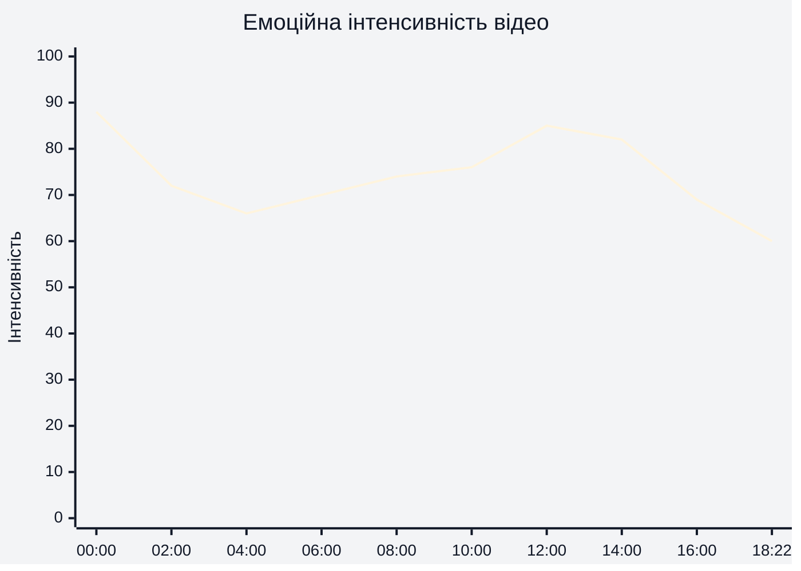
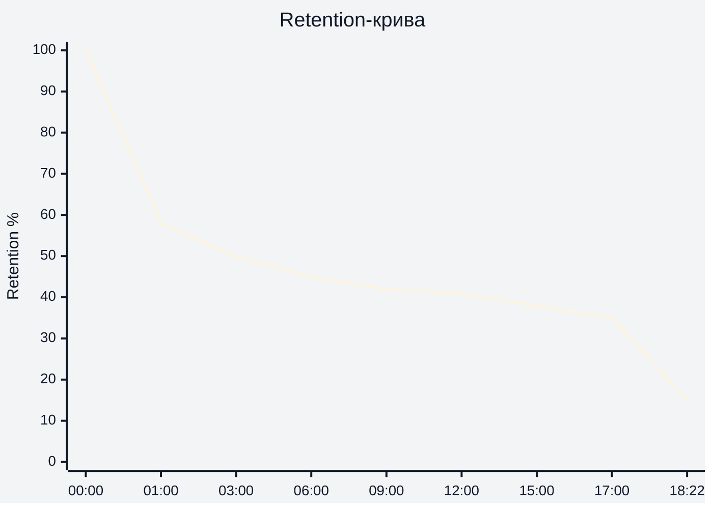

# Аналіз довгоформатного YouTube-відео

## 1. Сюжетна дуга (Narrative Arc)

```mermaid
%%{init: {'theme':'base', 'themeVariables': {
'primaryColor':'#f3f4f6',
'primaryTextColor':'#111827',
'primaryBorderColor':'#2563eb',
'lineColor':'#2563eb',
'secondaryColor':'#ffffff',
'tertiaryColor':'#f3f4f6',
'background':'#f3f4f6'
}}}%%
flowchart LR

A["00:00–00:40<br>Хук<br>Постановка історичної проблеми та загрози повторення помилок"] -->
B["00:40–02:10<br>Експозиція<br>Контекст історичних прикладів і головної теми"] -->
C["02:10–05:00<br>Перша ескалація<br>Поява першого історичного уроку"] -->
D["05:00–07:30<br>Переломний момент<br>Порівняння минулого із сучасністю"] -->
E["07:30–11:20<br>Наростання напруги<br>Демонстрація наслідків і повторюваних циклів"] -->
F["11:20–14:40<br>Кульмінація<br>Найсильніші історичні паралелі та висновки"] -->
G["14:40–17:10<br>Розв’язка<br>Пояснення, як уникнути повторення помилок"] -->
H["17:10–18:22<br>Фінальний висновок<br>Емоційне завершення та заклик до рефлексії"]
```

---

## 2. Ключові Story Beats

```mermaid
%%{init: {'theme':'base', 'themeVariables': {
'primaryColor':'#f3f4f6',
'primaryTextColor':'#111827',
'primaryBorderColor':'#2563eb',
'lineColor':'#2563eb',
'secondaryColor':'#ffffff',
'tertiaryColor':'#f3f4f6',
'background':'#f3f4f6'
}}}%%
flowchart LR

A["00:00<br>Провокативний вступ<br>Функція: миттєве захоплення уваги"] -->
B["00:35<br>Постановка головного питання<br>Функція: створення інтриги"] -->
C["01:40<br>Перший історичний кейс<br>Функція: авторитетність теми"] -->
D["03:10<br>Поява конфлікту<br>Функція: підняття ставок"] -->
E["05:30<br>Порівняння із сучасністю<br>Функція: релевантність для глядача"] -->
F["07:45<br>Другий ключовий урок<br>Функція: посилення драматургії"] -->
G["10:10<br>Емоційний перелом<br>Функція: утримання через напругу"] -->
H["12:30<br>Найсильніша паралель<br>Функція: кульмінаційний аргумент"] -->
I["14:50<br>Пояснення наслідків<br>Функція: інтелектуальна винагорода"] -->
J["16:20<br>Заклик до усвідомлення<br>Функція: емоційне завершення"] -->
K["17:50<br>Фінальна теза<br>Функція: закріплення головної думки"]
```

---

## 3. Емоційний темп

---

## 4. Утримання аудиторії

(Побудовано на основі наданого retention-графіка YouTube Studio)

Середня тривалість перегляду: **6:56**  
Середній відсоток перегляду: **37.3%**

---

## 5. Провали retention

| Таймкод | Проблема | Ймовірна причина спаду | Що покращити |
|---|---|---|---|
| 00:30–01:20 | Різкий стартовий спад | Хук не повністю окупається швидкою винагородою | Скоротити вступні пояснення |
| 03:30–04:30 | Темп уповільнюється | Забагато контексту без нової інформації | Додати візуальні зміни або швидші монтажні переходи |
| 07:00–08:20 | Рівна динаміка | Відсутність нового конфлікту | Вставити мікро-хук або контраст |
| 14:30–15:30 | Втома після кульмінації | Надто довге пояснення після сильного моменту | Стиснути аналітичний блок |
| 17:20–18:22 | Фінальний обвал | Завершення без нового стимулу | Додати teaser або відкритий фінал |

---