# Статистичний аналіз відеозвітів

## 1. Короткий executive summary

| Пункт | Висновок |
|---|---|
| Скільки відео проаналізовано | 1 |
| Скільки форматів відео | 1: `LONG_20_PLUS_MIN` |
| Найсильніше відео за overall score | Video 1 — 4.0 / 5. Через вибірку з 1 відео це не порівняльний лідер, а єдиний доступний кейс. |
| Найсильніше відео за ER Public % | Video 1 — 16.997%. Порівняння з іншими відео неможливе: `INSUFFICIENT_DATA`. |
| Найсильніше відео за views per day | Video 1 — 123.99 views/day. Порівняння з іншими відео неможливе: `INSUFFICIENT_DATA`. |
| Найсильніша повторювана механіка | `NOT_COMPARABLE`: повторюваність неможливо підтвердити на 1 відео. У цьому кейсі найсильніша механіка — controversy / debate + evidence promise. |
| Найчастіша слабкість | `NOT_COMPARABLE`: частоту неможливо визначити на 1 відео. У цьому кейсі головна слабкість — main proof починається на 14:40 при AVD 8:11. |
| Головна стратегічна можливість | Перетворити високу дискусійність у серію follow-up відео з objection handling, source pack і конкретним next-video bridge. |
| Рівень впевненості | `LOW_CONFIDENCE` для статистичних висновків, бо є лише 1 відео; `MEDIUM` для опису самого кейсу, бо звіт містить метрики, owner analytics, comments, audio і scores. |

## 2. Якість і повнота даних

| Поле | Кількість відео з даними | Кількість N/A | Коментар |
|---|---:|---:|---|
| views | 1 | 0 | 108 489 |
| likes | 1 | 0 | 12 975 |
| comments_count | 1 | 0 | 5 465 |
| views_per_day | 1 | 0 | 123.99 |
| er_public_percent | 1 | 0 | 16.997% |
| views_per_1k_subs | 1 | 0 | 5 680.05 |
| hook_score | 1 | 0 | 4.5 / 5 |
| cta_score | 1 | 0 | 3.4 / 5 |
| ad_integration_score | 1 | 0 | 3.5 / 5; це self/charity/Figma integration, не paid sponsor. |
| audio_score | 1 | 0 | 3.6 / 5; частина аудіо-оцінки має `LOW_CONFIDENCE`. |
| comment_resonance_score | 1 | 0 | 4.3 / 5 |
| overall_video_score | 1 | 0 | 4.0 / 5 |

### Обмеження аналізу

- Проаналізовано лише 1 звіт `YT_VIDEO_ANALYSIS_V1`, тому всі порівняння, лідери, outliers і патерни мають `LOW_CONFIDENCE`.
- Кореляції не будуються: менше ніж 5 comparable videos.
- Не можна визначити, які механіки “повторюються” статистично; можна описати лише механіки одного кейсу.
- Усі графіки нижче є описовими single-video charts або таблицями для ручного порівняння після додавання нових відео.
- Формат відео один: `LONG_20_PLUS_MIN`; змішування Shorts / long-form / live не відбувається.

## 3. Підготовлена таблиця для графіків

| Video | Format | Views | Likes | Comments | Subscribers | Views/day | Like Rate % | Comment Rate % | ER Public % | Views/1k subs | Likes/1k views | Comments/1k views | Hook | CTA | Ad | Audio | Comment Resonance | Overall |
|---|---|---:|---:|---:|---:|---:|---:|---:|---:|---:|---:|---:|---:|---:|---:|---:|---:|---:|
| Video 1 | `LONG_20_PLUS_MIN` | 108489 | 12975 | 5465 | 19100 | 123.99 | 11.960 | 5.037 | 16.997 | 5680.05 | 119.60 | 50.37 | 4.5 | 3.4 | 3.5 | 3.6 | 4.3 | 4.0 |

| Label | Full title | URL |
|---|---|---|
| Video 1 | Theft of millennia: how Moscovia rebranded itself as 'Russia' | https://www.youtube.com/watch?v=B6b7WQy1Y3Q |

## 4. Рекомендовані графіки

| # | Назва графіка | Тип графіка | Поля | Для чого потрібен | Пріоритет |
|---:|---|---|---|---|---|
| 1 | Overall score by video | Bar chart | `overall_video_score` | Швидко побачити загальну оцінку кейсу; стане порівняльним після додавання інших відео. | HIGH |
| 2 | Views per day by video | Bar chart | `views_per_day` | Показати нормалізовану швидкість набору переглядів. | HIGH |
| 3 | ER Public % by video | Bar chart | `er_public_percent` | Оцінити публічну залученість. | HIGH |
| 4 | ER Public % vs Views/day | Scatter / quadrant | `er_public_percent`, `views_per_day` | Побачити баланс охоплення і залучення; зараз тільки 1 точка. | HIGH |
| 5 | Hook score by video | Bar chart | `hook_score` | Оцінити якість старту. | HIGH |
| 6 | CTA score by video | Bar chart | `cta_score` | Оцінити якість закликів до дії. | HIGH |
| 7 | Score breakdown heatmap | Heatmap / matrix | score fields | Побачити сильні/слабкі сторони відео. | HIGH |
| 8 | Sentiment distribution | Stacked bar / table | comment sentiment counts | Показати структуру реакції аудиторії. | HIGH |
| 9 | CTA features heatmap | Matrix | CTA boolean fields | Побачити, які CTA є / відсутні. | HIGH |
| 10 | Ad load % by video | Bar chart | `ad_load_percent` | Оцінити self/charity/promo навантаження. | MEDIUM |
| 11 | Top comment clusters | Horizontal bar | cluster count / percent | Показати, що саме обговорювали. | HIGH |
| 12 | Time to first value vs Overall Score | Scatter | `time_to_first_value_seconds`, `overall_video_score` | Потенційний retention-патерн; зараз single-point chart. | MEDIUM |

## 5. Графіки продуктивності

## 5.1. Views by video

- Назва графіка: Views by video
- Яке питання він відповідає: який raw reach має відео?
- Які поля використовуються: `video_label`, `views`
- Тип графіка: bar chart / Mermaid `xychart-beta`
- Що видно з графіка: Video 1 має 108 489 views.
- Практичний висновок: raw views не можна називати сильними або слабкими без когорти; використовувати разом із views/day і views/1k subs.

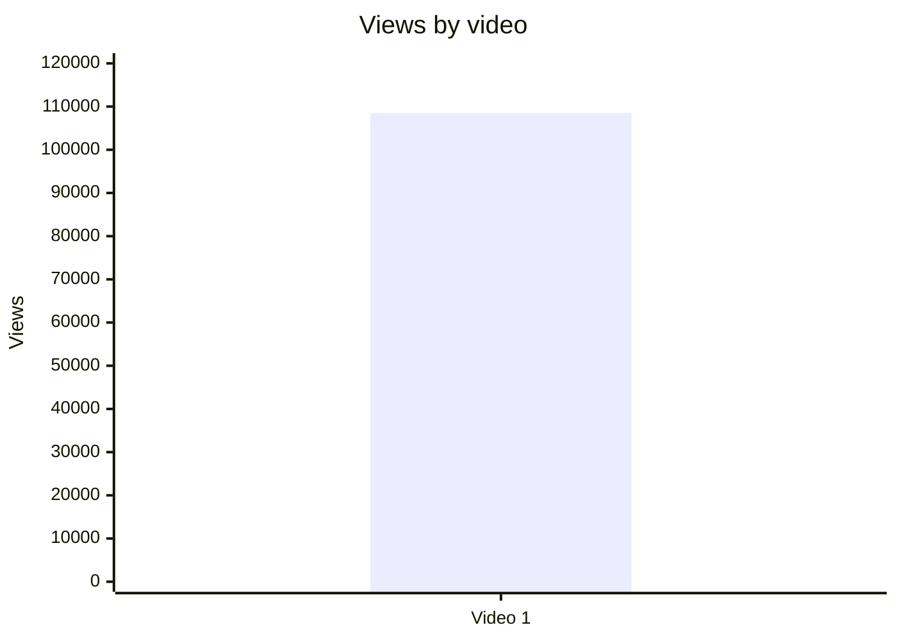
```mermaid
xychart-beta
    title "Views by video"
    x-axis ["Video 1"]
    y-axis "Views" 0 --> 120000
    bar [108489]
```

| Video | Views | Коментар |
|---|---:|---|
| Video 1 | 108489 | Єдиний кейс; outlier detection неможливий: `INSUFFICIENT_DATA`. |

## 5.2. Views per day by video

- Назва графіка: Views per day by video
- Яке питання він відповідає: яка нормалізована швидкість набору переглядів?
- Які поля використовуються: `video_label`, `views_per_day`
- Тип графіка: bar chart
- Що видно з графіка: Video 1 має 123.99 views/day.
- Практичний висновок: метрика корисна для майбутнього порівняння з відео різного віку; зараз це baseline для `LONG_20_PLUS_MIN`.

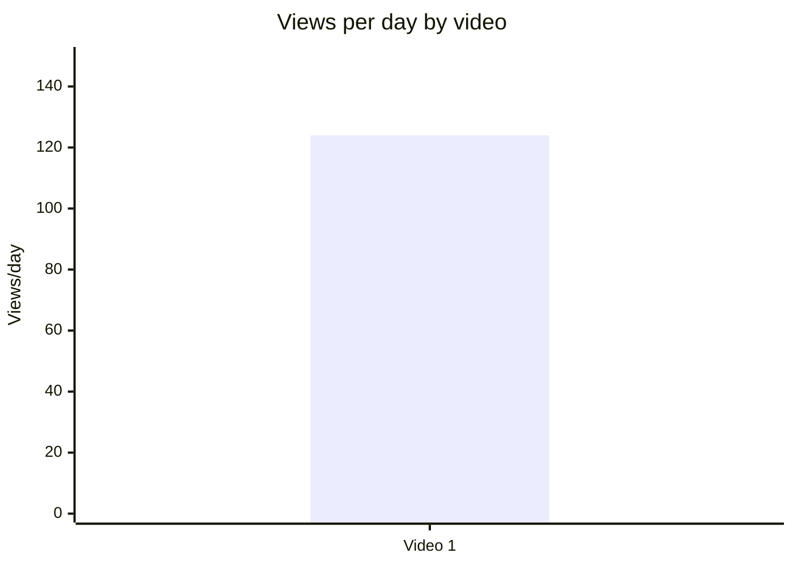
```mermaid
xychart-beta
    title "Views per day by video"
    x-axis ["Video 1"]
    y-axis "Views/day" 0 --> 150
    bar [123.99]
```

## 5.3. Views per 1k subscribers

- Назва графіка: Views per 1k subscribers
- Яке питання він відповідає: наскільки відео виходить за межі розміру каналу?
- Які поля використовуються: `video_label`, `views_per_1k_subs`
- Тип графіка: bar chart
- Що видно з графіка: Video 1 має 5 680.05 views per 1k subs.
- Практичний висновок: кейс може бути корисним як референс для тем, що масштабуються за межі ядра аудиторії; порівняльна оцінка потребує інших відео.

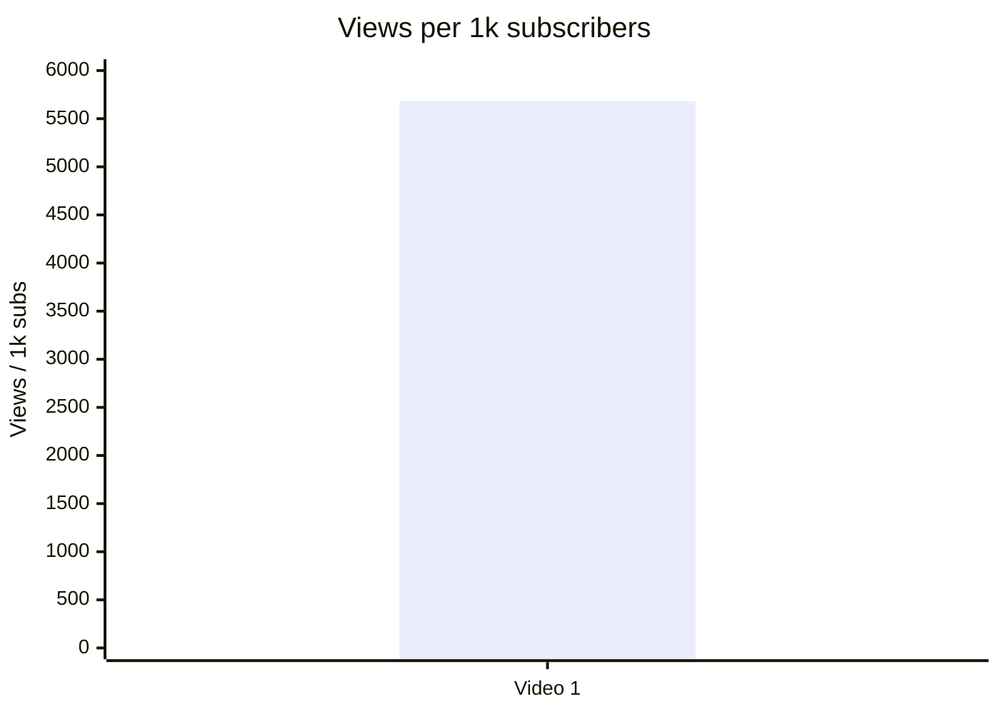
```mermaid
xychart-beta
    title "Views per 1k subscribers"
    x-axis ["Video 1"]
    y-axis "Views / 1k subs" 0 --> 6000
    bar [5680.05]
```

## 5.4. Performance quadrant

- Назва графіка: Performance quadrant
- Яке питання він відповідає: де відео лежить у балансі reach speed vs engagement?
- Які поля використовуються: `views_per_day`, `er_public_percent`
- Тип графіка: scatter plot / quadrant table
- Що видно з графіка: є лише 1 точка: views/day 123.99, ER Public 16.997%.
- Практичний висновок: quadrant classification неможлива без медіан або кількох comparable videos; поточна точка є baseline.

| Video | views_per_day | er_public_percent | Quadrant |
|---|---:|---:|---|
| Video 1 | 123.99 | 16.997 | `INSUFFICIENT_DATA`: немає медіан для меж high/low. |

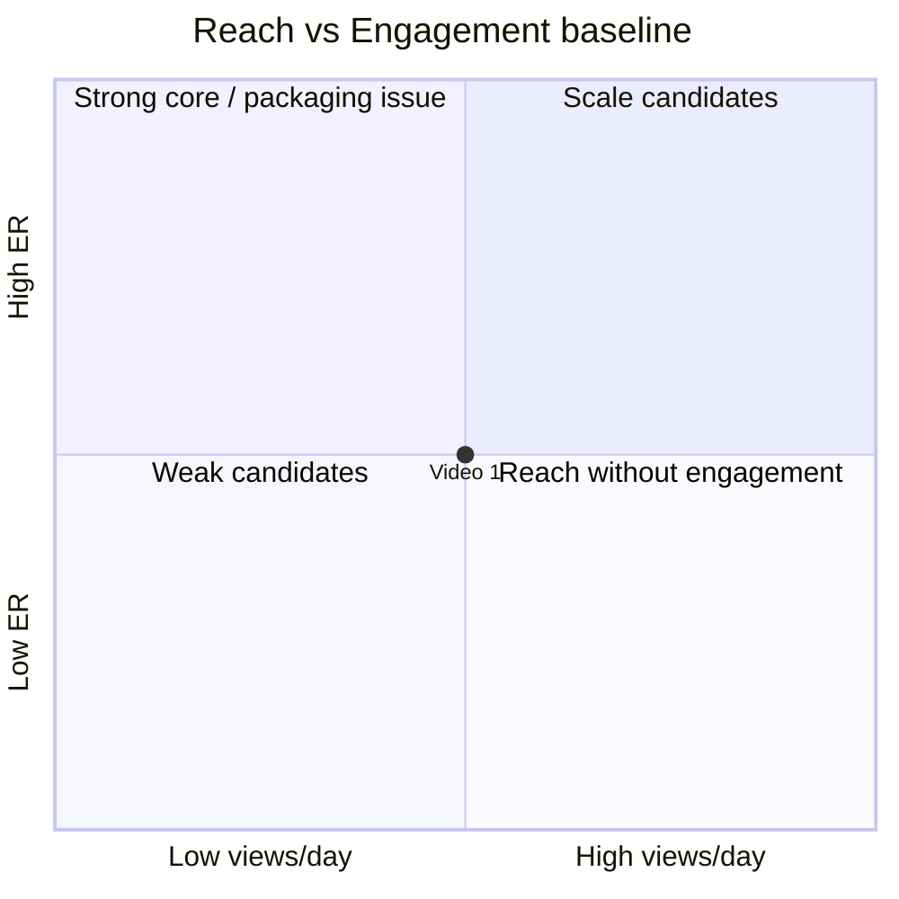
```mermaid
quadrantChart
    title Reach vs Engagement baseline
    x-axis Low views/day --> High views/day
    y-axis Low ER --> High ER
    quadrant-1 Scale candidates
    quadrant-2 Strong core / packaging issue
    quadrant-3 Weak candidates
    quadrant-4 Reach without engagement
    "Video 1" : [0.50, 0.50]
```

## 6. Графіки залучення

## 6.1. ER Public % by video

- Назва графіка: ER Public % by video
- Яке питання він відповідає: наскільки відео викликає публічну реакцію?
- Які поля використовуються: `video_label`, `er_public_percent`
- Тип графіка: bar chart
- Що видно з графіка: Video 1 має ER Public 16.997%.
- Практичний висновок: високий engagement baseline для цього кейсу; без когорти не називати outlier.

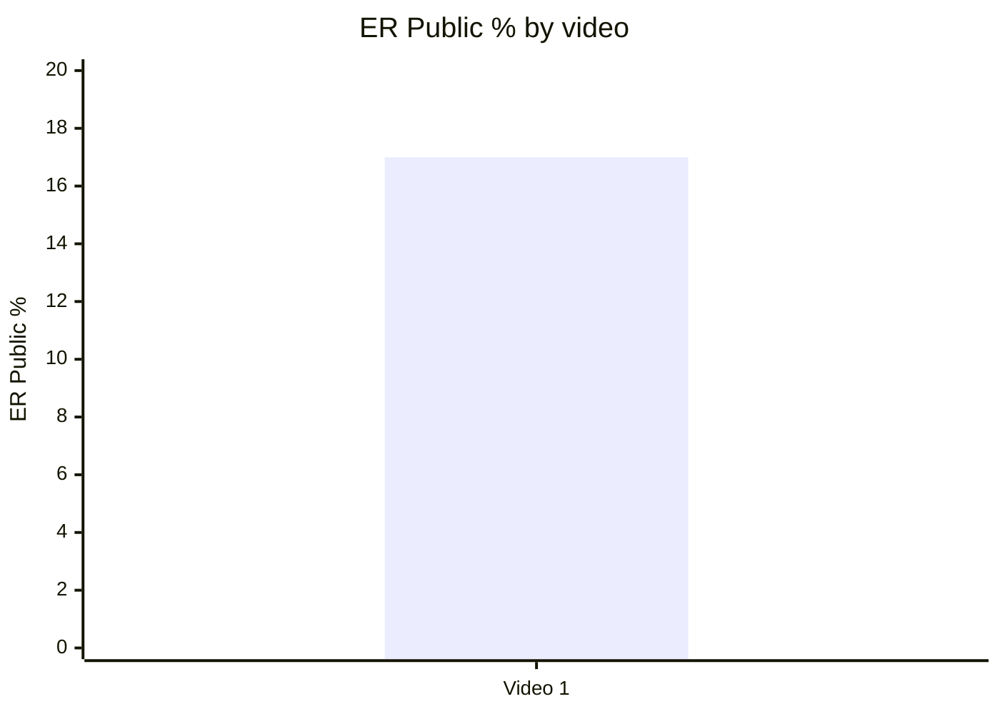
```mermaid
xychart-beta
    title "ER Public % by video"
    x-axis ["Video 1"]
    y-axis "ER Public %" 0 --> 20
    bar [16.997]
```

## 6.2. Like Rate % vs Comment Rate %

- Назва графіка: Like Rate % vs Comment Rate %
- Яке питання він відповідає: реакція більше схожа на approval чи дискусію?
- Які поля використовуються: `like_rate_percent`, `comment_rate_percent`
- Тип графіка: scatter plot / point table
- Що видно з графіка: Video 1 має like rate 11.960% і comment rate 5.037%.
- Практичний висновок: кейс одночасно має сильний like response і сильний discussion response; потрібна когорту, щоб сказати, що саме є аномалією.

| Video | Like Rate % | Comment Rate % | Інтерпретація |
|---|---:|---:|---|
| Video 1 | 11.960 | 5.037 | High reaction case, але high/low межі не визначені без порівняльної вибірки. |

## 6.3. Comments per 1k views

- Назва графіка: Comments per 1k views
- Яке питання він відповідає: наскільки відео провокує коментарі відносно переглядів?
- Які поля використовуються: `video_label`, `comments_per_1k_views`
- Тип графіка: bar chart
- Що видно з графіка: Video 1 має 50.37 comments per 1k views.
- Практичний висновок: це сильний baseline для тем, що будують дискусію; для майбутніх відео треба відстежувати, чи зростає comment quality, а не лише comment count.

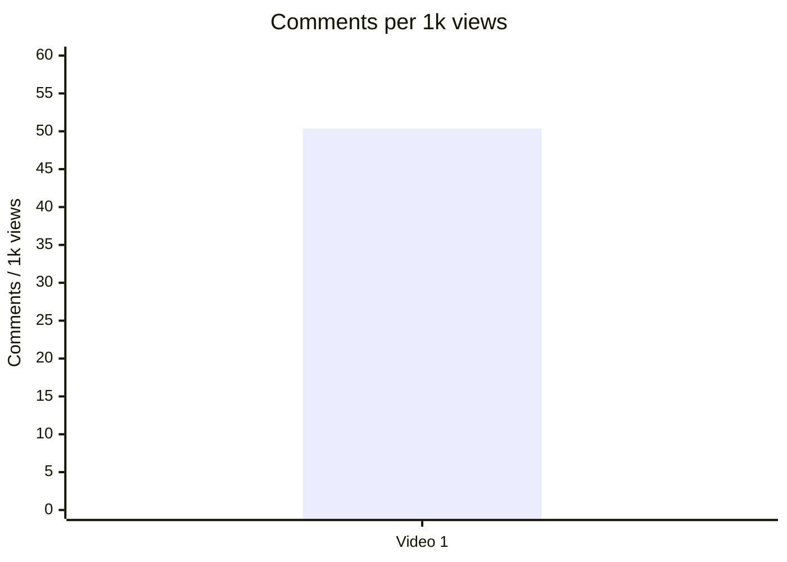
```mermaid
xychart-beta
    title "Comments per 1k views"
    x-axis ["Video 1"]
    y-axis "Comments / 1k views" 0 --> 60
    bar [50.37]
```

## 7. Графіки структури та hook

## 7.1. Hook score by video

- Назва графіка: Hook score by video
- Яке питання він відповідає: наскільки сильний старт?
- Які поля використовуються: `video_label`, `hook_score`
- Тип графіка: bar chart
- Що видно з графіка: Hook score = 4.5 / 5.
- Практичний висновок: bold conflict + evidence promise варто повторювати, але без blanket statements, які підсилюють accuracy-dispute.

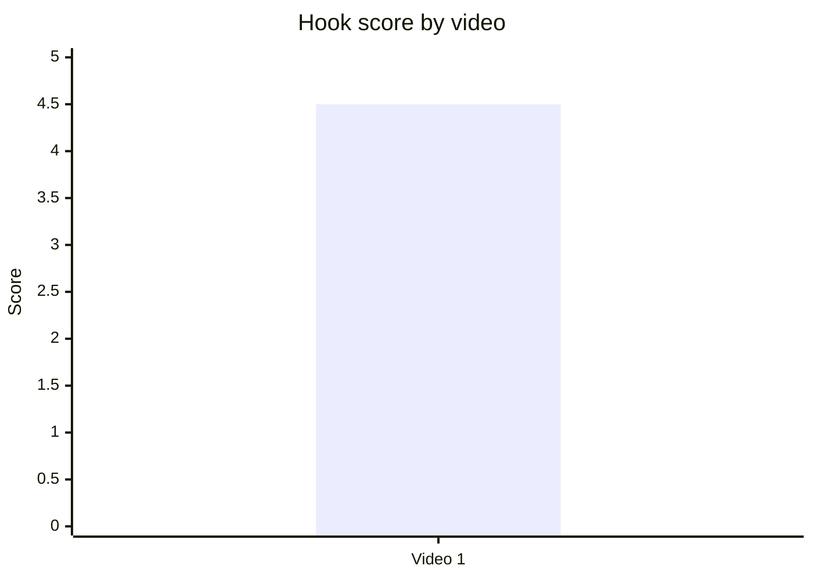
```mermaid
xychart-beta
    title "Hook score by video"
    x-axis ["Video 1"]
    y-axis "Score" 0 --> 5
    bar [4.5]
```

## 7.2. Hook type distribution

- Назва графіка: Hook type distribution
- Яке питання він відповідає: який primary hook type використано?
- Які поля використовуються: `hook_primary_type`, count
- Тип графіка: pie chart
- Що видно з графіка: 1 із 1 відео має primary hook `CONFLICT`.
- Практичний висновок: на одному кейсі не можна сказати, що `CONFLICT` працює краще за інші типи; це лише поточний форматний baseline.

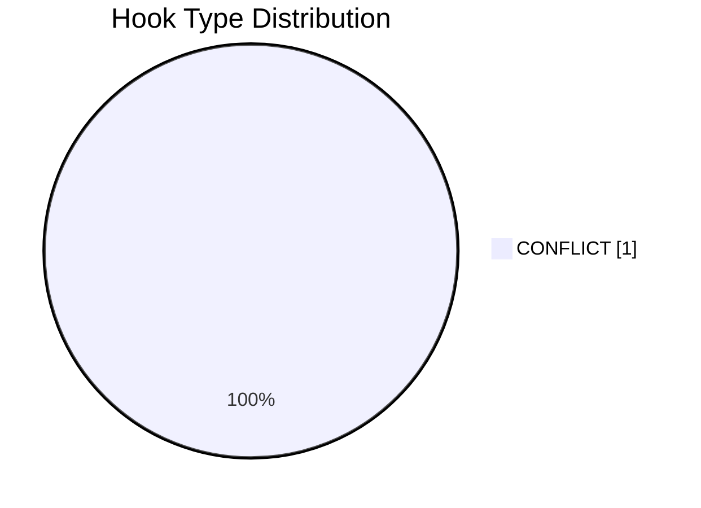
```mermaid
pie showData
    title Hook Type Distribution
    "CONFLICT" : 1
```

| Hook type | Count | Частка |
|---|---:|---:|
| CONFLICT | 1 | 100% |

## 7.3. Time to first value vs Overall Score

- Назва графіка: Time to first value vs Overall Score
- Яке питання він відповідає: чи швидший перший value пов’язаний із вищим overall score?
- Які поля використовуються: `time_to_first_value_seconds`, `overall_video_score`
- Тип графіка: scatter plot / point table
- Що видно з графіка: Video 1 має time to first value ≈ 75 sec і overall score 4.0.
- Практичний висновок: зв’язок не аналізується через 1 відео; для тесту варто зменшити time to first proof preview до < 120 sec.

| Video | time_to_first_value_seconds | overall_video_score | Коментар |
|---|---:|---:|---|
| Video 1 | 75 | 4.0 | Перша смислова цінність ~01:15; main payoff тільки 14:40. |

## 8. Графіки CTA

## 8.1. CTA score by video

- Назва графіка: CTA score by video
- Яке питання він відповідає: наскільки якісно CTA інтегровані?
- Які поля використовуються: `video_label`, `cta_score`
- Тип графіка: bar chart
- Що видно з графіка: CTA score = 3.4 / 5.
- Практичний висновок: CTA працює як Figma / share / comment / support bridge, але бракує explicit subscribe, like, bell і чіткого next-video bridge.

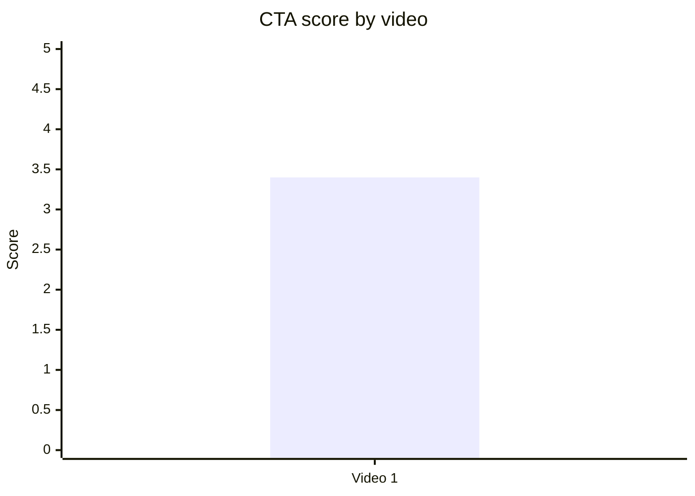
```mermaid
xychart-beta
    title "CTA score by video"
    x-axis ["Video 1"]
    y-axis "Score" 0 --> 5
    bar [3.4]
```

## 8.2. CTA count vs ER Public %

- Назва графіка: CTA count vs ER Public %
- Яке питання він відповідає: чи більше CTA пов’язано з кращим engagement?
- Які поля використовуються: `cta_count`, `er_public_percent`
- Тип графіка: scatter plot / point table
- Що видно з графіка: Video 1 має 9 CTA events / placements і ER Public 16.997%.
- Практичний висновок: зв’язок не можна оцінити на одному відео; є ризик CTA overload у фіналі, бо кілька дій зібрано в outro.

| Video | cta_count | er_public_percent | CTA overload risk |
|---|---:|---:|---|
| Video 1 | 9 | 16.997 | `PARTLY`: багато CTA в кінці, але topic-fit CTA до Figma / comments релевантні. |

## 8.3. CTA features heatmap

- Назва графіка: CTA features heatmap
- Яке питання він відповідає: які CTA features є або відсутні?
- Які поля використовуються: `has_comment_prompt`, `has_subscribe_cta`, `has_like_cta`, `has_bell_cta`, `has_next_video_bridge`
- Тип графіка: heatmap / matrix
- Що видно з графіка: comment prompt є; subscribe / like / bell відсутні; next video bridge лише частковий.
- Практичний висновок: найшвидший тест — додати конкретний subscribe CTA після first proof preview і конкретний next-video bridge в outro.

| Video | Comment prompt | Subscribe | Like | Bell | Next video bridge |
|---|---|---|---|---|---|
| Video 1 | ✅ | ❌ | ❌ | ❌ | ◐ `PARTLY` |

## 9. Графіки реклами / інтеграцій

Paid sponsor не виявлено. У звіті є self/charity/Figma integrations, тому графіки нижче описують не paid ad, а promotional / support load.

## 9.1. Ad load % by video

- Назва графіка: Ad load % by video
- Яке питання він відповідає: яку частку відео займають promotional / support integrations?
- Які поля використовуються: `video_label`, `ad_load_percent`
- Тип графіка: bar chart
- Що видно з графіка: Video 1 має ad/promotional load 5.93%.
- Практичний висновок: навантаження не виглядає надмірним саме за відсотком, але outro support block може конкурувати з next-video bridge.

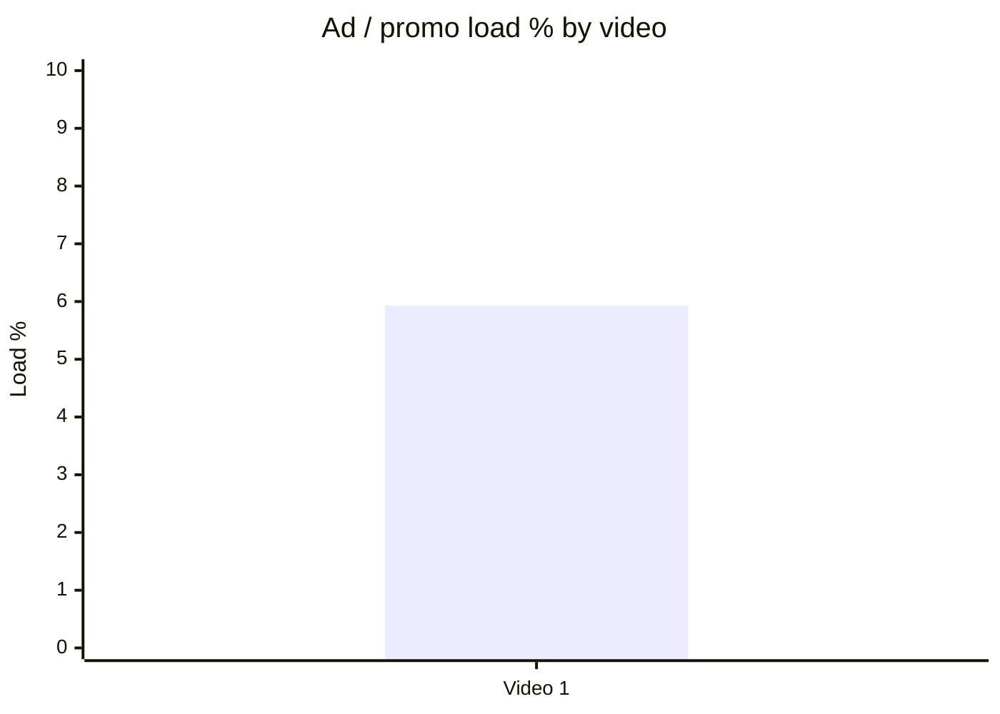
```mermaid
xychart-beta
    title "Ad / promo load % by video"
    x-axis ["Video 1"]
    y-axis "Load %" 0 --> 10
    bar [5.93]
```

## 9.2. First ad position %

- Назва графіка: First ad position %
- Яке питання він відповідає: чи промо з’являється занадто рано?
- Які поля використовуються: `first_ad_relative_position_percent`
- Тип графіка: bar chart / table
- Що видно з графіка: first promo/support marker приблизно 14:40, тобто ≈46.17% відео.
- Практичний висновок: перше значуще promo не стоїть до першої цінності; Figma link релевантний доказовому блоку.

| Video | first_ad_time | first_ad_relative_position_percent | Коментар |
|---|---|---:|---|
| Video 1 | ~14:40 | 46.17 | Не paid ad; Figma / evidence CTA пов’язаний із proof block. |

## 9.3. Ad integration score vs ER Public %

- Назва графіка: Ad integration score vs ER Public %
- Яке питання він відповідає: чи якість інтеграції пов’язана з реакцією аудиторії?
- Які поля використовуються: `ad_integration_score`, `er_public_percent`
- Тип графіка: scatter plot / point table
- Що видно з графіка: Video 1 має ad integration score 3.5 і ER Public 16.997%.
- Практичний висновок: зв’язок не аналізується через 1 кейс; у коментарях не виявлено значущого ad-fatigue cluster, але цей висновок описовий.

| Video | ad_integration_score | er_public_percent | Interpretation |
|---|---:|---:|---|
| Video 1 | 3.5 | 16.997 | `LOW_CONFIDENCE`: paid sponsor немає; self/charity/Figma integrations не мають помітного негативного comment cluster. |

## 10. Графіки аудіо

## 10.1. Audio score by video

- Назва графіка: Audio score by video
- Яке питання він відповідає: чи аудіо є сильним або слабким блоком відео?
- Які поля використовуються: `video_label`, `audio_score`
- Тип графіка: bar chart
- Що видно з графіка: Audio score = 3.6 / 5.
- Практичний висновок: аудіо достатнє, але не головний драйвер результату; варто тестувати меншу fatigue через темп, паузи, chapter recaps.

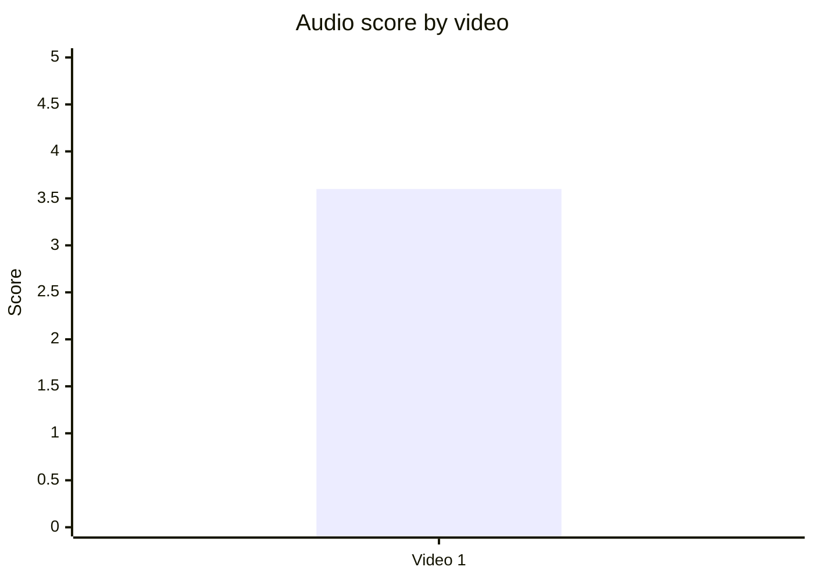
```mermaid
xychart-beta
    title "Audio score by video"
    x-axis ["Video 1"]
    y-axis "Score" 0 --> 5
    bar [3.6]
```

## 10.2. Audio score vs Overall Score

- Назва графіка: Audio score vs Overall Score
- Яке питання він відповідає: чи краща аудіо-оцінка пов’язана з вищим overall score?
- Які поля використовуються: `audio_score`, `overall_video_score`
- Тип графіка: scatter plot / point table
- Що видно з графіка: Video 1 має audio score 3.6 і overall score 4.0.
- Практичний висновок: причинний або кореляційний висновок неможливий; audio improvement варто тестувати як hygiene factor, не як головну гіпотезу.

| Video | audio_score | overall_video_score | Коментар |
|---|---:|---:|---|
| Video 1 | 3.6 | 4.0 | `LOW_CONFIDENCE`: single-point observation. |

## 11. Графіки коментарів

## 11.1. Sentiment distribution

- Назва графіка: Sentiment distribution
- Яке питання він відповідає: яка структура реакції аудиторії?
- Які поля використовуються: `positive_percent`, `negative_percent`, `mixed_percent`, `neutral_percent`, `question_percent`, `request_percent`; також `joke_meme_percent`, `spam_irrelevant_percent` як додаткові категорії зі звіту.
- Тип графіка: stacked bar chart / table
- Що видно з графіка: найбільші категорії — neutral/question, що відповідає дискусійній темі.
- Практичний висновок: відео працює не тільки як approval content, а як debate / question generator; потрібен pinned FAQ і follow-up серія.

| Sentiment | Count | Percent of parsed comments |
|---|---:|---:|
| POSITIVE | 774 | 15.66% |
| NEGATIVE | 410 | 8.29% |
| MIXED | 146 | 2.95% |
| NEUTRAL | 1852 | 37.47% |
| QUESTION | 1425 | 28.83% |
| REQUEST | 138 | 2.79% |
| JOKE_MEME | 157 | 3.18% |
| SPAM_IRRELEVANT | 41 | 0.83% |

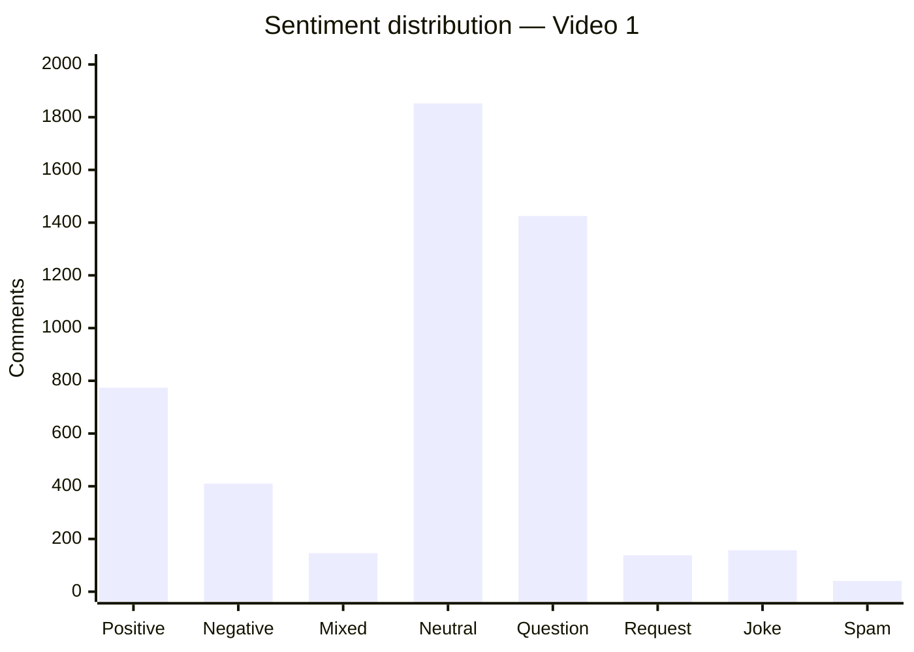
```mermaid
xychart-beta
    title "Sentiment distribution — Video 1"
    x-axis ["Positive", "Negative", "Mixed", "Neutral", "Question", "Request", "Joke", "Spam"]
    y-axis "Comments" 0 --> 2000
    bar [774, 410, 146, 1852, 1425, 138, 157, 41]
```

## 11.2. Comment resonance score by video

- Назва графіка: Comment resonance score by video
- Яке питання він відповідає: наскільки сильно відео резонує в коментарях?
- Які поля використовуються: `video_label`, `comment_resonance_score`
- Тип графіка: bar chart
- Що видно з графіка: Comment resonance score = 4.3 / 5.
- Практичний висновок: коментарі — один із найсильніших блоків кейсу; варто конвертувати їх у серійні теми.

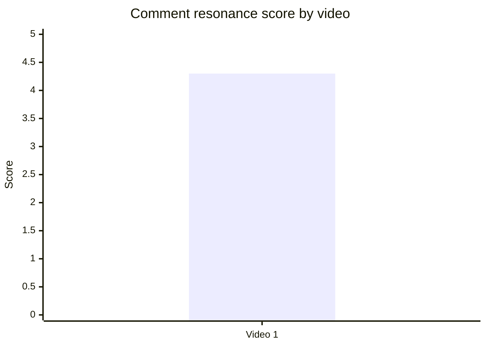
```mermaid
xychart-beta
    title "Comment resonance score by video"
    x-axis ["Video 1"]
    y-axis "Score" 0 --> 5
    bar [4.3]
```

## 11.3. Top comment clusters

- Назва графіка: Top comment clusters
- Яке питання він відповідає: що саме найчастіше обговорювали?
- Які поля використовуються: cluster name, count, percent_relevant
- Тип графіка: horizontal bar / Mermaid bar
- Що видно з графіка: найбільший кластер — identity / naming debate: 2 654 matches, 54.1% relevant comments.
- Практичний висновок: naming debate є головним comment engine; слабкість — accuracy / propaganda dispute 16.8%, який треба обробляти джерелами і FAQ.

| Cluster | Count | Percent of relevant comments | Практичний висновок |
|---|---:|---:|---|
| Identity / naming debate | 2654 | 54.1% | Головна тема, яку варто серіалізувати. |
| Accuracy / propaganda dispute | 822 | 16.8% | Потрібен structured rebuttal / source hub. |
| Praise clarity / value | 685 | 14.0% | Є попит на English-language explanatory history. |
| Personal / national stories | 519 | 10.6% | Можна просити аудиторію додавати локальні приклади / джерела. |
| Maps / sources / evidence requests | 477 | 9.7% | Source pack і pinned bibliography мають високий пріоритет. |

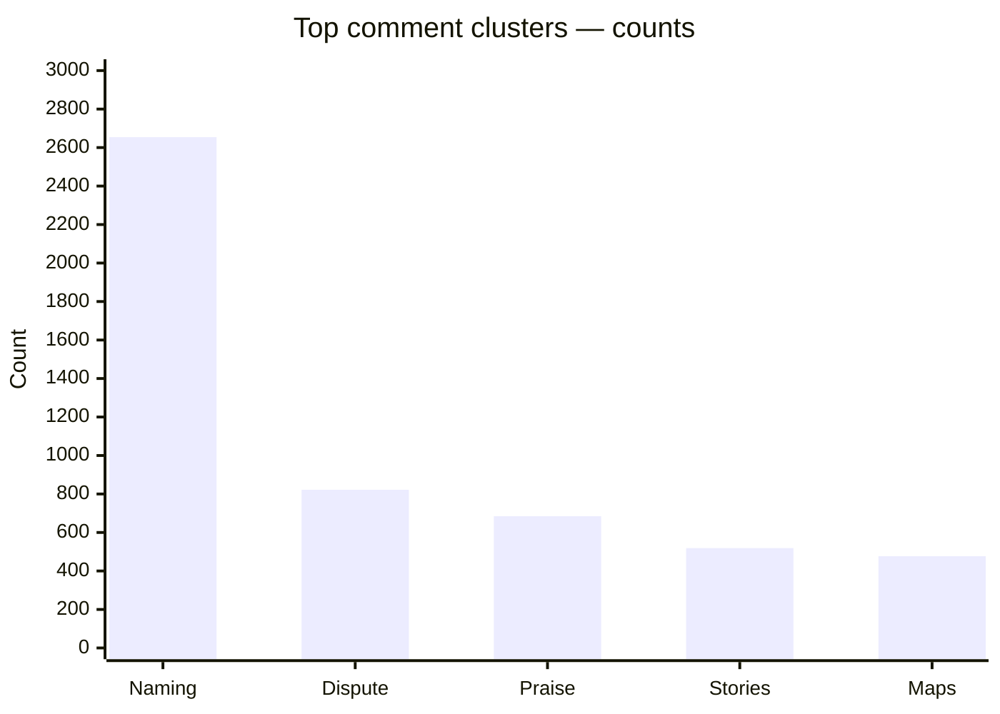
```mermaid
xychart-beta
    title "Top comment clusters — counts"
    x-axis ["Naming", "Dispute", "Praise", "Stories", "Maps"]
    y-axis "Count" 0 --> 3000
    bar [2654, 822, 685, 519, 477]
```

## 12. Графіки score-системи

## 12.1. Overall score by video

- Назва графіка: Overall score by video
- Яке питання він відповідає: яка загальна оцінка кейсу?
- Які поля використовуються: `video_label`, `overall_video_score`
- Тип графіка: bar chart
- Що видно з графіка: Overall score = 4.0 / 5.
- Практичний висновок: кейс сильний як одиничний reference, але не можна робити ranking без інших відео.

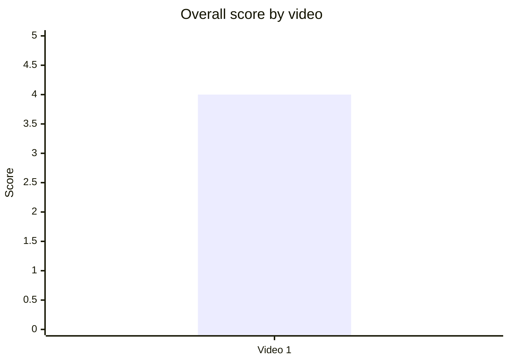
```mermaid
xychart-beta
    title "Overall score by video"
    x-axis ["Video 1"]
    y-axis "Score" 0 --> 5
    bar [4.0]
```

## 12.2. Score breakdown heatmap

- Назва графіка: Score breakdown heatmap
- Яке питання він відповідає: де сильні і слабкі score-компоненти?
- Які поля використовуються: `hook_score`, `structure_score`, `value_density_score`, `audio_score`, `cta_score`, `ad_integration_score`, `comment_resonance_score`, `replicability_score`, `overall_video_score`
- Тип графіка: heatmap / matrix
- Що видно з графіка: найсильніші блоки — hook 4.5, comments 4.3, structure 4.2; слабші — CTA 3.4, ad/promo integration 3.5, audio 3.6.
- Практичний висновок: оптимізація має йти не через зміну теми, а через packaging of proof, CTA architecture і source handling.

| Video | Hook | Structure | Value Density | Audio | CTA | Ad | Comments | Replicability | Overall |
|---|---:|---:|---:|---:|---:|---:|---:|---:|---:|
| Video 1 | 4.5 | 4.2 | 4.0 | 3.6 | 3.4 | 3.5 | 4.3 | 4.0 | 4.0 |

| Score block | Score | Heat |
|---|---:|---|
| Hook | 4.5 | 🟩🟩🟩🟩⬜ |
| Structure | 4.2 | 🟩🟩🟩🟩⬜ |
| Value Density | 4.0 | 🟩🟩🟩🟩⬜ |
| Audio | 3.6 | 🟨🟨🟨⬜⬜ |
| CTA | 3.4 | 🟨🟨🟨⬜⬜ |
| Ad / Promo | 3.5 | 🟨🟨🟨⬜⬜ |
| Comments | 4.3 | 🟩🟩🟩🟩⬜ |
| Replicability | 4.0 | 🟩🟩🟩🟩⬜ |
| Overall | 4.0 | 🟩🟩🟩🟩⬜ |

## 12.3. Strengths vs weaknesses count

- Назва графіка: Strengths vs weaknesses count
- Яке питання він відповідає: скільки success mechanics і missed opportunities зафіксовано?
- Які поля використовуються: count of success mechanics, count of missed opportunities
- Тип графіка: stacked bar / table
- Що видно з графіка: у звіті є 5 success mechanics і 5 missed opportunities.
- Практичний висновок: сильний кейс має стільки ж actionable gaps, скільки сильних механік; його варто не просто повторювати, а повторювати з покращеннями.

| Video | Success mechanics count | Missed opportunities count | Коментар |
|---|---:|---:|---|
| Video 1 | 5 | 5 | Баланс: формат працює, але має чіткі improvement levers. |

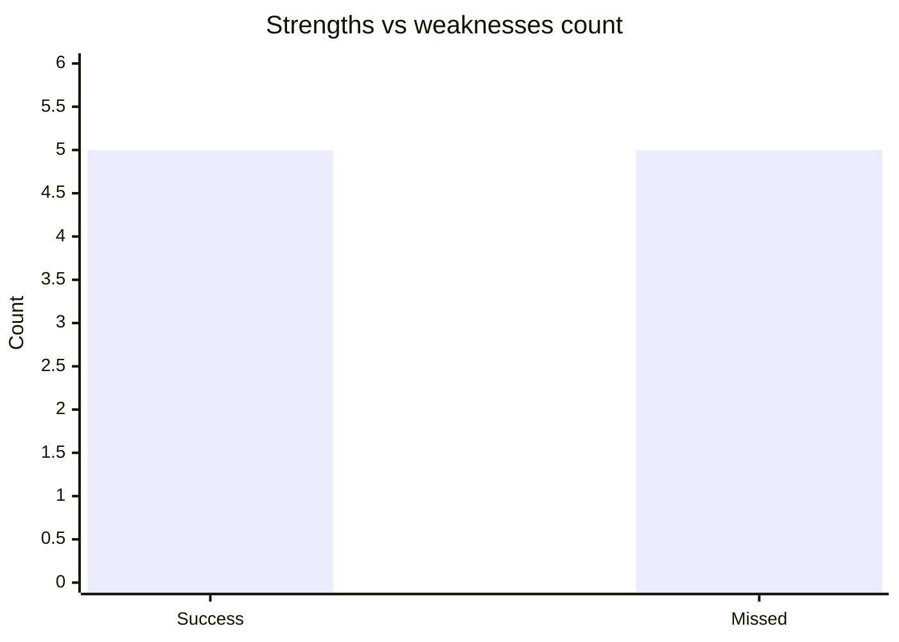
```mermaid
xychart-beta
    title "Strengths vs weaknesses count"
    x-axis ["Success", "Missed"]
    y-axis "Count" 0 --> 6
    bar [5, 5]
```

## 13. Кореляції та патерни

Correlation analysis skipped: fewer than 5 comparable videos.

| Pair | Correlation / Pattern | Strength | Interpretation | Confidence |
|---|---:|---|---|---|
| hook_score → overall_video_score | `INSUFFICIENT_DATA` | N/A | Є лише 1 відео; кореляція неможлива. | LOW |
| value_density_score → er_public_percent | `INSUFFICIENT_DATA` | N/A | Є лише 1 відео; кореляція неможлива. | LOW |
| cta_score → comment_rate_percent | `INSUFFICIENT_DATA` | N/A | Є лише 1 відео; кореляція неможлива. | LOW |
| comment_resonance_score → er_public_percent | `INSUFFICIENT_DATA` | N/A | Є лише 1 відео; кореляція неможлива. | LOW |
| views_per_day → er_public_percent | `INSUFFICIENT_DATA` | N/A | Є лише 1 відео; quadrant baseline можливий, correlation ні. | LOW |
| ad_load_percent → er_public_percent | `INSUFFICIENT_DATA` | N/A | Paid ad немає; self/promo load лише один кейс. | LOW |
| time_to_first_value_seconds → overall_video_score | `INSUFFICIENT_DATA` | N/A | Є лише 1 відео; тестувати можна, доводити зв’язок — ні. | LOW |

Попередні описові патерни для цього одного кейсу:

| Pattern | Дані | Практичне значення | Confidence |
|---|---|---|---|
| Controversy + evidence promise створює сильний коментарний двигун | hook_score 4.5; comment resonance 4.3; comments_per_1k_views 50.37 | Серіалізувати спірні історичні міфи з доказовими пакетами. | LOW |
| Main proof може стояти занадто пізно | main_payoff_time 14:40; AVD 8:11 | Додати proof preview у перші 90–120 sec. | LOW |
| CTA архітектура недовикористовує високий ER | cta_score 3.4; немає subscribe/like/bell; next bridge `PARTLY` | Додати mid-video subscribe CTA і конкретний next-video bridge. | LOW |

## 14. Висновки для контент-стратегії

| Спостереження | Дані / графік | Що це означає | Що робити |
|---|---|---|---|
| Відео найсильніше в hook і comment resonance | Hook 4.5; Comments 4.3; ER Public 16.997%; top cluster 54.1% naming debate | Формат конфліктної історичної тези з proof promise добре запускає дискусію. | Повторити формат як серію, але з кращою source infrastructure. |
| Найслабший score-блок — CTA | CTA 3.4; subscribe/like/bell відсутні; next-video bridge `PARTLY` | Відео генерує сильну реакцію, але не повністю переводить її в наступну дію. | Додати конкретний comment prompt, mid-video subscribe CTA, end-screen bridge на objection video. |
| Main proof приходить пізніше, ніж середній перегляд | Main payoff 14:40; average view duration 8:11 | Частина аудиторії не бачить найсильніший доказовий блок. | Вставити 20–40 sec proof preview до 2-ї хвилини. |
| Коментарі показують не тільки підтримку, а й значний dispute | Accuracy / propaganda dispute 822; 16.8% relevant comments | Контроверсійність допомагає engagement, але створює trust gap. | Pinned FAQ + source pack + follow-up відео по головних objections. |
| Maps / sources — окремий value lever | Maps / sources / evidence requests 477; 9.7% | Аудиторія хоче перевіряти матеріал і ділитися ним. | Створити downloadable source pack і вести людей на нього з description / pinned / verbal CTA. |
| Self/charity promo не є головною проблемою | Ad/promo load 5.93%; no significant ad-fatigue cluster у звіті | Промо не виглядає шкідливим, але outro перевантажений діями. | Скоротити verbal donation outro і віддати головний кінець next-video bridge. |

## 15. Що тестувати далі

| Тест | Гіпотеза | На яких даних базується | Як виміряти | Пріоритет |
|---|---|---|---|---|
| Proof preview у перші 90–120 sec | Якщо показати 2–3 найсильніші карти раніше, більше глядачів побачать core evidence. | Main payoff 14:40; AVD 8:11; value_density 4.0. | Retention first 30 sec / 2 min; AVD; comments mentioning maps; ER Public %. | HIGH |
| Pinned FAQ замість тільки promo links | Якщо pinned comment відповідає на objections, dispute стане більш керованим. | Accuracy dispute 16.8%; maps/sources 9.7%; current pinned = Figma + Patreon. | Частка повторних source objections; лайки pinned comment; replies with “answered”. | HIGH |
| Конкретний comment prompt після proof block | Якщо дати вибір із 3–4 objections, коментарі стануть кориснішими для серії. | 5 465 comments; comment resonance 4.3; generic “what you think”. | Comment rate; частка comments із обраними темами; теми для follow-up. | HIGH |
| Mid-video subscribe CTA після першого payoff | Якщо CTA стоїть після реальної цінності, він може конвертувати високе engagement у subs. | +4.6k subscribers gained; no explicit subscribe CTA; cta_score 3.4. | Subscribers gained per 1k views; retention drop around CTA; CTR to channel. | MEDIUM |
| Strong next-video bridge | Якщо outro веде на конкретне objection video, зросте session depth. | End screen CTR 1.2%; no concrete next-video verbal bridge. | End screen CTR; watch-next clicks; returning viewers. | HIGH |
| Менш узагальнюючий language framing | Якщо зменшити blanket claims, skeptical viewers менше відштовхуватимуться. | Like ratio 90.4% vs channel avg 98.2%; dispute cluster 16.8%. | Like ratio; negative comments share; average percentage viewed among non-subscribers. | MEDIUM |
| Source pack як lead magnet без paywall | Якщо джерела зібрати в зручний файл, відео стане reference asset. | Figma CTA; maps/sources requests 9.7%; share/promote cluster 1.5%. | Description link CTR; external shares; comments “source?” зменшуються. | HIGH |
| Серія коротших objection videos | Якщо розбити великий спір на окремі objections, можна підвищити repeat viewing. | Comments згадують debunk, maps, Rurikids, Novgorod, titles. | Returning viewers; playlist CTR; views/video в серії; comment quality. | HIGH |

## 16. Дані для експорту в таблицю / CSV

| video_label | title | format_group | views | likes | comments_count | subscribers | views_per_day | like_rate_percent | comment_rate_percent | er_public_percent | views_per_1k_subs | likes_per_1k_views | comments_per_1k_views | impressions_ctr_percent | watch_time_hours | subscribers_gained | hook_type | hook_score | cta_count | cta_score | ad_load_percent | ad_integration_score | audio_score | comment_resonance_score | overall_video_score | top_success_mechanic | top_missed_opportunity |
|---|---|---|---:|---:|---:|---:|---:|---:|---:|---:|---:|---:|---:|---:|---:|---:|---|---:|---:|---:|---:|---:|---:|---:|---:|---|---|
| Video 1 | Theft of millennia: how Moscovia rebranded itself as 'Russia' | LONG_20_PLUS_MIN | 108489 | 12975 | 5465 | 19100 | 123.99 | 11.960 | 5.037 | 16.997 | 5680.05 | 119.60 | 50.37 | 2.1 | 14800 | 4600 | CONFLICT | 4.5 | 9 | 3.4 | 5.93 | 3.5 | 3.6 | 4.3 | 4.0 | CONTROVERSY_OR_DEBATE | COMMENTS_SHOW_TOPIC_GAP |

CSV-ready version:

```csv
video_label,title,format_group,views,likes,comments_count,subscribers,views_per_day,like_rate_percent,comment_rate_percent,er_public_percent,views_per_1k_subs,likes_per_1k_views,comments_per_1k_views,impressions_ctr_percent,watch_time_hours,subscribers_gained,hook_type,hook_score,cta_count,cta_score,ad_load_percent,ad_integration_score,audio_score,comment_resonance_score,overall_video_score,top_success_mechanic,top_missed_opportunity
Video 1,"Theft of millennia: how Moscovia rebranded itself as 'Russia'",LONG_20_PLUS_MIN,108489,12975,5465,19100,123.99,11.960,5.037,16.997,5680.05,119.60,50.37,2.1,14800,4600,CONFLICT,4.5,9,3.4,5.93,3.5,3.6,4.3,4.0,CONTROVERSY_OR_DEBATE,COMMENTS_SHOW_TOPIC_GAP
```
