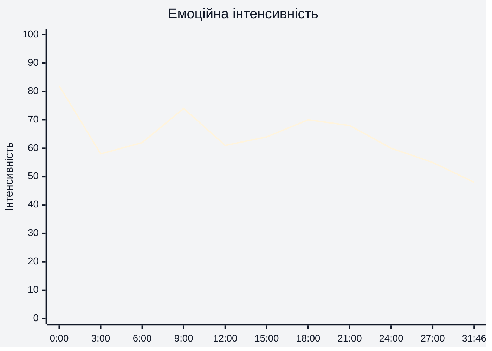
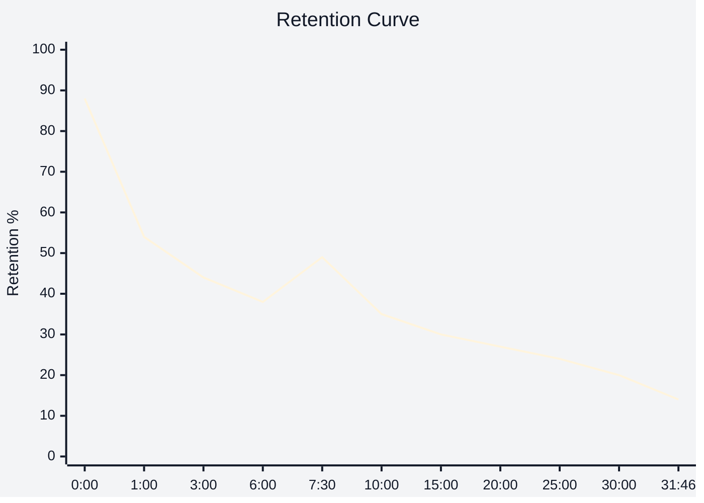

# Аналіз довгоформатного YouTube-відео

## 1. Сюжетна дуга (Narrative Arc)

```mermaid
%%{init: {'theme':'base', 'themeVariables': {
'primaryColor':'#f3f4f6',
'primaryTextColor':'#111827',
'primaryBorderColor':'#2563eb',
'lineColor':'#2563eb',
'secondaryColor':'#ffffff',
'tertiaryColor':'#f3f4f6',
'background':'#f3f4f6'
}}}%%
flowchart LR

A["00:00–00:45<br>Хук<br>Постановка історичної провокації:<br>як Московія привласнила назву 'Русь/Росія'"] -->
B["00:45–03:30<br>Експозиція<br>Карта, історичний контекст,<br>введення в тему імперської ребрендизації"] -->
C["03:30–07:00<br>Перша ескалація<br>Пояснення політичних причин зміни ідентичності"] -->
D["07:00–09:00<br>Переломний момент<br>Пік уваги на історичному доказі / карті / цитаті"] -->
E["09:00–16:00<br>Наростання напруги<br>Порівняння термінів 'Московія', 'Русь', 'Росія'"] -->
F["16:00–23:00<br>Кульмінація<br>Аргументація щодо геополітичного впливу ребрендингу"] -->
G["23:00–29:00<br>Розв’язка<br>Підсумок історичних наслідків та сучасних паралелей"] -->
H["29:00–31:46<br>Фінальний висновок<br>Ідеологічний меседж та заклик до переосмислення історії"]
```

---

## 2. Ключові Story Beats

```mermaid
%%{init: {'theme':'base', 'themeVariables': {
'primaryColor':'#f3f4f6',
'primaryTextColor':'#111827',
'primaryBorderColor':'#2563eb',
'lineColor':'#2563eb',
'secondaryColor':'#ffffff',
'tertiaryColor':'#f3f4f6',
'background':'#f3f4f6'
}}}%%
flowchart LR

A["00:00<br>Провокаційний вступ<br>Функція: миттєвий хук"] -->
B["01:10<br>Поява історичної карти<br>Функція: авторитетність"] -->
C["02:40<br>Визначення Московії<br>Функція: базова рамка"] -->
D["04:20<br>Пояснення назви 'Росія'<br>Функція: ескалація"] -->
E["06:50<br>Перший сильний аргумент<br>Функція: утримання уваги"] -->
F["07:40<br>Retention spike<br>Функція: емоційний пік"] -->
G["11:20<br>Порівняння джерел<br>Функція: інтелектуальна напруга"] -->
H["15:30<br>Історичний конфлікт термінів<br>Функція: нарощення ставки"] -->
I["20:10<br>Геополітичні наслідки<br>Функція: кульмінація"] -->
J["25:40<br>Сучасні паралелі<br>Функція: актуалізація"] -->
K["29:30<br>Підсумок тези<br>Функція: закриття історії"] -->
L["31:00<br>Фінальний меседж<br>Функція: післясмак"]
```

---

## 3. Емоційний темп

---

## 4. Утримання аудиторії

> Використано реальні retention-дані зі скріншотів YouTube Studio.

Середня тривалість перегляду: **8:11**  
Середній відсоток перегляду: **25,8%**

---

## 5. Провали retention

| Таймкод | Проблема | Ймовірна причина спаду | Що покращити |
|---|---|---|---|
| 00:30–02:00 | Різкий спад після хука | Занадто повільний перехід до суті | Додати швидший payoff після інтро |
| 03:30–05:00 | Інформаційне перевантаження | Багато історичних термінів підряд | Розбити інформацію візуальними блоками |
| 09:00–12:00 | Плавне просідання | Довгі пояснення без зміни ритму | Додати B-roll та zoom cuts |
| 15:00–18:00 | Втрата темпу | Низька емоційна динаміка | Вставити конфліктні цитати або порівняння |
| 24:00–28:00 | Втома аудиторії | Висока тривалість без нового narrative hook | Вставити mini-climax ближче до фіналу |
| 30:00+ | Стандартний end-drop | Глядачі отримали головну тезу | Додати сильний фінальний reveal або CTA |

---
