# Статистичний аналіз відеозвітів

## 1. Короткий executive summary

| Пункт | Висновок |
|---|---|
| Скільки відео проаналізовано | 1 |
| Скільки форматів відео | 1: `LONG_20_PLUS_MIN` |
| Найсильніше відео за overall score | Video 1 — `4.17/5` |
| Найсильніше відео за ER Public % | Video 1 — `15.49%` |
| Найсильніше відео за views per day | Video 1 — `190.26` |
| Найсильніша повторювана механіка | `INSUFFICIENT_DATA`: є лише 1 відео, тому повторюваність між відео не перевіряється. У межах цього відео найсильніша механіка — `CONTROVERSY_OR_DEBATE`. |
| Найчастіша слабкість | `INSUFFICIENT_DATA`: є лише 1 відео, тому частотність між відео не перевіряється. У межах цього відео головна слабкість — `COMMENTS_SHOW_TOPIC_GAP`. |
| Головна стратегічна можливість | Масштабувати формат “міф → 5–7 критеріїв перевірки → verdict”, але додати source hub, corrections і швидший перший proof. |
| Рівень впевненості | `LOW_CONFIDENCE` для статистичних узагальнень, бо вибірка = 1 відео. `HIGH` для описових метрик цього одного відео. |

## 2. Якість і повнота даних

| Поле | Кількість відео з даними | Кількість N/A | Коментар |
|---|---:|---:|---|
| views | 1 | 0 | Є raw public metric: `110352`. |
| likes | 1 | 0 | Є raw public metric: `12987`. |
| comments_count | 1 | 0 | Є raw public metric: `4110`. |
| views_per_day | 1 | 0 | Є derived metric: `190.26`. |
| er_public_percent | 1 | 0 | Є derived metric: `15.49%`. |
| views_per_1k_subs | 1 | 0 | Є derived metric: `5777.59`. |
| hook_score | 1 | 0 | Є score: `4/5`. |
| cta_score | 1 | 0 | Є score: `4/5`. |
| ad_integration_score | 0 | 1 | `NOT_APPLICABLE`, бо commercial ad не виявлено. |
| audio_score | 1 | 0 | Є score: `4/5`. |
| comment_resonance_score | 1 | 0 | Є score: `5/5`. |
| overall_video_score | 1 | 0 | Є score: `4.17/5`. |

### Обмеження аналізу

- Вибірка містить лише 1 відео, тому кореляції, кластери й статистичні порівняння між відео не будуються.
- Усі висновки про патерни позначаються як `LOW_CONFIDENCE`, якщо вони виходять за межі одного відео.
- Рекламні графіки пропущені: commercial advertising / sponsor integration не виявлено.
- Частина owner-side даних є `PARTIAL_DATA`: немає impressions, overall CTR, full retention curve, revenue, full traffic sources.
- Всі графіки нижче є описовими для одного відео, а не порівняльною статистикою когорти.

## 3. Підготовлена таблиця для графіків

| Video | Format | Views | Likes | Comments | Subscribers | Views/day | Like Rate % | Comment Rate % | ER Public % | Views/1k subs | Likes/1k views | Comments/1k views | Hook | CTA | Ad | Audio | Comment Resonance | Overall |
|---|---|---:|---:|---:|---:|---:|---:|---:|---:|---:|---:|---:|---:|---:|---:|---:|---:|---:|
| Video 1 | LONG_20_PLUS_MIN | 110352 | 12987 | 4110 | 19100 | 190.26 | 11.77 | 3.72 | 15.49 | 5777.59 | 117.69 | 37.24 | 4 | 4 | N/A | 4 | 5 | 4.17 |

| Label | Full title | URL |
|---|---|---|
| Video 1 | What connects Ukrainian & 'Russian' people? | https://www.youtube.com/watch?v=28PTMcN5UtM |

## 4. Рекомендовані графіки

| # | Назва графіка | Тип графіка | Поля | Для чого потрібен | Пріоритет |
|---:|---|---|---|---|---|
| 1 | Overall score by video | Mermaid bar chart | `overall_video_score` | Побачити загальну силу відео | HIGH |
| 2 | Views per day by video | Mermaid bar chart | `views_per_day` | Оцінити швидкість набору переглядів з урахуванням віку | HIGH |
| 3 | ER Public % by video | Mermaid bar chart | `er_public_percent` | Оцінити публічне залучення | HIGH |
| 4 | ER Public % vs Views/day | Таблиця / quadrant опис | `er_public_percent`, `views_per_day` | Побачити баланс охоплення і реакції | HIGH |
| 5 | Hook score by video | Mermaid bar chart | `hook_score` | Оцінити силу hook | HIGH |
| 6 | CTA score by video | Mermaid bar chart | `cta_score` | Оцінити CTA-систему | HIGH |
| 7 | Score breakdown heatmap | Matrix table | scores 1–5 | Побачити сильні й слабкі сторони | HIGH |
| 8 | Sentiment distribution | Mermaid pie chart + table | comment sentiment counts | Побачити структуру реакції аудиторії | HIGH |
| 9 | CTA features heatmap | Matrix table | CTA booleans | Побачити, які CTA використано | HIGH |
| 10 | Ad load % by video | Skipped | `ad_load_percent` | Оцінити рекламне навантаження | LOW |

## 5. Графіки продуктивності

## 5.1. Views by video

- Назва графіка: Views by video
- Яке питання він відповідає: яке відео має найбільший raw reach?
- Які поля використовуються: `video_label`, `views`
- Тип графіка: Mermaid bar chart
- Що видно з графіка: є лише одне відео з `110352` переглядами.
- Практичний висновок: raw reach не можна порівняти з іншими відео, але для цього відео охоплення суттєве; головні висновки краще робити через normalized metrics.

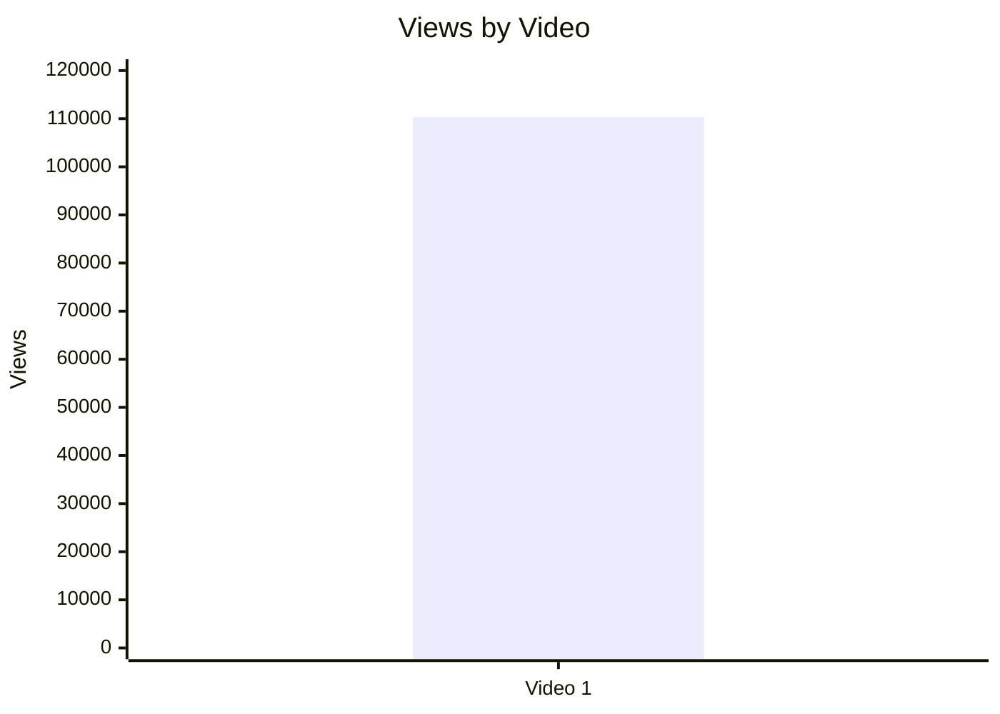

| Video | Views | Коментар |
|---|---:|---|
| Video 1 | 110352 | `NOT_COMPARABLE`: немає інших відео в когорті. |

## 5.2. Views per day by video

- Назва графіка: Views per day by video
- Яке питання він відповідає: яка швидкість набору переглядів з урахуванням віку відео?
- Які поля використовуються: `video_label`, `views_per_day`
- Тип графіка: Mermaid bar chart
- Що видно з графіка: Video 1 має `190.26` переглядів/день за період від публікації до snapshot date.
- Практичний висновок: це long-tail середнє, а не стартова velocity; для порівняння потрібні інші відео того самого формату.

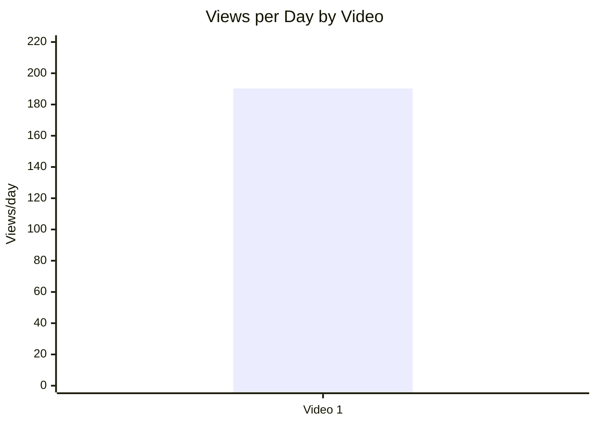

## 5.3. Views per 1k subscribers

- Назва графіка: Views per 1k subscribers
- Яке питання він відповідає: наскільки відео перетворило розмір каналу в перегляди?
- Які поля використовуються: `video_label`, `views_per_1k_subs`
- Тип графіка: Mermaid bar chart
- Що видно з графіка: Video 1 має `5777.59` переглядів на 1k підписників/фоловерів.
- Практичний висновок: відео вийшло далеко за межі базової аудиторії, але порівняльну силу можна підтвердити лише на наборі відео.

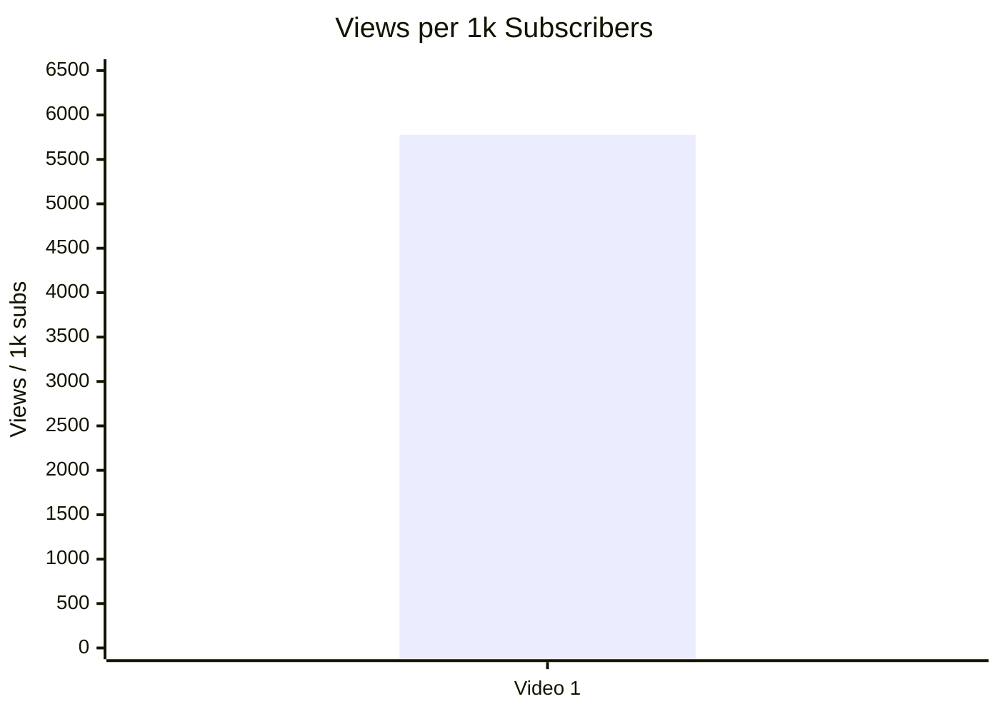

## 5.4. Performance quadrant

- Назва графіка: Performance quadrant
- Яке питання він відповідає: чи відео має баланс охоплення і залучення?
- Які поля використовуються: `views_per_day`, `er_public_percent`
- Тип графіка: scatter/quadrant; для 1 відео повноцінний quadrant не будується.
- Що видно з графіка: є одна точка: `views_per_day = 190.26`, `ER Public = 15.49%`.
- Практичний висновок: `INSUFFICIENT_DATA` для визначення high/low відносно медіани когорти. Потрібно мінімум кілька відео того самого формату.

| Video | Views/day | ER Public % | Quadrant |
|---|---:|---:|---|
| Video 1 | 190.26 | 15.49 | `INSUFFICIENT_DATA`: немає cohort median для high/low меж. |

## 6. Графіки залучення

## 6.1. ER Public % by video

- Назва графіка: ER Public % by video
- Яке питання він відповідає: яке відео має найвище публічне залучення?
- Які поля використовуються: `video_label`, `er_public_percent`
- Тип графіка: Mermaid bar chart
- Що видно з графіка: Video 1 має `15.49%` ER Public.
- Практичний висновок: залучення сильне в межах самого відео, але без cohort benchmark не можна називати його статистично кращим.

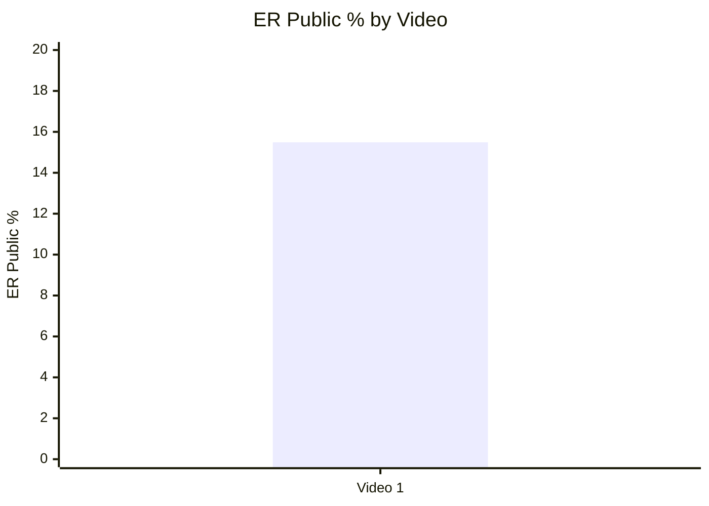

## 6.2. Like Rate % vs Comment Rate %

- Назва графіка: Like Rate % vs Comment Rate %
- Яке питання він відповідає: залучення більше через лайки чи через коментарі?
- Які поля використовуються: `like_rate_percent`, `comment_rate_percent`
- Тип графіка: scatter plot; для 1 відео дається таблиця точки.
- Що видно з графіка: `Like Rate = 11.77%`, `Comment Rate = 3.72%`.
- Практичний висновок: відео одночасно отримало високий лайк-сигнал і сильний debate/comment-сигнал, але порівняльної класифікації без інших відео немає.

| Video | Like Rate % | Comment Rate % | Інтерпретація |
|---|---:|---:|---|
| Video 1 | 11.77 | 3.72 | Сильне public engagement у межах одного відео; `NOT_COMPARABLE` між відео. |

## 6.3. Comments per 1k views

- Назва графіка: Comments per 1k views
- Яке питання він відповідає: наскільки відео провокує реакцію у коментарях?
- Які поля використовуються: `video_label`, `comments_per_1k_views`
- Тип графіка: Mermaid bar chart
- Що видно з графіка: Video 1 має `37.24` коментаря на 1k переглядів.
- Практичний висновок: тема є comment-generating, але для статистичного ранжування потрібні інші відео.

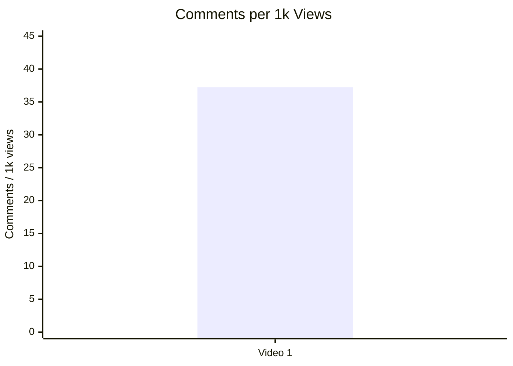

## 7. Графіки структури та hook

## 7.1. Hook score by video

- Назва графіка: Hook score by video
- Яке питання він відповідає: наскільки сильний hook у відео?
- Які поля використовуються: `video_label`, `hook_score`
- Тип графіка: Mermaid bar chart
- Що видно з графіка: Video 1 має hook score `4/5`.
- Практичний висновок: hook сильний, бо відкриває конфліктне питання, але перший формальний value block починається лише на `01:50`.

## 7.2. Hook type distribution

- Назва графіка: Hook type distribution
- Яке питання він відповідає: які hook types використовуються?
- Які поля використовуються: `hook_primary_type`
- Тип графіка: Mermaid pie chart
- Що видно з графіка: у вибірці 1 відео primary hook type = `CONFLICT`.
- Практичний висновок: не можна робити висновок, що `CONFLICT` працює краще за інші типи, бо немає порівняння.

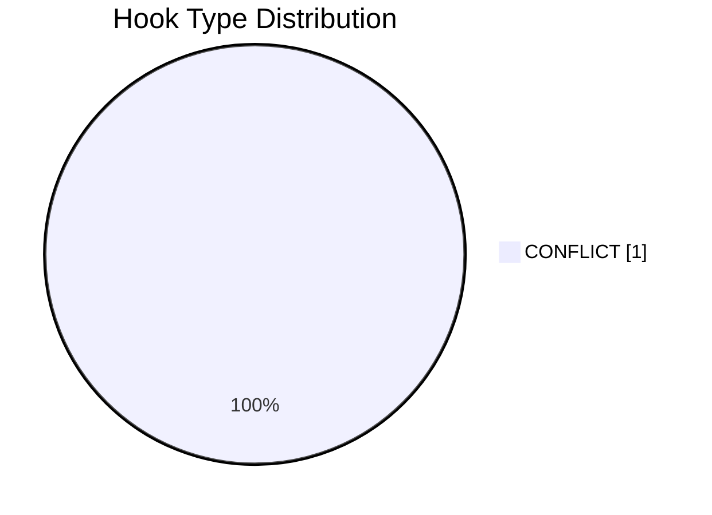

## 7.3. Time to first value vs Overall Score

- Назва графіка: Time to first value vs Overall Score
- Яке питання він відповідає: чи швидша перша цінність пов’язана з вищим результатом?
- Які поля використовуються: `time_to_first_value_seconds`, `overall_video_score`
- Тип графіка: scatter plot; для 1 відео — таблиця точки.
- Що видно з графіка: Video 1 має `time_to_first_value_seconds = 110`, `overall = 4.17`.
- Практичний висновок: зв’язок не оцінюється; як тест варто скоротити перший proof до `00:45` у наступних відео.

| Video | Time to first value seconds | Overall score | Коментар |
|---|---:|---:|---|
| Video 1 | 110 | 4.17 | `INSUFFICIENT_DATA` для зв’язку; можна використати як baseline для тесту. |

## 8. Графіки CTA

## 8.1. CTA score by video

- Назва графіка: CTA score by video
- Яке питання він відповідає: наскільки якісно вбудовані CTA?
- Які поля використовуються: `video_label`, `cta_score`
- Тип графіка: Mermaid bar chart
- Що видно з графіка: Video 1 має `CTA score = 4/5`.
- Практичний висновок: CTA сильний у фіналі, але немає прямого comment prompt / like / bell CTA.

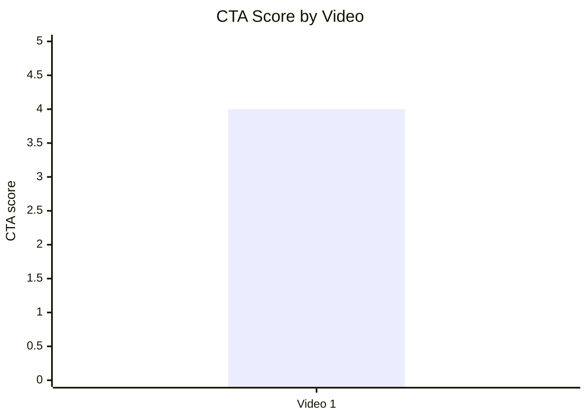

## 8.2. CTA count vs ER Public %

- Назва графіка: CTA count vs ER Public %
- Яке питання він відповідає: чи більше CTA пов’язано з кращим залученням?
- Які поля використовуються: `cta_count`, `er_public_percent`
- Тип графіка: scatter plot; для 1 відео — таблиця точки.
- Що видно з графіка: Video 1 має `cta_count = 5`, `ER Public = 15.49%`.
- Практичний висновок: зв’язок не оцінюється; ризик CTA overload у звіті не зафіксований, бо strongest CTA стоїть після payoff.

| Video | CTA count | ER Public % | CTA overload risk |
|---|---:|---:|---|
| Video 1 | 5 | 15.49 | Низький / не доведений; `LOW_CONFIDENCE`. |

## 8.3. CTA features heatmap

- Назва графіка: CTA features heatmap
- Яке питання він відповідає: які CTA-фічі є або відсутні?
- Які поля використовуються: `has_comment_prompt`, `has_subscribe_cta`, `has_like_cta`, `has_bell_cta`, `has_next_video_bridge`
- Тип графіка: heatmap / matrix table
- Що видно з графіка: є next-video bridge, але немає comment prompt, subscribe, like і bell CTA.
- Практичний висновок: наступний тест — додати конкретний comment prompt і pinned source/comment strategy.

| Video | Comment prompt | Subscribe | Like | Bell | Next video bridge |
|---|---|---|---|---|---|
| Video 1 | ❌ | ❌ | ❌ | ❌ | ✅ |

## 9. Графіки реклами / інтеграцій

Advertising graphs skipped: no advertising integrations detected.

## 9.1. Ad load % by video

- Назва графіка: Ad load % by video
- Статус: skipped
- Причина: `commercial_ad_detected = false`, `ad_load_percent = 0.0`, `ad_integration_score = NOT_APPLICABLE`.
- Практичний висновок: рекламне навантаження не пояснює залучення або retention у цьому відео.

| Video | Ad detected | Ad count | Ad load % | Ad integration score |
|---|---|---:|---:|---|
| Video 1 | false | 0 | 0.0 | NOT_APPLICABLE |

## 9.2. First ad position %

- Назва графіка: First ad position %
- Статус: skipped
- Причина: first ad не застосовується.

| Video | First ad time | First ad relative position % |
|---|---|---|
| Video 1 | NOT_APPLICABLE | NOT_APPLICABLE |

## 9.3. Ad integration score vs ER Public %

- Назва графіка: Ad integration score vs ER Public %
- Статус: skipped
- Причина: немає рекламної інтеграції.

## 10. Графіки аудіо

## 10.1. Audio score by video

- Назва графіка: Audio score by video
- Яке питання він відповідає: наскільки сильна аудіо-складова?
- Які поля використовуються: `video_label`, `audio_score`
- Тип графіка: Mermaid bar chart
- Що видно з графіка: Video 1 має `audio_score = 4/5`.
- Практичний висновок: аудіо не є головним friction; основний ризик у доказовості та framing.

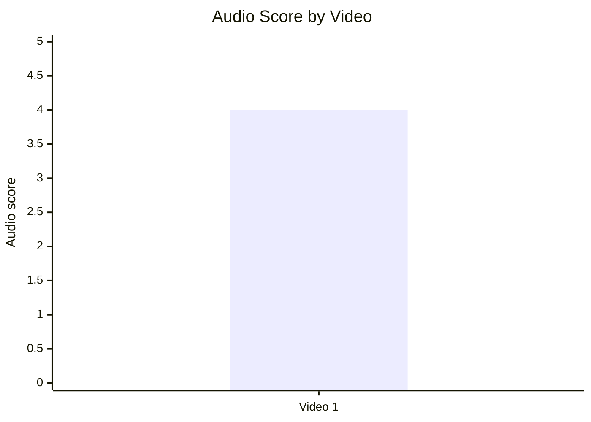

## 10.2. Audio score vs Overall Score

- Назва графіка: Audio score vs Overall Score
- Яке питання він відповідає: чи краща якість аудіо пов’язана з вищим загальним балом?
- Які поля використовуються: `audio_score`, `overall_video_score`
- Тип графіка: scatter plot; для 1 відео — таблиця точки.
- Що видно з графіка: `audio_score = 4`, `overall_video_score = 4.17`.
- Практичний висновок: зв’язок не оцінюється; аудіо можна тримати як baseline `4/5`.

| Video | Audio score | Overall score | Коментар |
|---|---:|---:|---|
| Video 1 | 4 | 4.17 | `INSUFFICIENT_DATA` для зв’язку. |

## 11. Графіки коментарів

## 11.1. Sentiment distribution

- Назва графіка: Sentiment distribution
- Яке питання він відповідає: яка структура реакції аудиторії?
- Які поля використовуються: `positive`, `negative`, `mixed`, `neutral`, `question`, `request`, `joke_meme`
- Тип графіка: Mermaid pie chart + table
- Що видно з графіка: найбільша частка класифікована як `NEUTRAL`, але `QUESTION` і debate clusters дуже сильні.
- Практичний висновок: дискусія потребує кращого source hub і pinned framing.

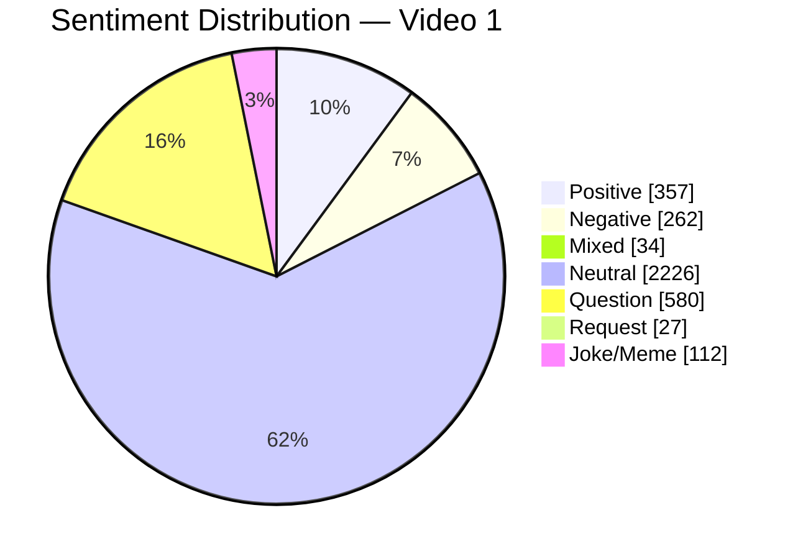

| Sentiment | Count | Percent of relevant comments |
|---|---:|---:|
| POSITIVE | 357 | 9.92 |
| NEGATIVE | 262 | 7.28 |
| MIXED | 34 | 0.95 |
| NEUTRAL | 2226 | 61.87 |
| QUESTION | 580 | 16.12 |
| REQUEST | 27 | 0.75 |
| JOKE_MEME | 112 | 3.11 |

## 11.2. Comment resonance score by video

- Назва графіка: Comment resonance score by video
- Яке питання він відповідає: наскільки сильно відео резонує в коментарях?
- Які поля використовуються: `comment_resonance_score`
- Тип графіка: Mermaid bar chart
- Що видно з графіка: Video 1 має максимальний `comment_resonance_score = 5/5`.
- Практичний висновок: comment engine — одна з ключових сил відео.

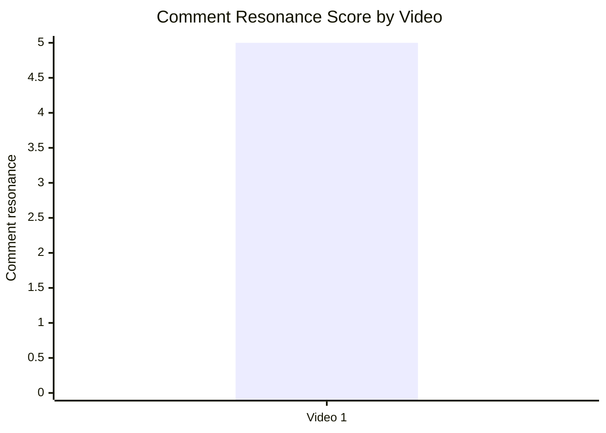

## 11.3. Top comment clusters

- Назва графіка: Top comment clusters
- Яке питання він відповідає: що найчастіше обговорюють / критикують / підтримують?
- Які поля використовуються: cluster name, count, percent_relevant
- Тип графіка: horizontal bar chart; у Markdown подано таблицю.
- Що видно з графіка: найбільший кластер — war / national identity debate.
- Практичний висновок: найсильніший двигун коментарів — ідентичність + війна + міф “one people”.

| Cluster | Count | % of relevant comments | Практичний висновок |
|---|---:|---:|---|
| War / national identity debate | 1759 | 48.89 | Головний comment engine; варто масштабувати як myth-busting формат. |
| Language / Slavic identity debate | 609 | 16.93 | Є потенціал окремого відео про мову / Slavic identity. |
| Praise / gratitude for explanation | 303 | 8.42 | Англомовне пояснення української позиції має попит. |
| Ethnicity / genetics / Finno-Ugric debate | 279 | 7.75 | Ризикова зона; потрібні точніші формулювання й sources. |
| Accuracy / propaganda criticism | 196 | 5.45 | Потрібен pinned corrections/source hub. |

## 12. Графіки score-системи

## 12.1. Overall score by video

- Назва графіка: Overall score by video
- Яке питання він відповідає: яке відео найсильніше загалом?
- Які поля використовуються: `overall_video_score`
- Тип графіка: Mermaid bar chart
- Що видно з графіка: Video 1 має `4.17/5`.
- Практичний висновок: відео є сильним кейсом для внутрішнього baseline, але не для статистичного ранжування.

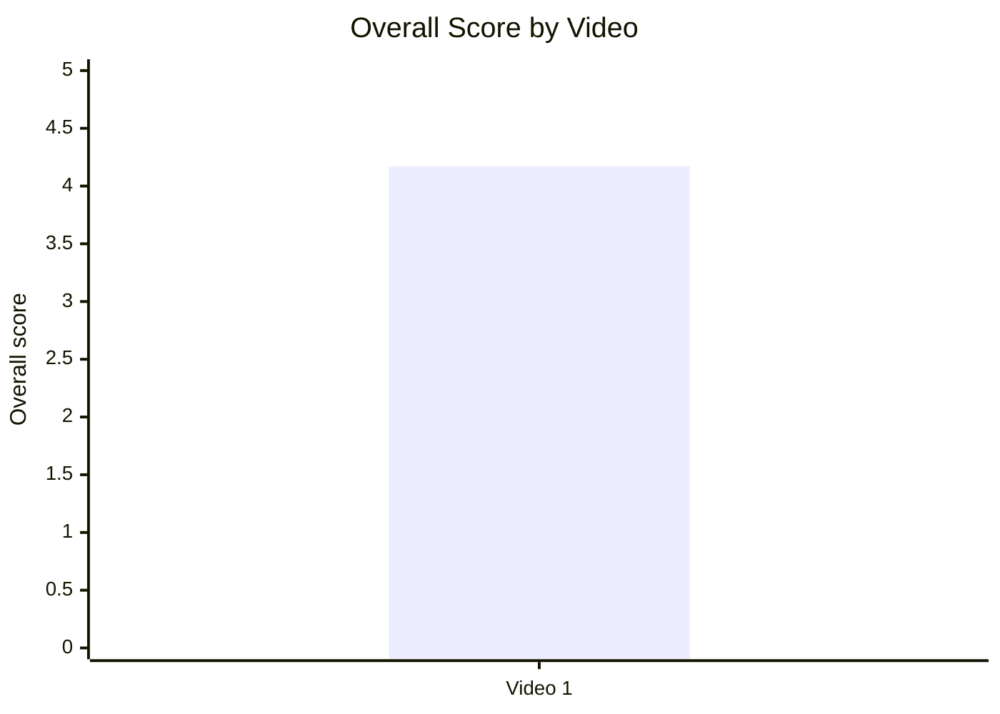

## 12.2. Score breakdown heatmap

- Назва графіка: Score breakdown heatmap
- Яке питання він відповідає: де сильні й слабкі сторони відео?
- Які поля використовуються: `hook_score`, `structure_score`, `value_density_score`, `audio_score`, `cta_score`, `ad_integration_score`, `comment_resonance_score`, `replicability_score`, `overall_video_score`
- Тип графіка: heatmap / matrix table
- Що видно з графіка: найсильніший блок — comments resonance `5/5`; більшість ключових score = `4/5`; ad = `NOT_APPLICABLE`.
- Практичний висновок: головний improvement area не в production, а в proof packaging, source hub і перших 45–60 секундах.

| Video | Hook | Structure | Value Density | Audio | CTA | Ad | Comments | Replicability | Overall |
|---|---:|---:|---:|---:|---:|---|---:|---:|---:|
| Video 1 | 4 | 4 | 4 | 4 | 4 | N/A | 5 | 4 | 4.17 |

## 12.3. Strengths vs weaknesses count

- Назва графіка: Strengths vs weaknesses count
- Яке питання він відповідає: скільки success mechanics і missed opportunities зафіксовано?
- Які поля використовуються: кількість success mechanics, кількість missed opportunities
- Тип графіка: Mermaid bar chart
- Що видно з графіка: у звіті є 5 success mechanics і 5 missed opportunities.
- Практичний висновок: потенціал масштабування високий, але треба закрити credibility / evidence gaps.

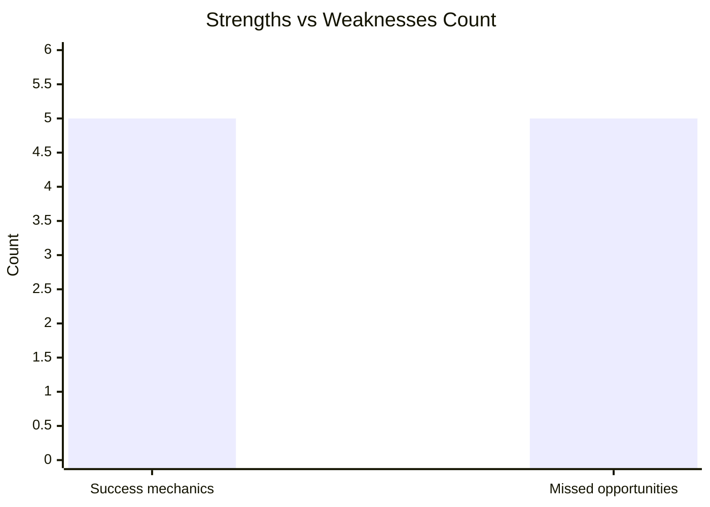

| Video | Success mechanics count | Missed opportunities count | Коментар |
|---|---:|---:|---|
| Video 1 | 5 | 5 | Баланс сильних механік і чітких зон оптимізації. |

## 13. Кореляції та патерни

Correlation analysis skipped: fewer than 5 comparable videos.

| Pair | Correlation / Pattern | Strength | Interpretation | Confidence |
|---|---:|---|---|---|
| hook_score → overall_video_score | NOT_COMPARABLE | N/A | Вибірка = 1 відео. | LOW |
| value_density_score → er_public_percent | NOT_COMPARABLE | N/A | Вибірка = 1 відео. | LOW |
| cta_score → comment_rate_percent | NOT_COMPARABLE | N/A | Вибірка = 1 відео. | LOW |
| comment_resonance_score → er_public_percent | NOT_COMPARABLE | N/A | Вибірка = 1 відео. | LOW |
| views_per_day → er_public_percent | NOT_COMPARABLE | N/A | Вибірка = 1 відео. | LOW |
| ad_load_percent → er_public_percent | NOT_APPLICABLE | N/A | Реклами не виявлено. | LOW |
| time_to_first_value_seconds → overall_video_score | NOT_COMPARABLE | N/A | Вибірка = 1 відео. | LOW |

Попередній описовий патерн для цього одного відео: сильний conflict hook + controversy/debate topic + high comment resonance збігаються з високим ER Public, але це не кореляція.

## 14. Висновки для контент-стратегії

| Спостереження | Дані / графік | Що це означає | Що робити |
|---|---|---|---|
| Conflict hook працює як сильний вхід у тему | Hook score `4/5`, primary hook `CONFLICT` | Тема одразу ставить глядача перед конфліктним питанням. | Повторювати hook як “поширений міф → чітке питання → критерії перевірки”. |
| Comment resonance — головна сила відео | Comment resonance `5/5`, `4110` comments, `37.24` comments/1k views | Відео провокує дискусію і може розноситися через суперечки. | Додати pinned comment із правилами дискусії, sources і питанням для структурованих відповідей. |
| Accuracy criticism достатньо велика, щоб не ігнорувати | Accuracy / propaganda criticism = `196` коментарів, `5.45%` relevant | Частина аудиторії відкидає відео через claims / приклади. | Додати source hub, errata, citations on screen, glossary. |
| First value можна пришвидшити | Time to first value = `110` секунд | Cold viewers можуть не дочекатися першого proof. | У наступних відео дати перший доказ до `00:45`, roadmap — після доказу. |
| CTA сильний, але неповний | CTA score `4/5`, next video bridge ✅, comment prompt ❌ | Фінальний bridge працює, але дискусію не скеровано. | Додати конкретний comment prompt і pinned source comment. |
| Advertising не заважає | Ad load `0.0%`, commercial ad not detected | Немає рекламного friction. | Не додавати sponsor read у перші proof-heavy відео такого типу; якщо додавати — після payoff/value. |
| Аудіо не головний bottleneck | Audio score `4/5` | Production достатній для формату. | Пріоритет оптимізації: доказовість, структура перших 60 секунд, коментарі. |

## 15. Що тестувати далі

| Тест | Гіпотеза | На яких даних базується | Як виміряти | Пріоритет |
|---|---|---|---|---|
| Перший proof до 00:45 | Швидша перша цінність покращить early retention. | `time_to_first_value = 110s`; cold audience `89.2%` non-subs у вихідному аналізі. | Compare retention at 0:30 / 1:00 / 2:00 у YouTube Analytics. | HIGH |
| Pinned source hub | Джерела й corrections зменшать “propaganda/fake” friction. | Accuracy criticism cluster `5.45%`; top missed opportunity `MISSING_PINNED_COMMENT_STRATEGY`. | Частка критики “fake/propaganda/source?” у коментарях; like ratio; qualitative replies. | HIGH |
| Конкретний comment prompt | Скерований prompt підвищить якість коментарів без flame overload. | `has_comment_prompt = false`, але comment resonance `5/5`. | Comments per 1k views + частка constructive comments / questions. | HIGH |
| Обережний disclaimer про identity ≠ genetics | Знизить ризик “biological essentialism” критики. | Ethnicity/genetics cluster `7.75%`. | Частка genetics/ethnicity backlash у comments; sentiment around ethnicity block. | HIGH |
| Documentary-style thumbnail A/B | Менш карикатурний thumbnail може підвищити credibility серед undecided. | Thumbnail criticism cluster існує, але малий. | CTR, like ratio, negative comments mentioning thumbnail. | MEDIUM |
| Серія “Moscovia Myth Buster” | Формат criteria-based myth-busting може масштабуватися. | Top success mechanics: `CONTROVERSY_OR_DEBATE`, `HIGH_VALUE_DENSITY`, `CLEAR_HOOK`. | Views/day, ER Public, end-screen CTR, returning viewers. | HIGH |
| End-screen bridge після payoff | Збільшить session depth. | End-screen CTR `0.9%` vs channel average `0.4%` у вихідному аналізі. | End-screen CTR, next video views, playlist traffic. | MEDIUM |

## 16. Дані для експорту в таблицю / CSV

| video_label | title | format_group | views | likes | comments_count | subscribers | views_per_day | like_rate_percent | comment_rate_percent | er_public_percent | views_per_1k_subs | likes_per_1k_views | comments_per_1k_views | watch_time_hours | subscribers_gained | hook_type | hook_score | cta_count | cta_score | ad_load_percent | ad_integration_score | audio_score | comment_resonance_score | overall_video_score | top_success_mechanic | top_missed_opportunity |
|---|---|---|---:|---:|---:|---:|---:|---:|---:|---:|---:|---:|---:|---:|---:|---|---:|---:|---:|---:|---|---:|---:|---:|---|---|
| Video 1 | What connects Ukrainian & 'Russian' people? | LONG_20_PLUS_MIN | 110352 | 12987 | 4110 | 19100 | 190.26 | 11.77 | 3.72 | 15.49 | 5777.59 | 117.69 | 37.24 | 9500 | 2500 | CONFLICT | 4 | 5 | 4 | 0.0 | NOT_APPLICABLE | 4 | 5 | 4.17 | CONTROVERSY_OR_DEBATE | COMMENTS_SHOW_TOPIC_GAP |
