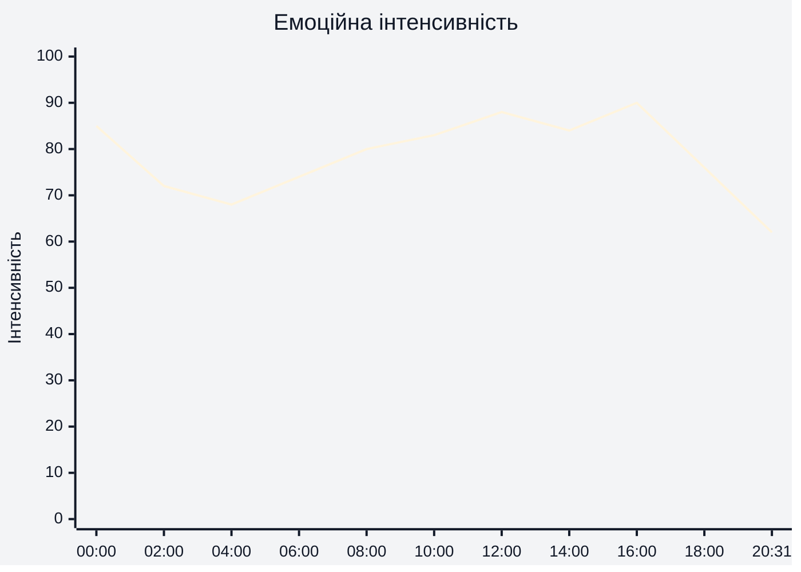
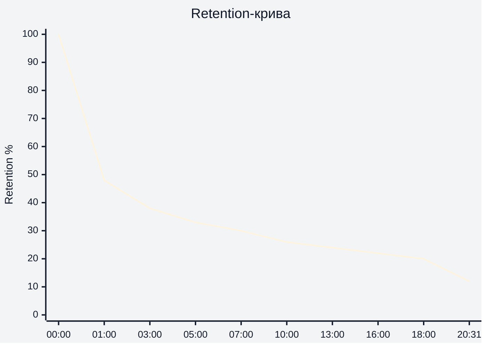

# Аналіз довгоформатного YouTube-відео

## 1. Сюжетна дуга (Narrative Arc)

```mermaid
%%{init: {'theme':'base', 'themeVariables': {
'primaryColor':'#f3f4f6',
'primaryTextColor':'#111827',
'primaryBorderColor':'#2563eb',
'lineColor':'#2563eb',
'secondaryColor':'#ffffff',
'tertiaryColor':'#f3f4f6',
'background':'#f3f4f6'
}}}%%
flowchart LR

A["00:00–00:40<br>Хук<br>Провокаційне питання про зв’язок українців і росіян"] -->
B["00:40–02:30<br>Експозиція<br>Контекст історичного та культурного наративу"] -->
C["02:30–05:10<br>Перша ескалація<br>Розбір популярних міфів і пропагандистських тез"] -->
D["05:10–08:20<br>Переломний момент<br>Перехід до глибшого історичного аналізу"] -->
E["08:20–12:40<br>Наростання напруги<br>Порівняння ідентичностей та мовних маркерів"] -->
F["12:40–16:20<br>Кульмінація<br>Ключовий аргумент про відмінність політичних і культурних моделей"] -->
G["16:20–19:00<br>Розв’язка<br>Підсумок історичних і соціальних факторів"] -->
H["19:00–20:31<br>Фінальний висновок<br>Заклик до переосмислення наративів"]
```

---

## 2. Ключові Story Beats

```mermaid
%%{init: {'theme':'base', 'themeVariables': {
'primaryColor':'#f3f4f6',
'primaryTextColor':'#111827',
'primaryBorderColor':'#2563eb',
'lineColor':'#2563eb',
'secondaryColor':'#ffffff',
'tertiaryColor':'#f3f4f6',
'background':'#f3f4f6'
}}}%%
flowchart LR

A["00:00<br>Сильне питання<br>Хук"] -->
B["00:35<br>Окреслення теми<br>Створення інтриги"] -->
C["01:50<br>Перший історичний аргумент<br>Побудова довіри"] -->
D["03:10<br>Контраст наративів<br>Ескалація"] -->
E["05:40<br>Розбір міфів<br>Конфлікт"] -->
F["08:00<br>Перехід до культурної теми<br>Поглиблення"] -->
G["10:45<br>Найсильніший аналітичний блок<br>Ключовий insight"] -->
H["13:20<br>Порівняння моделей мислення<br>Напруга"] -->
I["15:50<br>Емоційний акцент<br>Пік уваги"] -->
J["18:00<br>Формування висновку<br>Розв’язка"] -->
K["19:40<br>Фінальна теза<br>Закріплення думки"]
```

---

## 3. Емоційний темп

---

## 4. Утримання аудиторії

(На основі наданих retention-скріншотів YouTube Studio)

Середня тривалість перегляду: **5:11**  
Середній відсоток перегляду: **25.3%**

---

## 5. Провали retention

| Таймкод | Проблема | Ймовірна причина спаду | Що покращити |
|---|---|---|---|
| 00:30–01:20 | Різкий спад після хука | Занадто швидкий перехід у пояснення | Додати сильніший open loop |
| 03:30–04:40 | Падіння уваги | Менше візуальної динаміки | Використати архівні вставки та графіку |
| 07:00–09:00 | Плавне просідання | Довгі речення без монтажних змін | Частіше змінювати кадри |
| 12:00–13:30 | Зниження темпу | Інформаційне перевантаження | Розбити аргументи на коротші блоки |
| 18:20–20:00 | Втрата перед фіналом | Відчуття завершення ще до кінця | Додати фінальний narrative payoff |

---