# Статистичний аналіз відеозвітів

## 1. Короткий executive summary

| Пункт | Висновок |
|---|---|
| Скільки відео проаналізовано | 1 |
| Скільки форматів відео | 1 |
| Найсильніше відео за overall score | Video 1 |
| Найсильніше відео за ER Public % | Video 1 |
| Найсильніше відео за views per day | Video 1 |
| Найсильніша повторювана механіка | `INSUFFICIENT_DATA`: є тільки 1 відео, повторюваність неможливо перевірити |
| Найчастіша слабкість | `INSUFFICIENT_DATA`: є тільки 1 відео, частотність неможливо перевірити |
| Головна стратегічна можливість | Тестувати response-video формат на резонансні відео великих авторів із чітким conflict hook |
| Рівень впевненості | LOW |

> Вибірка містить лише 1 відео, тому всі висновки є описовими, без статистичних кореляцій.

---

## 2. Якість і повнота даних

| Поле | Кількість відео з даними | Кількість N/A | Коментар |
|---|---:|---:|---|
| views | 1 | 0 | Є raw metric |
| likes | 1 | 0 | Є raw metric |
| comments_count | 1 | 0 | Є raw metric |
| views_per_day | 1 | 0 | Розраховано у звіті |
| er_public_percent | 1 | 0 | Розраховано у звіті |
| views_per_1k_subs | 1 | 0 | Розраховано у звіті |
| hook_score | 1 | 0 | Є оцінка 1–5 |
| cta_score | 1 | 0 | Є оцінка 1–5 |
| ad_integration_score | 0 | 1 | Окремого ad score немає; є self-promo, без sponsor integration |
| audio_score | 1 | 0 | Виведено з Audio Analysis як середня якісна оцінка |
| comment_resonance_score | 0 | 1 | Окремого числового score немає |
| overall_video_score | 1 | 0 | Є overall score |

### Обмеження аналізу

- Вибірка містить 1 відео, тому кореляції не будуються.
- Порівняння між відео неможливе: `INSUFFICIENT_DATA`.
- Усі стратегічні висновки мають рівень впевненості `LOW_CONFIDENCE`.
- Частина score-полів відсутня у фінальному звіті як окремі числові змінні, тому позначена `N/A`.
- Дані не змішуються між форматами: є тільки `LONG_20_PLUS_MIN`.

---

## 3. Підготовлена таблиця для графіків

| Video | Format | Views | Likes | Comments | Subscribers | Views/day | Like Rate % | Comment Rate % | ER Public % | Views/1k subs | Likes/1k views | Comments/1k views | Hook | CTA | Ad | Audio | Comment Resonance | Overall |
|---|---|---:|---:|---:|---:|---:|---:|---:|---:|---:|---:|---:|---:|---:|---:|---:|---:|---:|
| Video 1 | LONG_20_PLUS_MIN | 180201 | 14226 | 4108 | 19100 | 354.03 | 7.89 | 2.28 | 10.17 | 9435 | 78.9 | 22.8 | 5 | 4 | N/A | 4.2 | N/A | 4.4 |

### Legend

| Label | Full title | URL |
|---|---|---|
| Video 1 | Why Johnny Harris’s video about 'Nato Expansion' got backlash | https://www.youtube.com/watch?v=egu_w9F2NOY |

---

## 4. Рекомендовані графіки

| # | Назва графіка | Тип графіка | Поля | Для чого потрібен | Пріоритет |
|---:|---|---|---|---|---|
| 1 | Overall score by video | Mermaid bar chart | overall_video_score | Побачити загальний score | HIGH |
| 2 | Views per day by video | Mermaid bar chart | views_per_day | Оцінити швидкість набору переглядів | HIGH |
| 3 | ER Public % by video | Mermaid bar chart | er_public_percent | Оцінити залучення | HIGH |
| 4 | Performance quadrant | Таблиця замість scatter | views_per_day, er_public_percent | Scatter неможливий через 1 точку | HIGH |
| 5 | Hook score by video | Mermaid bar chart | hook_score | Оцінити силу hook | HIGH |
| 6 | CTA score by video | Mermaid bar chart | cta_score | Оцінити CTA | HIGH |
| 7 | Score breakdown heatmap | Markdown heatmap | scores | Побачити сильні/слабкі сторони | HIGH |
| 8 | CTA features heatmap | Markdown heatmap | CTA features | Побачити, які CTA використано | HIGH |
| 9 | Comment clusters | Таблиця | comment clusters | Визначити теми реакцій | MEDIUM |
| 10 | Ad load by video | Skipped | ad_load_percent | Немає повних ad-load даних | LOW |

---

## 5. Графіки продуктивності

### 5.1. Views by video

- Назва графіка: Views by video
- Яке питання він відповідає: яке відео має найбільший raw reach?
- Які поля використовуються: `video_label`, `views`
- Тип графіка: Mermaid bar chart
- Що видно з графіка: є тільки одне відео, тому порівняння неможливе.
- Практичний висновок: raw views можна використовувати як baseline для наступних відео, але не як порівняльний benchmark.

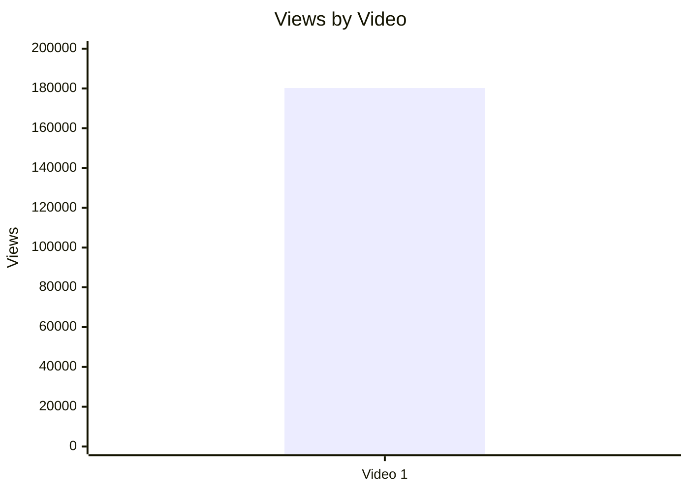

### 5.2. Views per day by video

- Назва графіка: Views per day by video
- Яке питання він відповідає: яка швидкість набору переглядів із урахуванням віку відео?
- Які поля використовуються: `video_label`, `views_per_day`
- Тип графіка: Mermaid bar chart
- Що видно з графіка: Video 1 має 352.0 views/day.
- Практичний висновок: це baseline для майбутніх long-form відео формату `LONG_20_PLUS_MIN`.

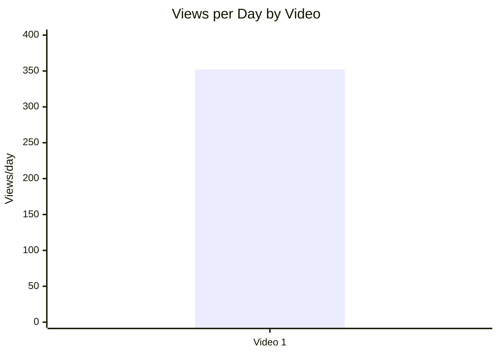

### 5.3. Views per 1k subscribers

- Назва графіка: Views per 1k subscribers
- Яке питання він відповідає: наскільки відео перевищує розмір каналу?
- Які поля використовуються: `video_label`, `views_per_1k_subs`
- Тип графіка: Mermaid bar chart
- Що видно з графіка: Video 1 має 9435 views per 1k subs.
- Практичний висновок: відео масштабувалось далеко за межі підписної бази.

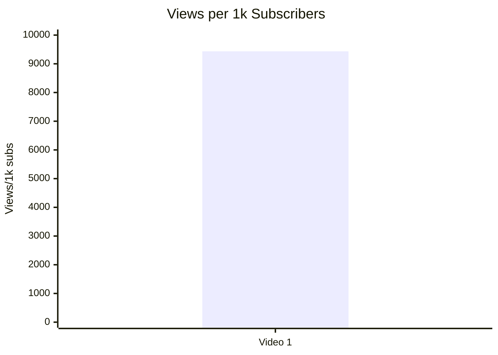

### 5.4. Performance quadrant

Scatter plot неможливо інтерпретувати статистично, бо є тільки 1 точка: `INSUFFICIENT_DATA`.

| Video | Views/day | ER Public % | Quadrant |
|---|---:|---:|---|
| Video 1 | 352.0 | 10.17 | `SINGLE_POINT_BASELINE` |

Практичний висновок: у майбутніх звітах це відео можна використовувати як baseline для quadrant chart, але не як доказ кореляції між охопленням і залученням.

---

## 6. Графіки залучення

### 6.1. ER Public % by video

- Назва графіка: ER Public % by video
- Яке питання він відповідає: яке відео має найсильніше публічне залучення?
- Які поля використовуються: `video_label`, `er_public_percent`
- Тип графіка: Mermaid bar chart
- Що видно з графіка: Video 1 має ER Public 10.17%.
- Практичний висновок: 10.17% можна використовувати як стартовий benchmark для політичних response-video.

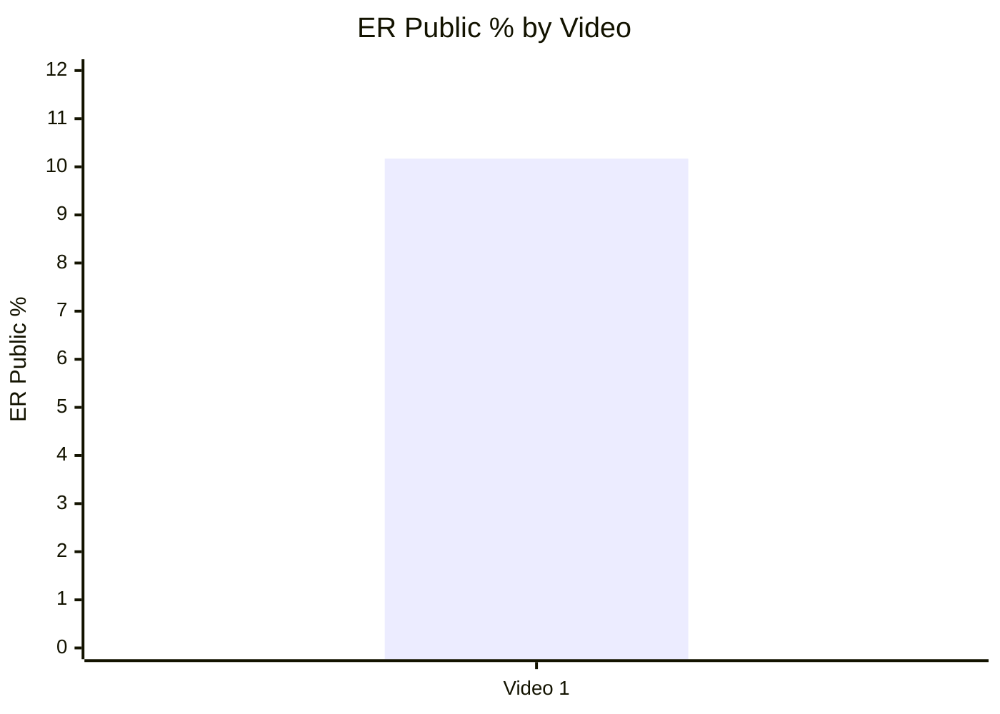

### 6.2. Like Rate % vs Comment Rate %

Scatter plot неможливо інтерпретувати через 1 відео: `INSUFFICIENT_DATA`.

| Video | Like Rate % | Comment Rate % | Interpretation |
|---|---:|---:|---|
| Video 1 | 7.89 | 2.28 | High like + high comment для одного відео; статистично не порівнюється |

### 6.3. Comments per 1k views

- Назва графіка: Comments per 1k views
- Яке питання він відповідає: наскільки відео провокує реакцію?
- Які поля використовуються: `video_label`, `comments_per_1k_views`
- Тип графіка: Mermaid bar chart
- Що видно з графіка: Video 1 має 22.8 comments per 1k views.
- Практичний висновок: відео має сильний debate-driven engagement.

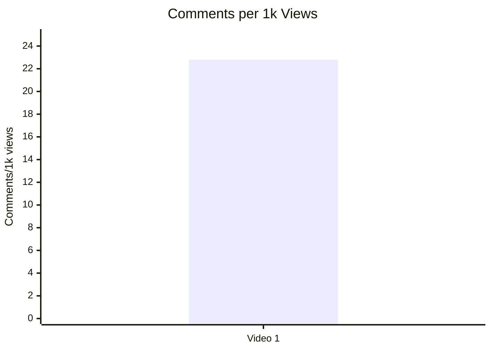

---

## 7. Графіки структури та hook

### 7.1. Hook score by video

- Назва графіка: Hook score by video
- Яке питання він відповідає: наскільки сильний старт відео?
- Які поля використовуються: `video_label`, `hook_score`
- Тип графіка: Mermaid bar chart
- Що видно з графіка: Hook score = 5/5.
- Практичний висновок: conflict hook є ключовим елементом для повторного тесту.

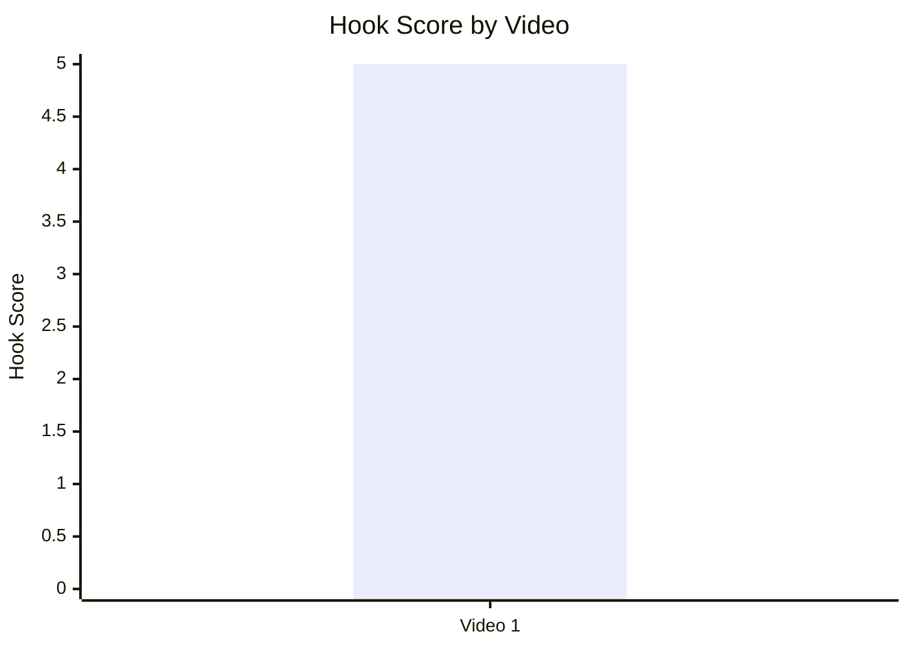

### 7.2. Hook type distribution

- Назва графіка: Hook type distribution
- Яке питання він відповідає: який тип hook використано?
- Які поля використовуються: `hook_primary_type`
- Тип графіка: Mermaid pie chart
- Що видно з графіка: є тільки один тип — `CONFLICT`.
- Практичний висновок: для майбутніх відео варто тестувати `CONFLICT` проти `CURIOSITY_GAP` або `PROBLEM`.

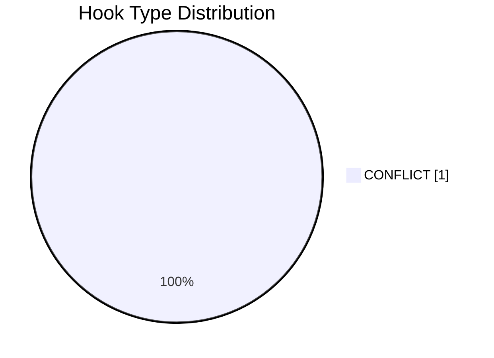

### 7.3. Time to first value vs Overall Score

Scatter plot не будується: `INSUFFICIENT_DATA`.

| Video | Time to first value | Overall Score | Comment |
|---|---|---:|---|
| Video 1 | ~00:20 | 4.4 | Є тільки одна точка, зв’язок не оцінюється |

---

## 8. Графіки CTA

### 8.1. CTA score by video

- Назва графіка: CTA score by video
- Яке питання він відповідає: наскільки якісно інтегровані CTA?
- Які поля використовуються: `video_label`, `cta_score`
- Тип графіка: Mermaid bar chart
- Що видно з графіка: CTA score = 4/5.
- Практичний висновок: CTA не перевантажують відео і стоять після цінності.

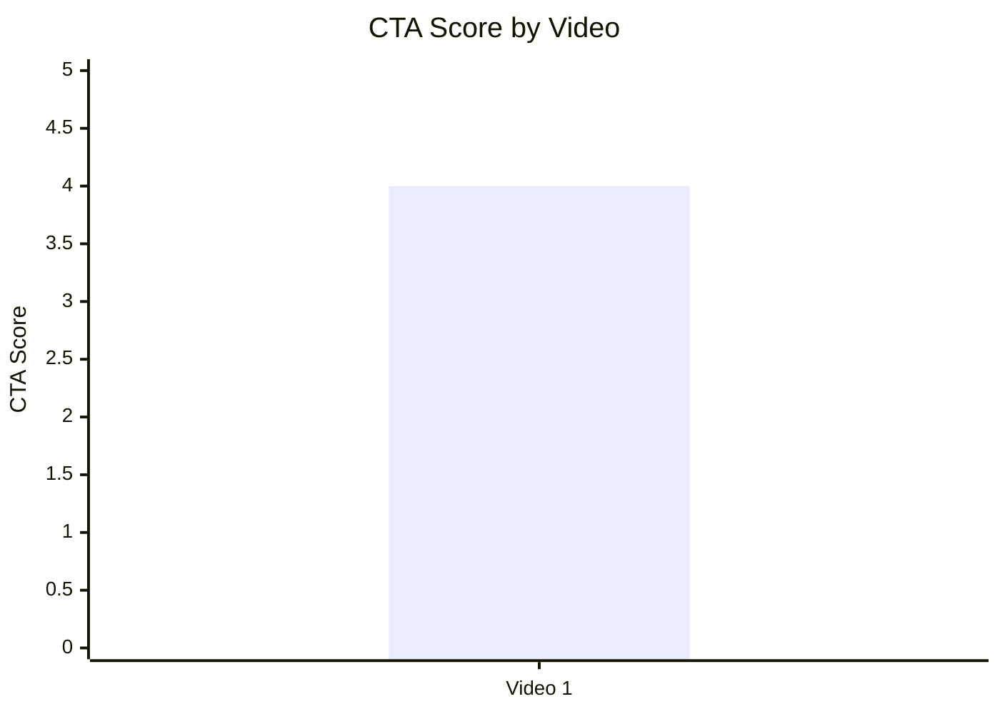

### 8.2. CTA count vs ER Public %

Scatter plot неможливо інтерпретувати через 1 відео: `INSUFFICIENT_DATA`.

| Video | CTA count | ER Public % | Interpretation |
|---|---:|---:|---|
| Video 1 | 4 | 10.17 | Один кейс; не можна стверджувати зв’язок CTA count із ER |

### 8.3. CTA features heatmap

| Video | Comment prompt | Subscribe | Like | Bell | Next video bridge |
|---|---|---|---|---|---|
| Video 1 | ✅ | ⚠️ PARTLY | ❌ | ❌ | ✅ |

Практичний висновок: найсильніше CTA-поле — comment prompt / discussion prompt. Прямі like та bell CTA не використовуються.

---

## 9. Графіки реклами / інтеграцій

Advertising graphs skipped: no full advertising integrations detected.

| Video | Ad detected | Ad type | Ad load % | First ad position % | Ad integration score | Notes |
|---|---|---|---:|---:|---:|---|
| Video 1 | PARTIAL_DATA | SELF_PROMO | N/A | N/A | N/A | Patreon / BuyMeACoffee у description; sponsor integration не виявлено |

Практичний висновок: рекламне навантаження не можна оцінити як фактор результативності. Для майбутніх звітів треба фіксувати `ad_load_percent`, `first_ad_relative_position_percent`, `ad_integration_score`.

---

## 10. Графіки аудіо

### 10.1. Audio score by video

- Назва графіка: Audio score by video
- Яке питання він відповідає: наскільки сильна аудіо-подача?
- Які поля використовуються: `video_label`, `audio_score`
- Тип графіка: Mermaid bar chart
- Що видно з графіка: audio score приблизно 4.2/5 на основі Audio Analysis.
- Практичний висновок: сильна емоційна подача може бути частиною retention mechanic, але зв’язок не доведений через 1 відео.

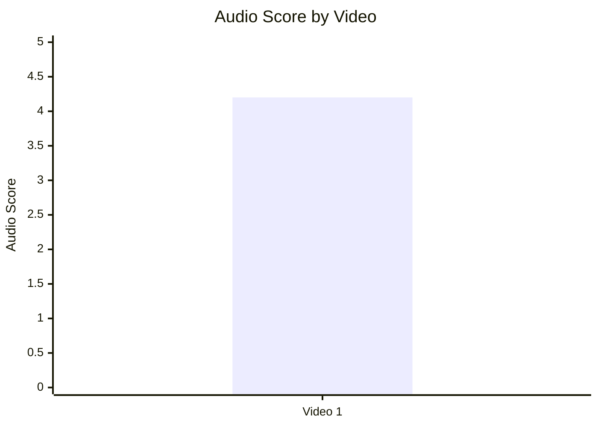

### 10.2. Audio score vs Overall Score

Scatter plot неможливо інтерпретувати через 1 відео: `INSUFFICIENT_DATA`.

| Video | Audio Score | Overall Score | Interpretation |
|---|---:|---:|---|
| Video 1 | 4.2 | 4.4 | Один кейс; зв’язок не оцінюється |

---

## 11. Графіки коментарів

### 11.1. Sentiment distribution

Stacked bar chart не будується: у звіті немає відсотків `positive_percent`, `negative_percent`, `mixed_percent`, `neutral_percent`, `question_percent`, `request_percent`.

| Video | Dominant sentiment | Positive % | Negative % | Mixed % | Neutral % | Question % | Request % |
|---|---|---:|---:|---:|---:|---:|---:|
| Video 1 | Polarized but highly engaged | N/A | N/A | N/A | N/A | N/A | N/A |

### 11.2. Comment resonance score by video

Графік не будується: числового `comment_resonance_score` немає.

| Video | Comment resonance score | Evidence |
|---|---:|---|
| Video 1 | N/A | 4,108 comments; strong debate-driven discussion |

### 11.3. Top comment clusters

- Назва графіка: Top comment clusters
- Яке питання він відповідає: які теми найчастіше провокують реакцію?
- Які поля використовуються: cluster name, intensity
- Тип графіка: таблиця замість bar chart, бо немає точних count/percent.
- Що видно з графіка: головний кластер — anti-Russian imperialism / historical debate.
- Практичний висновок: для майбутніх відео варто тестувати теми з високою історичною ідентичністю та conflict framing.

| Cluster | Інтенсивність | Практичний висновок |
|---|---|---|
| Anti-Russian imperialism | Дуже висока | Сильний identity-based resonance |
| Finland historical discourse | Висока | Коментарі стають довгими discussion threads |
| Debate on NATO | Висока | Тема напряму пов’язана з title/search intent |
| Counter-arguments / pushback | Середня | Поляризація підсилює коментарі |
| Meta-discussion about propaganda | Висока | Добре працює для audience retention у коментарях |

---

## 12. Графіки score-системи

### 12.1. Overall score by video

- Назва графіка: Overall score by video
- Яке питання він відповідає: який загальний score відео?
- Які поля використовуються: `video_label`, `overall_video_score`
- Тип графіка: Mermaid bar chart
- Що видно з графіка: Video 1 має 4.4/5.
- Практичний висновок: це сильний baseline, але не comparative winner через одну точку.

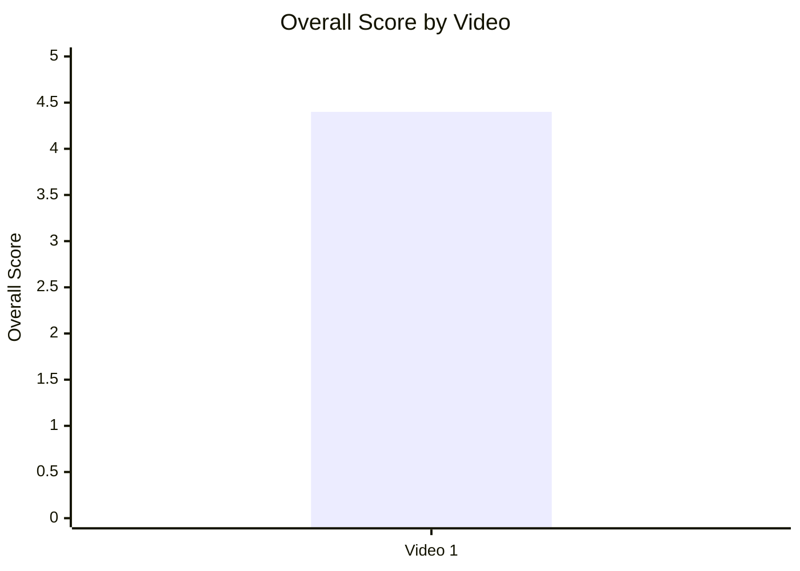

### 12.2. Score breakdown heatmap

| Video | Hook | Structure | Value Density | Audio | CTA | Ad | Comments | Replicability | Overall |
|---|---:|---:|---:|---:|---:|---:|---:|---:|---:|
| Video 1 | 5 | 4 | 5 | 4.2 | 4 | N/A | N/A | N/A | 4.4 |

Умовна heatmap-інтерпретація:

| Score | Meaning |
|---:|---|
| 5 | Дуже сильна зона |
| 4–4.9 | Сильна зона |
| 3–3.9 | Середня зона |
| <3 | Слабка зона |
| N/A | Даних немає |

Практичний висновок: найбільші сильні сторони — hook і value density. Найбільша прогалина в даних — відсутність числового comment resonance та replicability score.

### 12.3. Strengths vs weaknesses count

- Назва графіка: Strengths vs weaknesses count
- Яке питання він відповідає: скільки сильних механік і слабких можливостей зафіксовано?
- Які поля використовуються: кількість success mechanics, кількість missed opportunities
- Тип графіка: Mermaid bar chart
- Що видно з графіка: у звіті 7 success mechanics і 5 weaknesses.
- Практичний висновок: відео має більше зафіксованих сильних механік, ніж слабких місць.

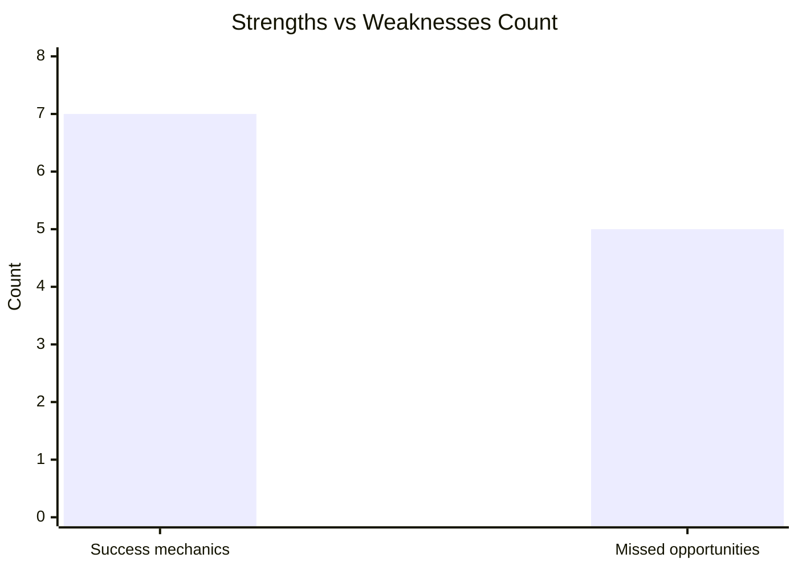

---

## 13. Кореляції та патерни

Correlation analysis skipped: fewer than 5 comparable videos.

| Pair | Correlation / Pattern | Strength | Interpretation | Confidence |
|---|---:|---|---|---|
| hook_score → overall_video_score | NOT_APPLICABLE | N/A | Потрібно мінімум 5 відео | LOW |
| value_density_score → er_public_percent | NOT_APPLICABLE | N/A | Потрібно мінімум 5 відео | LOW |
| cta_score → comment_rate_percent | NOT_APPLICABLE | N/A | Потрібно мінімум 5 відео | LOW |
| comment_resonance_score → er_public_percent | NOT_APPLICABLE | N/A | Немає score і замало відео | LOW |
| views_per_day → er_public_percent | NOT_APPLICABLE | N/A | Потрібно мінімум 5 відео | LOW |
| ad_load_percent → er_public_percent | NOT_APPLICABLE | N/A | Немає ad_load_percent | LOW |
| time_to_first_value_seconds → overall_video_score | NOT_APPLICABLE | N/A | Потрібно мінімум 5 відео | LOW |

Попередній описовий патерн: Video 1 поєднує високий conflict hook, високий ER Public і сильну дискусійність, але це не можна називати кореляцією.

---

## 14. Висновки для контент-стратегії

| Спостереження | Дані / графік | Що це означає | Що робити |
|---|---|---|---|
| Conflict hook має високий score | Hook score 5/5 | Старт через публічний конфлікт добре задає stakes | Тестувати response-video до великих creator controversies |
| Відео має сильний ER Public | ER Public 10.17% | Тема провокує не тільки перегляд, а й реакцію | Робити follow-up теми з comment prompt |
| Коментарі мають високу глибину | 4,108 comments; довгі debate threads | Аудиторія готова до deep-dive дискусій | Додавати pinned question для структурованого збору реакцій |
| CTA не перевантажує відео | CTA score 4/5 | Можна інтегрувати CTA після value block без шкоди | Тестувати чіткіші subscribe / next video CTA |
| End screen CTR слабкий | 0.2% у вихідному аналізі | Session continuation недовикористаний | Робити сильніший end-screen bridge |
| Рекламне навантаження не оцінюється | ad_load_percent = N/A | Немає даних для впливу self-promo на ER | У наступних звітах фіксувати ad duration і relative position |

---

## 15. Що тестувати далі

| Тест | Гіпотеза | На яких даних базується | Як виміряти | Пріоритет |
|---|---|---|---|---|
| Response-video до великого автора | Конфлікт із відомим creator підвищує search intent і ER | Video 1: Johnny Harris controversy, ER 10.17% | Views/day, ER Public %, search traffic | HIGH |
| Shorter cut 30–40 min | Стиснення зменшить fatigue без втрати value density | Weakness: runtime 56:29, AVD 12:24 | AVD %, retention, ER | HIGH |
| Pinned comment із питанням | Структурований comment prompt збільшить якість дискусії | Коментарі вже є сильним драйвером | Comment rate %, replies per top comment | HIGH |
| Stronger end-screen bridge | Покращить session continuation | End screen CTR 0.2% | End screen CTR, watch next video rate | HIGH |
| Hook type A/B: CONFLICT vs CURIOSITY_GAP | Можливо, curiosity hook дасть ширший reach | Current hook type = CONFLICT | CTR, views/day, first 30 sec retention | MEDIUM |
| CTA на підписку після першого payoff | Може збільшити subscriber conversion без overload | Subscribers gained +3.1K, CTA score 4 | Subscribers gained per 1k views | MEDIUM |
| Серія про “misread Russia” | Тема має strong identity resonance | Top clusters: propaganda, imperialism, NATO | Returning viewers, playlist starts | HIGH |

---

## 16. Дані для експорту в таблицю / CSV

| video_label | title | format_group | views | likes | comments_count | subscribers | views_per_day | like_rate_percent | comment_rate_percent | er_public_percent | views_per_1k_subs | likes_per_1k_views | comments_per_1k_views | avg_view_duration | subscribers_gained | hook_type | hook_score | cta_count | cta_score | ad_load_percent | ad_integration_score | audio_score | comment_resonance_score | overall_video_score | top_success_mechanic | top_missed_opportunity |
|---|---|---|---:|---:|---:|---:|---:|---:|---:|---:|---:|---:|---:|---|---:|---|---:|---:|---:|---:|---:|---:|---:|---:|---|---|
| Video 1 | Why Johnny Harris’s video about 'Nato Expansion' got backlash | LONG_20_PLUS_MIN | 180201 | 14226 | 4108 | 19100 | 354.03 | 7.89 | 2.28 | 10.17 | 9435 | 78.9 | 22.8 | 12:24 | 3100 | CONFLICT | 5 | 4 | 4 | N/A | N/A | 4.2 | N/A | 4.4 | Piggybacking on viral controversy | Excessive runtime |
