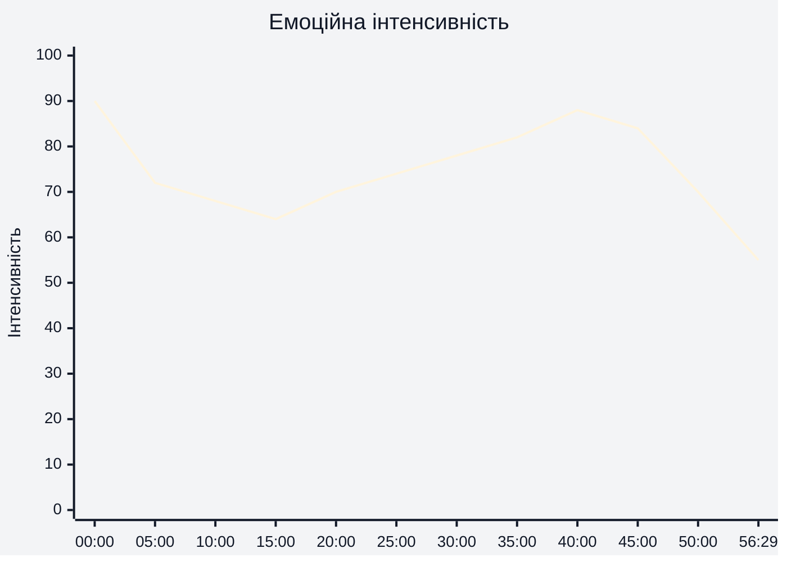
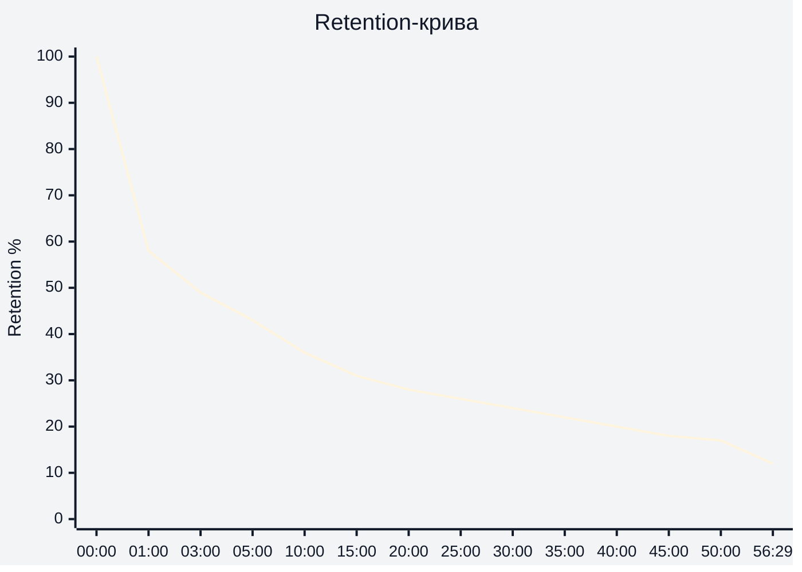

# Аналіз довгоформатного YouTube-відео

## 1. Сюжетна дуга (Narrative Arc)

```mermaid
%%{init: {'theme':'base', 'themeVariables': {
'primaryColor':'#f3f4f6',
'primaryTextColor':'#111827',
'primaryBorderColor':'#2563eb',
'lineColor':'#2563eb',
'secondaryColor':'#ffffff',
'tertiaryColor':'#f3f4f6',
'background':'#f3f4f6'
}}}%%
flowchart LR

A["00:00–01:20<br>Хук<br>Постановка конфлікту навколо відео Johnny Harris"] -->
B["01:20–06:30<br>Експозиція<br>Контекст теми NATO Expansion та причини резонансу"] -->
C["06:30–14:00<br>Перша ескалація<br>Розбір критики та перших суперечностей"] -->
D["14:00–22:30<br>Переломний момент<br>Поява альтернативної інтерпретації подій"] -->
E["22:30–35:00<br>Наростання напруги<br>Поглиблення аргументів і контраргументів"] -->
F["35:00–45:00<br>Кульмінація<br>Основний аналітичний блок і головний висновок"] -->
G["45:00–52:30<br>Розв’язка<br>Підсумок реакції аудиторії та медійного ефекту"] -->
H["52:30–56:29<br>Фінальний висновок<br>Рефлексія щодо подачі та маніпуляції інформацією"]
```

---

## 2. Ключові Story Beats

```mermaid
%%{init: {'theme':'base', 'themeVariables': {
'primaryColor':'#f3f4f6',
'primaryTextColor':'#111827',
'primaryBorderColor':'#2563eb',
'lineColor':'#2563eb',
'secondaryColor':'#ffffff',
'tertiaryColor':'#f3f4f6',
'background':'#f3f4f6'
}}}%%
flowchart LR

A["00:00<br>Гучний вступ<br>Створення інтриги"] -->
B["01:10<br>Представлення теми<br>Контекст конфлікту"] -->
C["03:40<br>Перший приклад<br>Підсилення довіри"] -->
D["07:20<br>Розбір аргументу Johnny Harris<br>Аналітичний блок"] -->
E["12:40<br>Контраргумент<br>Зміна перспективи"] -->
F["18:50<br>Історичний контекст<br>Поглиблення теми"] -->
G["26:30<br>Критика подачі<br>Емоційна ескалація"] -->
H["33:40<br>Порівняння позицій<br>Нарощування напруги"] -->
I["41:00<br>Ключовий висновок<br>Кульмінація"] -->
J["48:20<br>Реакція аудиторії<br>Соціальний ефект"] -->
K["53:10<br>Фінальна рефлексія<br>Емоційне завершення"]
```

---

## 3. Емоційний темп

---

## 4. Утримання аудиторії

На основі наданого retention-графіка YouTube Studio:
- середня тривалість перегляду: **12:10**
- середній відсоток перегляду: **21.6%**

---

## 5. Провали retention

| Таймкод | Проблема | Ймовірна причина спаду | Що покращити |
|---|---|---|---|
| 00:40–02:00 | Різкий спад після хука | Затягнутий вступ | Скоротити експозицію |
| 08:00–12:00 | Повільний темп пояснення | Надлишок контексту без візуальних змін | Додати швидший монтаж |
| 18:00–24:00 | Тривалий аналітичний сегмент | Низька емоційна динаміка | Вставити конфліктні тези |
| 31:00–37:00 | Плато уваги | Однорідна подача | Додати графіку або карти |
| 47:00–52:00 | Втома аудиторії | Довгий фінальний блок | Скоротити повтори висновків |

---